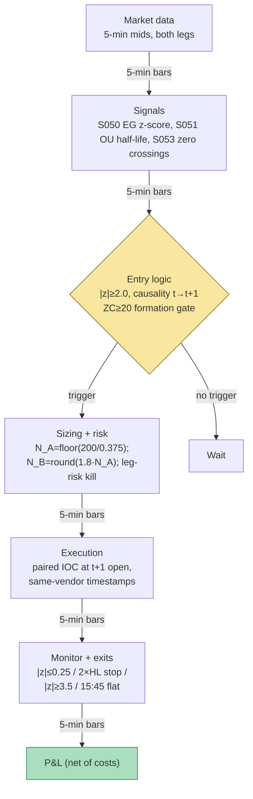

## Stage 107/200 — T007: Cointegration Z-Score Pairs

*Batch TB1 · Strategy 7/100 · Signals S050, S051, S053*

### T1. One-line verdict

| | |
|---|---|
| **Style** | Intraday statistical arbitrage — classic Engle–Granger pairs |
| **Edge source** | A cointegrated spread mean-reverts; the Ornstein–Uhlenbeck (OU) half-life (S051) sets the holding clock, and the zero-crossing count (S053) filters for pairs whose reversion is fast and reliable |
| **Typical holding period** | 1–2 OU half-lives (example: 25-min half-life → 50-min max hold; the worked example exits at 50 min) |
| **Capacity hint** | Low — a handful of pairs, two-leg costs on every round trip; intraday half-lives multiply the cost drag the daily literature already documents |
| **Build-or-buy in one line** | Build the EG/OU/zero-crossing stack yourself (a weekend in statsmodels); buy only clean corporate-action-adjusted bars — the pair *selection* is the product, and nobody sells a good one |

### T2. Full mechanics

**Universe & session.** Pre-selected pairs from the same sector (example: two liquid large-caps, or an ETF vs a tight basket), both with price > $20, ADV > 2M shares, borrowable, same listing session. Session: RTH 09:45–15:45 ET; **no new entries after 15:00** (`example`); flatten all by 15:45. Formation uses only prior days — never the trading day.

**Formation (overnight, frozen before the open).** On 60 RTH days of 5-minute mid log-prices (`example`): (1) estimate the cointegrating regression log P^A_t = α + β·log P^B_t + ε_t (S050); β̂ is the **hedge ratio** — a long-spread position holds 1 unit of A against β̂ units of B; (2) run the Augmented Dickey–Fuller (ADF) test on the residual ε̂_t using **Engle–Granger/MacKinnon critical values** (not ordinary t-tables — the residual comes from an estimated regression); require rejection at 5% (`example`); (3) fit the discrete OU: ΔS_t = a + b·S_{t−1} + e_t → κ̂ = −ln(1+b̂)/Δt, half-life t̂_{1/2} = ln 2/κ̂ (S051); admit only pairs with t̂_{1/2} in the 10–90 minute band (`example` — tradeable after costs, per S051's HL floor/ceiling logic); (4) zero-crossing quality filter (S053): ZC = Σ 1[sign(S_{t−1})·sign(S_t) < 0] over the formation window; require ZC ≥ 20 (`example`) — pairs that cross zero often revert fast and tight; excursion-prone pairs are rejected. When scanning many candidates, apply a multiple-testing correction (Bonferroni/Holm or FDR (false discovery rate) — S050's mandatory rule) so lucky coincidences don't flood the book.

**Entry rule.** Intraday, on 5-minute bars: spread S_t = P^A_t − α̂ − β̂·P^B_t; z_t = (S_t − μ̂_{S,t})/(σ̂_{S,t}) with rolling μ̂, σ̂ from a causal window ending at *t* (the formation coefficients stay frozen — only the z-score's mean/scale roll). **Short the spread** (short A, long B) if z_t ≥ +2.0 (`example`); **long the spread** if z_t ≤ −2.0. **Causal timing:** z_t is computed at bar *t*'s close; both legs are lifted/hit at the *open of bar t+1* — simultaneously, or not at all.

**Exit rule.** First of: (1) mean reversion: z_t crosses toward zero past |z| ≤ 0.25 (`example`); (2) **OU time stop:** hold no longer than 2 × t̂_{1/2} (`example` — the worked example exits here); (3) stop-loss: |z_t| ≥ 3.5 against the position (`example` — the relationship may have broken); (4) session flatten 15:45.

**Position sizing.** Dollar risk on the spread: stop distance in spread-$ per 1 share of A is s_stop = (z_stop − z_entry)·σ̂ = (3.5 − 2.0) × 0.25 = $0.375 (`example`); N_A = ⌊R / 0.375⌋ with R = $200 (`example`) → 533 shares; N_B = round(β̂·N_A) = 959. (Dollar-neutral variant: scale notionals so N_A·P_A ≈ N_B·P_B and convert the stop to that unit — the residual-risk form above is the worked example's.)

**Risk limits.** Max 6 concurrent pairs; two-leg fills submitted together — if one leg rejects, cancel the other immediately (leg-risk kill); halt on either name → flatten both legs; daily loss stop −$1,000 (`examples`).

**Cost model.** Spread $0.02 per leg (pay half-spread on all four fills); commission $0.005/share each way; borrow stubbed at zero for the one-day example (live: model the borrow fee explicitly — hard-to-borrow names are excluded); no slippage beyond the t+1 open fill. Two-leg costs dominate short half-lives — this is the central arithmetic of the strategy.

**Execution sketch.** Paired marketable limits at bar t+1 open (both legs IOC (immediate-or-cancel), same timestamp); leg-risk kill on partial fill; participation cap ≤ 10% of each leg's 5-min volume. Spread computation must use the **same vendor timestamps** on both legs — mixed SIP vs proprietary feeds will fake cointegration (Grok's Q2 warning, kept as a design rule).

### T3. Signals it consumes

| Signal | Role | Weight / logic |
|---|---|---|
| S050 — Engle–Granger z-score | **Primary trigger** (direction + entry/exit) | Enter at \|z\| ≥ 2.0; exit at \|z\| ≤ 0.25; stop at \|z\| ≥ 3.5 (`examples`) |
| S051 — OU half-life | **Holding clock** (timing overlay) | Admit pairs with HL in 10–90 min; time-stop at 2 × HL (`examples`) |
| S053 — Zero crossings | **Quality filter** (pair selection) | Trade only pairs with ZC ≥ 20 on formation (`example`); rolling ZC as a live health monitor — collapse → cut the pair |

Combination pseudocode (≤25 lines):

```
# overnight (formation, frozen): for each candidate pair
beta, alpha = OLS(log PA ~ log PB, 60 RTH days of 5-min mids)   # S050
assert ADF(resid, critical="engle-granger") rejects at 5%
hl = log(2)/kappa from AR(1): dS = a + b*S_lag                   # S051
ZC = count(sign flips of S over formation)                       # S053
admit if 10 <= hl <= 90 min and ZC >= 20                          # example gates
# intraday, per 5-min bar close t (causal; fills at t+1 open)
S = PA[t] - alpha - beta*PB[t]; z = (S - rollmean(S))/(rollstd(S))
if z >= 2.0:  short spread: short N_A A, long round(beta*N_A) B
elif z <= -2.0: long spread (mirror)
# exits each bar: |z|<=0.25 -> out; |z|>=3.5 -> stop; held>=2*hl -> time stop
# 15:45 -> flatten; halt on either leg -> flatten both
```

### T4. Worked example — numbers + P&L (SYNTHETIC)

Setup: fictional same-sector large caps **A** (~$72) and **B** (~$40), synthetic 5-minute bars, **seed 107**. Formation (frozen): β̂ = 1.80, μ̂ = 0, σ̂ = 0.25, OU half-life **25 min** (in the 10–90 band ✓), ZC = **31** (≥ 20 ✓), ADF rejects at 5%.

Entry at the signal bar's close: S_0 = +0.500 → z_0 = **+2.00** (≥ +2.0 ✓) → **short the spread**: short **533 A**, long **959 B** (N_A = ⌊200/0.375⌋; N_B = round(1.80 × 533)). Fills at the next bar's open (causal t→t+1): **short A @ 72.3954** (bid), **long B @ 40.0123** (ask).

The spread mean-reverts but slowly: at bar 10 (50 min = **2 × half-life**) z = +0.62 — not yet at the 0.25 exit, so the **OU time stop fires**. Exit fills: **cover A @ 72.1624** (ask), **sell B @ 39.9882** (bid).

| Line | Calculation | $ |
|---|---|---|
| Leg A (short 533) | 533 × (72.3954 − 72.1624) | +124.18 |
| Leg B (long 959) | 959 × (39.9882 − 40.0123) | −23.13 |
| Gross P&L | 124.18 − 23.13 | +101.05 |
| Spread cost | half-spread on all four fills (in the fills) | (in gross) |
| Commission | (533 + 959) × 2 × $0.005 | −14.92 |
| **Net P&L** | 101.05 − 14.92 | **+86.13** |

(Fills shown to 4 dp for audit; the chart plots this exact spread path with the +2.0/+0.25/+3.5 lines, entry/exit markers, and the net P&L stepping to +$86.13 at the time-stop exit.)

Economic read, line by line: the A leg is the alpha (+$124.18 of mean reversion); the B leg is the hedge doing its job and costing −$23.13 (β̂ was the cointegrating offset, not a second alpha); four-way fees eat $14.92 — nearly 15% of gross. Had z run to the 3.5 stop instead, the spread loss would be ≈ $200 plus the same ~$15 fees and extra spread — about **−$220** against a $200 risk budget, the two-leg cost drag in miniature.

**Where the example is optimistic.** The spread follows a clean OU path with no jumps, no earnings, no halt — the formation ADF's promise holds perfectly. Both legs fill instantly at the bar-1 open with zero leg risk (in reality one leg often slips or rejects, and the "paired" fill is a fiction on fast tapes). Borrow is stubbed at zero; a real short in A costs carry. The half-life is estimated perfectly and the time stop fires exactly at 2×HL. Most flattering: the example never tests the 3.5 stop, which is where live pairs books actually bleed — Do & Faff's decay is precisely the accumulation of spreads that don't come back.

### T5. Data & infra — what must run

**Pipeline inventory.** Overnight/09:00: load frozen (α̂, β̂), ADF pass/fail, κ̂, t̂_{1/2}, ZC per pair — **never re-estimate β on the live bar** (Grok's Q2 rule). RTH: update S_t, causal rolling μ̂/σ̂, z_t on 5-min mids; entry at |z| ≥ 2; the two-leg fill-or-cancel FSM; 15:45 flatten. Reference data: splits, dividends, halt flags — a corporate action that isn't adjusted breaks the spread silently.

**M5 Max feasibility: trivial-to-feasible (Tier M+, ~40–70 h ≈ $6,000–10,500 loaded-cost estimate).** Per cost-model §2: tens of pairs × 1-minute bars is noise; the overnight EG screen over a few hundred candidates is minutes in statsmodels/polars. RAM 50–200 MB plus 1–2 sessions of history; disk 10–50 MB/day. Bottleneck: pair *selection* research (the formation screen), not compute. A full 2,000-stock daily cointegration screen is the heavier variant — still fine overnight (§3: 3,000 stocks × 10y daily ≈ 2–5 GB).

**Feed-outage safe-mode.** One leg missing quotes > 5 s → flatten both legs immediately. Halt on either name → flatten. If the overnight formation job failed → the strategy stays dark (no frozen β̂, no trading). After any crash: flat unless the on-disk ledger says otherwise; no entries until 30 s of clean sequence on both legs. Spread timestamps must come from one vendor — mixed feeds fake cointegration.

### T6. Buy vs build

| Option | What you get | Indicative price | Gains | Loses |
|---|---|---|---|---|
| Tier 0: Stooq / Yahoo | Daily bars | ~$0, indicative — verify before budgeting | Free EG/OU/ZC research on daily pairs | No intraday z-score; splits need care |
| Tier 1: Polygon / Alpaca SIP | 1-min bars, corporate actions | ~$30–200/mo, indicative — verify before budgeting | Honest intraday formation + z-score; the strategy's full data need | — |
| Tier 2: Databento equities | Exchange-timestamped bars | ~$200/mo + usage, indicative — verify before budgeting | Cleaner two-leg timestamp alignment | Unnecessary unless you trade sub-5-min holds |
| Prime-broker pairs analytics | Precomputed screens | Institutional $$$$, indicative — verify before budgeting | Someone else's pair list | You can't audit their formation; the list is the edge |

**Verdict: build on Tier 1.** The EG regression, OU fit, and zero-crossing count are a weekend in Python; the only thing worth buying is clean, split-adjusted bars. Never buy a "pairs list" — an unaudited formation is someone else's overfit. Crossover: buy Databento only if you move to 1-minute holds where leg-timestamp alignment becomes the binding constraint.

### T7. Success-ratio evidence

| Study / source | Market & period | Metric | Before/after cost | Caveat |
|---|---|---|---|---|
| Gatev, Goetzmann & Rouwenhorst (2006), *Review of Financial Studies* | US, 1962–2002, daily distance pairs | ~11% annualized excess, self-financing | After conservative cost estimates | Pre-crowding benchmark, not the current one |
| Do & Faff (2010), *Financial Analysts Journal* | US, 1962–2009 | Monthly excess: 0.86% → 0.37% → 0.24% across subperiods | Before explicit costs | The decay finding applies to pairs generally |
| Do & Faff (2012), *J. Financial Research* 35(2) | US, 1963–2009 | Refined industry pairs: ~30 bps/mo risk-adjusted; top-30% largest: ~24 bps/mo; **largely unprofitable post-2002** | After commissions + market impact + short fees | The crowding result — verified via the published abstract |
| Rad, Low & Faff (2016), *Quantitative Finance* | US, 1962–2014 | Cointegration: 0.85%/mo gross → 0.33%/mo net (Sharpe 0.35); distance 0.91% → 0.38%; copula 0.43% → 0.05% | Both, side by side | Their 1–7 bps cost model; from 2009 opportunity scarcity bites |

Grok's Q-TB1-3 added color I keep as leads (unverified): an independent GGR replication through 2020 finding post-GFC monthly excess 0.04–0.07%, insignificant, before full costs; Jacobs & Weber (2015) ~8–9% annualized gross across 34 countries (gross, limits-to-arbitrage dependent). **Bottom line for ≤$1M paper:** the daily evidence says a few tens of bps/month net a decade ago, crowded toward zero since the early 2000s — and *none* of those papers validate intraday OU half-life exits, which add a whole extra layer of two-leg costs. A small paper book should treat this as a research harness for learning cointegration mechanics, not as an expected-profit center. An institutional desk runs pairs as a slow, diversified, low-Sharpe relative-value sleeve — the opposite of a 25-minute half-life day-trade.

### T8. Failure modes

1. **Cointegration breakdown.** The economic link snaps (M&A, earnings, regime change); the spread trends to the 3.5 stop and beyond. *Mitigation:* the stop itself, plus the rolling-ZC health monitor — a collapsing crossing rate cuts the pair before the stop does.
2. **Two-leg cost dominance.** Four fills × spread + commission on a 25-minute hold: costs are a fixed tax on a small expected move. *Mitigation:* the 10–90 min HL band is a cost filter — shorter half-lives are untradable after costs (S051's HL floor).
3. **Leg risk.** One leg fills, the other rejects — you're suddenly directionally exposed. *Mitigation:* paired IOC submission with immediate cancel of the filled leg's sibling; flatten on any single-leg quote hole > 5 s.
4. **β̂ instability intraday.** The formation hedge ratio drifts; the "spread" you're trading is mismeasured. *Mitigation:* never re-estimate β intraday (that chases noise); re-screen nightly and drop pairs whose rolling β deviates.
5. **Asynchronous prints / timestamp mixing.** A stale print on one leg prints a phantom z = 2.5. *Mitigation:* same-vendor timestamps on both legs; bar-merge on exchange timestamps, not arrival time.
6. **Borrow and corporate actions.** Hard-to-borrow shorts, dividends, and splits silently break the spread economics. *Mitigation:* borrow-flags and action-adjusted bars in the reference pipeline; exclude hard-to-borrow names.
7. **Overfit formation.** 60 days, thousands of candidate pairs, ADF at 5% — multiple testing guarantees false cointegrations. *Mitigation:* Bonferroni/Holm or FDR correction (S050's mandatory rule); the ZC ≥ 20 filter as a second, economically-motivated screen.

### T9. Visuals




### T10. Sources

1. Engle, R. F. & Granger, C. W. J. (1987), "Co-integration and Error Correction: Representation, Estimation, and Testing," *Econometrica* 55(2) — https://ideas.repec.org/a/ecm/emetrp/v55y1987i2p251-76.html. (Cointegration foundation.)
2. Gatev, E., Goetzmann, W. N. & Rouwenhorst, K. G. (2006), "Pairs Trading: Performance of a Relative-Value Arbitrage Rule," *Review of Financial Studies* 19(3): 797–827 — https://ideas.repec.org/a/oup/rfinst/v19y2006i3p797-827.html. (Daily distance-pairs benchmark, ~11% annualized pre-crowding.)
3. Do, B. & Faff, R. (2012), "Are Pairs Trading Profits Robust to Trading Costs?", *Journal of Financial Research* 35(2), 261–287. https://strathprints.strath.ac.uk/41722/ (≈30 bps/mo refined industry pairs net; largely unprofitable post-2002.)
4. Rad, H., Low, R. K. Y. & Faff, R. (2016), "The Profitability of Pairs Trading Strategies: Distance, Cointegration and Copula Methods," *Quantitative Finance*. https://pure.bond.edu.au/ws/portalfiles/portal/36339487/AM_The_profitability_of_pairs_trading_strategies.pdf (Cointegration 0.85%→0.33%/mo gross→net.)

**Unverified leads** (Grok Q-TB1-1/3, 2026-09-10): the Q1 worked example's arithmetic was internally inconsistent (QC note — this chapter's example is independently constructed and checked); the half-life numeric in Grok's Q1 example did not render (this chapter uses 25 min as its own `example`); post-2020 GGR replication at 0.04–0.07%/mo gross (unverified); Jacobs & Weber (2015) 34-country ~8–9% annualized gross (unverified detail); one chatbot-cited intraday pairs study at ~50.5% annualized / Sharpe ~8.14 "after its cost model" (flagged as dubious in S050's chapter — not used).

*Source log: Grok answered Q-TB1-1..3 (2026-09-10); all claims independently verified or labeled unverified.*
