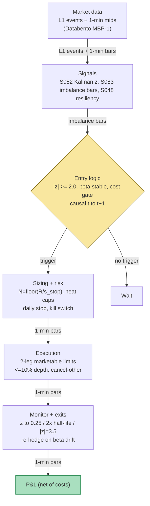

## Stage 108/200 — T008: Kalman Dynamic-Hedge Pairs

*Batch TB1 · Strategy 8/100 · Signals S052, S083, S048*

### T1. One-line verdict

| | |
|---|---|
| **Style** | Intraday statistical arbitrage (pairs), adaptive hedge ratio |
| **Edge source** | Temporary divergences of a cointegrated pair from a *moving* fair value, hedge ratio re-estimated every bar by a Kalman filter instead of one frozen OLS regression |
| **Typical holding period** | Minutes to a few hours (resiliency half-life scale) |
| **Capacity hint** | Low — two-leg costs dominate short half-lives; dozens of pairs at paper scale |
| **Build-or-buy in one line** | Build the filter and the pair book (standard recursion + execution state machine); buy the clean L1/1-min data it consumes — you cannot buy your own Q-tuning (Q = the Kalman process-noise covariance, which sets how fast the hedge ratio is allowed to adapt) |

### T2. Full mechanics

**Jargon first.** A *pair* is two related securities (e.g. two same-sector large caps) whose prices move together. The *hedge ratio* β is how many shares of leg B you hold per share of leg A to make the pair market-neutral. *Cointegration* means the spread between them is stationary (mean-reverting) even though each leg wanders. A *Kalman filter* recursively re-estimates a hidden quantity (here β) each bar, weighting new evidence via the *Kalman gain*. The *innovation* e_t is the prediction error — leg B's print minus the filter's expectation — the raw material of the trade signal. *Imbalance bars* (S083) close when signed order-flow accumulation hits a threshold — equal information per bar, not equal clock time. *Resiliency* (S048) is how fast the book refills after a liquidity shock — it sets the exit clock.

**Universe & session.** Same-sector US large caps with 20-day ADV ≥ $20M, median quoted spread ≤ 5 bps, both legs shortable (live: located-borrow gate; paper: stub). Pre-screen on a 60-RTH-day formation window: Engle–Granger ADF rejects the unit root at 5% (*example* gate), and the Kalman-implied innovation half-life sits in the 10–90 minute band (*example*). Exclude earnings-week names, halts, and the first/last 15 minutes of RTH (09:45–15:45 ET session, no new entries after 15:00, flat 15:45 — *example*).

**Clock.** All signals are computed on **imbalance bars** (S083, *example* construction: tick-imbalance bars closing when |θ_T| ≥ E_0[T]·|E_0[θ]|, EWMA over trailing 50 bars). A bar is complete only when its close condition fires; features on bar *k* are tradable no earlier than bar *k+1*'s first trade — causal t→t+1 timing.

**Entry rule.** At each closed imbalance bar *k*, run the S052 Kalman update on 1-min mids: e_k = y_k − μ̂_k − β̂_k·x_k; z_k = e_k/√F_k. **Enter** (signal at *k*, fills at *k+1* open) when |z_k| ≥ 2.0 (*example*; + → short the spread, − → long) AND |β̂_k − β̂_{k−20}| < 0.05 (*example* teleport veto) AND trailing 1-day effective spread of both legs < 6 bps combined (*example* cost gate), with no existing position in the pair.

**Position sizing.** Dollar risk on the *spread*: stop at |z| = 3.5 ⇒ s_stop = 1.5·σ̂_k per share of A; N_A = ⌊R / s_stop⌋ with R = $200/trade (*example*), N_B = round(β̂_k·N_A). Portfolio: max 6 concurrent pairs, per-pair notional ≤ $150k, gross ≤ 1.5× equity on a $1M paper book (*example*).

**Exit rule (resiliency-gated).** First trigger wins: (1) convergence — z_k crosses back inside ±0.25 (*example*); (2) time stop — 2× the OU half-life on the innovation, capped at 4 hours (*example*); (3) stop-loss — |z_k| ≥ 3.5 (*example*); (4) resiliency overlay (S048): if more than 50% of the pair's own temporary impact is still unrecovered at the convergence exit (*example*), hold up to 2 more bars (*example*) into a refilled book; (5) session flatten 15:45. **Re-hedge:** if |β̂_k − β̂_entry| > 0.03 (*example*) mid-trade, resize leg B to round(β̂_k·N_A) — the adaptivity tax, paid in spread.

**Risk limits** (*example* unless noted). Daily loss stop −2% of book; per-pair stop −$250; kill switch on Kalman divergence (P_k growing 10× in 20 bars), a single-leg quote hole > 5 s (flatten both legs), or a halt in either name. Overnight: flat.

**Cost model** (illustrative convention from Grok's Q-TB1-1 shared spec, labeled lead): $0.005/share each way; half-spread paid on every fill (aggressive take); borrow stub ~$0 intraday (optimistic, see T4); no slippage beyond half-spread (optimistic, see T4). Applied explicitly below.

**Execution sketch.** Two marketable limit orders (one per leg) submitted simultaneously at the *k+1* open; participation ≤ 10% of visible depth (*example*); on reject/partial fill, cancel/flatten the other within 1 second (leg-risk kill — a half-pair is a directional bet, not a hedge). Any fill modeled at the signal bar's close is rejected by the harness.

### T3. Signals it consumes

| Signal | Role | Weight / logic |
|---|---|---|
| S052 — Kalman dynamic hedge ratio | **Primary trigger** | Entry on \|z_k\| ≥ 2.0; also supplies β̂_k for sizing and the re-hedge rule |
| S083 — Imbalance bars | **Clock / regime gate** | All features computed on imbalance-bar closes; no clock-time bars intraday |
| S048 — LOB resiliency | **Exit timer** | Convergence exits deferred while resiliency(t) > 0.5 (own impact unrecovered); time-stop scale from κ̂ |

Every listed signal exists in S001–S100. No other signals are used.

```pseudocode
# T008: on each closed imbalance bar k (causal: data <= k)
update_kalman(x[<=k], y[<=k]) -> β̂_k, μ̂_k, e_k, F_k, P_k
z_k = e_k / sqrt(F_k)
res_k = estimate_resiliency(book_snapshots[<=k])                  # S048: κ̂
if position is None:
    if abs(z_k) >= 2.0 \                                          # example
       and abs(β̂_k - β̂_{k-20}) < 0.05 \                          # example
       and eff_spread_cost(A, B) < 6bps:                         # example
        N_A = floor(R / (1.5 * sqrt(F_k))) ; N_B = round(β̂_k * N_A)
        submit_pair(MarketableLimits, at="next bar open")        # t -> t+1
else:
    if abs(β̂_k - β̂_entry) > 0.03:                               # example re-hedge
        resize leg B to round(β̂_k * N_A)
    if (abs(z_k) <= 0.25 and res_k.recovered) \                  # example
       or bars_held >= 2 * half_life \
       or abs(z_k) >= 3.5 \
       or clock >= "15:45":
        flatten both legs at next bar open
```

### T4. Worked example — numbers + P&L (SYNTHETIC)

All prices synthetic, **seed 108** (regenerable via `python3 batches/TB1/plot_T008.py`). Synthetic tickers SYN-A / SYN-B. The chart in T9 plots these exact trades.

Setup: formation β̂ ≈ 1.60; innovation σ̂_k = $0.30 per share of A; R = $200 (*example*). Stop |z| = 3.5 ⇒ s_stop = 1.5 × 0.30 = $0.45/share ⇒ N_A = ⌊200/0.45⌋ = **444**, N_B = round(1.60 × 444) = **710**. Fees $0.005/share each way.

**Trade T1 — short the spread, pays the adaptivity tax.** Bar 40 close: z = +2.00. Bar 41 open: short 444 A @ **150.59** (bid), long 710 B @ **93.76** (ask). Bar 60: β̂ drifts 1.60 → 1.64; re-hedge buys 18 B @ **93.30** (ask) → 728. Bar 88: z = +0.23 (inside ±0.25, book recovered) → exit: cover 444 A @ **149.28** (ask), sell 728 B @ **93.24** (bid).

| Line | Calc | $ |
|---|---|---|
| A leg (short) | 444 × (150.59 − 149.28) | +581.64 |
| B leg (original 710) | 710 × (93.24 − 93.76) | −369.20 |
| B leg (re-hedge 18) | 18 × (93.24 − 93.30) | −1.08 |
| Gross | 581.64 − 369.20 − 1.08 | +211.36 |
| Commissions | (444 + 710 + 18) × 2 × 0.005 | −11.72 |
| **Net T1** | | **+199.64** |

**Trade T2 — short the spread, stop-loss.** Bar 120: z = +2.00; fills short 444 A @ **150.59**, long 710 B @ **93.76**. The divergence is real: bar 152 prints z = +3.50 → stop: cover 444 A @ **151.06**, sell 710 B @ **93.74**. A leg: 444 × (150.59 − 151.06) = −208.68; B leg: 710 × (93.74 − 93.76) = −14.20; gross −222.88; fees −11.54; **net −234.42**.

**Trade T3 — long the spread, convergence.** Bar 175: z = −2.00; fills long 444 A @ **149.41**, short 710 B @ **93.74**. Bar 215: z = −0.23 → exit: sell 444 A @ **149.92**, cover 710 B @ **93.76**. A leg: 444 × (149.92 − 149.41) = +226.44; B leg: 710 × (93.74 − 93.76) = −14.20; gross +212.24; fees −11.54; **net +200.70**. Cumulative: **+165.92**.

**Where the example is optimistic.** Both legs fill simultaneously at the quoted touch — no partial fills, no leg-reject race, no queue effects (*simulated only — requires MBO/ITCH* for any queue claim). Borrow is stubbed to ~$0; a hard-to-borrow leg adds a daily fee the example ignores. The Kalman β̂ is frozen *within* each trade except the one scripted re-hedge; a live filter re-hedges continuously and every re-hedge pays spread again — T1's −$1.08 + $0.18 fees is the *minimum* adaptivity tax, not the typical one. The stop at z = 3.5 assumes a tradable print exists; in a real break the spread gaps through it. Resiliency always recovers in time for the exit — sometimes it doesn't, and you exit into your own impact.

### T5. Data & infra — what must run

**Pipeline inventory.** Pre-open: NYSE calendar + halt flags; load frozen pair list (ADF pass/fail, formation β̂, κ̂) from the overnight job. Intraday loop (09:45–15:45 ET): per-symbol ring buffers of 1-min mids (S052) + imbalance-bar builder on L1 events (S083) + L1 snapshots for the resiliency estimator (S048) — features stamped at closed bar *k*, intents queued for *k+1*. Post-close: persist the ledger, re-fit formation stats, recompute 50-bar imbalance EWMAs. Storage: 1-min bars for 500 symbols ≈ 50 MB/day (cost-model §4), archived freely; raw L1 recorded only for traded pairs (~2–8 GB/symbol-day) and rolled off after 30 days (*example*).

**M5 Max feasibility: feasible (Tier M+).** Per cost-model §2, a Python event loop sustains ~100–500k events/sec — a 20-name L1 book at ~1–5k touch events/sec/name is comfortable with polars batch recompute each bar; the Kalman update is microseconds per pair. RAM: hot state well under 2 GB (§3 working budget 77 GB); overnight re-fits for 200 pairs are minutes. Engineering: 40–100 h (Tier M+ harness, cost-model §5) ≈ $6,000–15,000 at $150/hr loaded cost — mostly the two-leg execution FSM and no-look-ahead backtest alignment, not the filter math. Bottleneck: feed jitter and timestamp hygiene, not CPU. Breaks at: full-tape L2 book rebuild or 500-pair universes — then Rust and per-symbol daily files.

**Feed-outage safe mode.** Single-leg quote hole > 5 s → flatten the pair immediately (a half-pair is an unapproved directional bet). Both legs stale → no new entries; existing positions held only if both legs last printed within 60 s, else flatten at last valid quotes and tag the session DEGRADED. Kalman divergence guard (P_k explosion) → freeze that pair's entries for the day. The ledger is the source of truth: restart flat and reload from disk — never from RAM. SIP-vs-direct timestamp mixing is banned on the spread input (it fakes cointegration); if the direct feed drops, the pair goes dark.

### T6. Buy vs build

| Option | What you get | Indicative price | Gains | Loses |
|---|---|---|---|---|
| Tier-0: Stooq/Alpaca IEX daily + SIP delayed | Daily bars, corporate actions | ~$0, *indicative — verify before budgeting* | Free pair screening history | No intraday imbalance bars, no honest fills |
| Tier-1: Polygon Stocks Advanced / Alpaca SIP | Real-time SIP trades+quotes, 1-min bars | ~$30–200/mo, *indicative — verify before budgeting* | Enough for the 1-min Kalman + resiliency snapshots on liquid names | SIP smears venue identity; imbalance-bar close rules degrade |
| Tier-2: Databento Standard (MBP-1) | Exchange-timestamped L1 events, honest imbalance bars | ~$200/mo + usage, *indicative — verify before budgeting* | The clock this strategy is designed on; replayable | Overkill for a 6-pair paper book; usage billing needs watching |
| Retail platform: QuantConnect paper | Research + paper broker, minute bars | ~$60–300/mo tiers, *indicative — verify before budgeting* | Fastest paper two-leg path | No true imbalance-bar clock; fills are modeled, not lived |
| Build in-house (Python + polars) | Filter, pair FSM, ledger, kill switch | 40–100 h ≈ $6,000–15,000 eng (loaded-cost estimate) | Your thresholds, your causality, auditable t→t+1 | You own every timestamp bug |

**Verdict: hybrid.** Buy Tier-1/2 data (Polygon for screening, Databento MBP-1 for the live imbalance clock), build the strategy. **Build if** the research question is adaptivity (Q-tuning, re-hedge rules) — no vendor sells your thresholds. **Buy if** you only want static OLS pairs (T007 covers that cheaper) or you need full-depth replay history (then buy Databento historical, don't record it). Crossover: once two-leg fills and borrow bind, the feed tier matters more than the filter.

### T7. Success-ratio evidence

Documented numbers are for *pairs trading generally*; the intraday Kalman variant has a thinner record — the bottom line says so.

| Source | Market / period | Metric | Before/after cost | Caveat |
|---|---|---|---|---|
| Gatev, Goetzmann & Rouwenhorst (2006) | US, 1962–2002, daily distance | ~11% annualized excess (Grok Q-TB1-3 lead; the paper's headline) | Before full costs; 1-day wait blunts bounce | Pre-crowding benchmark, not current |
| Do & Faff (2012) | US, 1963–2009 | Best intra-industry four: +0.29%/mo net (~3.5% ann.); plain 20-pair rule unprofitable after friction; post-2002 "largely unprofitable" | **After** commissions + impact + short fees | Daily bars, six-month holds — not intraday OU |
| Rad, Low & Faff (2016, working paper; Grok lead) | US, 1962–2014 | Cointegration: 85 bps/mo gross, 33 bps/mo net of time-varying costs | **After** time-varying costs | Unverified chatbot claim — treat as lead |
| Elliott, Van Der Hoek & Malcolm (2005) | Theory | Analytic framework for trading a mean-reverting spread observed in noise | No P&L | Framework paper, not a backtest |
| Triantafyllopoulos & Montana (2008), arXiv:0808.1710 | Method | Dynamic (Kalman-style) mean-reverting spread modeling for stat-arb | No after-cost P&L | The direct methodological ancestor of this strategy |

Regimes where it fails: crowded unwinds (2007 quant crisis pattern — the Krauss 2015 survey's cautionary core), volatility spikes where β̂ teleports faster than the filter's Q allows, and any period where borrow goes special on a leg. Documented decay: Do & Faff's 0.86% → 0.37% → 0.24%/mo gross decay across 1962–2009 subperiods, then ~zero for the plain rule after 2002 — the crowding result the whole chapter must respect.

**Honest bottom line.** For a ≤$1M paper operation: research strategy, not income strategy. Documented after-cost edge in liquid US pairs was tens of bps/month a decade ago on *daily* bars; going intraday multiplies two-leg costs while the evidence stays daily. Kalman adaptivity adds turnover to buy drawdown reduction — frequently negative after costs (S052's verdict). A desk earns its keep with borrow access, two-leg simultaneity, and breadth; a one-person paper book earns an education in state-space estimation and honest execution accounting. Size nothing as alpha until a purged, embargoed walk-forward (S088) shows net-of-cost persistence — none is cited here.

### T8. Failure modes & pitfalls

1. **Q mis-set (filter chases noise or never adapts)** — the modal Kalman failure. Mitigation: grid-search q_β out-of-sample with the Q = 0 static model as the null; ship Kalman only if it beats the null net of turnover (S052's production rule).
2. **Cointegration breakdown mid-trade** — the relationship died, not diverged. Mitigation: the |z| = 3.5 stop plus the β̂-teleport veto; never average down a broken pair.
3. **Two-leg fill asynchrony** — one leg fills, the other gaps. Mitigation: simultaneous marketable limits, cancel-other on reject, ≤10% participation; model slippage as half-spread *per leg*, not mid-to-mid.
4. **Borrow going special / buy-in** — the short leg's borrow explodes or the position is bought in. Mitigation: borrow-flag gate pre-entry; replace the paper stub with a real locate feed before live capital.
5. **SIP latency honesty** — imbalance-bar closes and touch fills on SIP timestamps are fiction at the millisecond scale. Mitigation: label results *simulated only — requires MBO/ITCH*; trade on exchange-timestamped data or not at all.
6. **Resiliency mis-measurement** — exiting into your own impact because κ̂ was fit on a stale regime. Mitigation: the deferral is a *delay*, not a guarantee; cap at 2 bars, then exit regardless.
7. **Overfit thresholds** — ±2.0/±3.5 tuned on one pair's history. Mitigation: round z-units only, purged CV (S088) across the pair universe; no per-pair tuning.
8. **Operational: stale kill-switch / dead feed** — the flatten logic depends on the same feed that died. Mitigation: independent watchdog with its own heartbeat; ledger-on-disk as position truth; restart-flat rule.

### T9. Visuals




### T10. Sources

- Elliott, R. J., Van Der Hoek, J. & Malcolm, W. P. (2005). "Pairs trading." *Quantitative Finance* 5(3), 271–276. doi:10.1080/14697680500149370 — https://doi.org/10.1080/14697680500149370 — the analytic spread-trading framework this strategy extends with a dynamic hedge.
- Triantafyllopoulos, K. & Montana, G. (2008). "Dynamic modeling of mean-reverting spreads for statistical arbitrage." arXiv:0808.1710 — Kalman-style dynamic spread estimation, the direct methodological ancestor of S052-in-production.
- Krauss, C. (2015). "Statistical arbitrage pairs trading strategies: Review and outlook." *FAU Discussion Papers in Economics* 09/2015. https://ideas.repec.org/p/zbw/iwqwdp/092015.html — 90+ paper survey; documents the distance/cointegration/time-series taxonomy and the crowding/decay evidence used in T7.
- Do, B. & Faff, R. (2012). "Are Pairs Trading Profits Robust to Trading Costs?" *Journal of Financial Research* 35(2), 261–287 — listed and summarized via the Krauss (2015) survey page above; the after-cost crowding result (plain rule dead after 2002).
- López de Prado, M. (2018). *Advances in Financial Machine Learning.* Wiley — Ch. 2 imbalance bars (S083); Ch. 7–8 CV discipline (T7/T8). No URL verified — check the publisher page before citing in production.

**Unverified leads** (chatbot-provided, not independently checkable — do not treat as evidence):
- *Unverified chatbot claim* (Grok, 2026-09-10, Q-TB1-3): a TU Delft thesis in which EM-tuned Q turned a losing Kalman filter into the best performer, and a walk-forward study where Kalman lost to static OLS after costs — directionally consistent with S052's verdict but unverified; used only as labeled leads.
- *Unverified chatbot claim* (Grok, 2026-09-10, Q-TB1-1 shared convention): $0.005/share each-way commission and half-spread-on-every-fill cost convention — used as the chapter's *illustrative* cost model, not as a market fact.
- Rad, Low & Faff (2016) cointegration 85/33 bps gross/net figures — Grok Q-TB1-3 lead, not independently verified.

Source log: Grok answered Q-TB1-1..3 (2026-09-10); all claims independently verified or labeled unverified.
