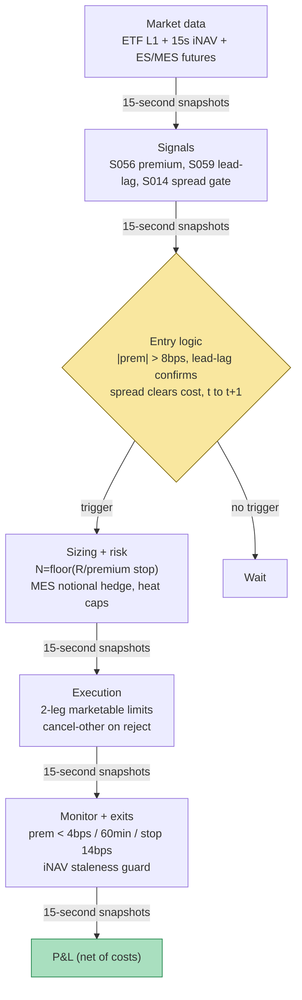

## Stage 109/200 — T009: ETF-vs-Basket Arbitrage

*Batch TB1 · Strategy 9/100 · Signals S056, S059, S014*

### T1. One-line verdict

| | |
|---|---|
| **Style** | Intraday relative-value / basis arbitrage, ETF vs basket |
| **Edge source** | Transient dislocations between an ETF's market price and its intraday NAV (iNAV), entered only when a futures–spot lead-lag read says the dislocation is real and the spread decomposition says it clears costs |
| **Typical holding period** | Minutes to ~1 hour (domestic dislocations decay in minutes per the literature) |
| **Capacity hint** | Small and shrinking — Authorized Participants (APs) see the same print and trade the actual creation/redemption loop; the non-AP proxy earns the scraps |
| **Build-or-buy in one line** | Build the dislocation monitor and the basis-hedged execution; buy the 15-second iNAV feed and futures data — without licensed iNAV there is no signal |

### T2. Full mechanics

**Jargon first.** An *ETF* (exchange-traded fund) trades on exchange like a stock but holds a basket of securities. *iNAV* (intraday net asset value, also called IIV) is the issuer's 15-second estimate of what the basket is worth. The *premium/discount* is (ETF price − iNAV)/iNAV — the dislocation this strategy trades. *Authorized Participants* (APs) are institutions with the contractual right to *create* ETF shares (deliver the basket, receive shares) or *redeem* them (reverse) — the primary-market loop that keeps prices near NAV. A *creation unit* is the block size for that loop (typically 25,000–100,000 shares). The *PCF* (portfolio composition file) is the daily recipe of one creation unit. *Basis* is the futures-minus-cash difference; *lead-lag* is the empirical fact that futures often move first and cash catches up. *Effective spread* (S014) is what an aggressor actually paid versus the mid — the true cost of the take.

**Universe & session.** US-listed ETFs with a licensed 15-second iNAV, 20-day ADV ≥ $50M, median quoted spread ≤ 3 bps (*example* filters), and a liquid futures proxy (index ETFs via ES/MES). Exclude: international ETFs whose baskets trade while the home market is closed (stale-iNAV mirage — Engle & Sarkar 2006), ex-div and reconstitution days, and the first/last 15 minutes (09:45–15:45 ET, flatten 15:45 — *example*).

**Entry rule (statistical proxy, non-AP).** At each 15-second snapshot *t*, compute premium_t = (P_ETF,t − iNAV_t)/iNAV_t (S056) and the lead-lag read (S059): β̂·r_f(t−ℓ̂) with ℓ̂ = 5 min, β̂ from a 20-session 1-min regression (*example*). **Enter** (signal at *t*, fills at *t+1* snapshot) when all three hold:

- |premium_t| > 8 bps — the all-in cost bound c (*example*; S056's default);
- |β̂·r_f(t−ℓ̂)| ≥ 5 bps (*example* cost filter) **and** its sign agrees with the dislocation being real (futures moved the way cash must follow to *widen* the true dislocation — i.e. the premium isn't a stale-iNAV artifact);
- trailing 1-day average effective spread of the ETF leg (S014) < |premium_t| − c (*example*: the edge must survive the actual spread paid, not the quoted one).

Discount (premium < 0): long ETF, short the futures proxy. Premium > 0: mirror. The AP creation/redemption loop is described for completeness (S056 variant 1) but is **not executable** by a retail/paper book — no AP agreement, no PCF delivery. The paper strategy is variant 2: short the rich leg, buy the cheap leg, exit on convergence.

**Position sizing.** Dollar risk on the *premium*: stop at |premium| = 14 bps vs entry at 8 ⇒ stop distance ≈ 6 bps × P_ETF ≈ $0.30/share (*example*). N_ETF = ⌊R / 0.30⌋ with R = $200 (*example*) → 666 shares. Futures hedge in beta-equivalent notional: 666 × $500.75 ≈ $333k ⇒ 10 MES contracts ($5/pt × 7,000 ≈ $35k each ≈ $350k; residual disclosed). Portfolio: max 4 concurrent dislocations, gross ≤ 2× equity on a $1M paper book (*example*).

**Exit rule.** First wins: (1) convergence — |premium| < 4 bps = c/2 (*example*); (2) time stop — 60 min (*example*; domestic dislocations are minute-scale per Engle & Sarkar); (3) stop-loss — |premium| ≥ 14 bps, the dislocation is widening against you (*example*); (4) futures leg basis blowout — ES/MES halted or basis moves > 3σ (*example*) — flatten both legs; (5) flatten 15:45.

**Risk limits** (*example* unless noted). Daily loss stop −1.5% of book; per-trade hard stop −$350; iNAV-staleness kill switch (no fresh print in 60 s ⇒ no new entries); clock-skew kill switch (> 50 ms vs NTP).

**Cost model** (illustrative; commissions per Grok's Q-TB1-1 shared convention, labeled lead): $0.005/share each way on the ETF leg; MES $0.75/contract round-trip (*indicative — verify before budgeting*); half-spread on every fill embedded in fill prices; no financing, no borrow, no slippage beyond half-spread (optimistic — see T4). Applied explicitly below.

**Execution sketch.** Marketable limits on both legs at the *t+1* snapshot; ETF participation ≤ 10% of visible depth (*example*); MES is the liquid leg and leads. One leg rejecting ⇒ cancel the other within 1 second (*example*) (unhedged premium exposure is not the strategy). Fills at the *signal* snapshot are rejected by the harness — only *t+1* or later.

### T3. Signals it consumes

| Signal | Role | Weight / logic |
|---|---|---|
| S056 — ETF vs basket / iNAV premium | **Primary trigger** | Enter only if \|premium_t\| > 8 bps (*example*); exit at < 4 bps |
| S059 — Futures–spot lead-lag | **Confirmation filter** | Enter only if \|β̂·r_f(t−ℓ̂)\| ≥ 5 bps (*example*) and sign-consistent; vetoes stale-iNAV mirages |
| S014 — Spread decomposition | **Cost gate (veto)** | Trailing effective spread must be < \|premium_t\| − c; realized-spread diagnostics post-trade only |

```pseudocode
# T009 combination logic — runs on each 15-second snapshot t (causal: data ≤ t)
premium_t = (P_ETF[t] - iNAV[t]) / iNAV[t]                       # S056
lead_t    = beta_hat * r_futures[t - LAG]                        # S059, LAG = 5 min (example)
cost_ok   = eff_spread_1d(ETF) < abs(premium_t) - C              # S014, C = 8 bps (example)
if position is None and iNAV_fresh(t):
    if abs(premium_t) > C and abs(lead_t) >= 5bps \              # example
       and sign(lead_t) == -sign(premium_t) and cost_ok:
        # discount: long ETF / short MES; premium: mirror
        N_ETF = floor(R / ((STOP - C) * P_ETF[t]))               # R=$200, STOP=14bps (example)
        N_MES = round(N_ETF * P_ETF[t] / (MES_mult * F[t]))
        submit_both_legs(MarketableLimits, at="snapshot t+1")
else:
    if abs(premium_t) < C/2 or abs(premium_t) >= STOP \          # example
       or minutes_held >= 60 or clock >= "15:45":
        flatten both legs at next snapshot
```

### T4. Worked example — numbers + P&L (SYNTHETIC)

All prices synthetic, **seed 109** (regenerable via `python3 batches/TB1/plot_T009.py`). Synthetic ETF "SYIDX", synthetic iNAV prints, MES = Micro E-mini S&P 500 ($5/point — real contract spec). The chart in T9 plots these exact trades.

**Trade T1 — discount convergence (winner).** Snapshot *t*: ETF mid 500.755, iNAV 501.250 ⇒ premium = (500.755 − 501.250)/501.250 = −9.9 bps (< −8 bps ✓). Lead-lag: ℓ̂ = 5 min, β̂ = 0.98, ES r_f = +0.12% over the lag ⇒ predicted cash catch-up +11.8 bps ≥ 5 bps ✓, sign-consistent (futures up ⇒ cash must rise ⇒ the discount is real, not stale iNAV). S014 gate: trailing effective spread 1.6 bps < 9.9 − 8 = 1.9 bps ✓ (tight, but passes). Fill at *t+1*: long **666 ETF @ 500.76** (ask), short **10 MES @ 7,000.50**. Sizing check: stop distance (14−8) bps × 500.75 ≈ $0.30/share ⇒ N = ⌊200/0.30⌋ = 666. Exit ~40 min later: iNAV caught up; ETF bid 501.20, iNAV 501.250 ⇒ premium −0.9 bps < −4 bps ✓. Sell 666 @ **501.20**, cover 10 MES @ **7,001.00**.

| Line | Calc | $ |
|---|---|---|
| ETF leg | 666 × (501.20 − 500.76) | +293.04 |
| MES hedge leg | 10 × 5 × (7,000.50 − 7,001.00) | −25.00 |
| Gross | 293.04 − 25.00 | +268.04 |
| Commissions: ETF 666 × 0.01 | | −6.66 |
| Commissions: MES 10 × 0.75 (*indicative*) | | −7.50 |
| **Net T1** | | **+253.88** |

**Trade T2 — discount widens (stop).** Snapshot *t*: premium −10.0 bps, lead-lag +10.6 bps, cost gate passes; same sizing: long 666 @ 500.76, short 10 MES @ 7,000.50. The dislocation widens: stop fires at premium −15.6 bps (≤ −14 bps): sell 666 @ **500.46**, cover 10 MES @ **7,000.75**. ETF leg: 666 × (500.46 − 500.76) = −199.80; MES leg: 10 × 5 × (7,000.50 − 7,000.75) = −12.50; gross −212.30; fees −14.16; **net −226.46**. Cumulative: +253.88 → **+27.42**.

**Where the example is optimistic.** The iNAV is assumed executable — a real iNAV is a 15-second *indicative* print, not a tradable quote; the basket may not be assemblable at those prices (S056's S10 warning). MES is a clean proxy only for index ETFs; for sector ETFs the basis between ETF and ES/MES is itself a risk the example sets to ~zero. Both legs fill at the touch with no partial fills and no futures slippage beyond the quoted bid/ask. The S014 gate passes by 0.3 bps — in production that margin is noise, and half the "passing" signals would be vetoed. Financing, borrow on the short-ETF mirror trade, and the creation-unit capital requirement are all stubbed out.

### T5. Data & infra — what must run

**Pipeline inventory.** Pre-open: load PCF weights (for the basket-residual diagnostic), 20-session β̂/ℓ̂ estimates, trailing effective-spread panels. Intraday (09:45–15:45 ET): 15-second iNAV poller with a staleness watchdog (no fresh print in 60 s ⇒ no new entries); ETF L1 quote stream for premium_t; ES/MES futures stream for the lead-lag leg; a 1-second snapshotter stamping premium, lead_t, and cost-gate state. Post-close: persist every snapshot + decision to disk; rebuild β̂/ℓ̂ and spread panels overnight. Storage: snapshots are tiny (a few hundred MB/day); futures+ETF L1 for replay ~2–8 GB/symbol-day (cost-model §4) — record only traded names.

**M5 Max feasibility: feasible (Tier M).** Per cost-model §2 this is a snapshot-arithmetic workload: a few thousand 15-second evaluations/day, OLS on 20 sessions of 1-min data overnight — a rounding error for this machine. RAM: < 1 GB hot (§3). Engineering: 40–100 h Tier M+ harness (cost-model §5) ≈ $6,000–15,000 loaded-cost estimate — the work is the two-leg execution FSM, the iNAV licensing plumbing, and the no-look-ahead backtest, not the math. Bottleneck: data licensing and timestamp alignment between the iNAV clock and the futures feed, not compute. Breaks at: full-creation-unit AP simulation (capital, not compute) or multi-venue futures books.

**Feed-outage safe mode.** iNAV stale > 60 s → no new entries; existing positions run to convergence/stop on last-known premium. ETF quote hole → flatten the ETF leg and the MES hedge together (never hold the proxy naked). Futures halt/limit → flatten everything; the hedge is the strategy's other half. Clock skew > 50 ms → halt all. Restart-flat from the on-disk ledger, as in T008.

### T6. Buy vs build

| Option | What you get | Indicative price | Gains | Loses |
|---|---|---|---|---|
| Tier-0: exchange delayed quotes + public PCF | End-of-day NAV, basket recipe | ~$0, *indicative — verify before budgeting* | Learn the loop mechanics | No 15-s iNAV — no signal |
| Tier-1: Polygon Stocks Advanced | Real-time SIP equity quotes/trades | ~$30–200/mo, *indicative — verify before budgeting* | ETF leg priced honestly | No licensed iNAV; no futures |
| Tier-2: Databento (equities + CME futures) | Exchange-timestamped L1 + futures | ~$200/mo + usage, *indicative — verify before budgeting* | Both legs + replay; the honest stack | iNAV still licensed separately |
| Index-data vendor (e.g. index publisher feed) | 15-second iNAV/IIV | Licensed, typically $$/mo institutional, *indicative — verify before budgeting* | The actual signal input | The surprise bill; redistribution terms |
| Retail platform: QuantConnect paper | Minute bars + paper broker | ~$60–300/mo tiers, *indicative — verify before budgeting* | Fast paper harness | No iNAV, no 15-s futures-cash lead-lag |
| Build in-house (Python + polars) | Monitor, β̂/ℓ̂ fitter, two-leg FSM, ledger | 40–100 h ≈ $6,000–15,000 eng (loaded-cost estimate) | Your cost bound, your causality | You own the timestamp alignment |

**Verdict: buy the data, build the logic.** Without licensed 15-second iNAV there is no strategy — that is the first purchase. **Build if** you want the statistical proxy with your own cost bound and lead-lag confirmation. **Buy/lease if** you want the actual AP loop — which, honestly, a ≤$1M paper operation cannot have: no AP agreement, no creation-unit capital. Crossover: the day you can sign an AP agreement and fund creation units, the proxy becomes obsolete; until then the proxy is the whole game.

### T7. Success-ratio evidence

| Source | Market / period | Metric | Before/after cost | Caveat |
|---|---|---|---|---|
| Engle & Sarkar (2006) | 21 domestic + 16 intl ETFs, 2000 | Domestic: mean premium < 5 bps, avg std ~15 bps, deviations transient (minutes); SPY spread 8.7 bps | Measured vs spreads, not net P&L | End-of-day + minute-bar sample; market structure has changed |
| Petajisto (2017) | US ETFs | ~100 bps average deviation for identical-portfolio ETFs; ~16% gross Carhart four-factor alpha on the mispricing | Gross of costs | Identical-portfolio pairs, not single-ETF vs iNAV |
| Jain, Jain & Jiang (2021) | US ETFs | Higher algorithmic trading ⇒ smaller, less persistent ETF price deviations | Empirical, after the market's own costs | The competition you're trading against |
| Lettau & Madhavan (2018) | Survey | Creation/redemption mechanics and AP incentives architecture | n/a | Framework, not performance |

Capacity: Engle & Sarkar's domestic dislocations last *minutes* with 15-bps-scale standard deviations against ~9–38 bps spreads — the AP loop harvests the persistent part; the non-AP proxy competes with every HFT desk watching the same 15-second print. Documented decay: Jain et al. (2021) is the decay paper — algorithmic competition has been *shrinking* deviations over time. Failure regimes: international/overnight baskets (stale iNAV mirages), stress episodes where APs step back and authorized creation is constrained, and basis blowouts where the MES proxy decouples from the ETF's actual basket.

**Honest bottom line.** For a ≤$1M paper operation: this is a superb *education* strategy and a poor *income* strategy. The documented edge is measured in single-digit bps per dislocation, the holding time is minutes, and the other side of your proxy trade is a professional AP desk with the actual creation loop. Paper-trade it to learn basis accounting, two-leg execution, and cost-bound discipline; do not mistake the +$253.88 synthetic winner for a scalable return. An institutional desk monetizes this with AP status, balance sheet for creation units, and co-located simultaneity — none of which a paper book has.

### T8. Failure modes & pitfalls

1. **Stale-iNAV mirage** — the "discount" is just an iNAV that hasn't caught up to futures. Mitigation: the S059 sign-consistency filter *and* the 60-second iNAV freshness watchdog; never trade the print alone.
2. **International/overnight baskets** — underlying markets closed while the ETF trades. Mitigation: universe excludes them (Engle & Sarkar's large-persistent-premium set is exactly this trap).
3. **Proxy basis risk** — MES tracks the S&P 500, not your sector ETF's basket. Mitigation: restrict the proxy variant to index ETFs; otherwise build the subset basket or don't trade.
4. **AP step-back in stress** — deviations widen beyond the stop exactly when liquidity is thinnest. Mitigation: the −14 bps hard stop; no averaging down; Ben-David et al.'s volatility finding is the reason.
5. **Two-leg asynchrony** — ETF fills, MES gaps on a macro headline. Mitigation: simultaneous marketable limits, cancel-other in ≤1 s, ≤10% participation.
6. **Cost-bound optimism** — the S014 gate passes by fractions of a bp on quoted spreads; effective spreads are worse. Mitigation: gate on *trailing average effective* spread, and require 2 bps of margin beyond c (*example* safety margin) before entry.
7. **Financing/borrow on the mirror trade** — short-ETF premiums need borrow; the example stubs it. Mitigation: borrow-flag gate on the short leg; model stock-loan fees in the bound c for live use.
8. **Lookahead in β̂/ℓ̂** — fitting the lead-lag on data that includes the trade window. Mitigation: 20-session *trailing* estimation, refit overnight only, purged/embargoed validation (S088).

### T9. Visuals




### T10. Sources

- Engle, R. F. & Sarkar, D. (2006). "Premiums–Discounts and Exchange Traded Funds." *Journal of Derivatives*, Summer 2006. https://www.stern.nyu.edu/rengle/jod.2006.635418.pdf — domestic dislocations small/transient (mean < 5 bps, std ~15 bps); the empirical anchor of T7.
- Petajisto, A. (2017). "Inefficiencies in the Pricing of Exchange-Traded Funds." *Financial Analysts Journal* 73(1), 24–54 — via CFA Institute: https://www.cfainstitute.org/about/press-room/2018/cfa-institute-financial-analysts-journal-announces-2017-winners — ~100 bps deviations on identical-portfolio ETFs; the "why APs get paid" result.
- Jain, A., Jain, C. & Jiang, C. X. (2021). "Active Trading in ETFs: The Role of High-Frequency Algorithmic Trading." *Financial Analysts Journal* 77(2), 66–82. https://ideas.repec.org/a/taf/ufajxx/v77y2021i2p66-82.html — algorithmic competition shrinks deviations; the crowding/decay evidence.
- Lettau, M. & Madhavan, A. (2018). "Exchange-Traded Funds 101 for Economists." *Journal of Economic Perspectives* 32(1), 135–154. doi:10.1257/jep.32.1.135 — creation/redemption architecture behind the S3 bound.
- Hasbrouck, J. (1995). "One Security, Many Markets." *Journal of Finance* 50(4), 1175–1199. https://www.bauer.uh.edu/rsusmel/phd/hasbrouck95.pdf — information share; confirms the futures venue as the price-discovery leg (S059's theoretical backing).
- Chan, K. (1992). "A Further Analysis of the Lead-Lag Relationship between the Cash Market and Stock Index Futures Market." *Review of Financial Studies* 5(1), 123–152. http://ideas.repec.org/a/oup/rfinst/v5y1992i1p123-52.html — the lead-lag regression specification used in S059.

**Unverified leads** (chatbot-provided, not independently checkable — do not treat as evidence):
- *Unverified chatbot claim* (Grok, 2026-09-10, Q-TB1-1 shared convention): $0.005/share each-way commission and half-spread-on-every-fill cost convention — used as the chapter's *illustrative* cost model, not as a market fact.
- *Unverified chatbot claim* (Duck.ai, 2026-09-10, Q-SB3, via S056): creation-unit arithmetic "50,000 × $100 = $5M notional; 5 bps = $2,500/creation" — independently recomputed arithmetic, used only as illustration.
- MES $0.75/contract round-trip commission — *indicative — verify before budgeting*; no vendor quote obtained.

Source log: Grok answered Q-TB1-1..3 (2026-09-10); all claims independently verified or labeled unverified.
