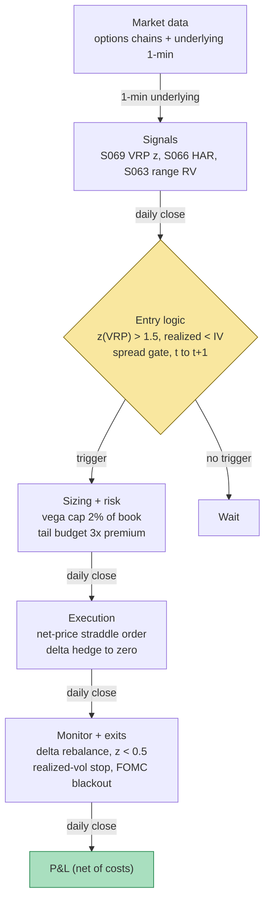

## Stage 110/200 — T010: Variance-Risk-Premium Harvester

*Batch TB1 · Strategy 10/100 · Signals S069, S066, S063*

### T1. One-line verdict

| | |
|---|---|
| **Style** | Systematic short-volatility (options), delta-hedged |
| **Edge source** | The variance risk premium — implied variance persistently richer than subsequently realized variance — harvested by selling options when the premium is statistically rich and hedging the directional exposure away |
| **Typical holding period** | Days to weeks (30-day straddles held 3–10 days, *example*) |
| **Capacity hint** | Moderate at index level, self-limiting: every seller needs a buyer, and the premium compresses exactly when everyone sells |
| **Build-or-buy in one line** | Build the VRP monitor, the delta-hedge engine, and the tail-risk governor; buy the options chain data — there is no retail substitute for a real chain |

### T2. Full mechanics

**Jargon first.** *Implied volatility* (IV) is the market's forecast of future volatility, backed out of option prices. *Realized volatility* (RV) is what actually happened, measured from price returns. The *variance risk premium* (VRP) is IV² − E[RV²]: positive when options are priced for more turbulence than arrives — the seller's edge. *HAR* (heterogeneous autoregressive) is a simple regression forecasting tomorrow's RV from today's, last week's, and last month's RV (S066). A *straddle* is a call + put at the same strike — a pure volatility bet, direction-neutral at inception. *Delta* (Δ) is the option position's directional exposure; *delta-hedging* means trading the underlying to keep Δ near zero so only volatility exposure remains. *Gamma* (Γ) is how fast delta changes — the reason the hedge must be rebalanced. *Vega* is exposure to IV changes. *Theta* is time decay — the daily rent the short-vol seller collects.

**Universe & session.** Liquid index options: SPY/SPX 30-day ATM straddles (*example* tenor/strike). Entry only when VRP z > +1.5 vs the trailing 6-month history (*example*); no new entries 2 days before FOMC (Federal Open Market Committee) or during expiry week (*example* blackouts); underlying must have borrow and a tight spread (SPY always qualifies). Signals computed at the close *t*; straddle sold at the next open *t+1*.

**Entry rule.** At close *t*: compute VRP_t = IV_t² − E_t[RV²] (S069, variance points) with E_t[RV] from the HAR forecast (S066) on 5-minute RV; z_t = (VRP_t − μ_6mo)/σ_6mo. **Enter** when z_t > +1.5 (*example*) AND the 5-day realized vol (Garman–Klass range estimator, S063) is below the entry IV (don't sell into an already-realizing spike — *example* sanity gate) AND the straddle bid/ask ≤ 0.3% of mid (*example* liquidity gate).

**Position sizing (vega-scaled).** Vega per 30-day ATM straddle ≈ 2 × 0.4 × S × √(T/365) × 0.01 $/vol-point per share × 100 (≈ $138/contract at S=600 — *example* arithmetic). Cap: total short vega ≤ 2% of book per 1-vol-point move (*example*); on a $1M book that's $20k ⇒ ≤ ~145 contracts. The worked example uses 10 contracts — paper-scale, ~0.14% of book per vol point.

**Exit rule.** First wins: (1) VRP compression — z_t < +0.5 (*example*); (2) time stop — exit at 21 DTE (days to expiration) (*example*; avoid expiry gamma); (3) realized-vol stop — 5-day Garman–Klass RV > 1.5 × entry IV (*example*; the thesis broke); (4) tail stop — cumulative MTM loss > 2× premium collected (*example* hard stop); (5) event blackout — flatten before FOMC if still held.

**Delta-hedge engine.** Start delta-neutral (ATM straddle ≈ 0 Δ). Rebalance the underlying when |Δ| > 0.10 per straddle (*example*) or at least once daily — whichever comes first; each rebalance trades back to Δ = 0 with marketable limits, ≤ 5% of 1-min volume (*example*). The hedge P&L is the gamma-scalping ledger: it *loses* when realized < implied (the normal case — that's the premium) and *profits* on big realized moves (partially offsetting the straddle's loss in a spike). Intraday realized measurement for hedge timing uses S063 range estimators (Garman–Klass on 5-min bars — more efficient than close-to-close, so the hedge reacts to the true path).

**Risk limits.** Daily loss stop −2% of book (*example*); vega cap as above (hard); kill switch on IV spike > 30% in a day (*example*) — flatten short-vol into strength, never average down a vol spike. Overnight short-vol is the position — that's the product — but size it so a 1987/2008/2018-style gap doesn't end the book: max loss per position sized at 3× the premium collected (*example* tail budget).

**Cost model** (illustrative): option commission $0.65/contract/leg (*indicative — verify before budgeting*); hedge trades $1.00 each (*indicative*); half the straddle bid/ask paid on entry (sell the bid) and exit (buy the ask); underlying half-spread on hedges embedded in the hedge ledger; no financing, no margin drag (optimistic — see T4).

**Execution sketch.** Straddle entered as a two-leg limit at the *t+1* open (net-price order, not legged — never hold half a straddle). Hedge orders are single-stock marketable limits. All fills t+1 or later; the VRP signal is a close-*t* number and is never traded in the same bar.

### T3. Signals it consumes

| Signal | Role | Weight / logic |
|---|---|---|
| S069 — Implied-vs-realized / VRP | **Primary trigger** | Enter only if z(VRP) > +1.5 vs 6-month history (*example*); exit at z < +0.5 |
| S066 — HAR realized-vol forecast | **Forecast input** | E_t[RV²] in the VRP definition; OLS on ≥250 days, log-HAR variant |
| S063 — Range-based RV estimators | **Realization measurement / hedge timing** | Garman–Klass 5-min RV for the realized-vol stop and intraday hedge decisions |

```pseudocode
# T010 combination logic — daily at close t (causal: options & RV ≤ t)
RV_hist  = range_RV(5min bars, estimator="GarmanKlass")          # S063
E_RV2    = HAR_forecast(RV_hist, lags=[1, 5, 22])                # S066
IV2      = model_free_implied_variance(chain[t])                 # S069
VRP_t    = IV2 - E_RV2
z_t      = (VRP_t - mean(VRP[t-126:t])) / std(VRP[t-126:t])
if position is None:
    if z_t > 1.5 and RV_5d < IV_t and straddle_spread <= 0.3%:   # example gates
        vega_ok = (n_contracts * vega_per) <= 0.02 * equity       # example cap
        sell n ATM straddles at next open (net-price limit)      # t -> t+1
        delta_hedge_to_zero()
else:
    rebalance hedge if abs(delta) > 0.10 or daily               # example
    if z_t < 0.5 or DTE <= 21 or RV_5d > 1.5*IV_entry \          # example
       or MTM_loss > 2*premium or pre_FOMC:
        buy back straddle, flatten hedge
```

### T4. Worked example — numbers + P&L (SYNTHETIC)

All numbers synthetic, **seed 110** (regenerable via `python3 batches/TB1/plot_T010.py`). Underlying "SYNX" at $600.00 (synthetic). Straddle mid ≈ 0.798 × S × IV × √T (*example* approximation, T in years). The chart in T9 plots these exact trades.

**Trade T1 — harvest (winner).** Close *t*: IV = 18.0%, HAR forecast = 14.5% ⇒ VRP = 18² − 14.5² = 324 − 210.25 = **113.75 variance points**; 6-month history μ = 60, σ = 28 ⇒ z = (113.75 − 60)/28 = **+1.92** > 1.5 ✓. 5-day GK realized 13.2% < 18% ✓. Straddle mid = 0.798 × 600 × 0.18 × √(30/365) = **24.71**; sell 10 straddles at the bid **24.67** at *t+1* open (credit 24,670). Delta-hedge daily for 5 days; hedge ledger: +120.00, −310.00, +95.00, −420.00, +60.00 = **−455.00** (normal gamma bleed — the premium at work). Day 5: VRP z = +0.4 < 0.5 ✓ → buy back at the ask **22.92**.

| Line | Calc | $ |
|---|---|---|
| Option leg | (24.67 − 22.92) × 10 × 100 | +1,750.00 |
| Delta-hedge ledger (5 days) | 120 − 310 + 95 − 420 + 60 | −455.00 |
| Commissions: options 10 × 2 × 0.65 | | −13.00 |
| Commissions: hedges 5 × 1.00 | | −5.00 |
| **Net T1** | | **+1,277.00** |

**Trade T2 — vol spike (loser).** Close *t*: IV = 19.5%, HAR = 15.2% ⇒ VRP = 380.25 − 231.04 = **149.21**; z = **+3.19** ✓. Straddle mid = 0.798 × 600 × 0.195 × √(30/365) = **26.77**; sell 10 @ **26.73** (credit 26,730). Realized spikes to 30% (5-day GK): 30 > 1.5 × 19.5 = 29.25 ⇒ **realized-vol stop fires** on day 4. Straddle mark 32.00 → buy back at ask **32.04**. Hedge ledger on the spike (long gamma scalping into big moves): +85, +640, +905, +470 = **+2,100.00** — the hedge does its job, partially.

| Line | Calc | $ |
|---|---|---|
| Option leg | (26.73 − 32.04) × 10 × 100 | −5,310.00 |
| Delta-hedge ledger (4 days) | 85 + 640 + 905 + 470 | +2,100.00 |
| Commissions: options | 10 × 2 × 0.65 | −13.00 |
| Commissions: hedges | 4 × 1.00 | −4.00 |
| **Net T2** | | **−3,227.00** |

Cumulative: +1,277.00 → **−1,950.00**. One spike erases the harvest and more — that asymmetry *is* the strategy's risk profile, and the example shows it on purpose.

**Where the example is optimistic.** The straddle trades at mid ± $0.04 — real 30-day ATM straddle markets are wider, especially when VRP is rich (dealers aren't charities). The delta hedge rebalances frictionlessly at hedge prints: no partial fills, no overnight gaps between the last hedge and the open (the true gamma risk lives exactly there). No margin requirement or financing drag on the short options. The T2 hedge gains (+$2,100) assume disciplined rebalancing *into* a spike — the moment most discretionary hedgers freeze. Volatility-of-volatility (the straddle's vega exposure to the IV spike itself) is folded into the 32.04 buyback rather than modeled. And the example's IV paths are smooth; real VRP entries cluster before events, where the "richness" is compensation for jump risk, not free premium.

### T5. Data & infra — what must run

**Pipeline inventory.** Pre-open: full options chain snapshot (strikes, expiries, bid/ask, volume, OI) + underlying reference data. Intraday: underlying L1/1-min stream feeding the delta-hedge engine and the S063 realized-vol computation; chain re-polled every 1–5 min for MTM and the VRP z-score. Post-close: persist chain + hedge ledger; refit HAR coefficients (rolling 1,000 days preferred — S066); rebuild the 6-month VRP history. Storage: chain snapshots for one underlying ≈ 100–300 MB/snapshot (cost-model §3); 8 snapshots/day ≈ 1–2.5 GB/day — selective underlyings only, per cost-model §4 (full OPRA ≈ 1–3 GB/day for SPX-like names; do not archive naively).

**M5 Max feasibility: feasible (Tier M+).** Per cost-model §2: the daily VRP computation is seconds of numpy; the intraday job is 1-min underlying bars + a delta check — trivial. RAM: one underlying's chain history fits easily (§3). Engineering: 40–100 h Tier M+ harness (cost-model §5) ≈ $6,000–15,000 loaded-cost estimate — the delta-hedge engine, corporate-action handling on the underlying, and the tail-risk governor are the work, not the HAR fit. Bottleneck: options data licensing and the hedge engine's operational discipline, not compute. Breaks at: full-OPRA multi-underlying scanning (then selective snapshots + DuckDB, per cost-model §3).

**Feed-outage safe mode.** Options chain stale > 5 min → no new short-vol entries; existing positions managed on the underlying hedge only. Underlying quote hole → hedge via the index future proxy or flatten the straddle; never hold an unhedged short straddle through a data hole. Model-free IV computation requires the full strike strip — if strikes are missing, the VRP print is marked UNTRUSTED and no entry fires. Restart-flat rule applies to the *hedge*; the short options persist (they're the position), so the ledger must record them durably every fill.

### T6. Buy vs build

| Option | What you get | Indicative price | Gains | Loses |
|---|---|---|---|---|
| Tier-0/1: Cboe delayed options data | Coarse chains, straddle moves | ~$0–50/mo, *indicative — verify before budgeting* | Enough to prototype the VRP monitor | No Greeks, no intraday hedge timing |
| Tier-1: Polygon options | Real-time chains + Greeks | ~$30–200/mo class, *indicative — verify before budgeting* | Workable paper stack | Redistribution limits |
| Tier-2: Databento OPRA (research) | Full chain, usage-based | ~$200/mo + usage, *indicative — verify before budgeting* | Honest backtest chains | Production OPRA is institutional $$$$ |
| Tier-3: OptionMetrics IvyDB | Publication-quality history | ~$thousands/yr academic; institutional $$$$, *indicative — verify before budgeting* | The research gold standard | Price; still not a live feed |
| Retail broker: IBKR/tasty-style | Execution + paper | Commissions + market data subs, *indicative — verify before budgeting* | Real fills for the paper book | Paper fills are still modeled |
| Build in-house (Python + polars) | VRP monitor, hedge engine, tail governor | 40–100 h ≈ $6,000–15,000 eng (loaded-cost estimate) | Your z-gates, your hedge rules, auditable | You own the dividend/early-exercise edge cases |

**Verdict: hybrid.** Buy the chain (Tier-1/2), build everything else. **Build if** the edge is in *your* VRP definition (HAR variant, z-gates, hedge rules) — no vendor sells your timing. **Buy if** you need publication-quality history (IvyDB) or licensed redistribution. Crossover: when you want multi-underlying scanning or listed variance products, the data bill dominates and the build-vs-buy question becomes which vendor, not whether.

### T7. Success-ratio evidence

| Source | Market / period | Metric | Before/after cost | Caveat |
|---|---|---|---|---|
| Bollerslev, Tauchen & Zhou (2009) | S&P 500, 1990–2005 | VRP explains >15% of quarterly excess returns; + P/E ⇒ R² > 25% | Predictive regression, not a traded P&L | Return predictability ≠ harvestable Sharpe; transaction costs unmodeled |
| Demeterfi, Derman, Kamal & Zou (1999) | Method | Variance-swap replication from option strips | n/a | The replication machinery, not performance |
| NBER w16884 ("Simple Variance Swaps") | Method | Variance replication from strips | n/a | Same — machinery |
| Corsi (2009) | Method | HAR-RV long-memory forecast | Forecast loss, not P&L | Lower forecast loss ≠ tradable edge (S066's warning) |
| Public market history | Feb 2018 vol spike | Inverse-vol products terminated; short-vol suffered multi-σ losses | After everything, permanently | Qualitative — no invented statistics; the regime this strategy must survive |

Capacity and decay: the VRP is a *risk premium*, not an arbitrage — it exists because sellers are paid to warehouse jump risk. It compresses when crowded (everyone selling rich vol flattens the skew) and inverts violently in stress. There is no documented "Sharpe 2 short-vol" in the peer-reviewed record cited here; the record documents the *premium's existence* and the *tail's severity*. Failure regimes: volatility spikes (the example's T2), event jumps the HAR can't foresee, and liquidity vacuums where the hedge can't be rebalanced.

**Honest bottom line.** For a ≤$1M paper operation: this is the most *educational* of the three TB1 strategies and the most *dangerous* to mistake for income. The VRP is real and documented; harvesting it means underwriting left-tail risk that arrives in hours and erases months — T2's −$3,227 vs T1's +$1,277 is the honest shape of the return distribution, not a bug in the example. Paper-trade it to learn delta-hedging, vega sizing, and tail governance; size any live version so that a February-2018-shaped week is a bad month, not a funeral. An institutional desk runs this with portfolio margin, listed variance instruments, and a risk committee; a one-person book runs it small or not at all.

### T8. Failure modes & pitfalls

1. **Volatility spike / gap risk** — the documented killer; realized >> implied in hours. Mitigation: vega cap, 3×-premium tail budget, realized-vol stop, never average down a spike.
2. **Jump risk mispriced as premium** — rich VRP before events is compensation, not edge. Mitigation: FOMC/expiry blackouts; don't sell what you can't explain.
3. **Hedge failure in gaps** — overnight gaps skip the rebalance grid; gamma risk lives in the close-to-open. Mitigation: size for the gap (tail budget), consider listed hedges; the example's smooth hedge ledger is optimistic.
4. **IV computation fragility** — model-free IV needs the full strike strip; missing strikes corrupt VRP_t. Mitigation: UNTRUSTED print ⇒ no entry; interpolate total variance, never raw vol (S069).
5. **HAR forecast breakdown in regime change** — the forecast is backward-looking by construction. Mitigation: the realized-vol sanity gate (don't sell into realizing spikes); log-HAR variant for skew.
6. **Liquidity mirage in the straddle** — wide markets when VRP is richest; mid ± $0.04 is fiction. Mitigation: the 0.3% spread gate; model entry/exit at bid/ask, never mid.
7. **Early exercise / dividends (American options)** — SPY options are American; assignment changes the hedge. Mitigation: ex-div calendar in the pre-open job; prefer cash-settled index options (SPX) where the mandate allows.
8. **Crowding the premium away** — systematic short-vol flows compress VRP until the carry no longer pays for the tail. Mitigation: the z-gate is *relative* (trailing 6 months) — it self-throttles as the premium compresses; don't override it with a fixed threshold.

### T9. Visuals




### T10. Sources

- Bollerslev, T., Tauchen, G. & Zhou, H. (2009). "Expected Stock Returns and Variance Risk Premia." *Review of Financial Studies* 22, 4463–4492. https://federalreserve.gov/econres/feds/expected-stock-returns-and-variance-risk-premia.htm — VRP predicts returns (R² > 15% quarterly, 1990–2005); the premium's existence proof.
- Corsi, F. (2009). "A Simple Approximate Long-Memory Model of Realized Volatility." *Journal of Financial Econometrics* 7(2), 174–196. http://ideas.repec.org/a/oup/jfinec/v7y2009i2p174-196.html — the HAR forecast inside the VRP definition.
- Demeterfi, K., Derman, E., Kamal, M. & Zou, J. (1999). "More Than You Ever Wanted To Know About Volatility Swaps." Goldman Sachs. https://www.realvol.com/volatilityblog/?p=516 — variance-swap replication from option strips; the hedging machinery.
- "Simple Variance Swaps." NBER Working Paper 16884. https://www.nber.org/system/files/working_papers/w16884/w16884.pdf — model-free variance replication; backs the S069 implied-variance construction.
- Federal Reserve Board. "The Variance Risk Premium Around the World." *International Finance Discussion Papers* 1035. https://www.Federalreserve.gov/pubs/ifdp/2011/1035/ifdp1035.htm — international VRP stylized facts; the regime-dependence behind the z-score normalization.

**Unverified leads** (chatbot-provided, not independently checkable — do not treat as evidence):
- *Unverified chatbot claim* (Grok, 2026-09-10, Q-TB1-1 shared convention): $0.005/share each-way commission and half-spread-on-every-fill cost convention — used as the chapter's *illustrative* cost model, not as a market fact.
- Any specific after-cost Sharpe for traded VRP strategies — no checkable source found; not claimed here.
- The February 2018 reference is public market history stated qualitatively; no statistics are asserted from it.

Source log: Grok answered Q-TB1-1..3 (2026-09-10); all claims independently verified or labeled unverified.
