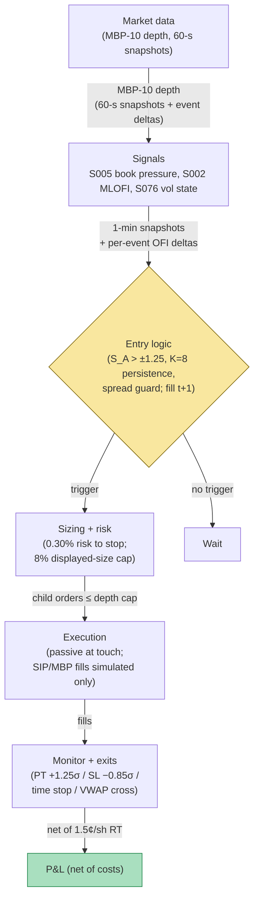

## Stage 191/200 — T091: Multi-Level Book-Pressure Swing

*Batch TB10 · Strategy 91/100 · Signals S005, S002, S076 · Provenance [D/SR]*

### T1. One-line verdict

| | |
|---|---|
| **Style** | Intraday swing, microstructure-directional: minutes-to-hours positions on persistent limit-order-book shape |
| **Edge source** | Persistent multi-level resting-depth imbalance (S005, the *photograph*) plus multi-level order-flow imbalance (S002, the *movie*), exited on volatility-breakout state changes (S076); persistence and spread gates convert flicker into tradable pressure |
| **Typical holding period** | 20–90 minutes (example); flat by the close |
| **Capacity hint** | $2–10M per name-family before depth participation caps bind (example); sized by displayed size on the first three opposite book levels |
| **Build-or-buy in one line** | Build the features in a weekend; buy (or rent) the MBP-10 feed — the feed is the whole cost, the math is free |

### T2. Full mechanics

**Universe & session.** 50–150 liquid large-caps (example universe), ADV (average daily volume) above $50M (example) so that displayed depth means something. Regular trading hours, 10:00–15:30 ET (example; avoids the open auction's special dynamics and the close auction). Exclusions: earnings-day names (S030's evidence shows squeezes misbehave around scheduled events), halts, and any symbol whose 5-day median relative spread exceeds 25 bps (example) — the strategy is a guest of the spread, not its master.

**The signals, plainly.** The *limit order book* is the exchange's queue of resting buy (bid) and sell (ask) orders, stacked price level by price level. **Book pressure** (S005) is a still photograph: at each snapshot, compute per-level order-book imbalance

$$\mathrm{OBI}_{l,t}=\frac{V^{\mathrm{bid}}_{l,t}-V^{\mathrm{ask}}_{l,t}}{V^{\mathrm{bid}}_{l,t}+V^{\mathrm{ask}}_{l,t}+\varepsilon}$$

for levels l = 1…10 (example), where V is resting share quantity, and combine them with exponentially decaying weights (w_l ∝ e^(−0.35(l−1)), so level 1 carries ~30% and level 10 ~2%; example λ = 0.35):

$$P_t=\sum_{l=1}^{10} w_l\,\mathrm{OBI}_{l,t}$$

A positive P_t means resting demand outweighs resting supply across the visible book. **Multi-level order-flow imbalance** (S002) is the movie: it counts *changes* — bid additions and ask cancellations — per level between events (Cont-style OFI, aggregated across levels with Ridge-regularized weights per Xu–Gould–Howison 2019). **Volatility breakout** (S076) measures whether realized range is expanding or the tape is chopping — it times exits and vetoes entries in dead tapes.

**Combination score (example weights).**

$$S^A_t = 0.55\,z(P^*_t) + 0.35\,z(\mathrm{IOFI}^*_t) + 0.10\,z(\mathrm{trade\text{-}OBI}_t)$$

where each z is a rolling 2-hour z-score (standardized score: (value − mean)/standard deviation) clipped to [−3, 3], P*_t is the 20-sample EMA of P_t, IOFI*_t is the smoothed multi-level OFI, and trade-OBI is signed executed volume over the same window (less sensitive to fleeting quotes). All weights are marked `example` — the plan's honesty rule: these are starting points, not institutional standards.

**Entry rule.** Enter long when ALL of: (i) S_A > +1.25 (example); (ii) sign(P*_t) has persisted for K = 8 consecutive 60-second snapshots (example — the flicker filter); (iii) relative spread ≤ s_max (8 bps large-cap, 25 bps mid-cap; example); (iv) no refill event — if depth on the thin side recovered >50% within the last 2 snapshots, halve |P*_t| first (the spoof/flicker penalty, example). **Causal timing, stated explicitly: the score S_A is computed from the snapshot at bar t, using only data ≤ t; the earliest legal fill is the t+1 bar's open.** There is no same-bar trading — a signal computed at 10:23:00 from the 10:23:00 book cannot trade at 10:23:00.

**Exit rule.** Profit target +1.25 × σ_20 (example; σ_20 is the 20-bar rolling standard deviation of bar returns, an ATR-style (average true range) volatility unit); stop-loss −0.85 × σ_20 (example); time stop 45–90 minutes or end of session, flat by the close (example); signal-flip exit if the mid crosses session VWAP (volume-weighted average price) against the position by 0.5σ (example).

**Position sizing.** q = (r × equity) / stop_distance (example), with r = 0.30% of equity risked per trade (example), then capped at 8% of the displayed size on the first three opposite book levels (example) — you never demand more than the book visibly offers. Portfolio heat: max 3 concurrent positions (example).

**Risk limits.** Kill the session after 2 consecutive stopped trades (example); realized spread + fees on the day must stay below the expected move, else stand down; max gross 1.5× equity (example); daily loss stop −1.5% of the sleeve (example).

**Cost model.** 1.5¢/share round-trip (example: ~0.5¢ half-spread paid each side on a liquid large-cap plus ~0.5¢ all-in fees/slippage), applied explicitly in the worked example below. Borrow is N/A (intraday long/short on easy-to-borrow large caps; hard-to-borrow names are excluded).

**Order/execution sketch.** Post passive limit orders at the touch; if not filled within 2 snapshots, cross the spread for at most 50% of the order and cancel the rest (example participation discipline). Queue position on a SIP (Securities Information Processor consolidated feed) or MBP-10 (market-by-price, 10 levels) reconstruction is *not* knowable — any fill-rate assumption here is `simulated only — requires MBO/ITCH` (market-by-order / ITCH direct-feed message data) per the honesty rules.

### T3. Signals it consumes

| Signal | Role | Weight / logic |
|---|---|---|
| S005 (multi-level book pressure) | Primary trigger | 0.55 weight (example) in S_A; persistence K = 8 bars (example) on sign(P*_t) |
| S002 (MLOFI / integrated OFI) | Confirmation | 0.35 weight (example); must agree in sign with P*_t, else no entry |
| S076 (vol breakout / squeeze state) | Exit + regime gate | no entry if bandwidth is at a 6-month low AND no breakout has printed yet (dead tape); exits on vol-expansion reversal |

Pseudocode (≤25 lines):
```
every 60 s snapshot t on symbol s:                      # granularity: 60-s MBP-10 snapshots
    P[t]  = sum_l w_l * OBI(l, t)                        # S005, L=10, lambda=0.35 example
    Ps[t] = EMA(P, 20)                                   # smoothed pressure
    I[t]  = MLOFI(t)                                     # S002, Ridge-weighted levels
    SA[t] = 0.55*z(Ps, 2h) + 0.35*z(I, 2h) + 0.10*z(tradeOBI, 2h)  # clipped +-3
    if thin_side_refilled_50pct(last 2 snaps): SA[t] *= 0.5
    if SA[t] > 1.25 and sign_stable(Ps, K=8) and spread <= s_max:   # example
        if vol_state != DEAD_SQUEEZE:                    # S076 gate
            submit(q) at next bar open                   # fill t+1, never t
# exits: PT +1.25*sigma20 / SL -0.85*sigma20 / time 45-90m / VWAP cross-against
```

### T4. Worked example — numbers + P&L (SYNTHETIC)

Synthetic 25-minute tape on fictional liquid name **GENL** (prices synthetic, seed 191). 60-second MBP-10 snapshots. λ = 0.35 → weights ≈ (0.30, 0.21, 0.15, 0.11, 0.07, 0.05, 0.04, 0.03, 0.02, 0.02) (example). Entry threshold S_A > +1.25 (example).

| t (min) | Weighted OBI P_t | Persistence | S_A | Action | Mid ($) | Position |
|---|---|---|---|---|---|---|
| 0–7 | +0.12 → +0.41 | building | 0.60 → 1.10 | flat (K not met) | 100.02 → 100.06 | 0 |
| 8 | +0.58 | 8 bars ✓ | +1.41 | **BUY 12,000 @ 100.06** (fill t+1 after the t=8 signal) | 100.06 | +12,000 |
| 12 | +0.62 | — | +1.50 | hold | 100.14 | +12,000 |
| 18 | +0.21 | fading | +0.70 | hold (no flip exit) | 100.21 | +12,000 |
| 24 | −0.05 | — | +0.10 | **SELL 12,000 @ 100.33** (profit target 100.34 touched; exit pays half-spread) | 100.34 | 0 |

Ledger (fully costed):
- Buy: 12,000 × $100.06 = $1,200,720 notional
- Sell: 12,000 × $100.33 = $1,203,960
- Gross: $1,203,960 − $1,200,720 = **+$3,240**
- Costs: 12,000 sh × $0.015 RT = **$180**
- **Net: +$3,060**

**Session net: +$3,060 on the one swing (synthetic; demonstrates the entry/exit arithmetic, not forward alpha or after-cost profitability).**

**Where the example is optimistic.** The tape is hand-shaped: pressure builds monotonically, never spoofs, and the mid drifts obligingly toward the profit target. Real books flicker — level-1 OBI reverses sign several times a minute on busy names, and the persistence gate that "saved" this trade also keeps you out of half the genuine moves. The 1.5¢/share round-trip assumes mid-touch fills and no partial fills; a real 12,000-share order walks the book and pays impact. The σ_20 = 0.22 pts stop/PT calibration is assumed known, not estimated with error. No latency, no queue position, no adverse selection from the very informed flow that creates book pressure in the first place.


*Chart caption: synthetic data — not market data. Watermark reads "SYNTHETIC EXAMPLE" exactly. Seed 191; plotted series are the T4 table values above.*

### T5. Data & infra — what must run

**Feed.** MBP-10 (market-by-price, 10 levels) snapshots or event deltas on 50–150 names, every 60 s for the swing clock plus full-resolution deltas for the MLOFI estimator (S002's Cont-style OFI needs per-event updates). Collection: Databento MBP-10 (Standard ~$200/mo or Plus ~$1,500–$1,750/mo, `indicative — verify before budgeting`) or equivalent; SIP L1 is *not* sufficient — there is no depth on the consolidated tape, so S005 cannot be computed from it.

**Jobs.** Pre-open: build the 2-hour rolling z-score baselines from the prior session's snapshots. Intraday loop: every 60 s, recompute P_t, IOFI_t, S_A, spread guard, refill check across the universe (trivial vectorized work). Post-close: log persistence/refill statistics and markout; refit the Ridge weights for S002 weekly (example cadence).

**Storage.** Per cost-model §4, L1 quotes+trades on a liquid name run ~2–8 GB/symbol-day in parquet; MBP-10 event deltas are heavier — per-symbol daily files; 60-day history on 150 names is **90–360 TB** (150 × 60 × 10–40 GB/symbol-day, per §4) — archive-infeasible; do not archive naively. The 60-day hot feature store (1-min S_A scores + mid prices) is ~50 MB — trivial.

**M5 Max feasibility.** Per cost-model §2, polars handles ~10–50M rows/sec on simple ops; the per-minute recompute across 150 names is milliseconds. The weekly Ridge fit on ~10M book-event rows is minutes. Verdict: **feasible** — the machine is idle 99% of the session; the bottleneck is the feed license and the book-reconstructor's snapshot/delta correctness, not FLOPs. RAM: the live working set (10-level books × 150 names + feature cache) is a few GB — comfortably inside the 77GB working budget (cost-model §3).

**Engineering.** Tier H for the L2/MBO pipeline per cost-model §5 (60–200 h; one line: MBP-10 reconstruction and event-alignment correctness dominate), plus Tier M+ for the strategy harness (40–100 h). Planning band: **100–200 h ≈ $15k–$30k loaded-cost estimate** at $150/hr. What breaks first at 500 symbols: the MBP-10 usage bill and the per-symbol daily-file bookkeeping, not the CPU.

**Feed-drop failure plan.** If the depth feed stalls: cancel all working orders, flatten at the touch within 2 minutes (example), and block new entries until 5 consecutive clean snapshots arrive — fail closed, because a stale P_t is worse than no P_t.

### T6. Buy vs build

| Option | What you get | Indicative price | Gains | Loses |
|---|---|---|---|---|
| Tier-0: SIP L1 only (Alpaca IEX / Stooq) | Free top-of-book | ~$0, `indicative — verify before budgeting` | $0 marginal | No depth: S005 uncomputable — this strategy cannot exist on this route |
| Tier-1: Polygon Stocks Advanced | SIP-class bars + WS, no depth | ~$199/mo individual, `indicative — verify before budgeting` | Easy ingest | Still no L2; buy this for the mid-price tape, not the book |
| Tier-2: Databento Standard/Plus | Live + historical MBP-10/MBO | ~$200–$1,750/mo + usage, `indicative — verify before budgeting` | The honest research feed for this strategy | Historical L2 beyond ~1 month is usage-priced; years of depth get expensive |
| Tier-3: LOBSTER (academic) | MBO/ITCH replay | ~hundreds/yr academic, `indicative — verify before budgeting` | True queue dynamics for fill simulation | Academic license, limited universes |
| Institutional: TAQ / full OPRA production | Production tick | Institutional $$$$, `indicative — verify before budgeting` | Everything | The bill ends the small-shop case |

**Verdict: buy the feed (Tier 2), build everything else.** The crossover: if you need true queue-position fill modeling (MBO/ITCH replay for the participation logic), the build moves to Tier H+ and the buy case strengthens — honesty about fills is bought, not coded. Nothing off the shelf sells the persistence/refill/threshold parameterization; that is the (thin) proprietary layer.

### T7. Success-ratio evidence

Published, checkable sources only. All figures below are *before-cost* unless stated; the honest reading follows.

| Study | Market & period | Finding | Before/after cost | Caveat |
|---|---|---|---|---|
| Cont, Kukanov & Stoikov (2014), "The Price Impact of Order Book Events" | US equities, LOB events | Top-of-book OFI explains ~65% of contemporaneous mid-price variance (order of magnitude, per Cont, Kukanov & Stoikov 2014) | Before cost (explanatory, not traded) | Contemporaneous R² is measurement, not a trading rule; it says nothing about t+1 fillability |
| Xu, Gould & Howison (2019), "Multi-Level Order-Flow Imbalance in a Limit Order Book" | LOB data | Ridge on 10-level MLOFI cut OOS RMSE 15–30% on small-tick names and substantially on large-tick names vs single-level OFI; deep-level coefficients significant once collinearity is regularized | Before cost (forecast error) | The Ridge-vs-OLS contrast is the lesson: naive level-adding (OLS) added almost nothing (Cont et al. 2014); regularization recovered the increment |
| Cont, Cucuringu & Zhang (2023), "Cross-Impact of Order Flow Imbalance in Equity Markets", *Quant. Finance* 23(10) | Equities | Integrated (PCA) OFI beats top-of-book for contemporaneous impact; multi-asset cross-impact adds little contemporaneously once multi-level own-book OFI is present | Before cost | More model, same fit — complexity without the right estimator is noise |

**Documented decay/conditionality.** The multi-level increment is largest on large-tick, thick-book names and decays with horizon: sub-second the touch dominates; seconds belong to OFI/shallow MLOFI; minutes get only weaker, replenishment-conditional aggregates. No published paper validates this chapter's exact swing rule (persistence K = 8, ±1.25 thresholds, refill halving) as a traded strategy — the evidence supports the *measurement* (multi-level pressure explains the mid better than the touch), not the *trade*.

**Honest bottom line.** As a standalone trigger on a ≤$1M paper book: a measurement edge with a cost problem — the documented increment lives at horizons where the spread is the same size as the move. As a filter/exit-timer inside a slower strategy: the credible use — spread guards, refill vetoes, and vol-breakout exits are where book data demonstrably keeps traders out of bad prints. For the institutional desk: the same, at 100× the data bill.

### T8. Failure modes

- **Spoofing / fleeting depth.** One-sided displayed size can be a lie posted to move the mid. Mitigation: the refill penalty (halve |P*_t| on fast thin-side recovery) and the trade-OBI 10% weight, which only counts executed volume.
- **Lookahead via z-score baselines.** A rolling 2-hour z-score that includes the current snapshot leaks the present into "history". Mitigation: baselines computed strictly on t−1 and earlier; unit-test with a known spike.
- **Stale-book fills.** MBP-10 snapshots are not the matching engine; the book you score at t is not the book you trade at t+1. Mitigation: 8% displayed-size cap and the assumption that fills are `simulated only — requires MBO/ITCH`.
- **Persistence-gate whipsaw.** K = 8 bars of same-sign pressure can be 8 bars of a spoof campaign. Mitigation: the spread guard plus a hard 2-consecutive-stop kill.
- **Regime breaks.** Maker-taker changes, tick-size pilots, and zero-DTE flow reshape what "persistent pressure" means. Mitigation: weekly Ridge refits and a dead-man switch on the 20-day hit rate.
- **Cost blowup.** 1.5¢/share RT is a liquid-name assumption; mid-caps run 3–6¢. Mitigation: the s_max spread guard is also a cost guard — costs are inside the entry condition, not beside it.
- **Overfit thresholds.** ±1.25, K = 8, λ = 0.35 are example values tuned on nothing. Mitigation: sensitivity grid in the research notebook; any threshold that must be exact to work is rejected.

### T9. Visuals


*Chart caption: synthetic data — not market data. Watermark reads "SYNTHETIC EXAMPLE" exactly. Seed 191; plotted series are the T4 table values.*



### T10. Sources

1. Cont, R., Kukanov, A. & Stoikov, S. (2014). "The Price Impact of Order Book Events." *Journal of Financial Econometrics* 12(1): 47–88. https://arxiv.org/abs/1011.6402 — canonical OFI definition; top-of-book OFI explains the contemporaneous mid move. arXiv API re-checked 2026-09-10 — title matches.
2. Xu, K., Gould, M. D. & Howison, S. D. (2019). "Multi-Level Order-Flow Imbalance in a Limit Order Book." arXiv:1907.06230. https://arxiv.org/abs/1907.06230 — 10-level MLOFI with Ridge regularization; OOS RMSE cuts over single-level OFI. arXiv API re-checked 2026-09-10 — title matches; the S9 figure-vs-Table-10 check is inherited from S002's earlier-batch verification (not re-checked this pass).
3. Cont, R., Cucuringu, M. & Zhang, C. (2023). "Cross-Impact of Order Flow Imbalance in Equity Markets." *Quantitative Finance* 23(10): 1373–1393. https://arxiv.org/abs/2112.13213 — integrated (PCA) OFI beats top-of-book for contemporaneous impact; cross-impact adds little once multi-level own-book OFI is present. arXiv API re-checked 2026-09-10 — title matches; the finding-vs-paper check is inherited from S002's earlier-batch verification (not re-checked this pass).

**Unverified leads** (not confirmed facts — verify before use):
- All thresholds in T2/T3 (±1.25, K = 8, λ = 0.35, the 0.55/0.35/0.10 blend, 1.5¢/share RT) are `example` values from the batch design (2026-09-10), not published recommendations.
- Databento plan prices (~$200–$1,750/mo) are vendor bands, `indicative — verify before budgeting`.

*Source log (2026-09-10 rework pass): batch research Q-labels removed from this chapter. The three arXiv identifiers above were re-checked via the arXiv API on 2026-09-10 (titles match); the Cont–Kukanov–Stoikov figure-vs-table check is inherited from S002's earlier-batch verification and was not re-checked this pass. Anything else not independently re-checked this pass is flagged in Unverified leads or the caveats above.*
