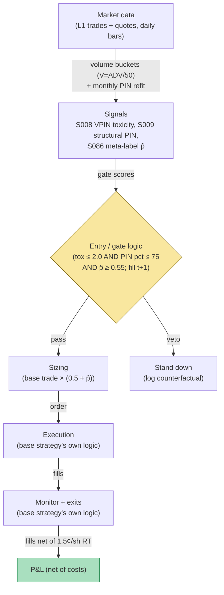

## Stage 192/200 — T092: PIN-Gated Informed-Flow Avoidance

*Batch TB10 · Strategy 92/100 · Signals S009, S008, S086 · Provenance [D]*

### T1. One-line verdict

| | |
|---|---|
| **Style** | Risk-managed directional overlay: takes candidate trades from any signal library but only in tape states where flow toxicity is low |
| **Edge source** | Avoidance, not prediction — VPIN (S008) vetoes entries when informed one-sided flow is flooding the tape; structural PIN (S009) sets a slow-moving background condition; meta-labeling (S086) gives a second opinion on each candidate trade |
| **Typical holding period** | Whatever the underlying candidate strategy dictates (minutes to days); this strategy is a gate, not a clock |
| **Capacity hint** | Scales with the base strategy's capacity, minus 20–40% (example) for the gate's fill-rate haircut |
| **Build-or-buy in one line** | Build the gates in a week on L1 data; buy nothing new — VPIN and PIN run on trades and quotes you already have |

### T2. Full mechanics

**The idea, plainly.** Most losses in short-horizon trading don't come from bad signals — they come from trading *into* flow you can't see: informed sellers hitting every bid while your mean-reversion model fades the tape. **PIN** (probability of informed trading, S009) estimates the chance that any given trade is information-driven, using a structural model of order arrival (Easley, Kiefer, O'Hara & Paperman 1996; Easley, Hvidkjaer & O'Hara 2002). **VPIN** (volume-synchronized probability of informed trading, S008) is its high-frequency cousin: instead of calendar time, it buckets trades by *volume* — each bucket holds the same number of shares — and measures buy/sell imbalance per bucket. A burst of one-sided buckets means toxic flow. **Meta-labeling** (S086) trains a second machine-learning model whose only job is to predict whether the primary strategy's trades will be winners — a "second opinion" that can veto or down-size.

**The key asymmetry, honored throughout this chapter.** PIN is a **slow-moving structural condition** — it updates monthly or quarterly and describes the background information environment of a name. VPIN is a fast intraday gate — it moves bucket to bucket. Neither is a directional trigger: high toxicity tells you *not to play*, not which way to bet. The direction comes from whatever candidate strategy you plug in underneath.

**VPIN construction (example parameters).** Bucket volume V = ADV / 50 (example; 50 buckets per day). Within each bucket, sign trades with bulk volume classification (BVC: allocate each trade's volume to buy/sell by where it printed inside the spread — trades at the ask count as buys). VPIN over the trailing 50 buckets (example window):

$$\mathrm{VPIN}_t = \frac{\sum_{b=1}^{50} |V^b_{\mathrm{buy}} - V^b_{\mathrm{sell}}|}{50 \times V}$$

Toxicity is the z-score of VPIN against its own 20-day rolling distribution; the gate blocks entries when toxicity ≥ 2.0 (example threshold).

**PIN usage.** Estimate PIN monthly per name via the Easley–Hvidkjaer–O'Hara maximum-likelihood fit on daily buy/sell counts (Lee–Ready signed). Compute the name's cross-sectional percentile; the background condition requires PIN percentile ≤ 75th (example) — in the most information-asymmetric names, the strategy stands down entirely for the month, because no intraday gate reliably survives a tape dominated by informed flow.

**Meta-label (S086).** Primary strategy proposes a trade (direction + size). The meta-model — a calibrated gradient-boosted classifier trained on the primary's historical trades with features [VPIN toxicity, PIN percentile, spread, RVOL, hour-of-day, the primary signal's own z-score] (example feature set) — outputs p̂ (probability the trade is a winner). Trade only if p̂ ≥ 0.55 (example); size = base × (0.5 + p̂) (example: p̂ = 0.6 → 1.1×, p̂ = 0.9 → 1.4×).

**Entry/exit logic.** This chapter supplies *gates*, not entries: a candidate trade passes only if (i) VPIN toxicity at the latest closed bucket ≤ 2.0 (example), (ii) the name's PIN percentile ≤ 75 (example), and (iii) meta p̂ ≥ 0.55 (example). Direction, stop, and target come from the underlying strategy. **Causal timing, stated explicitly: VPIN for bucket t is computed when bucket t closes; the earliest a candidate trade may be gated-and-filled is during bucket t+1.** PIN percentiles update on the monthly refit date and apply from the next session. Meta p̂ is computed from features available at the decision bar and fills at t+1.

**Sizing & costs.** Sizing is the underlying strategy's sizing multiplied by the meta scaler. Cost model for the worked example: 1.5¢/share round-trip (example), i.e., $30 per 2,000-share candidate trade.

**Risk limits.** The gate itself is the risk control; add: if the veto rate exceeds 80% over a rolling week (example), the underlying strategy is likely misfiring in the current regime — investigate, don't just widen the gate. Max 2% daily loss on the sleeve (example).

**Order/execution.** No special execution: the gate decides *whether*, the base strategy decides *how*.

### T3. Signals it consumes

| Signal | Role | Weight / logic |
|---|---|---|
| S008 (VPIN toxicity) | Fast intraday veto gate | hard veto when toxicity ≥ 2.0 (example); no weight — a gate, not a blend |
| S009 (structural PIN) | Slow background condition | hard monthly condition: PIN percentile ≤ 75 (example); updates monthly, applies next session |
| S086 (meta-labeling) | Second opinion | p̂ ≥ 0.55 to trade (example); size multiplier 0.5 + p̂ (example) |

Pseudocode (≤25 lines):
```
monthly refit: estimate PIN per name (EHO MLE on Lee-Ready counts)  # S009
    if PIN_percentile[s] > 75: BLOCK_MONTH[s] = True               # example threshold
every closed volume bucket t (V = ADV/50, BVC-signed):             # granularity: volume buckets
    VPIN[t] = mean |buy-sell| / V over trailing 50 buckets         # S008
    tox[t] = z(VPIN[t], 20d rolling)                              # toxicity
    for each candidate trade c proposed by base strategy at t:    # fills at t+1 earliest
        if BLOCK_MONTH[s]: veto("structural PIN")
        elif tox[t] >= 2.0: veto("toxic flow")                     # example
        elif meta_p[c] < 0.55: veto("meta-label")                  # S086, example
        else: take c at 0.5 + meta_p size scale                    # example
```

### T4. Worked example — numbers + P&L (SYNTHETIC)

Synthetic $500k paper book, one session, six candidate trades of 2,000 shares each (gross outcomes are the candidates' illustrative marks). Seed 192.

| # | Bucket | Toxicity | PIN pct | Meta p̂ | Decision | Illustrative gross |
|---|---|---|---|---|---|---|
| 1 | 12 | 0.8 | 41 | 0.71 | **TAKE** | +$1,240 |
| 2 | 30 | 3.1 | 44 | 0.62 | VETO (toxic) | −$980 |
| 3 | 41 | 1.2 | 39 | 0.48 | VETO (meta) | −$620 |
| 4 | 49 | 2.6 | 82 | 0.70 | VETO (toxic + PIN) | −$1,150 |
| 5 | 55 | 0.4 | 46 | 0.66 | **TAKE** | −$410 |
| 6 | 68 | 3.8 | 50 | 0.58 | VETO (toxic) | −$340 |

Ledger (fully costed), taken trades only:
- Taken gross: +$1,240 − $410 = **+$830**
- Costs: 2 trades × $30 = **$60**
- **Gated net: +$770**

Counterfactual, all six taken (ungated):
- Gross: +$830 − $980 − $620 − $1,150 − $340 = **−$2,260**
- Costs: 6 × $30 = **$180**
- **Ungated net: −$2,440**

**Session net: +$770 gated vs −$2,440 ungated (synthetic; demonstrates the veto arithmetic — the value is entirely in the avoided losses, not forward alpha or after-cost profitability).**

**Where the example is optimistic.** The vetoed trades' "would-have-lost" figures are the chapter's least honest input — real veto evaluation requires the base strategy to actually take the vetoed trades (or a careful counterfactual accounting), and toxicity gates have a well-documented habit of vetoing the *recovery* trades too. The $30/trade cost is fixed regardless of outcome, which flatters the vetoed side slightly (losers often cost more via slippage). VPIN here is computed on clean synthetic buckets; real BVC (bulk volume classification) mis-signs mid-spread prints, and toxicity z-scores drift with the 20-day window choice. The PIN percentile is assumed known at month-start with no estimation error — the EHO MLE is famously noisy on thin names.


*Chart caption: synthetic data — not market data. Watermark reads "SYNTHETIC EXAMPLE" exactly. Seed 192; taken/vetoed marks match the T4 table.*

### T5. Data & infra — what must run

**Feed.** L1 trades and quotes (SIP-class is sufficient — VPIN needs only signed trade volume, PIN needs Lee–Ready trade direction from quotes). No depth feed required: this is the chapter's economic argument.

**Jobs.** Monthly: PIN MLE refit per name (the likelihood optimization is the only heavy step; minutes per name on the M5 Max). Intraday: accumulate volume buckets, BVC-sign in real time, maintain the 50-bucket VPIN and its 20-day z-score baseline. Per decision bar: score meta p̂ (a GBM inference is microseconds).

**Storage.** 60 days of L1 trades+quotes per cost-model §4: ~2–8 GB/symbol-day in parquet — the bucketed features are kilobytes. The meta-label training set (base strategy's trade history with features) is megabytes.

**M5 Max feasibility.** Per cost-model §2 (polars 10–50M rows/sec): the monthly PIN fit is the only real job and runs in minutes. Intraday bucketing is trivial. Verdict: **feasible** — this is the cheapest chapter in the batch to run. Engineering: Tier M (20–60 h) for the gate service plus Tier M for the meta-label pipeline; planning band **40–100 h ≈ $6k–$15k loaded-cost estimate** at $150/hr. What breaks first at 500 symbols: the monthly PIN refit wall-clock and Lee–Ready signing correctness across corporate actions, not the CPU.

**Feed-drop failure plan.** If the trade feed stalls: buckets stop closing, so the last *computed* toxicity stands — entries are blocked (fail closed) and existing positions are managed by the base strategy's own stops. Never extrapolate toxicity across a feed gap.

### T6. Buy vs build

| Option | What you get | Indicative price | Gains | Loses |
|---|---|---|---|---|
| Tier-0: Alpaca/SIPC L1 + self-built VPIN/PIN | Free trades+quotes | ~$0, `indicative — verify before budgeting` | $0 marginal; everything needed for VPIN | PIN MLE and BVC signing are your code to debug |
| Tier-1: Polygon Stocks Advanced | Clean SIP bars + WS | ~$199/mo individual, `indicative — verify before budgeting` | Cleaner corporate-action handling | No depth, but this chapter needs none |
| Build the meta-label in-house | GBM on your trade history | engineering hours only | Your base strategy's actual veto patterns | Needs hundreds of labeled trades before p̂ calibrates |
| Buy "toxicity" from a vendor | Precomputed flow metrics | institutional $$, `indicative — verify before budgeting` | Saves the bucketing code | Black-box thresholds you can't audit |

**Verdict: build it all; buy nothing.** This chapter is pure software on data you already collect. The only honest buy is cleaner L1 (Tier-1) if your free feed's corporate-action handling is corrupting Lee–Ready signing.

### T7. Success-ratio evidence

Published, checkable sources only; figures before-cost unless stated.

| Study | Market & period | Finding | Before/after cost | Caveat |
|---|---|---|---|---|
| Easley, López de Prado & O'Hara (2011/2012), "Flow Toxicity and Liquidity in a High Frequency World" | US futures/equities, 2007–2010 | VPIN spikes preceded the May 6, 2010 Flash Crash and other liquidity events; toxicity is a measurable precursor of stress | Before cost (predictive of events, not a traded P&L) | VPIN predicts *liquidity stress*, not direction — exactly this chapter's gate use, but the jump from "toxicity precedes stress" to "vetoing improves a strategy's Sharpe" is not in the paper |
| Easley, Hvidkjaer & O'Hara (2002), "Is Information Risk a Determinant of Asset Returns?" *J. Finance* | NYSE 1983–1998 | PIN (structural informed-trading probability) is priced in the cross-section | Before cost | Duarte & Young (2009) later showed much of PIN's premium is illiquidity, not information asymmetry — PIN as a *condition* is defensible; PIN as a *priced risk factor* is contested |
| López de Prado (2018), *Advances in Financial Machine Learning*, Ch. 3 | — | Meta-labeling: a secondary ML model on bet outcomes improves the primary strategy's precision/F1 by vetoing and sizing, without changing its side | Before cost (method) | The improvement is in *classification metrics on the primary's own history*; purged/embargoed CV (S088) is required, and the meta-model inherits every overfitting sin of the primary |
| Andersen & Bondarenko (2014), "VPIN and the Flash Crash" | US equities, 2010 | Replication contesting VPIN: poor short-run volatility predictor; its behavior is largely mechanical trading intensity and classification-dependent | Before cost (critique) | The counterweight to row 1 — VPIN's predictive content is disputed, which is why this chapter uses it as a *conservative veto* (fails safe when overstated) rather than a timing signal |

**Honest bottom line.** As a standalone "strategy": not a strategy at all — a gate has no P&L without a base strategy underneath. As a filter: the credible use — toxicity vetoes are the highest-sharpe-per-line-of-code improvement most short-horizon desks actually implement. As a production system: requires the base strategy's trade history for the meta-label, so the real cost is organizational (logging discipline), not computational.

### T8. Failure modes

- **Toxicity vetoes the recovery.** VPIN stays elevated through the bounce; the gate blocks the trades that would have repaired the day. Mitigation: cooldown — after a veto, re-arm only when toxicity falls below 1.0 for 3 consecutive buckets (example), not the instant it dips.
- **PIN estimation noise.** The EHO MLE is unstable on thin or volatile names; a bad monthly percentile blocks (or admits) a name for weeks. Mitigation: shrink percentiles toward the cross-sectional median; require 60 days of clean data before unblocking.
- **BVC mis-signing.** Mid-spread prints (dark-pool crosses reported to the tape) get misallocated by bulk volume classification. Mitigation: the gate is conservative by design; mis-signing mostly *overstates* toxicity, which fails safe.
- **Meta-label overfitting.** With a few hundred trades, the GBM memorizes which hours were lucky. Mitigation: purged/embargoed CV (S088), calibration plots, and a minimum of ~500 labeled trades (example) before p̂ gates real size.
- **Gate-threshold overfit.** Toxicity ≥ 2.0 and p̂ ≥ 0.55 are example values; the strategy's entire P&L can hinge on them. Mitigation: report the veto P&L across a threshold grid; reject the gate if only a knife-edge works.
- **Lookahead in bucketing.** Using the bucket's final imbalance to gate a fill *inside* the same bucket. Mitigation: gates use only closed buckets; fills at t+1 — the rule is stated in T2 and unit-tested.

### T9. Visuals


*Chart caption: synthetic data — not market data. Watermark reads "SYNTHETIC EXAMPLE" exactly. Seed 192; the four vetoed marks sit at the T4 bucket indices; the walk shows gated +$770 vs ungated −$2,440.*



### T10. Sources

1. Easley, D., López de Prado, M. M. & O'Hara, M. (2012). "Flow Toxicity and Liquidity in a High Frequency World." *Review of Financial Studies* 25(5): 1457–1493. https://papers.ssrn.com/sol3/papers.cfm?abstract_id=1695596 — VPIN construction; toxicity preceded the 2010 Flash Crash. RePEc/EconPapers page re-checked 2026-09-10 — title, authors, journal, volume/pages match (the 2011 working-paper version circulated first; the RFS version is the citable one).
2. Easley, D., Hvidkjaer, S. & O'Hara, M. (2002). "Is Information Risk a Determinant of Asset Returns?" *Journal of Finance* 57(5): 2185–2221. http://ideas.repec.org/a/bla/jfinan/v57y2002i5p2185-2221.html — structural PIN via MLE on order arrival. RePEc page confirmed in S009's S12, verified in an earlier batch (not re-checked this pass).
3. López de Prado, M. M. (2018). *Advances in Financial Machine Learning*, Chapters 3–4. Wiley. https://www.wiley.com/en-us/9781119482086 — meta-labeling (secondary ML on bet outcomes) and the triple-barrier labeling method it pairs with. Wiley page returned HTTP 403 on re-check 2026-09-10 — identifier not re-verified this pass; citation inherited from S086's S12.
4. Duarte, J. & Young, L. (2009). "Why is PIN Priced?" *Journal of Financial Economics* 91(2): 119–138. https://ideas.Repec.org/a/eee/jfinec/v91y2009i2p119-138.html — much of PIN's return premium is illiquidity, not information asymmetry; the honest counterweight. RePEc page re-opened 2026-09-10 — title and journal match (also confirmed in S009's S12, earlier batch).
5. Andersen, T. G. & Bondarenko, O. (2014). "VPIN and the Flash Crash." *Journal of Financial Markets* 17: 1–46. https://ideas.repec.org/a/eee/finmar/v17y2014icp1-46.html — replication contesting VPIN: poor short-run volatility predictor; behavior largely mechanical trading intensity. RePEc page re-opened 2026-09-10 — title, journal, volume/pages match (also confirmed in S008's S12, earlier batch).

**Unverified leads** (not confirmed facts — verify before use):
- The gate thresholds (toxicity 2.0, PIN 75th percentile, p̂ 0.55, size scaler 0.5 + p̂) are the chapter's own `example` design values (2026-09-10), not published recommendations.
- Easley–López de Prado–O'Hara's Flash Crash result is about *liquidity stress prediction*; the step to "vetoing improves strategy Sharpe" is this chapter's design, not their finding.

*Source log (2026-09-10 rework pass): batch research Q-labels removed from this chapter. Re-checked 2026-09-10: RePEc/EconPapers pages for Easley–López de Prado–O'Hara (2012), Duarte–Young (2009), and Andersen–Bondarenko (2014) (titles/journals match); the Wiley publisher page returned HTTP 403 and was not re-verified. Easley–Hvidkjaer–O'Hara (2002) citation inherited from S009's earlier-batch verification (not re-checked this pass). Gate thresholds are the chapter's own example design values.*
