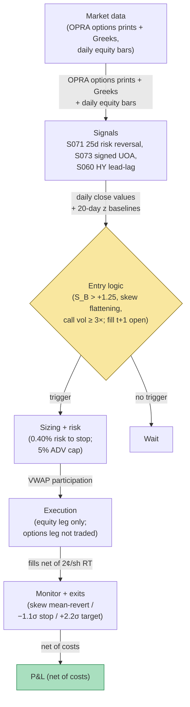

## Stage 193/200 — T093: Options-to-Equity Lead Trader

*Batch TB10 · Strategy 93/100 · Signals S071, S073, S060 · Provenance [D/SR]*

### T1. One-line verdict

| | |
|---|---|
| **Style** | Directional equity swing, 1–8 sessions, led by derivatives-market positioning |
| **Edge source** | Options traders move first: 25-delta risk-reversal skew flattening (S071) plus unusually heavy signed call/put flow (S073) front-run the underlying, with Hayashi–Yoshida lead-lag (S060) confirming the timing; the equity leg harvests the catch-up |
| **Typical holding period** | 1–8 sessions (example), exited when skew mean-reverts or the stop prints |
| **Capacity hint** | $1–5M per name (example) — you are trading the *equity* leg, so equity liquidity is the cap, but the signal only fires on names with listed options flow |
| **Build-or-buy in one line** | Build the skew/lead-lag estimators; buy the OPRA feed — the flow data is the moat, not the math |

### T2. Full mechanics

**The idea, plainly.** Informed traders often express views in options first (leverage, defined risk), and the equity catches up. Three measurements triangulate the same phenomenon. **Risk reversal** (S071): the 25-delta call implied volatility minus the 25-delta put implied volatility (IV_call25 − IV_put25). When put skew collapses (puts cheapen relative to calls), it reads as bullish positioning — the classic "skew flattening = bullish" heuristic, though it can also mean put writers collecting premium, so it is never traded alone. **Unusual options activity** (S073): today's call volume (or put/call ratio) versus its trailing average — 3× normal call flow (example) with most of it on the ask side is the footprint. **Hayashi–Yoshida lead-lag** (S060): a covariance estimator for *asynchronous* data — it asks whether options-implied moves systematically precede equity moves (or vice versa) over a trailing window, without requiring synchronized timestamps.

**The direction-inference honesty rule.** Options prints don't carry trader IDs: a big call buy could be a bull, a short covering, or a market-maker hedging. S073's canon is explicit — direction is *inferred*, never observed. This strategy therefore requires all three signals to agree before it acts: skew flattening + heavy signed call flow + a measured options-lead over the equity. Any single leg is a rumor; three legs are a signal.

**Combination score (example weights).**

$$S^B_t = 0.45\,z(-\Delta\mathrm{skew}_t) + 0.35\,z(\mathrm{signedCallFlow}_t) + 0.20\,\mathrm{LeadLag}_t$$

where −Δskew rewards flattening (defined so positive = bullish), signedCallFlow is (ask-side call volume − bid-side call volume) relative to its 20-day mean, LeadLag is the HY lead-lag statistic scaled to [−1, 1], and z is a 20-day rolling z-score clipped to [−3, 3]. All weights `example`.

**Entry rule.** Enter long when: (i) S_B > +1.25 (example); (ii) the skew impulse computed over the trailing 5 sessions is negative (flattening); (iii) call-volume ratio ≥ 3.0× its 20-day mean (example); (iv) relative equity spread ≤ 10 bps (example). **Causal timing, stated explicitly: S_B is computed from the options close and the equity close at day t; the earliest legal fill is the day t+1 open.** There is no same-bar trading — the options market is closed when you decide.

**Exit rule.** Skew mean-reversion exit: cover when the 25-delta skew returns to within 0.5 vol points of its 20-day mean (example). Hard stop: −1.1 × σ_20d (example). Time stop: 8 sessions (example). Target: +2.2 × σ_20d (example).

**Position sizing.** q = (0.40% × equity) / stop_distance (example), capped at 5% of the name's 20-day ADV (example) — the equity leg must not move the stock it is front-running.

**Risk limits.** Max 4 concurrent names (example); daily sleeve stop −2% (example); no new entries in the 2 sessions before scheduled earnings (options flow is noise then).

**Cost model.** Equity leg: 2.0¢/share round-trip (example) — 1.5¢ spread+fees and 0.5¢ estimated impact. Options data cost is infrastructure (T5), not per-trade. Borrow: N/A in the worked example — the example is long-only, so no borrow line appears in the ledger; a short variant would add one.

**Order/execution.** VWAP-style participation on the t+1 open (example): work 30% of the order in the first 30 minutes, the rest passively — the informed flow you're following is still being digested, so don't sprint.

### T3. Signals it consumes

| Signal | Role | Weight / logic |
|---|---|---|
| S071 (25-delta risk reversal) | Primary lead: skew flattening over trailing 5 sessions | 0.45 weight (example) in S_B; the impulse direction |
| S073 (unusual options activity) | Confirmation: signed call-flow magnitude | 0.35 weight (example); call volume ≥ 3× mean (example) gate |
| S060 (HY lead-lag) | Timing confirmation | 0.20 weight (example); requires measured options-lead > 0 (options lead equity) |

Pseudocode (≤25 lines):
```
daily close t:                                            # granularity: daily options close + equity bars
    skew[t] = IV_call25 - IV_put25                        # S071
    impulse = skew[t] - skew[t-5]                         # 5-session flattening
    uoa = signed_call_vol[t] / mean(signed_call_vol, 20)  # S073, direction inferred
    ll = hayashi_yoshida_leadlag(opt_ret, eq_ret, 20d)    # S060, async-safe
    SB[t] = 0.45*z(-impulse,20d) + 0.35*z(uoa,20d) + 0.20*ll
    if SB[t] > 1.25 and impulse < 0 and uoa >= 3.0 and spread <= 10bps:  # example
        enter LONG at next open                            # fill t+1, never t
# exits: skew back within 0.5 vol pts of 20d mean / stop -1.1*sigma20d /
#        target +2.2*sigma20d / time 8 sessions
```

### T4. Worked example — numbers + P&L (SYNTHETIC)

Synthetic mid-cap **INNO** (fictional), 13-session window, seed 193. Options close data synthetic; skew in vol points; equity in dollars.

| Day | 25-delta skew | Call vol ratio | S_B | Action | Equity ($) |
|---|---|---|---|---|---|
| −5 | 5.5 | 1.1× | +0.2 | flat | 50.00 |
| −3 | 3.7 | 1.6× | +0.6 | flat | 50.40 |
| −1 | 2.2 | 2.8× | +1.1 | flat (below gate) | 50.52 |
| 0 | 1.8 | 3.4× | +1.46 | **signal at close** | 50.55 |
| +1 | 1.5 | 2.1× | — | **BUY 8,000 @ 50.61** (t+1 fill) | 50.61 |
| +3 | 1.3 | 1.4× | — | hold | 51.40 |
| +5 | 1.4 | 1.1× | — | hold | 51.80 |
| +7 | 2.4 | 1.0× | — | **SELL 8,000 @ 52.05** (skew mean-reverted) | 52.05 |

Ledger (fully costed):
- Buy: 8,000 × $50.61 = $404,880
- Sell: 8,000 × $52.05 = $416,400
- Gross: **+$11,520**
- Costs: trading 8,000 × $0.02 = $160; slippage 8,000 × $50.61 × 0.0003 = $121.46
- Total costs: **$281.46**
- **Net: +$11,238.54**

**Session net: +$11,238.54 (synthetic; demonstrates the options-lead entry/exit arithmetic, not forward alpha or after-cost profitability).**

**Where the example is optimistic.** The skew flattens exactly as the equity rallies — in real data the correlation between skew impulse and next-week equity returns is weak and sign-unstable (Bali & Hovakimian 2009 find *volatility spreads* predict, but that's a different construction). The 3.4× call-volume print is assumed to be informed buying; it could be a covered-call program or market-maker hedging — direction is inferred, never observed. The t+1 open fill at 50.61 assumes no overnight gap against the position; the options signal is computed after the close, so gap risk is the strategy's unmodeled tax. There is no borrow line in the ledger because the example is long-only; a short variant would add one, and hard-to-borrow names (where skew signals are often strongest) would charge multiples of a placid 0.35% rate.


*Chart caption: synthetic data — not market data. Watermark reads "SYNTHETIC EXAMPLE" exactly. Seed 193; plotted series match the T4 table.*

### T5. Data & infra — what must run

**Feed.** OPRA (all US options quotes/trades) or a vendor consolidation (e.g., CBOE DataShop, LiveVol) for 25-delta IVs and signed volume; equity bars from SIP. Signed flow needs trade-by-trade options prints with quote context — end-of-day summaries don't carry it.

**Jobs.** Nightly: compute 25-delta skew per name (needs a vol surface or vendor Greeks), signed call/put flow ratios, 20-day z baselines, HY lead-lag over the trailing 20 sessions. Morning: rank names by S_B; emit the entry list before the open.

**Storage.** Per cost-model §4, OPRA is the heavy feed in this batch — full OPRA history is TB-scale and usage-priced; a 500-name subset of daily Greeks + intraday prints is GB-scale and manageable. The daily signal panel (skew, ratios, z-scores) is megabytes.

**M5 Max feasibility.** The nightly job is a few thousand surface fits + z-scores — minutes in polars/numpy. The HY estimator is O(n) per pair. Verdict: **feasible** — compute is trivial; the binding constraint is the OPRA license and surface-quality QA. Engineering: Tier H for the options surface + signed-flow pipeline per cost-model §5 (60–200 h), Tier M+ for the strategy (40–100 h); planning band **100–250 h ≈ $15k–$37k loaded-cost estimate** at $150/hr. What breaks first at 500 names: OPRA usage billing and the dividend/early-exercise adjustments in the surface fitter, not the CPU.

**Feed-drop failure plan.** If the options feed is stale at the close: no new signals are computed (fail closed — yesterday's S_B does not carry), existing positions keep their own stops.

### T6. Buy vs build

| Option | What you get | Indicative price | Gains | Loses |
|---|---|---|---|---|
| Tier-0: free end-of-day options summaries | Daily volume/OI | ~$0, `indicative — verify before budgeting` | $0 | No Greeks, no signed flow — S071/S073 uncomputable |
| Tier-1: Polygon Options / Tradier | Options bars + Greeks | ~$199–$500/mo, `indicative — verify before budgeting` | Cheapest path to 25-delta skew | Signed intraday flow quality varies; HY on bars is coarse |
| Tier-2: CBOE DataShop / LiveVol | OPRA-derived analytics | ~$500–$2,000/mo, `indicative — verify before budgeting` | Production-grade skew + flow | Still a black box on signing methodology |
| Tier-3: raw OPRA via Databento | Every quote/trade | usage-priced, institutional $$, `indicative — verify before budgeting` | Full control | You build the surface fitter (the Tier H job) |

**Verdict: buy Tier-1 or Tier-2 for the analytics, build the combinators.** Nobody sells the S_B blend or the HY timing overlay; everybody sells the skew. The proprietary layer is the *combination and the discipline to require all three legs* — which is exactly what the UOA (unusual options activity) newsletter industry does not do.

### T7. Success-ratio evidence

Published, checkable sources only; figures before-cost unless stated.

| Study | Market & period | Finding | Before/after cost | Caveat |
|---|---|---|---|---|
| Pan & Poteshman (2006), "Option Volume and Stock Prices: Evidence on Where Informed Traders Trade" | CBOE 1990–2001 | Put-call ratios from option volume predict next-day stock returns; informed traders use options | Before cost | Predictability is short-horizon and concentrated; transaction costs in the underlying eat much of it |
| Xing, Zhang & Zhao (2008/2010), "What Does Individual Option Volatility Smirk Tell Us About Future Equity Returns?" | US equities 1996–2005 | Stocks with the steepest volatility smirks underperformed by ~10.9% annually risk-adjusted; smirk shape forecasts returns up to 6 months | Before cost | The smirk *level* predicts; this chapter trades smirk *changes* (flattening) — a related but distinct claim with weaker documentation |
| Johnson & So (2012), "The Option to Stock Volume Ratio and Future Returns" | US 1996–2009 | O/S (option-to-stock volume) predicts next-week returns; informed flow migrates to options | Before cost | The lead is days, not minutes — consistent with this chapter's 1–8 session horizon, but the effect is cross-sectional, not a timing rule |
| Bali & Hovakimian (2009), "Volatility Spreads and Expected Stock Returns" | US 1996–2005 | Volatility spreads (option IV vs realized) predict stock returns | Before cost | Volatility *spread* (level) predicts; skew *impulse* (change) is this chapter's extension, less documented |

**Honest bottom line.** The literature supports "options flow contains information about future equity returns" at days-to-weeks horizons — the direction this chapter bets. It does *not* support the specific S_B blend, the ±1.25 gate, or the skew-mean-reversion exit as a traded rule. The documented effects are cross-sectional and before-cost; a timing strategy on a handful of names is a different, harder claim.

### T8. Failure modes

- **Inferred direction is wrong.** The 3.4× call print was a covered-call overwrite, not informed buying. Mitigation: the three-leg rule — skew must flatten *and* HY must show options-lead; single-leg flow is never traded.
- **Overnight gap against the position.** The signal is computed after the close; the t+1 open can gap through the stop. Mitigation: size for gap risk (the 0.40% risk is to the stop, but the true risk is the gap) — halve size on high-IV names (example).
- **Skew mean-reverts without the equity moving.** The exit fires flat. Mitigation: that's the design — the exit is a signal-decay exit, not a profit guarantee; the stop bounds the damage.
- **Surface-fitting artifacts.** Bad dividends or stale quotes create fake skew moves. Mitigation: vendor Greeks with QA flags; drop any name-day where the surface fit RMSE exceeds tolerance (example).
- **Earnings contamination.** Options flow before earnings is vol positioning, not direction. Mitigation: the 2-session earnings exclusion.
- **Lookahead in z-scores.** Baselines including day t. Mitigation: trailing-only windows, unit-tested.
- **Threshold overfit.** ±1.25, 3×, 0.5 vol points are examples. Mitigation: grid sensitivity in research; reject knife-edge thresholds.

### T9. Visuals


*Chart caption: synthetic data — not market data. Watermark reads "SYNTHETIC EXAMPLE" exactly. Seed 193; the shaded band is the 5-session impulse window; the vertical dotted line marks the t close signal; fills are t+1.*



### T10. Sources

1. Pan, J. & Poteshman, A. M. (2006). "The Information in Option Volume for Future Stock Prices." *Review of Financial Studies* 19(3): 871–908. https://doi.org/10.1093/rfs/hhj024 — option volume contains information for future stock prices. Identifier re-checked 2026-09-10 via Crossref API (title + journal + year match).
2. Xing, Y., Zhang, X. & Zhao, R. (2010). "What Does Individual Option Volatility Smirk Tell Us About Future Equity Returns?" *Journal of Financial and Quantitative Analysis* 45(3): 641–662. SSRN: http://papers.ssrn.com/sol3/papers.cfm?abstract_id=1107464 — steepest-smirk stocks underperformed ~10.9% annually risk-adjusted; persistence up to six months. SSRN working-paper page re-opened 2026-09-10 — title and abstract match; the JFQA 45(3) volume/pages are carried from the prior draft (not re-verified this pass).
3. Johnson, T. L. & So, E. C. (2012). "The Option to Stock Volume Ratio and Future Returns." *Journal of Financial Economics* 106(2): 262–286. https://doi.org/10.1016/j.jfineco.2012.05.008 — O/S ratio predicts next-week returns. DOI re-checked 2026-09-10 in this batch's rework pass — resolves with matching title.
4. Hayashi, T. & Yoshida, N. (2005). "On Covariance Estimation of Non-Synchronously Observed Diffusion Processes." *Bernoulli* 11(2): 359–379. https://www.projecteuclid.org/journals/bernoulli/volume-11/issue-2/On-covariance-estimation-of-non-synchronously-observed-diffusion-processes/10.3150/bj/1116340299.short — the asynchronous lead-lag estimator this chapter uses for timing confirmation. Project Euclid page re-opened 2026-09-10 — title, journal, and DOI match.

**Unverified leads** (not confirmed facts — verify before use):
- All blend weights and thresholds in T2/T3 (0.45/0.35/0.20, ±1.25, 3× call volume, 0.5 vol-point exit, ±1.1σ/2.2σ) are the chapter's own `example` design values (2026-09-10), not published recommendations.
- The claim that skew *flattening* (change) predicts as the smirk *level* does is this chapter's extension; the verified literature is on levels (Xing et al.) and spreads (Bali & Hovakimian).

*Source log (2026-09-10 rework pass): batch research Q-labels removed from this chapter. Re-checked 2026-09-10: Pan–Poteshman citation corrected to the Crossref-verified DOI 10.1093/rfs/hhj024 (title + journal + year match); SSRN 1107464 working-paper page re-opened (title + abstract match); Johnson–So DOI re-checked (resolves, title matches); Hayashi–Yoshida Project Euclid page re-opened (title + journal + DOI match). The long-only borrow line was removed as a ledger error — net recomputed as $11,520 − $160 − $121.46 = $11,238.54. Thresholds remain the chapter's own example design values.*
