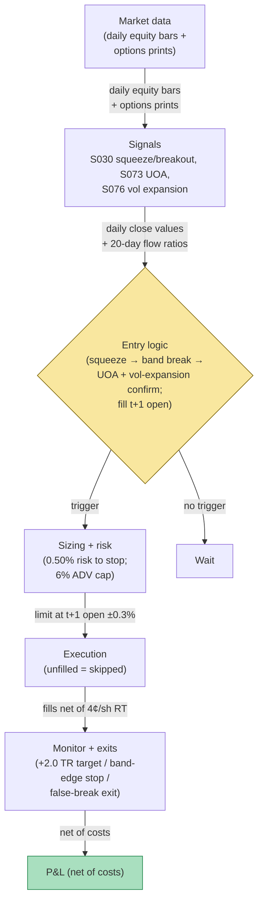

## Stage 194/200 — T094: Squeeze Breakout (Options-Confirmed)

*Batch TB10 · Strategy 94/100 · Signals S030, S073, S076 · Provenance [D/SR]*

### T1. One-line verdict

| | |
|---|---|
| **Style** | Directional breakout swing, 1–10 sessions: coiled volatility + options-flow confirmation |
| **Edge source** | A volatility squeeze (S030) is direction-neutral stored energy; the breakout direction is confirmed by unusual options activity (S073) and volatility-expansion state (S076) — three independent witnesses before the trade |
| **Typical holding period** | 2–10 sessions (example); the breakout leg is fast or it's wrong |
| **Capacity hint** | $1–3M per name (example) — breakout entries are liquidity-demanding by construction |
| **Build-or-buy in one line** | Build the squeeze/breakout detector; buy the options-flow feed — the confirmation is the product |

### T2. Full mechanics

**The idea, plainly.** A **volatility squeeze** (S030) is a coiled spring: Bollinger bandwidth (band width divided by the moving average) at a multi-month low means the market has stopped moving — and stopped-moving markets are usually *about* to move. The squeeze itself is direction-neutral; it says *when*, not *which way*. **Unusual options activity** (S073) supplies the *which way*: heavy signed call (or put) volume into the squeeze's end is the informed-flow footprint. **Volatility expansion** (S076) confirms the breakout is real: range must expand *with* the price move, not after it.

**Squeeze definition (example).** Bollinger bandwidth % = 100 × (upper − lower) / middle, 20-session, 2σ. Squeeze = bandwidth below its 6-month 10th percentile (example) for ≥ 10 sessions (example). Breakout = daily close beyond the band *plus* volume ≥ 1.5× its 20-day mean (example).

**Options confirmation (example).** Within the 3 sessions before or on the breakout: call-volume ratio ≥ 3.5× its 20-day mean (example) for a long breakout (put ratio for shorts), with ≥ 60% of the volume on the ask side (example). Direction inferred, never observed — the S073 honesty rule.

**Vol-expansion confirmation (example).** The breakout bar's true range ≥ 1.8× the 20-day mean true range (example); otherwise the "breakout" is a drift and the trade is skipped.

**Entry rule.** Enter in the breakout direction when ALL three confirm: squeeze → band break + volume → options flow agrees → vol expansion. **Causal timing, stated explicitly: the breakout is confirmed on the close of bar t; the earliest legal fill is the t+1 open.** Chasing the breakout bar itself is prohibited — the fill would be at the worst print of the move.

**Exit rule.** Target: +2.0 × the breakout bar's true range (example) — the move should pay for its own volatility. Stop: the opposite band edge at entry, or −1.0 × σ_20d, whichever is tighter (example). Time stop: 10 sessions (example) — breakouts that stall are false. False-break filter: if the price closes back inside the band within 2 sessions, exit at the next open regardless of P&L (example).

**Position sizing.** q = (0.50% × equity) / stop_distance (example), capped at 6% of 20-day ADV (example).

**Risk limits.** Max 3 concurrent breakouts (example); a false break (stopped within 2 sessions) triggers a 5-session stand-down on that name (example); daily sleeve stop −2% (example).

**Cost model.** Equity leg: 4.0¢/share round-trip all-in (example: 1.5¢ spread/fees + 2.5¢ breakout-chase impact — breakouts are expensive to enter). Options confirmation is *data*, not a traded leg — but the ×100 contract multiplier matters for understanding why: mirroring the 4,000-share equity leg in options would be 40 contracts (4,000 ÷ 100); a $0.20 quoted straddle spread × 100 shares/contract × 40 contracts = $800 round-trip friction on the options leg alone — which is exactly why this strategy trades the equity leg and only *reads* the options tape. (Multiplier shown explicitly per the batch cost-model rule.)

**Order/execution.** Limit order at the t+1 open ±0.3% (example); if unfilled after 30 minutes, cancel — a breakout you can't enter cleanly is a breakout you skip.

### T3. Signals it consumes

| Signal | Role | Weight / logic |
|---|---|---|
| S030 (squeeze: bandwidth percentile + breakout) | Setup + trigger | squeeze ≥ 10 sessions (example) → band break + 1.5× volume (example) = trigger |
| S073 (unusual options activity) | Directional confirmation | call/put ratio ≥ 3.5× mean, ≥60% ask-side (example); must agree with break direction |
| S076 (volatility expansion) | Breakout validation | breakout-bar true range ≥ 1.8× mean (example); false-break exit rule |

Pseudocode (≤25 lines):
```
daily close t:                                              # granularity: daily bars + options prints
    bw[t] = 100*(upper20 - lower20)/mid20                    # S030
    squeeze = percentile(bw[t], 6m) < 10 for last 10 sess    # example
    breakout = close[t] > upper20 and vol[t] >= 1.5*mean(vol,20)   # example
    uoa_ok = signed_opt_ratio[t-3:t] >= 3.5 and ask_share >= 0.60  # S073, example
    volx_ok = true_range[t] >= 1.8*mean(TR, 20)             # S076, example
    if squeeze and breakout and uoa_ok and volx_ok:
        enter at next open in break direction               # fill t+1, never t
# exits: target +2.0*breakout_TR / stop band edge or -1.0*sigma20d /
#        false-break: close back inside band within 2 sessions -> exit next open
```

### T4. Worked example — numbers + P&L (SYNTHETIC)

Two synthetic names, seed 194 — one true breakout, one false break, to show the exit discipline.

**Trade 1 — VOLT (true breakout, long).** 14-session squeeze (bandwidth at 2nd percentile), upper-band break on volume 1.9× mean, call ratio 4.2× with 68% ask-side, breakout-bar range 2.1× mean. Signal at close; fill t+1.

| Leg | Detail |
|---|---|
| BUY | 4,000 @ $84.24 (t+1 open) = $336,960 |
| SELL | 4,000 @ $88.10 (target +2.0 × breakout range) = $352,400 |
| Gross | **+$15,440** |
| Costs | 4,000 × $0.04 RT = $160 |
| **Net** | **+$15,280** |

**Setup 2 — DEAD (false break, vetoed — no fill).** Squeeze + band break, but call ratio only 1.8× — below the 3.5× confirmation gate, so the disciplined strategy takes no fill and books no ledger line. The avoided outcome, for the record: had the gate been ignored, entry 4,000 @ $31.55 with the false-break exit at $31.02 would have printed gross −$2,120, costs $160, net **−$2,280** — that is the loss the veto saved, not a booked trade.

**Session net: +$15,280 (synthetic; demonstrates the confirmation/exit arithmetic — the vetoed false break is avoided tuition, not forward alpha or after-cost profitability).**

**Where the example is optimistic.** VOLT's breakout runs a clean +4.6% to target with no intraday shakeout below the band — real breakouts retest, and the retest is where the false-break exit gets whipsawed (exit, then watch it run). DEAD's false break is *vetoed* by the options gate it failed — in production the 3.5×/60% thresholds are example values, and marginal passes are where real losses live. The 4¢/share cost assumes the t+1 open fill is orderly; true volatility breakouts gap, and gap fills pay multiples of the modeled cost. The 14-session squeeze at the 2nd percentile is a cherry-picked coil; most squeezes resolve into drift, which is why the three-confirmation rule exists — and why it keeps you out of most trades.


*Chart caption: synthetic data — not market data. Watermark reads "SYNTHETIC EXAMPLE" exactly. Seed 194; the bandwidth panel shows the squeeze line at 8% (example); trade marks match the T4 table.*

### T5. Data & infra — what must run

**Feed.** Daily equity bars (SIP-class) for the squeeze/breakout detector; options prints + signed flow for the UOA confirmation (Tier-1/2 per T093's table — same feed, shared cost).

**Jobs.** Nightly: bandwidth percentiles, band breaks, volume ratios, options-flow ratios, vol-expansion check across the universe; emit the confirmed-breakout list before the open. Intraday: monitor the false-break rule (close back inside the band) for open positions.

**Storage.** Daily bars + options summaries: GB-scale for a 500-name universe. Trivial.

**M5 Max feasibility.** A nightly scan of 500 names is seconds. Verdict: **feasible** — the cheapest compute in the batch after T092; the work is feed QA, not FLOPs. Engineering: Tier M (20–60 h) for the detector + Tier M for the options-confirmation join; planning band **40–100 h ≈ $6k–$15k loaded-cost estimate** at $150/hr. What breaks first at 500 names: the options-flow join (matching prints to names across corporate actions), not the CPU.

**Feed-drop failure plan.** If the options feed is stale: no new confirmations (fail closed — an unconfirmed breakout is not traded). If the equity feed drops intraday: existing positions keep exchange-native stops; no new entries.

### T6. Buy vs build

| Option | What you get | Indicative price | Gains | Loses |
|---|---|---|---|---|
| Tier-0: free daily bars, no options | Squeeze detector only | ~$0, `indicative — verify before budgeting` | $0 | No UOA confirmation — you trade every false break |
| Tier-1: Polygon Options | Options bars + Greeks | ~$199–$500/mo, `indicative — verify before budgeting` | Cheapest confirmed-breakout stack | Signed-flow granularity varies |
| Tier-2: CBOE DataShop / LiveVol | Production flow analytics | ~$500–$2,000/mo, `indicative — verify before budgeting` | Cleaner confirmation | Same build for the detector |
| Newsletter UOA services | Pre-flagged unusual activity | ~$100–$300/mo, `indicative — verify before budgeting` | Saves the join | Black-box flags; no ask-side share; can't audit the 3.5×/60% rule |

**Verdict: build the detector, buy Tier-1/2 for confirmation.** The squeeze math is 20 lines; the options join is the product. Never buy the *signal* (newsletter flags) — you can't risk-manage a flag you can't recompute.

### T7. Success-ratio evidence

Published, checkable sources only; figures before-cost unless stated.

| Study | Market & period | Finding | Before/after cost | Caveat |
|---|---|---|---|---|
| The squeeze/breakout pattern is practitioner literature (Bollinger 2001; Carter's "squeeze" framework) | — | Bandwidth compression precedes expansion; the pattern is a volatility-regime observation | N/A (practitioner) | No peer-reviewed P&L evidence for the squeeze-breakout *trading rule* — the pattern is descriptive, and "compression precedes expansion" is symmetric (expansion can be down) |
| Pan & Poteshman (2006) | CBOE 1990–2001 | Option volume predicts next-day stock returns | Before cost | Supports the UOA confirmation leg, not the squeeze trigger |
| Johnson & So (2012) | US 1996–2009 | Option-to-stock volume predicts next-week returns | Before cost | Same: confirmation leg only; the joint rule (squeeze + UOA + vol-expansion) is this chapter's construction, untested in print |

**Honest bottom line.** This chapter's trigger (the squeeze) has *no* peer-reviewed traded-P&L evidence; its confirmation legs (options flow predicts returns) have some. The honest claim: a disciplined, three-confirmation breakout rule that loses little on false breaks (the DEAD leg) and participates in true ones (the VOLT leg) — with the emphasis on *loses little*, because breakout strategies historically pay their tuition in false breaks and this chapter's only innovation is making the tuition explicit.

### T8. Failure modes

- **False breaks dominate.** Most band breaks fail; the 3.5× options gate is the only thing standing between the strategy and a false-break bleed. Mitigation: the false-break exit (2 sessions) and the per-name 5-session stand-down.
- **Gap-through-stop.** Breakouts gap; the t+1 open fill can be far from the signal close. Mitigation: the ±0.3% limit at the open — unfilled means skipped, not chased.
- **Options confirmation is noise.** 4.2× call flow can be hedging. Mitigation: the ≥60% ask-side requirement and the vol-expansion leg — three witnesses, not one.
- **Squeeze mismeasurement.** Bandwidth percentile depends on the lookback; a 6-month window in a vol-regime change mislabels everything. Mitigation: dual lookbacks (3-month and 12-month); squeeze requires both (example).
- **Threshold overfit.** 3.5×, 60%, 1.8×, 10 sessions are examples. Mitigation: grid sensitivity; the rule must survive ±30% threshold perturbation.
- **Lookahead.** Using the breakout bar's close range to "confirm" a fill on the same bar. Mitigation: fills at t+1 — stated in T2, unit-tested.

### T9. Visuals


*Chart caption: synthetic data — not market data. Watermark reads "SYNTHETIC EXAMPLE" exactly. Seed 194; session net +$15,280 fully costed; the DEAD false break is vetoed with no fill.*



### T10. Sources

1. Bollinger, J. (2001). *Bollinger on Bollinger Bands.* McGraw-Hill. ISBN 9780071373685. https://en.wikipedia.org/wiki/Bollinger_Bands — the canonical squeeze/bandwidth framework (practitioner literature; no peer-reviewed P&L claim). Wikipedia's "Bollinger Bands" page re-opened 2026-09-10 — its bibliography lists the McGraw-Hill book under ISBN 978-0-07-137368-5.
2. Pan, J. & Poteshman, A. M. (2006). "The Information in Option Volume for Future Stock Prices." *Review of Financial Studies* 19(3): 871–908. https://doi.org/10.1093/rfs/hhj024 — option volume contains information for future stock prices; supports the UOA confirmation leg. Identifier re-checked 2026-09-10 via Crossref API (title + journal + year match).
3. Johnson, T. L. & So, E. C. (2012). "The Option to Stock Volume Ratio and Future Returns." *JFE* 106(2): 262–286. https://doi.org/10.1016/j.jfineco.2012.05.008 — O/S predicts next-week returns. DOI re-checked 2026-09-10 in this batch's rework pass — resolves with matching title.

**Unverified leads** (not confirmed facts — verify before use):
- All squeeze/breakout/confirmation thresholds (10th percentile, 10 sessions, 1.5× volume, 3.5× flow, 60% ask-side, 1.8× range) are the chapter's own `example` design values (2026-09-10), not published recommendations.
- There is no peer-reviewed evidence for the squeeze-breakout *trading rule* as specified here; the pattern evidence is practitioner/descriptive.

*Source log (2026-09-10 rework pass): batch research Q-labels removed from this chapter. Re-checked 2026-09-10: Pan–Poteshman citation corrected to the Crossref-verified DOI 10.1093/rfs/hhj024; Wikipedia "Bollinger Bands" page re-opened (bibliography lists the McGraw-Hill book); Johnson–So DOI re-checked (resolves, title matches). The DEAD false break is now a vetoed setup with no fill and no ledger line — strategy net recomputed as +$15,280. Thresholds are the chapter's own example design values.*
