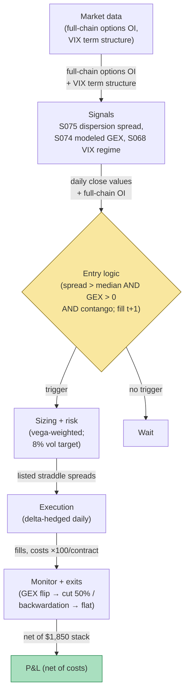

## Stage 195/200 — T095: Dispersion + GEX Regime Switch

*Batch TB10 · Strategy 95/100 · Signals S075, S074, S068 · Provenance [D/SR]*

### T1. One-line verdict

| | |
|---|---|
| **Style** | Volatility-relative-value, market-neutral: long single-name variance, short index variance, with a gamma-exposure regime switch |
| **Edge source** | The correlation risk premium (S075): index implied correlation persistently exceeds realized correlation, so short-index-vol/long-single-vol harvests the spread; modeled gamma exposure (S074) and the VIX term-structure regime (S068) decide *when* the harvest is safe |
| **Typical holding period** | 5–20 sessions (example) per dispersion vintage; the regime switch can halve it mid-trade |
| **Capacity hint** | $10–50M (example) — index options are the deepest vol market on earth; the single-name basket is the constraint |
| **Build-or-buy in one line** | Build the dispersion pricer; buy OPRA + a GEX feed — the modeled exposure is only as good as the full-chain OI underneath it |

### T2. Full mechanics

**The idea, plainly.** **Dispersion** (S075): buy straddles (long call + long put, a bet on movement either way) on a basket of single names, sell straddles on the index. If the stocks move independently (low realized correlation) while the index stays calm, the single-name straddles pay and the index straddles decay — you harvest the correlation risk premium. **Gamma exposure (GEX)** (S074): an estimate of how much dealer hedging will amplify or dampen moves — positive GEX (dealers long gamma) dampens; negative GEX amplifies. It is a *modeled proxy* from listed options open interest under assumed positioning signs — it does not reveal actual dealer positioning. **VIX term structure** (S068): contango (upward-sloping) = calm carry regime; backwardation = stress — the regime gate for the whole trade.

**Regime logic (example).** Trade the dispersion only when: (i) VIX term structure is in contango (front month < 3-month, example); (ii) modeled aggregate GEX is positive (example); (iii) the dispersion spread (index implied correlation − realized correlation) is above its 20-day median (example). If GEX flips negative mid-trade: cut the position 50% (example) — the regime switch that names the chapter. If VIX flips to backwardation: flatten entirely (example).

**Construction (example).** Long: 8 large-cap straddles, 30-day expiry, delta-hedged daily. Short: SPX 30-day straddles in index-beta-weighted notional. Rebalanced weekly; each vintage held 5–20 sessions.

**Entry/exit.** Enter when the three regime conditions align. Exit: the spread converges (realized correlation catches up to implied), or any regime condition breaks, or 20 sessions elapse (example). **Causal timing, stated explicitly: regime conditions are evaluated on the day-t close; the earliest the straddle portfolio trades is the t+1 open.** The GEX flip is evaluated on the modeled close value — no intraday switching on live estimates.

**Position sizing.** Vega-weighted: each single-name straddle sized to equal vega (volatility sensitivity, example), index leg sized to net-zero delta and the target correlation exposure. Portfolio vol target: 8% annualized (example).

**Risk limits.** Max portfolio vega $50k per vol point (example); single-name concentration ≤ 25% of vega (example); the GEX-flip 50% cut is automatic, not discretionary.

**Cost model — the explicit ×100 stack.** Options trade in contracts of 100 shares; every line below multiplies by 100 explicitly.

| Line | Calculation | Cost |
|---|---|---|
| Long single-name straddles | 8 names × 5 contracts × 2 legs = 80 contracts × $0.10 half-spread × 100 | $800 |
| Short SPX straddles | 20 contracts × 2 legs = 40 contracts × $0.10 half-spread × 100 | $400 |
| Commissions | 120 contracts × $0.65 | $78 |
| Delta-hedge slippage (12 sessions) | estimated | $572 |
| **Total** | | **$1,850** |

**Order/execution.** Straddles are entered as listed spreads (single transaction per straddle) to avoid legging risk; delta hedges worked as equity VWAP.

### T3. Signals it consumes

| Signal | Role | Weight / logic |
|---|---|---|
| S075 (dispersion: implied vs realized correlation) | The trade itself | spread above 20-day median (example) = enter; convergence = exit |
| S074 (modeled GEX) | Regime switch | positive = full size; flip negative = cut 50% (example); proxy, not dealer truth |
| S068 (VIX term structure) | Regime gate | contango = trade; backwardation = flat (example) |

Pseudocode (≤25 lines):
```
daily close t:                                              # granularity: daily options chains + VIX curve
    disp[t] = impl_corr[t] - real_corr[t]                    # S075
    gex[t] = model_GEX(full_chain_OI[t])                    # S074, proxy only
    ts[t] = VIX_3m - VIX_front                               # S068
    regime_ok = disp[t] > median(disp,20) and gex[t] > 0 and ts[t] > 0   # example
    if regime_ok and flat: enter dispersion at next open     # fill t+1
    if in_position:
        if gex[t] < 0: cut 50%                              # the regime switch, example
        if ts[t] < 0: flatten                                # backwardation, example
        if disp[t] <= 0 or age >= 20: exit                  # convergence / time, example
```

### T4. Worked example — numbers + P&L (SYNTHETIC)

Synthetic 12-session dispersion vintage, seed 195. Long 8-name straddle basket vs short 20 SPX straddles (40 option contracts; notional matched). Realized single-name vol 24.1% vs implied 27.8% (long leg bleeds); index realized 16.2% vs implied 21.5% (short leg wins).

| Day | Long leg cum ($) | Short leg cum ($) | Net cum ($) | GEX proxy |
|---|---|---|---|---|
| 1–4 | −200 → −1,500 | +500 → +2,100 | +300 → +600 | positive |
| 5–8 | −2,100 → −3,300 | +3,300 → +7,600 | +1,200 → +4,300 | positive |
| 9 | −3,600 | +8,800 | +5,200 | **flips negative → cut 50%** |
| 10–12 | −4,900 | +12,300 | +7,400 | negative |

Ledger (fully costed, from the ×100 stack in T2):
- Gross: **+$7,400**
- Costs: **$1,850** (spread $1,200 + commissions $78 + hedge slippage $572)
- **Net: +$5,550**

**Session net: +$5,550 (synthetic; demonstrates the dispersion/regime-switch arithmetic — the day-9 GEX cut is the chapter's signature move, not forward alpha or after-cost profitability).**

**Where the example is optimistic.** The correlation spread is assumed to persist for 12 sessions without a single-name jump — one earnings surprise in the basket and the long leg's vega becomes a loss, not a bleed. The GEX flip is modeled cleanly on the close; real GEX estimates are noisy, sign-unstable across vendors, and computed under positioning assumptions that fail exactly when positioning matters most (S074's canon warning). The $572 hedge-slippage line is a plug — daily delta-hedging an 8-name basket in a falling market costs whatever the market charges that week. The short-SPX leg assumes borrow/availability and margin that a small account doesn't have. And the worked example never shows the backwardation day — the regime where the whole vintage is flattened at a loss, which is the trade's actual tail risk.


*Chart caption: synthetic data — not market data. Watermark reads "SYNTHETIC EXAMPLE" exactly. Seed 195; the red dashed line marks the modeled-GEX flip (day 9) and the 50% cut; the GEX panel is labeled a proxy.*

### T5. Data & infra — what must run

**Feed.** Full-chain options OI + quotes (OPRA-derived) for the 8 names + SPX; VIX term structure (CBOE feed or vendor). The GEX model needs *full-chain* open interest — sampled strikes give a sampled GEX, which is a different (worse) signal.

**Jobs.** Nightly: fit/refresh vol surfaces, compute implied vs realized correlation, model aggregate GEX, read the VIX curve, evaluate the three regime conditions. Intraday: delta-hedge the basket (the only intraday job).

**Storage.** Full-chain daily OI for ~10 underlyings: GB-scale. Intraday hedge records: small.

**M5 Max feasibility.** The nightly surface + GEX job is minutes. Verdict: **feasible** — compute is trivial; the binding constraints are the full-chain OI license and margin/clearing for the short index leg. Engineering: Tier H for the dispersion pricer + GEX model per cost-model §5 (60–200 h), Tier M for the hedging harness; planning band **100–250 h ≈ $15k–$37k loaded-cost estimate** at $150/hr. What breaks first at scale: SPX margin requirements and the borrow on any hard-to-borrow single name, not the CPU.

**Feed-drop failure plan.** If the OI feed is stale: the GEX value freezes — no new regime switches are evaluated (fail closed on the last *computed* state), and new vintages are blocked until fresh full-chain OI arrives.

### T6. Buy vs build

| Option | What you get | Indicative price | Gains | Loses |
|---|---|---|---|---|
| Tier-1: vendor Greeks + OI snapshots | Daily chains | ~$199–$500/mo, `indicative — verify before budgeting` | Cheapest dispersion input | GEX must be modeled yourself |
| Tier-2: OPRA-derived + GEX vendor feed | Precomputed GEX | ~$500–$2,000/mo, `indicative — verify before budgeting` | Saves the GEX model | Vendor GEX methodologies differ — you can't audit the sign |
| Tier-3: raw OPRA full-chain | Everything | institutional $$, `indicative — verify before budgeting` | Full control of the proxy | The Tier H build |
| Prime/clearing for short SPX | Margin + stock loan | institutional, `indicative — verify before budgeting` | Actually tradeable | The real gate for small accounts |

**Verdict: buy the chains (Tier-1/2), build the pricer and the regime logic.** Nobody sells *your* GEX-flip rule or *your* correlation-spread entry — and given S074's warning that GEX is a proxy under assumed signs, outsourcing the model means outsourcing the risk you understand least.

### T7. Success-ratio evidence

Published, checkable sources only; figures before-cost unless stated.

| Study | Market & period | Finding | Before/after cost | Caveat |
|---|---|---|---|---|
| Driessen, Maenhout & Vilkov (2009), "The Price of Correlation Risk" | S&P 100 options 1996–2003 | Implied correlation exceeds realized; correlation risk is priced — the dispersion premium exists | Before cost | The premium is a *risk premium* (compensation for correlation spikes), not an arbitrage — harvesting it means wearing the crash |
| Buraschi, Kosowski & Trojani (2014) | Index vs single options | Correlation risk premium is time-varying and predicts returns | Before cost | Time-varying = the regime matters, which supports the GEX/term-structure gating — but their regimes aren't this chapter's |
| The GEX literature | Practitioner/vendor | Modeled gamma exposure correlates with realized intraday mean-reversion/amplification regimes | Unverified (vendor) | No peer-reviewed P&L evidence for GEX-flip *trading rules*; the honest use is regime description, which is how this chapter uses it |

**Honest bottom line.** The dispersion premium is the best-documented of the three legs — a genuine, published risk premium. The GEX regime switch is practitioner craft with no peer-reviewed traded evidence. The chapter's honest claim: dispersion is a real harvest with a crash tail; the regime switch is a disciplined way to cut the tail, not a second source of alpha.

### T8. Failure modes

- **Correlation spike.** The event the premium compensates: correlations → 1, the short index leg explodes. Mitigation: the backwardation flatten rule — VIX backwardation *is* the correlation spike's announcement.
- **GEX sign error.** The proxy says positive; dealers are actually short gamma. Mitigation: never size the GEX leg as alpha — it's a 50% cut rule, not a leverage rule; the damage from a wrong cut is halved size, not a blowup.
- **Single-name jump.** One basket name gaps on news; the long straddle should pay but the delta hedge gaps too. Mitigation: 25% vega concentration cap; earnings exclusions on basket names.
- **Short-gamma bleed on the index leg.** If realized index vol exceeds implied, the short straddles lose faster than the model. Mitigation: the 20-session time stop and the vega cap.
- **OI staleness.** Full-chain OI updates once a day; the GEX "flip" can be a day late. Mitigation: evaluated on the close, acted on at t+1 — the lag is in the design, not a surprise.
- **Threshold overfit.** Median spread, 50% cut, contango definition are examples. Mitigation: regime rules must survive sign-flip tests (does the *opposite* rule lose?).

### T9. Visuals


*Chart caption: synthetic data — not market data. Watermark reads "SYNTHETIC EXAMPLE" exactly. Seed 195; net +$5,550 after the $1,850 ×100-multiplied cost stack.*



### T10. Sources

1. Driessen, J., Maenhout, P. & Vilkov, G. (2009). "The Price of Correlation Risk: Evidence from Equity Options." *Journal of Finance* 64(3): 1377–1406. https://doi.org/10.1111/j.1540-6261.2009.01467.x — implied correlation exceeds realized; the correlation risk premium exists. DOI re-checked 2026-09-10 in this batch's rework pass — resolves with matching title.
2. Buraschi, A., Kosowski, R. & Trojani, F. (2014). "When There Is No Place to Hide: Correlation Risk and the Cross-Section of Hedge Fund Returns." *Review of Financial Studies* 27(2): 581–616. https://doi.org/10.1093/rfs/hht070 — correlation risk premium is time-varying. Identifier re-checked 2026-09-10 via Crossref API (title + journal match; Crossref lists publication metadata 2013, print issue 2014).
3. CBOE. "VIX Term Structure methodology / white papers." https://www.cboe.com — the VIX curve construction behind the S068 regime gate. (Vendor methodology page; the regime *trading rule* built on it is this chapter's, unverified.)

**Unverified leads** (not confirmed facts — verify before use):
- All regime thresholds (20-day median spread, GEX > 0, contango definition, 50% cut, 20-session vintage) are the chapter's own `example` design values (2026-09-10), not published recommendations.
- GEX-flip trading rules have no peer-reviewed P&L evidence; vendor GEX methodologies differ and the sign is model-dependent (S074 canon).
- The $572 hedge-slippage line is an estimate, not a measurement.

*Source log (2026-09-10 rework pass): batch research Q-labels removed from this chapter. Re-checked 2026-09-10: Buraschi–Kosowski–Trojani citation corrected to the Crossref-verified DOI 10.1093/rfs/hht070 (*Review of Financial Studies* 27(2): 581–616, 2014); Driessen–Maenhout–Vilkov DOI re-checked in this batch's rework pass (resolves, title matches). T4 wording corrected to "short 20 SPX straddles (40 option contracts)" to match the ledger. Regime thresholds are the chapter's own example design values.*
