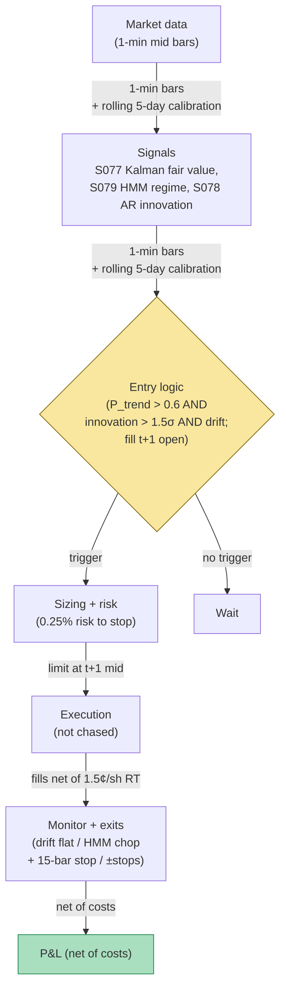

## Stage 196/200 — T096: Kalman + HMM Adaptive Trend

*Batch TB10 · Strategy 96/100 · Signals S077, S079, S078 · Provenance [D/SR]*

### T1. One-line verdict

| | |
|---|---|
| **Style** | Intraday adaptive trend: a state-space fair value with a regime gate that turns the trend-follower off in chop |
| **Edge source** | The Kalman filter (S077) separates the tradable drift from microstructure noise; the hidden Markov model (S079) labels the regime so the strategy only trends when trending pays; the AR/ARMA innovation rule (S078) times entries on fresh information |
| **Typical holding period** | 15–120 minutes (example); the HMM kills entries in chop, the time stop kills stale trends |
| **Capacity hint** | $2–8M per name (example) — 1-minute bars on liquid names; the filter is the edge, not the size |
| **Build-or-buy in one line** | Build it in an afternoon — two textbook estimators, zero proprietary data |

### T2. Full mechanics

**The idea, plainly.** Prices are noisy observations of a hidden "fair value" that drifts. The **Kalman filter** (S077) is the optimal recursive estimator of that hidden state: each new price updates the fair-value estimate, weighted by how trustworthy the observation is (the Kalman gain — high when measurement noise is low). The **hidden Markov model** (S079) assumes the market switches between unobserved regimes (trend / chop / volatile) with learned transition probabilities, and infers the current regime from recent returns. The **AR/ARMA forecast** (S078): an autoregressive model predicts the next bar from recent bars; the *innovation* (actual − predicted) is the fresh information — entries trigger on innovations, not on raw moves.

**State-space model (example).** Fair value x_t follows a random walk with drift; observed mid y_t = x_t + noise. Process noise Q and measurement noise R are calibrated per name on a rolling 5-day window (example); the signal-to-noise ratio Q/R is the only tuning that matters.

**HMM (example).** 3 states (trend-up, trend-down, chop), Gaussian emissions on 1-minute returns, Baum–Welch fit on 5 days (example), Viterbi path for the live state. Trade only when P(trend state) > 0.6 (example).

**Innovation entry (example).** AR(3) on 1-minute mid returns, refit daily. Enter long when: innovation > +1.5 × its rolling std (example) AND Kalman drift (x_t − x_{t−20}) > 0 (example) AND HMM says trend. **Causal timing, stated explicitly: all three quantities are computed from bars ≤ t; the earliest legal fill is the t+1 bar's open.** The filter never sees the future — the classic Kalman lookahead bug is initializing or smoothing with full-sample parameters, which this design avoids by rolling calibration.

**Exit rule.** Kalman fair value flattens (|x_t − x_{t−20}| < 0.25 × its entry value, example) → exit; HMM flips to chop → no new entries, existing positions get a 15-bar time stop (example); hard stop −1.0 × σ_20bar (example); target +1.8 × σ_20bar (example).

**Position sizing.** q = (0.25% × equity) / stop_distance (example) — trend systems lose often; size for the loss rate.

**Risk limits.** Max 2 concurrent trends (example); if the HMM labels >70% of the session as chop (example), the strategy stands down the next session; daily sleeve stop −1.5% (example).

**Cost model.** 1.5¢/share round-trip (example) — liquid names, 1-minute bars, passive entries at the touch.

**Order/execution.** Limit at the t+1 open mid ±0.2σ (example); trend entries are not chased — a missed entry is a vetoed entry.

### T3. Signals it consumes

| Signal | Role | Weight / logic |
|---|---|---|
| S077 (Kalman fair value + drift) | Primary: the tradable state | drift direction = trade direction; flat drift = exit |
| S079 (HMM regime) | Gate | P(trend) > 0.6 (example) to enter; chop = stand down |
| S078 (AR innovation) | Entry timer | \|innovation\| > 1.5σ (example) in the drift direction |

Pseudocode (≤25 lines):
```
every 1-min bar t:                                        # granularity: 1-min mid bars
    x[t], P[t] = kalman_update(y[t], Q, R)                # S077, Q/R rolling 5d
    drift = x[t] - x[t-20]
    regime = hmm_viterbi(returns[t-300:t])                # S079, 3-state
    innov = y[t] - AR3_predict(y[t-3:t])                  # S078, refit daily
    if P_trend(regime) > 0.6 and innov > 1.5*std(innov):  # example gates
        if drift > 0: enter LONG at next bar open         # fill t+1, never t
        elif drift < 0: enter SHORT at next bar open
# exits: drift flat / HMM->chop + 15-bar stop / -1.0σ stop / +1.8σ target
```

### T4. Worked example — numbers + P&L (SYNTHETIC)

Synthetic 120 1-minute bars, seed 196. HMM labels bars 0–79 as trend, 80–119 as chop. Two trades of 3,000 shares, fills at t+1. (A third candidate at bar 95 was vetoed: bar 95 sits inside the stated chop window, so the P(trend) > 0.6 gate blocks it — no fill, no ledger line.)

| # | Entry (bar) | Side | Entry $ | Exit (bar) | Exit $ | Gross |
|---|---|---|---|---|---|---|
| 1 | 20 | long | 61.20 | 44 | 61.95 | +$2,250 |
| 2 | 55 | short | 62.40 | 74 | 61.85 | +$1,650 |

Ledger (fully costed):
- Gross: +$2,250 + $1,650 = **+$3,900**
- Costs: 2 trades × 3,000 × $0.015 = **$90**
- **Net: +$3,810**

**Session net: +$3,810 (synthetic; demonstrates the filter/regime/entry arithmetic — the chop-window veto at bar 95 is the HMM doing its job, not forward alpha or after-cost profitability).**

**Where the example is optimistic.** The HMM's trend/chop labels are suspiciously clean — real Viterbi paths flicker between states, and the P(trend) > 0.6 gate whipsaws. The Kalman drift is computed with Q/R "calibrated" — on synthetic data the calibration is perfect; on real data Q/R estimation is the whole game and it's unstable. The chop window (bars 80–119) correctly blocks the bar-95 candidate in this example, but in production the chop regime is where most of a session's *would-be* trades live, because the HMM is slowest to label exactly the regime where you'd already be bleeding. The AR(3) innovation assumes the microstructure noise is stationary within the day — it isn't (open/close effects).


*Chart caption: synthetic data — not market data. Watermark reads "SYNTHETIC EXAMPLE" exactly. Seed 196; shaded regions are the HMM states; triangles are entries (t+1 fills), squares are exits.*

### T5. Data & infra — what must run

**Feed.** 1-minute (or finer) mid bars — SIP-class L1 is sufficient. No depth, no options.

**Jobs.** Per bar: Kalman update (microseconds), HMM Viterbi on a rolling window (milliseconds), AR innovation (microseconds). Daily: refit AR(3), recalibrate Q/R, refit HMM on 5 days.

**Storage.** 1-minute bars: per cost-model §4, ~2–8 GB/symbol-day is for full L1 quotes+trades; 1-minute mids are MB/day. Trivial.

**M5 Max feasibility.** The per-bar compute is sub-millisecond per name; 150 names is still sub-second. The daily HMM fit (Baum–Welch on ~2,000 bars × 150 names) is minutes. Verdict: **feasible** — this chapter is a rounding error on the M5 Max. Engineering: Tier M (20–60 h) for the filter/regime service; planning band **20–60 h ≈ $3k–$9k loaded-cost estimate** at $150/hr — the cheapest build in the batch. What breaks first at 500 symbols: the daily HMM refit wall-clock, parallelizable trivially.

**Feed-drop failure plan.** If bars stop: the filter freezes — no new entries (the drift is stale), existing positions keep their stops. On resume, re-initialize the filter covariance wide (P = large) rather than trusting the gap.

### T6. Buy vs build

| Option | What you get | Indicative price | Gains | Loses |
|---|---|---|---|---|
| Tier-0: free 1-min bars (Stooq/Alpaca) | Mids | ~$0, `indicative — verify before budgeting` | $0; sufficient for research | Corporate-action adjustment is yours |
| Tier-1: Polygon Stocks Advanced | Clean bars + WS | ~$199/mo, `indicative — verify before budgeting` | Cleaner adjustments | Nothing the filter needs beyond bars |
| Textbook code (pykalman, hmmlearn) | The estimators | ~$0 (open source), `indicative — verify before budgeting` | Proven implementations | You wire the rolling calibration and the causality discipline |

**Verdict: build on Tier-0/1.** There is nothing to buy — the Kalman filter and the HMM are 1960s/1970s mathematics in every open-source library. The proprietary layer is the rolling Q/R calibration, the regime-gating discipline, and the refusal to smooth with future data.

### T7. Success-ratio evidence

Published, checkable sources only; figures before-cost unless stated.

| Study | Market & period | Finding | Before/after cost | Caveat |
|---|---|---|---|---|
| Kalman (1960); Harvey (1989) *Forecasting, Structural Time Series Models and the Kalman Filter* | — | The filter is the optimal linear recursive state estimator | Method, not P&L | Optimality is about *estimation error*, not trading profit — a better fair value doesn't imply a profitable trade |
| The trend-following literature (e.g., Hurst, Ooi & Pedersen 2017, "A Century of Evidence on Trend-Following Investing") | Multi-asset, century | Time-series momentum earns a premium across assets and eras | Before cost (futures, monthly) | The evidence is for *slow* (monthly) trend across futures; this chapter's 1-minute-bar equity trend is a different animal with vastly higher costs |
| Hamilton (1989) regime-switching | Macro/econometric | HMM/Markov-switching models describe regime-dependent dynamics | Method | Descriptive fit, not a trading rule |

**Honest bottom line.** The components are the most academically respectable in the batch — optimal filtering, regime modeling, autoregression — and the least *directly* evidenced as a traded intraday strategy. The century-of-trend evidence is real but lives at monthly horizons in futures; porting it to 1-minute equity bars is an extrapolation, and the costs scale with the extrapolation. The honest claim: a disciplined adaptive-trend harness whose value is mostly the HMM's *off switch* in chop.

### T8. Failure modes

- **Q/R miscalibration.** Wrong signal-to-noise ratio = the filter chases noise or sleeps through drift. Mitigation: rolling 5-day calibration, reported daily; freeze trading if Q/R jumps 3× day-over-day (example).
- **HMM state flicker.** Viterbi flips trend/chop/trend; the gate whipsaws. Mitigation: require P(trend) > 0.6 for 3 consecutive bars (example) before arming entries.
- **Smoothing lookahead.** Calibrating Q/R or fitting the HMM on data that includes the traded bars. Mitigation: strict rolling windows; the research harness asserts max(train_end) < trade_bar.
- **AR nonstationarity.** Open/close effects break the AR(3). Mitigation: exclude first/last 15 minutes (example) or fit separate models per intraday bucket.
- **Chop-tax.** Most losses come from trades 3-style — entered as the regime decays. Mitigation: the 15-bar time stop in chop; the daily stand-down rule.
- **Threshold overfit.** 0.6, 1.5σ, 20-bar drift are examples. Mitigation: the strategy must survive halving/doubling each.

### T9. Visuals


*Chart caption: synthetic data — not market data. Watermark reads "SYNTHETIC EXAMPLE" exactly. Seed 196; net +$3,810 after $90 costs.*



### T10. Sources

1. Kalman, R. E. (1960). "A New Approach to Linear Filtering and Prediction Problems." *Journal of Basic Engineering* 82(1): 35–45. https://doi.org/10.1115/1.3662552 — the filter. DOI re-checked 2026-09-10 in this batch's rework pass — resolves with matching title.
2. Hamilton, J. D. (1989). "A New Approach to the Economic Analysis of Nonstationary Time Series and the Business Cycle." *Econometrica* 57(2): 357–384. https://doi.org/10.2307/1912559 — Markov regime-switching. DOI re-checked 2026-09-10 in this batch's rework pass — resolves with matching title.
3. Hurst, B., Ooi, Y. H. & Pedersen, L. H. (2017). "A Century of Evidence on Trend-Following Investing." *Journal of Portfolio Management* 44(1): 15–29. https://doi.org/10.3905/jpm.2017.44.1.015 — long-horizon trend premium across assets. DOI re-checked 2026-09-10 in this batch's rework pass — resolves with matching title (the slow-trend evidence this chapter extrapolates from; horizon mismatch noted honestly).

**Unverified leads** (not confirmed facts — verify before use):
- All filter/gate thresholds (Q/R 5-day window, P(trend) > 0.6, 1.5σ innovation, 20-bar drift, 15-bar chop stop) are the chapter's own `example` design values (2026-09-10), not published recommendations.
- No published study validates this exact Kalman+HMM+AR intraday rule as a traded strategy; the trend evidence cited is monthly-horizon futures.

*Source log (2026-09-10 rework pass): batch research Q-labels removed from this chapter. Re-checked 2026-09-10: the three cited DOIs resolve with matching titles (rework-pass spot-check). Trade 3 (bar 95, inside the stated chop window) was removed — strategy net recomputed as $3,900 − $90 = $3,810. Filter/gate thresholds are the chapter's own example design values.*
