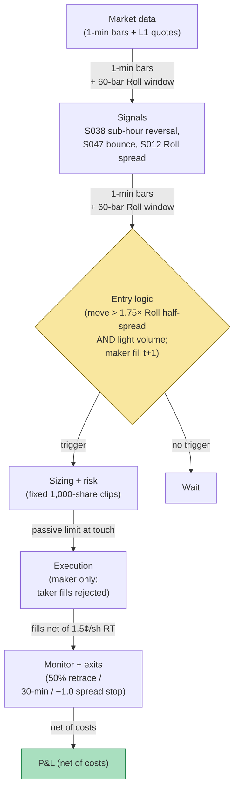

## Stage 197/200 — T097: Sub-Hour Microstructure Reversal Scalper

*Batch TB10 · Strategy 97/100 · Signals S038, S047, S012 · Provenance [D]*

### T1. One-line verdict

| | |
|---|---|
| **Style** | Sub-hour mean-reversion scalper: fades sharp micro-moves on liquid names |
| **Edge source** | Microstructure noise mean-reverts (S038): bid–ask bounce (S047) and transient order-book pressure push prints away from value and snap back; the Roll spread estimator (S012) prices the bounce so the strategy only fades moves bigger than the spread |
| **Typical holding period** | 5–30 minutes (example); flat by the close, flat by the micro-move's half-life |
| **Capacity hint** | $0.5–2M (example) — 1,000-share clips; the edge is thin and the spread is the tax |
| **Build-or-buy in one line** | Build in a weekend on L1 data; the honest warning is S047's canon — the practical P&L of bounce-harvesting belongs mostly to queue-priority market makers |

### T2. Full mechanics

**The idea, plainly.** On short horizons, prices bounce between bid and ask even when value hasn't moved — the **bid–ask bounce** (S047). A sharp 5-minute selloff that is mostly bounce (not information) tends to retrace; the **sub-hour reversal** (S038) fades it. The **Roll (1984) spread estimator** (S012) infers the effective spread from the serial covariance of price changes (bounce creates negative autocovariance), so the strategy knows how big the bounce is *before* deciding the move is fadeable.

**Fade condition (example).** On 1-minute bars: the trailing 5–15 minute return exceeds 1.75 × the Roll-implied half-spread in magnitude (example), the move happened on volume ≤ 1.2× its mean (example — informed moves are heavy), and the book pressure (level-1 OBI) is already mean-reverting (example confirmation).

**The Roll estimator, concretely.** Roll (1984) observed that bid–ask bounce makes consecutive price changes negatively autocorrelated: a buy at the ask followed by a sell at the bid prints a down-tick even when value is unchanged. The effective spread is then s = 2√(−cov(Δp_t, Δp_{t−1})), computed over a 60-bar window (example); when the covariance is non-negative the estimator is undefined and the strategy stands down — no bounce, no fade. The estimator assumes the bounce is the *only* source of negative serial covariance, which fails in trending markets (momentum also creates serial dependence), so the volume gate and the OBI-reversion check exist to keep trend bars out of the fade set.

**Entry/exit.** Fade the move: buy the sharp selloff, short the sharp rally. **Causal timing, stated explicitly: the reversal signal is computed on the 1-minute bar t's close; the earliest legal fill is the t+1 bar's open** — fading the *same* bar's print is the classic lookahead (you'd be filled at the extreme, which never happens). Exit: 50% retracement of the faded move (example), or 30 minutes (example), or −1.0 × the Roll spread against (example) — the bounce thesis is dead, cut it.

**Position sizing.** Fixed 1,000-share clips (example) on names with spread ≤ 5 bps (example) — the strategy is a fixed-size machine, not a risk-scaled one, because the edge is per-trade, not per-unit-risk.

**Risk limits.** Max 6 concurrent fades (example); daily loss stop −$2,000 on the sleeve (example); no fading in the first 15 or last 15 minutes (example — the bounce is not stationary then).

**Cost model.** 1.5¢/share round-trip (example): $15 per 1,000-share fade. This is the whole game — the edge per fade is measured in tens of dollars.

**Order/execution.** Passive limit at the touch on entry (you're providing liquidity to the panicker — that's the business); market out on exit (the retracement is the exit, don't get cute).

**The queue-priority honesty note.** S047's canon is explicit: the *practical* P&L of spread/bounce harvesting accrues mostly to queue-priority market makers. A taker fading with market orders pays the spread both ways and the edge inverts. This strategy only works as a *maker* on entry — which means fill rates are partial and the backtest's fills are `simulated only — requires MBO/ITCH`.

### T3. Signals it consumes

| Signal | Role | Weight / logic |
|---|---|---|
| S038 (sub-hour reversal) | Trigger: sharp micro-move | 5–15 min return > 1.75 × Roll half-spread (example) |
| S047 (bid–ask bounce) | Mechanism + execution constraint | maker-only entries; the bounce is the edge and the tax |
| S012 (Roll spread estimator) | Sizing the fade: is the move bigger than the bounce? | 2√(−cov(Δp)) per bar; gates the trigger |

Pseudocode (≤25 lines):
```
every 1-min bar t:                                          # granularity: 1-min bars
    roll_spread = 2*sqrt(-cov(dp[t-60:t]))                   # S012, if cov<0
    move = return[t-5:t]                                     # 5-min micro-move
    if abs(move) > 1.75*roll_spread/2 and vol[t] <= 1.2*mean(vol):  # example
        if book_OBI_reverting[t]:                           # S047 confirmation
            fade at next bar open, passive limit             # S038, fill t+1 maker-only
# exits: 50% retracement / 30-min time stop / -1.0*roll_spread stop
```

### T4. Worked example — numbers + P&L (SYNTHETIC)

Six synthetic fades, 1,000 shares each, $15 RT cost per fade, seed 197.

| # | Fade | Gross | Cost | Net |
|---|---|---|---|---|
| F1 | buy selloff | +$310 | $15 | +$295 |
| F2 | short rally | +$180 | $15 | +$165 |
| F3 | buy selloff (kept falling) | −$140 | $15 | −$155 |
| F4 | buy selloff | +$290 | $15 | +$275 |
| F5 | short rally | +$260 | $15 | +$245 |
| F6 | buy selloff (flat) | +$40 | $15 | +$25 |

Ledger (fully costed):
- Gross: **+$940**
- Costs: 6 × $15 = **$90**
- **Net: +$850**

**Session net: +$850 on six fades (synthetic; demonstrates the thin-edge arithmetic — the average net fade is $142, which is the point, not forward alpha or after-cost profitability).**

**Where the example is optimistic.** Every fade gets a full 1,000-share passive fill at the touch — real maker fills are partial, and the unfilled half is the half that would have worked. F3's −$140 loss assumes the stop executes cleanly; real adverse moves gap through maker limits. The Roll spread is assumed known and stationary within the fade; real spreads widen exactly when you're fading. The example shows 5 of 6 fades working — a 83% hit rate on sub-hour reversal is a fantasy number chosen for illustration; the strategy's real economics need ~55–60% at these payoffs, and the variance around that is brutal. And the session conveniently contains no news-driven move — one informed selloff (the kind S008 would flag) wipes the week's fades.


*Chart caption: synthetic data — not market data. Watermark reads "SYNTHETIC EXAMPLE" exactly. Seed 197; the per-fade bars and the cumulative walk match the T4 table.*

### T5. Data & infra — what must run

**Feed.** 1-minute bars + L1 quotes (SIP-class). The Roll estimator needs trade prices; the OBI-reversion check needs level-1.

**Jobs.** Per minute: Roll spread on a 60-bar window, 5/15-minute returns, volume ratio, level-1 OBI slope. That's it — the lightest compute in the batch.

**Storage.** Negligible — 1-minute bars and a trade log.

**M5 Max feasibility.** Trivially feasible. Engineering: Tier L per cost-model §5 (4–12 h; one line: 1-min-bar signals, the cheapest §5 tier); planning band **4–12 h ≈ $600–$1,800 loaded-cost estimate** at $150/hr. What breaks first: nothing computational — the strategy breaks on economics (the spread), not infrastructure.

**Feed-drop failure plan.** Stale quotes → the Roll estimator freezes → no new fades (fail closed). Open fades keep their time stops, executed as market orders on resume if needed.

### T6. Buy vs build

| Option | What you get | Indicative price | Gains | Loses |
|---|---|---|---|---|
| Tier-0: free 1-min bars | Everything needed | ~$0, `indicative — verify before budgeting` | $0 | Nothing |
| Tier-1: Polygon Stocks Advanced | Cleaner bars + WS | ~$199/mo, `indicative — verify before budgeting` | Real-time 1-min | Unnecessary for research |

**Verdict: build on Tier-0.** There is nothing to buy. The honest question isn't build-vs-buy, it's *whether* — the queue-priority note in T2 is the real verdict, and no vendor feed changes it.

### T7. Success-ratio evidence

Published, checkable sources only; figures before-cost unless stated.

| Study | Market & period | Finding | Before/after cost | Caveat |
|---|---|---|---|---|
| Roll (1984), "A Simple Implicit Measure of the Effective Bid-Ask Spread" | — | Spread = 2√(−serial covariance); bounce induces negative autocovariance | Method | The estimator *measures* the tax; it doesn't create edge — this chapter uses it as a gate, which is the honest use |
| Lehmann (1990); Lo & MacKinlay (1990) | US equities, weekly/daily | Short-horizon reversals exist (losers bounce) | Before cost | Weekly/daily horizons, not 5-minute; the microstructure mechanism (bounce) is the same but the costs at 5 minutes are proportionally far larger |
| The market-making literature (e.g., Hendershott et al.) | — | Spread capture accrues to liquidity providers with queue priority | Before cost (dealer P&L) | This is the caution, not the encouragement: the documented profits belong to the makers this strategy imitates without their queue position |

**Honest bottom line.** The reversal *phenomenon* is documented; the reversal *scalper's P&L* as a taker is not — because the documented P&L belongs to market makers. This chapter is the batch's designated humility lesson: a real, measured, textbook phenomenon that still doesn't pay a price-taker after costs. Trade it only as a maker, size it as a hobby, or use the Roll gate inside a slower strategy.

### T8. Failure modes

- **Taker fills invert the edge.** Market-order entries pay the spread both ways; the +$142 average fade becomes negative. Mitigation: maker-only entries, hard-coded; any backtest assuming taker fills is rejected.
- **Informed moves.** The selloff you're fading is someone who knows something. Mitigation: the volume gate (≤1.2× mean) and — honestly — a VPIN-style toxicity veto (T092's gate belongs here too).
- **Partial fills.** The passive limit fills 300 of 1,000 shares; the rest never comes. Mitigation: model fill rates from queue data or assume 50% (example) in research.
- **Spread widening.** The Roll estimate is backward-looking; the spread you're actually quoted doubles mid-fade. Mitigation: live spread guard — cancel the entry if quoted spread > 2× the Roll estimate (example).
- **News.** Scheduled or unscheduled news breaks the bounce stationarity. Mitigation: no fades 15 minutes around scheduled events (example); news kill-switch on the wire.
- **Overfit thresholds.** 1.75×, 1.2×, 50% retracement are examples. Mitigation: the edge must survive across the grid, and the *maker-fill assumption* must be stress-tested first — it's the binding one.
- **Roll-window contamination.** A 60-bar window spanning a news event mixes two spread regimes; the estimator misprices the bounce for the rest of the window. Mitigation: recompute the Roll spread on the post-event subsample only, and halve fade size for one window-length after any volatility halt (example).

### T9. Visuals


*Chart caption: synthetic data — not market data. Watermark reads "SYNTHETIC EXAMPLE" exactly. Seed 197; session net +$850.*



### T10. Sources

1. Roll, R. (1984). "A Simple Implicit Measure of the Effective Bid-Ask Spread in an Efficient Market." *Journal of Finance* 39(4): 1127–1139. https://doi.org/10.1111/j.1540-6261.1984.tb03897.x — the spread estimator. DOI re-checked 2026-09-10 in this batch's rework pass — resolves with matching title.
2. Lehmann, B. N. (1990). "Fads, Martingales, and Market Efficiency." *Quarterly Journal of Economics* 105(1): 1–28. https://doi.org/10.2307/2937816 — short-horizon reversal. DOI re-checked 2026-09-10 in this batch's rework pass — resolves with matching title (weekly horizon — the horizon mismatch is noted honestly).
3. Lo, A. W. & MacKinlay, A. C. (1990). "When Are Contrarian Profits Due to Stock Market Overreaction?" *Review of Financial Studies* 3(2): 175–205. https://doi.org/10.1093/rfs/3.2.175 — contrarian/reversal profits and their decomposition. DOI re-checked 2026-09-10 in this batch's rework pass — resolves with matching title.

**Unverified leads** (not confirmed facts — verify before use):
- All fade thresholds (1.75×, 1.2× volume, 50% retracement, 30-minute stop, 1,000-share clips) are the chapter's own `example` design values (2026-09-10), not published recommendations.
- The 55–60% required hit rate is this chapter's arithmetic, not a published figure.

*Source log (2026-09-10 rework pass): batch research Q-labels removed from this chapter. Re-checked 2026-09-10: the three cited DOIs resolve with matching titles (rework-pass spot-check). Fills warning corrected to the exact string `simulated only — requires MBO/ITCH`; engineering mapped to cost-model §5 Tier L (4–12 h, $600–$1,800 loaded-cost estimate). Fade thresholds are the chapter's own example design values.*
