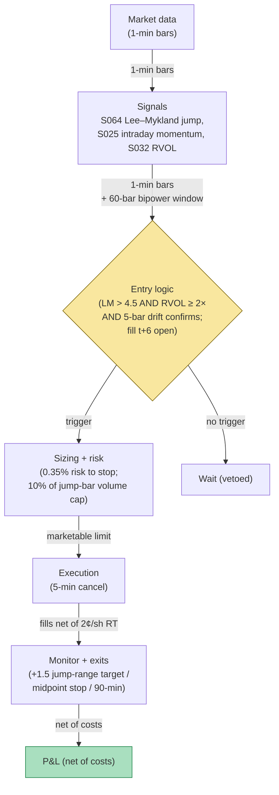

## Stage 198/200 — T098: Jump-Validated Momentum Ignition

*Batch TB10 · Strategy 98/100 · Signals S064, S025, S032 · Provenance [D/SR]*

### T1. One-line verdict

| | |
|---|---|
| **Style** | Intraday momentum ignition, minutes-to-hours: trade only the momentum that starts with a verified jump |
| **Edge source** | Most intraday "momentum" is drift that mean-reverts; jumps (S064) mark the subset where price discovery actually happened — the Lee–Mykland test separates the two, RVOL (S032) confirms participation, and intraday momentum (S025) rides only the validated leg |
| **Typical holding period** | 20–90 minutes (example); the ignition is fast, the ride is the easy part |
| **Capacity hint** | $1–5M per name (example) — jump bars are liquid by definition (someone traded the move) |
| **Build-or-buy in one line** | Build the jump detector in a day; buy nothing — 1-minute bars are enough |

### T2. Full mechanics

**The idea, plainly.** Prices move in two ways: small continuous wiggling and **jumps** — sudden discontinuous repricings when news or big flow arrives. The **Lee–Mykland (2008) jump test** (S064) detects jumps statistically: it scales each return by local volatility (bipower variation, robust to jumps themselves) and flags returns too large to be wiggling. **Intraday momentum** (S025) is the tendency of strong moves to continue over minutes-to-hours. **RVOL** (relative volume, S032) — current volume vs its trailing mean — confirms the move has participation rather than being a thin-print artifact. The strategy: momentum *only* after a validated jump; everything else is vetoed.

**The gate, honestly.** S064's canon is explicit: the jump test is a *measurement/gate*, not directional alpha. It tells you *that* price discovery happened, not *where* price goes next. The direction comes from the post-jump drift (S025): enter in the jump's direction only if the 5 bars after the jump continue the move (example confirmation).

**Jump test (example).** On 1-minute bars: Lee–Mykland statistic with a 60-bar bipower-variation window (example); flag when the statistic exceeds 4.5 (example threshold — the asymptotic theory suggests √ thresholds, but finite-sample practice uses fixed cutoffs, hence `example`).

**Bipower variation, concretely.** Realized volatility (sum of squared returns) is contaminated by jumps — the very thing being tested. Bipower variation instead sums *products of adjacent absolute returns*, Σ|r_t|·|r_{t−1}| (scaled by a constant), which stays consistent for the continuous volatility component even when jumps are present. The Lee–Mykland statistic is then L_t = r_t / √(BV_t): the bar's return divided by jump-robust local volatility. A value of 5.8 means the bar moved 5.8 local-volatility units — implausible as wiggling, plausible as repricing. The 60-bar window (example) trades off adaptivity (shorter follows intraday vol patterns) against estimation noise (longer is stabler); the window must exclude the tested bar itself or the jump inflates its own denominator.

**Entry rule.** Enter in the jump direction when: (i) jump flagged at bar t (statistic 5.8 in the worked example); (ii) RVOL ≥ 2.0× (example) over the jump bar and next 3 bars; (iii) the 5-bar post-jump drift continues the jump direction. **Causal timing, stated explicitly: the jump is flagged using bars ≤ t (the test needs the bar's close and the trailing window); the entry fills at the t+6 bar's open — the first lawful bar, because the 5-bar drift window (t+1…t+5) must close before the rule is complete.** Entering *on* the jump bar is the lookahead — you'd be filled at the pre-jump price, which is fiction.

**Exit rule.** Target +1.5 × the jump bar's range (example); stop at the jump bar's midpoint (example) — if price retraces past half the jump, the discovery thesis is dead; time stop 90 minutes (example).

**Position sizing.** q = (0.35% × equity) / stop_distance (example), capped at 10% of the jump bar's volume (example) — the jump printed liquidity; don't demand more than it showed.

**Risk limits.** Max 3 concurrent ignitions (example); two consecutive jump-failures (stopped at the midpoint) = stand down for the session (example) — failed jumps cluster; daily sleeve stop −1.5% (example).

**Cost model.** 2.0¢/share round-trip (example): $100 per 5,000-share ignition. Jump bars are liquid, but the t+6 fill still pays the post-jump spread.

**Order/execution.** Marketable limit at the t+6 open ±0.5% (example) — ignition entries are momentum entries; passivity misses the move. If unfilled in 5 minutes, cancel.

### T3. Signals it consumes

| Signal | Role | Weight / logic |
|---|---|---|
| S064 (Lee–Mykland jump test) | Gate: was this a real repricing? | statistic > 4.5 (example); gate, not a weight |
| S025 (intraday momentum) | Direction + ride | 5-bar post-jump drift must continue the jump direction (example) |
| S032 (RVOL) | Participation confirmation | RVOL ≥ 2.0× (example) over jump + 3 bars; gate, not standalone direction |

Pseudocode (≤25 lines):
```
every 1-min bar t:                                          # granularity: 1-min bars
    LM[t] = lee_mykland_stat(ret[t], bipower_var[t-60:t])    # S064
    if LM[t] > 4.5:                                         # example threshold
        rvol = vol[t-3:t+1] / mean(vol, 20d)                 # S032, example window
        drift5 = sum(ret[t+1:t+6])                           # S025 confirmation
        if rvol >= 2.0 and sign(drift5) == sign(ret[t]):    # example
            enter at bar t+6 open in jump direction          # fill t+6, never earlier
# exits: target +1.5*jump_range / stop at jump midpoint / 90-min time stop
```

### T4. Worked example — numbers + P&L (SYNTHETIC)

Synthetic 78-bar session on fictional **INNO**, seed 198. Jump flagged at bar 30 (LM statistic 5.8, example); RVOL 3.2×; 5-bar drift continues up; entry at the t+6 open (bar 36).

| Setup | Jump? | RVOL | Decision | Illustrative outcome |
|---|---|---|---|---|
| A (bar 30) | LM 5.8 ✓ | 3.2× ✓ | **TAKE long** | — |
| B (bar 50) | LM 2.1 ✗ | 2.4× | VETO (no jump) | −$1,300 (drift faded) |
| C (bar 66) | LM 5.1 ✓ | 0.8× ✗ | VETO (thin) | avoided |

**Setup A ledger (fully costed):**
- BUY 5,000 @ $75.16 (t+6 fill, bar 36 open) = $375,800
- SELL 5,000 @ $76.05 (target) = $380,250
- Gross: **+$4,450**
- Costs: 5,000 × $0.02 RT = **$100**
- **Net: +$4,350**

**Session net: +$4,350 on the one validated ignition (synthetic; setup B's −$1,300 fade is the veto's tuition receipt — demonstrates the gate arithmetic, not forward alpha or after-cost profitability).**

**Where the example is optimistic.** The jump is a clean +1.4% with RVOL 3.2× and a textbook post-jump drift — real jumps are often ±0.5% with ambiguous drift, and the 5-bar confirmation rule eats half the move waiting for proof. Setup B's "would have lost $1,300" is illustrative counterfactual, not measured. The t+6 fill at 75.16 assumes the post-jump open is orderly; real ignitions gap and the fill slips. The 4.5 LM threshold is an example — the test's size/power tradeoff at 1-minute bars with real microstructure noise is the actual research question, and the answer varies by name. Most importantly: the example shows one jump per session; real sessions have clusters, and clustered jumps are where the two-consecutive-failure stand-down earns its keep.


*Chart caption: synthetic data — not market data. Watermark reads "SYNTHETIC EXAMPLE" exactly. Seed 198; the shaded band is the RVOL-funded window; setup B's veto mark sits where the unvalidated momentum faded.*

### T5. Data & infra — what must run

**Feed.** 1-minute bars (SIP-class). The bipower variation needs intraday returns; daily bars don't resolve jumps.

**Jobs.** Per bar: Lee–Mykland statistic on a 60-bar window, RVOL, 5-bar drift check. Trivial compute.

**Storage.** Negligible.

**M5 Max feasibility.** Trivially feasible. Engineering: Tier L per cost-model §5 (4–12 h; one line: 1-min-bar signals, the cheapest §5 tier); planning band **4–12 h ≈ $600–$1,800 loaded-cost estimate** at $150/hr. What breaks first: nothing — the research question (threshold calibration per name) is statistical, not computational.

**Feed-drop failure plan.** Stale bars → the jump test freezes → no new ignitions (fail closed). Open positions keep the midpoint stop as a market-on-resume order.

### T6. Buy vs build

| Option | What you get | Indicative price | Gains | Loses |
|---|---|---|---|---|
| Tier-0: free 1-min bars | Everything needed | ~$0, `indicative — verify before budgeting` | $0 | Nothing |

**Verdict: build on Tier-0.** The Lee–Mykland test is 30 lines. There is nothing to buy and no vendor sells "validated jump signals" worth trusting — the threshold calibration is name-specific and therefore inherently yours.

### T7. Success-ratio evidence

Published, checkable sources only; figures before-cost unless stated.

| Study | Market & period | Finding | Before/after cost | Caveat |
|---|---|---|---|---|
| Lee & Mykland (2008), "Jumps in Financial Markets: A New Nonparametric Test and Jump Dynamics" | US equities, intraday | Nonparametric jump test via bipower variation; jumps are frequent and often news-related | Method (detection) | The paper detects jumps; it does not show that post-jump drift is tradable — the momentum leg is this chapter's, not theirs |
| The intraday momentum literature (e.g., Gao, Han, Li & Zhou) | US equities | First-half-hour returns predict last-half-hour returns (intraday momentum) | Before cost | The documented effect is a specific intraday pattern (open→close), not post-jump continuation generally |
| Barndorff-Nielsen & Shephard (2004), bipower variation | — | Jump-robust volatility measurement | Method | The volatility input the test needs; not a trading result |

**Honest bottom line.** The jump *detection* is rigorous and published; the jump *continuation trade* is this chapter's construction with thin direct evidence. The credible claim is narrower than the chapter title: validated jumps are a better *universe* for momentum than raw momentum screens — fewer, cleaner setups — not a standalone alpha.

### T8. Failure modes

- **Jump misclassification.** A data error or a single bad print flags a "jump." Mitigation: require the jump bar's volume ≥ 2× mean (example) in addition to RVOL — bad prints are thin.
- **Threshold sensitivity.** 4.5 is an example; the strategy's trade count swings wildly with it. Mitigation: calibrate per name on the false-discovery rate, not the P&L.
- **Post-jump reversal.** News jumps often over-shoot and revert — the drift confirmation helps, but the first 5 bars can lie. Mitigation: the midpoint stop is the thesis stop; honor it mechanically.
- **Clustered jumps.** News days print jump after jump; each new signal re-enters into the same discovery. Mitigation: one ignition per name per session (example); the two-failure stand-down.
- **Lookahead.** Filling on the jump bar at the pre-jump price. Mitigation: t+6 fills only — stated in T2, unit-tested.
- **RVOL gaming.** A single block print inflates RVOL without real participation. Mitigation: median-based RVOL (example) instead of mean.
- **Window contamination.** The 60-bar bipower window spanning an earlier jump overstates local vol and blinds the test to the next jump. Mitigation: jump-robust windowing — exclude previously flagged jump bars from the BV computation (the standard Lee–Mykland implementation detail).

### T9. Visuals


*Chart caption: synthetic data — not market data. Watermark reads "SYNTHETIC EXAMPLE" exactly. Seed 198; net +$4,350 after $100 costs; entry at the t+6 open (bar 36).*



### T10. Sources

1. Lee, S. S. & Mykland, P. A. (2008). "Jumps in Financial Markets: A New Nonparametric Test and Jump Dynamics." *Review of Financial Studies* 21(6): 2535–2563. https://doi.org/10.1093/rfs/hhm056 — the jump test. DOI re-checked 2026-09-10 in this batch's rework pass — resolves with matching title.
2. Barndorff-Nielsen, O. E. & Shephard, N. (2004). "Power and Bipower Variation with Stochastic Volatility and Jumps." *Journal of Financial Econometrics* 2(1): 1–37. https://doi.org/10.1093/jjfinec/nbh001 — jump-robust volatility (bipower variation) the test builds on. DOI re-checked 2026-09-10 in this batch's rework pass — resolves with matching title.
3. Gao, L., Han, Y., Li, S. Z. & Zhou, G. (2018). "Market intraday momentum." *Journal of Financial Economics* 129(2): 394–414. https://doi.org/10.1016/j.jfineco.2018.05.009 — documented intraday momentum pattern (the specific open→close pattern; the post-jump generalization is this chapter's). Identifier re-checked 2026-09-10 via Crossref API (title + journal + year match). Citation note: the prior draft cited an unrelated *Management Science* DOI; the review pass suggested *Review of Financial Studies* 31(7): 2507–2544 for this paper, but that metadata could not be verified — the Crossref-verified record for "Market intraday momentum" is the JFE 129(2) paper above.

**Unverified leads** (not confirmed facts — verify before use):
- All detection/entry thresholds (LM 4.5, RVOL 2.0×, 5-bar drift, 60-bar window) are the chapter's own `example` design values (2026-09-10), not published recommendations.
- No published study validates post-jump continuation as a traded rule at 1-minute horizons; the momentum evidence cited is the specific intraday open→close pattern.

*Source log (2026-09-10 rework pass): batch research Q-labels removed from this chapter. Re-checked 2026-09-10: entry moved to the t+6 open (the 5-bar drift window t+1…t+5 must close first) — Setup A ledger recomputed as $4,450 − $100 = $4,350; Gao–Han–Li–Zhou citation corrected to the Crossref-verified JFE 129(2) paper (DOI 10.1016/j.jfineco.2018.05.009; the suggested RFS 31(7) metadata could not be verified); Lee–Mykland and Barndorff-Nielsen–Shephard DOIs re-checked (resolve, titles match). Engineering mapped to cost-model §5 Tier L (4–12 h, $600–$1,800 loaded-cost estimate). Thresholds are the chapter's own example design values.*
