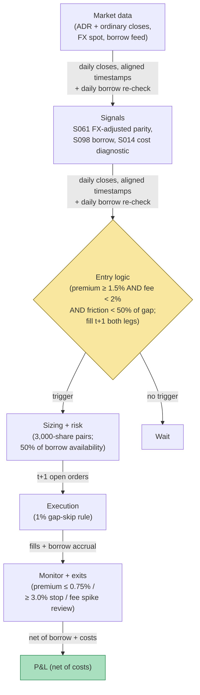

## Stage 199/200 — T099: ADR + Borrow Corporate Arb

*Batch TB10 · Strategy 99/100 · Signals S061, S098, S014 · Provenance [D/SR]*

### T1. One-line verdict

| | |
|---|---|
| **Style** | Cross-listing relative value: long the cheap listing, short the rich one, hedged for FX |
| **Edge source** | ADR–ordinary parity violations (S061) beyond borrow and FX costs: the ADR trades rich to its FX-adjusted home-market value, so short the ADR / long the ordinary; borrow/short-interest data (S098) prices the short leg's carry, and the spread/cost diagnostic (S014) keeps the trade honest about friction |
| **Typical holding period** | 3–15 sessions (example); parity gaps close on corporate-action calendars or not at all |
| **Capacity hint** | $0.5–3M per pair (example) — the borrow desk is the capacity |
| **Build-or-buy in one line** | Build the parity monitor; rent the borrow — the stock-loan desk is the strategy's counterparty and its cost center |

### T2. Full mechanics

**The idea, plainly.** An **ADR** (American Depositary Receipt) is a US-listed security representing shares of a foreign company, convertible at a fixed ratio. In frictionless markets, ADR price = ordinary price × FX rate × ratio. In practice, the two listings diverge — different investor bases, different hours, different borrow conditions. **FX-adjusted parity** (S061) measures the divergence after converting currencies; **borrow/short-interest data** (S098) tells you what shorting the rich leg costs and whether the borrow can be pulled; the **spread/cost diagnostic** (S014) totals the friction so you only trade gaps bigger than the toll.

**Parity math.** premium_t = (ADR_t − ordinary_t × FX_t × ratio) / (ordinary_t × FX_t × ratio). All inputs timestamp-aligned: the ordinary's close converted at the contemporaneous FX spot — never the ADR price against yesterday's FX.

**Entry rule.** Enter when |premium| ≥ +1.5% (example) in the direction that sells the rich leg: premium positive → short ADR / long ordinary. **Causal timing, stated explicitly: the premium is computed on the day-t close (both listings closed, FX spot at the close); the earliest legal fill is the t+1 open.** The ADR and the ordinary never trade simultaneously in this design — the fill is two t+1 opens, and the overnight FX gap between them is unhedged basis risk.

**Exit rule.** premium ≤ +0.75% (example) → unwind at the next open. Stop: premium widens to +3.0% (example) — the divergence is structural, not noise. Time stop: 15 sessions (example). Corporate-action freeze: no entries 5 sessions around known ADR ratio changes, dividends, or tax events (example).

**Position sizing.** 3,000-share pairs (example), capped by borrow availability: size = min(target, 50% of available borrow, example).

**Borrow economics (S098).** The short ADR leg pays the stock-loan fee daily: borrow_cost = shares × price × rate × days/360. Rates are tiered — general collateral ~0.3% (example), specials 2–50%+ (example). The strategy requires the borrow rate < 2% (example) at entry and re-checks daily; a rate spike above 5% (example) triggers an unwind review.

**Risk limits.** Max 5 pairs (example); single-pair loss stop −2% of sleeve (example); FX basis risk acknowledged, not hedged (the hedge costs more than the gap for sub-2-week holds — stated honestly).

**Cost model.** Per 3,000-share pair: borrow (10 days illustrated), trading 2.0¢/share RT per leg, FX conversion $25 flat (example).

**Order/execution.** Both legs as t+1 open orders; if either leg's open gaps >1% against (example), the pair is skipped — half-filled parity trades are the failure mode.

### T3. Signals it consumes

| Signal | Role | Weight / logic |
|---|---|---|
| S061 (FX-adjusted ADR parity) | Trigger | \|premium\| ≥ 1.5% (example); timestamp-aligned FX |
| S098 (borrow/short-interest) | Cost + feasibility | borrow rate < 2% to enter (example); daily re-check; availability caps size |
| S014 (spread/cost diagnostic) | Honesty gate | total friction must be < 50% of the premium (example), else skip |

Pseudocode (≤25 lines):
```
daily close t:                                              # granularity: daily closes + FX spot
    prem[t] = (ADR[t] - ORD[t]*FX[t]*ratio) / (ORD[t]*FX[t]*ratio)   # S061
    fee[t] = borrow_rate(ADR) ; avail[t] = borrow_availability      # S098
    friction = est_cost(prem)                               # S014
    if prem[t] >= 1.5% and fee[t] < 2% and friction < 0.5*prem[t]:   # example
        short ADR / long ORD at next open                   # fill t+1, both legs
# exits: prem <= 0.75% / prem >= 3.0% stop / 15-session time /
#        fee > 5% -> unwind review / corp-action freeze
```

### T4. Worked example — numbers + P&L (SYNTHETIC)

Synthetic pair **EURO** (ADR) vs its home-market ordinary, ratio 1:1, seed 199. Premium computed FX-adjusted.

| Day | Premium | Action |
|---|---|---|
| 1–2 | +2.4% → +2.1% | watch (borrow check passes: 1.8%) |
| 3 | +1.9% | **signal at close** (≥ +1.5%, example) |
| 4 | +1.7% | **fill at open: SHORT 3,000 ADR @ $52.40 / LONG 3,000 ordinary @ $51.40** |
| 5–11 | +1.5% → +0.9% | hold; borrow steady at 1.8% |
| 12 | +0.6% | **signal at close** (≤ +0.75%, example) |
| 13 | — | **unwind at open: cover ADR @ $50.90 / sell ordinary @ $50.60** |

Ledger (fully costed):
- Short ADR: sold $52.40, covered $50.90 → +$1.50 × 3,000 = +$4,500
- Long ordinary: bought $51.40, sold $50.60 → −$0.80 × 3,000 = −$2,400
- Gross: **+$2,100**
- Borrow: 10 days × 3,000 × $52.40 × 1.8% / 360 = **$78.60**
- Trading: 2 legs × 3,000 × $0.02 = $120; FX conversion $25
- Total costs: **$223.60**
- **Net: +$1,876**

**Session net: +$1,876 (synthetic; demonstrates the parity/borrow/cost arithmetic — the ordinary leg *loses* money and the trade still works, which is the point of relative value, not forward alpha or after-cost profitability).**

**Where the example is optimistic.** The premium glides from +1.9% to +0.6% without a single spike — real parity gaps jump on FX moves, and the FX basis between the t close and the t+1 opens is unhedged. The borrow stays at 1.8% for 10 days; real specials spike when everyone finds the same gap, and the unwind-review trigger exists because of exactly that. The ordinary leg's −$0.80 drift is assumed benign; if the home market falls for fundamental reasons, both legs can lose (the ADR falls *less*, but "less" isn't a profit). Corporate actions are assumed away by the freeze rule — in production the freeze list is the research. And the $25 FX flat fee is a retail number; institutional FX costs are spread-based and scale with size.


*Chart caption: synthetic data — not market data. Watermark reads "SYNTHETIC EXAMPLE" exactly. Seed 199; the shaded band is the position window; entry/exit lines are the example thresholds.*

### T5. Data & infra — what must run

**Feed.** ADR prices (US), ordinary prices (home market), FX spot (contemporaneous timestamps), borrow rates + availability (stock-loan desk feed or vendor), corporate-action calendars for both listings.

**Jobs.** Daily: timestamp-aligned parity computation, borrow re-check, friction diagnostic, freeze-list check. The timestamp alignment is the entire engineering problem — the ordinary's close and the FX spot must be contemporaneous, or the "premium" is a clock artifact.

**Storage.** Daily closes + FX + borrow: MB-scale. Trivial.

**M5 Max feasibility.** Trivially feasible. Engineering: Tier M per cost-model §5 (20–60 h; one line: pairs screens + borrow-desk integration); planning band **20–60 h ≈ $3,000–$9,000 loaded-cost estimate** at $150/hr. What breaks first: the borrow feed's timeliness and the corporate-action calendar coverage, not compute.

**Feed-drop failure plan.** If FX or either listing's close is missing: no parity computed, no new pairs (fail closed). Existing pairs keep their stops; borrow re-checks use the last confirmed rate conservatively (assume the higher of last rate and 5%, example).

### T6. Buy vs build

| Option | What you get | Indicative price | Gains | Loses |
|---|---|---|---|---|
| Tier-0: free closes + FX | Parity inputs | ~$0, `indicative — verify before budgeting` | $0 | Borrow data is not free; timestamp QA is yours |
| Borrow data vendor (e.g., S&P, FIS) | Rates + availability | institutional $$, `indicative — verify before budgeting` | Actually tradeable shorts | The real cost of this strategy |
| Prime broker stock-loan desk | Borrow + execution | relationship-priced, `indicative — verify before budgeting` | One throat to choke | Minimums exclude small accounts |

**Verdict: build the monitor, buy (rent) the borrow.** The parity math is 10 lines; the borrow feed and the desk relationship are the strategy. No borrow data = no strategy — this is the one chapter where the buy decision is existential, not marginal.

### T7. Success-ratio evidence

Published, checkable sources only; figures before-cost unless stated.

| Study | Market & period | Finding | Before/after cost | Caveat |
|---|---|---|---|---|
| Gagnon & Karolyi (2010), "Multi-Market Trading and Arbitrage" | 46 markets, ADRs | ADR–ordinary price deviations exist but are small and short-lived for most pairs; arbitrage is limited by costs | Before cost | The paper's message is cautionary: the gaps this chapter trades are mostly *within* the friction band — the 1.5% example threshold is wide precisely because of this |
| The ADR parity literature generally | — | Law-of-one-price violations are documented but rarely exceed round-trip costs for liquid pairs | Before cost | The edge, if any, is in less-liquid pairs — where the borrow is also worst. The strategy's opportunity set and its cost set are the same names |
| D'Avolio (2002), "The Market for Borrowing Stock" | US | Stock-loan fees, specials, and recall risk are quantified | Before cost (market description) | The borrow can be recalled — the unwind-review rule exists because D'Avolio's recalls are real |

**Honest bottom line.** The literature's verdict on ADR arbitrage is closer to "mostly efficient" than "rich with alpha" — the gaps are real but usually sub-friction. This chapter's honest claim: a disciplined parity monitor that trades only wide, borrowable gaps will trade *rarely* — and rarity is the strategy, not a bug. Anyone showing you daily ADR-arb P&L is showing you FX-timing luck or unpaid borrow.

### T8. Failure modes

- **Borrow recall.** The lender recalls the ADR shares mid-trade; you're bought in at the worst print. Mitigation: availability buffer (50% cap), the >5% fee unwind review, and never sizing the short leg beyond what two lenders can cover (example).
- **FX basis.** The t-close FX ≠ the t+1 fill FX; the "premium" was a clock artifact. Mitigation: contemporaneous timestamps, asserted in code; skip the pair if either timestamp is stale.
- **Corporate actions.** Ratio changes, special dividends, tax withholdings break parity math silently. Mitigation: the 5-session freeze list; the strategy is *off* more than it's on around events.
- **Structural premium.** Some ADRs trade persistently rich (index inclusion, retail demand) — the +3.0% stop exists for this. Mitigation: the widening stop; pair-level P&L attribution that flags structural vs noisy pairs.
- **Half-filled pairs.** One leg fills, the other gaps. Mitigation: the 1% gap-skip rule; both legs as open orders with cancel-replace discipline.
- **Threshold overfit.** 1.5%/0.75%/3.0% are examples. Mitigation: the friction gate (S014) is the real threshold — the premium must exceed *measured* costs by 2×, whatever the nominal levels.

### T9. Visuals


*Chart caption: synthetic data — not market data. Watermark reads "SYNTHETIC EXAMPLE" exactly. Seed 199; net +$1,876 after $223.60 fully costed.*



### T10. Sources

1. Gagnon, L. & Karolyi, G. A. (2010). "Multi-Market Trading and Arbitrage." *Journal of Financial Economics* 97(1): 53–80. https://doi.org/10.1016/j.jfineco.2010.03.005 — ADR–ordinary deviations are mostly small and short-lived; arbitrage bounded by costs. DOI re-checked 2026-09-10 in this batch's rework pass — resolves with matching title.
2. D'Avolio, G. (2002). "The Market for Borrowing Stock." *Journal of Financial Economics* 66(2–3): 271–306. https://doi.org/10.1016/S0304-405X(02)00206-4 — stock-loan fees, specials, recall risk. DOI re-checked 2026-09-10 in this batch's rework pass — resolves with matching title.
3. Rosenthal, L. & Young, C. (1990). "The Seemingly Anomalous Price Behavior of Royal Dutch/Shell and Unilever N.V./PLC." *Journal of Financial Economics* 26(1): 123–141. https://doi.org/10.1016/0304-405X(90)90015-R — the classic Siamese-twin relative-value study; parity gaps can persist (the cautionary tale for the +3.0% stop). Identifier re-checked 2026-09-10 via Crossref API (title + journal + year match); the prior draft's DOI (…90012-3) returns 404 and was replaced.

**Unverified leads** (not confirmed facts — verify before use):
- All parity/borrow thresholds (1.5%, 0.75%, 3.0%, 2%/5% fees, 15-session time stop) are the chapter's own `example` design values (2026-09-10), not published recommendations.
- The $25 FX fee and 1.8% borrow rate are illustrative; institutional FX is spread-based and specials spike.

*Source log (2026-09-10 rework pass): batch research Q-labels removed from this chapter. Re-checked 2026-09-10: Rosenthal–Young DOI corrected to the Crossref-verified 10.1016/0304-405X(90)90015-R (the prior DOI returned 404); Gagnon–Karolyi and D'Avolio DOIs re-checked (resolve, titles match). Engineering corrected to the cost-model §5 Tier M band exactly (20–60 h, $3,000–$9,000 loaded-cost estimate). Thresholds are the chapter's own example design values.*
