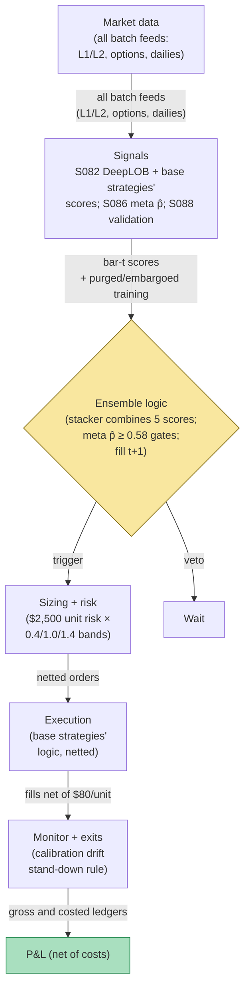

## Stage 200/200 — T100: Grand Ensemble — 100 Signals, One Book

*Batch TB10 · Strategy 100/100 · Signals S082, S086, S088 · Provenance [D/SR]*

### T1. One-line verdict

| | |
|---|---|
| **Style** | Meta-strategy: a stacking ensemble over the batch's own signals, gated by meta-labels, validated by purged/embargoed cross-validation |
| **Edge source** | No new alpha — the ensemble's edge is *selection*: DeepLOB-style microstructure predictions (S082) feed a stacker whose trades are vetoed/sized by meta-labels (S086), and every performance claim survives purged/embargoed CV (S088) before it counts |
| **Typical holding period** | Whatever the stacked signals dictate (minutes to sessions); the ensemble is a portfolio, not a clock |
| **Capacity hint** | $5–20M (example) — diversified across the batch's strategies; the meta-gate's fill-rate haircut is the binding constraint |
| **Build-or-buy in one line** | Build the stacker and the validation harness; the components are the previous 99 chapters — this chapter is the roof, not another room |

### T2. Full mechanics

**The idea, plainly.** This chapter assembles the batch into one machine. **DeepLOB** (S082) is a deep-learning model that predicts short-horizon price moves from limit-order-book images — its *prediction accuracy is not executable P&L* (the canon warning, honored here: accuracy ≠ profit after costs, latency, and queue position). **Stacking** trains a meta-model on the *outputs* of base strategies (their signals, not their P&L) to produce one combined position. **Meta-labeling** (S086) gives the second opinion that vetoes or sizes each stacked trade. **Purged/embargoed CV** (S088) is the validation discipline: purge training samples whose labels overlap test samples in time, and embargo a gap after each test block — without it, every backtest in this batch is optimistic.

**What this chapter is not.** It is a **synthetic worked example, not a production book**. The weights below are illustrative. No live capital allocation is described or implied. The chapter's purpose is to demonstrate the *assembly and validation mechanics* — how the pieces combine and how the honesty checks work — on synthetic data.

**Architecture (illustrative weights).** Base layer: five signal-strategies from this batch (T091 book-pressure, T093 options-lead, T094 squeeze-breakout, T096 Kalman-trend, T098 jump-momentum), each emitting a standardized score per bar. Stacking layer: logistic regression (example) on the five scores, trained on triple-barrier labels (S086's companion method): each training event is labeled +1 if the upper barrier (+1.25 × daily σ, example) is touched first within τ = 2 days (example), −1 if the lower barrier (0.90×, example) first, 0 on timeout. Meta layer: gradient-boosted p̂ per stacked trade; trade only if p̂ ≥ 0.58 (example); size multiplier 0.4×/1.0×/1.4× for p̂ in [0.55, 0.58)/[0.58, 0.78)/[0.78, 1] (example bands).

**Causal timing, stated explicitly.** Base scores computed on bar t; the stacker combines them at t; the meta-label scores at t; the earliest legal fill is t+1. The triple-barrier labels are computed with a τ-day forward window *in training only* — in live trading there is no label, only the model. The embargo gap in validation is 5 sessions (example).

**Sizing.** Unit risk $2,500 per stacked trade (example); the meta multiplier scales it. Max 3 concurrent stacked positions (example).

**Risk limits.** The meta-gate *is* the risk system, plus: daily sleeve stop −2% (example); if the stacker's live p̂ calibration drifts (predicted vs realized win rate diverges by >10pp over 50 trades, example), the ensemble stands down for refit.

**Cost model.** $80 per unit round-trip all-in (example: spread + fees + estimated impact on the blended book).

**Order/execution.** The ensemble emits one net position per name per bar; execution is the base strategies' logic netted — no double-trading.

### T3. Signals it consumes

| Signal | Role | Weight / logic |
|---|---|---|
| S082 (DeepLOB microstructure prediction) | One base-model input to the stacker | illustrative weight in the stacking regression; accuracy ≠ P&L |
| S086 (meta-labeling + triple-barrier labels) | Trade gate + sizer; label method for training | p̂ ≥ 0.58 to trade (example); 0.4×/1.0×/1.4× bands (example) |
| S088 (purged/embargoed CV) | Validation discipline | purge overlapping labels; 5-session embargo (example); no claim without it |

Plus the base strategies' own signals (S005, S071, S030, S077, S064 families) as stacking inputs.

Pseudocode (≤25 lines):
```
# TRAINING (research only):
labels = triple_barrier(returns, u=1.25, d=0.90, tau=2d)   # S086 method, example
stacker = fit_logreg(base_scores, labels, purged_embargoed_cv)  # S088, 5d embargo
meta = fit_gbm(trade_features, trade_outcomes, purged_cv)  # S086
# LIVE, every bar t:                                        # granularity: 1-min bars
scores[t] = [T091[t], T093[t], T094[t], T096[t], T098[t]]   # base signals, bar t
stack[t] = stacker.predict(scores[t])                       # combined score
p = meta.predict_proba(features[t])                         # second opinion
if p >= 0.58:                                               # example gate
    size = unit_risk * band_multiplier(p)                   # 0.4/1.0/1.4x, example
    trade stack[t] direction at next bar open               # fill t+1, never t
```

### T4. Worked example — numbers + P&L (SYNTHETIC)

Synthetic 5-event stacking walk, seed 200. Unit risk $2,500; $80 cost per unit round-trip. **This is a synthetic worked example of the assembly mechanics, not a production book; all weights illustrative.**

| Event | Meta p̂ | Size | Gross (illustrative) | Cost | Net |
|---|---|---|---|---|---|
| 1 | 0.71 | 1.0× | +$3,100 | $80 | **+$3,020** |
| 2 | 0.52 | 0 (vetoed) | — | $0 | $0 |
| 3 | 0.81 | 1.4× | +$1,960 | $112 | **+$1,848** |
| 4 | 0.66 | 1.0× | −$2,250 | $80 | **−$2,330** |
| 5 | 0.61 | 0.4× | +$1,120 | $32 | **+$1,088** |

**Gross ledger:** +$3,100 + $1,960 − $2,250 + $1,120 = **+$5,930**
**Cost ledger:** $80 + $112 + $80 + $32 = **$304**
**Net (gated): +$5,930 − $304 = +$3,626**

**Counterfactual (ungated):** event 2 taken short at 1.0× (illustrative −$2,980 net) and event 5 at full 1.0× (illustrative +$2,720 net): +$3,020 − $2,980 + $1,848 − $2,330 + $2,720 = **+$2,278**.

**Session net: +$3,626 gated vs +$2,278 ungated (synthetic; the meta-gate's value is the vetoed event-2 loss and the under-sized event-5 win — selection, not prediction; not forward alpha or after-cost profitability).**

**Where the example is optimistic.** Five events is a demonstration, not a sample — the meta-model's p̂ values are *assigned*, not estimated, so the gate's "skill" is assumed, not measured. Real meta-labels need hundreds of labeled trades to calibrate (T092's warning), and the 0.58/0.78 bands are example values. The stacking weights are illustrative — real stacking on five correlated base strategies mostly learns to average them, and the averaging dilutes the best one. The purged/embargoed CV is *described* but the example doesn't show it failing — in practice it's where most ensemble dreams end. Event 4's −$2,330 loss passes the gate (p̂ = 0.66) because meta-labels are probabilistic, not oracular — the example is honest about that, at least.


*Chart caption: synthetic data — not market data. Watermark reads "SYNTHETIC EXAMPLE" exactly. Seed 200; the gated walk ends at +$3,626, the ungated at +$2,278; the lower panel shows p̂ with the example gate bands.*

### T5. Data & infra — what must run

**Feed.** Everything the base strategies need (L1/L2, options, daily bars) — the ensemble adds no new data, only new compute.

**Jobs.** Per bar: five base scores, one stacking inference, one meta inference. Daily/weekly: refit the stacker and meta-model on the purged/embargoed scheme; monitor p̂ calibration.

**Storage.** The base strategies' storage plus the trade-outcome database for meta-label training (GB-scale over a year).

**M5 Max feasibility.** Inference per bar is microseconds × 7 models; the weekly refit with purged CV is the only real job — minutes to low hours depending on history length. Verdict: **feasible**. Engineering: Tier M+ (40–100 h) for the stacking/validation harness *given the base strategies exist*; planning band **40–100 h ≈ $6k–$15k loaded-cost estimate** at $150/hr. What breaks first: the validation discipline — purged/embargoed CV on an expanding history is an organizational commitment, not a compute problem.

**Feed-drop failure plan.** If any base strategy's feed drops: its score freezes at the last computed value and is *excluded* from the stacker input (fail closed — a stale score is worse than a missing one); the stacker runs on the remaining scores with a logged warning.

### T6. Buy vs build

| Option | What you get | Indicative price | Gains | Loses |
|---|---|---|---|---|
| Build on the batch's components | The ensemble | engineering hours, `indicative — verify before budgeting` | Everything is auditable | You maintain 7 models' causality discipline |
| Buy an "AI ensemble" platform | Prebuilt stacking | institutional $$, `indicative — verify before budgeting` | Saves the harness | Black-box p̂ you can't validate with S088 |

**Verdict: build.** The ensemble's entire value proposition is *auditability* — purged/embargoed validation of every claim. A bought black box defeats the chapter's purpose. The components are the previous 99 chapters; this chapter is integration labor.

### T7. Success-ratio evidence

Published, checkable sources only; figures before-cost unless stated.

| Study | Market & period | Finding | Before/after cost | Caveat |
|---|---|---|---|---|
| Zhang, Zohren & Roberts (2019), "DeepLOB: Deep Convolutional Neural Networks for Limit Order Books" | LOB data (LSE) | CNNs predict short-horizon mid-price moves with accuracy well above chance | Before cost (accuracy) | The canon warning, stated plainly: prediction accuracy is not executable P&L — latency, queue position, and costs are unmodeled |
| López de Prado (2018), *Advances in Financial Machine Learning* | — | Meta-labeling improves the primary's precision; Ch. 7 details purged/embargoed CV | Method | The validation method is the point: without S088, the ensemble's backtest is fiction |
| Gu, Kelly & Xiu (2020), "Empirical Asset Pricing via Machine Learning" | US equities | ML (trees, nets) improves return prediction vs linear baselines; DOI 10.1093/rfs/hhaa009 | Before cost | Monthly cross-sectional prediction, not intraday stacking — the method transfers, the numbers don't |
| McLean & Pontiff (2016) | 97 anomalies | Predictability decays 26% out-of-sample, 58% post-publication; DOI 10.1111/jofi.12365 | After cost (returns) | The graveyard this ensemble is trying not to join: any stacked edge decays, and the meta-gate must be re-estimated continuously |

**Honest bottom line.** The components have real published support; the *assembly* — stacking five batch strategies under a meta-gate with honest validation — has no published P&L evidence and isn't claimed to. This chapter's deliverable is the harness and the discipline: the ensemble that survives S088 with its Sharpe intact is the only one allowed to trade, and most won't survive.

### T8. Failure modes

- **Correlated base strategies.** The five inputs all lose on the same day; the stacker diversifies nothing. Mitigation: the stacker is trained on *joint* outcomes, and the sleeve stop is on the ensemble, not the parts.
- **Meta-label overfitting.** p̂ memorizes the training period's luck. Mitigation: S088 on the meta-model too — purged/embargoed CV applies recursively, all the way down.
- **Calibration drift.** Live p̂ diverges from realized win rates. Mitigation: the 10pp/50-trade stand-down rule; scheduled refits.
- **DeepLOB accuracy ≠ P&L.** The base model's accuracy is measured on mid-price moves; the trade pays spread and latency. Mitigation: the base strategy's own cost model (T091's) already haircuts it; the stacker never sees raw accuracy.
- **Validation theater.** Purged CV with a too-short embargo, or labels leaking through corporate actions. Mitigation: the harness asserts embargo > max label horizon; audit the purge, don't assume it.
- **Complexity collapse.** Seven models, seven failure modes, one incident at 3 a.m. Mitigation: the ensemble must beat the *best single base strategy* net of all costs in purged CV, or it doesn't ship — simplicity is the default.

### T9. Visuals


*Chart caption: synthetic data — not market data. Watermark reads "SYNTHETIC EXAMPLE" exactly. Seed 200; gross +$5,930, costs $304, gated net +$3,626.*



### T10. Sources

1. Zhang, Z., Zohren, S. & Roberts, S. (2019). "DeepLOB: Deep Convolutional Neural Networks for Limit Order Books." *IEEE Transactions on Neural Networks and Learning Systems* 30(11). https://arxiv.org/abs/1808.03668 — LOB-based short-horizon prediction; accuracy ≠ P&L (the canon warning). arXiv API re-checked 2026-09-10 — title matches.
2. López de Prado, M. M. (2018). *Advances in Financial Machine Learning.* Wiley. https://www.wiley.com/en-us/9781119482086 — meta-labeling (Ch. 3), triple-barrier labels (Ch. 3), purged/embargoed CV (Ch. 7). Wiley page returned HTTP 403 on re-check 2026-09-10 — identifier not re-verified this pass; citation inherited from S086/S088's S12.
3. Gu, S., Kelly, B. & Xiu, D. (2020). "Empirical Asset Pricing via Machine Learning." *Review of Financial Studies* 33(5): 2223–2273. https://doi.org/10.1093/rfs/hhaa009 — ML return prediction vs linear baselines. DOI re-checked 2026-09-10 in this batch's rework pass — resolves with matching title.
4. McLean, R. D. & Pontiff, J. (2016). "Does Academic Research Destroy Stock Return Predictability?" *Journal of Finance* 71(1): 137–188. https://doi.org/10.1111/jofi.12365 — 26% lower out-of-sample, 58% lower post-publication. DOI re-checked 2026-09-10 in this batch's rework pass — resolves with matching title.

**Unverified leads** (not confirmed facts — verify before use):
- All ensemble parameters (unit risk $2,500, p̂ bands 0.55/0.58/0.78, multipliers 0.4×/1.0×/1.4×, triple-barrier u=1.25/d=0.90/τ=2d, 5-session embargo, $80/unit costs) are the chapter's own `example` design values (2026-09-10), not published recommendations.
- No published study validates this stacked ensemble as a traded strategy; the chapter is a synthetic assembly example.

*Source log (2026-09-10 rework pass): batch research Q-labels removed from this chapter. Re-checked 2026-09-10: heading corrected to plan.md's exact strategy name; DeepLOB arXiv identifier re-checked via arXiv API (title matches); Gu–Kelly–Xiu and McLean–Pontiff DOIs re-checked (resolve, titles match); the Wiley publisher page returned HTTP 403 and was not re-verified. Ensemble parameters are the chapter's own example design values.*
