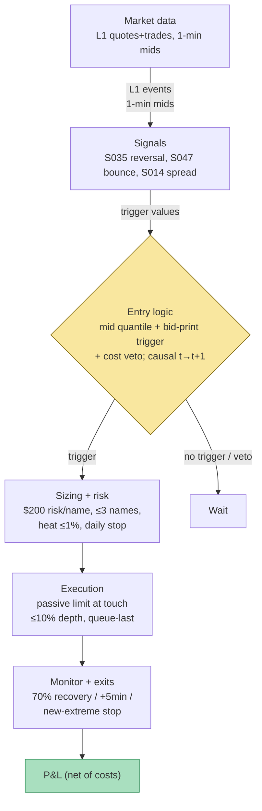

## Stage 111/200 — T011: Short-Term Reversal + Bounce Timing

*Batch TB2 · Strategy 11/100 · Signals S035, S047, S014*

### T1. One-line verdict

| Field | Verdict |
|---|---|
| **Style** | Intraday statistical arbitrage: short-horizon reversal scalper with microstructure entry timing |
| **Edge source** | Liquidity-provision rents (temporary price pressure that reverts) plus bid–ask bounce harvested by entering passively at the touch instead of crossing the spread |
| **Typical holding period** | Seconds to minutes per trade (`example`: bounce leg 30 s–2 min; reversal leg 2–10 min) |
| **Capacity hint** | Low. The edge is measured in fractions of the quoted spread; it scales with the number of tradeable liquidity shocks, not with capital. A handful of $M in gross exposure per name is the realistic envelope before queue position and impact eat the edge |
| **Build-or-buy in one line** | Build the screen and timing logic (that is the IP); buy an honest L1/midpoint feed — do not backtest this on last-sale bars |

Provenance note: S035 (Jegadeesh/Lehmann reversal) is `[D]` documented; S047 (Roll bounce) is `[D]`; S014 (spread decomposition) is `[D]`. This strategy composes only documented signals.

### T2. Full mechanics

**Universe & session.** Liquid US common stocks: 60-day average daily dollar volume (ADV — the mean dollar value traded per day) ≥ $50M (`example`), quoted spread ≤ 5 basis points (`example`; 1 bp = 0.01%), price ≥ $10 (`example`). Regular trading hours (RTH — 09:30–16:00 ET) only. Exclusions (`example`): earnings-announcement days ±1, trading halts, index-rebalance days, scheduled corporate actions, and any name whose spread exceeds 1.5× its 20-session median (the S014 veto). The filter exists for one reason: short-horizon reversal on transaction prices is mostly bid–ask bounce (Kaul & Nimalendran 1990 — see T7), so the strategy trades only names where the spread is small enough that a residual liquidity-provision edge could survive it.

**Entry rule.** All three signals must agree, in this order:

1. **S035 direction (reversal):** on quote midpoints (never last-sale prices), compute the trailing 15–60 min return (`example`: 30 min). Bottom quantile of the liquid peer set → arm long (losers); top quantile → arm short (winners). Midpoint discipline is mandatory: forming on transaction prices re-imports the bounce this strategy claims to harvest.
2. **S047 timing (bounce):** wait for the liquidity shock — `example` trigger: mid drops (long) ≥ 5 bps within ≤ 2 s, last print seller-initiated at the bid, bid size after the print ≥ 1.5× pre-print (replenishment). The Roll (1984) process in S047, $\Delta p_t = \frac{s}{2}(Q_t - Q_{t-1}) + u_t$, says a sell-initiated print mechanically depresses the trade price by half the spread; the entry waits for that mechanical print rather than chasing the move.
3. **S014 cost gate (veto):** trailing 1-day adverse-selection component — adverse selection is the mid-price drifting against the liquidity provider because the counterparty traded on information — measured as price impact $\mathrm{PI} = S^e - S^r$ per S014 ($/share), must be < half the quoted spread (`example`): the spread is mostly transitory, not information. If the mid persistently moves against liquidity providers in this name, stand down.

**Execution of entry:** passive limit buy at the bid (for longs) — at the touch (the best bid/ask currently quoted). You do not cross the spread; you post and wait to be hit. Unfilled after `example` 60 s → cancel; the replenishment thesis expired. **Causal timing:** S035's formation return uses mids ≤ *t*; the S047 trigger is event *t*; the earliest fill is event *t+1* (the next print that hits your quote). A backtest that fills at the mid or at the signal bar's close has one event of lookahead plus a free half-spread.

**Exit rule.** First of: (i) mid recovers 60–80% (`example`: 70%) of the impulse — exit passively at the ask; (ii) time stop `example` +5 min — exit aggressively at the bid; (iii) stop-loss: mid prints a new extreme beyond impulse low − 1 tick (`example`) — exit aggressively at once.

**Position sizing.** Risk `example` $200 per name: shares = 200 / (stop distance in $), where stop distance = impulse size + 1 tick. Max `example` 3 concurrent names. Portfolio heat (total $ risked across open positions, marked against stops) ≤ `example` 1% of equity.

**Risk limits.** Daily loss stop: `example` −0.8R aggregate (R = the $200 unit risk) — flat for the day when hit. Max gross exposure `example` 30% of equity. Kill-switch conditions: quote feed stale > `example` 2 s; NBBO (National Best Bid and Offer — the consolidated best bid/ask across exchanges) spread > 3× median; any passive order unacknowledged > 5 s → cancel all, flatten at the touch, halt new entries for the session.

**Cost model.** Passive fill: $0 spread cost on entry (you *earn* the half-spread vs mid), but queue-miss risk — modeled as a fill-probability haircut in research, never a free lunch. Aggressive exit: pay half the spread. Commissions `example`: $0.005/share + $0.50/ticket per side. Slippage/impact allowance `example`: 0.5 tick on aggressive exits (slippage = the price moving against you between decision and fill; impact = your own order pushing the price). Borrow: short leg only in easy-to-borrow large caps; `example` 25 bp annualized fee accrual, hard-veto hard-to-borrow names. T4 applies commissions explicitly and spread costs via fill prices.

**Order/execution sketch.** Limit orders only for entries, sized ≤ `example` 10% of the visible bid/ask depth; no iceberg games at this scale. Exits: passive limit at the favorable touch for (i), marketable limit for (ii)/(iii). Queue-position honesty note: on SIP (Securities Information Processor — the consolidated feed) or L1 (level-1: best bid/ask only) data you cannot know your queue position; any passive-fill assumption is `simulated only — requires MBO/ITCH` (MBO = market-by-order, ITCH = Nasdaq's order-level feed). Research posture: assume you are *last* in queue at your price level.

### T3. Signals it consumes

| Signal | Role | Weight / logic |
|---|---|---|
| S035 short-term reversal | Primary trigger (direction) | Trailing 30-min mid-return in extreme quantile → arm long (losers) / short (winners). `example` thresholds |
| S047 bid–ask bounce | Entry timer | Fire only on a seller-initiated bid print with mid impulse ≥ 5 bps/2 s and bid-size replenishment ≥ 1.5×. `example` thresholds |
| S014 spread decomposition | Cost gate / veto | Trade only if trailing adverse-selection share < ½ spread and current spread ≤ 1.5× 20-day median. `example` thresholds |

Combination logic (pseudocode, ≤25 lines):

```
for each name in liquid_universe:                      # ADV>=50M, spread<=5bps, price>=10 (example)
    r = mid_return(name, last 30 min)                  # S035, midpoints only
    if r not in extreme_quantile: continue             # no reversal setup
    side = LONG if r < 0 else SHORT
    on L1 quote/trade event e:                         # S047 trigger
        if impulse(e, >=5bps in <=2s) and print_on_bid(e) and bid_replenished(e, >=1.5x):
            if spread_now > 1.5*spread_median20: veto  # S014 veto
            if adverse_selection_share >= 0.5: veto    # S014 veto
            post passive limit at touch, size = 200/stop_dist
            if not filled in 60s: cancel; continue      # example
            monitor: exit at 70% mid-recovery (passive)
                     or +5min time stop (aggressive)
                     or new extreme - 1 tick (stop, aggressive)
    daily: if pnl <= -0.8R: halt; if feed stale >2s: kill-switch
```

### T4. Worked example — numbers + P&L (SYNTHETIC)

All numbers below are **synthetic** — five hand-specified trades on fictional liquid large-cap "XYZ" ($100 scale, $0.02 = 2 bps spread), `numpy.random.default_rng(111)` (**seed 111**); the chart plots exactly these prices and P&L values. Not a backtest: fills assumed, queue position unmodeled, tape constructed so the bounce usually works.

Cost schedule (`example`): commission $0.005/share + $0.50/ticket per side; spread cost embedded in fill prices (passive entries pay $0; aggressive exits pay the half-spread); aggressive exits additionally pay 0.5-tick ($0.005/share) slippage (`example`).

| Trade | Setup (synthetic) | Entry | Shares | Exit | Gross | Costs (comm. + slip) | Net | Exit reason |
|---|---|---|---|---|---|---|---|---|
| T1 | mid impulse −8 bps, seller print on bid, bid size 2k→4k | Buy 1,000 @ **99.91** (bid) | 1,000 | Sell @ **99.99** (ask) | +$80.00 | −$11.00 | **+$69.00** | 70% mid recovery |
| T2 | mid impulse −5 bps, replenished | Buy 1,000 @ **99.84** (bid) | 1,000 | Sell @ **99.87** (bid, aggressive) | +$30.00 | −$16.00 | **+$14.00** | +5 min time stop |
| T3 | mid impulse −7 bps, no replenishment follow-through | Buy 1,000 @ **99.79** (bid) | 1,000 | Sell @ **99.74** (bid, aggressive) | −$50.00 | −$16.00 | **−$66.00** | stop: new extreme −1 tick |
| T4 | mid impulse −5 bps | Buy 500 @ **100.11** (bid) | 500 | Sell @ **100.11** (bid) | $0.00 | −$8.50 | **−$8.50** | time stop, scratch |
| T5 | mid impulse −8 bps, strong replenishment | Buy 1,000 @ **99.66** (bid) | 1,000 | Sell @ **99.73** (ask) | +$70.00 | −$11.00 | **+$59.00** | 80% mid recovery |
| **Total** | | | | | **+$130.00** | **−$62.50** | **+$67.50** | |

Line-by-line (T1): buy 1,000 × 99.91 = −$99,910, commission −$5.50; sell 1,000 × 99.99 = +$99,990, commission −$5.50 → gross +$80.00, net **+$69.00**. (T3): −$99,790 − $5.50 in; +$99,740 − $5.50 out; −$5.00 aggressive-exit slippage (1,000 × 0.5 tick) → gross −$50.00, net **−$66.00**. Cumulative net: +$69.00, +$83.00, +$17.00, +$8.50, **+$67.50** — the chart's staircase.


**Where the example is optimistic.** (1) Every passive entry is assumed filled at the bid — real queue position means many limits are never hit, and the fastest-hit ones are the adversely-selected ones (the mid keeps falling through your bid). (2) No partial fills; real 1,000-share limits at the touch often fill in drips or not at all. (3) Exits at the ask assume the book is still there; T2/T3/T4's aggressive exits model 0.5-tick slippage beyond the half-spread — a real fast tape can still gap several ticks past the bid before the marketable order fills. (4) Zero latency: the example reacts to the trigger print instantly; on SIP you are 10–100 ms behind the direct-feed participants who caused the impulse. (5) The tape is constructed with a bounce; a tape where the impulse is information looks identical at the trigger and loses the spread plus the drift. The S014 gate exists because the example cannot tell these apart.

### T5. Data & infra — what must run

**Pipeline inventory.** Pre-open: universe screen (ADV, spread, price, corporate-action and earnings filters) from daily bars (Tier 0–1). Intraday loop: L1 quote/trade events → 30-min mid-return screen (S035) → S047 trigger per quote event → S014 trailing cost diagnostics → order-state machine (working passives, cancels, fills) → risk daemon (heat, daily stop, kill-switch). Post-close: fill reconciliation and mid-to-mid vs touch-to-touch P&L attribution — the honesty columns that separate spread harvesting from alpha.

**Feeds.** Minimum honest: L1 quotes + trades (Databento MBP-1 or equivalent, Tier 2) for mid computation and trigger events; daily bars + corporate actions for the universe (Tier 0–1). SIP top-of-book is the floor; anything claiming queue insight needs MBO/ITCH.

**M5 Max feasibility: feasible** (Tier M/M+, `notes/cost-model.md` §2/§3/§5). Per §2, a Python event loop handles ~100–500k events/sec — adequate for a 20–50 name L1 universe (~1–5k events/sec per busy name); beyond that, a Rust loop (~5–50M events/sec). The 1-min S035 screen over 500 names is trivial (195k bars/day, §2). RAM: one session of L1 for 50 names ≈ 2–10 GB (§3) — inside the 77 GB working budget; do not archive raw quotes naively (§4: ~2–8 GB per symbol-day parquet for liquid names). Engineering band: **40–100 h** (~$6,000–15,000 at $150/hr loaded-cost estimate, §5) for the harness + cost model + risk daemon; the signals themselves are Tier M. Bottleneck: feed quality and queue-fill honesty, not FLOPs. What breaks first at 500 symbols: the Python loop (move to Rust) and the assumption that passive fills arrive — at 500 names you cannot babysit queue dynamics, so the fill model must get *more* conservative, not less.

**Feed-outage safe mode.** Quote feed stale > 2 s (`example`): (a) cancel all working passive entries; (b) no new entries; (c) exit-only mode at the last known touch; (d) staleness > 30 s → flatten everything marketable, halt for the session. If S047's inputs are stale the strategy cannot distinguish a liquidity shock from an information event — the fail-safe is always "no trade." The kill-switch is a separate process from the strategy loop (a dead strategy process must not be the thing that cancels its own orders).

### T6. Buy vs build

| Option | What you get | Indicative price | Gains | Loses |
|---|---|---|---|---|
| Tier-0: Alpaca paper trading + IEX/SIP-delayed data | Paper execution API, delayed bars | ~$0, indicative — verify before budgeting | Free live-fire testing of the order-state machine | Delayed data; SIP-only; no honest queue modeling |
| Tier-1: Polygon Stocks Advanced | Real-time SIP L1 + 1-min bars, corporate actions | ~$30–200/mo, indicative — verify before budgeting | Cheap honest mids and trigger events | No MBO; history depth costs extra |
| Tier-2: Databento Standard (L1 MBP-1) | Exchange-grade L1, clean timestamps | ~$200/mo + usage, indicative — verify before budgeting | The minimum feed this strategy's claims require | Usage billing on heavy months |
| Research platform: QuantConnect cloud | Backtest/research environment, some data included | indicative — verify before budgeting | Fastest path to a *first* costed backtest | You still need your own live feed and execution stack |
| Execution: broker API (e.g. IBKR/Alpaca) | Order routing, no matching-engine build | ~$0 + commissions, indicative — verify before budgeting | Don't write a matching engine | Smart-routing opacity; queue honesty still yours |

**Verdict: buy the feed, build the logic.** The reversal sort, bounce trigger, S014 cost gate, and kill-switch are the IP — no vendor sells your thresholds. Buy L1 data (Tier 1–2); rent execution via a broker API. Building your own SIP feed or matching engine is a career, not a project. Crossover: if you cannot afford Tier-2 L1, run research-only on Polygon and do not trade the passive-entry variant live — without honest mids the edge is unverifiable.

### T7. Success-ratio evidence

| Source | Market & period | Metric | Before/after cost | Caveat |
|---|---|---|---|---|
| Jegadeesh (1990) | US stocks, 1934–1987 | Monthly loser–winner spread ~2.49%/mo (extreme deciles) | **Before cost** | Monthly horizon; extreme deciles; 200%+ turnover |
| Lehmann (1990) | US stocks, weekly | Weekly winners/losers reverse next week; argued profits survive plausible costs | Before cost (author's cost claim) | Analytic weights not recoverable — use rank deciles (S035) |
| Kaul & Nimalendran (1990) | Nasdaq, 1983–87 | On bid-to-bid returns the short-horizon reversal **disappears**; ~½ of measured daily variance is bounce-induced | Diagnostic | This is the paper that forces the midpoint discipline in T2 |
| Avramov, Chordia & Goyal (2006) | US stocks | Largest reversals in high-turnover, low-liquidity names; contrarian profits < likely transaction costs | **After cost** (modeled) | Treats the EMH "violation" as not egregious |
| de Groot, Huij & Zhou (2012) | US, 1990–2009 | Reversal earns **+30 to +50 bp/week net** of trading costs — but only in large caps with turnover-slashing construction | **After cost** | Verified via the published abstract 2026-09-10; broad-universe construction is net-negative |
| Frazzini, Israel & Moskowitz (2012) | Anomalies incl. reversal | Actual trading costs much lower than academic presumptions | After cost (live-trade data) | Institutional execution; not replicable at retail |
| Nagel (2012) | US stocks | Short-term reversal returns highly correlated with VIX — compensation for liquidity provision | Interpretation | Edge concentrates in stress periods |
| Heston, Korajczyk & Sadka (2010) | US, intraday half-hours | Same half-hour reversal is liquidity imbalance lasting < 1 h plus bounce; adjacent half-hours reverse | Before cost | Supports the *timing* leg (S047), not the sort |

Regimes where it fails: volatility spikes (spreads widen past the S014 veto — correctly standing you down); crowded liquidity-provision (post-2008, many desks run the same large-cap reversal — see T8); low-vol grinds (few impulses, opportunity cost).

**Honest bottom line.** For a ≤$1M paper operation: the Jegadeesh/Lehmann sort is not your edge — your edge, if any, is *execution*: entering passively at the touch, paying zero spread on fills that arrive, and honoring the cost gate. Honestly backtested (mid-based signals, touch fills, queue-last assumption), this is a research-grade scalper with a small per-trade expectancy and a high operational burden — worth building to learn microstructure, not to print money on day one. For an institutional desk: a standard liquidity-provision sleeve — the de Groot et al. result (30–50 bp/week net in large caps, turnover-controlled) is the realistic target, and it requires near-direct feeds, real queue modeling (MBO/ITCH), and portfolio-level turnover control. Without those, you are the liquidity being provided *to*.

### T8. Failure modes

1. **Bounce/alpha confusion.** The trigger cannot distinguish a transient liquidity shock from informed selling at the moment of the print. *Mitigation:* the S014 adverse-selection veto plus the bid-replenishment requirement; paper-trade the mid-to-mid P&L column separately to measure how much of "edge" is just spread.
2. **Queue position.** Passive entries assumed filled at the bid are last in a queue you cannot see on L1. *Mitigation:* research assumes last-in-queue; live, cap size at 10% of visible depth and track fill-rate by name — names with < 30% passive fill rates (`example`) are removed.
3. **Adverse selection on the exit.** Selling at the ask into a failed recovery leaves you long into the drift. *Mitigation:* the new-extreme stop is aggressive by design; never "give it room."
4. **SIP latency.** Triggering off a consolidated feed means direct-feed participants already traded the impulse. *Mitigation:* measure trigger-to-fill latency; if median > 50 ms (`example`) on SIP, drop the sub-second bounce entries and keep the slower minutes-scale reversal leg.
5. **Spread-regime veto failure.** A stale 20-day median spread lets you trade into a volatility event. *Mitigation:* dual veto — absolute spread cap (5 bps, `example`) AND relative (1.5× median); recompute medians nightly.
6. **Overfit trigger thresholds.** 5 bps / 2 s / 1.5× replenishment are `example` values with no optimality claim. *Mitigation:* sensitivity sweep; prefer thresholds flat across ±50% perturbations; re-estimate quarterly.
7. **Short-leg borrow.** Winners that keep winning are often hard-to-borrow; fees convert the short fade into a guaranteed loss. *Mitigation:* easy-to-borrow list checked pre-open; borrow-fee accrual in the cost model; skip otherwise.
8. **Operational: stale kill-switch.** A risk daemon that dies silently leaves passive orders working into a gap. *Mitigation:* heartbeat between strategy and risk processes; exchange-side cancel-on-disconnect; kill-switch in a separate process.

### T9. Visuals




### T10. Sources

**Checkable sources**

- de Groot, W., Huij, J. and Zhou, W. (2012), "Another look at trading costs and short-term reversal profits," *Journal of Banking & Finance*. https://ssrn.com/abstract=1605049 — 30–50 bp/week net of costs in large caps with turnover control (verified via abstract 2026-09-10).
- Kaul, G. and Nimalendran, M. (1990), "Price Reversals: Bid-Ask Errors or Market Overreaction?", *Journal of Financial Economics*. http://ideas.repec.org/a/eee/jfinec/v28y1990i1-2p67-93.html — transaction-price reversals are mostly bounce; bid-to-bid autocorrelation disappears.
- Jegadeesh, N. (1990), "Evidence of Predictable Behavior of Security Returns," *Journal of Finance* — the monthly reversal original (~2.49%/mo gross, extreme deciles).
- Lehmann, B.N. (1990), "Fads, Martingales, and Market Efficiency," *Quarterly Journal of Economics* — weekly reversal; profits argued to survive plausible costs.
- Roll, R. (1984), "A Simple Implicit Measure of the Effective Bid-Ask Spread in an Efficient Market," *Journal of Finance*. DOI: 10.1111/j.1540-6261.1984.tb03897.x. https://doi.org/10.1111/j.1540-6261.1984.tb03897.x — the bounce data-generating process behind S047.
- Avramov, D., Chordia, T. and Goyal, A. (2006), "Liquidity and Autocorrelations in Individual Stock Returns," *Journal of Finance* — contrarian profits concentrate in illiquid names and fall below likely costs.
- Heston, S.L., Korajczyk, R. and Sadka, R. (2010), "Intraday Patterns in Time-Series and Cross-Sectional Stock Returns," *Journal of Finance* — intraday reversal is sub-hour liquidity imbalance plus bounce.
- Frazzini, A., Israel, R. and Moskowitz, T.J. (2012), "Trading Costs of Asset Pricing Anomalies" — live-trade costs lower than academic presumptions (institutional execution).

**Unverified leads** (chatbot-provided, not independently verified — do not cite as fact)

- Grok (Q-TB2-3, 2026-09-10): de Groot et al. slide figures — 1,500-name book, ~780% weekly turnover, ~93 bp/week gross, ≈ −50 bp/week net before turnover control; labeled `unverified chatbot claim`.
- Grok (Q-TB2-1, 2026-09-10): the 8 bps/2 s trigger, 1.5× replenishment, and the XYZ $50 worked example — illustrative `example` thresholds, not estimated parameters.
- All vendor prices above are `indicative — verify before budgeting`.

*Source log: Grok answered Q-TB2-1..3 (2026-09-10); all claims independently verified or labeled unverified.*
