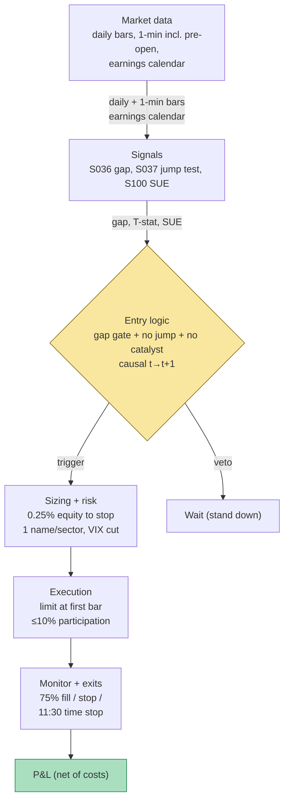

## Stage 112/200 — T012: Jump-Filtered Overnight-Gap Fade

*Batch TB2 · Strategy 12/100 · Signals S036, S037, S100*

### T1. One-line verdict

| Field | Verdict |
|---|---|
| **Style** | Overnight-session mean reversion: event-driven gap fade at the cash open |
| **Edge source** | Non-informational overnight gaps (stale quotes, retail order imbalances, index flows) reverting as the cash session discovers price; the jump filter deletes the information-driven gaps that continue instead of filling |
| **Typical holding period** | Minutes to ~2 hours (`example`: enter 09:35–09:45, exit by 11:30) |
| **Capacity hint** | Moderate in large caps — the trade is one print per name per day; capacity is bounded by opening-auction depth and the gap-extension tail |
| **Build-or-buy in one line** | Build the scanner and the jump filter (that is the IP); buy auction-quality opens and a point-in-time earnings calendar — a stale calendar turns this into a PEAD-chasing machine |

Provenance note: S036 (overnight-gap fade) is `[D]` documented; S037 (Lee–Mykland jump filter) is `[D]`; S100 (SUE/PEAD) is `[D]`. This strategy composes only documented signals.

### T2. Full mechanics

**Universe & session.** Liquid US common stocks, ADV ≥ $20M (`example`), price ≥ $10 (`example`). Session: the first two hours of RTH only (09:30–11:30 ET, `example`). Exclusions (`example`): earnings announcements within [−2, +1] trading days (the S100 veto), trading halts, index-rebalance days, corporate actions, and any name where the pre-market session printed > 30% of 20-day ADV (the move already happened without you).

**Entry rule.** All three signals must agree:

1. **S036 fade direction:** gap $g = O/C(t{-}1) - 1$ (O = official opening print, C = prior official close, split/dividend-adjusted). Trade only small gaps: `example` $|g| \ge g_{min} = 0.5\%$ and $|g| \le 0.40 \times \mathrm{ATR}_{20}$ (ATR = Average True Range, the mean of recent daily high−low ranges — the volatility ruler). Side: short gap-ups, long gap-downs.
2. **S037 jump gate (the veto that defines the strategy):** compute the Lee–Mykland statistic $T(\text{open})$ on the overnight return scaled by local bipower variation (a jump-robust volatility estimator — the full formula is in S037; decision threshold $q(0.95) = 2.970$). Fade only if $T(\text{open}) \le q(1-\alpha)$ (`example`: $\alpha = 5\%$) — no significant jump. A detected jump means "do NOT fade immediately," never "reverse and chase."
3. **S100 catalyst veto:** skip if the name announced earnings in the window or its latest standardized earnings surprise $|SUE| = |EPS_{actual} - E[EPS]| / \sigma(\text{past surprises})$ exceeds `example` 1.5 — the gap is then the PEAD (post-earnings-announcement drift) leg to ride (T078), not a fade candidate.

**Entry timing:** enter 09:35–09:45 (`example`) only if the first 5-minute bar does not extend the gap by more than `example` $0.15 \times \mathrm{ATR}_{20}$ — extension means the gap is being *traded*, not absorbed. **Causal timing:** the gap is known at the opening print; the jump test uses returns ≤ the open; the earliest fill is the open auction or the first post-open bar. Pricing the entry at the first 5-min bar's *close* while the jump test "knew" it is lookahead — the test must be computable at the open.

**Exit rule.** First of: (i) fill target `example` 50–100% of the gap toward the prior close (partial fills at 50% are the practitioner's compromise — full fills are rare); (ii) stop-loss at the gap extreme ± `example` $0.35 \times \mathrm{ATR}_{20}$ (gap continuation days are the left tail); (iii) time stop `example` 11:30 — flat by midday, no afternoon drift exposure.

**Position sizing.** Risk `example` 0.25% of equity to the stop: shares = (0.0025 × equity) / (stop distance in $). Max `example` 1 name per sector; max `example` 5 concurrent names. Regime cut (`example`): skip the session if VIX > 28 — gap-continuation tails cluster in stress.

**Risk limits.** Daily loss stop `example` −1% of equity; max gross exposure `example` 40% of equity. Kill-switch: feed gap in 1-min bars > 3 min → exit-only, flatten at the touch; corporate-action feed stale → no new entries.

**Cost model** (`example — not an institutional standard`, three-component stack from S036/S037): effective half-spread ≈ 2 bp/leg (4 bp round trip) + fees ≈ 0.5 bp/leg (1 bp RT) + slippage/impact ≈ 5 bp/leg (10 bp RT, opening-auction adverse selection) ≈ **15 bp round trip**. A 5–10 bp gross expectancy per trade against a 15 bp stack is ≈ 0 or negative: the fade lives or dies on costs, not on the jump test.

**Order/execution sketch.** Enter with a limit at the first-bar price (or participate in the opening auction where the venue supports it); participation ≤ `example` 10% of the bar's volume. Exits: limit at the fill target; marketable limit for stops. Never average into an extending gap — the stop is the thesis.

### T3. Signals it consumes

| Signal | Role | Weight / logic |
|---|---|---|
| S036 overnight-gap fade | Primary trigger (direction) | $s = -\mathrm{sign}(g)$ when $g_{min} \le \|g\| \le 0.40\times\mathrm{ATR}_{20}$; size ∝ risk/stop. `example` thresholds |
| S037 Lee–Mykland jump filter | Gate / veto (the risk engine) | Trade only if $T(\text{open}) \le q(0.95) = 2.970$; intraday re-scan can trigger early exit. `example` |
| S100 earnings surprise (SUE) | Catalyst veto | Skip if earnings in [−2,+1] days or $\|SUE\| > 1.5$ (`example`); the gap is then PEAD, not noise |

Combination logic (pseudocode, ≤25 lines):

```
pre-open: for each name: g = open/prior_close - 1        # S036; split-adjusted
    if |g| < 0.5% or |g| > 0.40*ATR20: continue          # example gates
    T = lee_mykland(open_return, local_window=60)       # S037
    if T > 2.970: veto("jump")                          # example alpha=5%
    if earnings_in_window(name, [-2,+1]) or |SUE| > 1.5: veto("PEAD")  # S100
    side = SHORT if g > 0 else LONG
09:35-09:45: if first_5min extends gap > 0.15*ATR20: veto("extension")
    shares = 0.0025*equity / (0.35*ATR20)               # example risk
    enter limit; stop = gap_extreme +/- 0.35*ATR20
intraday: exit at 75% fill target (example) or stop or 11:30 time stop
    if S037 intraday re-scan detects jump: exit early
daily: pnl <= -1% equity: halt; VIX > 28: skip session (example)
```

### T4. Worked example — numbers + P&L (SYNTHETIC)

All numbers below are **synthetic** — three gap scenarios on fictional large-cap "XYZ" (prior close $100.00), generated with `numpy.random.default_rng(112)` (**seed 112**); the chart `images/T012_example.png` plots scenario A's intraday path with the exact entry/exit prices below and per-scenario net P&L. Not a backtest: one illustrative day per scenario, no partial fills, the jump statistics are stipulated (the test arithmetic itself is worked in S037).

Cost schedule (`example`): commission $0.005/share + $0.50/ticket per side; spread/impact allowance ≈ 4 bp round trip on notional (within the ~15 bp stack — this example uses a liquid-name opening print).

**Scenario A — executed fade.** Gap $g = 99.20/100.00 - 1 = \mathbf{-0.80\%}$. ATR20 = 2.40 (`example`): $|g|/\mathrm{ATR} = 0.33 \le 0.40$ → small gap, fade allowed. Lee–Mykland $T(\text{open}) = 1.8 \le 2.970$ → no jump. S100 screen: no earnings in window; latest SUE = +0.3 → no catalyst. First 5-min bar holds 99.20–99.30 (no extension beyond $0.15 \times 2.40 = 0.36$ below the open). **Long 568 shares at 09:35, $99.24.** Sizing: equity $200,000; risk = 0.25% × 200,000 = $500; stop = $99.20 - 0.35 \times 2.40 = 98.36$; risk/share = $99.24 - 98.36 = 0.88$ → $500/0.88 = 568.2 \rightarrow$ **568 shares**. Exit at 75% fill toward $100.00$: target $99.20 + 0.75 \times 0.80 = 99.80$; cover at bid **$99.78**.

| Step | Price | Side | Shares | Cash flow |
|---|---|---|---|---|
| Entry (09:35) | 99.24 | Buy | 568 | −$56,368.32 |
| Commission in | — | — | — | −$3.34 |
| Exit (75% fill) | 99.78 | Sell | 568 | +$56,675.04 |
| Commission out | — | — | — | −$3.34 |
| Spread/impact allowance | — | — | — | −$22.60 |
| **Gross** | | | | **+$306.72** (568 × $0.54) |
| **Costs** | | | | **−$29.28** |
| **Net P&L** | | | | **+$277.44** |

**Scenario B — vetoed by the jump filter.** Gap +1.50% (open $101.50$); $|g|/\mathrm{ATR} = 0.63 > 0.40$ fails the size gate, and $T(\text{open}) = 4.5 > 2.970$ confirms a jump → **stand down, net $0.00**. Synthetic counterfactual (labeled — not a claim): the gap continued to +2.40% by 10:30; a naive 400-share short fade would have lost ≈ −$360 plus costs. The veto is conservative risk control, not a profit oracle — it deletes winners too (S036's own tape shows the filter vetoing a +2.73% winner).

**Scenario C — vetoed by S100.** Gap −0.60% (open $99.40$), $T(\text{open}) = 1.1$ (no jump) — but the company announced earnings after the prior close with SUE = +2.4 → the gap is information; PEAD leg, not a fade → **stand down, net $0.00**. Synthetic counterfactual: the gap filled only 10% then continued to −1.8%; a naive long would have lost.

Executed book net for the three scenarios: **+$277.44** (one trade taken, two vetoes at $0).


**Where the example is optimistic.** (1) Scenario A fills 75% of the gap in under an hour — the smooth ascent is the cherry-picked path; real fades stall, re-extend, and stop out. (2) The 15 bp stack assumes a liquid-name opening print; in the names where gaps are interesting, the stack is 25–50 bp. (3) The jump statistics are stipulated — on a real 10-bar opening window the Lee–Mykland test is illustrative, not statistically reliable (S037). (4) The S100 veto assumes a point-in-time, complete earnings calendar; a leaked or mis-stamped announcement turns scenario C into a live position against informed flow. (5) No partial fills, and no "stop then fill" sequence where the gap extends past the stop before reverting.

### T5. Data & infra — what must run

**Pipeline inventory.** Nightly: universe screen (ADV, price, corporate actions), ATR20, earnings-calendar join, SUE refresh from consensus data. Pre-open (08:00–09:30): official prior closes, pre-market prints, gap computation, Lee–Mykland jump test on the overnight return with its local window, S100 veto check. Intraday (09:30–11:30): 1-min bar monitor, first-bar extension check, fill-target/stop/time-stop order management, optional intraday jump re-scan for early exit. Post-close: P&L attribution (fill-rate buckets by gap size — the diagnostic Grok's Q-TB2-3 recommends), veto log review (how many stand-downs, what the counterfactuals did).

**Feeds.** Official opens and prior closes (auction prints preferred — Tier 0–1, but note Grok's Q-TB2-2 warning: vendor daily-bar opens are often composites, not auction prints); 1-min bars including the pre-open session for the jump window (Tier 1–2); point-in-time earnings calendar + consensus EPS (Tier 2); VIX for the regime cut.

**M5 Max feasibility: feasible** (Tier M+, `notes/cost-model.md` §2/§3/§5). The cheapest TB2 strategy computationally: the nightly 3,000-name screen is seconds in polars (§2: ~10–50M rows/sec); the intraday loop watches a handful of names on 1-min bars. RAM: months of 1-min bars ≈ tens of MB (§3) — the 77 GB budget is barely touched. Engineering band: **40–100 h** (~$6,000–15,000 at $150/hr loaded-cost estimate, §5) — mostly the jump filter, the point-in-time calendar join, and veto/counterfactual logging. Bottleneck: data correctness (auction prints, calendar point-in-time), not compute. What breaks first at 500 symbols: nothing local — what breaks is economic: 500 names × 15 bp round trip means expectancy must be honestly positive *per trade*, and the veto log is how you prove it.

**Feed-outage safe mode.** If the jump filter cannot compute (missing local window — e.g. pre-market data gap): **default to veto** — fail-safe is always "no trade," never "trade unfiltered." If the 1-min feed drops intraday: immediate time-stop — flatten all open fades marketable at the touch; no new entries until the feed is whole. If the earnings calendar is stale (> 1 day since refresh, `example`): no new entries — an unstamped earnings gap is the exact left tail the S100 veto exists to prevent. The overnight-gap computation itself is pre-open and idempotent; a total pre-open feed failure means no trading that day.

### T6. Buy vs build

| Option | What you get | Indicative price | Gains | Loses |
|---|---|---|---|---|
| Tier-0: Stooq daily bars | Free daily OHLC | ~$0 | Zero-cost research screen | Opens are composites, not auction prints — fatal for honest gap measurement |
| Tier-1: Polygon Stocks Advanced | 1-min bars + trades, corporate actions | ~$30–200/mo | Cheap 1-min history for the jump window | Open-print auction quality varies |
| Tier-1: FirstRate Data 1-min (one-time dump) | Historical 1-min, all stocks | low hundreds–low thousands one-time, indicative — verify before budgeting | Deep history without a subscription | One-time snapshot goes stale; no live feed |
| Tier-2: Databento (auction prints + L1) | Official auction prints, clean timestamps | ~$200/mo + usage | The honest open this strategy needs | Usage billing |
| Earnings calendar: Nasdaq/Benzinga-style | Announcement dates + consensus EPS | ~$0–200/mo | The S100 veto input | Free calendars are not point-in-time; redistribution limits on paid |

**Verdict: buy the data, build the scanner.** The gap scanner, the jump filter, the S100 veto join, and the veto/counterfactual log are the IP — no vendor sells them. Buy auction-quality opens (Tier 2 if you trade this live; Tier 1 for research) and a point-in-time earnings calendar. The crossover: if you will not pay for a PIT calendar, do not trade the strategy — run it as a research screen only, because every unstamped earnings gap is an unmeasured left tail.

### T7. Success-ratio evidence

The honest literature summary first (this is the section where the strategy's marketing dies):

| Source | Market & period | Metric | Before/after cost | Caveat |
|---|---|---|---|---|
| Lou, Polk & Skouras (2019) | US stocks | Overnight vs intraday return structure; momentum and short-term reversal earn premia overnight | Before cost | Documents the *structure* the fade bets against — not a fade P&L |
| Lee & Mykland (2008) | — | Nonparametric jump test; the filter's statistical foundation | Method | The test detects jumps; it does not promise the non-jump remainder mean-reverts |
| Bernard & Thomas (1989) | US, earnings | Post-earnings-announcement drift: prices underreact to earnings news for ~60 days | Before cost | The reason the S100 veto exists — fading an earnings gap fades information |
| Livnat & Mendenhall (2006) | US, earnings | Analyst-forecast SUE vs time-series SUE; PEAD robust to SUE definition | Before cost | Supports using SUE as the catalyst flag |
| DellaVigna & Pollet (2009) | US, earnings | Friday-announcement inattention: drift stronger for Friday news | Before cost | Calendar-day effects contaminate naive gap sorts |

What the literature does *not* contain (Grok Q-TB2-3, `unverified chatbot claim` — Grok's assessment, not verified fact): **no Jegadeesh-class paper documents a net-of-cost edge for fading overnight gaps.** The fill-rate tape Grok reported (full fill ~44% for 0–0.5% gaps, ~27% for 1–2%, ~8% above 6%; intraday close-vs-open ≈ 50/50 regardless of gap size) is likewise an `unverified chatbot claim` — directionally plausible, not citable. Costed "own the overnight" implementations go flat to negative at retail-to-pro friction (Grok's read — unverified lead).

Regimes where it fails: earnings season (veto coverage is never complete); macro-announcement mornings (gaps are information — the VIX > 28 cut exists for this); low-vol grinds (gaps too small to clear the cost stack — the strategy correctly does nothing, which is a return of $0, not alpha).

**Honest bottom line.** For a ≤$1M paper operation: this is a research exercise in filtering, not a strategy with a documented edge. The jump filter and the S100 veto are genuine risk controls — they convert "coin flip plus a crash tail" into "high win rate, small expectancy" — but a high win rate at 15 bp round-trip costs with a 2–3% gap-continuation tail is a *zero* until your own veto log proves otherwise. Paper-trade it for six months, log every veto's counterfactual, and believe the log, not the win rate. For an institutional desk: the closable version is an auction-microstructure operation — opening-auction imbalance reads, official-print fidelity, borrow/locate for the short leg — i.e. infrastructure, not a signal.

### T8. Failure modes

1. **Jump-test false negatives.** On a short opening window the Lee–Mykland test is underpowered — a real information gap can print $T < 2.970$. *Mitigation:* the S100 veto is the second net; the first-bar extension check is the third; size assumes the filter is wrong 20% of the time (`example`).
2. **Gap-extension tail.** The 2–3% news gap that never fills wipes a week of small-gap wins. *Mitigation:* the stop at gap extreme ± 0.35×ATR is hard, not advisory; the VIX regime cut stands the desk down on stress mornings.
3. **Earnings-calendar staleness.** A mis-stamped or leaked announcement turns the fade into a PEAD chase. *Mitigation:* PIT calendar with a freshness check; no calendar refresh → no new entries; the SUE-magnitude veto as backup.
4. **Opening-print artifacts.** The official open is often an auction-imbalance print, not a mid — fading a 10–20 bp "gap" on a 20 bp spread is spread-paying theater (Grok Q-TB2-2). *Mitigation:* minimum gap in *spread units* (`example`: |g| ≥ 3× quoted spread); auction-quality opens from Tier 2 when live.
5. **Cost-stack optimism.** The 15 bp stack is the liquid-name case; real gap names cost 25–50 bp. *Mitigation:* per-name cost stack from trailing effective spreads; any name whose stack exceeds half the target fill is vetoed.
6. **Corporate actions masquerading as gaps.** A split or special dividend prints a "gap" that no filter should trade. *Mitigation:* split/dividend-adjusted closes; corporate-action feed checked before the gap is computed — this is the classic bug, test it explicitly.
7. **Overfit gates.** $g_{min}$, the 0.40×ATR cap, the 0.15×ATR extension check are `example` values. *Mitigation:* sensitivity sweeps; gates must be flat across ±50% perturbations; re-estimate annually, not monthly.
8. **Single-sector concentration.** Gaps cluster (macro mornings hit every bank at once). *Mitigation:* 1 name per sector (`example`); portfolio stop at the sector level too.

### T9. Visuals




### T10. Sources

**Checkable sources**

- Lee, S.S. and Mykland, P.A. (2008), "Jumps in Financial Markets: A New Nonparametric Test and Jump Dynamics," *Review of Financial Studies* — the jump test behind S037; $q(0.95) = 2.970$.
- Lou, D., Polk, C. and Skouras, S. (2019), "A Tug of War: Overnight vs. Intraday Expected Returns," *Journal of Financial Economics* — the overnight/intraday return structure this strategy bets against.
- Bernard, V.L. and Thomas, J.K. (1989), "Post-Earnings-Announcement Drift: Delayed Price Response or Risk Premium?", *Journal of Accounting Research* — the information-drift evidence behind the S100 veto.
- Livnat, J. and Mendenhall, R.R. (2006), "Comparing the Post–Earnings Announcement Drift for Surprises Calculated from Analyst and Time Series Forecasts," *Journal of Accounting Research* — SUE construction and PEAD robustness.
- DellaVigna, S. and Pollet, J.M. (2009), "Investor Inattention and Friday Earnings Announcements," *Journal of Finance* — calendar effects that contaminate naive gap sorts.

**Unverified leads** (chatbot-provided, not independently verified — do not cite as fact)

- Grok (Q-TB2-3, 2026-09-10): the gap fill-rate tape (44% / 27% / 8% by gap size; intraday close-vs-open ≈ 50/50); the "no Jegadeesh-class paper documents gap-fade net edge" assessment; the "own the overnight goes flat-to-negative at retail costs" read — all `unverified chatbot claims`.
- Grok (Q-TB2-1, 2026-09-10): the 0.40×ATR cap, 0.15×ATR extension check, 0.35×ATR stop, and the XYZ worked example — illustrative `example` thresholds.
- All vendor prices above are `indicative — verify before budgeting`.

*Source log: Grok answered Q-TB2-1..3 (2026-09-10); all claims independently verified or labeled unverified.*
