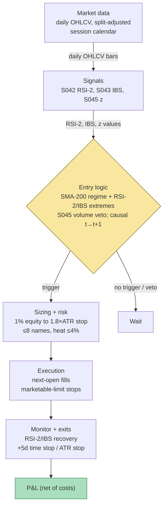

## Stage 113/200 — T013: RSI-2 / IBS Extreme Fade

*Batch TB2 · Strategy 13/100 · Signals S042, S043, S045*

### T1. One-line verdict

| Field | Verdict |
|---|---|
| **Style** | Daily mean-reversion on liquid ETFs: Connors-style oversold/overbought fade |
| **Edge source** | Short-horizon exhaustion — two-day panic/pullback selling (RSI-2) compounded by weak-close flow pressure (IBS) reverting as the next session absorbs it |
| **Typical holding period** | 1–5 trading days (`example`) |
| **Capacity hint** | High in ETFs (deep, liquid underlyings) but low per-trade expectancy — this is a high-win-rate, small-edge sleeve, not a wealth engine |
| **Build-or-buy in one line** | Build — Tier-0 daily bars suffice and the rules are public; buy nothing except optionally a point-in-time ETF history |

Provenance note: S042 (RSI/RSI-2) is `[D]` documented; S043 (IBS) is `[D]`; S045 (stretched-move z-score) is `[D/SR]`. The strategy's core is documented; the S045 veto role is a practitioner-standard reconstruction.

### T2. Full mechanics

**Universe & session.** Liquid equity ETFs (SPY/QQQ/IWM/EEM-class and liquid country/sector ETFs): dollar volume ≥ $20M/day (`example`), price ≥ $20 (`example`). Daily bars, split/dividend-adjusted; entries at the next open after the signal close. Exclusions (`example`): leveraged/inverse ETFs (their daily-reset math breaks multi-day holds), ETFs with distributions pending, and any name whose volume that day is < 0.8× its 20-day median (Pagonidis 2014 documents the IBS effect vanishing on low-volume US ETF days — see T7).

**Entry rule.** All three signals combine:

1. **Regime filter (S042's documented companion):** longs only when close > 200-day simple moving average (SMA — the arithmetic mean of the last 200 closes); shorts only when close < 200-SMA (`example`). This is the Connors (2008) documented form — it keeps the fade aligned with the slow trend.
2. **S042 trigger:** RSI-2 (2-period Relative Strength Index: $100 \times \bar{G}_2/(\bar{G}_2+\bar{L}_2)$, the S042 simple-mean definition) < 8 for longs (`example`), > 92 for shorts (`example`).
3. **S043 confirmation:** IBS (Internal Bar Strength: $(C-L)/(H-L)$, where the bar sits in its own range) < 0.15 for longs (`example`), > 0.85 for shorts (`example`) — the close must be *at* the extreme of the day's range, not merely a down day.
4. **S045 exhaustion veto:** skip if the 20-bar rolling price z-score ($z = (C-\mu_{20})/\sigma_{20}$) exceeds `example` ±3.0 *on expanding volume* — that is information/repricing, not exhaustion. A stretched move with volume confirmation is a veto, not a setup.

**Causal timing:** RSI-2, IBS, and the z-score are computed on the closed bar *t* (closes ≤ *t* only); the earliest fill is bar *t+1*'s open. Filling at bar *t*'s close is one bar of lookahead — the classic backtest cheat for this family.

**Exit rule.** First of: (i) RSI-2 > 65 (longs) or < 35 (shorts) (`example`) — the documented Connors recovery exit; (ii) IBS > 0.70 (longs) / < 0.30 (shorts) (`example`) — the close has normalized; (iii) time stop `example` +5 trading days; (iv) hard stop at entry ± `example` 1.8×ATR(10) (ATR = Average True Range). Note the deliberate departure: Connors' published original often runs *without* a stop; this strategy adds one, because the no-stop left tail (Oct 2008, Aug 2011 — see T7) is unacceptable in a rules-based book.

**Position sizing.** Risk `example` 1.0% of equity to the stop: shares = (0.01 × equity) / (1.8 × ATR10). Max `example` 8 concurrent names; no adding to losers; portfolio heat (total $ risked to stops) ≤ `example` 4% of equity.

**Risk limits.** Daily loss stop `example` −2% of equity; weekly −4% (`example`) — the strategy clumps losers in waterfalls, so the weekly stop matters more than the daily one. Kill-switch: indicator inputs stale or corporate-action feed unrefreshed → no new entries; existing positions governed by their stops.

**Cost model** (`example`): liquid-ETF half-spread ≈ 0.5 bp/leg + fees ≈ $0.001/share + slippage/impact ≈ 2 bp round trip. On a $100 ETF with 700 shares the round trip is ≈ $15–30 — small, which is why the strategy *must* live in liquid ETFs: the same rules on single names pay 5–10× the spread.

**Order/execution sketch.** Market-on-open or limit-at-open for entries (the signal is a close-based fact; the open is the first tradable price); exits on the recovery trigger at the next open, stops as marketable limits. No intraday management — this is a close-to-close system with open fills.

### T3. Signals it consumes

| Signal | Role | Weight / logic |
|---|---|---|
| S042 RSI-2 | Primary trigger (exhaustion) | Long: RSI-2 < 8; short: RSI-2 > 92 (`example`); requires the SMA-200 regime gate |
| S043 IBS | Confirmation (close quality) | Long: IBS < 0.15; short: IBS > 0.85 (`example`) — the extreme close must coincide with the RSI-2 extreme |
| S045 stretched-move z | Exhaustion veto | Skip when \|20-bar z\| > 3.0 with expanding volume (`example`) — stretched + volume = information, not fade |

Combination logic (pseudocode, ≤25 lines):

```
for each liquid ETF:                                    # $vol>=20M, price>=20 (example)
    r2  = RSI2(close, 2)                                # S042: 100*G2/(G2+L2)
    ibs = (close-low)/(high-low)                        # S043
    z20 = (close - mean20)/std20                        # S045 rolling z
    if volume < 0.8*vol_median20: continue              # IBS vanishes here
    if abs(z20) > 3.0 and volume_expanding: continue    # S045 veto (example)
    if close > SMA200 and r2 < 8 and ibs < 0.15:        # example thresholds
        side = LONG
    elif close < SMA200 and r2 > 92 and ibs > 0.85:
        side = SHORT
    else: continue
    enter next open; stop = entry -/+ 1.8*ATR10         # example
    shares = 0.01*equity / (1.8*ATR10)
    exit at next open when r2 > 65 (long) / < 35 (short) # example
       or ibs > 0.70 / < 0.30 or +5 days or stop
    limits: <=8 names, heat <=4%, weekly stop -4%       # example
```

### T4. Worked example — numbers + P&L (SYNTHETIC)

All numbers below are **synthetic** — three hand-specified daily-ETF tapes on fictional ETFs, with `numpy.random.default_rng(113)` (**seed 113**) reserved for chart jitter only; RSI-2 and IBS are computed exactly per the S042/S043 definitions and the trigger assertions pass in the plot script. The chart `images/T013_example.png` plots exactly these tapes, entry/exit prices, and per-trade net P&L. Not a backtest: the 200-SMA regime gate and ATR10 are stipulated (the tapes are too short to compute them), fills are at the synthetic opens, stops are honored exactly.

Cost schedule (`example`): 2 bp round-trip spread/impact allowance on average notional + commission $0.005/share + $0.50/ticket per side. Equity $200,000; risk per trade 1.0% = $2,000.

**Trade 1 — long fade, winner.** Tape closes: 100.00, 99.20, **97.90**, 98.40, 99.60, 100.80, 101.50, 102.10. Signal day D3 (close 97.90): RSI-2 = 0.0 (< 8 ✓); bar O 99.10 / H 99.40 / L 97.70 / C 97.90 → IBS = 0.20/1.70 = **0.1176** (< 0.15 ✓); stipulate close > 200-SMA. **Buy 694 shares at D4 open, $98.10.** Sizing: ATR10 = 1.60 (`example`); stop = 98.10 − 1.8×1.60 = **95.22**; risk/share = 2.88 → 2,000/2.88 = 694.4 → **694 shares**. Exit: D5 closes 99.60 with RSI-2 = 100 (> 65 ✓) → **sell at D6 open, $100.50**.

| Step | Detail | Cash flow |
|---|---|---|
| Entry | 694 × $98.10 | −$68,081.40 |
| Commission in | 694×$0.005 + $0.50 | −$3.97 |
| Exit | 694 × $100.50 | +$69,747.00 |
| Commission out | 694×$0.005 + $0.50 | −$3.97 |
| Spread/impact (2 bp RT) | — | −$13.78 |
| **Gross** | 694 × $2.40 | **+$1,665.60** |
| **Net P&L** | | **+$1,643.88** |

**Trade 2 — long fade, waterfall loser (the honest trade).** Tape closes: 200.00, 198.50, **196.00**, 194.50, 192.00, 190.00, 189.00. Signal day D3 (close 196.00): RSI-2 = 0.0 ✓; bar O 198.40 / H 198.60 / L 195.80 / C 196.00 → IBS = 0.20/2.80 = **0.0714** ✓; stipulate close > 200-SMA. **Buy 529 shares at D4 open, $195.70.** Sizing: ATR10 = 2.10 (`example`); stop = 195.70 − 1.8×2.10 = **191.92**; risk/share = 3.78 → 2,000/3.78 = 529.1 → **529 shares**. The waterfall continues; D6 opens at 191.90, below the stop → **sell at $191.88** (synthetic stop fill).

| Step | Detail | Cash flow |
|---|---|---|
| Entry | 529 × $195.70 | −$103,525.30 |
| Commission in | 529×$0.005 + $0.50 | −$3.15 |
| Exit (stop) | 529 × $191.88 | +$101,504.52 |
| Commission out | — | −$3.15 |
| Spread/impact (2 bp RT) | — | −$20.50 |
| **Gross** | 529 × −$3.82 | **−$2,020.78** |
| **Net P&L** | | **−$2,047.57** |

**Trade 3 — short overbought fade, winner.** Tape closes: 150.00, 152.00, 154.50, **156.00**, 155.00, 153.50, 152.00. Signal day D4 (close 156.00): RSI-2 = 100.0 (> 92 ✓); bar O 154.40 / H 156.20 / L 154.20 / C 156.00 → IBS = 1.80/2.00 = **0.9000** (> 0.85 ✓); stipulate close < 200-SMA. **Short 740 shares at D5 open, $154.90.** Sizing: ATR10 = 1.50 (`example`); stop = 154.90 + 1.8×1.50 = **157.60**; risk/share = 2.70 → 2,000/2.70 = 740.7 → **740 shares**. Exit: D6 closes 153.50 with RSI-2 = 0.0 (< 35 ✓) → **cover at D7 open, $151.90**.

| Step | Detail | Cash flow |
|---|---|---|
| Entry (short) | 740 × $154.90 | +$114,626.00 |
| Commission in | — | −$4.20 |
| Exit (cover) | 740 × $151.90 | −$112,406.00 |
| Commission out | — | −$4.20 |
| Spread/impact (2 bp RT) | — | −$22.70 |
| **Gross** | 740 × $3.00 | **+$2,220.00** |
| **Net P&L** | | **+$2,188.90** |

Book total: +$1,643.88 − $2,047.57 + $2,188.90 = **+$1,785.21** net (cumulative: +$1,643.88, −$403.69, +$1,785.21 — the chart's staircase).


**Where the example is optimistic.** (1) Fills at the synthetic next opens with zero slippage; real opens gap against overnight signals, and the stop fill at $191.88 assumes no gap through the stop. (2) The 200-SMA regime gate and ATR10 are stipulated, not computed — on a real tape the gate binds exactly when you most want the trade (crashes), and ATR understates gap risk. (3) No partial fills, no borrow cost on the short (assumed easy-to-borrow ETF). (4) The tapes are constructed so two of three signals work; trade 2 is deliberately included to show the failure shape, but one toy waterfall understates how losers *clump* — in 2008-style tapes every name triggers at once. (5) The 2 bp cost stack is the SPY-class case; smaller ETFs cost 3–5× more.

### T5. Data & infra — what must run

**Pipeline inventory.** Nightly (post-close): pull split-adjusted daily OHLCV (Tier 0–1), corporate-action check, compute RSI-2 / IBS / 20-bar z / SMA-200 / ATR10 per name, apply volume and S045 vetoes, generate next-open orders. Morning: confirm opens, place entries; manage working stops. Post-close: fill reconciliation, per-trade attribution (RSI-2 bucket × IBS bucket — the Pagonidis grid), regime-gate log.

**Feeds.** Daily OHLCV split-adjusted (Tier 0: Stooq; Tier 1: Polygon); session calendar (half-days, holidays); corporate actions. No intraday feed required — this is the cheapest strategy in TB2 to feed.

**M5 Max feasibility: trivial** for the daily form (Tier L, `notes/cost-model.md` §2/§3/§5). The nightly screen over 3,000 ETFs/stocks × 10 y of daily bars (60M rows) is seconds in polars (§2). RAM: the daily panel ≈ 2–5 GB (§3) — far inside the 77 GB budget; 60 days of signals ≈ one float per name. Engineering band: **4–12 h** (~$600–1,800 at $150/hr loaded-cost estimate, §5) for the screen + order generation; +15 h for a production scheduler. Bottleneck: none computationally — the binding constraint is corporate-action correctness (a bad split adjustment injects a false RSI-2 = 0). What breaks first at 500 symbols: nothing local; at 3,000 names the PIT (point-in-time — as-known-at-the-time, no future information) ETF history join is the work, not the math.

**Feed-outage safe mode.** If the corporate-action feed is stale: no new entries (a split masquerading as a −50% "crash" is the classic false RSI-2 = 0). If daily bars are missing for a name (halt): skip — never interpolate a bar into the 2-period window. Existing positions are governed by their stops, which are held as real orders, not intentions. The strategy degrades to "manage existing, take nothing new" — the correct posture for a close-based system.

### T6. Buy vs build

| Option | What you get | Indicative price | Gains | Loses |
|---|---|---|---|---|
| Tier-0: Stooq daily bars | Free split-adjusted daily OHLCV | ~$0, indicative — verify before budgeting | Zero-cost honest research | Survivorship/delisting caveats; no PIT guarantees |
| Tier-1: Polygon Stocks Advanced | Daily + 1-min, adjustments, corporate actions | ~$30–200/mo, indicative — verify before budgeting | Cleaner adjustments; deeper history | Overkill for a daily-close system |
| Tier-1: Norgate US Platinum | PIT universe, delisteds, index members | ~$630/yr, indicative — verify before budgeting | Survivorship-safe backtests | Cost for a strategy that trades 20 ETFs |
| Research platform: QuantConnect cloud | Backtest + some data included | indicative — verify before budgeting | Fastest first backtest | You still own live execution |

**Verdict: build, and barely buy.** This is the rare strategy where Tier-0 data is genuinely adequate for research — the rules are public, the math is 20 lines, and the edge (if any) is in the vetoes and the cost discipline, not the feed. Buy Norgate only if you backtest a broad universe where survivorship bias would flatter the results. Crossover: the moment you port the rules intraday (5-min RSI-2), you leave the documented evidence behind (Grok Q-TB2-3) — that port needs Tier-1/2 data and its own validation.

### T7. Success-ratio evidence

| Source | Market & period | Metric | Before/after cost | Caveat |
|---|---|---|---|---|
| Connors (2008), *Short Term Trading Strategies That Work* | US index/ETFs | RSI-2 < 5–10 with price > 200-SMA; exit on recovery; often no stop. High win rate, small average win | **Before cost** (published rules) | Practitioner book, not peer review; the no-stop original carries the full left tail |
| Pagonidis (2014), "The IBS Effect" (NAAIM) | Equity ETFs, inception–2013 | Avg next-day return **+0.35%** when IBS < 0.20 vs **−0.13%** when IBS > 0.80; threshold behavior near 0.4/0.9; stronger in high vol and bear markets; vanishes on low-volume US ETF days | **Before cost** | Verified via the NAAIM abstract 2026-09-10; the "30%+ p.a. alpha" figure is before transaction costs |
| Kakushadze & Serur (2018), §4.4 | — | Documents the IBS cross-sectional rank construction | Method | Confirms the form, not the P&L |
| Wilder (1978) | — | RSI original | Method | RSI-2 is the practitioner's 2-period port, not Wilder's 14-period |
| Grok-reported replications (Q-TB2-3) | SPY/QQQ RSI-2 variants | Max DD ≈ −15.7% in 5 days (Oct 2008); R3-family max DD ≈ −16% (Aug 2011); walk-forward 17.8% CAGR mostly pre-2008; IBS win rates 68–76% with DD −13% to −26% | Mixed/before cost | All `unverified chatbot claims` — directionally consistent with the no-stop tail, not citable |

Regimes where it fails: multi-day waterfalls (2008, 2011, Feb 2018, Mar 2020) — the no-stop original's left tail, hence this strategy's ATR stop; trend years (2013–19, 2021, 2023–24) — few RSI-2 < 8 events, so the "failure" is opportunity cost vs buy-and-hold; intraday ports on single stocks — bounce contamination, not the published test (Grok Q-TB2-3). Documented decay: post-2008 replications weaker vs benchmark (unverified leads), consistent with publication decay.

**Honest bottom line.** For a ≤$1M paper operation: a legitimate small sleeve — high win rate, low CAGR, 10–20% drawdowns, high time-in-cash. With the ATR stop added (unlike Connors' original), it is a defensible research system: cheap to build, cheap to run, and the failure mode is boredom (few triggers in trend years) rather than ruin. Size it as a sleeve — 10–20% of a paper book — never the engine. For an institutional desk: one mean-reversion sleeve among many; capacity is large in ETFs but expectancy per trade is small, so it earns its place only with ruthless cost control and the volume/S045 vetoes enforced. Nobody runs RSI-2 as a standalone fund.

### T8. Failure modes

1. **Waterfall / no-stop tail.** The Connors original accepts multi-day crashes without a stop; Oct-2008-style tapes trigger repeatedly into the decline. *Mitigation:* the 1.8×ATR hard stop (a deliberate departure from the original); the weekly −4% stop stands the book down when losers clump.
2. **Trend-regime opportunity cost.** In grinding bull years the setup rarely fires; the strategy underperforms buy-and-hold by simply not participating. *Mitigation:* size as a sleeve, not the book; report time-in-cash honestly.
3. **Bounce contamination on intraday ports.** Daily Connors rules on 5-min bars import the bid–ask bounce (Grok Q-TB2-3). *Mitigation:* do not port without re-validating on midpoints; the documented evidence is daily-only.
4. **Threshold overfit.** RSI-2 < 8 vs < 10, IBS < 0.15 vs < 0.20 are `example` choices. *Mitigation:* Pagonidis documents threshold *regions* (0.4/0.9), not lines — prefer wide gates; sensitivity sweep before trading.
5. **Corporate-action spikes.** A split injects a false −50% Δ and a synthetic RSI-2 = 0. *Mitigation:* split-adjusted inputs only; corporate-action freshness check gates new entries (T5 safe mode).
6. **Volume-filter breach.** The IBS edge disappears on low-volume US ETF days (Pagonidis). *Mitigation:* the 0.8× median-volume gate is a hard filter, not a suggestion.
7. **Overnight gap risk.** Entries at the open and multi-day holds wear gap risk the daily backtest smooths over. *Mitigation:* the ATR stop is sized for gaps; no adds into gap-downs; earnings-week veto optional (`example`).
8. **Publication decay / crowding.** Post-2008 replications are weaker (unverified leads). *Mitigation:* expect decay; re-validate the IBS bucket grid annually; the S045 veto is the margin that keeps the fade on exhaustion rather than on everyone's screen.

### T9. Visuals




### T10. Sources

**Checkable sources**

- Connors, L. (2008), *Short Term Trading Strategies That Work* (with C. Alvarez) — the documented RSI-2 < 10 / SMA-200 / recovery-exit rules this strategy ports.
- Connors, L. and Alvarez, C. (2009), *High Probability ETF Trading* — the ETF-specific Connors-family rules. Independent RSI-2 replication of the book's R3 strategy (explicit Connors & Alvarez attribution): https://www.tradingview.com/script/5CDSns2I-R3-ETF-Strategy/
- Pagonidis, A.S. (2014), "The IBS Effect: Mean Reversion in Equity ETFs," NAAIM Wagner Award. https://www.naaim.org/wp-content/uploads/2014/04/00V_Alexander_Pagonidis_The-IBS-Effect-Mean-Reversion-in-Equity-ETFs-1.pdf — +0.35% next-day when IBS < 0.20, −0.13% when IBS > 0.80; threshold regions; volume filter (verified via abstract 2026-09-10).
- Kakushadze, Z. and Serur, J.A. (2018), *151 Trading Strategies* (Palgrave Macmillan), §4.4 — the IBS cross-sectional construction. NOTE (2025): Springer lists this book as a RETRACTED BOOK; the citation is retained only for the construction reference and no claims rest on it.
- Wilder, J.W. (1978), *New Concepts in Technical Trading Systems* — the RSI original (14-period; RSI-2 is the practitioner's port). https://openlibrary.org/books/OL25090843M/New_concepts_in_technical_trading_systems

**Unverified leads** (chatbot-provided, not independently verified — do not cite as fact)

- Grok (Q-TB2-3, 2026-09-10): RSI-2 replication drawdowns (−15.7% Oct 2008; −16% Aug 2011 R3-family); "Holy Grail" walk-forward 17.8% CAGR pre-2008 concentration; IBS win rates 68–76% with −13% to −26% DD; intraday-port bounce warning — all `unverified chatbot claims`.
- Grok (Q-TB2-1, 2026-09-10): the 8/0.15 entry gates, 65/0.70 exits, 1.8×ATR stop, and the QQQ-like worked example — illustrative `example` thresholds.
- All vendor prices above are `indicative — verify before budgeting`.

*Source log: Grok answered Q-TB2-1..3 (2026-09-10); all claims independently verified or labeled unverified.*
