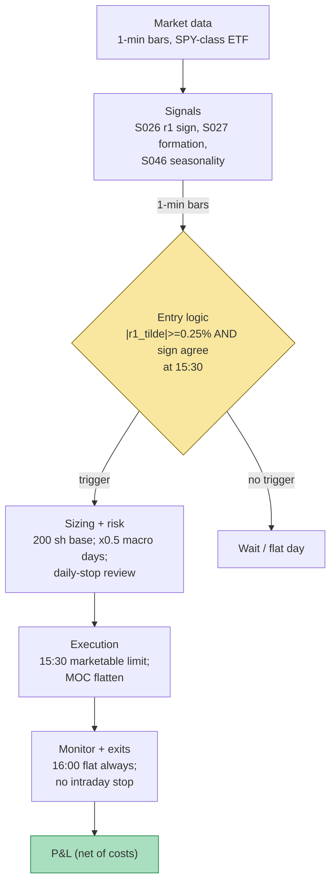

## Stage 115/200 — T015: First-Half-Hour → Close Continuation

*Batch TB2 · Strategy 15/100 · Signals S026, S027, S046*

### T1. One-line verdict

| | |
|---|---|
| **Style** | Intraday time-series momentum: hold the morning's winners into the last-half-hour drift |
| **Edge source** | The first half-hour's return predicts the last half-hour's return (S026, Gao et al. 2018); the day's own 9:30→15:30 drift must agree (S027 confirm); returns are deseasonalized and sized by the intraday vol profile, with event days throttled (S046) |
| **Typical holding period** | 30 minutes (enter 15:30, flat at the close) |
| **Capacity hint** | High per vehicle — one trade a day in SPY/QQQ-class ETFs; cross-sectional extension scales across liquid names but competes with institutional VWAP/MOC flow |
| **Build-or-buy in one line** | Build: a 15:30 clock, a sign rule, and a seasonal profile — any retail platform with minute bars suffices; buy only the data |

### T2. Full mechanics

**Universe & session.** One liquid vehicle in the base form: SPY (or QQQ; `example`). Cross-sectional extension: top-500 US equities by ADV, price ≥ $10 (`example`). RTH only. Exactly one window per day: enter 15:30 ET, flatten at the 16:00 close. No other entries — this is a *clock strategy*: no intraday monitoring, one decision, one exit.

**The signals in the strategy's own notation.** S026 (first half-hour → last half-hour momentum): with 13 half-hour buckets per day, r_{1,t} = P_{10:00}/P_{16:00,prior-day} − 1 (the first half-hour *including* the overnight return — Gao et al.'s exact formation) and r_{13,t} = the last half-hour return. The tradable form is the sign rule: s_t = sign(r̃_{1,t}), hold s_t from 15:30 to the close. S027 (end-of-day drift): r_{first,t} = P_{15:30}/P_{9:30} − 1 — the day's own drift into the entry; it must agree in sign with r̃_{1,t} or the day is flat. S046 (intraday seasonality): the U-shaped vol profile (Admati & Pfleiderer 1988 — wild at the open, dead at lunch, wild at the close) enters twice: (1) *deseasonalization* — r̃_{1,t} = r_{1,t} / σ̄(open bucket), where σ̄(b) is the mean absolute bucket return over the trailing 30 days (`example`), so a mechanically-volatile morning move isn't mistaken for information; (2) *event-day throttle* — on scheduled macro days (FOMC/CPI/NFP) the profile inverts, so size is halved (`example`; full stand-down is the stricter variant).

**Entry rule (long; short mirrors).** At 15:30, enter long if ALL hold: (i) |r̃_{1,t}| ≥ 0.25% (`example` — the deseasonalized morning impulse must be real, not open noise); (ii) sign(r_{first,t}) = sign(r̃_{1,t}) (`example` S027 confirm — the day's drift agrees with the morning impulse); (iii) S046 gate: not a full stand-down day; if a scheduled macro release occurred today, size is halved. **Causal timing:** r_{1,t} is known at 10:00; the seasonal profile uses days ≤ t−1 only; the order is eligible at 15:30 — five hours after the signal, which is why this strategy is nearly immune to microstructure lookahead traps.

**Position sizing.** Base 200 shares of a $500 ETF = $100,000 notional (`example`); × 0.5 on event days (S046 throttle). Cross-sectional extension: equal notional per qualifying name, capped at 20 names (`example`).

**Exit rule.** Flatten at the 16:00 close — MOC (market-on-close) or a 15:59:30 market order (`example`). No intraday stop-loss (a stop inside the last half hour is spread-donation), no profit target. The time stop *is* the strategy.

**Risk limits.** One position per vehicle per day; daily loss stop −$800 on the single-name book (`example`) — enforced ex post as a next-day review trigger, not an intraday exit (exiting early breaks the tested window). Event-day positions count double against the stop.

**Cost model.** 1¢/share all-in round-trip (`example`: ~0.5¢ commission + ~0.5¢ effective spread on SPY at 15:30, the tightest spread of the day). The conservative variant assumes the MOC print plus 1¢ adverse. No slippage beyond the close in the base case. Borrow n/a for the ETF (short SPY for a day is ~0 bps — stubbed at zero, verify).

**Execution sketch.** 15:30: marketable limit IOC for the share count. 15:59:30: closing-auction-eligible order for the full position — respect MOC/LOC cutoffs; you cannot exit "at the close" as a price-taker after 16:00. Participation is irrelevant at $100k in SPY's last half hour. Queue-position honesty: n/a at this granularity.

### T3. Signals it consumes

| Signal | Role | Weight / logic |
|---|---|---|
| S026 — First half-hour → last half-hour momentum | **Primary trigger** (direction) | sign of the S046-deseasonalized r̃_{1,t}; requires |r̃_{1,t}| ≥ 0.25% (`example`) |
| S027 — Open→15:30 formation drift | **Confirmation filter** | sign(r_{first,t}) must equal sign(r̃_{1,t}); disagreement → flat |
| S046 — Intraday seasonality | **Normalizer + throttle** | divides r_1 by the open-bucket seasonal factor; halves size on scheduled macro days (`example`) |

Combination pseudocode (≤25 lines):

```
# once per day at 15:30 (all inputs causal)
s_b   = seasonal_profile(open_bucket, trailing=30)  # S046, days <= t-1
r1    = log(P10:00 / Pclose_prev)                    # S026 formation
r1t   = r1 / s_b                                     # S046 deseasonalized
rfo   = P15:30 / P09:30 - 1                          # S027 formation drift
event = is_macro_day(t)                              # S046 throttle
if abs(r1t) < 0.0025: flat("no impulse")             # example gate
elif sign(rfo) != sign(r1t): flat("no confirm")      # S027 disagrees
else:
    shares = 200 // 2 if event else 200              # example: halve on event days
    buy/sell sign(r1t)*shares at 15:30; flatten MOC at 16:00
```

### T4. Worked example — numbers + P&L (SYNTHETIC)

Setup: SPY-class ETF at **$500.00**, base 200 shares ($100,000 notional), cost **$0.01/share round-trip** (`examples`). Five synthetic days, **seed 115** (`batches/TB2/plot_T015.py`):

| Day | r_1 raw | s (open bucket) | r̃_1 (S026/S046) | r_first (S027) | Decision | r_13 | Net P&L |
|---|---|---|---|---|---|---|---|
| 1 | +0.76% | 1.80 | +0.42% | +0.95% | LONG 200 | +0.28% | **+$278.00** |
| 2 | −0.63% | 1.80 | −0.35% | −0.80% | SHORT 200 | −0.22% | **+$218.00** |
| 3 | +0.18% | 1.80 | +0.10% | +0.20% | FLAT (below impulse) | +0.05% | $0.00 |
| 4 | +0.99% | 1.80 | +0.55% | +1.20% | LONG 100 (CPI day, halved) | −0.18% | **−$91.00** |
| 5 | −0.90% | 1.80 | −0.50% | +0.30% | FLAT (S027 disagrees) | −0.40% | $0.00 |
| **Total** | | | | | | | **+$405.00** |

Line-by-line walk, Day 1: 15:30 — buy 200 @ **$500.00** = $100,000.00. 16:00 — sell 200 @ **$501.40** ($500 × 1.0028) = $100,280.00. Gross +$280.00; cost 200 × $0.01 = −$2.00; **net +$278.00**. Day 2: short 200 @ $500.00, cover @ $498.90 → gross +$220.00 − $2.00 = **+$218.00**. Day 4 (CPI day, halved by the S046 throttle): long 100 @ $500.00, sell @ $499.10 → gross −$90.00 − $1.00 = **−$91.00**. Days 3 and 5: no position, $0. **Five-day total net: +$405.00.** The chart plots exactly this diary: formation-return bars colored by decision, the deseasonalized r̃_1 outline, and the cumulative net P&L stepping +278 → +496 → +496 → +405 → +405 with per-day annotations.

**Where the example is optimistic.** Five hand-built days, not a sample: two clean winners and — most flattering — Day 5's S027 confirm dodges a −$400 day by construction, and Day 4's halved loss makes the S046 throttle look wise. Real r_1/r_first sign disagreement is noisier, the seasonal profile σ̄(b) wobbles on regime changes, and the 1¢ all-in cost assumes SPY-class spreads — single-name extension pays multiples of that. The close is assumed filled at the print; the closing auction is where impatient flow pays the widest spread, and the documented spread warning (Heston et al. 2010) applies directly to this window.

### T5. Data & infra — what must run

**Pipeline inventory.** Nightly: 30-day seasonal profile σ̄(b) per 10-minute bucket (39 buckets — a groupby over 1-min bars). 10:00: r_1 is known — no action needed. 15:25 cron: fetch the macro calendar flag, compute r_first, deseasonalize, decide. 15:30: order. 16:00: flatten and ledger. That is the entire hot path — a cron job could run this.

**M5 Max feasibility: trivial (Tier L, ~12–20 h ≈ $1,800–3,000 loaded-cost estimate).** Per cost-model §2: one symbol × 390 one-min bars/day is nothing; the 30-day profile is a single groupby (~10–50M rows/sec in polars). Per §3: RAM < 200 MB, disk < 50 MB/day for the single vehicle; the 500-name extension is still ~12 MB/60 days. Bottleneck: none computationally — the risk is *model* risk (the seasonal profile going stale), not compute.

**Feed-outage safe-mode.** If 15:30 data is stale or the calendar job failed → the day is FLAT (no signal, no trade — the strategy defaults to doing nothing). If the 15:30 entry filled but the 16:00 flatten fails → flatten at the next available print and mark the day UNTRUSTED_FLAT; never carry overnight. Clock skew > 50 ms vs NTP → halt (the whole strategy is a clock). On macro days with a feed gap, the throttle defaults to full stand-down, not full size.

### T6. Buy vs build

| Option | What you get | Indicative price | Gains | Loses |
|---|---|---|---|---|
| Tier 0: Stooq / Alpaca IEX delayed | Daily + delayed minute bars | ~$0 | Free research on the r_1 → r_13 regression | No live 15:30 trigger |
| Tier 1: Polygon / Alpaca SIP | Real-time minute bars | ~$30–200/mo, indicative — verify before budgeting | Everything needed: r_1, r_first, seasonal profile | — |
| Retail: QuantConnect paper | Paper broker + minute data + scheduling | ~$60–300/mo, indicative — verify before budgeting | Clock-based scheduling is native; easiest paper host | Overkill — a cron job does this |
| Economic calendar: vendor or exchange feeds | FOMC/CPI/NFP schedule | ~$0–50/mo bundled, indicative — verify before budgeting | Powers the S046 throttle | Free calendars aren't point-in-time |

**Verdict: build; the "platform" is a cron job.** Nothing to buy beyond a minute-bar feed and a reliable macro calendar. Crossover: none — no vendor sells a better 15:30 clock. The real buy-vs-build question is the cross-sectional extension (500-symbol minute bars → Tier 1 feed, still cheap) and whether the seasonal profile should be estimated on your own fills (build) rather than bars (fine as-is).

### T7. Success-ratio evidence

| Study / source | Market & period | Metric | Before/after cost | Caveat |
|---|---|---|---|---|
| Gao, Han, Li & Zhou (2018), "Market intraday momentum," *J. Financial Economics* 129(2), 394–414 | SPY, 1993–2013 | r_13 = α + β·r_1 (r_1 from prior close): β̂ significant at 1%, R² = 1.6% | Before-cost (predictive regression) | R² is statistical, not tradable P&L; stronger on high-vol, high-volume, recession, and macro-news days |
| Same (SSRN working-paper version 2552752, via S026's chapter) | SPY, 1993–2013 | Sign(r_1) timing rule: ~6.67%/yr, Sharpe ~1.08 vs 0.29 buy-and-hold | Authors state gains persist after transaction costs | Working-paper figure — re-verify against the published JFE version before citing precisely |
| Heston, Korajczyk & Sadka (2010), *J. Finance* 65(4) | NYSE half-hour intervals, 2001–2005 | Continuation at day-multiple half-hour lags, strongest in the first and last half-hour | **After-cost (honest):** periodicity strategies "**lose money after paying the bid/ask spread**" | The continuation is a timing/cost phenomenon, not an arbitrage — the spread warning applies directly to the 15:30→close window |
| Chu, Gu & Zhou (2019), *Finance Research Letters* 30, 83–88 | Chinese stock market | First-half-hour intraday momentum confirmed — but "the presence of costs prevents arbitrageur's intervention" | After-cost aware | Independent-market confirmation with the same cost caveat |
| Admati & Pfleiderer (1988), *R. Financial Studies* 1(1) | Theory | U-shaped intraday volume/volatility from concentrated informed trading | n/a (mechanism) | Supports the S046 deseasonalization premise, not the trade |

The S046 throttle has no standalone performance evidence — it is risk hygiene borrowed from the seasonality literature, not an alpha source. **Bottom line for ≤$1M paper:** the Gao effect is real but small (R² 1.6%); it is one of the few intraday patterns whose authors claim post-cost survival, yet Heston et al.'s spread warning is the counterweight that decides the matter. Paper-trade SPY for a quarter and measure your *realized* 15:30→close spread before believing any backtest — the strategy's edge is thinner than its confidence interval. An institutional desk would run this as a timing sleeve inside a larger intraday book, never standalone.

### T8. Failure modes

1. **The spread eats the drift.** Last-half-hour returns are small; the closing-auction effective spread is the whole edge. *Mitigation:* SPY/QQQ-class vehicles only; measure realized vs assumed 1¢ weekly; kill the strategy if realized cost > 2¢/share sustained.
2. **Sign disagreement regimes.** r̃_1 and r_first disagree most on reversal days — exactly when the drift fails. *Mitigation:* the S027 confirm already filters these; log the disagreement rate as a health metric (a rising rate = regime change).
3. **Stale seasonal profile.** σ̄(b) estimated on 30 calm days mislabels the open bucket on a regime break — r̃_1 looks "significant" when it is just a vol day. *Mitigation:* re-estimate nightly; the event-day throttle is the backstop; drop to a 10-day profile (`example`) if the market's vol regime shifts.
4. **Macro-day misbehavior.** FOMC/CPI days: the 15:30 "drift" is announcement digestion, and the seasonal profile (fit on normal days) is wrong. *Mitigation:* the S046 halve/stand-down — S034 territory, not this strategy's; never full-size a macro day.
5. **Publication decay.** Gao et al. is 2018; intraday momentum is widely known and partially arbitraged (gamma-hedging mechanisms are documented — known mechanisms get traded). *Mitigation:* re-estimate β̂ on rolling 2-year windows; if it goes insignificant, the strategy is off.
6. **Single-window concentration.** All risk sits in 15:30–16:00; one 15:45 headline wipes weeks of harvesting. *Mitigation:* the daily loss stop and the macro-day throttle are the only defenses — size so one bad close is a bad day, not a bad month.
7. **Deseasonalization overfitting.** Dividing by σ̄(b) can manufacture "significance" from a noisy profile, especially in the 500-name extension where some buckets have thin data. *Mitigation:* floor the seasonal factor (never divide by less than the median bucket factor, `example`); the raw r_1 sign must agree with the deseasonalized sign or the day is flat.

### T9. Visuals




### T10. Sources

1. Gao, L., Han, Y., Li, S. Z. & Zhou, G. (2018). "Market intraday momentum." *Journal of Financial Economics* 129(2), 394–414. DOI: 10.1016/j.jfineco.2018.05.009. https://ideas.repec.org/a/eee/jfinec/v129y2018i2p394-414.html (First-half-hour from prior close predicts last-half-hour; stronger on volatile/high-volume/recession/macro-news days.)
2. Heston, S. L., Korajczyk, R. A. & Sadka, R. (2010). "Intraday Patterns in the Cross-Section of Stock Returns." *Journal of Finance* 65(4), 1369–1407. https://bauer.uh.edu/departments/finance/documents/Heston-Korajczyk-Sadka-jf-2010-01-07.pdf (Half-hour periodicity; the spread warning.)
3. Admati, A. R. & Pfleiderer, P. (1988). "A theory of intraday patterns: Volume and price variability." *Review of Financial Studies* 1(1), 3–40. (U-shaped intraday volume/volatility — the S046 premise.)
4. Chu, X., Gu, Z. & Zhou, H. (2019). "Intraday momentum and reversal in Chinese stock market." *Finance Research Letters* 30, 83–88. DOI: 10.1016/j.frl.2019.04.002. (Independent-market confirmation; costs prevent arbitrage.)

**Unverified leads:** the ~6.67%/yr / Sharpe ~1.08 timing-rule figures are from the SSRN working-paper version (SSRN 2552752) via S026's chapter — re-verify against the published JFE version before citing precisely; Grok's Q-TB2-3 closability notes (capacity is flow-timed; you race institutional VWAP/MOC) — qualitative research lead, not a measured fact; all thresholds and the worked example are the author's synthetic construction.

*Source log: Grok answered Q-TB2-1..3 (2026-09-10); all claims independently verified or labeled unverified.*

Related: T006 (Intraday Trend + Vol-Regime Allocator) is the TB1 sibling that trades the same 15:30→close window with an HMM regime gate instead of the S046 seasonal throttle.
