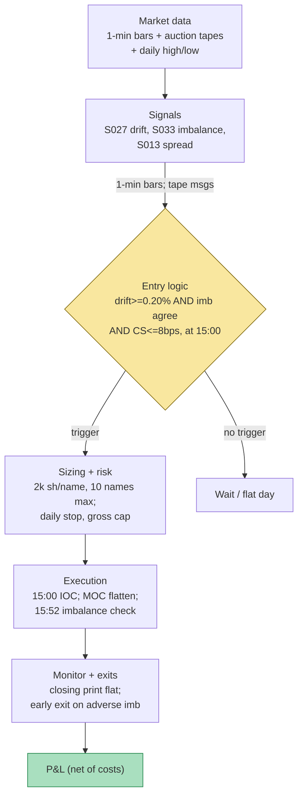

## Stage 116/200 — T016: End-of-Day Drift Rider

*Batch TB2 · Strategy 16/100 · Signals S027, S033, S013*

### T1. One-line verdict

| | |
|---|---|
| **Style** | Last-hour drift continuation with institutional-flow confirmation |
| **Edge source** | The day's 9:30→15:00 drift persists into the close (S027); the morning opening-auction imbalance must point the same way (S033 — institutional flow was leaning with the drift); the Corwin–Schultz spread estimate must be below the edge (S013 cost gate) |
| **Typical holding period** | ~1 hour (enter 15:00, flat at the closing print) |
| **Capacity hint** | Medium — liquid large-caps, one trade per name per day; the edge is a few bps, so it scales with breadth, not size per name |
| **Build-or-buy in one line** | Build the drift logic; buy the auction-imbalance feed — replaying NOII-style message tapes is not a garage project |

### T2. Full mechanics

**Universe & session.** Liquid US large-caps: price ≥ $20, ADV ≥ 5M shares, NYSE/Nasdaq-listed with published auction imbalance feeds (`examples`). RTH only. One window: enter 15:00 ET, flatten at the 16:00 closing print via the closing auction. Exclude earnings-day sessions, index-rebalance days, and quadruple-witching (auction dynamics are abnormal).

**The signals in the strategy's own notation.** S027 (end-of-day drift): r_{first,t} = P_{15:00,t}/P_{9:30,t} − 1 — the day's drift into the entry; the position direction is s_t = sign(r_{first,t}). S033 (open-auction imbalance): from the pre-open NOII-style message tape (NOII — Net Order Imbalance Indicator: the exchange's published auction messages), extract the final imbalance ratio ρ_final = |I_final|/Q^{paired}_{final} (how much of the cross is one-sided) and indicative displacement d_final = (P^{ind}_{final} − P^{ref})/P^{ref} (how far the clearing price sits from the reference). Confirmation requires ρ_final ≥ 15% and |d_final| ≥ 20 bps (`examples`), and — critically — sign(I_final) = sign(r_{first,t}): the institutional flow revealed at the open was leaning *with* the day's drift. S013 (Corwin–Schultz spread estimator): from daily highs/lows, S_t = 2(e^{α_t} − 1)/(1 + e^{α_t}) with α_t from the two-day β_t/γ_t construction; the 20-day mean of S_t^+ (floored at zero), ×10,000 for basis points, must be ≤ 8 bps (`example`) — otherwise the expected drift is smaller than the round-trip spread and the day is flat.

**Entry rule (long; short mirrors).** At 15:00, enter long only if ALL hold: (i) |r_{first,t}| ≥ 0.20% (`example` — the drift must be material); (ii) S033 confirm: ρ_final ≥ 15%, |d_final| ≥ 20 bps, sign(I_final) = +1 = sign(r_{first,t}) (`examples`); (iii) S013 gate: 20-day mean CS spread ≤ 8 bps (`example`). **Causal timing:** r_{first,t} uses prices ≤ 15:00; the auction tape is replayed as a message *sequence* — only messages with exchange timestamps ≤ 9:30 enter the read (S033's cardinal rule: using the final published imbalance to justify trades placed before dissemination is look-ahead bias); the CS estimate uses daily bars through t−1. Earliest fill: 15:00.

**Exit rule.** Flatten at the closing print — MOC order submitted before the cutoff (`example` 15:55 for most names). Early exit: if the developing *closing*-auction imbalance (published from ~15:50) shows ≥ 25% paired volume against the position (`example`), flatten at 15:55 instead of riding into the print. No intraday stop (the hold is one hour); the cost gate and the confirm are the risk controls.

**Position sizing.** 2,000 shares per name (`example`, ~$200k notional at $100); max 10 names per day (`example`); no name may exceed 15% of the day's gross (`example`).

**Risk limits.** Daily loss stop −$1,500 (`example`); max gross exposure $2M (`example`); kill switch: two consecutive days where the CS gate passed but realized effective spread exceeded the estimate by > 50% → the estimator is miscalibrated, halt and recheck.

**Cost model.** Half-spread 1.5¢/share/side + commission $0.005/share + $0.50/ticket (`examples`) = $81 round-trip on 2,000 shares. Slippage: +0.5¢/share on the MOC leg (`example` — the closing print can slip against you when the imbalance is one-sided). Borrow stubbed at ~0 intraday (verify).

**Execution sketch.** 15:00: marketable limit IOC for the full size. 15:55: MOC order for the full position. The closing-auction-imbalance early-exit check runs at 15:52 on the live imbalance feed. Queue-position honesty: the auction fills are at the clearing price — model them as print ± 0.5¢ adverse, never as mid.

### T3. Signals it consumes

| Signal | Role | Weight / logic |
|---|---|---|
| S027 — Open→15:00 formation drift | **Primary trigger** (direction) | s_t = sign(r_{first,t}); requires |r_{first,t}| ≥ 0.20% (`example`) |
| S033 — Open-auction imbalance | **Confirmation filter** | sign(I_final) must equal sign(r_{first,t}); ρ_final ≥ 15%, |d_final| ≥ 20 bps (`examples`); message-sequence replay, no look-ahead |
| S013 — Corwin–Schultz spread | **Cost gate (veto)** | 20-day mean S_t^+ ≤ 8 bps (`example`); above → flat regardless of the other two |

Combination pseudocode (≤25 lines):

```
# per name, per day (all inputs causal)
r_first = P15:00 / P09:30 - 1                          # S027
I, rho, d = replay_auction_tape(msgs[t] for t<=09:30)   # S033, final values
cs = mean(corwin_schultz(HL[t-20:t])) * 1e4             # S013, bps
if abs(r_first) < 0.002: flat("no drift")              # example
elif sign(I) != sign(r_first): flat("flow disagrees")  # S033 confirm
elif rho < 0.15 or abs(d) < 20: flat("weak imbalance")  # examples
elif cs > 8.0: flat("spread > edge")                   # S013 veto
else:
    buy/sell sign(r_first)*2000 at 15:00               # example size
    if close_imbalance_against(15:52): flatten 15:55
    else: flatten MOC at 16:00
```

### T4. Worked example — numbers + P&L (SYNTHETIC)

Setup: stock SYN at **$100.00** (synthetic prices — not market data), **2,000 shares** per trade, cost **$81.00/trade** round-trip (half-spread 2 × $30.00 + commission 2 × $10.50 — `examples`). Four synthetic days, **seed 116** (`batches/TB2/plot_T016.py`):

| Day | r_first (S027) | Auction read (S033) | CS 20-d (S013) | Decision | r_last | Net P&L |
|---|---|---|---|---|---|---|
| 1 | +0.45% | BUY, ρ = 22%, d = +35 bps | 4.2 bps | LONG 2,000 | +0.20% | **+$319.00** |
| 2 | −0.30% | SELL, ρ = 18%, d = −28 bps | 5.1 bps | SHORT 2,000 | −0.15% | **+$219.00** |
| 3 | +0.25% | SELL, ρ = 16%, d = −22 bps | 4.8 bps | FLAT (flow disagrees) | +0.10% | $0.00 |
| 4 | +0.60% | BUY, ρ = 25%, d = +40 bps | 9.5 bps | FLAT (spread > edge) | −0.25% | $0.00 |
| **Total** | | | | | | **+$538.00** |

Line-by-line walk, Day 1: 15:00 — buy 2,000 @ **$100.00** = $200,000.00. MOC — sell 2,000 @ **$100.20** ($100 × 1.002) = $200,400.00. Gross +$400.00; half-spread −$60.00; commission −$21.00; **net +$319.00**. Day 2: short 2,000 @ $100.00, cover @ $99.85 → gross +$300.00 − $81.00 = **+$219.00**. Day 3: the drift says long but the morning auction flow was SELL — flat, $0 (the drift then only managed +0.10%, a spread-eater). Day 4: everything aligned except the CS gate — 9.5 bps > 8 bps, flat, $0 (the −0.25% reversal would have cost −$581). **Four-day total net: +$538.00.** The chart plots this diary: formation bars with the auction-direction annotation and CS reading per day, and the cumulative net P&L stepping +319 → +538 → +538 → +538.

**Where the example is optimistic.** Four hand-built days where both gates behave like textbook illustrations — Day 3's disagreement and Day 4's veto both "save" money by construction. Real auction tapes flicker: ρ_final and d_final are revised by cancellations in the last 90 seconds, and the 15:00 drift can be 50% opening-auction artifact rather than information. The MOC fill is assumed at the print with 0.5¢ adverse — on a one-sided close the print can be several cents against you. And the CS gate uses a 20-day *mean* estimate: on the day you need it most (a vol event), the true spread is wider than the estimate — which is why Day 4 exists in the example, but real gate failures are subtler.

### T5. Data & infra — what must run

**Pipeline inventory.** Pre-open: ingest the auction imbalance message tape per name (timestamped NOII-equivalent messages), replay to the final read — this is the only exotic feed. Intraday: 1-min bars for r_first; daily: high/low history for the CS estimator (20-day mean per name). 15:52: live closing-imbalance check. Post-close: ledger, realized-spread vs CS-estimate reconciliation (the kill-switch input).

**M5 Max feasibility: feasible (Tier M, ~30–60 h ≈ $4,500–9,000 loaded-cost estimate).** Per cost-model §2: 1-min bars for 500 names = 195k bars/day — trivial; the CS estimator is daily arithmetic on 20 bars per name. Per §3: all of it fits in < 1 GB RAM. The imbalance tape is the constraint: per §4, quote-class data runs ~2–8 GB/symbol-day in parquet — store only the auction windows (pre-open + 15:50–16:00), not the full day, or the disk budget explodes. Bottleneck: feed licensing and message-replay correctness, not compute. **Do not** try to reconstruct imbalance from bar data — that is the look-ahead trap S033 warns about.

**Feed-outage safe-mode.** If the pre-open tape is missing or has a gap in the final 90 seconds → the S033 confirm is VOID for the day (flat — never confirm on a partial tape). If 15:00 bars are stale → flat. If the 15:52 closing-imbalance feed drops → flatten at 15:55 market regardless (never ride into the print blind). A filled 15:00 entry with a failed MOC submission → flatten at the next print, mark UNTRUSTED_FLAT.

### T6. Buy vs build

| Option | What you get | Indicative price | Gains | Loses |
|---|---|---|---|---|
| Tier 1: Polygon Stocks Advanced (bars) | 1-min bars + daily HL for CS | ~$30–200/mo, indicative — verify before budgeting | Drift + spread estimator covered | No auction tape |
| Auction imbalance feed (exchange direct or consolidated vendor) | NOII-equivalent message tape | indicative — verify before budgeting (vendor-quoted, often $100s–$1,000s/mo for professional use) | The S033 confirm — the strategy's differentiator | The most expensive line item; redistribution terms vary |
| Tier 2: Databento Standard | L1 + imbalance-adjacent feeds | ~$200/mo + usage, indicative — verify before budgeting | Clean timestamps for replay | May not carry every venue's auction feed |
| Retail platform: QuantConnect paper | Paper broker + minute data | ~$60–300/mo, indicative — verify before budgeting | Fastest paper host | No auction imbalance tape — the confirm must be built anyway |

**Verdict: hybrid — buy the bars, buy the imbalance feed, build the logic.** The message-replay discipline (what was known at t?) is the entire product and cannot be bought. Crossover: if the imbalance feed costs more than ~$500/mo and you trade ≤ 10 names, drop S033 and run the S027+S013 two-leg version — the confirm is a filter, and an expensive filter must earn its keep.

### T7. Success-ratio evidence

| Study / source | Market & period | Metric | Before/after cost | Caveat |
|---|---|---|---|---|
| Heston, Korajczyk & Sadka (2010), *J. Finance* 65(4) | NYSE half-hour intervals, 2001–2005 | Return continuation at day-multiple half-hour lags, strongest in the first and last half-hour | **After-cost (honest):** periodicity strategies "**lose money after paying the bid/ask spread**" | Directly governs this window: the drift is real, the spread is the trade |
| Bogousslavsky (2021), "The Cross-Section of Intraday and Overnight Returns," *J. Financial Economics* 141(1), 172–194 | US stocks, 30-year sample | Size and illiquidity premia are realized in the **last 30 minutes**; a mispricing factor earns positive returns through the day but performs poorly into the close; pattern strengthens in the second half of the sample | Before-cost (factor returns) | Cross-sectional evidence — the drift exists, but it is compensation for providing liquidity into the close, not free alpha |
| Corwin & Schultz (2012), *J. Finance* 67(2) | US equities | High-low spread estimator; a Brazilian-market replication (via S013's chapter) reports ≈ 0.9 correlation with true spreads | Estimator validation | The CS gate is only as good as the estimator — 0.9 correlation still leaves wide residual error on event days |
| Challet & Gourianov (2018), arXiv:1802.01921 | US equities opening/closing auctions | Dynamical regularities of auction price formation | Descriptive | Supports reading auction tapes as informative, not the profitability of trading them |
| Biais, Hillion & Spatt (1999), *J. Political Economy* 107(6) | Paris Bourse preopening | Preopening order flow is informative about the opening price | Before-cost | The intellectual precedent for the S033 confirm — different market, different era |

No published study tests this exact three-leg combination after costs. **Bottom line for ≤$1M paper:** the drift leg is documented but spread-marginal; the two filters (auction confirm + spread gate) are where the strategy either earns its keep or dies of thirst — expect them to veto 60–80% of candidate days (`operator estimate`, not a measured rate). An institutional desk would run this as an execution-timing overlay (when to lean into the close) rather than a standalone alpha book; the auction feed is the expensive part and its ROI must be measured in basis points saved, not alpha generated.

### T8. Failure modes

1. **The drift is auction artifact.** Part of r_first is the opening auction's own dislocation, which mean-reverts by midday — the "drift" into the close is then noise. *Mitigation:* measure r_first from 9:45 (`example`) instead of 9:30; require the S033 confirm (real flow, not print noise).
2. **Stale/flickering imbalance tape.** Cancellations in the final 90 seconds flip ρ_final and d_final; acting on the pre-cancel read is acting on noise. *Mitigation:* 15-second staleness cap (`example`, per S033); void the confirm on any tape gap.
3. **Look-ahead in the backtest.** Using the final published imbalance to explain 15:00 entries is the cardinal sin. *Mitigation:* replay the exact message tape with exchange timestamps; the backtest harness asserts no message used has t > decision time.
4. **CS estimate lags the true spread.** The 20-day mean is calm; the day you trade can be a vol event. *Mitigation:* the kill-switch rule (halt if realized spread persistently exceeds the estimate); widen the gate to 6 bps (`example`) in VIX > 25 regimes.
5. **Closing-auction adverse selection.** The MOC print is where informed flow executes — your fill is their exit. *Mitigation:* the 15:52 early-exit check; model the MOC leg with adverse slippage, never at mid.
6. **Rebalance/index days.** Auction volumes go 10–50× normal; the imbalance read is dominated by mechanical index flow that reverses the next morning. *Mitigation:* hard exclusion of rebalance and witching days (`example`).
7. **Crowding of close-drift.** Heston et al.'s periodicity is public; the 15:00→close window is one of the most-watched timing trades in equities. *Mitigation:* the confirm + gate are the differentiation — if veto rates collapse (everyone sees the same flow), reduce size; capacity is in breadth, not per-name size.

### T9. Visuals




### T10. Sources

1. Heston, S. L., Korajczyk, R. A. & Sadka, R. (2010). "Intraday Patterns in the Cross-Section of Stock Returns." *Journal of Finance* 65(4), 1369–1407. https://bauer.uh.edu/departments/finance/documents/Heston-Korajczyk-Sadka-jf-2010-01-07.pdf (Last-half-hour periodicity; the spread warning.)
2. Bogousslavsky, V. (2021). "The Cross-Section of Intraday and Overnight Returns." *Journal of Financial Economics* 141(1), 172–194. https://www.bc.edu/bc-web/schools/carroll-school/faculty-research/faculty-directory/vincent-bogousslavsky.html (Last-30-minute premia; mispricing poor into the close.)
3. Corwin, S. A. & Schultz, P. (2012). "A Simple Way to Estimate Bid-Ask Spreads from Daily High and Low Prices." *Journal of Finance* 67(2), 719–760. https://afajof.org/issue/volume-67-issue-2/ (The S013 estimator.)
4. Challet, D. & Gourianov, N. (2018). "Dynamical regularities of US equities opening and closing auctions." arXiv:1802.01921. https://arxiv.org/abs/1802.01921 (Auction price-formation regularities.)
5. Biais, B., Hillion, P. & Spatt, C. (1999). "Price discovery and learning during the preopening period in the Paris Bourse." *Journal of Political Economy* 107(6), 1218–1248. (Preopening order flow predicts the auction price — the S033 precedent.)

**Unverified leads:** Grok's Q-TB2-3 claim that a 1% shock to expected overnight vol worsens last-half-hour mispricing by ~26 bp — seen only in the batch's research Q&A, not independently verified; auction-imbalance feed pricing (chatbot-quoted $100s–$1,000s/mo) — indicative, verify before budgeting; the 60–80% veto-rate expectation is an operator estimate, not a measured rate; all thresholds and the worked example are the author's synthetic construction.

*Source log: Grok answered Q-TB2-1..3 (2026-09-10); all claims independently verified or labeled unverified.*

Related: T070 (MOC Auction-Pin Trader) trades the closing auction itself rather than the drift into it; T065 (Open-Auction Imbalance Continuation) is the morning-session sibling of the S033 confirm.
