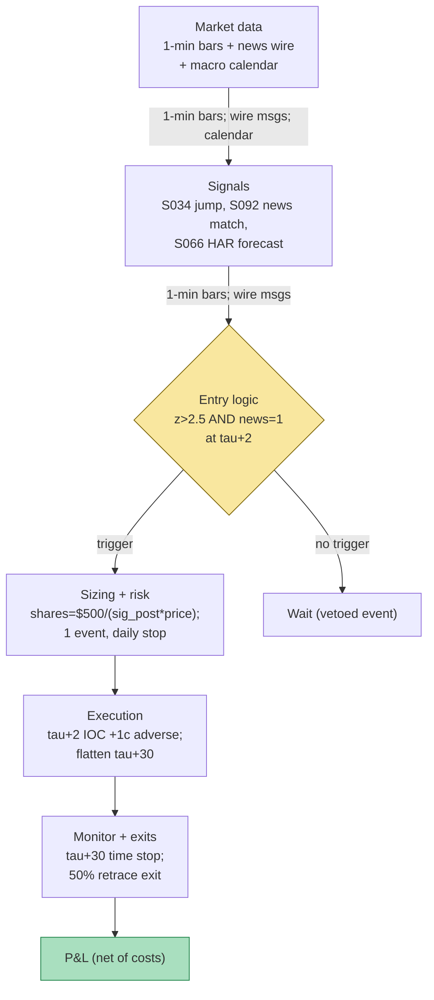

## Stage 117/200 — T017: Scheduled Macro-Announcement Drift

*Batch TB2 · Strategy 17/100 · Signals S034, S092, S066*

### T1. One-line verdict

| | |
|---|---|
| **Style** | Event-driven intraday drift: trade scheduled macro releases only |
| **Edge source** | Scheduled announcements (FOMC, CPI, NFP) move markets in jumps; jumps backed by identified fundamental news drift for minutes afterward (S034 `[D]` + S092 `[D]`); position size is set by the HAR realized-vol forecast so the bet is constant in risk, not in shares (S066 `[D]`) |
| **Typical holding period** | ~30 minutes post-release (`example` W_post = 30 min); flat the same session — never overnight |
| **Capacity hint** | Medium — liquid index ETFs and futures; ~8 scheduled FOMC + 12 CPI + 12 NFP events a year per name, so breadth across vehicles matters more than size |
| **Build-or-buy in one line** | Build the calendar + jump + sizing stack; buy the news wire and the 1-min bars — the identified-news leg needs licensed text |

### T2. Full mechanics

**Universe & session.** Liquid macro-sensitive vehicles: SPY/QQQ (`examples`) and, with a futures account, ES/NQ. Only scheduled-release sessions: FOMC statements (14:00 ET), CPI/PPI (8:30 ET), NFP (8:30 ET), plus ECB/BoE for the FX extension (`examples`). No unscheduled news — if it isn't on the calendar, this strategy doesn't see it. RTH only; the pre-market releases (8:30 ET) are traded at the cash open, not in the futures pre-market (`example` choice — avoids the thin-book fill).

**The signals in the strategy's own notation.** S034 `[D]` (scheduled macro-announcement drift): let τ be the release time (known from the calendar in advance). Pre-window drift R_pre = log P(τ⁻) − log P(τ − W_pre) (W_pre = 60 min, `example`). The tradable jump: R_jump = log P(τ+1) − log P(τ⁻) — information through τ+1 only. Post-announcement continuation signal at t > τ: s(t) = sign(R_jump) · 1{|R_jump| > κ·σ̂_diurnal(t)}, with κ = 2.5 (`example`) and σ̂_diurnal the time-of-day-normalized 1-min volatility (a 14:00 jump on FOMC day is measured against FOMC-day baselines, not quiet Tuesdays). S092 `[D]` (identified-news vs no-news): the jump is tradable only if identified_news = 1 — a textual/entity news match within ±15 minutes (`example`) with relevance ≥ ρ (`example`) ties the jump to fundamental firm/macro news; a no-news jump is *faded or skipped* (this strategy skips — the fade is T059/T079 territory). S066 `[D]` (HAR vol forecast): RV_{t+1} = β_0 + β_d·RV_t + β_w·RV̄_t^{(5)} + β_m·RV̄_t^{(22)} (Corsi 2009), estimated on ≥ 250 days (`example`); the forecast σ̂ for the post-window converts the risk budget into shares.

**Entry rule (long; short mirrors).** At τ+2 minutes, enter long only if ALL hold: (i) |R_jump| > 2.5·σ̂_diurnal (`example` — the jump must be a real surprise, not release-minute noise); (ii) identified_news = 1 (S092 — no identified news, no trade); (iii) the jump direction is not contradicted at the entry minute — no instant reversal between τ+1 and τ+2 (`example` sanity filter). **Causal timing:** the calendar gives τ in advance; R_jump uses information through τ+1 only, so the earliest entry is τ+2 — entering at τ+1 on a jump measured through τ+2 would be look-ahead. Entering *at* τ on the pre-drift sign is a different, riskier trade — this strategy explicitly does **not** trade the pre-announcement drift (see T7: Kurov et al. 2021 document its post-2015 disappearance).

**Exit rule.** Time stop at τ+30 min (`example` W_post) — the continuation decays; holding longer compounds costs without edge. Signal-flip exit: if the price retraces > 50% of R_jump within the window (`example`), the drift thesis is broken — flatten. No profit target; the drift is the target.

**Position sizing.** Risk-constant, not share-constant: shares = risk$ / (σ̂_post × price), with risk$ = $500 per event (`example`) and σ̂_post the HAR 30-minute vol forecast. When the forecast says the post-release window will be violent, the share count shrinks automatically — the strategy bets dollars of risk, not lots.

**Risk limits.** Max 1 event position at a time (`example` — CPI and NFP never overlap, but FOMC minutes can); daily loss stop −$1,000 (`example`); no adds; if two consecutive events both print identified_news = 0 jumps (dead calendar), halve risk$ for the next event (`example` — the news matcher may be miscalibrated).

**Cost model.** Half-spread 1¢/share/side + commission $0.005/share + $0.50/ticket (`examples`); release-minute slippage +1¢/share on entry (`example` — the first post-release print is the most violent of the day). Futures extension: use the contract's tick value and exchange fees instead (verify with your FCM).

**Execution sketch.** τ−5 min: arm — verify the calendar time, the news matcher, and the HAR forecast are all live. τ+2: marketable limit IOC in the jump direction. τ+30: market order flatten. Participation cap 5% of the 1-min volume (`example` — release minutes are deep, but don't be the whole bar). Queue-position honesty: the τ+2 fill is modeled at the first post-jump print *plus* 1¢ adverse — fills "at the jump price" on bar data are fantasy.

### T3. Signals it consumes

| Signal | Role | Weight / logic |
|---|---|---|
| S034 `[D]` — Scheduled macro-announcement drift | **Primary trigger** (direction + timing) | sign(R_jump); requires |R_jump| > 2.5·σ̂_diurnal (`example`); τ known from calendar |
| S092 `[D]` — Identified-news vs no-news | **Veto filter** | identified_news = 1 required; no-news jumps are skipped (never faded by *this* strategy) |
| S066 `[D]` — HAR realized-vol forecast | **Sizing** | shares = $500 / (σ̂_post × price) (`example` risk$); vol forecast sets the bet, not the direction |

Combination pseudocode (≤25 lines):

```
# per scheduled release at calendar time tau (all inputs causal)
R_jump = log(P[tau+1]) - log(P[tau-])            # S034, first tradable move (info through tau+1)
z = abs(R_jump) / sigma_diurnal(tau)             # S034, diurnal-normalized
news = match_news(tau, window=15min, rel>=rho)    # S092, stories timestamped <= tau+1
sig  = har_forecast(RV[:tau], horizon=30min)     # S066, vol for the hold window
if z <= 2.5: flat("noise jump")                  # example kappa
elif news == 0: flat("no identified news")       # S092 veto
else:
    shares = int(500 / (sig * P[tau+2]))         # example $500 risk
    buy/sell sign(R_jump)*shares at tau+2        # +1c adverse slippage modeled
    flatten at tau+30 or on 50% retrace         # examples
```

### T4. Worked example — numbers + P&L (SYNTHETIC)

Setup: macro-sensitive ETF SYNM at **$600.00** (synthetic prices — not market data), risk budget **$500/event**, κ = 2.5, W_post = 30 min (`examples`). Four synthetic releases, **seed 117** (`batches/TB2/plot_T017.py`):

| Event | R_jump | σ̂_diurnal | z | Identified news (S092) | HAR σ̂_post | Shares | Decision | Net P&L |
|---|---|---|---|---|---|---|---|---|
| FOMC-like 14:00 | +0.35% | 0.10% | 3.50 | Yes | 0.45% | 185 | LONG 185 | **+$235.80** |
| CPI-like 08:30 | −0.28% | 0.09% | 3.11 | Yes | 0.60% | 138 | SHORT 138 | **+$241.88** |
| NFP-like 08:30 | +0.19% | 0.12% | 1.58 | Yes | 0.50% | 0 | FLAT (z < κ) | $0.00 |
| NFP-2 08:30 | +0.31% | 0.10% | 3.10 | **No** | 0.55% | 0 | FLAT (no identified news) | $0.00 |
| **Total** | | | | | | | | **+$477.68** |

Line-by-line walk, FOMC-like: τ+2 — buy 185 @ **$602.10** ($600 × 1.0035) = $111,388.50. τ+30 — sell 185 @ **$603.42** ($602.10 × 1.0022, the +0.22% continuation) = $111,632.70. Gross +$244.20; half-spread −$3.70; commission −$2.85; 1¢/share entry slippage −$1.85; **net +$235.80**. CPI-like: short 138 @ $598.32, cover @ $596.53 (−0.30% continuation) → gross +$248.40 − $6.52 = **+$241.88**. The two vetoes: NFP-like's jump (z = 1.58) was release-minute noise — flat; NFP-2's jump (z = 3.10) had no identified news — flat per the S092 veto (a fade strategy might trade it; this one doesn't). **Four-event total net: +$477.68.** The chart plots the jump z-scores against the κ = 2.5 line with news flags and decisions, and the cumulative net P&L stepping +235.80 → +477.68 → +477.68 → +477.68.

**Cost-model note.** The 1¢/share entry slippage (T2) is now deducted in the displayed ledger — each entered trade carries half-spread, commission, and the slippage (FOMC-like: 185 × $0.01 = $1.85; CPI-like: 138 × $0.01 = $1.38), moving the FOMC-like trade to +$235.80, the CPI-like trade to +$241.88, and the four-event book to +$477.68. The chart plots this (full-cost) ledger.

**Where the example is optimistic.** The jumps, continuations, and news flags are all hand-set: both traded events drift cleanly in the jump direction for the full 30 minutes, and both vetoes "save" money by construction. Real post-announcement paths whipsaw — the 50%-retrace exit exists because continuations routinely fail halfway. The τ+2 fill assumes only 1¢ adverse slippage; on a real FOMC print the book can gap several cents past your limit before the IOC fills. The HAR forecast is assumed correct; a miscalibrated forecast sizes you into exactly the events where the continuation breaks. And the news matcher is assumed perfect — false "identified" matches on recycled headlines are the S093 failure mode this strategy inherits.

### T5. Data & infra — what must run

**Pipeline inventory.** Daily: HAR refit inputs — 5-min bars → daily RV series (78 five-min returns/day standard); OLS on ≥ 250 days — seconds in numpy. Per event: calendar poll (τ known days ahead), diurnal σ̂ profile (30-day, per S067 method), news-matcher query (stories ≤ τ+1 only — never match on later stories, that's look-ahead), jump computation on 1-min bars. Post-event: ledger + forecast-vs-realized reconciliation (the sizing calibration loop).

**M5 Max feasibility: feasible (Tier M, ~30–60 h ≈ $4,500–9,000 loaded-cost estimate).** Per cost-model §2: daily RV from 1-min bars is trivial; the HAR OLS refit on 1,000 days is milliseconds. Per §3: the whole stack lives in < 2 GB RAM. The constraint is not compute — it is the *news feed license* (machine-readable headlines with redistribution terms) and the engineering of the matcher. Bottleneck: text pipeline latency at τ+2 (the matcher must answer in seconds).

**Feed-outage safe-mode.** If the calendar, the news matcher, or the 1-min bars are stale at τ−5 → the event is FLAT (no partial-information trades — an unidentified jump is exactly what the strategy refuses). If the τ+2 entry filled but the τ+30 flatten fails → flatten at the next print, mark UNTRUSTED_FLAT, never carry overnight. If the HAR refit job failed this week → fall back to the trailing-22-day realized vol (`example`) and halve risk$ until the refit succeeds.

### T6. Buy vs build

| Option | What you get | Indicative price | Gains | Loses |
|---|---|---|---|---|
| Tier 1: Polygon Stocks Advanced | 1-min bars for jumps + RV | ~$30–200/mo, indicative — verify before budgeting | Jump math + HAR inputs covered | No news text |
| News wire: Benzinga Pro / similar | Machine-readable headlines | ~$100–200/mo, indicative — verify before budgeting | Powers the S092 matcher | Redistribution limits; headline latency varies |
| Tier 3: RavenPack / Bloomberg-class news | Full licensed news + sentiment + entity tagging | $$$$ enterprise, indicative — verify before budgeting | Best matcher inputs | Absurd for a ≤$1M paper op |
| Retail platform: QuantConnect paper | Paper broker + minute data + event scheduling | ~$60–300/mo, indicative — verify before budgeting | Fastest paper host | No news feed; the matcher is yours anyway |

**Verdict: hybrid — buy the bars, buy a mid-tier news wire, build everything else.** The jump arithmetic and HAR are textbook; the news matcher (entity resolution + relevance cutoff) is the IP and cannot be bought at retail prices. Crossover: if the wire costs more than ~$200/mo and you trade only FOMC/CPI/NFP on SPY, drop S092 to a "scheduled-release = identified by construction" rule — scheduled macro releases are *definitionally* news, and the matcher earns its keep only on the single-name extension (T059 territory).

### T7. Success-ratio evidence

| Study / source | Market & period | Metric | Before/after cost | Caveat |
|---|---|---|---|---|
| Lucca & Moench (2015), via Kurov, Wolfe & Gilbert (2021), *Finance Research Letters* 40 | US equities, 1994–2011 | **Pre**-FOMC drift +49 bp/24h, ≈ 80% of annual returns | Before-cost | Kurov et al. document its **post-2015 disappearance** — this is why T017 does not trade the pre-drift |
| Neuhierl & Weber, "Monetary Momentum," NBER WP 24748 (via S034's chapter) | FOMC announcements | Pre-announcement drift by policy-surprise sign plus **~15-day post-announcement continuation** | Before-cost | Working paper — the post-continuation leg is the closest academic cousin of this strategy's hold |
| Ederington & Lee (1993), *J. Finance* 48(4) | Interest-rate and FX futures | Volatility spikes at scheduled releases; markets process information in bursts | Descriptive | The mechanism (scheduled information → jumps), not the tradability |
| Boudoukh, Feldman, Kogan & Richardson (2019), *R. Financial Studies* 32(3) | US equities | 49.6% of overnight idiosyncratic volatility explained by textual fundamental news; identified-news jumps vs no-news jumps | Before-cost | The S092 premise — but their horizon is days, and the intraday drift leg is much thinner |
| Corsi (2009), *J. Financial Econometrics* 7(2) | Equity realized vol | HAR-RV: daily/weekly/monthly RV components forecast next-day variance; the literature's baseline | Forecast-loss, not P&L | Lower forecast loss ≠ tradable edge — the sizing leg is risk control, not alpha |

No published study documents an after-cost P&L for the exact jump → 30-minute identified-news drift trade. The honest decomposition: the *pre*-announcement drift is documented and documented-gone; the *post*-announcement continuation exists in the literature at multi-day horizons and is assumed, not proven, at 30 minutes. **Bottom line for ≤$1M paper:** ~32 events a year per vehicle, each risking $500 for an expected edge measured in single basis points — this is a part-time sleeve, not a book. The realistic use is execution timing (don't fight the drift for 30 minutes after CPI) rather than alpha. An institutional desk runs this inside event-volatility market-making, where the inventory edge dwarfs the directional drift.

### T8. Failure modes

1. **The pre-drift is gone; the post-drift may follow.** Kurov et al. (2021) show the pre-FOMC drift disappeared post-2015 as it became known. Published intraday drifts decay the same way. *Mitigation:* re-estimate the continuation (R_post vs R_jump regression) on rolling 2-year windows; if the slope goes to zero, the strategy is off.
2. **Whipsaw continuations.** Real post-release paths retrace — the 50% rule exits, but after the damage. *Mitigation:* the retrace exit plus the HAR sizing (violent forecasts = small bets); accept that half the events are exited losers.
3. **News-matcher false positives.** Recycled headlines matched as "identified" (the S093 staleness problem) authorize trades on noise jumps. *Mitigation:* novelty scoring on the matched story; require the story timestamp ≤ τ+1 (never match forward — look-ahead).
4. **HAR miscalibration at events.** HAR is fit on all days; event-day vol has a different distribution — the forecast understates the tails. *Mitigation:* event-conditional vol model (fit HAR on event days only, `example` refinement); the fallback rule in T5.
5. **τ+2 fill fantasy.** The first post-release prints are the day's most violent; bar-data backtests fill at fantasy prices. *Mitigation:* +1¢ adverse slippage modeled, and honestly it should be wider — measure realized vs modeled slippage per event type and widen until they match.
6. **Calendar errors.** Release times shift (debt-ceiling delays, unscheduled speeches); trading a stale τ means trading noise. *Mitigation:* the τ−5 arming check verifies the release actually occurred (jump in the first minute or wire confirmation) before the τ+2 order.
7. **Overnight/event-tail risk.** A 30-minute hold can still catch a second headline (press conference Q&A after FOMC). *Mitigation:* flatten before the press conference (`example` — FOMC statements at 14:00, presser 14:30: this strategy's window ends at 14:30 by construction); never hold through the Q&A.
8. **Concentration in few events.** ~32 events/year means one bad year is 32 samples — no statistical significance, ever. *Mitigation:* size accordingly (this is a sleeve); judge the strategy over 3+ years or don't judge it at all.

### T9. Visuals




### T10. Sources

1. Ederington, L. H. & Lee, J. H. (1993). "How Markets Process Information: News Releases and Volatility." *Journal of Finance* 48(4), 1161–1191. http://ideas.repec.org/a/bla/jfinan/v48y1993i4p1161-91.html (Scheduled releases → volatility bursts.)
2. Kurov, A., Wolfe, M. H. & Gilbert, T. (2021). "The Disappearing Pre-FOMC Announcement Drift." *Finance Research Letters* 40. https://pmc.ncbi.nlm.nih.gov/articles/PMC7525326/ (Lucca & Moench (2015) +49 bp/24h, 1994–2011, ≈ 80% of annual returns; post-2015 disappearance.)
3. Neuhierl, A. & Weber, M. "Monetary Momentum." NBER Working Paper 24748. http://nber.org/system/files/working_papers/w24748/w24748.pdf (Pre-announcement drift by surprise sign; ~15-day post-announcement continuation.)
4. Boudoukh, J., Feldman, R., Kogan, S. & Richardson, M. (2019). "Information, Trading, and Volatility: Evidence from Firm-Specific News." *Review of Financial Studies* 32(3), 992–1033. https://doi.org/10.1093/rfs/hhy083 (49.6% of overnight idiosyncratic volatility from textual news; the identified-news premise.)
5. Corsi, F. (2009). "A Simple Approximate Long-Memory Model of Realized Volatility." *Journal of Financial Econometrics* 7(2), 174–196. http://ideas.repec.org/a/oup/jfinec/v7y2009i2p174-196.html (HAR-RV — the sizing leg.)

**Unverified leads:** the exact post-30-minute continuation magnitude for scheduled macro jumps — no published after-cost number was found; treat the drift leg as assumed, not proven; Grok's Q-TB2-3 macro-day notes (stronger Gao effect on macro-news days) — qualitative research lead; news-wire pricing beyond the cost-model bands — indicative, verify before budgeting; all thresholds and the worked example are the author's synthetic construction.

*Source log: Grok answered Q-TB2-1..3 (2026-09-10); all claims independently verified or labeled unverified.*

Related: T068 (Scheduled-Event Vol Expansion) trades the volatility around the same calendar rather than the drift; T059 (News-Sentiment First-Minute Momentum) is the single-name, machine-readable-news sibling.
