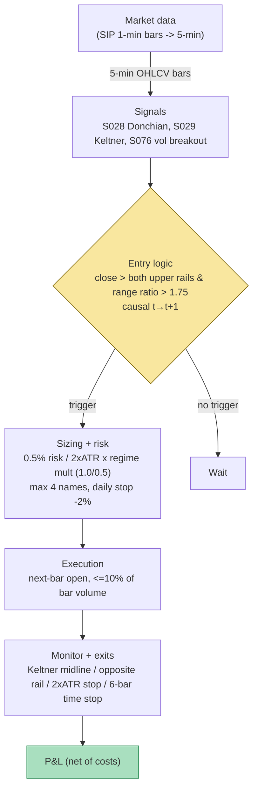

## Stage 119/200 — T019: Donchian/Keltner Breakout + Vol Sizing

*Batch TB2 · Strategy 19/100 · Signals S028, S029, S076*

### T1. One-line verdict

| | |
|---|---|
| **Style** | Intraday trend-following breakout |
| **Edge source** | Short-horizon price persistence after a volatility-expansion breakout: when price clears two independent channel systems (Donchian's pure price rails and Keltner's volatility-scaled rails) on an expansion bar, the move is more likely information than noise, and the first 30–60 minutes of follow-through pay for the whipsaws |
| **Typical holding period** | 30 minutes to one session; exits are time-stopped, not held for trends |
| **Capacity hint** | Low–medium. The pattern is the most published in technical trading (Turtle lineage); edge per trade is a few tenths of an ATR and crowding is real |
| **Build-or-buy in one line** | Build it on rented 1–5-minute bars; the sizing regime (squeeze vs expansion) is the only proprietary part and no vendor sells it |

### T2. Full mechanics

**Jargon used below.** *Donchian channel*: the highest high and lowest low over the prior N bars (pure price rails, no volatility scaling). *Keltner channel*: an EMA (exponential moving average) of closes ± m × ATR (volatility-scaled rails). *ATR* (Average True Range): the trailing mean of True Range, the dollar volatility unit. *Bollinger bandwidth*: (upper band − lower band) / middle band — a normalized volatility measure; a *squeeze* is bandwidth at a low percentile of its history. *Time-series momentum*: the tendency of an asset's own past return to persist (as opposed to cross-sectional momentum).

**Universe & session.** Liquid US equities and ETFs: price ≥ $10 (*example*), 20-day average dollar volume ≥ $50M (*example*), quoted spread ≤ 5 bps (*example*). Session: RTH only, entries 09:35–15:00 ET (*example*), flat by 15:45 — no overnight holds (this is an intraday breakout, not the Turtle's multi-day system). Exclusions: scheduled macro-announcement windows (FOMC, CPI — see S034) where the breakout is a headline lottery; earnings days; halts.

**Entry rule — dual-channel confirmation.** On 5-minute bars (*example*), compute on completed bars only (S028's causal convention): Donchian(20) rails D^U_t, D^L_t and Keltner(EMA20, 1.5×ATR20) rails K^U_t, K^L_t (*examples*). Long trigger at bar t's close: C_t > D^U_t AND C_t > K^U_t. Short mirrors. Requiring both rails filters the two classic false-breakout families: the Donchian rail breaks on any new extreme (whipsaw-prone), the Keltner rail breaks only on a volatility-significant move (lag-prone) — the intersection is the higher-quality subset.

**Vol-breakout regime (S076) — the sizing gate.** Compute the range ratio R_t / R̄_{t−1}^{(10)} with R_t = H_t − L_t and the trailing 10-bar mean (*example*), and the Bollinger-bandwidth percentile over the trailing 126 sessions (*example*, the S076/S030 convention adapted intraday). Three regimes:
- **Squeeze-armed** (*example*): bandwidth ≤ 10th percentile AND range ratio > 1.75 → full size (multiplier 1.0). The S076 thesis: compression precedes expansion.
- **Expansion-only** (*example*): range ratio > 1.75 but no squeeze → half size (multiplier 0.5). Real move, lower quality.
- **Chop** (*example*): range ratio ≤ 1.75 → no trade, even if both rails break (a rail break on a narrow bar is noise).

**Causal timing.** All rails and ratios are computed at bar t's close from data ≤ t; tradable no earlier than bar t+1's open. The Donchian rail uses bars [t−N, t−1] (the triggering bar excluded — S028), so the signal cannot reference itself.

**Exit rule.** First of: (a) **midline touch**: price touches the Keltner midline (EMA20) — the move has mean-reverted to its own trend; (b) **opposite-channel break**: close beyond the opposite Donchian rail; (c) **2×ATR stop-loss** from entry (*example*); (d) **6-bar time stop** (*example*, the S076 H default) — if the breakout hasn't paid within 6 bars (30 minutes), the persistence thesis is dead.

**Position sizing.** shares = (equity × 0.50% × regime_multiplier) / (2 × ATR20) (*example*). The stop distance (2×ATR) normalizes risk across volatility regimes; the regime multiplier (1.0 / 0.5 / 0) is the S076 sizing overlay. Max 4 concurrent positions (*example*); portfolio heat ≤ 2% of equity (*example*).

**Risk limits.** Daily loss stop −2% of equity (*example*); per-trade loss cap 1% (*example*); max gross 4× equity (*example*). Kill switch: no new entries if the 5-minute feed is stale > 5 minutes or if realized intraday range exceeds 3× ATR20 (a volatility event, not a breakout regime).

**Cost model (applied in T4).** Half-spread per side ($0.005/share *example* for a $200 ETF); commission $0.005/share + $0.50/ticket (*example*); slippage 1 tick ($0.01, *example*) on breakout entries (adverse selection is worst exactly at the break). Square-root impact beyond 2,000 shares (*example*).

**Order/execution sketch.** Close-through entry filled at the next bar's open (causal, honest). The alternative — a stop-entry 1 tick beyond the rail — fills earlier but suffers worse adverse selection and intrabar lookahead risk in backtests (S028); use it only live with the slippage model doubled. Participation cap ≤ 10% of the bar's volume (*example*).

### T3. Signals it consumes

| Signal | Role | Weight / logic |
|---|---|---|
| S028 — Donchian breakout | Primary trigger (price-rail break) | Enter only if C_t > D^U_t(20) (long); the raw breakout event |
| S029 — Keltner/Bollinger | Confirmation filter (volatility-rail break) | AND C_t > K^U_t = EMA20 + 1.5×ATR20; both rails must break |
| S076 — Vol breakout / squeeze | Regime gate + sizing | Full size if squeeze-armed (BW ≤ p10) and range ratio > 1.75; half size if expansion-only; veto if ratio ≤ 1.75 |

```python
# T019 combination logic (<=25 lines). All thresholds marked example.
def t019_signal(bars, t):
    du, dl = donchian(bars, t, N=20)          # S028, completed bars only
    ku, kl, mid = keltner(bars, t, 20, 1.5)   # S029
    atr = atr20(bars, t)
    rr = (bars[t].h - bars[t].l) / mean_range(bars, t, 10)  # S076
    bw_pct = bandwidth_percentile(bars, t, 126)             # S076 squeeze
    if rr <= 1.75: return None                              # example veto
    mult = 1.0 if bw_pct <= 10 else 0.5                      # example sizing
    if bars[t].c > du and bars[t].c > ku:
        return ("LONG", bars[t+1].open, mult)               # fill at t+1
    if bars[t].c < dl and bars[t].c < kl:
        return ("SHORT", bars[t+1].open, mult)
    return None
```

### T4. Worked example — numbers + P&L (SYNTHETIC)

Synthetic 5-minute bars for a fictional $200 large-cap ETF "SYNQ" (seed 119, `rng = np.random.default_rng(119)`); the chart `images/T019_example.png` plots this exact session.

**Trade 1 — squeeze-armed long.** Trigger bar t=20 (11:15 ET): close $202.60 > Donchian(20) upper $201.10 ✓ and > Keltner upper $201.42 ✓ (EMA20 $200.20, ATR20 $0.81 — computed by the plot script). Range ratio = 1.95/0.65 = **3.00** > 1.75 ✓. Bollinger bandwidth at the 8th percentile of its trailing 126-session history (*example*) → squeeze armed → regime multiplier 1.0. Entry at bar 21 open: **$202.70**. Sizing: equity $250,000; risk 0.50% = $1,250 (*example*); stop distance 2×ATR20 = $1.62 → 772 → **750 shares** (rounded, *example*); notional $152k ≈ 0.6× equity. Exit: 6-bar time stop (*example*) → bar 26 close **$204.30**.

| Step | Price | Side | Shares | Cash flow |
|---|---|---|---|---|
| Entry 11:20 | $202.70 | Buy | 750 | −$152,025.00 |
| Half-spread (RT) | — | — | — | −$7.50 ($0.005 × 2 × 750) |
| Commission (RT) | — | — | — | −$8.50 ((750×$0.005+$0.50) × 2) |
| Slippage (entry) | — | — | — | −$7.50 ($0.01 × 750) |
| Exit 11:50 (time stop) | $204.30 | Sell | 750 | +$153,225.00 |
| **Gross** | | | | **+$1,200.00** (750 × $1.60) |
| **Costs** | | | | **−$23.50** |
| **Net** | | | | **+$1,176.50** |

**Trade 2 — expansion-only short.** Trigger bar t=40 (13:15 ET): close $199.10 < Donchian(20) lower $199.92 ✓ and < Keltner lower $199.97 ✓; range ratio **2.22** > 1.75 ✓; no squeeze (bandwidth 45th percentile, *example*) → multiplier 0.5 → **375 shares**. Entry bar 41 open **$199.05**; exit 6-bar time stop bar 46 close **$198.60**. Gross = 375 × $0.45 = +$168.75; costs $3.75 + $4.75 + $3.75 = $12.25; **net +$156.50**.

**Book total: +$1,333.00** on $250k equity (+0.53% for the session, two trades).

**Where the example is optimistic.** The entry fills exactly at the t+1 open with 1-tick slippage; real breakout bars gap through the open and the slippage distribution has a fat right tail. The squeeze percentile (8th of 126 sessions) is handed to the example rather than estimated — estimating bandwidth percentiles intraday is noisy and the 126-session convention is a daily-bar practitioner standard (S076), not an intraday one. Both trades win; the strategy's documented reality (T7) is a low win rate with the winners paying for strings of 2×ATR stop-outs — a two-trade tape cannot show that. No partial fills, no borrow friction on the short, no FOMC-day exclusion logic firing.

### T5. Data & infra — what must run

**Pipeline inventory.** (1) *Pre-open*: compute Donchian/Keltner rails and bandwidth percentiles from the daily history; seed the intraday engine. (2) *Intraday loop*: every 5 minutes (or every minute with 5-minute resampling), update rails, range ratios, squeeze percentiles; evaluate triggers; manage time stops. (3) *Post-close*: archive bars, recompute ATR/bandwidth histories, log fills vs model for slippage calibration.

**Feeds.** SIP 1-minute (resampled to 5-minute) or native 5-minute bars, Tier 1 (~$30–200/mo `indicative — verify before budgeting`, cost-model §6). No trades feed needed — everything is bar-computable, which is this strategy's cost advantage over T018.

**M5 Max feasibility: trivial-to-feasible.** Tier L/M build: the signal math is bar-level (4–12 eng-hours for the indicators, 40–100 for the strategy harness with execution sketch and risk, per cost-model §5 → $6,000–15,000 `loaded-cost estimate`). Throughput: 500 names × 390 one-minute bars = 195k bars/day — "trivial" per cost-model §2; polars recomputes the whole universe's rails in seconds. RAM: 60 days of 1-min bars for 500 names ≈ 3 GB (cost-model §4) — far inside the 77 GB budget. Storage: ~50 MB/day for 500 names of 1-min bars; archive freely. Bottleneck: none on compute — the binding constraint is parameter discipline (T8.6). Breaks at: nothing at 500 names; the strategy scales to the full liquid universe on bars without new infra.

**Feed-outage safe mode.** If the bar feed is stale > 5 minutes (*example*): cancel pending entries; existing positions keep their broker-lodged 2×ATR stops and 6-bar time stops are converted to clock-time stops managed locally — if the clock can't be trusted either, flatten at market. Because exits are time-stops, a feed outage during a position is the dangerous case: the documented procedure is to flatten rather than hold a breakout blind.

### T6. Buy vs build

| Option | What you get | Indicative price | What buying gains | What buying loses |
|---|---|---|---|---|
| Tier 0: Stooq / Yahoo delayed | Daily bars | ~$0 | Free daily-rail research | No intraday bars — the strategy doesn't exist on daily data |
| Tier 1 retail: Polygon / Alpaca SIP 1-min | Real-time 1-min bars | ~$30–200/mo `indicative — verify before budgeting` | Cheapest adequate feed | Nothing material at this granularity |
| Retail platform (QuantConnect/Composer-style) | Hosted bars + backtester + paper broker | ~$10–50/mo `indicative — verify before budgeting` | Zero infra; fast iteration | Their backtester, their slippage model; dual-channel logic still yours |
| Professional: Databento 1-min + quant platform | Cleaner corporate-action handling, PIT splits | ~$200/mo + usage `indicative — verify before budgeting` | Fewer bad-tick breakouts | Overkill for 5-minute bars |

**Verdict: build, and buy only the cheapest adequate bars.** The strategy's IP is the dual-confirmation + squeeze-sizing overlay, which no vendor sells; the data need is commodity 1-minute bars. Crossover: buy up to Databento only if bad-tick false breakouts survive your cleaning pipeline — otherwise Tier 1 retail is sufficient. Never buy a "breakout signal" product: you cannot verify its causality (t→t+1) or its cost accounting.

### T7. Success-ratio evidence

| Study / source | Market & period | Metric | Before/after cost | Caveat |
|---|---|---|---|---|
| Rayome & Jain (2008), "Do Turtles Have Fat Tails?" | Soybean futures, 1980–2007 (27 yrs), Donchian 20/55-day Turtle system | Significant positive returns on a risk-adjusted and statistical basis; trailing stops "critical to the success of the model" | Tested with Dennis's money-management rules (cost-aware framing) | Futures, daily bars, multi-day holds — the ancestor, not the intraday strategy; summarized via the UCT thesis below |
| Faith (2007), *Way of the Turtle* (McGraw-Hill) | Turtle experiment, 1980s | The Turtles "made in excess of $170 million" by 1988 | Real P&L (costs paid) | Anecdotal/adversarially selected; practitioner account, not a statistical test |
| "AdTurtle" (2019), *J. Risk Financial Management* 12(2) https://www.mdpi.com/1911-8074/12/2/96/ | Backtests of Turtle variants | ATR-based exits (barriers from ATR multiples) generated optimal results vs other exit strategies examined | Backtest (their cost assumptions) | Exits, not entries; supports the ATR-scaled exit/sizing leg of T019 |
| Moskowitz, Ooi & Pedersen (2012), "Time Series Momentum," *J. Financial Economics* 104(2) | 58 liquid instruments, 1985–2009 | Significant time-series momentum (12-month trend persistence) | Before cost (academic) | 12-month horizon, not intraday — cited for the persistence mechanism, not the timeframe |

**The intraday honesty gap.** The documented evidence above is daily-to-monthly. For the *intraday* dual-channel variant, the closest checkable anchors are the Grok-summarized leads (Q-TB2-3, unverified against the papers): Heston–Korajczyk–Sadka (2010) same-half-hour continuation (~11 bp open slot, ~8 bp close slot) and Gao–Han–Li–Zhou (2018) first→last-half-hour SPY momentum (R² ≈ 1.6%) — small effects, partially eaten by 1–2 ticks of cost. There is no Jegadeesh-class paper establishing that 5-minute Donchian/Keltner dual breakouts earn a net edge; treat the intraday layer as practitioner craft with a real daily-horizon pedigree.

**Capacity & decay.** Breakout trend-following is the most crowded style in futures (decades of CTA capital); the intraday equity variant is less crowded but the entry prints (round-number rails) are visible to everyone. Decay shows up as shrinking follow-through: the 6-bar window that used to pay now pays less as faster participants fade the same rails.

**Honest bottom line.** For a ≤$1M paper operation: an excellent *learning* strategy — cheap data, honest causality, and the time-stop discipline teaches cost accounting fast. For an institutional desk: the daily-horizon Turtle evidence is real but the intraday dual-channel edge is unproven net of costs at scale; run it only as a small sleeve with the squeeze gate enforced, and measure the follow-through decay quarterly.

### T8. Failure modes

1. **Whipsaw in chop.** Both rails break on noise; the 2×ATR stop bleeds. Mitigation: the S076 range-ratio veto (no trade on narrow bars) is the primary defense; add a spread/width filter (skip if Keltner width < its median).
2. **Single-sweep false breakout.** One large print tags the rail and reverses. Mitigation: close-through (not high-through) entries only — the causal S028 convention; require the range-ratio expansion on the *closing* bar.
3. **Lookahead via the triggering bar.** Computing the Donchian rail including bar t makes breakouts arithmetically impossible or, worse, silently includes t's high. Mitigation: rails on [t−N, t−1] only (S028); unit-test the shift.
4. **Latency: the break is priced by t+1.** The most-crowded rail breaks are faded by faster participants before the open fill. Mitigation: 1-tick minimum slippage model; live shortfall tracking; widen to 2 ticks if measured shortfall exceeds it (`simulated only — requires MBO/ITCH` for queue claims).
5. **Cost dominance on small bars.** A 5-minute breakout's expected move is a fraction of an ATR; two half-spreads + slippage eat it. Mitigation: the strategy only trades liquid names (≤ 5 bps spread, *example*); net-P&L accounting per trade, always.
6. **Parameter mining (N=20, m=1.5, k=1.75).** The triple (lookback, multiplier, ratio) is mined jointly. Mitigation: walk-forward validation, require plateaus (edge across N=15–30, m=1.25–2.0), and purged-CV discipline (S088) if the parameters are selected by search.
7. **Volatility-regime shift.** A 2×ATR stop calibrated in calm markets is a noise stop in stress. Mitigation: the ATR denominator auto-scales, but cap position size when ATR20 itself doubles week-over-week (regime flag).
8. **Time-stop rigidity.** A genuine trend gets cut at 6 bars. Mitigation: allow the midline-touch exit to extend — the time stop is a default, not a law; log how often the extension pays.

### T9. Visuals




### T10. Sources

- Rayome, D. & Jain, A. (2008), "Do Turtles Have Fat Tails? Donchian Channels and Turtle Trading: The Case of Soybeans," *Journal of Finance Issues*. Discussed in the University of Cape Town thesis "Testing a price breakout strategy using Donchian" https://open.uct.ac.za/server/api/core/bitstreams/906cebd9-0c5f-49ba-8c36-f1e960b675c2/content — 27-year soybean Turtle test, significant risk-adjusted returns, trailing stops critical.
- Faith, C. (2007), *Way of the Turtle: The Secret Methods That Turned Ordinary People into Legendary Traders*, McGraw-Hill — the Turtle experiment account (>$170M by 1988, per the UCT thesis summary).
- "AdTurtle: An Advanced Turtle Trading System" (2019), *Journal of Risk and Financial Management* 12(2). https://www.mdpi.com/1911-8074/12/2/96/ — ATR-barrier exits optimal among the exit strategies tested.
- Moskowitz, T.J., Ooi, Y.H. & Pedersen, L.H. (2012), "Time Series Momentum," *Journal of Financial Economics* 104(2) — the time-series momentum mechanism (12-month horizon; cited for mechanism, not timeframe).

**Unverified leads.** Grok Q-TB2-3 (2026-09-10): Heston–Korajczyk–Sadka (2010) same-slot continuation magnitudes (~11 bp open slot) and Gao–Han–Li–Zhou (2018) "Market Intraday Momentum" (first→last-half-hour R² ≈ 1.6%) — paper titles/authors are real and checkable, but the numbers are Grok's summaries, not verified against the paper text; treat magnitudes as leads. Grok Q-TB2-2 eng-hour bands for the TB2 stack — chatbot-reported, plausible, unverified.

Grok answered Q-TB2-1..3 (2026-09-10); all claims independently verified or labeled unverified.
