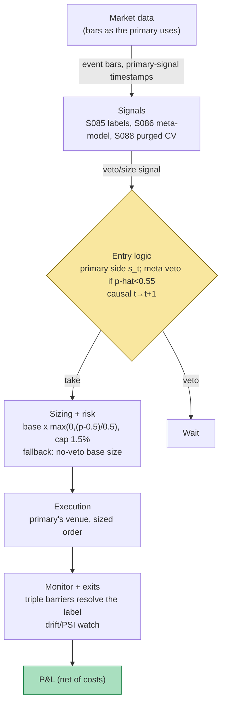

## Stage 120/200 — T020: Triple-Barrier + Meta-Labeling Overlay

*Batch TB2 · Strategy 20/100 · Signals S085, S086, S088*

### T1. One-line verdict

| | |
|---|---|
| **Style** | Machine-learning overlay: veto and position-sizing layer over any primary strategy — not a directional strategy itself |
| **Edge source** | Precision gain, not new alpha: a secondary classifier predicts whether the primary's bet will be profitable (triple-barrier labels as the training target) and vetoes low-probability bets while sizing the rest by predicted success probability |
| **Typical holding period** | Inherits the primary strategy's (intraday to multi-day) |
| **Capacity hint** | Inherits the primary's, reduced by the veto rate (typically 20–60% of bets vetoed, *example*) — the overlay never creates capacity |
| **Build-or-buy in one line** | Build: the meta-model is trained on your labels from your primary's bets, so there is nothing to buy — buy the data and the broker API, build the model |

### T2. Full mechanics

**Jargon used below.** *Triple-barrier labeling* (S085 `[D]`): a labeling method where each bet is resolved by whichever of three barriers the price touches first — an upper profit barrier, a lower stop barrier, and a vertical (time) barrier. *Meta-labeling* (S086 `[D]`): a second machine-learning model that predicts whether the primary model's bet will succeed, used to veto or size bets (it never flips the side). *Purged/embargoed cross-validation* (S088 `[D]`): a validation scheme that drops training labels whose time intervals overlap the test fold (purge) plus a buffer (embargo), preventing label leakage. *Kelly fraction*: the bet-size rule maximizing long-run growth for known win probabilities; *fractional Kelly* bets a fraction of it. *PR-AUC*: area under the precision–recall curve, the right tuning metric for imbalanced classification. *DSR* (Deflated Sharpe Ratio): a Sharpe ratio adjusted for multiple-testing bias. *PBO* (Probability of Backtest Overfitting): the chance the selected strategy is overfit.

**Universe & session.** Inherits the primary's — the overlay is strategy-agnostic. The worked example uses a generic intraday breakout primary (T019-style); it could equally be T014's Bollinger fade or T005's ORB. The only requirement: the primary must have a documented, costed edge *before* the overlay — meta-labeling amplifies an edge it cannot manufacture (T7).

**Labeling (S085 `[D]`) — the training targets.** For each primary-signal event at t_0 with entry P_{t_0}, side s ∈ {+1, −1}, volatility σ̂_{t_0} from data **before** t_0 only (20-day ATR, *example*), horizon H = 1 session (*example*): upper = P_{t_0}(1 + 1.5σ̂), lower = P_{t_0}(1 − 1.0σ̂) (*examples*), vertical = t_0 + H. Scan τ = 1…H on side-adjusted return: y = +1 (profit first), −1 (stop first), 0 (neither by H) — de Prado's standard. For meta-training relabel binary (S086): 1 if y = +1, 0 otherwise ("keep 0s as losses"; the S085 "drop 0s" variant is the alternative — document whichever you use).

**Meta-model (S086 `[D]`) — the veto/sizing rule.** A classifier (gradient-boosted trees, e.g. LightGBM, *example*) on features x_t available at t (20–50 features *example*: realized vol, quoted spread, RVOL, time-of-day, primary-signal strength, side as ±1), z-scored with **training-fold statistics only**, outputs p̂_t = P(y_t = 1 | x_t, s_t). Position rule (*examples*): **veto** if p̂_t < 0.55; **size** with multiplier g(p̂) = max(0, (p̂ − 0.50)/0.50) → shares = base_shares × g(p̂), base from 0.50% equity risk; hard cap 1.5% equity per bet. On the formula: Grok's Q-TB2-1(D) text stated /0.25 but its own table computed /0.50 (see grok-answers.md QC notes); this chapter standardizes on **/0.50** throughout T4.

**Validation (S088 `[D]`) — the honesty layer.** Train and evaluate under purged K-fold CV (K = 5, *example*): drop training events whose label interval [t_i(0), t_i(1)] intersects the test fold, and embargo 5% of the sample (*example*) or the maximum label horizon, whichever is larger. Tune on PR-AUC, never accuracy. Final selection via combinatorial purged CV with the PBO statistic — the overlay ships only if the deflated Sharpe clears your bar.

**Causal timing.** The label y_{t_0} is known only at min(first barrier touch, t_0+H) — a training target, never a live input. Live loop: primary fires at t → meta predicts p̂_t from data ≤ t → fill at t+1. The meta-model must never see features computed after t, and the label must never leak into the feature set.

**Risk limits.** Meta-drift monitor: recompute feature-distribution PSI (population stability index) monthly (*example*); if calibration drifts, fall back to the primary with base size and **no veto** — a miscalibrated meta-model is worse than none. Never trade on a p̂ more than one session old. Max 50 features (*example*); min 500 labeled events per retrain (*example*).

**Cost model.** The overlay adds no per-trade cost beyond the primary's; its costs are engineering + the compute for nightly retraining (T5). The P&L effect is entirely through trade selection and sizing (T4).

**Execution sketch.** The overlay is a pre-trade gate in the order path: primary signal → meta inference (milliseconds, local) → veto/size → broker. No order leaves the box without a fresh p̂.

### T3. Signals it consumes

| Signal | Role | Weight / logic |
|---|---|---|
| S085 `[D]` — Triple-barrier labeling | Label generator: converts each primary bet's price path into a win/loss training target | Every primary event gets y ∈ {+1, −1, 0} → binary {1, 0}; barriers k_u=1.5, k_ℓ=1.0, H=1 session (*examples*) |
| S086 `[D]` — Meta-labeling | The overlay itself: veto + sizing rule over the primary's side | Bet if p̂_t ≥ 0.55; size = base × max(0, (p̂−0.50)/0.50), cap 1.5% equity (*examples*) |
| S088 `[D]` — Purged/embargoed CV | Validation protocol: the only honest way to evaluate the meta-model | Purge overlapping label intervals; embargo 5% or max horizon; tune PR-AUC; select via CPCV/PBO |

```python
# T020 overlay logic (<=25 lines). All thresholds marked example.
def t020_overlay(primary_events, bars):
    labels = triple_barrier(primary_events, bars, ku=1.5, kl=1.0, H="1d")
    y = (labels == +1).astype(int)                    # S085 -> binary
    meta = train_gbm(features_at_event, y, cv=purged_kfold(K=5, embargo="5%"))  # S088
    for ev in live_primary_events():                 # S086, causal t -> t+1
        p = meta.predict_proba(features(ev, t="now"))[1]
        if p < 0.55: continue                        # veto (example)
        mult = max(0.0, (p - 0.50) / 0.50)           # sizing (example)
        size = min(base_shares(ev) * mult, 0.015 * equity / price)  # cap in shares
        submit(ev.side, size, t_next_open=True)
```

### T4. Worked example — numbers + P&L (SYNTHETIC)

Five synthetic primary-signal instances on a $200,000 book (seed 120, `rng = np.random.default_rng(120)`); the chart `images/T020_example.png` plots these exact numbers. Parameters (*examples*): σ̂ = $2.00; upper = +1.5σ̂ = +$3.00/share; lower = −1.0σ̂ = −$2.00/share; vertical = 1 session; base risk 0.50% = $1,000 → base 500 shares at the $2.00 stop distance; veto if p̂ < 0.55; multiplier max(0, (p̂−0.50)/0.50). Cost per round trip: shares × $0.03 (half-spread $0.01 + commission $0.005, both sides) + $1.00 ticket. Naive baseline: 500 shares on every bet.

| # | Primary side | Features (sketch) | Meta p̂ | Mult. | Shares | Barrier outcome | Gross $ | Costs $ | Net (meta) $ | Net (naive) $ |
|---|---|---|---|---|---|---|---|---|---|---|
| 1 | Long | quiet vol, RVOL 1.8 | 0.82 | 0.64 | 320 | upper hit | +960.00 | 10.60 | **+949.40** | +1,484.00 |
| 2 | Long | news spike, wide spread | 0.48 | veto | 0 | would hit lower | 0.00 | 0.00 | **0.00** | −1,016.00 |
| 3 | Short | RSI-2=94, trend down | 0.53 | veto | 0 | would hit upper (adverse) | 0.00 | 0.00 | **0.00** | −1,516.00 |
| 4 | Long | gap-fade setup | 0.63 | 0.26 | 130 | vertical, +$0.80/sh | +104.00 | 4.90 | **+99.10** | +384.00 |
| 5 | Short | crowded, high ADV | 0.88 | 0.76 | 380 | lower hit (profit for short) | +760.00 | 12.40 | **+747.60** | +984.00 |
| **Total** | | | | | | | | | **+$1,796.10** | **+$320.00** |

Walk the arithmetic for #1: multiplier = (0.82 − 0.50)/0.50 = 0.64 → 500 × 0.64 = 320 shares; upper hit → 320 × $3.00 = +$960.00 gross; costs 320 × $0.03 + $1.00 = $10.60; net +$949.40. Vetoes #2/#3: p̂ < 0.55 → 0 shares, avoiding naive losses of −$1,016 and −$1,516. #5: (0.88−0.50)/0.50 = 0.76 → 380 shares; short profits at the lower barrier → 380 × $2.00 = +$760.00; costs $12.40; net +$747.60. Meta beats naive by **$1,476.10** — from vetoing two full losers ($2,532 of gross loss avoided) and sizing the three taken bets by p̂.

**Where the example is optimistic.** The five p̂ values are handed to the example already calibrated — in production, calibration is the whole battle (the Daru replication in T7 shows the lift washing out at scale). The "would have" outcomes for vetoed bets are unknowable live — the example grants omniscience for illustration. No feature-drift, no label-leakage, no regime change; the purged-CV step that would catch those is described, not demonstrated. Five instances prove nothing statistically — the example demonstrates the *mechanism*, not the efficacy.

### T5. Data & infra — what must run

**Pipeline inventory.** (1) *Nightly*: recompute labels for the primary's event history, rebuild the parquet feature store, retrain the meta-model under purged/embargoed CV, run calibration checks (predicted vs realized win rate by p̂ decile), promote or hold. (2) *Intraday*: per primary-signal event, compute features from data ≤ t, run inference (milliseconds), apply veto/sizing. (3) *Monthly*: feature-drift (PSI) review, PBO re-check on the expanded sample.

**Feeds.** No new market data beyond the primary's — labels and features are computed from bars the strategy already buys (incremental data cost $0). One data-quality requirement, from Grok's bounce defense (Q-TB2-2): label the barriers on the **same mid-price path you will trade**, not on last-sale prints — training on last-sale barriers and sizing live on NBBO mids injects bid–ask bounce into the labels.

**M5 Max feasibility: feasible (the ML stack is the long pole).** Labeling + purged CV is a Tier L/M build per cost-model §5; the full stack (labeling engine, purged CV, feature store, inference) is 120–230 eng-hours per the Grok research (chatbot-reported, unverified) → $18,000–34,500 `loaded-cost estimate` at $150/hr. Throughput: triple-barrier first-touch on daily events runs in minutes per year of sample (Grok Q2); LightGBM on 1M rows × 50 features trains in ~1–10 min (cost-model §2); inference is microseconds per event. RAM: labels + feature matrix for 3k names × 10y daily events = 10–30 GB (Grok Q2) — inside the 77 GB budget; training adds 8–20 GB. Bottleneck: labeling-engine correctness and purged-CV discipline, not FLOPs.

**Feed-outage safe mode.** If the meta-inference service is stale or the nightly retrain failed: fall back to the primary with base size and **no veto**. Never size on a p̂ more than one session old. Kill switch: disable the overlay (not the primary) if the veto rate spikes > 3× its trailing mean — the signature of feature breakage (*example*).

### T6. Buy vs build

| Option | What you get | Indicative price | What buying gains | What buying loses |
|---|---|---|---|---|
| Build on rented bars (Tier 1) | Your labels, your features, your meta-model | ~$30–200/mo data `indicative — verify before budgeting` + eng | The meta-model IS the IP; full control of leakage discipline | 120–230 eng-hours |
| Managed ML platform (SageMaker/Vertex-style) | Hosted training/inference | ~$100–500/mo `indicative — verify before budgeting` | No training-infra babysitting | The labeling/CV discipline is still yours |
| Broker API (IBKR etc.) | Execution for the sized orders | Commission-based | You don't write a matching engine | Nothing — this is the buy, per Grok's verdict |
| "AI alpha" vendor product | A black-box overlay | $$$$ `indicative — verify before budgeting` | Nothing verifiable | You cannot audit its labels, its purge, or its causality — unbuyable on principle |

**Verdict: build the overlay, buy everything around it.** Nobody can sell you a meta-model trained on your primary's bets — the labels don't exist until you create them. The crossover logic is inverted from most strategies: buying is only rational for the commodities (data, compute, execution); the overlay itself is build-or-nothing. Do not buy an "AI overlay" product: without your label definitions and purge discipline, its backtest is unauditable.

### T7. Success-ratio evidence

| Study / source | Market & period | Metric | Before/after cost | Caveat |
|---|---|---|---|---|
| López de Prado, M. (2018), *Advances in Financial Machine Learning*, Wiley (Ch. 3, 10) | Methodological | Triple-barrier labeling + meta-labeling framework; Ch. 10's claim: the secondary model improves precision, it is "not a second alpha source" | N/A (method) | The canonical source, not an efficacy study |
| Daru Finance, "lopez-de-prado-work-review" (GitHub, 2025–26) https://github.com/darufinance/lopez-de-prado-work-review | 42 instruments (crypto perps, US ETFs, FX), EMA-crossover primary | Meta-labeling lifts profit factor in 38/42 instruments; **0/42 clear DSR > 0.95**; typical move: PF 0.92→1.03, Sharpe from deeply negative toward ~0 | Net of per-turnover costs | Independent replication, not peer-reviewed; figures as reported in the repo's summary (not independently re-run); primary deliberately edgeless — "precision filter, not an alpha source" |
| Daru Finance follow-up, `03b_metalabel_real_primary` (same repo) | 6 structural edges × 26 perp pairs, 156 configurations | With an edge-bearing primary: PF 1.26→1.79, per-trade 47.3→148.1 bp, DSR 0.636→0.778 on a focused 2-pair sample; pooled across 156 configs: **DSR 0.0** (median PF lift only +0.02) | Out-of-sample, costed | The honest synthesis: the mechanism is real on a focused sample, washes out at scale under deflation |
| "Algorithmic crypto trading using information-driven bars, triple barrier labeling and deep learning," *Financial Innovation* (Springer) https://link.springer.com/article/10.1186/s40854-025-00866-w | Crypto (BTC/ETH), information-driven bars | Peer-reviewed application of triple-barrier labeling; finds dynamic (vol-adjusted) barriers did *not* improve on static ones | Their backtest | Supports the labeling machinery, not the meta-labeling efficacy claim |
| Bailey & López de Prado (2014), "The Probability of Backtest Overfitting," *J. Computational Finance* 17(4) | Methodological | PBO / deflated Sharpe: the multiple-testing correction behind S088 validation | N/A (method) | The reason the Daru pooled DSR is 0.0 — selection bias is the default, not the exception |

**Honest bottom line.** Meta-labeling is a precision tool with a documented, replicated, modest effect: it takes a cost-losing primary toward break-even and a genuinely edged primary somewhat further — it has never been shown to manufacture an edge or to survive deflated-Sharpe scrutiny at scale (0/42, then pooled DSR 0.0). For a ≤$1M paper operation this is one of the most buildable ML projects in the book (tabular model, local training, no GPU) — build it only *after* the primary is proven on mids with costs: "don't train the meta-labeler on last-sale triple barriers then size live on NBBO" (Grok Q-TB2-2). For an institutional desk the overlay is standard infrastructure (AFML Ch. 10), but its value is basis points of precision, shipped behind CPCV/PBO gates — not accuracy leaderboards.

### T8. Failure modes

1. **Label leakage through the embargo.** Overlapping triple-barrier intervals leak future information into training folds; the meta-model looks brilliant and trades nothing. Mitigation: S088 purging + embargo as a *tested* pipeline (unit-test that no label interval crosses a fold boundary).
2. **Meta overfit on few events.** Hundreds of events, dozens of features — the secondary memorizes noise. Mitigation: cap features (20–50, *example*), require ≥ 500 events per retrain (*example*), regularize, judge on PR-AUC under purged CV only.
3. **Class imbalance → majority-class predictor.** Most barriers resolve to one class; the model learns to always predict it. Mitigation: class weights or PR-AUC tuning (S086), never accuracy; check the predicted-probability distribution isn't degenerate.
4. **Calibration drift.** p̂ = 0.8 bets start winning at 55% — the sizing rule is now wrong. Mitigation: monthly calibration plots (predicted vs realized by decile); fall back to no-veto base sizing on drift.
5. **Side-as-feature leakage.** Including the side lets the model learn "shorts win in this sample" — a regime artifact. Mitigation: per-side models or side-stratified evaluation; be suspicious of large side coefficients.
6. **Purge empties the folds.** Aggressive purging on overlapping intraday labels leaves nothing to train on. Mitigation: the S088 embargo-sizing guidance (larger of the % rule and the horizon rule); if folds are empty, the label horizon is too long — shorten H or widen the sample.
7. **Training on last-sale, trading on mids.** Bid–ask bounce in the labels becomes "edge" the meta-model learns. Mitigation: label on the same quote-midpoint path used live (Grok Q-TB2-2); report mid-to-mid, mid-to-touch, and touch-to-touch P&L separately.
8. **Ignoring the vertical-bar (0) class.** Dropping 0s vs keeping them as losses changes the question ("will it win?" vs "will it win given it resolves?"). Mitigation: pick deliberately (this chapter keeps 0s as losses), document it, test both.

### T9. Visuals




### T10. Sources

- López de Prado, M. (2018), *Advances in Financial Machine Learning*, Wiley — Ch. 3 (triple-barrier labeling), Ch. 10 (meta-labeling), Ch. 7 (purged/embargoed CV). The canonical method source. https://www.wiley.com/en-us/Advances+in+Financial+Machine+Learning-p-9781119482086
- Daru Finance (2025–26), "lopez-de-prado-work-review," GitHub. https://github.com/darufinance/lopez-de-prado-work-review — independent replication: meta-labeling lifts profit factor in 38/42 instruments with 0/42 clearing DSR > 0.95; edge-bearing-primary follow-up: PF 1.26→1.79, per-trade 47.3→148.1 bp, DSR 0.636→0.778 (focused sample), pooled DSR 0.0 across 156 configurations (numbers as reported in the repo; independent replication, not peer-reviewed).
- "Algorithmic crypto trading using information-driven bars, triple barrier labeling and deep learning," *Financial Innovation* (Springer). https://link.springer.com/article/10.1186/s40854-025-00866-w — peer-reviewed application of triple-barrier labeling (dynamic vol-adjusted barriers did not beat static ones in their tests).
- Bailey, D.H. & López de Prado, M. (2014), "The Probability of Backtest Overfitting," *Journal of Computational Finance* 17(4) — the deflated-Sharpe / PBO machinery behind S088 validation.

**Unverified leads.** Grok Q-TB2-1(D) (2026-09-10): sizing-rule text/table inconsistency (stated /0.25, computed /0.50) — documented in grok-answers.md QC notes; this chapter standardizes on /0.50. Grok Q-TB2-2: eng-hour bands for the labeling/meta stack (80–150 h labels + purged CV; 40–80 h feature store + inference) and the 10–30 GB label-matrix figure — chatbot-reported, not independently measured. Grok Q-TB2-3: the Daru numbers as summarized by Grok — superseded here by the repo README text captured via web search.

Grok answered Q-TB2-1..3 (2026-09-10); all claims independently verified or labeled unverified.
