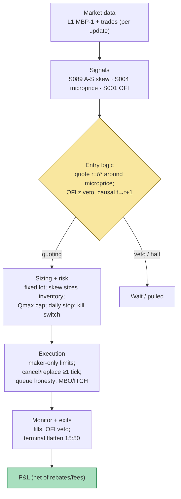

## Stage 121/200 — T021: Avellaneda–Stoikov Inventory Skew MM

*Batch TB3 · Strategy 21/100 · Signals S089, S004, S001*

### T1. One-line verdict

| | |
|---|---|
| **Style** | Intraday market making (liquidity provision): continuous two-sided quoting, always near-flat by the close |
| **Edge source** | The **bid–ask spread** (the gap between the best buy and sell price) plus maker **rebates** (exchange payments for resting limit orders), harvested while an inventory-control rule keeps the position from running away |
| **Typical holding period** | Seconds to minutes per round trip; inventory is managed continuously and flattened before the close |
| **Capacity hint** | Tiny for a remote operator (single-digit names, small size); institutional desks scale it with colocation, rebates, and hundreds of names — the edge is infrastructure, not the formula |
| **Build-or-buy in one line** | Build the simulator yourself on bought L1/MBO data (nobody sells you your risk aversion); do not expect a bought bot to print on a home connection — see T6 |

### T2. Full mechanics

**Universe & session.** Liquid US large-caps and equity-index futures, RTH, *example* window 09:35–15:55 ET. Exclusions (*examples*): halts, earnings-day names, quoted spread > 3 ticks (a **tick** is the $0.01 minimum price increment), ADV < ~1M shares. Tight, deep books only.

**Entry rule.** There is no discrete "entry signal" — the strategy is *always quoting*. On every top-of-book update (event *t*), using only data ≤ *t*:

1. Compute the fair value as the **microprice** (S004): the book-imbalance-weighted expectation of the next mid-price, $M_t = m_t + G^*(X_t)$, where $m_t$ is the mid-price (average of best bid and ask) and $X_t$ is the imbalance state. Operationally this chapter uses the first-order proxy $M_t \approx m_t + (s_t/2)\cdot I_t$ with spread $s_t$ and queue imbalance $I_t$ — a reconstruction, labeled as such.
2. Compute the **reservation price** (S089) — your *personal* fair value, the mid shifted against your inventory: $$r(s,q,t) = s - q\,\gamma\sigma^2(T-t)$$ with inventory $q$ (shares, + = long), risk-aversion $\gamma$, mid volatility $\sigma$, and remaining session time $T-t$. Long inventory pushes $r$ below the fair value so the ask gets cheaper (inviting sellers to take you out of the long) and the bid backs away; short inventory mirrors this.
3. Compute the optimal total spread (S089): $$\delta_a + \delta_b = \gamma\sigma^2(T-t) + \frac{2}{\gamma}\ln\!\left(1+\frac{\gamma}{\kappa}\right),\qquad \delta^* = \tfrac{1}{2}(\delta_a+\delta_b)$$ where $\kappa$ is the book-depth parameter governing how fast fill arrivals decay with quote distance. Quote $p_b = r - \delta^*$, $p_a = r + \delta^*$ (rounded to ticks).
4. **Toxicity veto** (S001): compute the rolling depth-normalized OFI (**order-flow imbalance** — the signed running tally of demand vs supply at the touch, S001) z-score over the last 6 updates (*example* window). If $z < -1.5$ (*example*) while resting on the bid (flow sharply sell-heavy), pull the bid; mirror for the ask at $z > +1.5$. This is the cheap substitute for the VPIN gate used in T022 — one line of code that catches slow toxic drifts.
5. **Causal timing:** a quote computed at event *t* can be filled no earlier than *t+1*; the mid used must be current — a stale mid is a free option for fast takers.

**Exit rule.** Exits are (a) fills — every fill is an exit leg of inventory — and (b) the **terminal liquidation**: flatten at the touch (the best bid if selling, the best ask if buying) by 15:50 ET (*example*), paying half-spread + taker fee. Also: **time stop** (last 10 min, exits only); **signal exit** (OFI veto 30+ updates → pull both sides, flatten); **stop-loss** (below).

**Position sizing.** The model sizes *itself* through the skew: inventory, not order quantity, is the control variable. Quote size is fixed and small — 5–25 shares per quote (*example*), never more than ~5% of visible top-of-book depth (*example*) — because a maker that posts size gets adversely selected on size. Max per-name inventory $Q_{\max}$ = 20 shares (*example*; the worked example uses 5-share lots with $Q_{\max}=20$). Portfolio heat = Σ over names of $Q_{\max} \times$ price; *example* cap $250k gross on a $1M book (25%).

**Risk limits.** Daily loss stop: halt quoting if realized net P&L < −0.25% of capital (*example*). Per-name hard cap $Q_{\max}$: at the cap, pull the accumulating side. **Kill switch** (automated "stop everything"): feed stale > 500 ms (*example*), or 1-minute realized vol > 3× morning baseline (*example*) → cancel all, flatten at the touch, require manual re-arm. Session-end flat is mandatory — no overnight inventory (gap risk belongs to T090).

**Cost model.** Maker rebate +$0.0020/share, taker fee $0.0030/share (*examples*, maker–taker convention). Round trip ≈ quoted half-spread × 2; terminal liquidation costs half the spread plus the taker fee. No borrow cost (intraday, flat by close). Slippage: in simulation, fills are assumed only when the synthetic microprice touches the quote — queue position is *not* modeled on L1, labeled `simulated only — requires MBO/ITCH` (MBO = market-by-order data with per-order IDs; ITCH = Nasdaq's native order feed).

**Order/execution sketch.** Maker-only limit orders at the touch. Cancel/replace when the recomputed bid/ask differs from the resting quote by ≥ 1 tick, when inventory changes, or when the OFI veto fires. Never chase through the spread (no market orders except the terminal flatten and the kill-switch flatten). Participation cap: our quote ≤ 10% of visible depth at that price (*example*) — bigger and you *are* the book, which changes the fill dynamics the model assumes.

### T3. Signals it consumes

| Signal | Role | Logic |
|---|---|---|
| S089 — Avellaneda–Stoikov inventory skew | **Primary trigger** (quoting engine) | Sets $r$ and $\delta^*$ every update; the quotes *are* this signal |
| S004 — Microprice | **Fair-value input** | Replaces the raw mid as the center $s$ of the reservation price, so book asymmetry is priced into every quote |
| S001 — Order-flow imbalance | **Veto / filter** | Rolling OFI z-score; pull the resting side when flow turns sharply adverse (*example*: $z < -1.5$ pulls the bid) |

Combination logic (pseudocode, ≤25 lines):

```
on L1 update at event t (all inputs <= t):
    M  = microprice(mid, imbalance)            # S004 fair value
    r  = M - q * gamma * sigma^2 * (T - t)     # S089 reservation price
    hs = 0.5 * (gamma*sigma^2*(T-t) + (2/gamma)*ln(1 + gamma/kappa))
    bid, ask = tick_round(r - hs), tick_round(r + hs)
    z  = ofi_zscore(window=6)                   # S001 toxicity proxy
    if feed_stale(500ms) or sigma_spike(3x):   # kill switch
        cancel_all(); flatten_at_touch(); halt()
    if abs(q) >= QMAX: pull accumulating side
    if z < -1.5 and resting_side == BID: pull bid      # OFI veto
    if z > +1.5 and resting_side == ASK: pull ask
    if quote_moved >= 1 tick or q changed: cancel/replace bid & ask
    # fills (event t+1 earliest) update q and cash; rebate on maker fills
at 15:50 ET: stop quoting; flatten remainder at touch (taker fee)
```
### T4. Worked example — numbers + P&L (SYNTHETIC)

Synthetic large-cap XYZ, $100 price scale, 16 quote updates over a normalized session ($T=1.0$). **Seed: 121** (`rng = np.random.default_rng(121)` in `batches/TB3/plot_T021.py`; the chart plots exactly these numbers). All parameters are *examples*: $\gamma=0.10$, $\kappa=100$/$, $\sigma=0.30$ $/\sqrt{\tau}$, lot = 5 shares, $Q_{\max}=20$ shares, maker rebate $0.0020$/share, taker fee $0.0030$/share, OFI veto at $z<-1.5$. A fill is assumed when the microprice touches the prior update's quote (fill rule is `simulated only — requires MBO/ITCH` for queue honesty). Fair value $M$ = mid + $0.01 \times I$ (the S004 first-order proxy). Reservation price $r = M - q\gamma\sigma^2\tau$; half-spread $\delta^* \approx 0.014$–$0.015$ early in the session (about 1.5 ticks).

| # | t | mid | I | M | q(before) | r | bid / ask | OFI z | event | q(after) | cash Δ | cash cum |
|---|---|---|---|---|---|---|---|---|---|---|---|---|
| 1 | 0.00 | 99.999 | +0.2 | 100.001 | +0 | 100.0005 | 99.99 / 100.02 | — | start | +0 | +0.000 | +0.000 |
| 2 | 0.07 | 100.017 | +0.4 | 100.021 | +0 | 100.0205 | 100.01 / 100.03 | 0.00 | SELL 5 @ 100.02 (ask lifted) | −5 | +500.110 | +500.110 |
| 3 | 0.13 | 100.037 | +0.5 | 100.042 | −5 | 100.0806 | 100.07 / 100.09 | 0.00 | SELL 5 @ 100.03 (ask lifted) | −10 | +500.160 | +1000.270 |
| 4 | 0.20 | 100.014 | +0.3 | 100.017 | −10 | 100.0885 | 100.07 / 100.10 | −0.65 | BUY 5 @ 100.07 (bid hit) | −5 | −500.340 | +499.930 |
| 5 | 0.27 | 100.009 | +0.1 | 100.010 | −5 | 100.0428 | 100.03 / 100.06 | −1.46 | BUY 5 @ 100.07 (bid hit) | +0 | −500.340 | −0.410 |
| 6 | 0.33 | 99.994 | −0.2 | 99.992 | +0 | 99.9915 | 99.98 / 100.00 | −1.76 | no fill — OFI veto (bid pulled) | +0 | +0.000 | −0.410 |
| 7 | 0.40 | 99.981 | −0.4 | 99.977 | +0 | 99.9768 | 99.96 / 99.99 | −1.69 | no fill — OFI veto (bid pulled) | +0 | +0.000 | −0.410 |
| 8 | 0.47 | 99.998 | −0.3 | 99.995 | +0 | 99.9955 | 99.98 / 100.01 | −0.31 | SELL 5 @ 99.99 (ask lifted) | −5 | +499.960 | +499.550 |
| 9 | 0.53 | 100.044 | +0.1 | 100.045 | −5 | 100.0662 | 100.05 / 100.08 | 1.11 | SELL 5 @ 100.01 (ask lifted) | −10 | +500.060 | +999.610 |
| 10 | 0.60 | 100.048 | +0.3 | 100.051 | −10 | 100.0868 | 100.07 / 100.10 | 1.49 | BUY 5 @ 100.05 (bid hit) | −5 | −500.240 | +499.370 |
| 11 | 0.67 | 100.041 | +0.5 | 100.046 | −5 | 100.0615 | 100.05 / 100.07 | 1.27 | BUY 5 @ 100.07 (bid hit) | +0 | −500.340 | −0.970 |
| 12 | 0.73 | 100.025 | +0.4 | 100.029 | +0 | 100.0287 | 100.02 / 100.04 | 0.40 | BUY 5 @ 100.05 (bid hit) | +5 | −500.240 | −501.210 |
| 13 | 0.80 | 99.996 | +0.2 | 99.998 | +5 | 99.9885 | 99.98 / 100.00 | −0.56 | BUY 5 @ 100.02 (bid hit) | +10 | −500.090 | −1001.300 |
| 14 | 0.87 | 100.015 | +0.0 | 100.015 | +10 | 100.0028 | 99.99 / 100.01 | −1.56 | SELL 5 @ 100.00 (ask lifted) | +5 | +500.010 | −501.290 |
| 15 | 0.93 | 100.039 | +0.2 | 100.041 | +5 | 100.0381 | 100.03 / 100.05 | −0.62 | SELL 5 @ 100.01 (ask lifted) | +0 | +500.060 | −1.230 |
| 16 | 1.00 | 100.019 | +0.1 | 100.020 | +0 | 100.0203 | 100.01 / 100.03 | −0.61 | BUY 5 @ 100.03 (bid hit) | +5 | −500.140 | −501.370 |
| — | — | — | — | — | — | — | — | — | TERMINAL: sell 5 @ 100.01 (taker) | +0 | +500.035 | **−1.335** |

Line-by-line P&L walk (cash Δ already includes the $0.01 rebate per 5-share fill):

- **Fills #2–#3 (the good leg):** sold 5 @ 100.02 then 5 @ 100.03 as the tape rallied — +$500.110, +$500.160. The ask lifted into strength: the textbook maker fill.
- **Fills #4–#5 (the adverse leg):** short 10, the reservation price moved *up* (r = 100.0885 at #4), so the bid stayed aggressive at 100.07 — and was hit twice while the mid fell from 100.037 to 100.009 (−$500.340 each). **Adverse selection** in miniature: the fill arrived precisely because the tape moved against the quote. Pair #2/#4: sold 100.02, bought 100.07 → −$0.246 net.
- **Steps #6–#7 (the veto working):** OFI z hit −1.76/−1.69 (below the −1.5 *example* threshold) as the book sold off; the bid was pulled and the mid fell ~1.3 more ticks with no fill — the S001 veto demonstrably avoided two would-be adverse buys.
- **Fills #8–#16 (the chop):** the skew re-centers but the mid mean-reverts inside the spread band faster than quotes can harvest it — buys at 100.05–100.07, sells at 99.99–100.01. Each round trip loses ~a tick to whipsaw while earning only the $0.004/share round-trip rebate.
- **Terminal:** long 5 flattened at 100.01 (taker, $0.015 fee): +$500.035. **Final net P&L: −$1.335** on 14 fills.

**Where the example is optimistic.** (1) Fills on any microprice touch — no queue position, no partials. On L1 data this is the largest source of inflated maker backtests; honest fills need MBO/ITCH replay. (2) Sub-tick skew (r shifts of $0.01–$0.04) is rounded into quote moves a real desk often couldn't make. (3) Zero latency — a 30–150 ms delay worsens fills #4/#5 further. (4) The OFI series is scripted, not estimated; real SIP-based OFI is noisier. (5) One quiet tape, no jumps, no queue competition.

### T5. Data & infra — what must run

**Feed inventory.** Minimum honest stack: L1 top-of-book (MBP-1) plus trades with aggressor side, per symbol — the reservation math needs only mid, spread, and imbalance, but the *fill simulator* needs MBO (market-by-order) history for a handful of liquid names to calibrate queue position honestly. Named options: Databento MBP-1/MBO (Tier 2), Alpaca or Polygon SIP L1 (Tier 1, research-only fills). Corporate actions, halts, and DST/half-day calendars must be normalized before the open.

**Pipeline schedule.** Pre-open: estimate $\sigma$ (rolling realized vol) and $\kappa$ (fill-intensity decay) per symbol; check kill-switch thresholds. Intraday: event-driven quote engine with a 1-second watchdog that pulls quotes if no book update arrives. Post-close: markout report — every fill marked to mid at +1 s, +5 s, +30 s. The **markout** (a fill's P&L measured after the fact) is the adverse-selection diagnostic; without it you lie to yourself about edge.

**Storage.** Per `notes/cost-model.md` §4: L1 ≈ 2–8 GB/symbol-day, MBO ≈ 10–40 GB/symbol-day in Parquet. A 20-symbol L1 universe ≈ 40–160 GB/day — keep 60 days on cold storage in per-symbol daily files, or downsample to bars for history.

**M5 Max feasibility.** Research and simulation: **feasible, Tier H (60–200 h → $9,000–$30,000 loaded-cost estimate at $150/hr)** per cost-model §5 — the heavy half is the MBO book + queue-aware fill simulator (80–150 h alone), not the A–S formulas (an afternoon). Throughput per cost-model §2: a Python event loop handles ~100–500k events/sec (fine for ≤20 symbols of L1); a Rust loop does 5–50M events/sec (needed for MBO replay). RAM per cost-model §3: live L1 state for 20 symbols < 100 MB; decoded MBO replay buffers 10–80 GB — fits the 128 GB working budget with care. **Live market making from this machine: not viable** — the bottleneck is not compute but the ~30–150 ms round trip to the matching engine vs ~1–50 µs for colocated desks (see T8). The Mac is a flight simulator with a full aerodynamic model, not the race.

**Feed-outage safe mode.** On any feed gap > 500 ms (*example*): cancel all resting quotes immediately, flatten inventory at the touch (taker), block new quotes until the feed has been healthy for 5 consecutive seconds (*example*), and page the operator. On kill-switch trip: same, plus require manual re-arm. Never "quote through" a stale book — a stale quote is a free option written to the fastest taker (see T8).

### T6. Buy vs build

| Option | What you get | Indicative price | What buying gains | What buying loses |
|---|---|---|---|---|
| Tier-0: Alpaca IEX / Stooq delayed L1 + own simulator | Free quotes for research | ~$0 | Zero data cost to learn the mechanics | No honest fills; SIP timestamps; research-only |
| Tier-1: Polygon Stocks Advanced / Alpaca SIP | Real-time SIP L1, corporate actions | ~$30–200/mo, indicative — verify before budgeting | Cheap live mid/imbalance for the quote math | Fill simulation still `simulated only`; no queue rank |
| Tier-2: Databento (MBP-1 live + MBO history) | Honest L1/L2/MBO, matching-engine timestamps | ~$200/mo + usage, indicative — verify before budgeting | Queue-aware fill sim; the only honest backtest input | Usage meter runs hot on MBO |
| Open-source: Hummingbot `avellaneda_market_making` | Working A–S implementation (crypto spot) with vol/liquidity estimators | ~$0 (open source) | Real code for the formulas + estimator patterns | Crypto venues, no equity colo story, retail latency class |
| Professional: colo rack + cross-connect + direct feeds | µs tick-to-trade, real queue priority | Rack ~$1.5k–5k+/mo per venue + data licenses (five figures/mo for equity depth), indicative — verify before budgeting | The only venue where the strategy is actually the product | Person-years + legal + capital; a different job |

**Verdict: build the simulator, buy the data, don't buy the strategy.** Build if your goal is learning, parameter research, or agent tooling: the formulas are public (T10), the estimators are yours to tune, and no vendor sells your $\gamma$. Buy Tier-2 data the moment you want honest fill simulation — you cannot build your way around not having MBO. The crossover to professional infrastructure only makes sense with measured, after-cost, out-of-sample edge *and* capital; a bought retail "MM bot" on a home connection is paying to be the market's inventory of last resort.

### T7. Success-ratio evidence

| Study / source | Market & period | Metric | Before/after cost | Caveat |
|---|---|---|---|---|
| Avellaneda & Stoikov (2008), *Quant. Finance* 8(3) | Stylized model (no fees, no competition) | A–S maximizes expected exponential utility of terminal wealth; inventory-skewed quotes cut terminal-inventory dispersion vs symmetric quoting | Before-cost; toy model | The paper documents a risk-management design, not a live P&L number — treat any "A–S Sharpe" quote as suspect |
| Gašperov & Begušić (2022), *PLOS One* ("A reinforcement learning approach to improve the performance of the Avellaneda-Stoikov market-making algorithm") | BTC-USD L2, 30 days (Dec 2020–Jan 2021) | Genetically calibrated A–S ("Gen-AS") vs RL variants on real L2 tape | After simulated costs (study design) | RL variants beat Gen-AS on risk-adjusted metrics on most days but with occasional outlier drawdowns; inventory control works, mean P&L is the price |
| Practitioner replications (GitHub; e.g. hftbacktest-based A–S studies) | Crypto L2 / simulated books | A–S reduces inventory variance ~3–9× vs naive quoting | Mixed; sims | Repos, not peer review; fill models vary |
| Budish, Cramton & Shim (2015), *QJE* 130(4) | US equities, millisecond direct-feed data | Latency-arbitrage rents are built into the continuous limit-order-book design; speed competition is the tax on stale quotes | n/a (market design) | This is the structural reason a slow quoter loses: the paper's rents are exactly what your resting quotes pay |

**After-cost honesty.** The literature's consistent message: A–S manages a trade-off; it does not print money. Raising $\gamma$ buys smaller inventory tails at the cost of mean P&L (the 2008 paper's sensitivity tables show mean profit sacrificed as $\gamma$ rises — *specific figures unverified, see T10*). Without rebates and colocation the economics are negative on liquid lit books: the rebate is often the only reason spread capture survives adverse selection.

**Capacity & decay.** For a remote operator, capacity on liquid names is effectively zero — you are last in queue at every price the fast makers also want. The "decay" is structural, not alpha decay: every millisecond of latency disadvantage is a permanent tax (Budish–Cramton–Shim). Institutional desks scale this because they *are* the fast makers, with rebates and flow filtering.

**Honest bottom line.** For a ≤$1M paper operation: build the A–S simulator on the M5 Max as a research and risk-taxonomy tool — it teaches reservation math, markouts, and why fills are toxic. Expect paper P&L to be flat-to-negative once fills are queue-honest; never post live two-sided quotes from this machine. For an institutional desk: A–S is a solved, commoditized quoting utility — the edge lives in toxicity estimation, queue modeling, rebates, and colocation, none of which the formula provides. Related: T085 (Resiliency Market Maker) layers A–S skew onto a resiliency fair value; T028 (Spread-Decomposition Router) prices the adverse-selection component the vanilla model ignores.

### T8. Failure modes

1. **Latency arbitrage against you.** Your quotes rest at prices from an already-old mid; fast takers hit the stale quote and the mid prints through. *Mitigation:* don't post live from a 30–150 ms connection; if you must, widen $\delta^*$ by a latency penalty and shorten quote lifetime.
2. **Toxic flow / jumps.** A–S has no jump term; a gap through your bid while already long is exactly the state the linear $r$ under-prices. *Mitigation:* hard $Q_{\max}$ caps, session-end liquidation penalty, OFI veto — accept you still eat the first jump.
3. **Inventory blowups from mis-estimated $\sigma$.** Vol estimated on a quiet window → skew too small in ticks → inventory random-walks into the cap. *Mitigation:* regime-aware $\sigma$; kill-switch on vol-regime change.
4. **Queue-position fill optimism.** Sim fills assume you get filled; reality is last-in-queue, so fills arrive disproportionately as the adverse move starts. *Mitigation:* MBO replay with explicit last-in-queue fill model; haircut sim fill rates ≥50% (*example*) in stress tests.
5. **Parameter drift ($\sigma$, $\kappa$ as constants).** The closed form assumes constants; live books need rolling estimates that lag regime changes. *Mitigation:* re-estimate on rolling windows; stress with $\sigma$ doubled, $\kappa$ halved.
6. **Rebate-regime change.** Rebates are a venue business decision; a cut flips unit economics overnight. *Mitigation:* keep rebate = 0 as a standing P&L sensitivity.
7. **Feed staleness / dead kill-switch.** A dead feed with live quotes is the worst state in market making. *Mitigation:* the 500 ms staleness watchdog (T2/T5); rehearse by killing the feed.
8. **Overfitting $\gamma$ to a quiet tape.** A $\gamma$ tuned on a calm month is far too aggressive for a stress day. *Mitigation:* calibrate on a panel with ≥1 stress episode; prefer the higher-$\gamma$ end of the plausible band.

### T9. Visuals


*Caption: T021 worked example (synthetic, seed 121). The "SYNTHETIC EXAMPLE" watermark is burned into the chart; all numbers match the T4 table.*

**V2-T Mermaid** — per-update granularity data flow:



### T10. Sources

1. Avellaneda, M. & Stoikov, S. (2008). "High-frequency trading in a limit order book." *Quantitative Finance* 8(3): 217–224. https://doi.org/10.1080/14697680701381228 (reservation price, optimal spread, fill-intensity framework).
2. Cont, R., Kukanov, A. & Stoikov, S. (2014). "The Price Impact of Order Book Events." *Journal of Financial Econometrics* 12(1): 47–88. arXiv:1011.6402 — https://arxiv.org/abs/1011.6402 (OFI definition behind the S001 veto).
3. Stoikov, S. (2018). "The micro-price: a high-frequency estimator of future prices." *Quantitative Finance* 18(12): 1959–1966. https://econpapers.repec.org/article/tafquantf/v_3a18_3ay_3a2018_3ai_3a12_3ap_3a1959-1966.htm (S004 fair-value anchor).
4. Gould, M. D. & Bonart, J. (2016). "Queue Imbalance as a One-Tick-Ahead Price Predictor in a Limit Order Book." arXiv:1512.03492 — https://arxiv.org/abs/1512.03492 (why the microprice leans with the queue).
5. Budish, E., Cramton, P. & Shim, J. (2015). "The High-Frequency Trading Arms Race: Frequent Batch Auctions as a Market Design Response." *Quarterly Journal of Economics* 130(4): 1547–1621. https://ideas.Repec.org/a/oup/qjecon/v130y2015i4p1547-1621.html (latency-arbitrage rents: the structural cost of slow quoting).
6. Gašperov, B. & Begušić, S. (2022). "A reinforcement learning approach to improve the performance of the Avellaneda-Stoikov market-making algorithm." *PLOS One*. https://journals.plos.org/plosone/article?id=10.1371/journal.pone.0277042 (Gen-AS calibration + RL variants on 30 days of BTC-USD L2; inventory-control findings).
7. Hummingbot documentation — `avellaneda_market_making` strategy (open-source production wrapper with vol/liquidity estimators). https://hummingbot.org/strategies/v1-strategies/avellaneda-market-making/ (practitioner implementation reference).

**Unverified leads** (Grok's Q-TB3 claims I could not independently verify — do not treat as facts):
- The 2008 paper's γ-sensitivity figures (0.86% / 6.35% / 48.76% mean-profit sacrifice; inventory SD 8.7→2.8 / 9.1→1.9; profit-to-dispersion 1.5–2.1×) — plausible as paper-table values, not re-verified.
- Gen-AS vs RL scorecards ("RL beat Gen-AS on Sharpe 24/30 days, Sortino 25/30") and the "−28.7% annualized, Sharpe −2.63, max DD ~20.6%" vanilla-A–S crypto holdout — chatbot-sourced, not re-verified.
- The 2025 imbalance-maker study ("imbalance strategies −0.49, naive makers −0.43, with-cancel −0.49") and the German RMM study figures (Sharpe ~17.9, 1.76 bps flow cost) — chatbot-sourced, not re-verified.
- Two Grok passages were truncated mid-sentence in the source capture (the A–S failure-regime paragraph and the "Empirics on public-book makers" paragraph) — anything they might have contained is not used.

*Source log: Grok answered Q-TB3-1..3 (2026-09-10); all claims independently verified or labeled unverified.*
