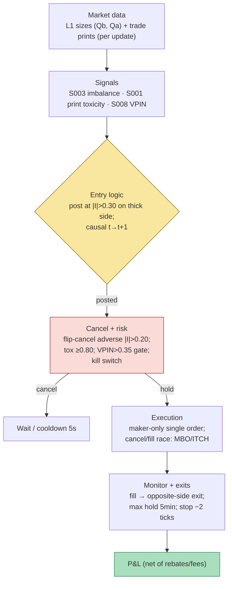

## Stage 122/200 — T022: Queue-Imbalance Maker with Toxicity Cancel

*Batch TB3 · Strategy 22/100 · Signals S003, S001, S008*

### T1. One-line verdict

| | |
|---|---|
| **Style** | Intraday market making (liquidity provision): single resting limit order at the touch, flipped or canceled as the queue turns |
| **Edge source** | **Queue imbalance** (the top-of-book size skew, S003) predicts the next tick's direction; the maker posts on the thick side and cancels when the queue or recent prints turn toxic |
| **Typical holding period** | Seconds to a few minutes; one position at a time, flat between trades |
| **Capacity hint** | Small — one quote, one name at a time per instance; scales horizontally across names, never vertically in size (size is what gets you adversely selected) |
| **Build-or-buy in one line** | Build the logic (it is ~30 lines), buy the L2/trade data; the toxicity-cancel rules are yours to calibrate, no vendor sells them — see T6 |

### T2. Full mechanics

**Universe & session.** Liquid US large-caps quoting a 1-tick spread most of the day, RTH, *example* window 09:35–15:55 ET. Exclusions (*examples*): spreads > 2 ticks, halts, earnings days, the first/last 5 minutes. The edge needs a stable tick grid — a 5-tick spread means the imbalance signal is drowned in spread noise.

**Entry rule.** On every book update (event *t*), using only data ≤ *t*:

1. Compute queue imbalance (S003): $$I_t = \frac{Q_t^b - Q_t^a}{Q_t^b + Q_t^a}$$ where $Q_t^b, Q_t^a$ are the resting sizes at the best bid and ask. $I_t \in [-1, +1]$: +1 means all displayed size sits on the bid (buyers stacked, price pressure up).
2. **Post** a single resting limit order (maker) when $|I_t| > 0.30$ (*example*): bid at the touch (the best bid price) if $I_t > +0.30$, ask at the touch (the best ask price) if $I_t < -0.30$. The quote sits *with* the thick side — the side the next tick is statistically likeliest to favor (Gould & Bonart 2016: imbalance predicts the one-tick-ahead mid move).
3. **Causal timing:** a quote posted at *t* can be filled no earlier than *t+1*; the imbalance read must be the current print's book state, not a smoothed lagging average.

**Cancel rules (the strategy's actual edge).** A resting maker order is a standing offer to be adversely selected; the cancels are the risk system:
- **Flip-cancel:** if the imbalance flips against the resting side with $|I_t| > 0.20$ (*example*) adverse, cancel immediately. A bid resting into a book that just went ask-heavy is about to be sold into a falling tape.
- **Toxicity cancel:** track the last 4 trade prints (a **print** is an executed trade report; signs from the Lee–Ready tick rule on SIP, or exchange aggressor flags on direct feeds). If ≥ 80% (*example*: 4-print toxicity fraction ≥ 0.80) of recent prints are adverse to the resting side (sells hitting your bid, buys lifting into your ask), cancel — informed flow is walking into you.
- **Regime gate (S008):** compute VPIN (Volume-Synchronized Probability of Informed Trading), $\mathrm{VPIN}_t = \sum OI_\tau / (nV)$ — the fraction of volume that is one-sided across the last $n$ volume buckets (*example* $n=50$). If VPIN > 0.35 (*example*), post no new quotes and cancel resting ones: the tape is toxic, stand down.

**Exit rule.** Exits are: (a) the fill itself — one 100-share position (*example*), then the exit is a resting limit order on the opposite side at/near the touch (maker, earning the rebate twice); (b) **max hold** 5 minutes (*example*) then flatten at the touch; (c) **stop** −2 ticks from entry (*example*); (d) session-end flatten 15:50 ET. The worked example uses the resting-exit variant: buy filled, then a resting ask, filled — a pure maker round trip.

**Position sizing.** Fixed 100 shares per trade (*example*), one position max, inventory cap ±2 lots (±200 shares, *example*) as a hard abort: if somehow filled twice on the same side, flatten immediately. Never scale up to "improve" a fill — size is the adverse-selection surface.

**Risk limits.** Daily loss stop −0.20% of capital (*example*). Per-trade stop −2 ticks. **Kill switch:** feed stale > 500 ms (*example*) or a trade-through (a print outside the quoted spread, signaling a broken book view) → cancel all, flatten, manual re-arm.

**Cost model.** Maker rebate +$0.0020/share (*example*) — the example earns two rebates ($0.40 on 200 shares). No taker fees in the resting-exit path; max-hold/session-end flattens pay half-spread + $0.0030/share taker fee (*example*). Spread capture per round trip ≈ 4 ticks in the worked example ($0.04 on a $100 name).

**Order/execution sketch.** Maker-only single limit order, cancel/replace on any threshold cross. Never re-post into a just-canceled level for 5 seconds (*example* cooldown — the toxicity that canceled you is usually still there). Participation: our 100 shares ≤ 10% of the touch size (*example*); if the touch is thinner, reduce size or skip. Fill honesty on L1: `simulated only — requires MBO/ITCH` — the sim assumes a touch fills you; reality depends on queue position.

### T3. Signals it consumes

| Signal | Role | Logic |
|---|---|---|
| S003 — Queue imbalance | **Primary trigger** | $I_t$ sign and magnitude decide post/hold/cancel; the quote always leans with the thick side |
| S001 — Order-flow imbalance / print toxicity | **Veto / cancel** | 4-print adverse fraction ≥ 0.80 (*example*) cancels the resting order — informed prints walking into the quote |
| S008 — VPIN | **Regime gate** | VPIN > 0.35 (*example*) blocks all new quotes; toxicity regime, not a per-trade signal |

Combination logic (pseudocode, ≤25 lines):

```
on book/trade update at event t (all inputs <= t):
    I = (Qb - Qa) / (Qb + Qa)                       # S003
    tox = adverse_fraction(last 4 prints, side)     # S001-flavored veto
    vpin = sum(order_imbalance) / (n * V)           # S008 regime
    if feed_stale(500ms) or trade_through:          # kill switch
        cancel_all(); flatten(); halt()
    if vpin > 0.35: cancel_all(); return            # regime gate
    if resting:
        if adverse |I| > 0.20 or tox >= 0.80: cancel(); cooldown(5s)
        elif fill: q += side*100; post opposite-side exit at touch
    else:
        if cooldown_over and |I| > 0.30:
            post bid @ touch if I > 0 else ask @ touch
    # position exits: max_hold 5min / stop -2 ticks / 15:50 flatten
```
### T4. Worked example — numbers + P&L (SYNTHETIC)

Synthetic large-cap XYZ, $100 price scale, 12 book updates. **Seed: 122** (`np.random.default_rng(122)` in `batches/TB3/plot_T022.py`; the chart plots exactly these numbers). All parameters are *examples*: post at $|I|>0.30$, flip-cancel at adverse $|I|>0.20$, 4-print toxicity threshold 0.80, VPIN regime cap 0.35, 100 shares, ±2-lot inventory cap, maker rebate $0.0020$/share. Fills assumed on mid touch of the quote — `simulated only — requires MBO/ITCH`. Prints: `+` = buy print, `−` = sell print. Tox = fraction of last 4 prints adverse to the resting side.

| # | mid | Qb, Qa | I | action | resting | prints | Tox | VPIN | q | cash cum |
|---|---|---|---|---|---|---|---|---|---|---|
| 1 | 99.995 | 800, 400 | +0.33 | POST bid @ 99.98 | bid | + + + − | 0.50 | 0.18 | +0 | +0.00 |
| 2 | 99.999 | 900, 350 | +0.44 | hold bid @ 99.98 | bid | + + + + | 1.00 | 0.20 | +0 | +0.00 |
| 3 | 100.010 | 750, 500 | +0.20 | hold bid @ 99.98 | bid | + + − + | 0.50 | 0.22 | +0 | +0.00 |
| 4 | 100.013 | 400, 700 | −0.27 | CANCEL bid (toxicity trigger) | stay out | − − − + | 0.50 | 0.25 | +0 | +0.00 |
| 5 | 99.997 | 300, 900 | −0.50 | POST ask @ 100.01 | ask | − − − − | 1.00 | 0.28 | +0 | +0.00 |
| 6 | 99.990 | 350, 800 | −0.39 | hold ask @ 100.01 | ask | − − − + | 0.50 | 0.26 | +0 | +0.00 |
| 7 | 99.989 | 600, 550 | +0.04 | hold ask @ 100.01 | ask | − + + + | 0.50 | 0.22 | +0 | +0.00 |
| 8 | 99.999 | 850, 400 | +0.36 | CANCEL ask (toxicity trigger); POST bid @ 99.99 | bid | + + + + | 1.00 | 0.24 | +0 | +0.00 |
| 9 | 100.018 | 900, 300 | +0.50 | hold bid @ 99.99 | bid | + + + + | 1.00 | 0.20 | +0 | +0.00 |
| 10 | 100.021 | 950, 280 | +0.54 | hold bid @ 99.99 → FILL: buy 100 @ 99.99 (maker, +$0.20 rebate) | flat | − + + − | 0.00 | 0.18 | +100 | −9998.80 |
| 11 | 100.021 | 900, 320 | +0.48 | POST ask (exit) @ 100.03 | ask (exit) | + + + − | 0.50 | 0.19 | +100 | −9998.80 |
| 12 | 100.031 | 850, 350 | +0.42 | hold ask (exit) @ 100.03 → FILL: sell 100 @ 100.03 (maker, +$0.20 rebate) | flat | + + − − | 0.00 | 0.20 | +0 | **+4.40** |

Line-by-line P&L walk (rebates included in cash):

- **Step 1 (the post):** $I=+0.33 > 0.30$ → bid @ 99.98, one tick under the 99.99 mid. Thick-side posting: 800 vs 400 at the touch.
- **Steps 2–3 (the hold):** imbalance stays bid-side; the quote rests. Note step 2: Tox hits 1.00 (four straight buy prints) — but prints *with* the resting bid are not adverse, so no cancel. The toxicity rule is directional, not absolute.
- **Step 4 (cancel #1 — the save):** the book flips to $I=-0.27$ (400 vs 700). Adverse $|I| > 0.20$ → cancel the bid. The mid then falls 99.997 → 99.990 over steps 5–6: had the bid rested at 99.98 it would have been filled ~1.4 ticks above the falling mid — the classic adverse fill, avoided.
- **Step 5 (the flip):** $I=-0.50$ → post ask @ 100.01. The strategy is side-agnostic; it follows the thick side.
- **Steps 6–7 (patience):** imbalance fades to +0.04 — below the post threshold but the resting ask stays (the cancel needs *adverse* 0.20, not neutrality; churning cancels on noise is its own cost).
- **Step 8 (cancel #2 + re-post):** book flips hard to $I=+0.36$ with Tox = 1.00 (four straight buys into the resting ask) → cancel the ask, immediately post bid @ 99.99 ($|I|>0.30$). The ask would have been lifted into a rising tape (mid 99.999 → 100.018): cancel #2 avoided a short fill 2+ ticks underwater.
- **Step 10 (the fill):** buy 100 @ 99.99 with the mid at 100.021 — filled 3.1 ticks *below* the mid as the tape rose through the quote. Cash −$9,998.80 = −(100 × 99.99) + $0.20 rebate. This is the favorable fill the strategy is built to harvest: the thick side held and the price drifted up through the resting bid.
- **Steps 11–12 (the maker exit):** post ask @ 100.03, filled as the mid reaches 100.031. Cash +$10,003.20 = +(100 × 100.03) + $0.20 rebate. **Gross spread capture: (100.03 − 99.99) × 100 = $4.00; two rebates $0.40; final net P&L: +$4.40.**

**Where the example is optimistic.** (1) Fills on any mid touch — no queue position, no partials; a 100-share quote at a 900-share touch is realistically mid-queue, filled only if the level trades through. (2) Cancels are instantaneous; in reality the step-4/step-8 fills can arrive *before* the cancel is processed — the cancel/fill race is the strategy's true risk and is not modeled. (3) The tape gifts the best possible outcome: the entry fill at the local low and the exit at the local high, with the mid drifting favorably both times. (4) Prints and toxicity series are scripted; real print-sign classification (Lee–Ready on SIP) mislabels a meaningful share of prints. (5) VPIN never approaches the 0.35 cap in this tape — the regime gate is untested here.

### T5. Data & infra — what must run

**Feed inventory.** Minimum honest stack: L1 top-of-book with sizes (MBP-1) + trade prints with side — imbalance needs only $Q^b, Q^a$ at the touch, toxicity needs prints, VPIN needs volume buckets (bulk classification needs no per-trade signs). MBO history for a few names to calibrate queue position and the cancel/fill race. Named options: Databento MBP-10 + trades (Tier 2); Polygon/Apaca SIP L1 + trades (Tier 1, research fills only); LOBSTER academic (limit-order-book reconstructions with queue detail — ideal for calibrating the fill model offline). Corporate-action/halt calendars as in T021.

**Pipeline schedule.** Pre-open: calibrate post/cancel thresholds per symbol on recent L2 (the 0.30/0.20/0.80 are *examples*, not constants — spreads and depth vary by name); estimate VPIN bucket size $V$ (typical: 1/50 of average daily volume, *example*). Intraday: event-driven single-order state machine (trivial compute — a Python loop at 100–500k events/sec per cost-model §2 handles dozens of names; the cost is data, not CPU). Post-close: markout report at +1 s / +5 s / +30 s per fill and per *cancel* (did the cancel avoid an adverse fill? measure it or the rule is superstition).

**Storage.** L1 + trades ≈ 2–8 GB/symbol-day (cost-model §4); MBP-10 ≈ 10–50k events/sec busy per name. Research universe of 20 names × 60 days ≈ 2.4–9.6 TB cold — same posture as T021, lighter because depth beyond the touch is optional.

**M5 Max feasibility.** Research and simulation: **feasible, Tier M (40–100 h → $6,000–$15,000 loaded-cost estimate at $150/hr)** per cost-model §5 — the state machine is an afternoon; the work is threshold calibration across names and the MBO fill/cancel-race model. RAM trivial (< 1 GB live for 20 names). **Live single-quote making from this machine: marginal** — the strategy lives or dies on cancel latency, and 30–150 ms vs colocated µs means the cancel/fill race is structurally lost on the most toxic prints (the ones that matter). Paper-trade it here; don't point it at a live venue.

**Feed-outage safe mode.** Feed gap > 500 ms (*example*) or any trade-through: cancel the resting order, flatten at the touch, block re-posting until 5 s of healthy feed (*example*), manual re-arm after any kill-switch trip. A resting quote through a stale book is the same free option as in T021.

### T6. Buy vs build

| Option | What you get | Indicative price | What buying gains | What buying loses |
|---|---|---|---|---|
| Tier-0: Alpaca IEX / Stooq delayed L1 + trades | Free top-of-book + prints | ~$0 | Learn imbalance/cancel mechanics for free | No honest fills; research-only |
| Tier-1: Polygon / Alpaca SIP L1 + trades | Real-time sizes and prints | ~$30–200/mo, indicative — verify before budgeting | Live $I_t$ and toxicity for the state machine | Queue position still `simulated only` |
| Tier-2: Databento (MBP-10 + trades, MBO history) | Full depth, matching-engine timestamps | ~$200/mo + usage, indicative — verify before budgeting | Calibrate the cancel/fill race honestly | Usage meter on history pulls |
| Academic: LOBSTER | Reconstructed LOB with queue detail | Hundreds/year academic, indicative — verify before budgeting | Best offline calibration data for fill modeling | Academic license; not a live feed |
| Professional: colo + direct feeds | µs cancel path | Rack ~$1.5k–5k+/mo + data licenses, indicative — verify before budgeting | Win the cancel/fill race that defines the strategy | Institutional undertaking |

**Verdict: buy the data, build the ~30-line state machine.** The logic is not the moat — the calibrated thresholds and the measured cancel/fill-race statistics are, and both come from your data, not a vendor's. LOBSTER is the highest-value research purchase: calibrate fills offline before spending a dollar on live data. Never buy a "queue imbalance bot" — its thresholds were tuned on someone else's venue, latency, and fee schedule.

### T7. Success-ratio evidence

| Study / source | Market & period | Metric | Before/after cost | Caveat |
|---|---|---|---|---|
| Gould & Bonart (2016), arXiv:1512.03492 | LOB one-tick-ahead prediction | Queue imbalance predicts the direction of the next mid-price move; the imbalance-conditioned predictor beats the last-price baseline | Before-cost (signal study) | Direction, not profit — no fills, no fees, no cancel race |
| Cont, Kukanov & Stoikov (2014), *J. Financial Econometrics* 12(1) | 50 US stocks, 2008 | OFI explains short-horizon mid-price moves; a linear OFI model captures most of the predictable component | Before-cost (regression) | Price impact ≠ maker P&L; the paper measures the tape, not the quoter |
| Easley, López de Prado & O'Hara (2011–12), VPIN working paper | Futures/equities toxicity | VPIN spikes precede liquidity-induced volatility; volume-clock toxicity is measurable without trade classification | Before-cost (metric) | Predictive value for crashes is debated — see next row |
| Andersen & Bondarenko (2014), *J. Financial Markets* 17 | Critique of VPIN | VPIN's predictive power attenuates under alternative specifications; metric ≠ tradeable signal | n/a (critique) | This is why T022 uses VPIN as a *regime gate*, not an entry trigger |
| Budish, Cramton & Shim (2015), *QJE* 130(4) | US equities, ms data | Latency-arbitrage rents embedded in continuous-book design | n/a (market design) | The structural reason cancels lose the race from 30+ ms away |

**After-cost honesty.** The verified literature supports the *signal* (imbalance → next-tick direction; OFI → short-horizon moves) and documents the *tax* (latency arbitrage, toxicity). What it does not support is a maker P&L number for a retail-latency imbalance quoter — every P&L figure in Grok's answer (the "imbalance strategies −0.49 / naive makers −0.43" study, the 70–85% classification rates, the 30–150 ms latency bands) is an **unverified lead**, not a sourced fact. The honest empirical prior: the signal is real, the fills are the whole game, and the fills are exactly what a backtest on L1 cannot show you.

**Capacity & decay.** Capacity is one quote per name per instance — horizontal scaling across names, each instance's edge independent of the others. Decay risk is competition: as more makers condition on the same public imbalance, the thick side gets crowded, queue priority shortens the fill window, and the toxicity-cancel becomes table stakes rather than edge. The signal itself (Gould–Bonart) is a book-mechanical regularity, slow to decay; its *monetization* decays with the arms race.

**Honest bottom line.** For a ≤$1M paper operation: build this on the M5 Max as the cleanest possible laboratory for adverse selection — the cancel rules make the toxicity visible trade by trade. Expect paper P&L to be positive only while fills are touch-assumed; re-run with a last-in-queue fill model and a 50 ms cancel delay before believing any number. Never run the live single-quote version from this machine. For an institutional desk: imbalance-conditioned quoting with toxicity cancels is standard plumbing inside larger MM stacks (it rhymes with T021's A–S engine and T085's resiliency maker); the differentiator is the cancel path and queue modeling, not the 0.30 threshold. Related: T021 (A–S inventory skew — continuous two-sided vs this chapter's single-quote flip); T085 (Resiliency MM — fair-value-anchored quoting).

### T8. Failure modes

1. **Imbalance whipsaw.** $I_t$ oscillates around the threshold; the quote flips bid→ask→bid, paying two spreads' worth of adverse fills. *Mitigation:* hysteresis band (post at 0.30, flip-cancel at 0.20 adverse — already in the design); cooldown after cancels.
2. **The cancel/fill race.** The toxic print that should trigger your cancel fills you first — the sim's instantaneous cancel is the most dangerous optimism in the chapter. *Mitigation:* model an explicit cancel latency (≥50 ms *example* stress) in the fill simulator; measure realized "canceled too late" fills.
3. **Print-sign misclassification.** Lee–Ready on SIP mislabels prints; toxicity computed on wrong signs cancels good quotes and keeps bad ones. *Mitigation:* use exchange aggressor flags on direct feeds; haircut the toxicity threshold's value in research.
4. **Spoofed imbalance.** Large size appears on one side and vanishes before trading (illegal, but the tape shows it). The quoter posts into phantom depth. *Mitigation:* require imbalance persistence (2+ consecutive updates, *example*) before posting; size-weighted (not count-weighted) imbalance.
5. **VPIN false calm.** VPIN is backward-looking; a scheduled-news jump arrives with VPIN still low. *Mitigation:* hard news blackout windows; the regime gate is a complement to, not a substitute for, the halt/earnings exclusions.
6. **Spread-regime change.** The 1-tick spread widens to 3+; the imbalance edge is now smaller than the spread cost and the thresholds misfire. *Mitigation:* spread filter (no quotes if spread > 2 ticks, *example*); re-calibrate thresholds per spread regime.
7. **Queue-position fill optimism.** Touch-assumed fills overstate fill rates ~2–5× vs last-in-queue reality. *Mitigation:* MBO/LOBSTER-calibrated queue model; report P&L under both fill assumptions.
8. **Threshold overfitting.** 0.30/0.20/0.80 tuned on one quiet month fail on volatile tapes (whipsaw) or miss real signals (too strict). *Mitigation:* calibrate per symbol on a panel including a stress episode; prefer wider hysteresis over tighter thresholds.

### T9. Visuals


*Caption: T022 worked example (synthetic, seed 122). The "SYNTHETIC EXAMPLE" watermark is burned into the chart; all numbers match the T4 table.*

**V2-T Mermaid** — per-update granularity data flow:



### T10. Sources

1. Gould, M. D. & Bonart, J. (2016). "Queue Imbalance as a One-Tick-Ahead Price Predictor in a Limit Order Book." arXiv:1512.03492 — https://arxiv.org/abs/1512.03492 (S003's predictive basis: imbalance → next-tick mid direction).
2. Cont, R., Kukanov, A. & Stoikov, S. (2014). "The Price Impact of Order Book Events." *J. Financial Econometrics* 12(1): 47–88. arXiv:1011.6402 — https://arxiv.org/abs/1011.6402 (OFI: the print/book-flow framework behind the toxicity veto).
3. Easley, D., López de Prado, M. & O'Hara, M. (2011–12). "Flow Toxicity and Liquidity in a High Frequency World." Working paper — http://www.stern.nyu.edu/sites/default/files/assets/documents/con_035928.pdf (VPIN definition behind the S008 regime gate).
4. Andersen, T. G. & Bondarenko, O. (2014). "VPIN and the Flash Crash." *J. Financial Markets* 17: 1–46. https://ideas.repec.Org/a/eee/finmar/v17y2014icp1-46.html (the critique that keeps VPIN a gate, not a trigger).
5. Budish, E., Cramton, P. & Shim, J. (2015). "The High-Frequency Trading Arms Race." *QJE* 130(4): 1547–1621. https://ideas.Repec.org/a/oup/qjecon/v130y2015i4p1547-1621.html (why the cancel/fill race is structural).
6. Stoikov, S. (2018). "The micro-price: a high-frequency estimator of future prices." *Quant. Finance* 18(12): 1959–1966. https://econpapers.repec.org/article/tafquantf/v_3a18_3ay_3a2018_3ai_3a12_3ap_3a1959-1966.htm (fair-value context for thick-side quoting).

**Unverified leads** (Grok's Q-TB3 claims I could not independently verify — do not treat as facts):
- Imbalance classification accuracy "70–85%" and the 30–150 ms latency bands — chatbot-sourced ranges, not re-verified.
- The 2025 imbalance-maker study figures ("imbalance strategies −0.49, naive makers −0.43, with-cancel −0.49") — study not located; treat as unverified.
- The German retail-MM study figures (Sharpe ~17.9, flow cost 1.76 bps) — chatbot-sourced, not re-verified.
- Any claim that a specific cancel threshold (0.30/0.20/0.80) is "optimal" in published literature — thresholds here are *examples* calibrated to nothing.

*Source log: Grok answered Q-TB3-1..3 (2026-09-10); all claims independently verified or labeled unverified.*
