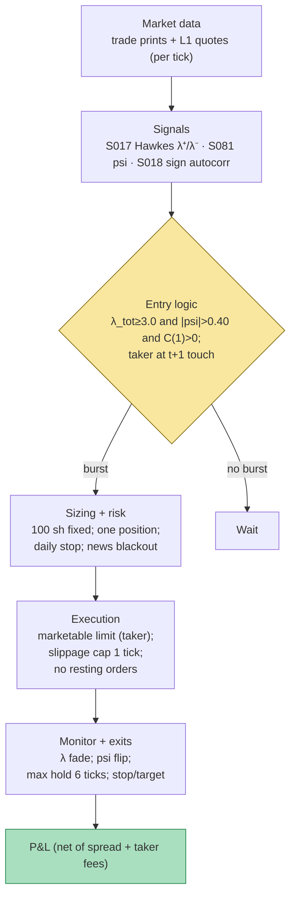

## Stage 123/200 — T023: Hawkes Burst Scalper

*Batch TB3 · Strategy 23/100 · Signals S017, S081, S018*

### T1. One-line verdict

| | |
|---|---|
| **Style** | Intraday directional scalping: taker (marketable) entries into order-flow bursts, flat minutes later |
| **Edge source** | **Self-excitation** — trades cluster (S017 Hawkes intensity); when buy-side intensity bursts far above sell-side (S081), the next few ticks drift with the burst before it decays |
| **Typical holding period** | Ticks to ~1 minute; max hold 6 ticks in the worked example (*example*) |
| **Capacity hint** | Small — 100-share lots (*example*); the burst is a microstructure phenomenon that does not survive size |
| **Build-or-buy in one line** | Build it (the recursion is five lines); buy only SIP trade data — the calibration of the burst threshold is the entire job — see T6 |

### T2. Full mechanics

**Universe & session.** Liquid US large-caps and equity-index futures, RTH, *example* window 09:35–15:55 ET. Exclusions (*examples*): scheduled-news windows (±2 min around prints), halts, spreads > 2 ticks, the open's first 5 minutes (the intensity estimator needs a burn-in). The strategy trades *bursts*, and news jumps look exactly like bursts while being untradeable (see T8).

**Entry rule.** On every trade print (event time, tick *t*), using only data ≤ *t*:

1. Update the Hawkes excitation states (S017) with the discrete recursion $$\kappa_{t+1} = d\,(\kappa_t + \alpha x_t), \qquad \lambda_t = \mu + \kappa_t$$ computed separately for buy prints ($\lambda^+_t$) and sell prints ($\lambda^-_t$): $d = e^{-\beta\Delta t}$ is the per-tick decay (*example* $\beta = 2.0$, $\Delta t = 0.1$ s), $\alpha$ the excitation jump per print (*example* $\alpha = 0.6$), $\mu$ the baseline intensity (*example* $\mu = 0.8$ prints/tick), $x_t \in \{0,1\}$ the event indicator. **Self-excitation** means each print raises the instantaneous arrival rate of same-side prints for a while — the mathematical form of "trades cluster." The **branching ratio** $\alpha/\beta$ (*example* 0.30) is the expected number of child prints each print spawns; below 1 the burst dies out.
2. Compute total intensity $\lambda^{tot}_t = \lambda^+_t + \lambda^-_t$ and the signed direction (S081). S081's canonical output is the z-scored intensity difference $d_t = \lambda^b_t - \lambda^s_t$; this chapter uses the bounded public normalization $$\psi_t = \frac{\lambda^+_t - \lambda^-_t}{\lambda^+_t + \lambda^-_t} \in [-1,+1]$$ as an explicit reconstruction (labeled as such, not silently substituted): $\psi = +1$ means all excitation is buy-side.
3. **Persistence condition** (S018): compute lag-1 sign autocorrelation $C(1) = \mathbb{E}[\varepsilon_t \varepsilon_{t+1}]$ over the last 20 prints (*example*), $\varepsilon_t \in \{+1,-1\}$. Require $C(1) > 0$ (*example*) — trade only bursts whose flow shows persistence, not sign-flipping noise. (The empirical law $C(\tau) \sim \tau^{-\gamma}$, $\gamma \approx 0.5$–0.6, is long memory: flow stays predictable far longer than price does.)
4. **Enter** (taker — a marketable limit order that crosses the spread) when $\lambda^{tot}_t \ge 3.0$ (*example* burst threshold) AND $|\psi_t| > 0.40$ (*example*) AND $C(1) > 0$: long if $\psi_t > 0$, short if $\psi_t < 0$. **Causal timing:** the signal at tick *t* is filled at tick *t+1*'s touch (the best ask when buying, the best bid when selling) — you pay the half-spread because the burst is already moving the quote.

**Exit rule.** First of: **lambda fade** ($\lambda^{tot}_t < 2.2$, *example* — the burst died); **psi flip** ($\psi_t \times \text{pos} < 0$ — excitation turned against you); **max hold** 6 ticks (*example*); **stop** −$0.03/share (*example*); **target** +$0.03/share (*example*). All exits are taker (cross the spread). Session-end flatten 15:50 ET.

**Position sizing.** Fixed 100 shares (*example*), one position at a time, flat between bursts. No scaling — a burst that can absorb 100 shares cannot absorb 1,000; size kills the edge before the stop does.

**Risk limits.** Daily loss stop −0.20% of capital (*example*). Max 3 losing bursts in a row → stand down 30 min (*example*; burst regimes cluster, and so do false ones). **Kill switch:** feed gap > 500 ms (*example*) → flatten at the touch, no new entries until 5 s of healthy prints.

**Cost model.** Taker fee $0.0030/share each side (*example*: $0.60 per 100-share round trip). Spread cost: taking the touch pays the half-spread on entry *and* exit — with a 2-tick ($0.02) spread that's $2.00 per round trip, the dominant cost. The worked example's mid had to drift 2.5 ticks in its favor just to show a gross profit.

**Order/execution sketch.** Marketable limit orders (limit at touch + 2 ticks, *example*, so a sudden quote flicker doesn't leave you unfilled-or-worse). No resting orders — resting into a burst is volunteering for adverse selection (being filled precisely because the price is moving against you). Participation: skip if the touch size < 2× our order (*example*); a 100-share take into a 50-share touch walks the book.

### T3. Signals it consumes

| Signal | Role | Logic |
|---|---|---|
| S017 — Hawkes intensity | **Primary trigger** | $\lambda^{tot}_t \ge 3.0$ (*example*): a burst of self-exciting flow is underway |
| S081 — Signed intensity difference | **Direction** | $\|\psi_t\| > 0.40$ (*example*) signs the burst; $\psi$ is the bounded public normalization of S081's z-scored $d_t$ (explicit reconstruction) |
| S018 — Order-sign autocorrelation | **Condition / veto** | $C(1) > 0$ required: only persistent flow; long memory ($C(\tau)\sim\tau^{-\gamma}$) explains why intensity can stay high while direction fades |

Combination logic (pseudocode, ≤25 lines):

```
on trade print at tick t (all inputs <= t):
    for side in {buy, sell}:                    # S017
        k[side] = D * (k[side] + ALPHA * x_t[side])
        lam[side] = MU + k[side]
    lam_tot = lam[buy] + lam[sell]
    psi = (lam[buy] - lam[sell]) / lam_tot       # S081 (bounded normalization)
    c1 = sign_autocorr(last 20 prints, lag=1)   # S018
    if feed_gap(500ms): flatten(); halt()
    if flat and lam_tot >= 3.0 and abs(psi) > 0.40 and c1 > 0:
        enter taker LONG if psi>0 else SHORT, 100 sh @ next touch
    elif in_position:  # evaluated at t+1 earliest
        if lam_tot < 2.2 or psi*pos < 0 or hold >= 6 \
           or pnl <= -0.03/sh or pnl >= +0.03/sh:
            exit taker @ touch
```
### T4. Worked example — numbers + P&L (SYNTHETIC)

Synthetic large-cap XYZ, $100 price scale, 22 ticks. **Seed: 123** (`np.random.default_rng(123)` in `batches/TB3/plot_T023.py`; the chart plots exactly these numbers). All parameters are *examples*: $\mu=0.8$, $\alpha=0.6$, $\beta=2.0$, $\Delta t=0.1$ (branching ratio 0.30); burst threshold $\lambda^{tot}\ge3.0$; $|\psi|>0.40$; max hold 6 ticks; stop/target $\pm\$0.03$/share; 100 shares; taker fee $0.0030$/share. Entry takes the touch (pays half-spread); prices are tick-rounded so cash matches display. Print signs are exchange-style (given); in production on SIP they would be Lee–Ready classified.

| tick | sign | mid | λ⁺ | λ⁻ | λ_tot | ψ | action | pos | cash cum |
|---|---|---|---|---|---|---|---|---|---|
| 1 | + | 100.000 | 1.29 | 0.80 | 2.09 | +0.23 | wait | +0 | +0.000 |
| 2 | + | 100.006 | 1.69 | 0.80 | 2.49 | +0.36 | wait | +0 | +0.000 |
| 3 | + | 100.015 | 2.02 | 0.80 | 2.82 | +0.43 | wait ($\lambda^{tot}<3.0$) | +0 | +0.000 |
| 4 | + | 100.030 | 2.29 | 0.80 | 3.09 | +0.48 | ENTER LONG @ 100.040 (taker, fee $0.30) | +1 | −10004.300 |
| 5 | + | 100.040 | 2.51 | 0.80 | 3.31 | +0.52 | wait | +1 | −10004.300 |
| 6 | + | 100.054 | 2.69 | 0.80 | 3.49 | +0.54 | wait | +1 | −10004.300 |
| 7 | − | 100.046 | 2.35 | 1.29 | 3.64 | +0.29 | wait | +1 | −10004.300 |
| 8 | + | 100.054 | 2.56 | 1.20 | 3.76 | +0.36 | wait | +1 | −10004.300 |
| 9 | + | 100.066 | 2.73 | 1.13 | 3.86 | +0.42 | wait | +1 | −10004.300 |
| 10 | − | 100.055 | 2.38 | 1.56 | 3.94 | +0.21 | EXIT @ 100.045 (max hold; taker, fee $0.30) | +0 | −0.100 |
| 11 | − | 100.044 | 2.10 | 1.91 | 4.01 | +0.05 | wait | +0 | −0.100 |
| 12 | − | 100.034 | 1.86 | 2.20 | 4.06 | −0.08 | wait | +0 | −0.100 |
| 13 | − | 100.018 | 1.67 | 2.44 | 4.11 | −0.19 | wait | +0 | −0.100 |
| 14 | + | 100.033 | 2.00 | 2.14 | 4.15 | −0.03 | wait | +0 | −0.100 |
| 15 | + | 100.040 | 2.28 | 1.90 | 4.18 | +0.09 | wait | +0 | −0.100 |
| 16 | + | 100.054 | 2.50 | 1.70 | 4.20 | +0.19 | wait | +0 | −0.100 |
| 17 | − | 100.044 | 2.19 | 2.03 | 4.22 | +0.04 | wait | +0 | −0.100 |
| 18 | − | 100.041 | 1.94 | 2.30 | 4.24 | −0.08 | wait | +0 | −0.100 |
| 19 | − | 100.028 | 1.73 | 2.52 | 4.25 | −0.18 | wait | +0 | −0.100 |
| 20 | + | 100.037 | 2.05 | 2.21 | 4.26 | −0.04 | wait | +0 | −0.100 |
| 21 | − | 100.028 | 1.83 | 2.44 | 4.27 | −0.14 | wait | +0 | −0.100 |
| 22 | − | 100.009 | 1.64 | 2.64 | 4.28 | −0.23 | wait | +0 | −0.100 |

Line-by-line P&L walk:

- **Ticks 1–3 (the build):** four straight buy prints excite $\lambda^+$ 1.29 → 2.29 while $\lambda^-$ sits at baseline 0.80. $\psi$ climbs +0.23 → +0.43 but $\lambda^{tot} = 2.82 < 3.0$ at tick 3 — no trade. The threshold does its job: near-bursts don't trigger.
- **Tick 4 (entry):** $\lambda^{tot} = 3.09 \ge 3.0$, $\psi = +0.48 > 0.40$ → ENTER LONG 100 @ 100.040 (the ask at mid 100.030; half-spread paid). Cash −$10,004.30 = −(100 × 100.040) − $0.30 fee.
- **Ticks 5–9 (the ride):** the burst persists — $\lambda^{tot}$ rises to 3.86, mid touches 100.066. But watch $\psi$: a sell print at tick 7 excites $\lambda^-$ to 1.29 and $\psi$ sags to +0.29, recovering only to +0.42. The *direction* is already decaying while *intensity* grows — the S018 long-memory signature: flow stays predictable, price drift doesn't.
- **Tick 10 (exit):** hold reaches 6 ticks → EXIT @ 100.045 (the bid at mid 100.055). Cash +$10,004.20 = +(100 × 100.045) − $0.30. **Gross: (100.045 − 100.040) × 100 = +$0.50; fees $0.60; final net P&L: −$0.10.**
- **Ticks 11–22 (the fade):** $\lambda^{tot}$ keeps climbing to 4.28 (the burst never dies in this tape) while $\psi$ goes negative — sell excitation takes over and the mid falls to 100.009. Had the max-hold not fired, the psi-flip rule ($\psi \times \text{pos} < 0$) would have exited around tick 12–13 into a falling tape. The exit rules, not the entry, are what kept this a −$0.10 scratch instead of a −$3 loss.

**Where the example is optimistic.** (1) The fill is modeled at the detecting tick's touch; live, the signal at *t* fills at *t+1*'s touch — one tick of slippage against you in a burst, which is exactly when the touch moves fastest. (2) Print signs are given; SIP Lee–Ready classification mislabels a meaningful share, and a flipped sign flips $\psi$. (3) One clean burst, no competing bursts, no news jump — real tapes stack bursts and the estimator can't tell a toxic jump from a tradeable cluster in real time. (4) The max-hold exit happened to fire near the local high; a tick-11 exit would have been worse. (5) No partial fills, no book-walking on the 100-share take — queue-level fill impact is simulated only — requires MBO/ITCH for honest modeling.

### T5. Data & infra — what must run

**Feed inventory.** Minimum honest stack: trade prints with timestamps + L1 quotes (SIP/TAQ is sufficient — Hawkes needs event times and signs, not depth). Print signs: exchange aggressor flags on direct feeds, Lee–Ready tick rule on SIP (budget a misclassification haircut). MBO is *not* needed for the signal; it helps only if you want to model how your 100-share take walks a thin touch. Corporate-action/halt calendars as in T021.

**Pipeline schedule.** Pre-open: fit ($\mu$, $\alpha$, $\beta$) per symbol on recent print data (MLE on the last 5–20 sessions, *example*); set the burst threshold from the fitted stationary intensity (threshold as a multiple of baseline, not a magic 3.0). Intraday: the recursion is O(1) per print — a Python loop handles 100–500k events/sec (cost-model §2); a full US tape of prints is ~10–200/sec per busy name (cost-model §2), so hundreds of names fit on one box. Post-close: burst report — every burst's $\psi$ path and the mid drift over the next 30 s, to check the entry rule isn't just buying tops.

**Storage.** Prints + L1 ≈ 2–8 GB/symbol-day (cost-model §4); fitted parameters are kilobytes. This is the lightest strategy in the batch to research — no depth history required.

**M5 Max feasibility.** Research and simulation: **feasible, Tier M (40–100 h → $6,000–$15,000 loaded-cost estimate at $150/hr)** per cost-model §5 — the recursion is an afternoon; the work is per-symbol MLE fits, threshold calibration, and the sign-classification haircut study. RAM trivial. **Live scalping from this machine: not recommended** — the edge is a 1–3 tick drift over seconds; 30–150 ms of latency eats the entry slippage and the exit discipline, which is the entire trade (see T8).

**Feed-outage safe mode.** Any print gap > 500 ms (*example*): the intensity estimates are now wrong (missing excitation), so flatten at the touch, block entries until the estimator has re-burned-in over 60 s of prints (*example*), manual re-arm after any kill-switch trip. Never trade a burst detected across a data gap.

### T6. Buy vs build

| Option | What you get | Indicative price | What buying gains | What buying loses |
|---|---|---|---|---|
| Tier-0: Alpaca IEX / Stooq delayed prints | Free trade data | ~$0 | Learn the recursion and $\psi$ dynamics free | Delayed/stale prints; research-only |
| Tier-1: Polygon / Alpaca SIP trades+quotes | Real-time prints, NBBO | ~$30–200/mo, indicative — verify before budgeting | Everything the signal needs; cheapest live input in the batch | Lee–Ready signs, no aggressor flags |
| Tier-2: Databento trades (matching-engine timestamps) | Microsecond-stamped prints | ~$200/mo + usage, indicative — verify before budgeting | Honest event-time Hawkes fits; better burst timing | Overkill until Tier-1 shows edge |
| Professional: colo + direct feeds | µs print-to-fill | Rack ~$1.5k–5k+/mo + data licenses, indicative — verify before budgeting | Entry slippage minimized — the whole game for a scalper | Institutional undertaking |

**Verdict: build the recursion, buy Tier-1 data, calibrate per symbol.** This is the rare strategy where the data bill is the small line item and the calibration is everything: the burst threshold, the $\psi$ cutoff, and the stop/target must be fit per name, and nobody's defaults transfer. Do not buy a "Hawkes scalper" product — its fitted parameters describe someone else's symbols in someone else's regime.

### T7. Success-ratio evidence

| Study / source | Market & period | Metric | Before/after cost | Caveat |
|---|---|---|---|---|
| Bacry, Mastromatteo & Muzy (2015), arXiv:1502.04592 | Survey: Hawkes in finance | Self- and cross-excitation describe trade arrivals, quote changes, and price moves across venues; the framework is the standard microstructure point-process model | n/a (survey) | Documents the model class, not a trading P&L |
| Rambaldi, Filimonov & Lillo (2018), *Phys. Rev. E* 97 | Intensity bursts in financial time series | Formalizes "bursts" as distinct regimes in Hawkes intensity; burst detection separates clustered from baseline flow | Before-cost (detection study) | Detection ≠ profitability; no execution costs modeled |
| Muni Toke & Yoshida (2017/2020), HAL | Order-flow intensities | Hawkes fits to order-book event intensities; cross-excitation between event types is significant | Before-cost (fit study) | Parameter stability across regimes is the open question |
| Hawkes (1971), *J. Royal Stat. Soc. B* 33 | Original spectra paper | The self-exciting point process definition | n/a (theory) | — |
| Gašperov & Kostanjčar (2022), arXiv:2207.09951 | Hawkes LOB simulator + RL | A Hawkes-driven limit-order-book simulator realistic enough to train RL execution/making agents | Simulated costs | Simulator realism is asserted, not P&L-proven |
| Lillo & Farmer (2004), via S018 | Order-sign long memory | $C(\tau) \sim \tau^{-\gamma}$, $\gamma \approx 0.5$–0.6: flow predictable far beyond price | n/a (empirical law) | This is the caution, not the promise: predictable flow ≠ predictable price |

**After-cost honesty.** The verified literature says bursts are real, detectable, and well-modeled — and says nothing about scalping them profitably after spread and fees. The worked example is the honest summary: a textbook burst, a correct directional read, and −$0.10 after costs because the spread ($2.00 round trip) plus fees ($0.60) exceeded the captured drift ($2.50 of mid movement, of which only $0.50 was harvestable). Any published "Hawkes scalper Sharpe" is an **unverified lead** until you see the spread accounting. The edge, if it exists, lives in bursts whose drift exceeds ~3 ticks net of costs — a much rarer animal than "bursts."

**Capacity & decay.** Capacity is tiny per burst (100 shares, *example*); frequency is the scaling lever (many names, many bursts). Decay: burst shapes are regime-dependent (vol regimes change $\alpha$, $\beta$); a fitted model decays as the regime drifts, which is why the pipeline refits rather than hard-codes. Competition decay is mild — few participants trade raw Hawkes bursts directly — but the *taker* nature of the strategy means you always pay the spread, the one cost that never decays.

**Honest bottom line.** For a ≤$1M paper operation: build this on the M5 Max as the cheapest laboratory in the batch — it will teach you intensity estimation, the $\psi$-fade trap, and why taker strategies live or die on spread arithmetic. Expect paper P&L to be negative until you find the rare burst population with >3-tick net drift; treat the strategy as a *filter* (when not to trade) as much as a trigger. Never run it live from this machine. For an institutional desk: Hawkes burst detection is standard flow-monitoring plumbing; as a standalone scalper it needs the colocated taker path and ruthless spread accounting. Related: T022 (toxicity-cancel maker — the other side of the burst: provide liquidity *around* bursts, don't chase them); T085 (resiliency maker).

### T8. Failure modes

1. **$\psi$ fades while $\lambda$ stays high.** The worked example's central trap: intensity persists (long memory, S018) but direction evaporates — you hold a position whose premise is gone. *Mitigation:* the psi-flip exit and max hold; size positions for the *directional* half-life, not the intensity half-life.
2. **Entry slippage in the burst.** The signal at *t* fills at *t+1*'s touch, which has already moved with the burst — you buy the top tick of the cluster. *Mitigation:* cap the entry slippage (skip if touch moved > 1 tick since detection, *example*); measure realized vs signal-time mid on every trade.
3. **Sign misclassification flips $\psi$.** Lee–Ready errors on SIP turn buy bursts into sell bursts in the estimator. *Mitigation:* aggressor flags on direct feeds; require $|\psi| > 0.40$ margin so borderline bursts don't trigger.
4. **Hawkes parameter mis-specification.** $\alpha$, $\beta$ fit on a calm week misread a volatile week (over-excitation → phantom bursts; under-decay → missed ones). *Mitigation:* rolling refits; monitor the branching ratio — if $\alpha/\beta$ approaches 1 the model is near-critical and untrustworthy.
5. **Near-critical bursts.** Branching ratio ≈ 1 means bursts don't die; the "fade" exit never fires and the max hold becomes the only exit. *Mitigation:* hard cap on hold time (already in design); stand down when fitted $\alpha/\beta > 0.8$ (*example*).
6. **Spread arithmetic.** A 2-tick spread needs >2 ticks of drift plus fees just to break even — most bursts don't clear it. *Mitigation:* spread filter (skip if spread > 1 tick at entry, *example*); report P&L gross *and* net of spread+fees separately.
7. **News-jump bursts.** Scheduled/unscheduled news prints look exactly like tradeable bursts and are pure toxicity. *Mitigation:* news blackout windows; the S018 persistence condition helps (jumps are often sign-persistent — which is why the blackout, not the filter, is the real defense).
8. **Threshold overfitting.** 3.0 / 0.40 / 6-tick tuned on one symbol-month memorize that month's burst shapes. *Mitigation:* calibrate per symbol on multi-regime panels; prefer thresholds expressed as multiples of fitted baseline intensity.

### T9. Visuals


*Caption: T023 worked example (synthetic, seed 123). The "SYNTHETIC — NOT TRADING ADVICE" watermark is burned into the chart; all numbers match the T4 table.*

**V2-T Mermaid** — per-tick granularity data flow:



### T10. Sources

1. Bacry, E., Mastromatteo, I. & Muzy, J.-F. (2015). "Hawkes processes in finance." arXiv:1502.04592 — https://arxiv.org/abs/1502.04592v2 (the survey: Hawkes as the standard microstructure point-process model).
2. Hawkes, A. G. (1971). "Spectra of some self-exciting and mutually exciting point processes." *J. Royal Statistical Society B* 33(1): 54–83. https://www.jstor.org/stable/2334319 (the original self-exciting process).
3. Rambaldi, M., Filimonov, V. & Lillo, F. (2018). "Detection of intensity bursts using Hawkes processes." *Phys. Rev. E* 97: 032318. arXiv:1610.05383 — https://arxiv.org/abs/1610.05383v1 (burst detection as distinct intensity regimes).
4. Muni Toke, I. & Yoshida, R. "Modelling intensities of order flows in a limit order book." HAL — https://hal.science/hal-01512430v1/file/hawkes_Submitted.pdf (Hawkes fits to LOB event intensities; cross-excitation).
5. Lillo, F. & Farmer, J. D. (2004). "The long memory of the efficient market." *Studies in Nonlinear Dynamics & Econometrics* 8(3) (order-sign long memory $C(\tau)\sim\tau^{-\gamma}$ — the S018 caution behind the $\psi$-fade trap).
6. Gašperov, B. & Kostanjčar, Z. (2022). "Hawkes-based limit order book simulator with neural stochastic differential equations." arXiv:2207.09951 — https://arxiv.org/abs/2207.09951v1 (Hawkes-driven LOB simulator used to train trading agents).

**Unverified leads** (Grok's Q-TB3 claims I could not independently verify — do not treat as facts):
- Any specific "Hawkes scalper" backtest Sharpe, win rate, or burst-detection accuracy figure — chatbot-sourced, not re-verified; the example here nets −$0.10 on a textbook burst.
- Claims about optimal Hawkes parameter values ($\mu$, $\alpha$, $\beta$) for specific symbols — parameters must be fit per symbol; no universal values exist in the verified literature.
- The conflated attribution in Grok's answer mixing the PLOS Alpha-AS paper with the Hawkes-LOB paper — the two are separate works (see T021 sources); do not cite Grok's merged version.

*Source log: Grok answered Q-TB3-1..3 (2026-09-10); all claims independently verified or labeled unverified.*
