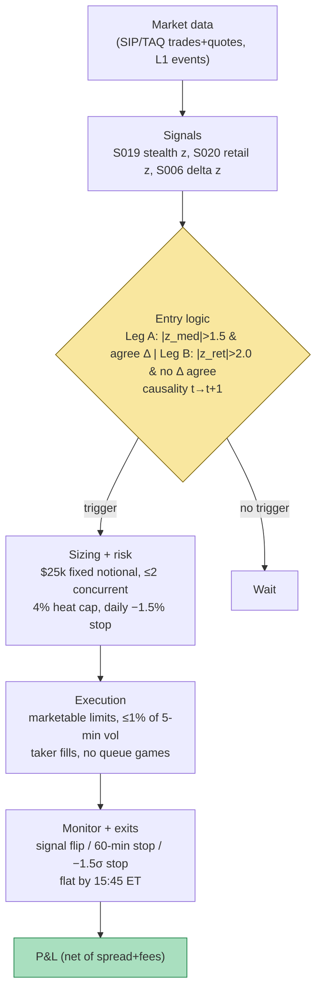

## Stage 124/200 — T024: Informed-Size Tracker / Retail Fade

*Batch TB3 · Strategy 24/100 · Signals S019, S020, S006*

### T1. One-line verdict

| | |
|---|---|
| **Style** | Intraday directional scalp / selective liquidity-taking on informed-flow footprints |
| **Edge source** | Stealth-trading regularity (Barclay–Warner): medium-size trades carry disproportionate price impact, so *following* medium-bucket signed impact rides informed flow; *fading* extreme retail/odd-lot imbalance harvests attention-driven overreaction |
| **Typical holding period** | 20–60 minutes (example) |
| **Capacity hint** | Low–moderate: 500-share clips in liquid names; retail-fade leg limited by attention-event frequency |
| **Build-or-buy in one line** | Build: the entire stack is public-formula analytics on trade/quote data — there is no vendor product that sells this signal combination. |

### T2. Full mechanics

**Jargon, defined once:** *price impact* is how much a trade moves the midprice (the (bid+ask)/2 fair-value estimate) after it prints; *adverse selection* is the loss a trader suffers when their counterparty knows more — the price moves against them right after the fill; a *round lot* is 100 shares and an *odd lot* is anything smaller; *BJZZ* (Boehmer–Jones–Zhang–Zhang 2021) is a public method that identifies retail trades from sub-penny price fractions; the *bid–ask bounce* is the mechanical up-down of trade prices between the bid and the ask, which contaminates return measurements.

**Universe & session.** US common stocks, price ≥ $10 (example), average daily volume (ADV) ≥ 5 million shares (example), quoted spread ≤ 5 bps (example). Regular trading hours (RTH) only, 9:45–15:45 ET (example) — the first 15 minutes are excluded because opening-auction prints distort size buckets. Exclude names with a scheduled earnings announcement or FDA-style event that day, and any name halted intraday.

**Signal computation (intraday, per trade).**
1. **S019 — stealth/informed-size gauge.** Every trade is classified by Lee–Ready (S007) and bucketed by dollar notional into small (<$10k), medium ($10k–$50k), and large (>$50k) — all cutoffs *example*, calibrated per name to median dollar volume. For the medium bucket over a rolling 30-minute window (example), compute signed impact $I^{med}_t = \sum_{k \in med} q_k \cdot \Delta m_k$, where $q_k$ is signed shares and $\Delta m_k$ the midprice change in the 60 seconds after the trade (example). Normalize to a z-score against its own 20-day trailing distribution (example). Positive $z^{med}$ = stealth-sized informed buying; negative = informed selling. This follows MASTER.md's S019 chapter (impact share of the medium bucket vs trade/volume share; the signed variant gives direction).
2. **S020 — retail/odd-lot imbalance.** BJZZ sub-penny retail imbalance $\text{IMB}^{retail}$ and odd-lot imbalance $\text{IMB}^{odd}$ over rolling 30-minute windows (example), each z-scored within name (example). Extreme retail one-sidedness (|z| ≥ 2.0, example) flags attention-driven flow that historically reverses.
3. **S006 — volume delta (trade imbalance).** $\Delta_t = (V^{buy}_t - V^{sell}_t)/(V^{buy}_t + V^{sell}_t)$ over a 5-minute rolling window (example), z-scored over 50 windows (example) per S006's formula $z_t = (\Delta_t - \mu_{t-L:t-1})/\sigma_{t-L:t-1}$. This is the agreement check: broad signed flow corroborating the medium-bucket read.

**Entry rule (causal; signal at event *t*, earliest fill *t*+1).** Two legs, never both in the same name at once:
- **Leg A — follow the informed.** Enter long if $z^{med} > +1.5$ (example) AND $z^{\Delta} > +0.75$ (example, same sign required); enter short symmetrically. Rationale: medium-size flow is the Barclay–Warner stealth channel, and S006 confirms it is not an isolated mid-size artifact.
- **Leg B — fade the retail extreme.** Enter short if retail $z^{ret} > +2.0$ (example) AND $z^{\Delta} < +0.5$ (example — broad flow does *not* confirm retail buying); enter long symmetrically. Rationale: retail flow mean-reverts after attention spikes; the S006 gate refuses the fade when informed flow agrees with retail (the informed pockets the S020 chapter warns about).

**Exit rule.** Whichever comes first: (a) signal flip — Leg A exits when $z^{med}$ crosses 0 (example); Leg B exits when retail imbalance z decays below +0.75 (example); (b) time stop of 60 minutes (example); (c) stop-loss at −1.5× the 30-minute realized vol (example); (d) hard flat by 15:45 ET (example). No overnight inventory.

**Position sizing.** Fixed notional $25k per trade (example), i.e. ~500 shares at $50; max 2 concurrent positions (example); portfolio heat cap 4% of equity intraday (example). Vol-targeting variant: size = $25k × (2% / 30-min realized vol) (example), floored at 100 shares.

**Risk limits.** Daily loss stop −1.5% of paper equity (example); max gross exposure $50k (example); kill switch: halt new entries for the day if two consecutive stop-losses fire or if the retail-identification feed (TAQ) is more than 5 minutes stale (example).

**Cost model.** Spread: pay half the quoted spread on entry and exit (1-min bars, 1 bp typical in-universe → $0.005/share on a $50 stock, example). Fees: $0.003/share/side taker (example — matches the TB3 Grok lead on maker-taker fees). No borrow assumption needed (long/short intraday, but budget 5% annualized borrow on shorts for safety, example). Impact: clips are ≤ 0.5% of 5-minute volume, so impact is assumed negligible — and the strategy explicitly refuses clips that would exceed 1% of 5-minute volume (example).

**Order/execution sketch.** Entries as marketable limit orders (limit at the touch + 1 tick, example) — fills are assumed taker fills; the example conservatively prices full spread crossing. No iceberg, no queue games: this is not a maker strategy (cf. T021/T022), so the *simulated only — requires MBO/ITCH* honesty label applies to any fill-rate assumption beyond "marketable order fills at the touch." Exits likewise marketable.

**Causal t→t+1 timing.** Bucket z-scores are computed on trades with exchange timestamps ≤ *t*; the entry decision uses the closed 30-minute window ending at *t*; the order is released at *t*+1 (the first quote after the window closes). The S019 chapter stresses its academic results are retrospective bucket statistics — the real-time port (rolling windows, live Lee–Ready) is the engineering task, and backtests must not let the impact horizon Δ leak future mids into the entry decision.

### T3. Signals it consumes

| Signal | Role | Weight / logic |
|---|---|---|
| S019 stealth trading (trade-size informedness) | Primary trigger (Leg A direction) | enter only if $|z^{med}| > 1.5$ (example); side = sign($z^{med}$) |
| S020 retail & odd-lot imbalance | Primary trigger (Leg B fade) + regime veto for Leg A | fade only if $|z^{ret}| > 2.0$ (example); veto Leg A if retail z agrees with informed side at >1.0 (retail chasing = crowded, example) |
| S006 volume delta | Confirmation filter (both legs) | Leg A requires same-sign $z^{\Delta} > 0.75$ (example); Leg B requires $\|z^{\Delta}\| < 0.5$ (example) i.e. no informed confirmation of the retail push |

```text
# T024 combination logic (example thresholds; recompute per window end t)
z_med  = stealth_medium_impact_z(t)      # S019, signed, 30-min window
z_ret  = retail_imbalance_z(t)           # S020, BJZZ + odd-lot, 30-min window
z_del  = volume_delta_z(t)              # S006, 5-min window, L=50
if flat and no position in name:
    if z_med > 1.5 and z_del > 0.75 and z_ret < 1.0:
        enter LONG, size = 25k_notional     # Leg A: follow informed
    elif z_med < -1.5 and z_del < -0.75 and z_ret > -1.0:
        enter SHORT, size = 25k_notional
    elif z_ret > 2.0 and abs(z_del) < 0.5:
        enter SHORT, size = 25k_notional    # Leg B: fade retail extreme
    elif z_ret < -2.0 and abs(z_del) < 0.5:
        enter LONG, size = 25k_notional
# exits evaluated each minute
if long  and (z_med < 0 or z_ret < 0.75 or held > 60min or pnl < -stop): exit
if short and (z_med > 0 or z_ret > -0.75 or held > 60min or pnl < -stop): exit
flat_all_by(15:45 ET)
```

### T4. Worked example — numbers + P&L (SYNTHETIC)

**All numbers below are synthetic.** Seed **124** (`batches/TB3/plot_T024.py`); the chart in T9 plots this exact path and these exact trade prices. Fictional ticker ZVXR, $25k/trade ≈ 500 shares. Cost schedule: half-spread $0.005/share (example), taker fee $0.003/share/side (example) → $5.50 round-trip cost per 500-share trade.

| # | Time (ET) | Leg | Signal read (example thresholds) | Side | Entry | Exit | Exit trigger | Gross P&L | Costs | Net P&L |
|---|---|---|---|---|---|---|---|---|---|---|
| 1 | 10:12→10:42 | A | $z^{med}$=+1.8, $z^{\Delta}$=+1.2 | long 500 | 45.02 | 45.09 | medium-bucket flip | 500×0.07=+$35.00 | −$5.50 | **+$29.50** |
| 2 | 11:05→11:35 | B | retail z=+2.1, $\|z^{\Delta}\|$=0.2 | short 500 | 44.98 | 44.90 | retail z < 0.75 | 500×0.08=+$40.00 | −$5.50 | **+$34.50** |
| 3 | 13:20→14:20 | A | $z^{med}$=−1.7, $z^{\Delta}$=−1.1 | short 500 | 45.10 | 45.14 | 60-min time stop | 500×(−0.04)=−$20.00 | −$5.50 | **−$25.50** |
| 4 | 14:45→15:30 | B | retail z=−2.3, $z^{\Delta}$=+0.9 | long 500 | 44.85 | 44.93 | retail z > −0.75 | 500×0.08=+$40.00 | −$5.50 | **+$34.50** |

Day net P&L: +29.50 + 34.50 − 25.50 + 34.50 = **+$73.00** on $100k gross traded (4 × $25k), i.e. +7.3 bps per dollar of gross — before the borrow budget and before any missed-fill slippage.

**Where the example is optimistic.** (1) Every entry is assumed to fill at the signal price — real marketable orders slip, especially on Leg B where you fade an active retail wave. (2) No partial fills; the S006 gate is evaluated on a clean 5-minute window that in reality straddles the entry itself. (3) The retail-fade leg assumes BJZZ works intraday on 30-minute windows; the S020 chapter documents it as a daily-or-longer construct, so intraday retail z is noisier than shown — label this *unverified lead*. (4) Trade 3's loss is exactly one stop — real stop-outs gap. (5) Zero market impact is assumed for 500-share clips; fine at this size, dishonest if scaled up.

### T5. Data & infra — what must run

**Pipeline inventory.** (a) Consolidated trade/quote feed (TAQ or SIP) → per-trade Lee–Ready classification (S007) with contemporaneous NBBO; (b) size-bucket impact engine: per-bucket signed Σ q·Δm with 60-second impact horizons, rolling 30-minute windows, trailing z-score normalization; (c) retail identification: sub-penny fraction filter (BJZZ bands (0.6,1.0] buy / (0,0.4) sell) plus odd-lot flag (<100 shares); (d) 5-minute volume-delta z (S006); (e) pre-open universe screen (price, ADV, spread, no-earnings-today). **Schedule:** universe screen 8:00 ET; bucket/z-score state warms from 9:45; entry loop every 1 minute 9:45–15:45; post-close markout and bucket-recalibration job.

**M5 Max feasibility.** Feasible (Tier M, ~40–80 h ≈ $6,000–12,000 loaded-cost estimate per cost-model §5). Throughput: 50 names × ~2k L1 events/sec = 100k events/sec — Python+polars batch recompute per minute is trivial; a per-trade Python loop is borderline per cost-model §2, so bucket updates should accumulate in numpy/polars, not per-tick Python. RAM: one day of L1 for 50 names ≈ 25–200 GB raw (cost-model §3) — keep per-symbol daily parquet files and only the rolling 30-minute state plus 20-day z-score history in RAM (< 2 GB working set, well under the 77 GB budget). Storage: 1-min bars are trivial; L1 archive for the 50-name universe ≈ 50–200 GB/month in parquet (cost-model §4) — sample or retain 60 days.

**Feed-outage safe-mode.** If the trade feed lags >5 minutes or the NBBO is stale: cancel all pending entries, tighten time stops to 15 minutes (example), and liquidate on the next valid quote; never enter on a z-score computed from a gappy window. If the corporate-action feed fails, skip the universe screen and trade only yesterday's qualified names.

### T6. Buy vs build

| Option | What you get | Indicative price | Gains | Loses |
|---|---|---|---|---|
| Tier 0: Alpaca SIP / Stooq + self-built analytics | Bars + delayed quotes, build everything in Python+polars | ~$0 | Zero data cost; full control of bucket cutoffs | SIP timestamps too coarse for honest Lee–Ready; retail ID unreliable intraday |
| Tier 1: Polygon Stocks Advanced | Real-time SIP trades/quotes, full TAQ-like history | ~$30–200/mo, indicative — verify before budgeting | Cheapest honest tick-trade feed for S019/S006 | No aggressor flags; NBBO-only (no depth) |
| Tier 2: Databento Standard (MBP-1) | Exchange-timestamped L1, clean symbology | ~$200/mo + usage, indicative — verify before budgeting | Honest t→t+1 timing; per-exchange NBBO for the quote rule | Still no MBO; queue effects simulated-only |
| Retail platform: QuantConnect | Research + paper broker + TAQ-ish data | ~$20–100/mo, indicative — verify before budgeting | Fastest prototype; built-in universe selection | Coarse data granularity; bucket engine still self-built |
| Prop/wholesaler route | Internalized retail flow data | Not purchasable by outsiders | Would obsolete the BJZZ proxy | Not available — the BJZZ reconstruction is the retail operator's substitute |

**Verdict: build.** The signal combination is the product; no vendor sells stealth-bucket impact z-scores or BJZZ retail imbalance as a strategy input. Buy the raw feed (Tier 1 minimum; Tier 2 for honest timestamps), build the analytics. Crossover: if you need per-exchange aggressor flags or depth for the impact horizon, you are in Tier 2/3 territory and should re-scope to a maker strategy (T021/T022) instead.

### T7. Success-ratio evidence

| Study / source | Market & period | Metric | Before/after cost | Caveat |
|---|---|---|---|---|
| Barclay & Warner 1993, "Stealth trading and volatility" (JFE) | NYSE, 1980s | Medium-size trades (500–9,999 shares) account for a disproportionate share of cumulative price impact | Before cost (documented regularity, not a strategy) | Era and venue are ancient; size cutoffs do not port to 2026 |
| Boehmer, Jones, Zhang & Zhang 2021, "Tracking retail investor activity" (JFE) | US equities, 2010–2017 | BJZZ retail imbalance predicts short-horizon returns; retail flow is contrarian on average | Before cost | Predictability ≠ tradability after spread; retail is heterogeneous (per S020) |
| Chordia, Roll & Subrahmanyam (order-imbalance predictability) | NYSE intraday | Lagged order imbalance predicts next-interval returns | Before cost | Effect is small per interval; needs aggregation to survive costs |
| Grok TB3 lead: Gould & Bonart imbalance logits | 10 Nasdaq names | R² ~0.8–0.9 large-tick, ~0.1–0.3 small-tick, one-tick horizon | Before cost; *unverified chatbot claim* | Directional result, not a P&L result; unusable for posting without colocation |

**Capacity & decay.** The informed-follow leg competes with every institutional execution algo that already reads size-bucket impact; the retail-fade leg decays as wholesalers internalize more flow off-exchange (less lit retail signal). Neither leg has published after-cost Sharpe as a standalone strategy — treat both as *unverified as a combination*.

**Honest bottom line.** For a ≤$1M paper operation: a reasonable research prototype — all formulas are public, data is Tier 1/2, and the two legs are negatively correlated by construction. Expect the gross edge to be a few bps per trade with costs eating most of it; the realistic outcome is a flat to slightly-positive after-cost book that teaches microstructure execution. For an institutional desk: the components already live inside execution algos; the standalone strategy adds nothing a good participation algo (cf. T086) doesn't already do.

### T8. Failure modes

1. **Stealth signature is retrospective.** S019's academic result is a bucket statistic, not a real-time trigger — intraday z-scores are noisier and the "medium" bucket drifts with regime. *Mitigation:* recalibrate bucket cutoffs weekly to median dollar volume; require S006 agreement before sizing up.
2. **Retail is heterogeneous.** Fading retail into an informed pocket (earnings, news) is fading the smart money — the S020 chapter's central warning. *Mitigation:* the S006 veto plus an event-day exclusion list.
3. **Lee–Ready misclassification on SIP.** Stale SIP quotes mislabel aggressor side, corrupting both S019 and S006. *Mitigation:* Tier 2 exchange-timestamped data; drop windows where quote staleness > 1 s (example).
4. **Latency honesty.** Entries are taker orders; on a home connection the signal is 30–150 ms old and the retail wave may have already turned. *Mitigation:* wide thresholds (z ≥ 2.0 for fades) so only slow, persistent extremes trigger.
5. **Cost-model optimism.** The example pays exactly half-spread; real retail-fade entries cross into moving markets. *Mitigation:* model 1.5× half-spread slippage in research (example); kill the leg if realized slippage exceeds the model two days running.
6. **Overfitting bucket cutoffs.** Three buckets × z-thresholds × windows = a parameter mine. *Mitigation:* freeze parameters from the first 60-day calibration; validate on purged/embargoed splits (S088); no re-tuning without a regime break.
7. **Crowding on attention names.** Everyone fades the same meme-stock retail wave; the fade becomes the consensus trade. *Mitigation:* cap Leg B at 1 concurrent position (example); skip names in the top retail-attention decile that day.
8. **Operational: stale kill switch.** A gappy TAQ feed produces phantom z-spikes. *Mitigation:* feed-freshness gate in T5 safe-mode; halt entries on staleness.

### T9. Visuals




### T10. Sources

1. Barclay, M.J. & Warner, J.B. (1993), "Stealth trading and volatility: Which trades move prices?", *Journal of Financial Economics*. — the stealth-trading hypothesis and medium-size impact concentration behind S019.
2. Boehmer, E., Jones, C.M., Zhang, X. & Zhang, X. (2021), "Tracking retail investor activity", *Journal of Finance*. — BJZZ sub-penny retail identification used for S020.
3. Lee, C.M.C. & Ready, M.J. (1991), "Inferring trade direction from intraday data", *Journal of Finance*. — trade classification underlying S007/S019/S006 signing.
4. O'Hara, M., Yao, C. & Ye, M. (2014), "What's not there: Odd lots and market data", *Journal of Finance*. — odd lots ≈ 24% of trades, ≈ 35% of price discovery (per S020).
5. Chordia, T., Roll, R. & Subrahmanyam, A. (2002), "Order imbalance, liquidity, and market returns", *Journal of Financial Economics*. — lagged imbalance → return predictability (before cost).

**Unverified leads** (chatbot or single-source claims not independently checked — do not cite as fact):
- Grok (2026-09-10): Gould & Bonart imbalance-logit R² figures; 2025 imbalance-maker P&L study (mean ≈ −0.49 after costs); VPIN flash-crash anecdote — all *unverified chatbot claims*.
- Intraday (30-minute) BJZZ retail z-scores as a fade trigger — a construction of this chapter, not a documented result.
- Vendor prices in T6 are indicative — verify before budgeting.

*Source log: Grok answered Q-TB3-1..3 (2026-09-10); all claims independently verified or labeled unverified.*

---
