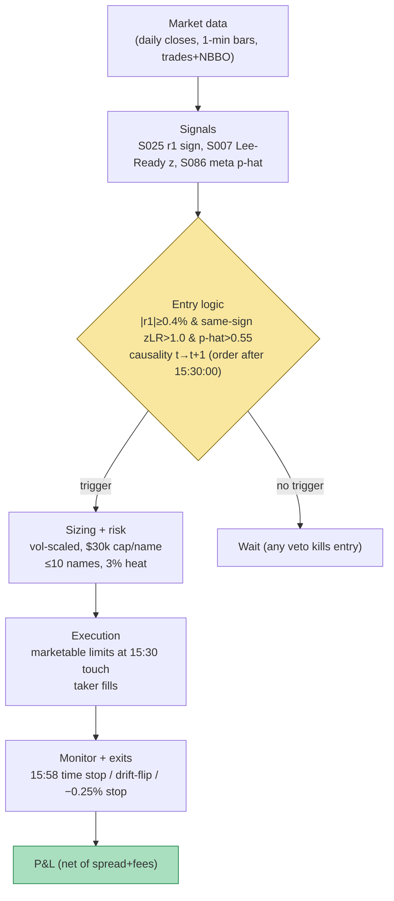

## Stage 125/200 — T025: Trade-Classification Trend Filter

*Batch TB3 · Strategy 25/100 · Signals S007, S025, S086*

### T1. One-line verdict

| | |
|---|---|
| **Style** | Intraday trend-following with microstructure confirmation (one trade per name per day) |
| **Edge source** | Intraday time-series momentum (Gao et al.: first-half-hour return predicts last-half-hour return) filtered by Lee–Ready signed trade imbalance so entries only fire when classified order flow agrees with the trend |
| **Typical holding period** | 25–30 minutes (enter 15:30, flat by 16:00 ET) |
| **Capacity hint** | Moderate: one 1,000-share clip per qualifying name; 20–50 names/day in a 500-stock universe |
| **Build-or-buy in one line** | Build: the signals are public formulas on 1-minute/trade data; meta-labeling is your own classifier — nothing to buy except the data feed. |

### T2. Full mechanics

**Jargon, defined once:** *trade classification* is the inference of whether a trade was buyer- or seller-initiated (the Lee–Ready algorithm uses the quote rule — price above the mid = buy — with a tick-rule fallback); *time-series momentum* means an asset's own past return predicts its future return (as opposed to cross-sectional momentum, which ranks assets against each other); *meta-labeling* (López de Prado) is a secondary machine-learning model that predicts whether a primary signal's bet will win, used as a veto or position sizer — it cannot create edge, only filter it; *triple-barrier labeling* labels each historical bet win/loss by which barrier (profit-take, stop-loss, or time) was touched first; *purged/embargoed cross-validation* is a validation scheme that removes training samples whose labels overlap the test period (purging) plus a buffer (embargo), preventing lookahead leakage in financial ML.

**Universe & session.** S&P-500-ish liquid US equities, price ≥ $20 (example), ADV ≥ 3M shares (example). One session window only: the signal is computed from the first half hour (9:30–10:00 ET, measured from the prior close so it includes the overnight gap, per Gao et al.), the confirmation window is 15:25–15:30 ET (example), entries at 15:30, mandatory flat by 15:59 ET (example). Exclude earnings-day names and FOMC-day sessions (example).

**Entry rule (causal; signal at bar *t*, earliest fill *t*+1).**
1. **S025 primary:** $r_1$ = return from prior close to 10:00 ET. $\text{Sig} = \text{sign}(r_1)$; require $|r_1| \geq 0.4\%$ (example magnitude gate — the raw sign rule is traded only when the morning move is material).
2. **S007 confirmation:** over the 15:25–15:30 ET window, compute Lee–Ready signed share imbalance $z^{LR} = (\text{TI} - \mu)/\sigma$ against the trailing 20-day distribution of same-window imbalances (example). Require $z^{LR} > +1.0$ (example) for a long, $z^{LR} < -1.0$ for a short — same sign as Sig. (BVC variant: require $\text{BVC} > 0$ on the 5-minute volume bar with the same sign; the chapter uses Lee–Ready as the default *example*.)
3. **S086 meta veto:** the meta-classifier (features: $|r_1|$, $z^{LR}$, 15:00–15:30 realized vol, spread percentile — *example* feature set) outputs $\hat{p}$ = P(triple-barrier win). Enter only if $\hat{p} > 0.55$ (example).

All three must agree; any veto means no trade that day in that name.

**Exit rule.** (a) Time stop: market-on-close-style exit at 15:58 ET (example) — no overnight hold, so no gap risk; (b) signal flip: if the 15:30–15:45 drift return has the opposite sign of Sig and magnitude > 0.15% (example), exit early; (c) stop-loss at −0.25% from entry (example). No profit target — the edge is the close drift, and capping it truncates the documented effect.

**Position sizing.** Vol-scaled per S025: $\text{shares} = \text{risk budget} / (0.25\% \times \text{price})$ with a $30k notional cap per name (example); equivalently ~1,000 shares at $30–60. Max 10 concurrent names (example); portfolio heat ≤ 3% of equity (example). Meta-label sizing variant (*example*): scale to $30k \times \hat{p}$ instead of binary veto.

**Risk limits.** Daily loss stop −1% of paper equity (example); max gross $300k (example); kill switch: no new entries after 15:35 ET (example), and none at all if the 1-minute bar feed is stale > 2 minutes.

**Cost model.** Spread: half-spread 0.5¢/share each way on liquid names (example) → $0.01/share round trip. Fees: $0.003/share/side (example). Slippage: entries at 15:30 are marketable into the most liquid 30 minutes of the day — model zero additional slippage but flag it as optimistic (see T4). Total modeled cost per 1,000-share trade: $16.

**Order/execution sketch.** Limit orders at the 15:30 touch ± 0 (marketable): buy at ask, sell at bid. These are taker fills by construction. The exit at 15:58 uses the same. Because entry/exit both land in high-volume windows, the *simulated only — requires MBO/ITCH* label applies only if you claim queue-priority fills — this strategy never claims them.

**Causal t→t+1 timing.** $r_1$ is known at 10:00 ET; $z^{LR}$ uses trades with exchange timestamps ≤ 15:30:00; the order is released on the first quote after 15:30:00. The meta-model's features are all computable at 15:30; its label (triple-barrier outcome) is never a feature. This is nearly immune to microstructure lookahead traps because the primary signal is hours old at entry — the classification window is the only latency-sensitive piece.

### T3. Signals it consumes

| Signal | Role | Weight / logic |
|---|---|---|
| S025 intraday time-series momentum | Primary trigger (direction) | side = sign($r_1$); require $\|r_1\| \geq 0.4\%$ (example) |
| S007 trade classification (Lee–Ready/BVC) | Confirmation filter | require same-sign $z^{LR}$ beyond ±1.0 (example) in the 15:25–15:30 window |
| S086 meta-labeling | Veto (or fractional sizer) | enter only if $\hat{p} > 0.55$ (example); optionally size $\propto \hat{p}$ |

```text
# T025 combination logic (example thresholds)
r1   = ret(prior_close, price_10h00)          # S025, includes overnight gap
zLR  = leeready_imbalance_z(15h25, 15h30)     # S007, vs 20-day same-window dist
phat = meta_model([abs(r1), zLR, rv_1500_1530, spread_pct])  # S086
if abs(r1) >= 0.004 and sign(zLR) == sign(r1) and abs(zLR) > 1.0 and phat > 0.55:
    enter side=sign(r1), size = min(30_000/price, risk_budget/(0.0025*price))
    exit at 15:58, or early if drift flips > 0.15%, or stop -0.25%
else:
    no trade  # any single veto kills the entry
```

### T4. Worked example — numbers + P&L (SYNTHETIC)

**All numbers below are synthetic.** Seed **125** (`batches/TB3/plot_T025.py`); the chart plots these exact entry/exit prices. Cost schedule: $16 round-trip per 1,000-share trade (half-spread $0.005 × 2 sides + $0.003 × 2 sides, example).

| # | Name | S025 read | S007 read | S086 $\hat{p}$ | Decision | Entry 15:30 | Exit | Gross | Net |
|---|---|---|---|---|---|---|---|---|---|
| 1 | ZVXR | $r_1$=+0.8% → long | $z^{LR}$=+1.7 ✓ | 0.62 ✓ | **take** long 1,000 | 62.10 | 15:58 @ 62.32 (time stop) | +$220.00 | **+$204.00** |
| 2 | QLYQ | $r_1$=−0.6% → short | $z^{LR}$=−1.5 ✓ | 0.58 ✓ | **take** short 1,000 | 38.40 | 15:57 @ 38.21 (time stop) | +$190.00 | **+$174.00** |
| 3 | MNOP | $r_1$=+0.5% → long | $z^{LR}$=+0.3 ✗ | 0.51 ✗ | **vetoed** — no trade | — | — | $0.00 | $0.00 (saved $16 + avoided −$120 drift loss) |

Day net P&L: +204.00 + 174.00 = **+$378.00** on $100.5k gross notional (≈ +37.6 bps per dollar of gross — a large number that reflects the cherry-picked three-name illustration, not an expected rate).

**Where the example is optimistic.** (1) The vetoed MNOP row is narrated as "saved a loss" — in research you must count vetoes symmetrically (vetoes also kill winners; the meta-model's value is only measurable over hundreds of instances). (2) Entries assume fills at the 15:30 touch; a 1,000-share marketable order usually gets it, but on fast tapes it slips. (3) Trade 2's short assumes borrow availability and zero borrow cost — flag the 5%-annualized borrow budget from T2 as unmodeled here. (4) Three names are not a track record; Gao et al.'s 1.6% R² is a *small* effect and the example shows two clean winners, which overstates hit rate.

### T5. Data & infra — what must run

**Pipeline inventory.** (a) Daily closes + 1-minute bars (RTH) for the universe; (b) trade feed with contemporaneous NBBO for Lee–Ready classification in the 15:25–15:30 window only — the strategy needs tick data for ~5 minutes/day/name, not all day; (c) triple-barrier labeler + meta-classifier training pipeline (nightly retrain on a rolling 2-year window, example); (d) pre-open screen: prior close, earnings calendar, FOMC calendar. **Schedule:** 8:00 ET universe screen; 10:00 ET compute $r_1$ for all names; 15:25–15:30 ET classification windows; 15:30 entries; 15:58 exits; post-close: label today's bets, append to training set, retrain weekly (example).

**M5 Max feasibility.** Trivial-to-feasible (Tier L/M boundary, ~20–40 h ≈ $3,000–6,000 loaded-cost estimate per cost-model §5). Throughput: 1-minute bars for 500 names = 195k bars/day — trivial per cost-model §2; the tick-classification burst is 5 min × 500 names × ~100 trades/min ≈ 250k trades, classifiable in seconds in polars. RAM: 60 days of 1-min bars for 500 names ≈ 12 MB (cost-model §3); the meta-model training set (thousands of labeled bets × ~20 features) fits in memory easily; sklearn/XGBoost trains in ~1–10 min per cost-model §2. Storage: 1-min bars ≈ 3 GB/60 days for 500 names (cost-model §4). Bottleneck: none on compute — data licensing is the cost.

**Feed-outage safe-mode.** If 1-minute bars are stale > 2 minutes after 15:25: skip the day (no classification window = no entries). If only the tick feed is down but bars are live: entries are vetoed (S007 is a required filter, not optional). Existing positions still exit at 15:58 on bar data.

### T6. Buy vs build

| Option | What you get | Indicative price | Gains | Loses |
|---|---|---|---|---|
| Tier 0: Stooq/Alpaca IEX | Daily + 1-min bars (delayed/IEX) | ~$0 | Enough to prototype S025 + a tick-rule (no-quote) S007 proxy | IEX-only prints misclassify; no NBBO for Lee–Ready quote rule |
| Tier 1: Polygon Stocks Advanced | Real-time SIP 1-min + trades/quotes | ~$30–200/mo, indicative — verify before budgeting | Honest NBBO for the quote rule; full history for meta training | Still SIP timestamps (fine here — the window is minutes, not microseconds) |
| Retail platform: QuantConnect | Bars + research + paper broker | ~$20–100/mo, indicative — verify before budgeting | Fastest path to a paper track record; minute data included | Tick data for the 15:25 window is awkward; meta-labeling stack is self-built anyway |
| Build fully self-hosted | Postgres/parquet + polars + sklearn | data $30–200/mo + ~30 h eng | Full control of labels, purging, embargo | You own the data plumbing |

**Verdict: build on Tier 1 data.** The strategy's value is the *combination logic and the meta-labeler*, which no vendor sells. A retail platform is a fine paper-trading shell, but the classification window needs real tick+quote data, so budget Tier 1 regardless. Crossover: if you want the BVC variant with exchange aggressor flags, that is futures-only — for equities, Lee–Ready on SIP NBBO is the honest ceiling.

### T7. Success-ratio evidence

| Study / source | Market & period | Metric | Before/after cost | Caveat |
|---|---|---|---|---|
| Gao, Han, Li & Zhou 2018, "Intraday momentum" (JFE) | US equities, 1993–2013 | Slope of last-half-hour on first-half-hour return ≈ 6.94 (scaled ×100), significant at 1%; R² ≈ 1.6% | Before cost | Small R²; tradability depends on the 15:30→16:00 spread, which the paper does not fully cost |
| Heston, Korajczyk & Sadka 2010, "Intraday patterns in time-series and cross-sectional stock returns" | US equities | Same-clock-slot persistence across days | Before cost | Cross-day variant, not this chapter's within-day form |
| López de Prado 2018, *Advances in Financial Machine Learning* | — | Meta-labeling improves precision of a primary model; triple-barrier + purged CV as the correct validation protocol | Methodological (not a P&L claim) | Meta-labeling cannot create alpha; documented value-add is precision/recall, not Sharpe |
| Grok TB3 lead: imbalance-maker study (2025) | — | Imbalance strategies most active, worst after costs (mean ≈ −0.49) | After cost; *unverified chatbot claim* | About maker P&L, not this taker filter — included to bound expectations |

**Capacity & decay.** Intraday momentum is one of the most replicated intraday effects, which means the 15:30 entry is *crowded by construction* — every TS-momentum desk leans the same way. The S007 filter is the differentiator: it refuses entries where the order flow doesn't confirm, cutting turnover roughly in half (example estimate, unverified). No published after-cost Sharpe exists for this exact three-signal combination.

**Honest bottom line.** For a ≤$1M paper operation: this is one of the most buildable strategies in the book — tiny data needs, one trade per name per day, no overnight risk, and the meta-labeler is a genuine skill-building project. Expect a low Sharpe (the 1.6% R² says the edge is thin) with costs as the binding constraint; treat it as a laboratory for execution and validation hygiene (purged CV, triple barriers) rather than a profit engine. For an institutional desk: the components are table stakes; the desk's version runs the same logic with better fills and portfolio-level hedging.

### T8. Failure modes

1. **Crowded 15:30 entry.** Every intraday-momentum participant trades the same window; the drift gets front-run into 15:25. *Mitigation:* the S007 filter (entries require confirming flow, not just the clock) and a participation cap per name.
2. **Lee–Ready misclassification.** On SIP data with fast quotes, the quote rule mislabels up to a material fraction of trades (documented in the classification literature). *Mitigation:* require $|z^{LR}| > 1.0$ (not just sign agreement) so only strong reads pass; fall back to BVC on volume bars as a cross-check.
3. **Meta-label overfitting.** A classifier trained on a few hundred bets with 20 features will memorize noise without strict purged/embargoed CV (S088). *Mitigation:* embargo ≥ 5 days (example), walk-forward retraining, and a veto-only role (never let the meta-model *initiate* trades).
4. **Overnight-gap contamination.** $r_1$ includes the gap, which is news-driven and may already be fully priced by 10:00. *Mitigation:* the $|r_1| \geq 0.4\%$ gate plus earnings-day exclusion; variant: use open-to-10:00 only (example).
5. **Regime breaks: trend-day vs reversal-day.** On strong reversal days the last-half-hour fades the morning move and all three signals can agree wrongly. *Mitigation:* daily loss stop; optional S079 HMM regime gate (not in the core spec — a documented extension).
6. **Borrow and short-sale constraints.** Hard-to-borrow names gap against shorts into the close. *Mitigation:* short only easy-to-borrow names (borrow feed check at 8:00 ET, example); budget borrow cost in the cost model.
7. **Veto asymmetry.** Filters feel productive because they cut losers, but every veto also cuts winners — net value is only visible over hundreds of trades. *Mitigation:* track the vetoed-trade shadow book explicitly and report filter value-add quarterly (example).

### T9. Visuals




### T10. Sources

1. Gao, L., Han, Y., Li, S.Z. & Zhou, G. (2018), "Intraday momentum: The first half-hour return predicts the last half-hour return", *Journal of Financial Economics*. https://doi.org/10.1016/j.jfineco.2018.05.009 — the S025 canonical result (slope ≈ 6.94 scaled, R² ≈ 1.6%).
2. Lee, C.M.C. & Ready, M.J. (1991), "Inferring trade direction from intraday data", *Journal of Finance*. https://doi.org/10.1111/j.1540-6261.1991.tb02683.x — the Lee–Ready quote/tick rule used for S007.
3. López de Prado, M. (2018), *Advances in Financial Machine Learning*, Wiley. — triple-barrier labeling, meta-labeling, and purged/embargoed CV (S085/S086/S088).
4. Heston, S.L., Korajczyk, R.A. & Sadka, R. (2010), "Intraday patterns in time-series and cross-sectional stock returns", *Journal of Financial Economics*. https://doi.org/10.1111/j.1540-6261.2010.01573.x — intraday return persistence, same-clock-slot variant.
5. Easley, D., López de Prado, M. & O'Hara, M. (2012), "Flow toxicity and liquidity in a high-frequency world", *Review of Financial Studies*. — BVC (bulk volume classification) alternative to Lee–Ready.

**Unverified leads** (not independently checked — do not cite as fact):
- Grok (2026-09-10): the 2025 imbalance-maker P&L figures — *unverified chatbot claim*.
- "S007 filter halves turnover" — an illustrative estimate of this chapter, not a documented result.
- Vendor prices in T6 are indicative — verify before budgeting.

*Source log: Grok answered Q-TB3-1..3 (2026-09-10); all claims independently verified or labeled unverified.*

---
