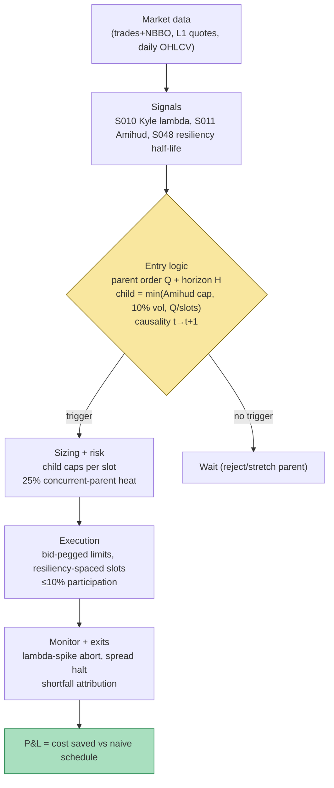

## Stage 126/200 — T026: Kyle-Lambda Participation Throttle

*Batch TB3 · Strategy 26/100 · Signals S010, S011, S048*

### T1. One-line verdict

| | |
|---|---|
| **Style** | Intraday execution / participation algorithm (a cost-control overlay for any parent order) |
| **Edge source** | Not alpha — *cost avoidance*: sizing child orders from live Kyle-lambda impact estimates, capped by Amihud illiquidity and spaced by LOB-resiliency half-life, so a large parent order pays minimal temporary impact |
| **Typical holding period** | The parent order's horizon: 1–6 hours for a day order (the throttle sets slice count and spacing) |
| **Capacity hint** | High: this is infrastructure — it scales with the parent flow it serves; the binding constraint is the name's ADV |
| **Build-or-buy in one line** | Hybrid: buy the participation/VWAP algo from your broker for production; build the lambda/Amihud/resiliency throttle yourself to know what the algo is actually doing. |

### T2. Full mechanics

**Jargon, defined once:** *Kyle's lambda* (λ) is the regression slope of price change on signed order flow — dollars of price move per share traded, the standard linear measure of *price impact* (how much your trading moves the price against you); *Amihud illiquidity* (ILLIQ) is the average ratio of absolute daily return to dollar volume — price move per dollar traded, in units of 1/$; *resiliency* is how fast the limit order book refills after a liquidity shock, summarized by the *half-life* $t_{1/2} = \ln 2 / \kappa$ (the time for half the temporary impact to decay); *temporary impact* is the liquidity-driven price concession that reverts, vs *permanent impact*, the information leg that never comes back; *participation rate* is your child order's share of market volume in its slice window.

**Universe & session.** Any US equity the parent desk trades, RTH only. The throttle refuses names where it cannot measure: requires ≥ 1,000 trades/day for a stable λ̂ (example) and a non-stale quote feed. No trading in the first 5 or last 10 minutes (example) — impact estimates are unstable there.

**The throttle rule.** For a parent order of size $Q$ shares to be worked over horizon $H$:
1. **S010 — live impact estimate.** Rolling through-origin regression $\Delta p_t = \lambda q_t + \varepsilon_t$ on midquote changes vs signed volume over the trailing 1,000 trades (example), per S010's formula $\hat{\lambda} = \sum q_t \Delta p_t / \sum q_t^2$ ($/share). Recompute every 100 trades (example). If $\hat{\lambda}$ is more than 3× its morning value (example), halve all child sizes — the book has thinned.
2. **S011 — Amihud cap.** Daily $\text{ILLIQ} \times 10^6$ (example lookback 20 days). Child-notional cap: $\text{child}_{\$} \times \text{ILLIQ} \leq 5$ bps (example) — no single child may be expected to move the price more than 5 bps on the illiquidity gauge. This is the *level* control (which names/sizes are safe at all).
3. **S048 — resiliency spacing.** Estimate $\hat{\kappa}$ from post-shock spread/mid decay (S048's log-OLS), half-life $t_{1/2} = \ln 2 / \hat{\kappa}$. Minimum slice spacing = $3 \times t_{1/2}$ (example), so ≥ ~87% of temporary impact decays between children ($1 - e^{-3\ln2} = 0.875$). This is the *timing* control.
4. **Participation cap.** Child shares ≤ 10% of trailing 5-minute volume (example) — the classic POV guardrail, independent of the microstructure estimates.

Child size = $\min(\text{Amihud cap},\, 10\% \text{ of 5-min vol},\, Q / N_{\min})$, where $N_{\min}$ = number of resiliency-spaced slots that fit in $H$; if even the minimum feasible schedule violates the Amihud cap, the parent is *rejected or stretched to multi-day* — the throttle's most valuable output is "don't trade this today."

**Entry/exit.** This strategy has no directional entries — it *executes* a parent order's side. Child orders are limit orders pegged to the touch (buy at bid, join but never cross more than 1 tick, example); unfilled remainder after the slice window rolls to the next slot. End-of-horizon cleanup: any residual < 2% of $Q$ (example) is crossed in the closing auction; larger residuals extend $H$.

**Position sizing.** The "position" is the parent $Q$; the throttle sizes *children*. Portfolio heat: sum of concurrent parents' remaining notional ≤ 25% of equity (example).

**Risk limits.** Abort the schedule (flatten via VWAP over 15 min, example) if: $\hat{\lambda}$ spikes > 5× baseline (example — toxicity event), spread > 3× median (example), or a trading halt. Daily implementation-shortfall stop: if realized slippage exceeds 2× the pre-trade estimate (example), pause and re-estimate.

**Cost model.** Pre-trade estimate per child: temporary impact cost ≈ $\hat{\lambda} q^2 / 2$ (the triangle under the linear impact — half the peak concession, standard desk arithmetic), plus half-spread $s/2 \times q$, plus fees $0.003 \times q$ (example). Permanent impact is *not* charged to the schedule — it is information, unavoidable by pacing, and the throttle is explicit that it only attacks the temporary component.

**Order/execution sketch.** Slice loop: at each slot, compute child size from the four caps using data ≤ *t*; place a bid-pegged limit; after the slot, measure realized vs predicted impact and adapt the next $\hat{\lambda}$ (a simple error-correction, *example*). Honesty note: fill simulation without MBO is *simulated only — requires MBO/ITCH*; the worked example assumes passive fills at the peg.

**Causal t→t+1 timing.** $\hat{\lambda}$, ILLIQ, and $\hat{\kappa}$ all use data with timestamps ≤ *t*; the child for slot starting at *t*+1 uses only those. The Amihud cap uses yesterday's close — no intraday leakage by construction.

### T3. Signals it consumes

| Signal | Role | Weight / logic |
|---|---|---|
| S010 Kyle's lambda | Primary sizing input | child impact budget from $\hat{\lambda}$ ($/share); spike → halve size |
| S011 Amihud illiquidity | Hard cap (veto/scale) | child$_\$ \times$ ILLIQ ≤ 5 bps (example); reject parent if infeasible |
| S048 LOB resiliency | Timing input | slice spacing ≥ $3 \times t_{1/2}$ (example); ~87% temporary-impact decay between slices |

```text
# T026 throttle (example thresholds; all estimates use data ≤ t)
lam   = kyle_lambda(last 1000 trades)        # S010, $/share
illiq = amihud_illiq_x1e6(20d) * 1e-6        # S011, per $
hl    = resiliency_half_life()               # S048, seconds
slot  = max(3 * hl, 60)                      # seconds between children
for each slot in horizon H:
    cap_a = 0.0005 / illiq / price            # 5 bps Amihud cap -> shares
    cap_p = 0.10 * trailing_5min_volume      # 10% participation
    q = min(cap_a, cap_p, remaining / slots_left)
    if lam > 5 * lam_morning: abort("toxicity spike")
    place limit child of q shares, pegged to touch
    adapt lam from realized vs predicted impact
```

### T4. Worked example — numbers + P&L (SYNTHETIC)

**All numbers below are synthetic.** Seed **126** (`batches/TB3/plot_T026.py`); the chart plots these exact per-slice costs. Fictional mid-cap QLYQ at $60. Parent: **buy 40,000 shares** ($2.4M notional) over the 10:00–15:00 ET window. Estimates (*examples*): $\hat{\lambda} = \$0.000007$/share; ILLIQ×10⁶ = 0.002; $t_{1/2} = 90$ s → slot = 300 s; 5-min volume ≈ 80,000 shares.

Throttle checks: Amihud cap = $0.0005 / (0.002 \times 10^{-6}) / 60 = 4{,}167$ shares (example); participation cap = 8,000 shares; resiliency gives 60 slots in 5 hours — the schedule uses 10 slots × 4,000 shares (example), satisfying all caps (4,000 < 4,167; 5% participation; 3.3 half-lives between slices → 90% temporary-impact decay).

| Slice | Shares | Predicted Δp = λ·q | Impact cost λq²/2 | Spread 1¢ × q | Fees | Slice total |
|---|---|---|---|---|---|---|
| 1–10 (each) | 4,000 | $0.028 (2.8¢) | $56.00 | $40.00 | $12.00 | $108.00 |
| **Throttled total** | **40,000** | — | **$560.00** | **$400.00** | **$120.00** | **$1,080.00** (4.5 bps of $2.4M) |

Unthrottled counterfactual (2 slices × 20,000 shares): impact cost per slice = $1,400.00 → $2,800.00 + $400 + $120 = **$3,320.00 (13.8 bps)**.

**Throttle saving: $2,240.00 ≈ 9.3 bps** — the entire "P&L" of an execution strategy is cost not paid.

**Where the example is optimistic.** (1) The λq²/2 triangle assumes linear impact and full reversion of the temporary leg between slices — real impact is concave (square-root, per S010's variants) and the permanent leg never reverts; the saving is overstated to the extent λ̂ mixes permanent into temporary. (2) Passive fills at the peg are assumed; real bid-pegged orders get adversely selected (cf. T022's toxicity discussion) — the Grok TB3 lead documents imbalance makers losing ~0.49 after costs. (3) λ̂, ILLIQ, and half-life are treated as known constants; in production all three are noisy estimates, and the 5-bps Amihud cap is an *example*, not a calibrated risk limit. (4) No comparison against a broker VWAP algo, which is the actual alternative.

### T5. Data & infra — what must run

**Pipeline inventory.** (a) Trade + NBBO feed for rolling Kyle regressions (1,000-trade windows, recompute every 100 trades); (b) daily OHLCV for 20-day Amihud; (c) L1 quote/spread snapshots (1–5 s, example) for resiliency half-life estimation; (d) parent-order blotter with horizon and urgency flags. **Schedule:** pre-open: ILLIQ screen + morning λ̂ baseline; intraday: rolling λ̂ and half-life updates on the trade/quote loop; per-slot: cap computation and child placement; post-close: implementation-shortfall attribution (predicted vs realized impact per slice).

**M5 Max feasibility.** Feasible (Tier M, ~40–100 h ≈ $6,000–15,000 loaded-cost estimate per cost-model §5 — the M+ strategy-harness band, since this wraps an execution loop). Throughput: rolling OLS on 1,000-trade windows for ≤ 50 concurrent names is numpy-trivial (~µs per update); the quote loop is the same 100k events/sec profile as T024 — Python+polars batch updates per minute, or Rust for a true tick loop (cost-model §2). RAM: rolling state per name is kilobytes; 60-day research archive for calibration ≈ 1-min bars (trivial) plus sampled L1 for resiliency fitting (~50–200 GB/month for 50 names in parquet, cost-model §4 — retain selectively). Bottleneck: estimation quality, not compute.

**Feed-outage safe-mode.** If the trade feed stalls: freeze the schedule (no new children — a stale λ̂ is worse than no λ̂), hold working orders, and alert. If quotes go stale: cancel pegged children (a pegged limit on a dead quote is a free option to the market). If the corporate-action feed fails: widen the Amihud cap 2× (example) as a crude safety margin.

### T6. Buy vs build

| Option | What you get | Indicative price | Gains | Loses |
|---|---|---|---|---|
| Broker VWAP/POV algo (e.g. via retail broker API) | Production participation algos with venue routing | Commissions ~$0–1/trade retail; institutional bps schedule, indicative — verify before budgeting | Real fills, real queue handling, someone else's colo | Black box: you cannot see its λ model or caps; retail algos are coarse |
| EMS / algo-wheel vendor | Multi-broker algo suite with TCA | $$$$ institutional, indicative — verify before budgeting | Benchmarked algos, transaction-cost analysis | Enterprise sales cycle; overkill for a paper operation |
| QuantConnect / Composer-style | Paper broker + basic TWAP/VWAP | ~$20–100/mo, indicative — verify before budgeting | Fastest paper test of the throttle logic | Toy execution model; no real impact |
| Self-build throttle (this chapter) | λ̂/Amihud/resiliency pacing layer over any venue | Data $30–200/mo Tier 1 + ~60 h eng | You understand every cap; portable across brokers | You own the estimation risk; no production track record |

**Verdict: hybrid.** Build the throttle as a *measurement and pre-trade layer* (it tells you the feasible schedule and the expected cost), and let a broker algo *execute* the children in production. For a paper operation, the self-built version over a simulated broker is the whole game — the learning is in the estimation, not the wire. Crossover: if you ever route real size, the broker algo's queue priority beats your peg logic; keep the throttle as the sizing brain, not the order router.

### T7. Success-ratio evidence

| Study / source | Market & period | Metric | Before/after cost | Caveat |
|---|---|---|---|---|
| Kyle 1985, "Continuous auctions and insider trading" (Econometrica) | Theory | λ as the market maker's pricing response to informed flow | n/a (model) | Linear, single-period — the empirical λ̂ is a reduced form |
| Amihud 2002, "Illiquidity and stock returns" (JFM) | NYSE, 1964–1997 | ILLIQ predicts cross-sectional returns (liquidity premium) | Before cost | Cross-sectional pricing result, not an execution-cost forecast |
| Cont, Kukanov & Stoikov 2014 | US equities, LOB data | Order-flow imbalance → price impact, linear and significant | Before cost | Contemporaneous regression, not a forward execution experiment |
| Practitioner square-root law (desk consensus; cf. S010 variants) | Equities/futures | Impact ≈ σ·√(Q/V): concave, not linear | After-cost (TCA) | Consensus calibration, not a single citable paper |
| Grok TB3 lead: German RMM study | German equities | Retail-MM gross Sharpe ~17.9; flow worth ~1.76 bps of volume | After cost; *unverified chatbot claim* | About internalized retail flow, not about λ-throttled agency execution |

**Capacity & decay.** Execution alpha does not decay like predictive alpha — saving 9 bps on a $2.4M order is arithmetic, not a mispricing. Capacity is bounded by ADV and by the honesty of λ̂: the throttle's value concentrates in mid-cap names where impact is material but measurable. In mega-caps, impact is so small the throttle adds nothing over a naive VWAP.

**Honest bottom line.** For a ≤$1M paper operation: build this — it is the cheapest way to learn how institutional execution actually thinks (impact budgets, participation caps, resiliency timing), and every number it produces makes your other strategies' cost models more honest. It will not *make* money by itself; it *saves* money on size you were going to trade anyway. For an institutional desk: this is a pre-trade TCA component, not a product — the desk already owns a better-calibrated version wired to real venues.

### T8. Failure modes

1. **λ̂ mixes permanent and temporary impact.** The regression cannot tell information from liquidity; throttling on total λ over-paces when flow is informed. *Mitigation:* decompose with S048 (fade only the temporary fraction); widen spacing when the permanent share is high.
2. **Estimation noise at small windows.** 1,000 trades in an illiquid name can span hours and multiple regimes. *Mitigation:* require ≥ 1,000 trades/day for throttle eligibility (example); fall back to the Amihud cap alone when λ̂'s standard error exceeds 50% of the estimate (example).
3. **Resiliency regime shifts.** Half-life estimated in a calm morning fails in a volatile afternoon — slices land on unrecovered books. *Mitigation:* re-estimate κ̂ hourly (example); the 5× λ̂ spike abort is the circuit breaker.
4. **Adverse selection on pegged limits.** Passive children get picked off when the touch moves — the classic maker problem (cf. T022). *Mitigation:* 1-tick peg discipline with immediate re-peg; if pick-off rate exceeds the impact saving, switch the residual to taker slices.
5. **Amihud staleness.** A 20-day ILLIQ misses today's liquidity event. *Mitigation:* intraday ILLIQ proxy on 5-min bars as an override; hard veto on event-day names.
6. **Schedule infeasibility.** For large Q in illiquid names, no schedule satisfies all caps — the naive response (widen caps) destroys the point. *Mitigation:* the throttle must be allowed to say no: reject or stretch to multi-day; report the rejection rate as a KPI.
7. **Overfitting the slot grid.** Slot length, cap multiples, and abort thresholds are tunable — and tunable means overfittable. *Mitigation:* calibrate on one 60-day block, freeze, validate on the next; the objective is realized shortfall, not in-sample fit.

### T9. Visuals




### T10. Sources

1. Kyle, A.S. (1985), "Continuous auctions and insider trading", *Econometrica*. — the λ model of price impact.
2. Amihud, Y. (2002), "Illiquidity and stock returns: Cross-section and time-series effects", *Journal of Financial Markets*. — the ILLIQ ratio used for the cap.
3. Cont, R., Kukanov, A. & Stoikov, S. (2014), "The price impact of order flow imbalance", *Journal of Financial Markets*. — linear impact estimation on LOB data.
4. Budish, E., Cramton, P. & Shim, J. (2015), "The high-frequency trading arms race", *Quarterly Journal of Economics*. — why stale quotes (including stale pegs) are picked off; the latency-arbitrage tax on passive execution.
5. López de Prado, M. (2018), *Advances in Financial Machine Learning*, Wiley. — implementation-shortfall thinking and the validation discipline for the throttle's parameters.

**Unverified leads** (not independently checked — do not cite as fact):
- Grok (2026-09-10): German RMM Sharpe ~17.9 / 1.76 bps flow value; Databento p90 ~0.6 ms — *unverified chatbot claims*.
- The 5-bps Amihud cap, 3× half-life spacing, and 10% participation cap — example parameters of this chapter, not calibrated standards.
- Vendor prices in T6 are indicative — verify before budgeting.

*Source log: Grok answered Q-TB3-1..3 (2026-09-10); all claims independently verified or labeled unverified.*

---
