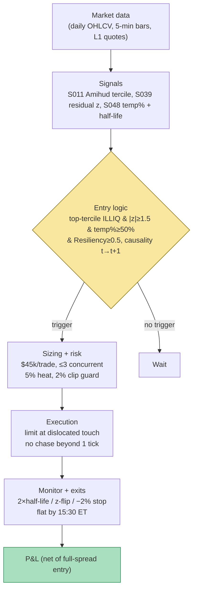

## Stage 127/200 — T027: Illiquidity Temporary-Impact Fade

*Batch TB3 · Strategy 27/100 · Signals S011, S048, S039*

### T1. One-line verdict

| | |
|---|---|
| **Style** | Intraday liquidity-provision / mean-reversion in illiquid names |
| **Edge source** | In illiquid stocks, large uninformed trades push prices beyond fundamentals and the *temporary* (liquidity) component reverts as the book refills — fade the overextension, exit on the resiliency clock |
| **Typical holding period** | 1–3 resiliency half-lives: 20–60 minutes in mid-caps (example) |
| **Capacity hint** | Low: 2,000-share clips in names where that is ≤ 2% of 30-min volume; wide spreads cap size |
| **Build-or-buy in one line** | Build: the three inputs (Amihud screen, resiliency half-life, idiosyncratic residual) are all public-formula analytics — no vendor sells the combination. |

### T2. Full mechanics

**Jargon, defined once:** *temporary impact* is the liquidity-driven part of a price move that decays as the limit order book refills; *permanent impact* is the information-driven part that never reverts — fading the former is liquidity provision, fading the latter is catching a falling knife; *resiliency half-life* $t_{1/2} = \ln 2/\kappa$ is the time for half the temporary impact to decay (S048); *idiosyncratic residual* is the stock's return after stripping out market (and sector) co-movement — the part that belongs to the name alone (S039); *Amihud illiquidity* (ILLIQ) is mean(|daily return| / dollar volume), the price-move-per-dollar gauge (S011).

**Universe & session.** US equities with ILLIQ×10⁶ ≥ 0.001 (example — genuinely illiquid mid/small caps), price ≥ $5 (example), quoted spread ≤ 40 bps (example — wider than that and the edge is all spread). RTH 10:00–15:30 ET (example). Exclude earnings/event days, index-rebalance days, and any name with a halt in the last 5 sessions (example).

**Entry rule (causal; shock at event *t*, earliest fill *t*+1).**
1. **S039 — idiosyncratic overextension.** On 5-minute bars, compute the market-beta residual $\hat{u}(i,t)$ and its 30-minute cumulation $U(i,t,L)$; z-score $z = U/(\hat{\sigma}_u\sqrt{L})$. Require $|z| \geq 1.5$ (example).
2. **S048 — temporary-dominant.** After the shock bar, estimate the temporary fraction of the move: $\text{temp\%} = 1 - I(\infty)/I(0)$ from the resiliency fit (S048's exponential form $I(t) = I(\infty) + (I(0)-I(\infty))e^{-\kappa t}$). Require temp% ≥ 50% (example) — at least half the move must be liquidity, not information. Also require the book to be *currently* dislocated: Resiliency$(t) = (S(t)-S(\infty))/(S(0)-S(\infty)) \geq 0.5$ (example), i.e. the spread/depth has not already recovered.
3. **S011 — illiquidity confirmation.** Name must sit in the top illiquidity tercile of the screened universe that day (example) — the strategy explicitly wants names where liquidity shocks are large.

Side: fade the residual — buy when $z \leq -1.5$, short when $z \geq +1.5$ (shorts require easy borrow, checked pre-open, example).

**Exit rule.** Whichever comes first: (a) *resiliency exit* — hold $2 \times t_{1/2}$ (example) from entry, the point where ~75% of temporary impact has decayed ($1 - e^{-2\ln2} = 0.75$); (b) signal flip — residual z crosses 0 (example); (c) stop-loss at −2% from entry (example — wide, because illiquid names are noisy); (d) flat by 15:30 ET (example). No overnight holds.

**Position sizing.** Fixed $45k notional per trade (example, ~2,000 shares at $22); max 3 concurrent positions (example); portfolio heat ≤ 5% (example). Clip guard: shares ≤ 2% of trailing 30-minute volume (example) — in illiquid names your own entry is itself a shock.

**Risk limits.** Daily loss stop −2% of paper equity (example); max gross $135k (example); kill switch: halt entries if the spread in any held name doubles from entry (liquidity evaporation), or if two stop-losses fire in one day (example).

**Cost model.** Spread dominates: assume paying the *full* quoted spread on entry and half on exit (example — entries lean into a dislocated book, so model entry at the far touch). In-universe spreads of 20–40 bps mean a $45k clip pays $90–180 in spread alone (example). Fees $0.003/share/side (example). Borrow 5% annualized on shorts (example). Impact: the clip is the shock you are fading *against* — model your own entry as adding 10% to the measured temporary impact (example, conservative).

**Order/execution sketch.** Entries as limit orders at the dislocated touch (buy at the bid that the shock just pushed down — you are the refill). If unfilled in 2 minutes (example), chase 1 tick once, then abandon — a fade that needs chasing is a fade without edge. Exits as passive limits at the recovered mid, worked over up to one half-life. All fills are *simulated only — requires MBO/ITCH* for queue realism; the example assumes touch fills.

**Causal t→t+1 timing.** The shock bar closes at *t*; the resiliency fit uses quotes ≤ *t*; the residual z uses bars ≤ *t*; the order goes on the first quote of bar *t*+1. The temporary-fraction estimate needs post-shock observations, so in practice entry lags the shock by 2–3 bars (example) — the strategy explicitly trades the *tail* of the dislocation, not the first print.

### T3. Signals it consumes

| Signal | Role | Weight / logic |
|---|---|---|
| S011 Amihud illiquidity | Universe gate (regime) | trade only top-tercile ILLIQ names (example); refresh daily |
| S048 LOB resiliency | Entry qualifier + exit timer | require temp% ≥ 50% and Resiliency(t) ≥ 0.5 (examples); exit at $2 \times t_{1/2}$ |
| S039 idiosyncratic reversal | Primary trigger (direction) | fade when $\|z\| \geq 1.5$ (example) on 30-min cumulated residuals |

```text
# T027 combination logic (example thresholds; shock bar closes at t)
if name in top_illiq_tercile_today:                 # S011 gate
    z   = idiosyncratic_residual_z(t, L=30min)      # S039
    tmp = temporary_fraction(t)                    # S048: 1 - I(inf)/I(0)
    res = resiliency_now(t)                        # S048: (S(t)-S(inf))/(S(0)-S(inf))
    if abs(z) >= 1.5 and tmp >= 0.50 and res >= 0.50:
        side = -sign(z)                            # fade the overextension
        enter limit at dislocated touch, size = 45k_notional
        exit_at = t + 2 * half_life                # ~75% of temp impact decayed
        stop = -2% ; flat by 15:30 ET
```

### T4. Worked example — numbers + P&L (SYNTHETIC)

**All numbers below are synthetic.** Seed **127** (`batches/TB3/plot_T027.py`); the chart plots these exact entry/exit prices. Cost schedule (*examples*): pay full quoted spread on entry, half on exit; fees $0.003/share/side; borrow budgeted but unused here (all three setups are longs).

| # | Name | Reads (example thresholds) | Side/size | Entry | Exit | Gross | Costs | Net |
|---|---|---|---|---|---|---|---|---|
| 1 | QLYQ | ILLIQ×10⁶=0.0024 (top tercile ✓); z=−1.9; temp 62%; $t_{1/2}$=12 min | buy 2,000 | 22.40 | 22.85 @ +24 min (2 half-lives) | +$900.00 | spread 6¢×2,000=$120 + fees $12 = −$132.00 | **+$768.00** |
| 2 | MNOP | ILLIQ×10⁶=0.0018 ✓; z=−1.7; temp 55%; $t_{1/2}$=15 min | buy 2,000 | 15.10 | 15.28 @ +30 min | +$360.00 | spread 5¢×2,000=$100 + fees $12 = −$112.00 | **+$248.00** |
| 3 | VVRS | ILLIQ×10⁶=0.0021 ✓; z=−1.6; temp 51% — but the "temporary" leg was information | buy 2,000 | 9.80 | 9.55 @ stop −2.5% | −$500.00 | spread 5¢×2,000=$100 + fees $12 = −$112.00 | **−$612.00** |

Day net P&L: +768.00 + 248.00 − 612.00 = **+$404.00** on $119.8k gross notional.

**Where the example is optimistic.** (1) Trade 3 is the honest core of this strategy: the temporary-fraction estimate said 51% liquidity, reality said information — the resiliency fit *cannot* distinguish a slow-informed seller from a liquidity shock in real time, and the example's two winners understate how often this happens. (2) Entry assumes a fill at the dislocated touch; in illiquid names the touch flickers and partial fills are the norm — the 2,000-share clip may take minutes to complete, during which the resiliency clock is already running. (3) The 2%-stop on a 40-bps-spread name is one bad print away from a whipsaw; real stop-outs in illiquid names gap through the stop. (4) Survivorship: the example shows three qualified setups; on a typical day the triple filter (top-tercile ILLIQ + |z|≥1.5 + temp%≥50%) may qualify zero names — opportunity frequency is the binding constraint, not per-trade edge.

### T5. Data & infra — what must run

**Pipeline inventory.** (a) Daily OHLCV for the Amihud screen (top-tercile flag per name, refreshed pre-open); (b) 5-minute bars + market proxy (SPY) for rolling beta and 30-minute residual z-scores across ~300 screened names; (c) L1 quote/spread snapshots (5–30 s, example) for the resiliency fit — spread and depth must be observable through the shock; (d) borrow-availability snapshot for the short side. **Schedule:** 8:00 ET Amihud screen + borrow check; intraday loop every 5 minutes: residual z update, shock detection, resiliency fit on qualified names; post-close: realized vs predicted reversion attribution per trade.

**M5 Max feasibility.** Feasible (Tier M, ~30–60 h ≈ $4,500–9,000 loaded-cost estimate per cost-model §5). Throughput: 300 names × 78 five-minute bars/day = 23k bars — trivial; the resiliency fits are small OLS problems per shock (dozens/day). RAM: the working set (bars + quote snapshots + trailing beta windows) is < 1 GB, far under the 77 GB budget (cost-model §3). Storage: 5-min bars trivial; L1 snapshots for 300 names ≈ 100–400 GB/month in parquet (cost-model §4) — retain 60 days selectively. Bottleneck: quote-data licensing for the resiliency fit, not compute.

**Feed-outage safe-mode.** If quote snapshots stall: no new entries (the resiliency fit is a required qualifier); existing positions fall back to the time-based exit ($2 \times$ last-known half-life) and the stop-loss. If the daily bar feed fails: freeze the universe to yesterday's qualified names. If the borrow feed fails: disable the short side entirely.

### T6. Buy vs build

| Option | What you get | Indicative price | Gains | Loses |
|---|---|---|---|---|
| Tier 0: Stooq + self-built | Daily bars for Amihud + residual screen | ~$0 | Amihud screen and S039 residuals are buildable free | No intraday quotes → no resiliency fit → the strategy's core is missing |
| Tier 1: Polygon Stocks Advanced | 1-min bars + quotes/trades | ~$30–200/mo, indicative — verify before budgeting | Enough for residuals and a coarse resiliency fit | Quote snapshots coarse for fast half-lives |
| Tier 2: Databento (L1) | Exchange-timestamped quotes | ~$200/mo + usage, indicative — verify before budgeting | Honest resiliency estimation; real spread/depth through shocks | Still no depth beyond touch for the refill read |
| Retail platform: QuantConnect | Bars + paper trading | ~$20–100/mo, indicative — verify before budgeting | Quick prototype of the residual leg | Quote-level resiliency work is painful on the platform |

**Verdict: build on Tier 1 minimum, Tier 2 preferred.** The Amihud screen and residual trigger are cheap; the resiliency half-life is the differentiator and needs honest quote data. There is no vendor that sells "temporary-impact fade signals" — the combination is the product. Crossover: if you cannot afford quote data, drop the S048 leg and you no longer have this strategy — you have plain short-term reversal (T011), which is a different (and more crowded) trade.

### T7. Success-ratio evidence

| Study / source | Market & period | Metric | Before/after cost | Caveat |
|---|---|---|---|---|
| Amihud 2002 (JFM) | NYSE, 1964–1997 | ILLIQ cross-sectional return premium | Before cost | Pricing result, not a fade-strategy backtest |
| Mu et al. 2010 (descriptive; per S048) | Intraday large price changes | Power-law decay of spread/volume imbalance after shocks | Before cost | Descriptive physics of the book, not tradable P&L |
| Short-term reversal literature (Jegadeesh 1990; Lehmann 1990) | US equities | Contrarian profits ~1–2%/month at monthly horizon; intraday variants smaller | Before cost (intraday after-cost heavily spread-dependent) | The documented reversal is at longer horizons; the intraday temporary-impact slice is thinner |
| Grok TB3 lead: Gašperov & Begušić 2022 (PLOS One) | BTC-USD, 30 days L2 | Inventory-controlled MM had lowest drawdowns; RL variants won Sharpe 24/30 days | Before explicit cost framing; *partially verified lead* | Crypto L2, not equity; about quoting, not fading |

**Capacity & decay.** The edge lives exactly where capacity is smallest: illiquid names with wide spreads. Every basis point of spread widening since the strategy's calibration comes straight out of the fade's P&L. No published after-cost Sharpe exists for the Amihud + resiliency + residual combination — treat the triple filter as *unverified as a combination*.

**Honest bottom line.** For a ≤$1M paper operation: a legitimate niche strategy with honest economics — the costs are visible up front (the spread *is* the business model of the other side), so you will know quickly whether the residual edge clears them. Expect sparse trading (a few qualified setups per week, example) and a return stream dominated by a handful of stop-outs like Trade 3. For an institutional desk: this is a small-cap market-making desk's bread and butter, executed with real depth data and inventory netting across names — the retail version is a strictly worse-informed subset.

### T8. Failure modes

1. **Temporary vs permanent misclassification.** The strategy's existential risk: the resiliency fit labels an informed seller's pressure "temporary" and you buy into a fundamental repricing (Trade 3). *Mitigation:* require temp% ≥ 50% *and* no news in the last 60 minutes (example); the stop-loss is the backstop, not the plan.
2. **Spread blowout.** In illiquid names the spread can double mid-trade, turning a 30-bps edge into a 60-bps cost. *Mitigation:* spread-doubling kill switch (T2); model entry at the full spread, not the half.
3. **Your own impact.** A 2,000-share clip in a name doing 100k shares/day *is* a liquidity event — you become the shock you are trying to fade. *Mitigation:* the 2%-of-30-min-volume clip guard; smaller clips in thinner names.
4. **Half-life instability.** κ̂ estimated on 3 shocks is noise; spacing exits on noise means exiting before reversion or holding into the next shock. *Mitigation:* require ≥ 20 shocks per liquidity regime for κ̂ (per S048's parameter table); shrink size when the estimate is young.
5. **Opportunity drought.** The triple filter is strict; weeks can pass with no qualified setup, tempting threshold relaxation. *Mitigation:* freeze thresholds (S088 discipline); treat "no trade" as a valid output and size the operation's expectations accordingly.
6. **Overnight/event gap on held positions.** Even intraday holds can gap on news. *Mitigation:* hard flat by 15:30 ET; event-day exclusion list.
7. **Beta-estimation leakage.** Estimating β on a window that includes the shock regresses the shock on itself and shrinks the residual. *Mitigation:* per S039, β̂ uses data ≤ t−1 only, never the formation window.

### T9. Visuals




### T10. Sources

1. Amihud, Y. (2002), "Illiquidity and stock returns: Cross-section and time-series effects", *Journal of Financial Markets*. https://doi.org/10.1016/s1386-4181(01)00024-6 — the ILLIQ universe gate.
2. Jegadeesh, N. (1990), "Evidence of predictable behavior of security returns", *Journal of Finance*. https://doi.org/10.1111/j.1540-6261.1990.tb05110.x; Lehmann, B.N. (1990), "Fads, martingales, and market efficiency", *Quarterly Journal of Economics*. https://doi.org/10.2307/2937816 — short-term reversal, the family this fade belongs to.
3. Cont, R., Kukanov, A. & Stoikov, S. (2014), "The Price Impact of Order Book Events", *Journal of Financial Econometrics* 12(1). — impact decomposition into temporary and permanent components.
4. Lee, C.M.C. & Ready, M.J. (1991), "Inferring trade direction from intraday data", *Journal of Finance*. https://doi.org/10.1111/j.1540-6261.1991.tb02683.x — shock-sign classification for the resiliency fit inputs.
5. O'Hara, M. (1995), *Market Microstructure Theory*, Blackwell. — the inventory/adverse-selection decomposition behind temporary vs permanent impact.

**Unverified leads** (not independently checked — do not cite as fact):
- Grok (2026-09-10): Mu et al. 2010 power-law decay citation via S048 (duck.ai lead) — *unverified chatbot claim*; Gašperov & Begušić PLOS One figures — *partially verified lead*.
- The 50% temporary-fraction gate, 2× half-life exit, and 2% clip guard — example parameters of this chapter, not calibrated standards.
- Vendor prices in T6 are indicative — verify before budgeting.

*Source log: Grok answered Q-TB3-1..3 (2026-09-10); all claims independently verified or labeled unverified.*

---
