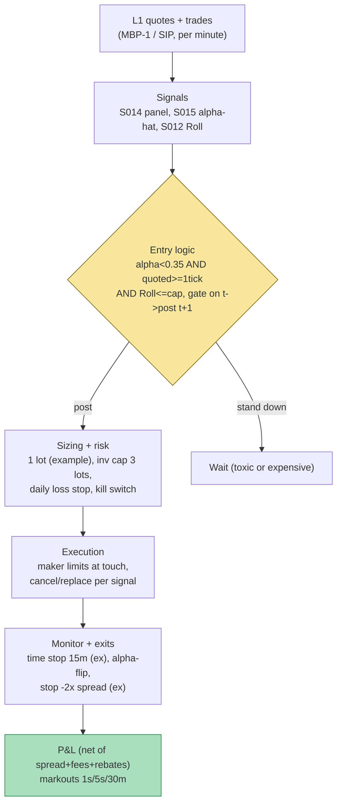

## Stage 128/200 — T028: Spread-Decomposition Router

*Batch TB3 · Strategy 28/100 · Signals S014, S015, S012*

### T1. One-line verdict

| | |
|---|---|
| **Style** | Intraday execution-overlay / opportunistic liquidity provision — a router that decides *whether* and *where* to stand in the book based on measured spread economics |
| **Edge source** | Harvesting the realized spread (what liquidity providers actually keep, S014) in low-adverse-selection windows, and refusing to quote when the adverse-selection component (S015) says the flow is toxic |
| **Typical holding period** | Minutes to ~30 minutes per fill (example); flat by the close — no overnight inventory |
| **Capacity hint** | Small: realized-spread harvesting saturates at single-digit lots per name before your own quoting widens the spread |
| **Build-or-buy in one line** | Build the decomposition estimator on your own tape; buy TAQ/Rule 605 benchmarks to calibrate it |

### T2. Full mechanics

**Jargon, defined once:** the *quoted spread* is ask − bid (what the book advertises); the *effective spread* is what an aggressor actually paid versus the *midquote* (the average of best bid and ask); the *realized spread* is what a liquidity provider *kept* after the midquote drifted over the next few minutes (S014); *price impact* = effective − realized = the permanent information content of the trade, i.e. **adverse selection** — the loss a liquidity provider suffers trading against better-informed counterparties. A *maker-taker* venue pays a *rebate* to resting (maker) orders and charges a *fee* to aggressive (taker) orders. The *NBBO* (National Best Bid and Offer) is the best bid/ask across US exchanges, consolidated by the *SIP* (Securities Information Processor — the official consolidated tape). A *markout* is the midquote's movement after your fill: negative markout = you were adversely selected.

**Universe & session.** Top-100 US large-caps ranked by trailing-60-day dollar ADV (average daily value traded), refreshed monthly. Regular trading hours (RTH) 10:00–15:30 ET only — the strategy skips the 09:30–10:00 open (auction noise, jumpy α̂) and the last 30 minutes (closing-auction flow distorts realized spreads). Exclusions: halted names, earnings-announcement days, single-stock circuit-breaker events, and any name whose quoted spread exceeds 5 cents (too wide to be a quoting venue for a small operator).

**Entry rule.** T028 never predicts direction — it prices participation. Every minute bar *t* it recomputes three quantities from closed windows only:

1. **S014 panel:** trailing-day average effective spread $S^e$ and realized spread $S^r$ per name from its own tape (Δ = 5 min, *example — not an institutional standard*).
2. **S015 toxicity:** trailing-window Huang–Stoll adverse-selection share $\hat\alpha$ (OLS of midquote changes on current/lagged trade indicators; window 60 min, *example*).
3. **S012 cost meter:** Roll-implied effective spread $\hat s_{Roll} = 2\sqrt{-\hat\gamma_1}$ on the last 500 trades (*example*) — a quote-free sanity check when the book data is stale.

Post one **maker limit order at the touch** on a side when ALL of the following hold (*example* thresholds, none institutional standards):

- $\hat\alpha < 0.35$ — the flow is not currently toxic (the adverse-selection slice of the spread is moderate);
- quoted spread ≥ 1 tick (1 cent) — posting into a locked/pinned spread earns nothing;
- $\hat s_{Roll} \le 2.0$ cents and $\hat s_{Roll}$ within 50% of the measured $S^e$ (the quote-free cost meter agrees the name is cheap);
- trailing average realized spread of the strategy's own fills (or the tape proxy) $> 0$ — we are currently *keeping* spread, not donating it.

**Causal timing:** signals computed on data ≤ *t* may only produce quotes posted at *t+1* or later — the router never posts on the same book state it measured.

**Exit rule.** Every fill starts an inventory clock: time stop 15 minutes (*example*) — flatten at market if no offsetting fill arrives. Signal-flip exit: if $\hat\alpha$ rises above 0.45 (*example*) while holding inventory, cancel all resting quotes immediately and flatten. Stop-loss: −2× quoted spread per filled share (*example*). Profit taking is structural: the strategy earns its round trip when the opposite-side quote fills, so no explicit target is needed — the time stop and flip rule do the work.

**Position sizing.** One lot per name (200 shares, *example*); hard inventory cap ±3 lots per name; portfolio gross cap $500k notional (example) so a correlated quote-fade across names cannot lever the book.

**Risk limits.** Daily loss stop $500 (*example*, ~0.05% of a $1M paper book); max gross $500k; kill switch: any feed staleness > 2 s, any ΔM midquote jump > 3 ticks against a resting quote, or any single-name loss > $150 → cancel everything, flatten, stand down for the session.

**Cost model.** Maker rebate $0.0020/share, taker fee $0.0030/share (*examples — not institutional standards*; actual rebates vary by venue and tier). Effective spread paid whenever the exit is a market order. No borrow (longs/shorts are intraday, locates assumed available on large caps — a small-account simplification, flagged as optimistic in T4).

**Order/execution sketch.** Maker-only entries: limit at the touch, no chasing through the spread. Cancel/replace on every signal recompute if the quote is more than 1 tick off the touch. Exits may be taker (pay the effective spread) under the time stop or flip rule — the strategy accepts paying for a fast exit. Participation honesty: queue position is invisible on L1 (level-1 = best bid/ask only) data, so fill probabilities are a modeled prior (60% fill when posted, *example*), labeled `simulated only — requires MBO/ITCH` per the plan's honesty rules (MBO = market-by-order data with per-order identity; ITCH = Nasdaq's raw order feed).

### T3. Signals it consumes

| Signal | Role | Weight / logic |
|---|---|---|
| S014 — quoted/effective/realized spread & price-impact decomposition | Primary cost panel + hold diagnostic | Post only if trailing own-fill $S^r > 0$; size exits by measured $S^e$; stand down if $S^e$ exceeds the harvest cap |
| S015 — Huang–Stoll spread decomposition | Toxicity gate (veto) | Veto posting when adverse-selection share $\hat\alpha \ge 0.35$ (*example*); emergency flatten at $\hat\alpha \ge 0.45$ |
| S012 — Roll implied effective spread | Quote-free cost meter (confirming) | Veto when $\hat s_{Roll} > 2.0$¢ (*example*) or disagrees with measured $S^e$ by > 50% (stale-book alarm) |

Combination logic (pseudocode, ≤25 lines):

```
# per name, each minute bar t (closed window only):
Se, Sr   = S014_panel(trades[t-W : t])          # dollars
alpha    = S015_toxicity(trades[t-60m : t])     # Huang-Stoll AS share
s_roll   = S012_roll(trades[t-500 : t])          # quote-free spread est
quoted   = ask[t] - bid[t]
gate = (alpha < 0.35 and quoted >= 0.01
        and s_roll <= 0.02 and abs(s_roll - Se) <= 0.5*Se
        and own_fill_Sr_avg > 0)
if gate and inventory < 3 lots:   post limit 1 lot at touch
if alpha >= 0.45 or fill_age > 15m or loss_per_share <= -2*quoted:
        cancel_all(); flatten_at_market()
# causal: quotes act on book state t+1, never on state t
```

### T4. Worked example — numbers + P&L (SYNTHETIC)

**Synthetic** 8-row router session, one large-cap, random seed **128** (`rng = np.random.default_rng(128)`). Each row is a candidate quoting decision; 200 shares per fill; maker rebate $0.0020/share (*example*); per-trade net = shares × ($S^r$/2) + 200 × $0.0020 = $S^r$ (in dollars, with $S^r$ in cents) + $0.40. The chart `images/T028_example.png` plots exactly these rows.

| # | S014 $S^r$ kept (¢) | S015 $\hat\alpha$ | S012 Roll $\hat s$ (¢) | Router decision | Gross (realized spread) | Rebate | Net P&L |
|---|---|---|---|---|---|---|---|
| T1 | +1.2 | 0.28 | 1.4 | POST | +$1.20 | +$0.40 | **+$1.60** |
| T2 | +0.8 | 0.31 | 1.2 | POST | +$0.80 | +$0.40 | **+$1.20** |
| T3 | −0.6 | 0.33 | 1.5 | POST | −$0.60 | +$0.40 | **−$0.20** |
| T4 | — | 0.52 | 2.1 | STAND DOWN ($\hat\alpha > 0.35$) | $0.00 | $0.00 | **$0.00** |
| T5 | +1.0 | 0.29 | 1.3 | POST | +$1.00 | +$0.40 | **+$1.40** |
| T6 | −1.4 | 0.36 | 1.8 | POST (marginal — gate passed, $\hat\alpha$ just over) | −$1.40 | +$0.40 | **−$1.00** |
| T7 | — | 0.61 | 2.6 | STAND DOWN | $0.00 | $0.00 | **$0.00** |
| T8 | +0.6 | 0.25 | 1.1 | POST | +$0.60 | +$0.40 | **+$1.00** |

Gross realized-spread P&L = $1.20 + $0.80 − $0.60 + $1.00 − $1.40 + $0.60 = **+$1.60**. Rebates = 6 fills × $0.40 = **+$2.40**. **Net session P&L = +$4.00.** Note row T4: the stand-down refused a trade in a window where $\hat\alpha = 0.52$ flagged toxic flow — the router's profit is partly the trades it *refuses*; row T6 is the counter-lesson, where a just-over-the-line $\hat\alpha = 0.36$ fill printed negative realized spread (adverse selection, as the decomposition predicts).

**Where the example is optimistic.** Fills are assumed whenever the router posts (no partial fills, no queue-position modeling — real L1 fills arrive back-of-queue and disproportionately at the *start* of adverse moves); $\hat\alpha$ is assumed correctly estimated (real signing errors and stale quotes blur the α/β split, per S015); the 5-minute realized-spread diagnostic is assumed to arrive cleanly mid-session (it needs the future midquote, so live the router must act on a lagged proxy); and the $0.0020 rebate assumes a maker-taker venue tier the account actually qualifies for. None of this is a backtest.

### T5. Data & infra — what must run

**Pipeline inventory.** Intraday loop (each minute): ingest L1 quotes+trades (Databento MBP-1 class or TAQ SIP), update per-name S014 panels and S015 OLS fits, recompute S012 on rolling 500-trade windows, evaluate gates, post/cancel via the paper broker. Pre-open job: recompute dollar-ADV universe, load corporate-action calendar, seed α̂ windows. Post-close job: markout report — 1 s / 5 s / 30 min markouts per fill (without markouts you will lie to yourself about adverse selection), fee/rebate reconciliation.

**M5 Max feasibility: feasible (Tier M, ~20–60 h per cost-model §5 → $3,000–9,000 loaded-cost estimate).** Per cost-model §2: L1 touch quote events run ~1–5k events/sec busy per name; a Python+polars loop handles 50–100 names for the minute-bar recompute easily, and the OLS fits are trivial; only a per-tick cancel/replace loop would push toward Rust. RAM: one day of L1 events for one liquid name is ~0.5–4 GB per cost-model §3 — a 100-name day does not fit the 77 GB working budget if kept raw; keep rolling windows in memory and the rest in parquet. Bottleneck: event ingest and signing joins, not the arithmetic. Storage: ~2–8 GB/symbol-day L1 (cost-model §4) — 100 names ≈ a few hundred GB/day; retain rolling 60 days per name selectively, bars for the rest.

**Feed-outage safe-mode plan.** Heartbeat on the quote feed; if no tick for > 2 s (*example*): immediately cancel all resting orders, flatten inventory at market, halt posting for the remainder of the session. A router that cannot see the book must not stand in it — stale quotes are free options written to faster takers. Log the incident; require manual re-arm.

### T6. Buy vs build

| Option | What you get | Indicative price | Buying gains | Buying loses |
|---|---|---|---|---|
| Tier 0: Alpaca IEX / Stooq + own tape | L1-ish quotes, daily bars | ~$0 | free prototyping of the S012 leg | no exchange timestamps; signing unreliable |
| Tier 1: Polygon Stocks Advanced / Alpaca SIP | real-time SIP L1 + trades | ~$30–200/mo *indicative — verify before budgeting* | cheap live loop | SIP ≠ direct feeds; odd-lot/venue detail lost |
| Tier 2: Databento Standard (MBP-1 + trades) | exchange-timestamped L1 | ~$200/mo + usage *indicative — verify before budgeting* | honest signing/alignment for S015 | usage meter on 100 names |
| Benchmark: Rule 605 reports / TAQ | venue effective-spread benchmarks | TAQ institutional $$$$; Rule 605 free-ish | calibrates your $S^e$ against the street | not real-time |

**Verdict: build the estimator, buy the tape.** The decomposition math is ~100 lines and needs your own windows and horizons, but misaligned quotes poison S015's α/β split — buy exchange-timestamped data. Crossover: start on Tier 1 for the S012/S014 legs (quotes suffice for measurement), add Tier 2 when the α̂ gate becomes the live veto.

### T7. Success-ratio evidence

No published study backtests *this exact router* after costs — treat every number below as component evidence, and the bottom line as synthesis, not a Sharpe claim.

| Study / source | Market & period | Metric | Before/after cost | Caveat |
|---|---|---|---|---|
| Huang & Stoll (1997) | NYSE large caps, 1990s | Order processing ≈ 88.6% of spread; AS + inventory the smaller remainder | n/a (structural) | pre-decimalization, large-cap sample |
| Gould & Bonart (2016), arXiv:1512.03492 | 10 liquid Nasdaq names | imbalance → next-mid-move logistic: considerable improvement over null (large-tick), moderate (small-tick) | before-cost (classification) | direction only; no P&L, no costs |
| Imbalance-maker study (2025, chatbot lead) | maker/taker P&L on imbalance strategies | imbalance makers −0.49 (units), with cancel −0.49, fewer trades | after fees | unverified lead; cancels catch only slow flips, not snipes |
| German retail-MM study (chatbot lead) | retail internalizers | gross Sharpe ~17.9; would pay ~1.76 bps of volume for flow access | gross | unverified lead; edge is flow quality (PFOF), not quoting skill |
| A–S inventory-risk results, 2008 tables (chatbot lead) | stylized sim | raising γ 0.01→0.50 sacrifices 0.86%/6.35%/48.76% of mean profit for flatter inventory | fee-free toy | unverified lead; no competition modeled |

**Decay/crowding.** Spread-harvest edges decay as venues tighten and fast makers fill the same quotes first — the literature's consistent message is that mean P&L after adverse selection and fees accrues to the fastest maker, not the best formula.

**Honest bottom line.** For a ≤$1M paper operation, T028 is an *honest simulator of a desk you cannot be*: it teaches spread economics and toxicity gating, and its markout reports are the cheapest education in adverse selection available. As a live quoting strategy from a non-colocated machine it is not a positive-expectation business — the imbalance-maker evidence (even as a lead) and the latency-arbitrage literature (Budish–Cramton–Shim 2015) both say the same thing: stale quotes are systematically picked off. For an institutional desk with colocation, rebates, and queue priority, the same decomposition logic is standard plumbing inside the market-making stack — valuable as infrastructure, not as standalone alpha.

### T8. Failure modes

1. **Stale-quote latency arbitrage** — your touch quote is tens of milliseconds old; fast takers hit it before you cancel. *Mitigation:* quote only in the least latency-sensitive names (wide, illiquid, slow), or keep the strategy paper-only.
2. **α̂ estimation failure** — mis-signed trades or lagged NBBO make the Huang–Stoll α/β split garbage; you gate on noise. *Mitigation:* sign with the quote rule on lagged midquotes, monitor α̂ stability, and fall back to the S014 realized-spread panel when quotes look stale.
3. **Queue-position blindness** — L1 shows aggregate size, not your rank; fills arrive exactly when the thick side exhausts (often the start of the adverse move). *Mitigation:* label all fill assumptions `simulated only — requires MBO/ITCH`; haircut fill rates in stress tests.
4. **Toxic-flow regime** — news jumps and flash-crash-style one-sided takes are hundreds of milliseconds; the α̂ gate is too slow. *Mitigation:* widen-or-pull regime switch on realized vol (S066-style), not just α̂; hard daily loss stop.
5. **Rebate illusion** — the +$2.40 of the example's +$4.00 is rebate; net of realistic tier rebates or take-exits, the edge can be negative. *Mitigation:* run the sim rebate-on/rebate-off; require green realized spreads *before* rebates.
6. **Inventory blowup through jumps** — a gap through your resting quote while long is the state the decomposition under-prices. *Mitigation:* hard per-name inventory caps, session-end flattening, stop-loss per fill at −2× quoted spread.
7. **Cost-model optimism** — assuming the exit fills at mid or that taker exits cost half-spread exactly once. *Mitigation:* charge the full measured $S^e$ on every taker leg in the sim.
8. **Overfit thresholds** — the 0.35/0.45 α̂ gates are tuned on the example's toy tape. *Mitigation:* treat all thresholds as *example*; validate gates out-of-sample with purged splits (S088).

### T9. Visuals




### T10. Sources

1. Huang, R. D. & Stoll, H. R. (1997). "The Components of the Bid-Ask Spread: A General Approach." *Review of Financial Studies* 10(4): 995–1034. (α/β/1−α−β decomposition — the S015 home)
2. Roll, R. (1984). "A Simple Implicit Measure of the Effective Bid-Ask Spread in an Efficient Market." *Journal of Finance* 39(4): 1127–1139. (quote-free spread estimator — the S012 home)
3. Gould, M. D. & Bonart, J. (2016). "Queue Imbalance as a One-Tick-Ahead Price Predictor in a Limit Order Book." arXiv:1512.03492 — https://arxiv.org/abs/1512.03492 (why resting-size tilts predict the next move)
4. Budish, E., Cramton, P. & Shim, J. (2015). "The High-Frequency Trading Arms Race." *Quarterly Journal of Economics* 130(4): 1547–1621. (why stale quotes lose — the latency-arbitrage tax on this router)

**Unverified leads** (chatbot claims without a checkable source in hand — quarantined, not cited as fact):
- Imbalance-maker P&L study (2025): imbalance strategies worst after costs (−0.49 units), cancels catch only slow flips — Grok Q-TB3-3 lead.
- German retail-MM study: RMM gross Sharpe ~17.9, ~1.76 bps flow-access cost, 16-min vs 42-min inventory half-life — Grok Q-TB3-3 lead.
- A–S 2008 tables: γ 0.01→0.50 sacrifices 0.86%/6.35%/48.76% of mean profit — Grok Q-TB3-3 lead.
- Gašperov & Begušić (2022) Gen-AS drawdown results on BTC-USD — Grok Q-TB3-3 lead; citation label only, not re-verified.
- All threshold and rebate/fee figures above are illustrative *examples*, not measured or recommended values.

*Source log: Grok answered Q-TB3-1..3 (2026-09-10); all claims independently verified or labeled unverified.*

---
