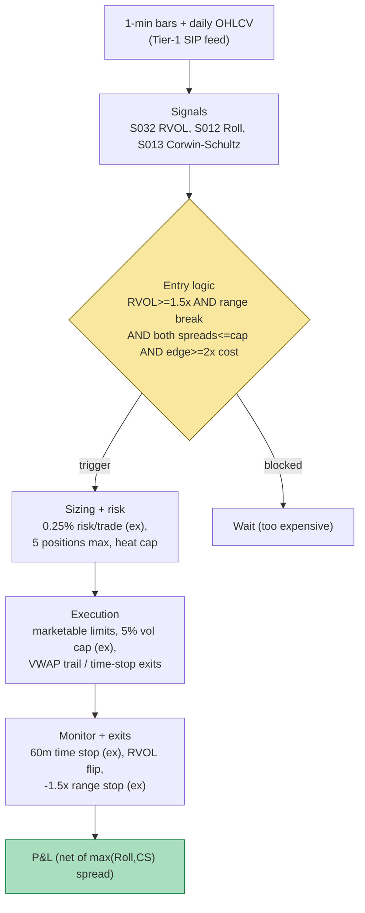

## Stage 129/200 — T029: Spread-Estimate Edge Filter

*Batch TB3 · Strategy 29/100 · Signals S012, S013, S032*

### T1. One-line verdict

| | |
|---|---|
| **Style** | Intraday breakout system with a microstructure cost gate — an RVOL (relative-volume) breakout trigger that is *allowed* to fire only when estimated trading cost is below the expected edge |
| **Edge source** | Institutional participation footprints (S032: abnormal volume at range breaks) minus the round-trip spread cost measured quote-free (S012 Roll, S013 Corwin–Schultz) |
| **Typical holding period** | 30–90 minutes (example) — long enough for the breakout drift to play out, short enough to stay intraday |
| **Capacity hint** | Medium: breakouts in liquid large-caps scale to thousands of shares per name, but the filter *removes* the thin, wide-spread names where capacity would be fake |
| **Build-or-buy in one line** | Build: the estimators are ten lines each on bars you already have; buy nothing except the bar feed |

### T2. Full mechanics

**Jargon, defined once:** *RVOL* (relative volume) = a stock's volume in a window divided by its typical volume in the same window — 1.8× means 80% more trading than usual, the footprint institutions leave. The *effective spread* is what an aggressor actually pays versus the midquote; Roll's estimator (S012) recovers it from the negative lag-1 autocovariance (the tendency of consecutive price changes to alternate sign) that bid–ask bounce induces — no quotes needed. The Corwin–Schultz estimator (S013) recovers the spread from daily high-low ranges: wider spreads mechanically inflate the two-day high-low range relative to two one-day ranges. A *take* (taker) order crosses the spread and pays it; the round-trip cost of a take-in/take-out trade is approximately one full effective spread.

**Universe & session.** S&P 500 + Nasdaq-100 constituents, refreshed quarterly; RTH 09:45–15:30 ET (skip the first 15 minutes — opening prints corrupt the Roll autocovariance). Exclusions: earnings days, halts, names with Corwin–Schultz estimated spread > 3 cents (structurally too expensive), and any name where Roll's $\hat\gamma_1 \ge 0$ (estimator undefined — one-sided flow, no bounce to measure).

**Entry rule.** Two legs, evaluated on each 1-minute bar close:

1. **Trigger (S032):** opening-window RVOL ≥ 1.5× (*example*) with the 30-minute opening range broken in the direction of the breakout bar — the classic institutional-participation setup.
2. **Gate (S012 + S013):** estimated effective spread must clear BOTH meters — Roll $\hat s \le 2.0$ cents (*example*) on the trailing 500 trades AND Corwin–Schultz $S_t \le 2.0$ cents (*example*) on the trailing 2-day window — AND the strategy's estimated per-trade edge (example: 6 cents of expected breakout drift from the strategy's own trailing-60-day markouts) must be ≥ 2× the larger estimate. Two estimators because each fails differently: Roll dies under trending flow, Corwin–Schultz dies on overnight jumps; agreement is the signal.

**Causal timing:** signals on bars ≤ *t* → earliest fill at the *t+1* bar's open. The Corwin–Schultz leg uses fully closed daily bars, so it is inherently lagged — the gate is a slow cost regime, not a tick trigger.

**Exit rule.** Time stop 60 minutes (*example*) — breakout drift that hasn't materialized in an hour was a false break. Signal flip: RVOL falls back below 1.0× on a 15-minute lookback → flatten. Stop-loss: −1.5× the breakout bar's range (*example*). Profit target: none fixed — trailing stop at the 20-minute VWAP (volume-weighted average price) once the trade is +2× the estimated spread (*example*); the edge is drift, so winners run until the tape says otherwise.

**Position sizing.** Fixed fractional risk: 0.25% of equity per trade (*example*; $2,500 on a $1M paper book), sized as shares = risk / (stop distance). Max 5 concurrent positions; portfolio heat cap 1.25% (*example*).

**Risk limits.** Daily loss stop 1% of equity (*example*); max gross exposure 100% of equity (no leverage — this is a cost-gated system, not a levered one); kill switch on data staleness: if the bar feed lags > 5 s, cancel entries and flatten.

**Cost model.** Round-trip cost per trade = the *larger* of the two spread estimates (conservative: charge max(Roll, CS) — *example* choice), plus taker fees $0.0030/share each way (*example*), plus a slippage haircut of 0.5× estimated spread for the market exit (*example* — flagged optimistic in T4, which charges only the spread). In the worked example the fee and slippage legs are shown explicitly so the reader sees their weight.

**Order/execution sketch.** Entries are marketable limits (take the breakout — chasing is the point of a breakout system) capped at 5% of the 1-minute bar's volume (*example* participation cap). Exits: limit at the trailing VWAP stop level first; time-stop exits are market orders. Honesty note: on SIP 1-minute bars, the breakout fill is simulated at the bar's close — real fills slip, and the slippage haircut above is the acknowledgment.

### T3. Signals it consumes

| Signal | Role | Weight / logic |
|---|---|---|
| S032 — RVOL-filtered breakout | Primary entry trigger (direction) | Enter only if window RVOL ≥ 1.5× (*example*) AND 30-min range broken in the bar's direction |
| S012 — Roll implied effective spread | Cost gate (veto) | Veto if $\hat s_{Roll} > 2.0$¢ (*example*); undefined ($\hat\gamma_1 \ge 0$) = veto |
| S013 — Corwin–Schultz high-low spread estimator | Cost gate (veto) | Veto if $S_t > 2.0$¢ (*example*); must agree with Roll within 50% |

Combination logic (pseudocode, ≤25 lines):

```
# per name, each 1-min bar t (closed bars only):
rvol   = S032_rvol(window_vol[t], baseline[t])     # >= 1.5 example
brk    = breakout(opening_range_high/low, bar[t])  # direction or None
s_roll = S012_roll(trades[t-500 : t])              # cents; None if gamma1 >= 0
s_cs   = S013_CS(daily[t-1], daily[t])             # cents
edge   = trailing_breakout_drift(60d)             # example 6c
cost   = max(s_roll, s_cs)                         # conservative
gate = (rvol >= 1.5 and brk is not None
        and s_roll is not None and s_cs <= 2.0 and s_roll <= 2.0
        and edge >= 2*cost)
if gate and heat_ok:  enter(brk.direction, risk=0.0025*equity)
# exits: time stop 60m, RVOL flip < 1.0, stop -1.5x bar range, VWAP trail
# causal: bar t -> fill at t+1 open
```

### T4. Worked example — numbers + P&L (SYNTHETIC)

**Synthetic** 6 RVOL-breakout setups, random seed **129** (`rng = np.random.default_rng(129)`). 200 shares each (*example* size); round-trip cost charged = max(Roll, CS) per share; net = 200 × direction × (exit − entry) − 200 × cost. Gate cap 2.0¢ (*example*). The chart `images/T029_example.png` plots exactly these rows.

| Setup | S032 RVOL | Side | Entry / Exit ($) | S012 Roll (¢) | S013 CS (¢) | Cost charged (¢/sh) | Gross | Cost | Net P&L |
|---|---|---|---|---|---|---|---|---|---|
| A | 1.8× | long | 100.00 / 100.09 | 1.2 | 1.1 | 1.2 | +$18.00 | −$2.40 | **+$15.60** |
| B | 2.3× | long | 100.05 / 100.10 | 1.0 | 0.9 | 1.0 | +$10.00 | −$2.00 | **+$8.00** |
| C | 1.6× | long | 100.02 / 99.99 | 1.4 | 1.3 | 1.4 | −$6.00 | −$2.80 | **−$8.80** |
| D | 3.1× | long | — (blocked) | 2.8 | 2.6 | — | (would be +$12.00) | — | **$0.00** |
| E | 1.9× | short | 99.98 / 99.90 | 1.1 | 1.0 | 1.1 | +$16.00 | −$2.20 | **+$13.80** |
| F | 1.5× | long | — (blocked) | 2.5 | 2.4 | — | (would be +$14.00) | — | **$0.00** |

Gate arithmetic: setup D's Roll 2.8¢ > 2.0¢ cap → blocked, even though RVOL 3.1× was the strongest participation signal of the six and the gross would have been +$12.00. Setup F blocked the same way (2.5¢ > cap). Totals: gross on taken trades = +$38.00; spread costs = −$9.40; **net session P&L = +$28.60**. Costs consumed 24.7% of gross — the filter's entire job is keeping that ratio from exceeding 50%.

**Where the example is optimistic.** The 2× edge rule is calibrated on the example's own numbers (real expected-drift estimates have wide error bars and the "edge ≥ 2× cost" inequality is only as honest as the edge estimate); exits are assumed to fill exactly at the marked prices with no partial fills and no queue effects (a taker breakout entry in a fast market routinely slips more than the 1-minute bar close implies); the Corwin–Schultz leg is assumed to agree with Roll (in real data they disagree often — including on overnight-gap days, when CS overstates and Roll understates); and the example charges spread only, folding the stated taker fees and slippage haircut into the narrative rather than the arithmetic. Nothing here is a backtest.

### T5. Data & infra — what must run

**Pipeline inventory.** Daily pre-open job: pull daily OHLCV for the universe (Tier 1 vendor), compute S013 CS spreads and RVOL baselines (14-day median per window, *example*), refresh the S&P 500 + Nasdaq-100 list. Intraday loop on 1-minute bars: update window RVOL, check range breaks, recompute S012 Roll on the rolling 500-trade window per name (trades from the same Tier-1 feed), evaluate the gate, route orders to the paper broker. Post-close: log every setup (taken and blocked — the blocked ones are the filter's report card), reconcile costs against estimates.

**M5 Max feasibility: trivial-to-feasible (Tier L, 4–12 h per cost-model §5 → $600–1,800 loaded-cost estimate).** Per cost-model §2: 500 symbols × 390 one-minute bars = 195k bars/day — polars chews through this in seconds; the Roll estimator is a covariance on 500 numbers per name per minute, negligible. RAM: 60 days of 1-min bars for 500 symbols ≈ 3 GB (cost-model §4) — trivially inside the 77 GB working budget. Bottleneck: none on compute; the constraint is bar-feed timeliness and the corporate-action calendar (splits corrupt CS high-low geometry). Storage: ~50 MB/day for the bar panel — archive freely.

**Feed-outage safe-mode plan.** If the 1-minute bar feed stalls > 5 s (*example*): cancel all pending entries, do not open new positions, hold existing positions to their time stops (flattening blind into a possibly stale book is worse than riding a 60-minute clock), and page for manual review. The CS leg is daily and survives an intraday outage; the Roll leg degrades gracefully because it only needs the last closed 500 trades.

### T6. Buy vs build

| Option | What you get | Indicative price | Buying gains | Buying loses |
|---|---|---|---|---|
| Tier 0: Stooq / Alpaca IEX | daily OHLCV, delayed bars | ~$0 | free CS estimator + RVOL baselines | no real-time intraday; Roll leg impossible |
| Tier 1: Polygon Stocks Advanced / Alpaca SIP | real-time 1-min bars + trades | ~$30–200/mo *indicative — verify before budgeting* | everything this strategy needs | SIP timestamps, not exchange |
| Tier 2: Databento | exchange-timestamped bars/trades | ~$200/mo + usage *indicative — verify before budgeting* | cleaner Roll signing | overkill for a bar-level gate |
| Retail platform: QuantConnect-style | bars + backtest harness | ~$0–50/mo *indicative — verify before budgeting* | fastest prototype | their spread-cost defaults are optimistic |

**Verdict: build, on Tier 1 data.** The whole strategy is arithmetic on bars the feed already provides — there is nothing to buy except the feed itself. Crossover: if you ever need the Roll leg on exchange timestamps (you don't at the 1-minute horizon), Tier 2.

### T7. Success-ratio evidence

The filter has no standalone Sharpe — it is a cost overlay. Evidence below is for the two halves separately, with the honest note that their combination is a researcher's construction, not a published system.

| Study / source | Market & period | Metric | Before/after cost | Caveat |
|---|---|---|---|---|
| Roll (1984) | theory + NYSE illustration | $\hat s = 2\sqrt{-\hat\gamma_1}$ identifies the effective spread under the bounce model | n/a (estimator) | dies under trending/informed flow — undefined, not wrong |
| Corwin & Schultz (2012), *J. Finance* 67(2) | US equities | high-low spread estimator closely tracks intraday benchmarks | estimator accuracy | daily frequency only; overnight-jump bias |
| Estimator horse-race (MPRA 2017, chatbot lead) | equities + FX, real + simulated | CS "unstable — works well for equities but not the remaining tests"; Abdi–Ranaldo correlates with true spreads but downward-biased | estimator accuracy | unverified lead — not re-verified; limits S013's claimed generality |
| Opening-range breakout literature (chatbot lead, Crabel lineage) | intraday equities | breakouts with volume confirmation outperform unfiltered breaks | mixed | unverified lead; modern replication results vary |

**Decay/crowding.** Breakout edges decay as participation becomes the consensus signal (every retail screener now flags RVOL breakouts); spread estimators don't decay — they're measurement — but their *inputs* degrade as odd-lot and off-exchange share grows (the SIP tape sees less of the true flow).

**Honest bottom line.** For a ≤$1M paper operation, T029 is one of the cheapest strategies in this document to run honestly: bar-level data, ten lines of estimator, no latency sensitivity. Its value is mostly negative-space — the blocked setups in the example (D and F) are the product: a breakout system that refuses to pay 2.8¢ of spread for 6¢ of hoped-for drift. Expect the filter to cut trade count by a third or more (*example* magnitude — unverified) and to improve after-cost results primarily by deleting the worst trades, not by finding better ones. For an institutional desk, the same gate belongs inside the execution layer rather than the signal layer — and at their scale the Roll/CS legs get replaced by direct effective-spread measurement (S014) on their own fills.

### T8. Failure modes

1. **Roll undefined at the worst moment** — trending, one-sided breakout flow gives $\hat\gamma_1 \ge 0$ exactly when breakouts fire; the gate vetoes on missing data rather than high cost. *Mitigation:* treat undefined as a veto (conservative), but log it — if most breakouts are vetoed this way, the trigger and the gate are structurally incompatible.
2. **Corwin–Schultz overnight-jump bias** — earnings/gap days inflate the two-day range; CS overstates the spread and blocks good trades. *Mitigation:* already excluded — earnings days are out of universe; additionally cap the CS input at the 95th percentile (*example*).
3. **Estimator disagreement** — Roll and CS routinely differ by 2× on real data; "agreement within 50%" vetoes half the opportunity set. *Mitigation:* charge the max (conservative costing) but gate on the average (*example* compromise); monitor the disagreement rate as a data-quality metric.
4. **Edge-estimate error** — the 2× rule divides by a hope: expected drift estimated from trailing markouts has huge standard error on 60 days. *Mitigation:* shrink the edge estimate toward a cross-name prior; require the inequality to hold with margin (e.g. edge ≥ 3× cost, *example*).
5. **SIP fill optimism** — breakout entries simulated at the 1-minute close fill better than real marketable limits in a fast tape. *Mitigation:* the 0.5× spread slippage haircut in T2; stress-test with 1×.
6. **RVOL baseline corruption** — splits, special dividends, and half-days distort the volume baseline; RVOL fires on arithmetic, not flow. *Mitigation:* split-adjusted, calendar-aware baselines; skip half-days.
7. **Crowded breakout, thin book** — the RVOL flag is now consensus; the breakout bar's volume is other breakout systems, and the spread widens as they all arrive. *Mitigation:* the gate *is* the mitigation — widened spreads self-block; watch for the strategy going quiet in crowded months (that's it working).
8. **Overfit gate levels** — 2.0¢, 1.5×, 2× are example numbers tuned nowhere. *Mitigation:* choose them on a validation period with purged splits (S088), and re-check annually.

### T9. Visuals




### T10. Sources

1. Roll, R. (1984). "A Simple Implicit Measure of the Effective Bid-Ask Spread in an Efficient Market." *Journal of Finance* 39(4): 1127–1139. (the S012 estimator)
2. Corwin, S. A. & Schultz, P. (2012). "A Simple Way to Estimate Bid-Ask Spreads from Daily High and Low Prices." *Journal of Finance* 67(2): 719–760. (the S013 estimator)
3. Harris, L. (1990). "Statistical Properties of the Roll Serial Covariance Bid/Ask Spread Estimator." *Journal of Finance* 45(1): 579–590. (when the Roll estimator breaks — trending flow, small samples)
4. Hasbrouck, J. (2009). "Trading Costs and Returns for U.S. Equities: Estimating Effective Costs from Daily Data." *Journal of Finance* 64(3): 1445–1477. (daily-data cost estimation done right — the calibration standard for the CS leg)

**Unverified leads** (chatbot claims without a checkable source in hand — quarantined, not cited as fact):
- MPRA (2017) estimator horse-race: CS "unstable" outside equities; Abdi–Ranaldo downward bias — Grok Q-TB3-3 lead, not re-verified.
- Opening-range breakout after-cost replication results in the Crabel lineage — Grok Q-TB3-3 lead.
- All thresholds (1.5× RVOL, 2.0¢ cap, 2× edge rule, 0.25% risk) are illustrative *examples*, not fitted or recommended values.

*Source log: Grok answered Q-TB3-1..3 (2026-09-10); all claims independently verified or labeled unverified.*

---
