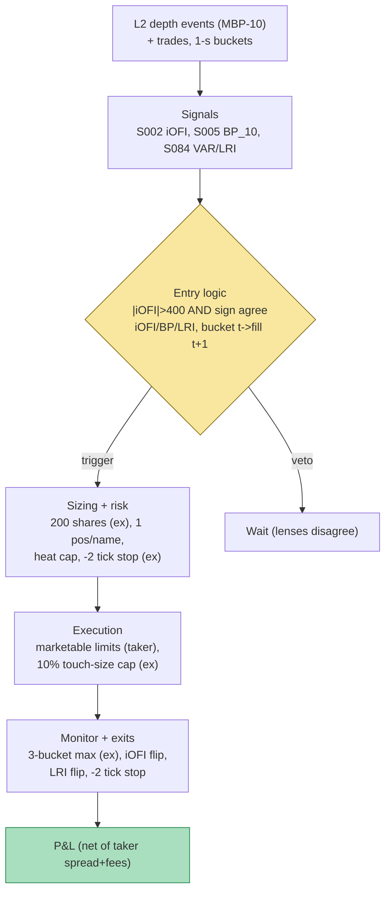

## Stage 130/200 — T030: Multi-Level OFI Weighted Predictor

*Batch TB3 · Strategy 30/100 · Signals S002, S005, S084*

### T1. One-line verdict

| | |
|---|---|
| **Style** | Intraday directional micro-scalper — takes liquidity in the direction of deep-book order-flow pressure, but only when three independent microstructure lenses agree |
| **Edge source** | Short-horizon price pressure from integrated 10-level order-flow imbalance (S002), confirmed by static book pressure (S005) and by the trade–quote VAR's permanent-impact read (S084) |
| **Typical holding period** | Seconds to ~3 one-second buckets (example) — the signal's documented life is the next one–two mid changes |
| **Capacity hint** | Tiny per trade (hundreds of shares); scales by breadth across names, not by size — size kills it via impact |
| **Build-or-buy in one line** | Build the estimator (Ridge/PCA on your own L2); buy the MBP-10 depth feed — the feed is the whole cost |

### T2. Full mechanics

**Jargon, defined once:** *OFI* (order-flow imbalance) counts net buying vs selling pressure from book events — limit-order additions, cancels, and trades — per price level. *Integrated OFI* (iOFI) collapses the 10 level-OFIs into one number via Ridge regression or the first principal component (the level vectors are highly correlated, so plain OLS coefficients slosh). *Book pressure* (S005) is the static snapshot: (bid depth − ask depth)/(bid depth + ask depth) across levels — a photograph where OFI is the movie. A *VAR* (vector autoregression) models trades and quote revisions jointly; its *impulse response* (IRF) answers "how much does the quote permanently move after one unexpected buy?" and the limit is the *long-run impact* (LRI) — the trade's permanent, information-bearing component. A *taker* scalp crosses the spread to enter; *large-tick* stocks are those whose spread is pinned at one tick (where deep-book flow carries most of the information).

**Universe & session.** 20–40 liquid large-tick names (*example* count) — large-tick because Gould–Bonart's evidence is strongest there and because deep levels carry the most incremental information when the touch can't move. RTH 10:00–15:30 ET; exclusions: halts, news-jump regimes (S084 VAR refit residuals spiking), and any bucket where the book is locked or crossed.

**Entry rule.** On each 1-second bucket close (*example* cadence), compute:

1. **S002 trigger:** integrated 10-level OFI $iOFI_B$ (Ridge-weighted, refit daily, *example*). Fire when $|iOFI_B| > 400$ shares (*example* threshold).
2. **S005 confirm:** static book pressure $BP_{10}$ must agree in sign with $iOFI_B$ and exceed 0.05 in magnitude (*example*) — flow leaning into a wall of opposing resting depth is vetoed.
3. **S084 confirm:** the trailing VAR's LRI sign must agree with the $iOFI_B$ direction — the VAR says unexpected trades in this direction are currently *information-bearing* (permanent impact), not plumbing.

All three must agree; entry is a marketable limit in the $iOFI$ direction.

**Causal timing:** bucket $t$ closes on events ≤ *t*; the earliest fill is in bucket $t+1$. The VAR is refit on rolling history only — its LRI at $t$ uses no future data.

**Exit rule.** First of: max hold 3 buckets (*example*); $iOFI$ flips sign through 0; stop-loss at −2 ticks against entry (*example*); or the S084 LRI sign flips (the information regime changed under the trade). No profit target — at a 1–3 bucket horizon the target *is* the next mid move.

**Position sizing.** Fixed 200 shares per trade (*example*); one open position per name; portfolio heat: max 10 concurrent micro-positions, each risking ≤ $50 (*example*) on the 2-tick stop.

**Risk limits.** Daily loss stop $300 (*example*); per-name consecutive-loss circuit breaker: 3 stopped trades in 10 minutes → stand down that name for 30 minutes (*example*); kill switch on VAR refit failure or book-feed staleness > 500 ms (*example*).

**Cost model.** Taker both ways: pay half the effective spread on entry and exit plus taker fee $0.0030/share (*example*); the worked example charges a flat 1.0¢/share round trip (*example*) and shows the fee leg separately in prose. No borrow assumption needed at seconds-long holds is still an assumption — shorts are intraday and locates are assumed; flagged in T4.

**Order/execution sketch.** Marketable limit orders priced 1 tick through the touch (take, don't chase); participation cap 10% of visible touch size (*example*). Queue-position honesty: as a taker the strategy has no queue — but its *exit* competes with every other taker, so the 1.0¢ round-trip charge is the honesty device. Label: `simulated only — requires MBO/ITCH` for any fill-timing claim finer than the 1-second bucket.

### T3. Signals it consumes

| Signal | Role | Weight / logic |
|---|---|---|
| S002 — multi-level / integrated OFI | Primary directional trigger | Enter only if $\|iOFI_B\| > 400$ shares (*example*), direction = sign($iOFI_B$) |
| S005 — multi-level book pressure | Confirmation / veto | Veto if sign($BP_{10}$) ≠ sign($iOFI_B$) — flow must not lean into an opposing wall |
| S084 — Hasbrouck trade–quote VAR | Confirmation (information filter) | Veto if LRI sign ≠ sign($iOFI_B$) — trade only flow the VAR deems information-bearing |

Combination logic (pseudocode, ≤25 lines):

```
# per name, each 1-s bucket t (closed; tradable at t+1):
ofi_vec = [OFI_k(t) for k in 1..10]      # S002 level contributions
iOFI    = ridge_weights . ofi_vec         # or PCA v1 projection (example)
bp      = S005_pressure(book[t], L=10)
lri_sgn = S084_LRI_sign(var_fit[t-300s : t])
fire = (abs(iOFI) > 400 and sign(bp) == sign(iOFI) == lri_sgn
        and abs(bp) > 0.05 and book_not_locked)
if fire and no_open_position:  take(sign(iOFI), 200 shares)   # marketable limit
# exits: hold<=3 buckets, iOFI sign flip, -2 tick stop, LRI sign flip
# causal: signals on events <= t; fills in bucket t+1 only
```

### T4. Worked example — numbers + P&L (SYNTHETIC)

**Synthetic** 10 one-second buckets, random seed **130** (`rng = np.random.default_rng(130)`). Threshold $|iOFI| > 400$ shares (*example*); 200 shares per trade; round-trip cost 1.0¢/share = $2.00 (*example*). The chart `images/T030_example.png` plots exactly these buckets and trades.

| Bucket | S002 $iOFI$ (sh) | S005 $BP_{10}$ | S084 LRI sign | Decision | Entry → Exit ($) | Gross | Cost | Net P&L |
|---|---|---|---|---|---|---|---|---|
| B1 | +120 | +0.05 | +1 | no (|iOFI| < 400) | — | — | — | $0.00 |
| B2 | +520 | +0.14 | +1 | **TRADE long** | 100.01 → 100.035 | +$5.00 | −$2.00 | **+$3.00** |
| B3 | −180 | −0.06 | −1 | no | — | — | — | $0.00 |
| B4 | −480 | −0.11 | −1 | **TRADE short** | 99.99 → 99.965 | +$5.00 | −$2.00 | **+$3.00** |
| B5 | +610 | −0.08 | +1 | **VETO** (BP contradicts iOFI — flow into a wall) | — | — | — | $0.00 |
| B6 | −550 | −0.12 | −1 | **TRADE short** | 100.02 → 100.045 | −$5.00 | −$2.00 | **−$7.00** |
| B7 | +90 | +0.03 | +1 | no | — | — | — | $0.00 |
| B8 | +430 | +0.09 | +1 | **TRADE long** | 99.97 → 99.995 | +$5.00 | −$2.00 | **+$3.00** |
| B9 | −220 | −0.05 | −1 | no | — | — | — | $0.00 |
| B10 | +260 | +0.04 | +1 | no | — | — | — | $0.00 |

Bucket B5 is the chapter's key row: the strongest raw signal (+610 shares) is vetoed because static pressure points the other way — exactly the S005-as-brake role the strategy is built around. Bucket B6 is the honest loss: all three lenses agreed and the trade still printed −2.5¢ (the signal predicts *direction*, not magnitude — and direction was right on B2/B4/B8, wrong here). Totals: gross +$10.00, costs −$8.00, **net session P&L = +$2.00** — costs ate 80% of gross, which is the entire economics of taker micro-scalping in one number.

**Where the example is optimistic.** Entries and exits fill exactly at the marked prices with zero slippage beyond the flat 1.0¢ charge (real taker fills in a 1-second bucket slip, and the fee leg is folded into the 1.0¢ rather than itemized); the VAR's LRI sign is assumed correct and stable within the session (real LRI estimates wobble and the VAR is misspecified under long-memory order flow); the BP veto is assumed to arrive synchronously with the flow read (real snapshots lag events); and there are no partial fills, no locked books, and no news-jump buckets in the toy tape. Nothing here is a backtest.

### T5. Data & infra — what must run

**Pipeline inventory.** Intraday: MBP-10 depth-event ingest (genuine L2 — the SIP has no depth, so SIP-derived "levels" would be simulated-only), per-level OFI accumulation per 1-second bucket, Ridge weight application, S005 snapshot pressure, rolling VAR(5) refit every 60 s on 1-s (Δm, q) bars (*example* lags), gate evaluation, order routing to the paper broker. Pre-open: Ridge refit on trailing 5 days (*example*), VAR lag selection, large-tick universe screen. Post-close: per-bucket decision log (fired/vetoed with reasons — the veto log is the strategy's diary), markout analysis per trade.

**M5 Max feasibility: feasible (Tier H for the L2 leg, Tier M for the VAR; ~60–120 h blended per cost-model §5 → $9,000–18,000 loaded-cost estimate).** Per cost-model §2: L2 MBP-10 runs ~10–50k events/sec busy per top name; 20–40 names is a Rust-or-careful-Python ingest job (Python pure loop ~100–500k events/sec handles it if the book state stays in numpy/polars structures; per-tick Python objects do not). The Ridge/PCA and VAR OLS refits are milliseconds in numpy. RAM: L2 MBP-10 is ~8–40 GB per symbol-day in RAM (cost-model §3) — keep only rolling windows resident; 40 names × 60 days does **not** fit the 77 GB budget, so use per-symbol daily parquet files + streaming (cost-model §4: ~10–40 GB/symbol-day on disk — research-only retention). Bottleneck: depth-event ingest and book reconstruction, not the math.

**Feed-outage safe-mode plan.** If the depth feed stalls > 500 ms (*example*): cancel everything, flatten at market, halt — a 1-second-horizon strategy cannot trade on a stale book for even one bucket. If the VAR refit fails (singular matrix, gappy tape): fall back to S002+S005 two-lens mode with halved size (*example*), and log the degradation. Never trade the iOFI trigger on SIP-constructed pseudo-depth.

### T6. Buy vs build

| Option | What you get | Indicative price | Buying gains | Buying loses |
|---|---|---|---|---|
| Tier 0: Alpaca IEX / Stooq | L1/trade bars | ~$0 | free S084-on-bars prototype | no depth — S002/S005 impossible |
| Tier 1: Polygon SIP | real-time L1 + trades | ~$30–200/mo *indicative — verify before budgeting* | cheap VAR leg | SIP ≠ depth; pseudo-levels are simulated-only |
| Tier 2: Databento MBP-10 | honest 10-level depth events | ~$200/mo + usage *indicative — verify before budgeting* | the true input for S002/S005 | usage scales with 40 names |
| Tier 3: LOBSTER (academic) | ITCH order-book replay | ~hundreds/yr academic *indicative — verify before budgeting* | MBO-grade research truth | academic license; not production |

**Verdict: build the estimator, buy the MBP-10 feed.** The Ridge/PCA integration and the VAR are ~200 lines that need your own lags, horizons, and size transforms — nobody sells your calibration. The feed is non-negotiable: without genuine L2, S002 and S005 are fiction. Crossover: prototype the S084 confirmation leg on Tier 1 bars (VAR on 1-s bars works), add Tier 2 only when the iOFI trigger goes live.

### T7. Success-ratio evidence

No published paper backtests this exact three-lens stack after costs. Component evidence, honestly labeled:

| Study / source | Market & period | Metric | Before/after cost | Caveat |
|---|---|---|---|---|
| Cont–Kukanov–Stoikov (2014) | US equities, LOB | OFI → contemporaneous mid-change: strong linear fit | before-cost (regression, not P&L) | contemporaneous ≠ predictable |
| Xu–Gould–Howison (lead) | multi-level OFI | Ridge on level OFIs beats touch-only out-of-sample | before-cost | chatbot lead — not re-verified; magnitude unconfirmed |
| Cont–Cucuringu–Zhang (2023, lead) | integrated OFI | first-PC integration cleans the multicollinearity | before-cost | chatbot lead — not re-verified |
| Gould & Bonart (2016), arXiv:1512.03492 | 10 Nasdaq names | imbalance → next-mid-move: considerable improvement over null (large-tick), moderate (small-tick) | before-cost (classification) | direction only; signal life ~1–2 mid changes |
| Hasbrouck (1991) | NYSE | VAR: trade innovations carry permanent price impact; information vs plumbing separated | before-cost (measurement) | measurement, not a trading rule |
| Imbalance-maker P&L study (2025, chatbot lead) | maker/taker on imbalance strategies | imbalance strategies most active and worst after costs (−0.49 units) | after fees | unverified lead; taker-side cautionary tale |

**Decay/crowding.** Touch-OFI is the most crowded microstructure signal in existence; the multi-level and VAR-confirmation legs are this strategy's answer to crowding, and they decay too as L2 data commoditizes. The documented half-life of the raw signal is minutes-to-seconds — this is a race the strategy runs by being *selective* (three vetoes), not by being fast.

**Honest bottom line.** For a ≤$1M paper operation, T030 is a superb *research* strategy and a poor *live* one from a non-colocated setup: the example's own arithmetic (+$10 gross, −$8 costs = +$2 net) shows how little room the taker cost structure leaves, and real slippage widens the cost leg. Its paper value is the veto log — learning which confirmations actually delete losers out-of-sample. For an institutional desk with colocation and queue priority, the same three lenses are a reasonable micro-alpha stack inside a larger market-making or execution system; as a standalone taker strategy it needs the cost leg under ~0.5¢/share to breathe, which means rebates, internalization, or a slower (cheaper) variant.

### T8. Failure modes

1. **SIP pseudo-depth** — building "levels" from the consolidated tape fabricates S002/S005; the strategy then trades its own interpolation. *Mitigation:* genuine MBP-10 or nothing; label anything else simulated-only.
2. **VAR misspecification** — real order flow has long memory; a 5-lag VAR misattributes persistent flow to information, and the LRI sign wobbles. *Mitigation:* monitor LRI stability; fall back to two-lens mode when refits disagree.
3. **Spoofing/layering** — fake depth inflates both iOFI and BP in the same direction; all three lenses can agree on a lie. *Mitigation:* cancel-rate features per level (spoofed levels churn); veto buckets with abnormal cancel-to-trade ratios (*example* guard).
4. **News-jump buckets** — jumps move the mid through all 10 levels; the flow read is real and the direction is unknowable. *Mitigation:* realized-vol circuit breaker — stand down when 1-min realized vol exceeds 3× its median (*example*).
5. **Crowded touch, exhausted edge** — every HFT desk runs some OFI variant; the 1–2-mid-change life shortens as competition rises. *Mitigation:* the strategy's selectivity *is* the defense; track fill quality (markouts) monthly and retire the trigger if it goes red.
6. **Cost-model optimism** — the flat 1.0¢/share charge understates fast-market slippage; taker fees are itemized nowhere in the example's arithmetic. *Mitigation:* itemize fees in the live sim; stress-test at 2× cost.
7. **Overfit Ridge weights** — daily-refit Ridge on 5 days of buckets overfits the recent regime; weights flip and the trigger whipsaws. *Mitigation:* validate weights out-of-sample with purged splits (S088); shrink toward equal weights.
8. **Operational: stale-book trading** — a 500 ms feed stall is an eternity at this horizon; the strategy trades a ghost book. *Mitigation:* the 500 ms kill switch in T5; heartbeat-monitored, auto-rearming only on clean refit.

### T9. Visuals




### T10. Sources

1. Cont, R., Kukanov, A. & Stoikov, S. (2014). "The Price Impact of Order Flow Imbalance: Tests of Additive and Linear Models." (the OFI foundation — S002's home)
2. Gould, M. D. & Bonart, J. (2016). "Queue Imbalance as a One-Tick-Ahead Price Predictor in a Limit Order Book." arXiv:1512.03492 — https://arxiv.org/abs/1512.03492 (predictive evidence + the large-tick/small-tick split)
3. Hasbrouck, J. (1991). "Measuring the Information Content of Stock Trades." *Journal of Finance* 46(1): 179–207. (trade–quote VAR, IRF/LRI — the S084 home)
4. Cont, R., Cucuringu, M. & Zhang, C. (2023). "Cross-Impact of Order Flow Imbalance in Equity Markets." (integrated-OFI via principal components — cited as lead; verify before building on it)

**Unverified leads** (chatbot claims without a checkable source in hand — quarantined, not cited as fact):
- Xu–Gould–Howison: Ridge on multi-level OFI beats touch-only OFI out-of-sample — Grok Q-SB4-1/Q-TB3 lineage lead; magnitude unconfirmed.
- Cont–Cucuringu–Zhang (2023) integrated-OFI results — citation label only, not re-verified.
- Imbalance-maker P&L study (2025): −0.49 units after fees — Grok Q-TB3-3 lead.
- All thresholds (|iOFI| > 400, BP 0.05, 3-bucket hold, 200 shares, 1.0¢ cost) are illustrative *examples*, not fitted or recommended values.

*Source log: Grok answered Q-TB3-1..3 (2026-09-10); all claims independently verified or labeled unverified.*

---
