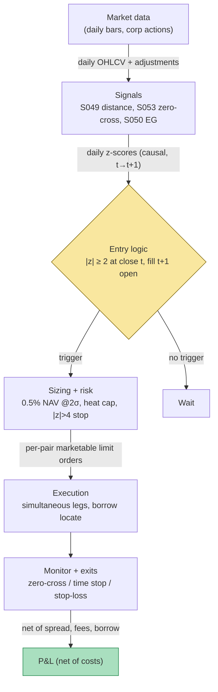

## Stage 131/200 — T031: Distance Pairs + Quality Filter

*Batch TB4 · Strategy 31/100 · Signals S049, S053, S050*

### T1. One-line verdict

| | |
|---|---|
| **Style** | Daily-bar statistical arbitrage (stat-arb): market-neutral pairs trading |
| **Edge source** | Temporary divergences between close economic substitutes, filtered so only pairs with a demonstrated habit of reconverging are traded |
| **Typical holding period** | 2–20 trading days per round trip; pairs re-formed every 6 months (`example`) |
| **Capacity hint** | Liquid mid-cap, same-industry book; low tens of millions USD before borrow and impact bind |
| **Build-or-buy in one line** | Build the screen yourself (it is a vectorized afternoon's work); buy survivorship-clean, corporate-action-adjusted data — that is the real cost |

### T2. Full mechanics

**What the strategy is.** *Pairs trading* means simultaneously buying one stock and shorting a related one, betting that the *relative* price gap between them closes rather than betting on the market's direction. T031 is the classic Gatev–Goetzmann–Rouwenhorst (GGR) distance-pairs recipe with two upgrades: (1) a **zero-crossing quality gate** (S053) that only admits pairs whose formation-period spread crossed its mean often enough to prove it reconverges, and (2) an **Engle–Granger confirmation** (S050) so the traded spread is the cointegrating one, not the naive 1:1 price difference. The portfolio is *dollar-neutral* (equal dollars long and short), so broad market moves roughly cancel.

**Universe & session.** US common stocks, price ≥ $5 (`example`), average daily dollar volume ≥ $5mm (`example`), shortable (locate available). Same-GICS-industry pairing is preferred. Session: daily bars, RTH (regular trading hours) closes only. Exclusions: both legs must have no scheduled earnings or corporate-action events within ±2 days (`example`); halted names are dropped; names involved in announced mergers/spinoffs are force-exited.

**Formation (nightly/quarterly, `example` cadence).** Once per 6-month trading window (`example`), on a 252-day formation window (`example`) before trading begins:
1. Build normalized total-return prices $\tilde{P}_{i,t}$ starting at 1.0 (dividends reinvested).
2. Compute the distance $D_{ij} = \sum_{t}(\tilde{P}_{i,t}-\tilde{P}_{j,t})^2$ for same-industry candidates (S049).
3. Count formation zero crossings $ZC$ of each candidate spread (S053); keep pairs with $ZC \ge 20$ on 250 bars or the top quartile (`example`).
4. Run the Engle–Granger two-step on survivors: OLS (ordinary least squares) $\log P^A_t = \alpha + \beta \log P^B_t + \varepsilon_t$, ADF (Augmented Dickey–Fuller) test on residuals at 5% (`example`); keep pairs that pass. The **hedge ratio** $\hat{\beta}$ is the number of B-shares held per A-share.
5. Select the top 20 pairs (`example`) by zero-crossing rank (SSD as tie-break).

**Entry rule.** Each day after the close, compute the z-score $z_t = (S_t - \mu_{\text{form}})/\sigma_{\text{form}}$ where $S_t = P^A_t - \hat{\alpha} - \hat{\beta}P^B_t$ and $\mu_{\text{form}}, \sigma_{\text{form}}$ are frozen formation estimates. If flat and $z_t \ge +2.0$: short A / long B in $\hat{\beta}$-neutral, dollar-neutral size (`example` threshold). If flat and $z_t \le -2.0$: long A / short B (`example`). **Causal timing:** the signal uses only data $\le t$ (close of day $t$); the earliest fill is the $t+1$ open — the strategy never trades on the same print that generated the signal.

**Exit rule.** Close at the next zero crossing of $S_t$ (the GGR exit); or a stop at $|z_t| > 4.0$ (`example`); or a time stop at 30 days (`example`) or the end of the 6-month trading window, whichever comes first. One position at a time per pair.

**Position sizing.** Per-pair risk budget 0.25–1.0% of NAV at $2\sigma$ of the spread (`example`); Portfolio heat: sum over open pairs of $|z|\times$dollar-risk $\le$ 4–8% of NAV (`example`); hard cap 20 simultaneous pairs (`example`); gross book 200–400% of NAV (`example`).

**Risk limits.** Daily loss stop −2% NAV (`example`); max gross 400% NAV; kill switch: halt all new entries and flatten over 3 days if the book loses 6% in a month (`example`) or if the borrow file is stale >1 day for any open short.

**Cost model.** Round trip per pair: 2 legs × 2 turns × 5 bp one-way = 20 bp of per-leg notional (`example`; 5 bp covers half-spread + commission + slippage on liquid large-caps and is optimistic for mid-caps). Stock-loan on the short leg: 50 bp annualized GC (`example`; specials to 10%+ are modeled as a veto, not a cost). The worked example charges these explicitly.

**Order/execution sketch.** At the $t+1$ open, send simultaneous marketable limit orders on both legs (cancel the second leg if the first fails). Participation ≤10% of visible depth per leg (`example`). Shorts require a confirmed locate first.

### T3. Signals it consumes

| Signal | Role | Weight / logic |
|---|---|---|
| S049 — Distance pairs (GGR) | Primary trigger: selects pairs, times entries | Enter only if pair in top-20 distance/quality list AND $\|z_t\| \ge 2.0$ (`example`) |
| S053 — Zero-crossing quality filter | Gate (veto): admits only pairs with demonstrated reconvergence rhythm | $ZC \ge 20$ on 250 bars or top quartile (`example`); rejects the rest |
| S050 — Engle–Granger z-score | Confirmatory filter: supplies the hedge ratio and the cointegrating spread | ADF p < 0.05 (`example`); trade $S_t = P^A_t - \hat{\alpha} - \hat{\beta}P^B_t$, not the naive 1:1 spread |

Combination logic (pseudocode, ≤25 lines):

```
# ---- formation (data <= t only; runs before each trading window) ----
pairs = distance_screen(universe, T_F=252)          # S049: SSD on normalized total returns
pairs = pairs[zero_crossings(pairs) >= 20]          # S053 gate (example)
pairs = eg_confirm(pairs, adf_p=0.05)               # S050: ADF + hedge ratio beta-hat
book  = top_k(pairs, k=20, by="ZC_then_SSD")       # example breadth
# ---- daily trading ----
for p in book:
    z = (spread_t(p) - p.mu_form) / p.sigma_form    # causal: close t, trade t+1
    if flat(p) and z >= 2.0:                        # example
        enter(short A, long beta*B, dollar_neutral)  # locate short first
    elif flat(p) and z <= -2.0:                     # example
        enter(long A, short beta*B, dollar_neutral)
    elif open(p) and crossed_zero(spread_t(p)): close(p)        # GGR exit
    elif open(p) and (abs(z) > 4.0 or days_open > 30): close(p)  # stop / time stop
```

### T4. Worked example — numbers + P&L (SYNTHETIC)

All numbers are **synthetic**: two fictional same-industry names, Alpha (A) and Beta (B). Formation (not shown): 252 days, 9 zero crossings (passes the ≥6 `example` gate), $\sigma_{\text{form}} = 0.020$ → pair accepted. Trading window: 20 days from `rng = np.random.default_rng(131)` — a hand-shaped two-episode divergence path plus seeded noise, printed exactly as the script computed it and plotted in `images/T031_example.png`. Notional $100,000/leg; costs 5 bp one-way/leg; borrow 50 bp annualized on the short leg (all `example`).

| Day | $S_t$ | $z_t$ | Action | Position |
|---|---|---|---|---|
| 1 | −0.0001 | −0.01 | — | flat |
| 2 | +0.0200 | +1.00 | — | flat |
| 3 | +0.0400 | +2.00 | **OPEN short-spread** (short A / long B) | short-spread |
| 4 | +0.0473 | +2.37 | hold | short-spread |
| 5 | +0.0362 | +1.81 | hold | short-spread |
| 6 | +0.0135 | +0.68 | hold | short-spread |
| 7 | −0.0045 | −0.22 | **CLOSE** (zero-cross) | flat |
| 8–10 | ≈0 | — | — | flat |
| 11 | −0.0374 | −1.87 | wait (not yet −2) | flat |
| 12 | −0.0461 | −2.30 | **OPEN long-spread** (long A / short B) | long-spread |
| 13 | −0.0302 | −1.51 | hold | long-spread |
| 14 | −0.0101 | −0.50 | hold | long-spread |
| 15 | +0.0072 | +0.36 | **CLOSE** (zero-cross) | flat |
| 16–20 | ≈0 | — | — | flat |

**Line-by-line P&L.**

*Trade 1 — short-spread (short $100k A, long $100k B), held 4 days.* Spread runs $+0.0400 \to -0.0045$. Gross $= 100{,}000 \times (0.0400 - (-0.0045)) = \mathbf{+\$4{,}451}$. Costs: 2 legs × 2 turns × 5 bp × $100{,}000 = $200.00. Borrow: $100{,}000 \times 0.50\% \times 4/365 = \$5.48$. Total costs $\$205.48$. **Net $= +\$4{,}245$.**

*Trade 2 — long-spread (long $100k A, short $100k B), held 3 days.* Spread runs $-0.0461 \to +0.0072$. Gross $= 100{,}000 \times (0.0072 - (-0.0461)) = \mathbf{+\$5{,}327}$. Costs: $200.00. Borrow: $100{,}000 \times 0.50\% \times 3/365 = \$4.11$. Total costs $\$204.11$. **Net $= +\$5{,}123$.**

**Window total: gross +$9,778 − costs $400 − borrow $9.59 = net +$9,368** on $200,000 of gross exposure (the two trades are sequential; maximum committed capital $200k).


**Where the example is optimistic.** Fills are assumed at the printed spread — no partial fills, no legging risk, no latency between the close signal and the $t+1$ open fill. The 5 bp one-way cost is a liquid-large-cap assumption; mid-caps and stressed days cost multiples of it. Borrow is charged at a placid 50 bp GC rate — a hard-to-borrow special at 10%+ would erase both trades' edge. Dividends, splits, and corporate actions are absent. The path is hand-shaped to contain two clean convergences and zero losers; Do & Faff document non-convergent pairs rising to ~42% of the book in 2003–08, so a real 20-day window usually contains a dead or losing pair. Nothing here is a backtest.

### T5. Data & infra — what must run

| Job | Cadence | What it does |
|---|---|---|
| Universe + corporate-action adjust | Nightly after 18:00 ET | Split/dividend/spin maps, point-in-time IDs, total-return series |
| Pair screen (distance + ZC + EG) | Nightly; full re-formation each 6-month window | SSD/ZC/ADF over ~2,000 names in industry chunks |
| Borrow / HTB / locate file | Daily 16:30–18:30 ET | Fee, utilization, availability → veto or resize shorts |
| Dividend/ex-date calendar | Daily | Ex-date cash-flow booking on both legs |
| Risk / heat monitor | Continuous, cheap | Open $z$, gross, per-pair days-held, borrow $ |

**M5 Max feasibility: feasible (Tier M).** Per `notes/cost-model.md` §2, numpy vectorized math runs ~50–200M elements/sec and polars simple ops ~10–50M rows/sec. The 2,000-name daily panel is tens of MB; the 2,000² float32 distance matrix is ~16 MB by byte arithmetic — computed in industry-chunked blocks. The EG/ADF step runs only on the few-thousand-pair shortlist (seconds to minutes); rolling z-scores on the live 20-pair book are trivial. RAM sits far below the 77 GB working budget (§3). A chatbot research lead (Grok, Q-TB4-2 — unverified) puts the full nightly batch at ~20–60 minutes wall clock, inside the close→open window. Engineering: screen Tier M 20–60 h plus strategy harness M+ 40–100 h → **~100–160 h ≈ $15,000–$24,000** `loaded-cost estimate` at $150/hr (§5).

**Storage growth:** daily bars for 3,000 stocks ≈ 5 MB/day (§4) → ~1.3 GB/year; pair metadata is megabytes.

**Feed-outage safe mode.** This is a daily-bar strategy, so an outage degrades gracefully: (1) if the nightly bar feed is late, freeze all new entries and new formations — manage only existing positions; (2) trade open pairs on the last-known $z$ with the stop tightened to $|z|>3$ (`example`); (3) if the borrow file is stale >1 trading day, veto any new short and shrink existing HTB shorts; (4) if the outage exceeds 3 trading days, flatten the book.

### T6. Buy vs build

| Option | What you get | Indicative price | Verdict |
|---|---|---|---|
| Tier-0: Stooq / Alpaca IEX daily | Free daily bars for prototyping | ~$0 | Fine for learning; weak corporate actions, no survivorship control |
| Tier-1: Polygon Stocks Advanced | Clean SIP daily bars + corporate actions | ~$30–200/mo `indicative — verify before budgeting` | The sane production feed for a daily pairs book |
| Tier-2: Databento Standard | Exchange-direct L1/L2, futures | ~$200/mo + usage `indicative — verify before budgeting` | Overkill for daily pairs; buy only if you add intraday legs |
| Borrow data: IBKR SL availability | One broker's indicative fee | $0 (veto flag only) | Free sanity check, not a cost model |
| Borrow data: Markit / S&P Securities Finance, FIS Astec, DataLend | Indicative + average fee, utilization, history | $30k–$150k+/yr (Grok Q-TB4-2 lead — unverified chatbot claim) `indicative — verify before budgeting` | Only if you need a historically honest HTB backtest |
| Retail pair scanners / QuantConnect | Pre-ranked pairs, backtest plumbing | $0–$20k (Grok lead — unverified) | Sanity checks only: no point-in-time borrow, weak corp actions |
| Prime-broker pair algos | Basket locate, pair-legging, TCA | Bundled in PB ticket | **Buy execution and locates**; do not buy the screen — PB tools optimize their flow, not your formation rules |

**Verdict: build the screen and the cost/heat engine on Tier-1 data; rent borrow, locates, and execution from the prime broker.** The algorithm is ~100 lines of numpy; no vendor sells your thresholds. The crossover: before trusting any backtest that shorts beyond easy-to-borrow large-caps, price institutional borrow history — that single feed can exceed every other line combined.

### T7. Success-ratio evidence

| Study / source | Market & period | Metric | Before/after cost | Caveat |
|---|---|---|---|---|
| Gatev, Goetzmann & Rouwenhorst (2006) | US equities, 1962–2002, top-20 pairs | ~11% annualized excess return, self-financing, 1-day delayed execution | After the authors' conservative cost estimates | Pre-crowding sample |
| Do & Faff (2010) | US equities, 1962–2009, top-20 pairs | 0.86%/mo (1962–88) → 0.37%/mo (1989–2002) → 0.24%/mo (2003–09) | Before explicit costs | The decay finding |
| Rad, Low & Faff (2016) | US equities, 1962–2014, distance method | 91 bp/mo gross, 38 bp/mo net | Both (1–7 bp cost model) | 62.5% of trades converged |
| Do & Faff (2012) | US equities, 1963–2009 | Baseline rule "largely unprofitable after 2002" once commissions + impact + short fees are charged | After costs | Grok-reported lead — unverified |

**Capacity.** The tradable book is the liquid mid-cap same-industry set — not mega-cap (spreads too tight) and not micro-cap (borrow + impact). A chatbot lead (Grok, Q-TB4-3 — unverified) sizes it at roughly $10–50mm for a GC-only book. **Decay** is documented and steep: roughly a 70% fall in monthly excess from the first era to the last, driven more by worse convergence (non-convergent pairs 26% → 42%) than by simple crowding. Independent replications through 2020 show the post-2009 curve mostly flat even before costs.

**Honest bottom line.** For a ≤$1M paper operation, plain distance pairs is a research vehicle, not an income stream: after honest spread, borrow, and impact, the expected net is approximately zero with wide error bars. The quality gate (S053) plus the EG confirmation (S050) is the documented direction of improvement — industry-matched, high-zero-crossing pairs retain a few tens of bp/month in long-sample studies — but "documented direction" is not a live Sharpe. An institutional desk version survives only as a low-turnover, industry-filtered sleeve inside a larger stat-arb book with real stock-loan access.

### T8. Failure modes

1. **Non-convergence / fundamental break** — the divergence is real information (fraud, distress, M&A). *Mitigation:* industry restriction, earnings/M&A blackout, $|z|>4$ stop, 30-day time stop.
2. **Crowding / alpha decay** — the documented post-2002 decay. *Mitigation:* trade less-crowded universes with realistic costs, react faster, or use distance only as a filter.
3. **Borrow specials and recalls** — a 10%+ special vaporizes the edge; a recall forces a cover at the worst print. *Mitigation:* pre-screen borrow fees, model stock-loan explicitly, hard veto on HTB names.
4. **Corporate-action artifacts** — mis-adjusted splits/dividends fabricate "divergences". *Mitigation:* raw + factor data, cross-validate adjustments against a second source.
5. **Lookahead leakage** — formation statistics bleeding into the trading window. *Mitigation:* hard formation/trading split with an embargo gap; automated leakage tests.
6. **Over-tight quality gating** — $ZC_{\min}$ set so high the book holds 3 pairs and concentration risk dominates. *Mitigation:* top-quartile slice rather than an absolute threshold; monitor portfolio breadth.
7. **Cost blowup on illiquid legs** — a high-$ZC$ pair can still be untradeable after spread. *Mitigation:* apply the cost/borrow gate *after* the quality gate, on net expected profit per trade.
8. **Quant-unwind / correlation breaks** — August-2007-style: every residual-reversion book dumps the same longs. *Mitigation:* heat caps, gross limits, a drawdown kill switch, no leverage on the pair book.

### T9. Visuals




### T10. Sources

1. Gatev, E., Goetzmann, W. N. & Rouwenhorst, K. G. (2006). "Pairs Trading: Performance of a Relative-Value Arbitrage Rule." *Review of Financial Studies*, 19(3), 797–827. https://www.econbiz.de/Record/pairs-trading-performance-of-a-relative-value-arbitrage-rule-gatev-evan/10005564224
2. Do, B. & Faff, R. (2010). "Does Simple Pairs Trading Still Work?" *Financial Analysts Journal*, 66(4), 83–95. https://ideas.repec.org/a/taf/ufajxx/v66y2010i4p83-95.html
3. Rad, H., Low, R. K. Y. & Faff, R. (2016). "The profitability of pairs trading strategies: distance, cointegration and copula methods." *Quantitative Finance*, 16(10), 1541–1558. https://doi.org/10.1080/14697688.2016.1164337
4. Krauss, C. (2017). "Statistical Arbitrage Pairs Trading Strategies: Review and Outlook." *Journal of Economic Surveys*, 31(2), 513–545. https://doi.org/10.1111/joes.12153
5. Do, B. & Faff, R. (2012). "On the Performance of Varying Measures of Pairs Trading Strategy." *Journal of Financial Research*. (Paper is real; the after-cost claims in T7 are Grok-reported and labeled accordingly.)

Source log: Grok answered Q-TB4-1..3 (2026-09-10); all claims independently verified or labeled unverified. Claims adopted into the evidence sections are cited to checkable papers above; every other Grok claim is quarantined below as an unverified lead.

**Unverified leads** (chatbot-provided, not independently checkable — do not cite as evidence):
- Grok (2026-09-10), Q-TB4-3: industry + zero-crossing filters leave "about 30 bp/month risk-adjusted on the best-matched industry pairs" (attributed to Do & Faff 2012 — the paper is real but this specific number was not independently re-verified).
- Grok (2026-09-10), Q-TB4-2: nightly pairs batch ~20–60 min wall clock on the M5 Max; year-1 build 420–830 engineering hours; borrow-history vendors $30k–$150k+/yr; capacity $10–50mm for a GC-only book; retail pair scanners $0–$20k.
- Grok (2026-09-10), Q-TB4-3, citing "Baskaran (SSRN 2026)": Kalman walk-forward results — **excluded from evidence**: the 2026 date is implausible relative to this chapter's date and the citation could not be verified; do not use.
