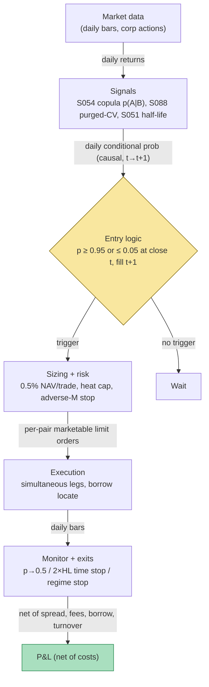

## Stage 132/200 — T032: Copula Tail-Dependence Pairs

*Batch TB4 · Strategy 32/100 · Signals S054, S088, S051 · Provenance [D/SR]*

### T1. One-line verdict

| | |
|---|---|
| **Style** | Daily-bar statistical arbitrage: market-neutral pairs traded on tail-dependence mispricing |
| **Edge source** | Extreme *conditional-quantile* divergences — joint outcomes the pair's own dependence model calls nearly impossible — rather than plain linear spread deviations |
| **Typical holding period** | 1–5 trading days per round trip; bounded by the spread's OU half-life |
| **Capacity hint** | Same liquid large/mid-cap pair universe as T031, but thinner: higher turnover eats the smaller per-trade edge |
| **Build-or-buy in one line** | Build the estimator and the purged validation harness yourself — the edge is in family choice and validation, which no vendor sells; buy the raw return data |

### T2. Full mechanics

**What the strategy is.** A *copula* is a function that describes how two assets' returns depend on each other — including how they co-move in extremes — after stripping out each leg's own return distribution. Where T031 trades a linear z-score of a price spread, T032 asks a sharper question each day: *given* leg B's return today, what is the probability of seeing leg A's return? That *conditional probability* $p_{A|B,t}$ is the signal. When the fitted dependence model says "there was only a 1% chance of seeing A's return given B's," the pair is mispriced in the tails, and the strategy buys the abnormally weak leg and shorts the abnormally strong one. *Tail dependence* (the tendency of assets to co-move extremely in the tails, where ordinary correlations are blind) is the point of the whole exercise.

**Universe & session.** Same as T031: liquid US common stocks, price ≥ $5, dollar volume ≥ $5mm, shortable, same-industry preference (`example`). Daily bars, RTH (regular trading hours) closes. Exclusions: earnings/corporate-action windows ±2 days, halts, announced M&A — plus a dependence screen: drop pairs with $|\hat{\rho}| < 0.5$ (`example`), where the conditional trigger is noise.

**Formation (rolling, `example` cadence).** On a 500-day formation window (`example`) strictly before trading:
1. Fit each leg's marginal return distribution (empirical CDF — **c**umulative **d**istribution **f**unction) and convert returns to *PIT uniforms* $u_t, v_t$ (PIT = **p**robability **i**ntegral **t**ransform: "where does today's return rank in this leg's own history," mapped to [0,1]), clipped at $\varepsilon = 10^{-3}$ (`example`).
2. Fit a candidate set of copula families — Gaussian, Student-t, Clayton, Gumbel, Frank (plus rotations) — by maximum likelihood on $(u_t, v_t)$.
3. Select the family by **rolling out-of-sample log-likelihood**, not in-sample AIC (Akaike information criterion) — the honest choice per S054.
4. Validate the *trading rule* (family + thresholds) with purged/embargoed cross-validation (S088): 5 folds (`example`), purging overlapping label intervals, embargo ≥ max hold. A family/threshold set trades live only if purged-CV mean net Sharpe clears 0.5 (`example`).
5. Estimate the traded spread's OU (**O**rnstein–**U**hlenbeck: the continuous-time mean-reversion model) half-life (S051); require $HL \le 30$ days (`example`) and set the max hold at $2 \times HL$.

An illustrative validation report (format example — **not** a backtest result):

| Copula family | Purged-CV mean net Sharpe (5 folds) | Selected? |
|---|---|---|
| Student-t (df=6) | 0.62 | yes |
| Gaussian | 0.31 | no |
| Clayton | 0.28 | no |
| Gumbel | 0.19 | no |
| Frank | 0.24 | no |

**Entry rule.** Daily at the close: compute $p_{A|B,t} = \partial C(u_t, v_t)/\partial v$ (for the Gaussian case, the closed form $\Phi((x_1 - \rho x_2)/\sqrt{1-\rho^2})$ with $x_i = \Phi^{-1}(\cdot)$ — see S054). If flat and $p_{A|B,t} \ge 0.95$: short A / long B (`example`). If flat and $p_{A|B,t} \le 0.05$: long A / short B (`example`). Dollar-neutral, $100k/leg (`example`). **Causal timing:** the signal uses only data $\le t$; earliest fill is the $t+1$ open.

**Exit rule.** Close when $p_{A|B}$ crosses back through 0.5 ("normal" again); the time stop at $2 \times HL$ (`example`); or a stop if the *mispricing index* $M_t = p_{A|B,t} - p_{B|A,t}$ stays adversely beyond ±0.99 for 3 days (`example`) — the regime is breaking, not the spread.

**Position sizing.** Per-trade risk 0.25–0.75% of NAV (net asset value) (`example`; smaller than T031 — thinner edge, higher turnover). Portfolio heat: open $|M_t|$-weighted dollar risk ≤ 4% NAV (`example`); hard cap 15 pairs (`example`).

**Risk limits.** Daily loss stop −1.5% NAV (`example`); max gross 300% NAV; kill switch: if the purged-CV-selected family underperforms its validation Sharpe by >1.0 for a quarter, freeze new entries and re-run selection.

**Cost model.** Same 5 bp (basis points) one-way per leg round-trip assumption (`example`) plus borrow on the short leg — but the binding constraint is *turnover*: the trigger fires more often than ±2σ z-scores, so each trade must clear ~20–40 bp round trip (`example` hurdle) to survive. Costs are charged explicitly in the example.

**Order/execution sketch.** Identical pairs-algo discipline to T031: simultaneous marketable limits at the $t+1$ open, ≤10% of visible depth per leg (`example`), confirmed locate before any short, dividends booked as cash flow on ex-date.

### T3. Signals it consumes

| Signal | Role | Weight / logic |
|---|---|---|
| S054 — Copula pairs | Primary trigger (direction): the conditional probability $p_{A|B,t}$ | Enter only if $p_{A|B} \ge 0.95$ or $\le 0.05$ (`example`); exit at 0.5 |
| S088 — Purged/embargoed CV | Validation gate: selects the copula family and thresholds | 5 folds, embargo ≥ max hold; trade only if purged-CV net Sharpe > 0.5 (`example`) |
| S051 — OU half-life | Sizing/exit clock: bounds the hold so trades are not held past the spread's natural convergence | Max hold $= 2 \times \hat{t}_{1/2}$; skip pairs with $HL > 30$ days (`example`) |

Combination logic (pseudocode, ≤25 lines):

```
# ---- formation (data <= t only) ----
u, v = pit_marginals(returns_A, returns_B, n=500)          # S054: empirical CDF -> uniforms
fam  = select_family({gauss, t, clayton, gumbel, frank},
                     rolling_OOS_loglik)                   # S054: OOS, never in-sample AIC
ok   = purged_cv_validate(fam, thresholds, K=5,
                           embargo >= max_hold)            # S088 gate
HL   = ou_half_life(spread)                                # S051
if not ok or HL > 30: skip pair                            # example gates
# ---- daily trading ----
p = cond_prob(u_t, v_t, fam)                               # S054: P(A|B), causal at close t
if flat and p >= 0.95: enter(short A, long B)              # example
elif flat and p <= 0.05: enter(long A, short B)            # example
elif open and p crosses 0.5: close()                       # back to "normal"
elif open and days_open >= 2*HL: close()                   # S051 time stop
```

### T4. Worked example — numbers + P&L (SYNTHETIC)

All numbers are **synthetic**: two fictional same-industry names, Alpha (A) and Beta (B). Formation (not shown): 500 days, empirical-CDF marginals, Student-t copula selected by rolling OOS likelihood, $\hat{\rho} = 0.8$, purged-CV gate passed, spread OU half-life 2.5 days (max hold 5 days, `example`). Trading window: 12 days from `rng = np.random.default_rng(132)` — a hand-shaped conditional-quantile path plus seeded noise, printed exactly as the script computed it and plotted in `images/T032_example.png`. The demo uses the S054 Gaussian closed form with the conditioning leg neutral ($z_2 = 0$), so $p_{A|B} = \Phi(z_1/0.6)$. Notional $100,000/leg; spread $\sigma$ = $400 = 40$ bp of leg notional; costs 5 bp one-way/leg; borrow 50 bp annualized (all `example`).

| Day | $p_{A|B}$ | $z_1$ | Action | Position |
|---|---|---|---|---|
| 1 | 0.6477 | +0.23 | — | flat |
| 2 | 0.9792 | +1.22 | **OPEN short-spread** (short A / long B) | short-spread |
| 3 | 1.0000 | +2.43 | hold | short-spread |
| 4 | 0.9985 | +1.78 | hold | short-spread |
| 5 | 0.8826 | +0.71 | hold | short-spread |
| 6 | 0.1898 | −0.53 | **CLOSE** ($p \to 0.5$) | flat |
| 7 | 0.0000 | −2.84 | **OPEN long-spread** (long A / short B) | long-spread |
| 8 | 0.0014 | −1.80 | hold | long-spread |
| 9 | 0.1527 | −0.61 | hold | long-spread |
| 10 | 0.8709 | +0.68 | **CLOSE** ($p \to 0.5$) | flat |
| 11 | 0.9687 | +1.12 | **OPEN short-spread** | short-spread |
| 12 | 0.6498 | +0.23 | hold — **open at window end, excluded from P&L** | short-spread |

Note day 2 and day 11: with $\rho = 0.8$, even a modest $z_1 \approx 1.1$–$1.2$ reads as "nearly impossible" given B's neutral day — the trigger fires on *joint abnormality*, not raw size. That is the edge and its danger: high dependence makes it twitchy.

**Line-by-line P&L.**

*Trade 1 — short-spread, held 4 days.* $z_1$ runs $+1.22 \to -0.53$. Gross $= (1.22 - (-0.53)) \times \$400 = \mathbf{+\$700}$. Costs: $200.00. Borrow: $5.48. **Net $= +\$494$.**

*Trade 2 — long-spread, held 3 days.* $z_1$ runs $-2.84 \to +0.68$. Gross $= (0.68 - (-2.84)) \times \$400 = \mathbf{+\$1{,}406}$. Costs: $200.00. Borrow: $4.11. **Net $= +\$1{,}202$.**

**Window total (closed trades): gross +$2,106 − costs $400 − borrow $9.59 = net +$1,696** on $200,000 of gross exposure. The day-11 position is left open and marked-to-nothing here — a real book would carry it at the closing marks.


**Where the example is optimistic.** Thresholds are `example`, not calibrated; marginals are assumed known (real PIT error explodes near 0 and 1 — the false-extreme problem); fills at printed marks with no legging risk; placid GC borrow; no losing trades shown; the day-11 position is excluded from the walk; the T2 purged-CV table is an illustrative format, not a backtest. Nothing here is a backtest.

### T5. Data & infra — what must run

| Job | Cadence | What it does |
|---|---|---|
| Universe + corporate-action adjust | Nightly after 18:00 ET | Same point-in-time panel as T031 |
| Marginal + copula refit | Monthly (weekly in stress) | Empirical-CDF marginals, family MLE, rolling OOS selection |
| Purged-CV validation | On each refit | 5-fold purged/embargoed validation of family + thresholds; freezes the book if it fails |
| OU half-life updates | Daily | AR(1) per live pair; max-hold clock |
| Borrow / HTB (hard-to-borrow) file | Daily 16:30–18:30 ET | Veto/resize shorts |
| Risk / heat monitor | Continuous | Open $|M_t|$, gross, days-held vs $2\times HL$ |

**M5 Max feasibility: feasible (Tier M).** Per `notes/cost-model.md` §2, PIT transforms are rank operations and Gaussian/t conditional probabilities are vectorized normal-CDF calls (~50–200M elements/sec numpy) — 500 pairs × 1,000 observations is milliseconds per refit. The real workload is the *validation harness* (rolling OOS likelihood across families plus purged-CV) — a chatbot lead (Grok, Q-TB4-2 — unverified) sizes copula MLE over 1–5k pairs at ~10–40 minutes. RAM is trivial (<1 GB) against the 77 GB budget (§3). Engineering: Tier M 20–60 h for the estimator plus the harness → **~60–120 h ≈ $9,000–$18,000** `loaded-cost estimate` at $150/hr (§5).

**Storage:** daily bars trivial (~1.3 GB/year for 3,000 stocks, §4); cached uniforms and copula parameters are megabytes.

**Feed-outage safe mode.** (1) If the nightly feed is late, freeze new entries; manage open trades on last-known $p$ with the time stop hard at $2\times HL$. (2) If a copula refit fails or the OOS likelihood collapses, fall back to the Gaussian family with the last-good $\rho$ — never trade on a half-fitted dependence model. (3) Borrow file stale >1 day → veto new shorts. (4) Outage >3 trading days → flatten the book: conditional-probability triggers decay fast, and stale PITs are fiction.

### T6. Buy vs build

| Option | What you get | Indicative price | Verdict |
|---|---|---|---|
| Tier-0: Stooq / Alpaca IEX daily | Free daily bars | ~$0 `indicative — verify before budgeting` | Enough to prototype marginals and PITs |
| Tier-1: Polygon Stocks Advanced | Clean SIP daily bars + actions | ~$30–200/mo `indicative — verify before budgeting` | The production feed; PIT quality lives or dies on adjustments |
| Tier-2: Databento Standard | Exchange-direct data | ~$200/mo + usage `indicative — verify before budgeting` | Only if you push PITs intraday |
| Borrow data (Markit / S&P Securities Finance / Astec / DataLend) | Fee history, utilization | $30k–$150k+/yr (Grok Q-TB4-2 lead — unverified chatbot claim) `indicative — verify before budgeting` | Skip unless you backtest HTB names |
| Open-source copula libraries | Estimators, PIT tooling | ~$0 `indicative — verify before budgeting` | Useful scaffolding — but the family-selection and purged-CV logic is yours to write and validate |

**Verdict: build the estimator, family-selection, and purged-CV harness; buy Tier-1 bars.** Nothing for sale contains your dependence model, thresholds, or validation discipline — a bought screen without purged validation is a phantom-Sharpe machine. Buy institutional borrow history only if you must short HTB names historically.

### T7. Success-ratio evidence

| Study / source | Market & period | Metric | Before/after cost | Caveat |
|---|---|---|---|---|
| Rad, Low & Faff (2016) | US equities, 1962–2014, time-varying costs | Copula: 43 bp/mo gross, **5 bp/mo net**; distance 91/38; cointegration 85/33 | Both | Full-tape, market-wide: copula loses to linear methods after costs |
| Xie, Liew, Wu & Zou (2016) | US equities, formation/trading windows | Copula-strategy profits > conventional distance method | Before-cost as reported | Small/exploratory sample; limited cost treatment |

**Capacity.** Same pair universe as T031, but the binding constraint is turnover: the trigger fires more often than ±2σ z-scores, so capacity is *lower* than distance pairs at equal costs — the per-trade edge must clear a higher hurdle. Lower crowding than vanilla 2σ distance (fewer desks run the same copula) is not the same as more alpha.

**Decay / model risk.** The extra parameters buy drawdown shape, not a bigger net mean, once you pay for the extra opens. Family choice (Clayton vs t vs SJC vs mixture), AND-vs-OR open/close, and rolling-window refits all move the trade set — copula does not fix a bad pair, it times a bad pair with more confidence.

**Honest bottom line.** For a ≤$1M paper operation, copula pairs is a research upgrade, not a standalone book: market-wide after-cost evidence is ~5 bp/month — thin — and the small-sample papers that look better do not survive the full tape. Its defensible role is a tail-aware trigger inside a pairs program that already survives on costs. An institutional desk runs it as a diversifying sleeve for steadier trade frequency and a softer left tail, never as the flagship.

### T8. Failure modes

1. **Family misspecification** — the trigger is $\partial C/\partial v$, so small tail errors become large probability errors near 0 and 1. *Mitigation:* family set + rolling OOS selection, never in-sample AIC.
2. **Turnover/cost blowup** — the trigger fires often; each round trip pays spread, fees, borrow, impact. *Mitigation:* full cost model per trade; require edge to clear ~20–40 bp round trip (`example` hurdle).
3. **PIT estimation error** — non-uniform uniforms make everything downstream fiction. *Mitigation:* validate $\Phi^{-1}(P(U\le u|V)) \approx N(0,1)$, serially independent (S054 diagnostics).
4. **Dependence regime breaks** — the copula that fit 2019 doesn't fit March 2020. *Mitigation:* rolling refits, OOS-likelihood-drop → stand down, adverse-$M_t$ stop.
5. **Multiple testing** — 124,750 pair tests find "tail dependence" by luck. *Mitigation:* sector prefilter, FDR (false discovery rate) control, OOS validation.
6. **Purged-CV done wrong** — embargo shorter than max hold leaks by construction. *Mitigation:* embargo ≥ max label horizon; walk-forward folds under drift; store realized $t_1$ per event.
7. **Family/threshold mining** — one family + one threshold that "works" in-sample. *Mitigation:* the S088 gate itself — purged-CV over the full pipeline, stability across families.
8. **Stale/illiquid legs** — zero-volume days produce fake PIT ranks. *Mitigation:* liquidity filter (ADV/spread cap) before any pair enters the screen.

### T9. Visuals




### T10. Sources

1. Rad, H., Low, R. K. Y. & Faff, R. (2016). "The profitability of pairs trading strategies: distance, cointegration and copula methods." *Quantitative Finance*, 16(10), 1541–1558. https://doi.org/10.1080/14697688.2016.1164337
2. Xie, W., Liew, R. Q., Wu, Y. & Zou, X. (2016). "Pairs trading with copulas." *The Journal of Trading*, 11, 41–52. https://efmaefm.org/0efmameetings/EFMA%20ANNUAL%20MEETINGS/2014-Rome/papers/EFMA2014_0222_FullPaper.pdf
3. Liew, R. Q. & Wu, Y. (2013). "Pairs trading: A copula approach." *Journal of Derivatives and Hedge Funds*, 19(1), 12–30. https://doi.org/10.1057/jdhf.2013.1
4. López de Prado, M. (2018). *Advances in Financial Machine Learning*, ch. 7. Wiley. (Purged/embargoed CV — the validation procedure; method reference, no URL.)
5. Bailey, D., Borwein, J., López de Prado, M. & Zhu, Q. J. (2014). "Pseudo-mathematics and financial charlatanism: The effects of backtest overfitting on out-of-sample performance." *Notices of the AMS*, 61(5). doi:10.1090/noti1105 (Probability of backtest overfitting — why the S088 gate exists.)

Source log: Grok answered Q-TB4-1..3 (2026-09-10); all claims independently verified or labeled unverified.

**Unverified leads** (chatbot-provided, not independently checkable — do not cite as evidence):
- Grok (2026-09-10), Q-TB4-3: from 2009, distance/coint opportunity counts collapse while copula trade frequency stays steadier; copula hurts less on non-convergent trades and in downturns; mixed-copula work on S&P names (Silva et al. 2023) claims mixed-copula beats distance with and without costs — sample- and recipe-dependent, not verified.
- Grok (2026-09-10), Q-TB4-3: an adaptive-copula study on crypto perpetual futures with negative net returns at 0.08% round-trip cost — no checkable citation obtained.
- Grok (2026-09-10), Q-TB4-2: copula MLE over 1–5k pairs ~10–40 min on the M5 Max; full copula backtester 100–180 engineering hours; borrow-history vendors $30k–$150k+/yr.
