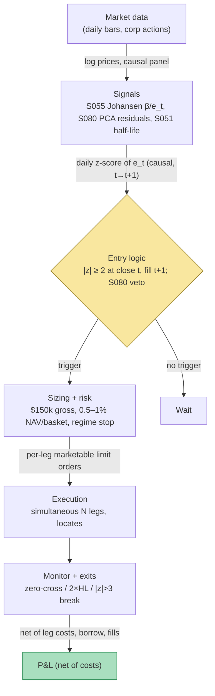

## Stage 133/200 — T033: Johansen VECM Basket Arb

*Batch TB4 · Strategy 33/100 · Signals S055, S080, S051*

### T1. One-line verdict

| | |
|---|---|
| **Style** | Daily-bar statistical arbitrage: multi-leg (3+) cointegrated *basket* mean reversion |
| **Edge source** | A cointegrating vector estimated by the Johansen maximum-likelihood procedure: the error-correction spread $\beta'X_t$ mean-reverts when the estimated long-run equilibrium is real |
| **Typical holding period** | 2–10 trading days per round trip; bounded by the spread's OU half-life |
| **Capacity hint** | Like T031/T032 but narrower: multi-leg baskets are harder to fill and costlier to borrow, so the tradable set is the most liquid large/mid-cap names |
| **Build-or-buy in one line** | Build the Johansen/VECM screen and the cost/heat engine yourself; buy the raw bars — Johansen is a measurement filter, not a bought alpha |

### T2. Full mechanics

**What the strategy is.** A *cointegrating vector* $\beta$ is a set of weights such that the weighted combination of log prices, $e_t = \beta'X_t$, is stationary (mean-reverting) even though each leg wanders. The *Johansen procedure* is the maximum-likelihood way to estimate $\beta$ for a *basket* of $N \ge 2$ assets at once — unlike Engle–Granger (S050/T031), which is a single-equation regression, Johansen estimates the whole *VECM* (**v**ector **e**rror-**c**orrection **m**odel):

$$\Delta X_t = \Pi X_{t-1} + \sum_i \Gamma_i \Delta X_{t-i} + \varepsilon_t, \qquad \Pi = \alpha\beta'.$$

Here $\beta'$ picks out the $r$ stationary *error-correction spreads*, and $\alpha$ measures how fast each leg adjusts back toward them. The *cointegration rank* $r = \mathrm{rank}(\Pi)$ (found by trace and maximum-eigenvalue tests) is the number of independent equilibrium relations. T033 trades the top-ranked spread $e_t = \beta'X_t$: when its z-score stretches, take the basket position that profits from reversion to the estimated equilibrium.

**Universe & session.** Liquid US large/mid-cap common stocks, price ≥ $5, dollar volume ≥ $5mm, shortable, same-industry preferred (`example`). Daily bars, RTH closes. Exclusions: earnings/corporate-action windows ±2 days, halts, announced M&A. Basket size 3–5 names (`example`) — beyond 5 the borrow and fill complexity dominates.

**Formation (rolling, `example` cadence).** On a 252-day formation window (`example`) before trading:
1. Take log prices of candidate basket; select VAR (vector autoregression) lag by BIC (Bayesian information criterion).
2. Run the Johansen test (trace + max-eigenvalue); accept baskets with rank $r \ge 1$ at 5% (`example`). With $r > 1$, trade the spread with the smallest OU half-life (S051).
3. Normalize $\beta$ (first leg weight = 1); compute $e_t = \beta'X_t$, its formation mean $\mu_e$ and $\sigma_e$.
4. AR(1) on $e_t$ → half-life; require $HL \le 30$ days (`example`); time stop $= 2 \times HL$.
5. **Residual/health screen (S080):** compute each leg's PCA (**p**rincipal **c**omponent **a**nalysis) residual z-score — the leg's return stripped of its top market factors. Veto any basket where a leg's idiosyncratic $|s| > 2.0$ (`example`): a spread stretched by one leg's stock-specific news is not a basket mispricing.
6. Multiple testing: with hundreds of candidate baskets, control the FDR across the rank tests — most "cointegration" in a screen is luck.

**Entry rule.** Daily at close: $z_t = (e_t - \mu_e)/\sigma_e$ (parameters frozen from formation). If flat and $z_t \ge +2.0$: *short the basket* — sell the positive-$\beta$ legs, buy the negative-$\beta$ legs in $|\beta|$-weighted size (`example`). If $z_t \le -2.0$: long the basket (`example`). Gross basket target $150k (`example`). **Causal timing:** $z_t$ uses only data $\le t$; earliest fill is the $t+1$ open.

**Exit rule.** Zero-cross of $e_t$ (exit when the error-correction spread reverts through its formation mean); time stop at $2 \times HL$ (`example`); regime stop: if $|z| > 3$ persists 3 days (`example`) — the estimated equilibrium is breaking, not the spread.

**Position sizing.** Per-basket risk 0.5–1% of NAV (`example`). Portfolio heat: total basket gross ≤ 4% NAV (`example`); hard cap 10 baskets (`example`).

**Risk limits.** Daily loss stop −1.5% NAV; max gross 300% NAV; kill switch: if the rank-1 spread's realized half-life doubles versus formation for a quarter, freeze new baskets and re-run the rank tests.

**Cost model.** Costs scale with legs: $N$ legs × 5 bp one-way (`example`), plus borrow on every short leg — a 4-leg basket can carry 2–3 short legs. The hurdle is ~30–60 bp per round trip (`example`); the example charges costs explicitly.

**Order/execution sketch.** Same pairs-algo discipline as T031/T032: simultaneous marketable limits on all $N$ legs at the $t+1$ open (cancel all if any leg fails), ≤10% of visible depth per leg (`example`), confirmed locates before any short, dividends booked as cash flow on ex-date.

### T3. Signals it consumes

| Signal | Role | Weight / logic |
|---|---|---|
| S055 — Johansen VECM pairs | Primary trigger (direction + weights): the cointegrating vector $\beta$ and the error-correction spread $e_t = \beta'X_t$ | Enter at $\|z\| \ge 2$ (`example`); exit on zero-cross; weights from normalized $\beta$ |
| S080 — PCA/eigenportfolio residuals | Basket-health screen: veto baskets whose legs carry large idiosyncratic moves | Veto if any leg's residual $\|s\| > 2.0$ (`example`) |
| S051 — OU half-life | Ranks spreads (with $r > 1$) by error-correction speed; sets the time stop | Trade the smallest-$HL$ spread; max hold $= 2 \times HL$; skip $HL > 30$ days (`example`) |

Combination logic (pseudocode, ≤25 lines):

```
# ---- formation (data <= t only) ----
Y      = log_prices(basket, n=252)                             # causal panel
r, B   = johansen(Y, lag=bic_lag, test=['trace','maxeig'])     # S055
if r < 1: skip basket                                          # no equilibrium
e      = B[:,0] @ Y.T                                          # top error-correction spread
HL     = ou_half_life(e); mu, sig = mean(e), std(e)            # S051 + formation stats
if HL > 30: skip basket                                        # example
if any(pca_resid_z(leg) > 2.0 for leg in basket): skip         # S080 idiosyncratic veto
# ---- daily trading ----
z = (e_t - mu) / sig                                           # causal at close t
if flat and z >= 2.0:  enter(short_basket(B))                  # example
elif flat and z <= -2.0: enter(long_basket(B))                 # example
elif open and e_t crosses mu: close()                          # zero-cross exit
elif open and days_open >= 2*HL: close()                       # S051 time stop
```

### T4. Worked example — numbers + P&L (SYNTHETIC)

All numbers are **synthetic**: three fictional same-industry names X1, X2, X3. Formation (not shown): 252 days, Johansen rank $r = 1$, cointegrating vector $\beta = [1,\,-0.7,\,-0.4]$, $\mu_e = 52.9582$, $\sigma_e = 0.7894$ → entry band $\pm 1.5789$ (`±2σ` `example`). OU half-life 4 days (time stop 8 days, `example`); S080 veto stipulated as passed (max leg $|s| = 1.2 < 2.0$, `example`). Trading window: 15 days from `rng = np.random.default_rng(133)` — a hand-shaped liquidity-shock path (X2 dips, X3 lags) plus seeded noise, printed exactly as the script computed it and plotted in `images/T033_example.png`. Gross basket target $150k (`example`): X1 = $150,000, X2 = −$105,000, X3 = −$60,000. Costs 5 bp one-way/leg; borrow 50 bp annualized (all `example`).

| Day | X1 | X2 | X3 | $e_t$ | $z$ | Action |
|---|---|---|---|---|---|---|
| 1 | 101.94 | 49.60 | 34.42 | +0.490 | +0.62 | — |
| 2 | 100.72 | 48.83 | 33.57 | +0.156 | +0.20 | — |
| 3 | 101.27 | 49.98 | 33.49 | +0.405 | +0.51 | — |
| 4 | 100.68 | 50.24 | 32.56 | +0.636 | +0.81 | — |
| 5 | 101.55 | 49.83 | 31.91 | +2.610 | +3.31 | **OPEN short basket** |
| 6 | 99.54 | 47.01 | 32.50 | +2.576 | +3.26 | hold |
| 7 | 100.16 | 48.84 | 33.36 | +1.172 | +1.49 | hold |
| 8 | 99.14 | 50.09 | 33.13 | −1.189 | −1.51 | **CLOSE** (zero-cross) |
| 9 | 100.00 | 46.55 | 33.85 | +1.237 | +1.57 | — |
| 10 | 98.80 | 45.86 | 32.89 | +0.431 | +0.55 | — |
| 11 | 98.88 | 44.83 | 33.99 | +0.627 | +0.79 | — |
| 12 | 97.07 | 44.28 | 33.79 | −0.556 | −0.70 | — |
| 13 | 98.65 | 45.64 | 35.19 | −0.338 | −0.43 | — |
| 14 | 98.83 | 46.84 | 34.65 | −0.702 | −0.89 | — |
| 15 | 99.45 | 46.14 | 34.44 | +0.336 | +0.43 | — |

**Line-by-line P&L.** *Short basket, entry d5 ($z=+3.31$) → exit d8 ($z=−1.51$), held 3 days.* Leg P&L: X1 **+$2,430** (sold 101.55, covered 99.14), X2 **+$186** (bought 0.7×49.83, sold 0.7×50.09), X3 **+$489** (bought 0.4×31.91, sold 0.4×33.13). **Gross = +$3,105.** Costs: $150.00. Borrow: $4.20. **Net = +$2,951** on $315,000 of gross exposure.

**Window total: net +$2,951.** No other trades triggered — one clean convergence, the way the textbook draws it.


**Where the example is optimistic.** One trade, one convergence, no losing baskets — the error-correction spread reverts exactly as estimated. The $\beta$ is stipulated, not estimated (real Johansen estimates carry lag-choice, rank-test, and normalization uncertainty); the S080 veto is stipulated as passed; fills at printed marks across 3 legs with no legging risk; placid GC borrow; costs a flat 5 bp; and $z=+3.31$ entries are rare in live data. Nothing here is a backtest.

### T5. Data & infra — what must run

| Job | Cadence | What it does |
|---|---|---|
| Universe + corporate-action adjust | Nightly after 18:00 ET | Same point-in-time panel as T031/T032 |
| Johansen screen + VECM refit | Monthly (weekly in stress) | Lag by BIC, trace/max-eigenvalue tests, $\beta$, $\alpha$, FDR control across baskets |
| S080 residual screen | Daily | PCA residuals per leg; veto baskets with idiosyncratic $\|s\| > 2$ |
| OU half-life updates | Daily | AR(1) per live spread; max-hold clock |
| Borrow / HTB file | Daily 16:30–18:30 ET | Veto/resize baskets with HTB short legs |
| Risk / heat monitor | Continuous | Open baskets, gross, days-held vs $2\times HL$ |

**M5 Max feasibility: feasible (Tier M).** Per `notes/cost-model.md` §2, the Johansen screen is eigen-decompositions of small matrices — hundreds of candidate baskets × 252 observations is seconds to minutes of vectorized numpy; the workload is the *screen loop* plus FDR bookkeeping, not the linear algebra. RAM is megabytes against the 77 GB budget (§3). Engineering: Tier M 20–60 h for the screen plus strategy harness M+ 40–100 h → **~60–160 h ≈ $9,000–$24,000** `loaded-cost estimate` at $150/hr (§5).

**Storage growth:** daily bars trivial (~1.3 GB/year for 3,000 stocks, §4); cached $\beta$ vectors and test statistics are megabytes.

**Feed-outage safe mode.** (1) Feed late → freeze new baskets; manage open ones on last-known $z$ with the time stop hard at $2\times HL$. (2) Johansen refit fails or rank collapses to 0 → treat as no-signal, flatten on the next close. (3) Borrow file stale >1 day → veto new short legs (a basket with an unborrowable leg is a guaranteed legging). (4) Outage >3 trading days → flatten the book.

### T6. Buy vs build

| Option | What you get | Indicative price | Verdict |
|---|---|---|---|
| Tier-0: Stooq / Alpaca IEX daily | Free daily bars | ~$0 | Enough to prototype the VECM screen |
| Tier-1: Polygon Stocks Advanced | Clean SIP daily bars + actions | ~$30–200/mo `indicative — verify before budgeting` | The production feed; $\beta$ estimates need clean adjustments |
| Tier-2: Databento Standard | Exchange-direct data | ~$200/mo + usage `indicative — verify before budgeting` | Only if you screen intraday |
| Borrow data (Markit / S&P Securities Finance / Astec / DataLend) | Fee history, utilization | $30k–$150k+/yr (Grok Q-TB4-2 lead — unverified chatbot claim) `indicative — verify before budgeting` | Skip unless you backtest HTB names |
| Open-source econometrics libraries | Johansen/VECM routines | ~$0 | Useful scaffolding — but rank-test discipline, FDR control, and the live plumbing are yours |

**Verdict: build the screen and the cost/heat engine on Tier-1 data; rent borrow and execution from the prime broker.** The Johansen estimator is textbook; what no vendor sells is your rank-test discipline, your FDR control, and your multi-leg execution. The crossover: with 2–3 short legs per basket, price institutional borrow history before trusting any backtest that shorts beyond easy-to-borrow large-caps.

### T7. Success-ratio evidence

| Study / source | Market & period | Metric | Before/after cost | Caveat |
|---|---|---|---|---|
| Johansen (1988); Johansen (1991); Johansen & Juselius (1990) | Econometric theory + macro illustrations | ML estimation of cointegrating vectors, trace/max-eigenvalue rank tests | n/a — method papers | These establish the *measurement*, not a trading alpha |
| Hendry & Juselius (2000/2001), expository | Cointegration survey | Documents the method's uptake and the fragility of rank inference in finite samples | n/a | Reinforces the need for rolling validation, not live confidence |
| Avellaneda & Lee (2010) | US equities, 1997–2007 | PCA-based stat-arb (the S080 family): 4.5 Sharpe-class in-sample-era performance, decaying after | Before-cost mostly | The factor-residual program this chapter uses as a *veto*; its own alpha decayed — a caution, not an endorsement |

**Capacity.** Like T031 but narrower: 3–5-leg baskets concentrate in the most liquid names, and every short leg needs a locate — the tradable set is smaller than the pair universe at equal costs.

**Decay / model risk.** The honest framing: Johansen is a *measurement upgrade*, not a documented standalone edge over Engle–Granger. It answers "how many equilibria and what weights" instead of "is this one regression stationary," which matters for baskets — but no checkable study in hand establishes general after-cost superiority of Johansen-screened baskets over EG pairs. Rank tests are fragile in finite samples (lag choice, normalization, and FDR all move the basket set), and a beautifully estimated $\beta$ on a broken regime is just a precise way to be wrong.

**Honest bottom line.** For a ≤$1M paper operation, Johansen basket arb is a research vehicle: the value is learning VECM discipline, multi-leg execution, and cost plumbing — not a live Sharpe. Its defensible live role is as the basket-construction filter inside a stat-arb program (S080 as the health veto, S051 as the clock), where the edge is diversified across many small convergences. An institutional desk runs it as a sleeve of the equity-stat-arb book with real stock-loan access, never as a standalone strategy.

### T8. Failure modes

1. **Spurious cointegration** — near-unit-root series look cointegrated in 252-day windows by luck. *Mitigation:* FDR control across the screen, rolling re-tests, OOS half-life confirmation.
2. **Rank-test fragility** — lag choice and normalization move $r$ and $\beta$. *Mitigation:* BIC lag selection, both trace and max-eigenvalue tests, stability of $\beta$ across adjacent windows.
3. **Regime breaks in $\beta$** — the equilibrium that held for 5 years dies in a week. *Mitigation:* rolling refits, $|z| > 3$-for-3-days stop, realized-vs-formation half-life kill switch.
4. **Multi-leg fill/legging risk** — 3–5 legs filled at different prints is not the printed spread. *Mitigation:* simultaneous marketable limits, cancel-all-on-partial, ≤10% depth participation per leg (`example`).
5. **Borrow blowup on 2–3 short legs** — one HTB leg turns the basket into a fee furnace. *Mitigation:* borrow gate per short leg before entry; resize or veto.
6. **$\alpha$ misestimation** — slow-adjusting legs make the "convergence" slower than the half-life says. *Mitigation:* S051 on the *spread*, not the theory; time stop at $2 \times HL$ regardless of $\alpha$.
7. **Idiosyncratic contamination** — one leg's news event masquerades as basket mispricing. *Mitigation:* the S080 veto — no basket trades with a leg's residual $|s| > 2.0$ (`example`).
8. **Cost scaling with legs** — $N$ legs × spread/impact can exceed the per-trade edge. *Mitigation:* per-basket net-expected-profit gate after the statistical screen.

### T9. Visuals




### T10. Sources

1. Johansen, S. (1988). "Statistical analysis of cointegration vectors." *Journal of Economic Dynamics and Control*, 12(2–3), 231–254. (The ML estimation framework.)
2. Johansen, S. (1991). "Estimation and hypothesis testing of cointegration vectors in Gaussian vector autoregressive models." *Econometrica*, 59(6), 1551–1580. (The rank tests.)
3. Johansen, S. & Juselius, K. (1990). "Maximum likelihood estimation and inference on cointegration — with applications to the demand for money." *Oxford Bulletin of Economics and Statistics*, 52(2), 169–210. (The applied template.)
4. Hendry, D. F. & Juselius, K. (2000/2001). "Explaining cointegration analysis," Parts I–II. *The Energy Journal*. (Expository; documents the method's finite-sample fragility.)
5. Avellaneda, M. & Lee, J.-H. (2010). "Statistical arbitrage in the US equities market." *Quantitative Finance*, 10(7), 761–782. (The PCA stat-arb program this chapter uses as a veto — and a decay caution.)

Source log: Grok answered Q-TB4-1..3 (2026-09-10); all claims independently verified or labeled unverified. No Grok-supplied quantitative claim is adopted in this chapter; the Johansen-as-measurement framing follows the cited papers.

**Unverified leads** (chatbot-provided, not independently checkable — do not cite as evidence):
- Grok (2026-09-10), Q-TB4-2: borrow-history vendors $30k–$150k+/yr; institutional borrow pricing as the crossover item.
- Grok (2026-09-10), Q-TB4-3: any Johansen-vs-Engle–Granger after-cost horserace claims — no checkable study was obtained; this chapter makes no such claim.
