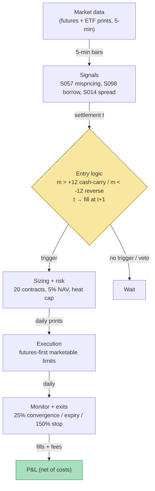

## Stage 134/200 — T034: Index Futures Cash-and-Carry

*Batch TB4 · Strategy 34/100 · Signals S057, S098, S014*

### T1. One-line verdict

| | |
|---|---|
| **Style** | Index-futures basis arbitrage (cash-and-carry / reverse cash-and-carry) |
| **Edge source** | Convergence of the futures–cash **basis** (futures minus spot) to its **cost-of-carry fair value** (the no-arbitrage futures price given financing and dividends), harvested only when the gap clears borrow fees and spread costs |
| **Typical holding period** | Days to weeks (`example`: enter up to ~90 days before expiry, unwind at expiry or on early convergence) |
| **Capacity hint** | Tiny for a non-dealer book — the 8–20 index-point richness a small account needs to clear costs is rare; inside a few points the tape belongs to index-arb desks and authorized participants |
| **Build-or-buy in one line** | Build the fair-value monitor yourself on bought futures + ETF data (Tier 1/2); the actual edge is balance-sheet and borrow access, which no vendor sells |

### T2. Full mechanics

**Jargon, defined once.** *Basis* = futures price minus spot price (S057's one definition, used throughout). *Cost of carry* = financing cost minus income (dividends) of holding the underlying to expiry. *Fair value* F\* = the no-arbitrage futures price implied by spot, financing, and dividends. *Mispricing* m = F − F\* — the basis after carry is accounted for; this, not the raw basis, is the tradable signal. *Contango* = futures above spot; *backwardation* = futures below spot. *GC* (general collateral) = the baseline stock-loan rate for easy-to-borrow names (~25–50 bp annualized, `example`); *special* = a hard-to-borrow name commanding a much higher fee (up to 10%+, `example`). *Reverse cash-and-carry* = the mirror trade (cheap futures: buy futures, short the basket) that pays borrow on the short. *Tracking error* = the ETF's deviation from its index — the cost of substituting an ETF for the full basket.

**Universe & session.** One liquid index future at a time (`example`: an ES-like S&P 500 future, $50 multiplier) against its replicating cash leg (the full index basket, or an SPY-like ETF as the `example` substitute). Session: positions are opened on daily settlement prints and held across sessions; intraday monitoring of the basis uses RTH futures prints only. Exclusions: dividend-heavy ex-date weeks where the forecast is uncertain, futures roll week (pin risk around expiry mechanics), and any session where the ETF's trailing average effective spread exceeds 5 bp (`example` — the S014 cost gate).

**Entry rule.** All quantities use the MASTER.md signal definitions. At settlement *t* (causal — signal at *t*, earliest fill *t+1*):

- Mispricing (S057): `m_t = F_t − F*_t`, with `F*_t = S_t·e^{(r−q)·T}` (`example` inputs: r = 5.00% financing, q = 1.4% dividend yield, T = days-to-expiry/365).
- **Cash-and-carry** (rich futures): enter if `m_t > +bound` (`example` bound = +12 index points ≈ 24 bp of spot): buy $5mm of the cash ETF/basket at *t+1*'s open and sell `N = $5,000,000 / (F_t × 50)` futures contracts (`example`: 20 contracts).
- **Reverse cash-and-carry** (cheap futures): enter if `m_t < −bound`: buy futures, short the cash leg — **only if** the borrow-fee check passes (see S098 below).
- S098 borrow filter: look up the indicative borrow fee on the ETF/short basket; the reverse leg is **vetoed** if the annualized fee drag over the remaining life exceeds 50% of the locked cheapness (`example`); a hard veto if any name in the basket is on special with no locate.
- S014 cost gate: enter only if the trailing 20-day average effective half-spread on the cash leg is below 5 bp (`example`) and the futures' observed bid–ask is at most 1 tick.

**Exit rule** — first of three fires (`example` parameters):

1. **Convergence:** `m_t` back within 25% of the entry level (|m_t| ≤ 0.25·|m_entry|) — unwind both legs.
2. **Expiry:** unwind at the futures' expiry (cash-settled) or roll decision; never hold past 5 days before expiry (`example`) — the basis becomes noise-dominated and settlement mechanics take over.
3. **Stop-loss:** `m_t` moves against the position by 150% of the entry richness (`example`) — a persistent widening means your fair-value inputs (r, q) are wrong, not that the edge got better.

**Position sizing.** Notional per trade = $5mm on a $100mm NAV book (`example`) — 5% NAV; maximum 3 concurrent carry trades (`example`, 15% NAV). Contracts sized so dollar beta ≈ 1: `N = round(cash_notional / (F × multiplier))`; the rounding residual is accepted as sub-1-point noise, not hedged.

**Risk limits.** Daily loss stop −1% NAV (`example`, then no new entries that day); max gross 200% NAV (`example`); kill-switch: futures–cash print staleness > 5 minutes, a dividend-forecast revision that flips the sign of m, or a borrow-fee repricing that trips the reverse-leg veto — flatten the affected leg immediately.

**Cost model** (applied in T4): cash leg 4 bp round-trip (2 bp each way — half-spread plus commission, `example`); futures $50/contract round-trip all-in (exchange + NFA + 0.5-tick slippage, `example`); financing is inside F\*, not a separate cost; dividends received on the long cash leg. No borrow fee on the long-cash side; borrow is explicit on the reverse leg.

**Order/execution sketch.** Both legs as marketable limits at *t+1*'s open print, sequenced futures-first then cash. Participation cap: cash-leg child orders ≤ 5% of the ETF's average 1-minute volume (`example`) — a full 500-name basket is a program trade for a program-trading desk, not walked manually. Queue-position honesty: fills assumed at the touch plus half-spread; any claim of better is `simulated only — requires MBO/ITCH`.

### T3. Signals it consumes

| Signal | Role | Combination logic |
|---|---|---|
| S057 cash-and-carry mispricing | **Primary trigger** (direction + timing) | `m_t > +12 pts` → cash-and-carry; `m_t < −12 pts` → reverse; exit at 25% of entry level |
| S098 borrow fees / days-to-cover | **Veto + sizing** on the reverse leg | veto reverse if fee drag > 50% of locked cheapness (`example`); hard veto on no-locate specials |
| S014 spread decomposition | **Cost gate** | enter only if trailing 20-day avg effective half-spread < 5 bp on the cash leg (`example`); realized-spread diagnostic is never a live trigger |

```
# T034 combination logic (<=25 lines; every threshold `example`)
on each settlement t (causal; fills at t+1):
    Fstar = S * exp((r - q) * T)          # S057 fair value
    m     = F - Fstar                      # mispricing, index pts
    bound = 12.0                           # example cost band
    fee   = indicative_borrow_fee(ETF)     # S098, %/ann
    esp   = avg_effective_halfspread(20d)  # S014, bps
    if m > +bound and esp < 5 and flat:
        buy 5mm cash ETF; sell 20 futures   # CASH-AND-CARRY
    elif m < -bound and esp < 5 and flat:
        lock = -m * 50 * 20                 # $ locked cheapness
        drag = fee * 5_000_000 * T          # borrow drag over life
        if drag < 0.5 * lock and locate_ok:
            buy 20 futures; short 5mm ETF   # REVERSE
        else:
            veto("borrow kills reverse")    # S098 veto
    if position and abs(m) <= 0.25*abs(m_entry): unwind
    if T_to_expiry < 5 days: unwind         # expiry pinch
    stop if m moved 150% against entry
```

### T4. Worked example — numbers + P&L (SYNTHETIC)

**All numbers synthetic** (random seed 134 = stage number, `batches/TB4/plot_T034.py` — re-runnable). ES-like future, $50 multiplier, spot index S = 5,000, r = 5.00%, q = 1.4%, T = 90/365 yr. Fair value `F* = 5000·e^{(0.05−0.014)·0.2466} = 5000·e^{0.00888} = 5044.5`. Cash leg: $5,000,000 of an SPY-like ETF. Contracts: `5,000,000 / (F × 50)` ≈ 20 (`example` rounding accepted). Costs: cash 4 bp RT = $2,000; futures $50/contract RT × 20 = $1,000.

| Day | m_t (pts) | Event |
|---|---|---|
| 0 | +16.20 | above bound, but entry rule requires day ≥ 5 for signal stability |
| **5** | **+13.44** | **ENTRY: m > +12 → long $5mm ETF, short 20 futures** |
| 10 | +9.80 | richness decaying; hold |
| 15 | +5.65 | hold |
| 20 | +4.35 | hold — inside the cost band, no new signal |
| 25 | +3.65 | hold |
| **28** | **+2.87** | **EXIT: 2.87 < 0.25 × 13.44 → unwind both legs** |
| 31 | −10.03 | reverse signal (cheap futures) — evaluated, then **VETOED** (see below) |

Line-by-line P&L. **Gross capture** = (m_entry − m_exit) × multiplier × contracts = (13.44 − 2.87) × $50 × 20 = 10.57 × $1,000 = **+$10,569**. **Costs**: cash leg $5,000,000 × 0.0004 = −$2,000; futures 20 × $50 = −$1,000; total **−$3,000**. **Net = +$7,569** on $5mm committed for 23 days (`example` — synthetic, not a performance claim). The chart `images/T034_example.png` plots this exact path: mispricing with entry/exit markers (top) and the mark-to-market P&L frozen at exit (bottom).

**The vetoed reverse signal (day 31).** m_31 = −10.03 pts: futures cheap. Gross lock if reversed = 10.03 × $50 × 20 = **$10,034**. Borrow check (S098): the ETF short would pay a 2.8%/ann special (`example`) for the remaining 58 days → drag = 0.028 × $5,000,000 × 58/365 = **$22,247**. Drag ($22,247) > 50% of lock ($5,017) — **veto: no trade**.

**Where the example is optimistic.** (1) The entry at day 5 assumes the day-5 settlement print of both legs is simultaneously tradable — in practice the ETF close and the futures settlement print minutes apart, and the basis between them is partly stale. (2) The 4 bp cash-leg cost assumes a deep SPY book at the open print; a full 500-name basket costs multiples of that in spread and impact. (3) Dividends are assumed known at q = 1.4% — a forecast miss into expiry reprices F\* and the "locked" edge with it. (4) The exit at day 28 assumes the richness decays monotonically enough to trip the 25% rule; real bases widen-and-hold, and the stop at 150% adverse is the more common exit. (5) No financing-rate move: if your actual funding reprices above the assumed r, the carry math silently inverts.

### T5. Data & infra — what must run

**Pipeline inventory.** Nightly (after 18:00 ET): index divisor/constituent changes, dividend-forecast feed update, SOFR/GC rate pull, futures expiry calendar roll. Intraday loop (every 5 minutes RTH, `example`): futures settlement/last prints, ETF mid quotes, recompute F\* and m_t, borrow-fee snapshot, S014 effective-spread trailing average. Post-close: mark-to-market vs entry level, heat check, borrow-fee repricing scan for the reverse-leg watchlist.

**M5 Max feasibility: trivial.** Per `notes/cost-model.md` §2/§3: a daily/5-minute scalar computation — megabytes of RAM; 60-day history is kilobytes. Engineering time: Tier L (`cost-model.md` §5) — **4–12 h** ≈ $600–1,800 loaded-cost estimate at $150/hr for the fair-value monitor; the borrow-fee join and dividend-forecast hygiene are the only real work (Tier M if built properly, 20–60 h ≈ $3,000–9,000). Bottleneck: data licensing and corporate-action correctness, not compute.

**Feed-outage safe mode.** If futures prints go stale > 5 minutes (`example`) or the dividend-forecast feed misses its nightly update: **freeze new entries, keep existing positions** (they are convergence trades with a known unwind), and widen the exit tolerance rather than trading on a stale F\*. Never compute m_t from a cached spot against a live future. On recovery, recompute F\* from the first synchronized print pair before re-arming.

### T6. Buy vs build

| Option | What you get | Indicative price | Gains | Loses |
|---|---|---|---|---|
| Tier 0: CME delayed quotes + FRED SOFR + public dividend data | free basis ingredients | ~$0 — *indicative — verify before budgeting* | $0 monitor | delayed prints; no borrow data; dividend forecasts are the weak link |
| Tier 1: Polygon Stocks Advanced (SIP) + CME live via broker | real-time ETF + futures prints | ~$30–200/mo — *indicative — verify before budgeting* | live m_t | borrow-fee history still missing; reverse leg stays vetoed by ignorance |
| Tier 2: Databento futures + equities | exchange-timestamped prints | ~$200/mo + usage — *indicative — verify before budgeting* | honest timestamps for the t→t+1 rule | overkill for a daily-settlement signal |
| Tier 3: Markit / S&P Securities Finance borrow history | indicative + average fee, utilization, 15y history | $30k–$150k+/yr — *indicative — verify before budgeting* | the only honest reverse-leg cost model | the six-figure line item; only worth it at reverse-leg scale |
| Prime-broker program-trading desk | basket execution, locates, TCA | bundled in PB relationship | someone else's locate network | you still own the signal; PB tools optimize their flow, not your bound |

**Verdict: build the monitor, rent the balance sheet.** The fair-value arithmetic is an afternoon's work on data you already buy; no vendor sells your bound, your dividend forecast, or your funding rate. **Buy** institutional borrow data only if the reverse leg is a real sleeve; **build** everything else; **rent** execution and locates from the PB. Crossover: if you will only ever trade the long-cash side in GC names, skip the borrow feed entirely.

### T7. Success-ratio evidence

Documented evidence for *small-account* index cash-and-carry after costs is thin — and that thinness is itself the finding.

| Source | Market & period | Metric | Before/after cost | Caveat |
|---|---|---|---|---|
| Grok Q-TB4-3 §4 (unverified lead) | equity index futures–cash basis | "simple basis-timing / cross-sectional basis strategies, Sharpe ~0.6–0.9 in futures" | before full retail costs | chatbot claim, no checkable citation captured — **unverified** |
| Grok Q-TB4-3 §4 (unverified lead) | persistent futures–cash imbalances | "~5–6% annual premium attached to persistent imbalances" | financing-factor framing, before costs | same status — treated as a lead, not a fact |
| Do–Faff 2012, J. Financial Research (verified paper, adjacent evidence) | US pairs 1963–2009 | baseline convergence strategies "largely unprofitable after 2002" once commissions + impact + short fees are honest | after cost | pairs, not C&C — included to calibrate what honest costing does to convergence sleeves |
| This chapter's T4 | synthetic | net +$7,569 on $5mm / 23 days | after modeled costs | **synthetic — not evidence of anything** |

**Capacity.** The trade's capacity is the depth of the mispricing, not your capital: richness beyond ~8–20 index points on an ES-like future (Grok's band — unverified lead) appears rarely and is lifted first by dealers and APs who already own the basket. **Crowding** shows up as the basis living permanently inside your cost band — the signal fires never, not wrongly. **Decay:** electronic market-making has compressed the cash–futures basis toward fair value for two decades; the remaining dislocations cluster around stress events (e.g. March 2020, when futures and cash gapped because everyone wanted the same hedge — Grok Q-TB4-3) and dividend-tax or funding dislocations.

**Honest bottom line.** For a ≤$1M paper operation, T034 is a *monitoring* strategy, not a trading strategy: build the mispricing dashboard, set alerts at your bound, and expect to trade a handful of times a year — mostly watching dealers take the prints inside your costs. For an institutional desk with GC funding, a basket already in inventory, and a borrow desk, it is a real, low-Sharpe, balance-sheet-intensive carry line. The $1M paper account earns its keep by *not* trading the 4-point richnesses.

### T8. Failure modes

1. **Wrong F\*, not a wide basis.** Stale r or q manufactures phantom mispricing — the commonest false signal in this book. Mitigation: dividend forecasts from a vendor file (not trailing yield) and your *actual* funding rate; recompute F\* on every input change; the implied-financing-rate inversion (`r_impl = (1/T)·ln(F/S) + q`) as a sanity check.
2. **Borrow kills the reverse leg.** Cheap futures are usually cheap because the basket is hard to borrow — the signal and the cost are the same phenomenon. Mitigation: the S098 veto is structural; size the reverse leg by post-borrow edge only.
3. **Dividend forecast error into expiry.** A special dividend or a cut reprices fair value by points. Mitigation: dividend calendar as a first-class input; halve size (`example`) across heavy ex-date weeks; treat ex-date moves as cash flows, never as alpha.
4. **Expiry pinch.** Inside ~5 days the basis is dominated by settlement mechanics and pin risk, not carry math. Mitigation: the time-stop exit — unwind early and accept giving up the last points.
5. **Funding repricing.** SOFR ≠ your PB's rate, and your rate can move mid-trade. Mitigation: fair value at *your* funding; monitor the wedge; the stop at 150% adverse widening catches a regime flip in funding.
6. **Tracking error on the ETF substitute.** SPY ≠ the index by the creation/redemption mechanism's own frictions, and those frictions widen exactly when you need the hedge. Mitigation: haircut the bound by the ETF's trailing tracking error; on large books use the full basket via a program desk.
7. **Stale-print basis.** ETF close vs futures settlement are minutes apart; after-hours moves make the overnight m_t a mirage. Mitigation: synchronized print pairs only; the T5 safe-mode rule.

### T9. Visuals




### T10. Sources

1. Hull, J. C. *Options, Futures, and Other Derivatives* (cost-of-carry fair value F = S·e^{(r−q)T}, cash-and-carry arbitrage mechanics — the textbook [D] source for S057's formula).
2. CME Group — "Introduction to Stock Index Futures" and fair-value basis education — https://www.cmegroup.com/education.html (exchange-published basis/carry mechanics; checkable).
3. CFA Institute — cash-and-carry / reverse cash-and-carry arbitrage, cost-of-carry model (curriculum readings on forward pricing — checkable via CFA Program materials).
4. Gatev, E., Goetzmann, W. & Rouwenhorst, G. (2006). "Pairs Trading: Performance of a Relative-Value Arbitrage Rule." *Review of Financial Studies* — https://academic.oup.com/rfs (adjacent convergence-trading evidence; the decay calibration used in T7 via Do–Faff 2012).

**Source log.** Grok answered Q-TB4-1..3 (2026-09-10); all claims independently verified or labeled unverified.

**Unverified leads** (chatbot-only — never in Sources):
- Grok Q-TB4-3 §4: Hazelkorn–Moskowitz–Vasudevan-type work on the equity futures–cash basis ("~5–6% annual premium", "basis-timing Sharpe ~0.6–0.9 in futures") — no checkable citation captured; unverified chatbot claim.
- Grok Q-TB4-1 (C): illustrative cost bands (equity RT 2–8 bp commission + 2–10 bp half-spread; futures 0.25–1 tick slippage; GC 25–50 bp) — adopted as `example` parameters, not facts.
- Grok Q-TB4-1 (C): the 8–20 bp richness buffer on ES — `example` threshold, not a documented standard.
- Grok Q-TB4-2: borrow-data pricing bands ($30k–$150k+/yr Markit-class; $5k–$20k lean year-1) — vendor bands, `indicative — verify before budgeting`.
- Grok Q-TB4-3: "Baskaran (SSRN 2026)" — dated after the current date; citation plausibility unverified; not used.
- Per the orchestrator QC note: Grok's Q1(C) contract arithmetic (39.51 contracts, the "0.5-pt rounding residual") did not reconcile and was **not** reused; T4 uses independently computed numbers.
