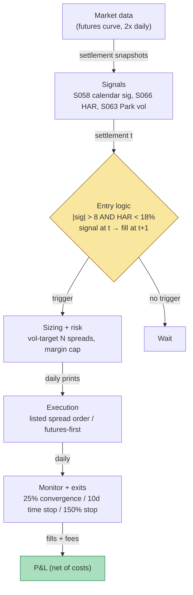

## Stage 135/200 — T035: Futures Calendar-Spread Carry

*Batch TB4 · Strategy 35/100 · Signals S058, S066, S063 · Provenance [D/SR]*

### T1. One-line verdict

| | |
|---|---|
| **Style** | Futures term-structure relative value (calendar-spread carry) |
| **Edge source** | Mean reversion of the observed calendar spread toward its cost-of-carry fair spread — harvesting **roll yield** (the return from a contract aging along the curve toward spot) — timed and sized by volatility forecasts |
| **Typical holding period** | Days to weeks (`example`: enter up to ~60 days out, unwind by 10 days before front-month expiry) |
| **Capacity hint** | Small — a few dozen spreads per expiry pair before your own rolling moves the deferred leg; the institutional version is a market-making inventory book, not a directional sleeve |
| **Build-or-buy in one line** | Build the fair-curve monitor on bought futures data (Tier 1/2); buy nothing packaged — the curve, the vol forecast, and the roll accounting are yours to own |

### T2. Full mechanics

**Jargon, defined once.** *Term structure* = futures prices across expiries. *Calendar spread* = long one expiry, short another (quoted as F_2 − F_1). *Contango* = upward-sloping curve (further expiries dearer); *backwardation* = downward-sloping. *Roll yield* = the return earned as a contract ages along the curve toward spot — the carry this strategy harvests. *Convenience yield* y = the implied benefit of holding the physical commodity (zero for financial futures, positive for commodities in tight supply). *Fly* (butterfly) = M1 − 2·M2 + M3, a purer curvature bet built from two calendar spreads. *Pin risk* = adverse settlement mechanics when a contract expires while you hold it.

**Universe & session.** One futures complex at a time (`example`: ES-like index futures, adjacent quarterlies M1 vs M2, $50 multiplier). Session: signals evaluated on daily settlement curves; entries at the next session's open; no new entries inside 10 days of front-month expiry (`example`). Exclusions: roll week, FOMC (Federal Open Market Committee)/macro event days where the curve reprices on rate expectations (your fair-curve inputs move faster than your prints), and any day either leg's bid–ask exceeds 2 ticks.

**Entry rule.** All quantities use the MASTER.md signal definitions. At settlement *t* (causal — signal at *t*, earliest fill *t+1*):

- Calendar signal (S058): `signal_t = (F_2 − F_1) − (fair_2 − fair_1)`, with `fair(T) = S·e^{(r−q−y)·T}` (`example` inputs: r = 5.0%, q = 1.8%, y = 0 for the index future).
- If `signal_t > +bound` (`example` bound = +8 index points): the observed curve is too steep → **fade the steepening**: sell M2, buy M1.
- If `signal_t < −bound`: too flat/inverted → buy M2, sell M1.
- Vol-timing gate (S066): enter only if the HAR realized-vol forecast is below 18% annualized (`example`) — steep curves in calm vol mean-revert; steep curves in a vol spike are usually the market repricing carry, not mispricing.
- Regime sizing input (S063): the Park range estimator on 5-minute bars gives the spread's daily vol; size so the position's daily vol hits the risk target.

**Exit rule** — first of three fires (`example` parameters):

1. **Convergence:** `signal_t` back within 25% of the entry deviation.
2. **Time stop:** 10 days before front-month expiry — unwind, never roll inside the pinch. (Holding across expiry means rolling the near leg; the roll cost/gain is part of P&L, not an afterthought — this design exits instead.)
3. **Stop-loss:** adverse curve-shape shift of 150% of the entry deviation (`example`) — usually a rate or dividend regime change your fair curve hasn't caught.

**Position sizing.** Vol-targeted: target daily P&L vol $4,000 (`example`) on a $100mm NAV (net asset value) book. Spread daily vol from the S063 Park estimator = 3.8 index points (`example`) → per-spread daily σ$ = 3.8 × $50 = $190 → N = floor(4000/190) = 21 → 20 spreads (`example` rounding). Cap: max 40 spreads per expiry pair (`example`); max 2 expiry pairs at once.

**Risk limits.** Daily loss stop −1% NAV (`example`); the curve book's gross is bounded by margin: 40 spreads × 2 legs × SPAN (Standard Portfolio Analysis of Risk) margin must stay under 30% of NAV (`example`). Kill-switch: either leg's prints stale > 5 minutes, HAR forecast repricing above 25% (`example`), or a central-bank surprise — flatten; the fair curve is invalid until inputs settle.

**Cost model** (applied in T4): futures $50/contract round-trip all-in × 40 contracts (2 legs × 20 spreads) = $2,000 (`example`); no financing line — carry lives in the fair curve; slippage 0.5 tick per leg per side is inside the $50. Roll cost: zero in this design (we exit before expiry); a variant that rolls pays the near-leg spread explicitly.

**Order/execution sketch.** Both legs as a single listed calendar-spread order where the venue supports it (one fill, no leg risk); otherwise futures-first sequencing at *t+1*'s open. Participation cap: each leg ≤ 10% of the leg's average 5-minute volume (`example`). Deferred months are thinner — assume 1-tick slippage on M2, not the 0.5-tick front-month number, in the pre-trade check.

### T3. Signals it consumes

| Signal | Role | Combination logic |
|---|---|---|
| S058 calendar spread (term-structure carry) | **Primary trigger** (direction + timing) | `signal > +8 pts` → fade steepening (short M2/long M1); `signal < −8` → fade flattening; exit at 25% of entry deviation |
| S066 HAR realized-vol forecast | **Regime gate** (timing) | enter only if HAR ann. forecast < 18% (`example`); flatten if it reprices > 25% — vol spikes mean the curve is repricing, not mispriced |
| S063 range-based RV (realized-volatility) estimator | **Sizing** (risk) | Park estimator on 5-min bars → spread daily vol → N_spreads = target_σ$ / (σ_spread_pts × $50) |

```
# T035 combination logic (<=25 lines; every threshold `example`)
on each settlement t (causal; fills at t+1):
    fair1 = S*exp((r-q-y)*T1); fair2 = S*exp((r-q-y)*T2)  # S058
    sig   = (F2 - F1) - (fair2 - fair1)                   # index pts
    har   = HAR_forecast(RV_daily)                        # S066, ann %
    vol   = park_estimator(5min_bars, 20d)                 # S063, pts/day
    N     = floor(4000 / (vol * 50))                       # vol-targeted size
    if flat and sig > 8 and har < 18 and T1_expiry > 10d:
        sell M2, buy M1, N spreads                        # fade steep
    elif flat and sig < -8 and har < 18 and T1_expiry > 10d:
        buy M2, sell M1, N spreads                         # fade flat
    if position and abs(sig) <= 0.25*abs(sig_entry): unwind
    if T1_expiry <= 10d: unwind                           # time stop
    stop if adverse shift > 1.5*sig_entry
```

### T4. Worked example — numbers + P&L (SYNTHETIC)

**All numbers synthetic** (random seed 135 = stage number, `batches/TB4/plot_T035.py` — re-runnable). ES-like future, $50 multiplier, S = 5,000, T1 = 30/365, T2 = 60/365, r = 5.0%, q = 1.8%, y = 0. Fair values (`example` inputs): `fair_1 ≈ 5013.2`, `fair_2 ≈ 5026.4` → fair spread ≈13.2 pts. Observed at entry (`example`): F_1 = 5014, F_2 = 5037.7 → observed spread 23.7 → **signal = +10.5 pts** (day 0) decaying as below. Entry requires signal > +8 **and** HAR < 18%.

| Day | signal (pts) | HAR ann% | Event |
|---|---|---|---|
| 0 | +10.50 | 13.2 | above bound, but the illustrative example withholds entry until day 3 for stability (an example-construction choice, not a T2 rule) |
| **3** | **+9.04** | **14.6** | **ENTRY: fade steepening — sell 20× M2, buy 20× M1** |
| 8 | +6.54 | 13.5 | converging; hold |
| 16 | +4.83 | 13.6 | hold |
| 24 | +3.38 | 12.8 | hold — HAR calm throughout, gate never trips |
| **32** | **+1.73** | 14.0 | **EXIT: 1.73 < 0.25 × 9.04 → unwind both legs** |

Sizing check (S063): Park estimator on 5-minute bars gave spread daily vol 3.8 pts (`example`) → per-spread σ$ = $190/day → N = floor($4,000/$190) = 21 → **20 spreads** (`example`).

Line-by-line P&L. **Gross capture** = (sig_entry − sig_exit) × multiplier × spreads = (9.04 − 1.73) × $50 × 20 = 7.31 × $1,000 = **+$7,316**. **Costs**: 40 contracts × $50 RT = **−$2,000**. **Net = +$5,316** over 29 days (`example` — synthetic, not a performance claim). The chart `images/T035_example.png` plots this exact signal path with entry/exit markers (top) and the P&L frozen at exit (bottom). No roll was needed — the position closed on day 32, 28 days before front expiry.

**Where the example is optimistic.** (1) The signal decays smoothly toward fair; real calendar signals oscillate and re-steepen, whipsawing the 25% exit rule into repeated round-trips. (2) The HAR gate stays calm for the whole 29 days — in practice vol forecasts spike exactly when curves dislocate, so the gate that "protects" you is also the gate that keeps you out of the tradeable episodes. (3) M2 slippage is modeled at the front-month rate; deferred legs are thinner and the $50/contract number is friendlier than the tape. (4) The fair curve inputs (r, q) are held constant for 60 days — a single rate repricing moves fair_2 − fair_1 by points and turns "convergence" into regime change. (5) One expiry pair, one direction, no competing signals — the real book runs several pairs whose signals partially offset.

### T5. Data & infra — what must run

**Pipeline inventory.** Twice-daily (settlement + mid-session): full futures curve snapshot for the traded complex, SOFR (Secured Overnight Financing Rate)/rate pull, dividend-forecast check. Daily close: HAR re-estimation on the RV series, Park estimator update on 5-minute bars, curve-shape diagnostics (contango/backwardation flags per expiry pair). Pre-open: expiry calendar — days-to-expiry per leg, time-stop enforcement. Post-close: P&L vs entry-signal attribution (how much came from convergence vs curve drift).

**M5 Max feasibility: trivial.** Per `notes/cost-model.md` §2/§3: a daily curve snapshot is a handful of floats; HAR is an OLS (ordinary least squares) regression on ~1,000 daily RV points; the Park estimator is a vectorized pass over 5-minute bars — microseconds to seconds, megabytes of RAM. Engineering time: Tier L (`cost-model.md` §5) — **4–12 h** ≈ $600–1,800 loaded-cost estimate at $150/hr for the monitor; Tier M (20–60 h ≈ $3,000–9,000) if you add the roll-accounting engine and multi-pair netting. Bottleneck: the dividend/rate input hygiene, never compute.

**Feed-outage safe mode.** If the curve snapshot is incomplete (a leg missing prints) or the rate feed is stale: **no new entries; existing spreads held** — a calendar spread is hedged across expiries, so the damage from staleness is mis-measured signal, not directional exposure. Recompute the fair curve from the first complete synchronized snapshot before re-arming. If the outage spans the time-stop date, unwind at the next available print rather than rolling blindly into the pinch.

### T6. Buy vs build

| Option | What you get | Indicative price | Gains | Loses |
|---|---|---|---|---|
| Tier 0: CME delayed settlements + FRED SOFR | free curve + rates | ~$0 — *indicative — verify before budgeting* | $0 fair-curve monitor | delayed; no intraday; dividend forecasts weak |
| Tier 1: broker futures data + Polygon | live curve prints | ~$30–200/mo — *indicative — verify before budgeting* | live signal_t | still no borrow/dividend-forecast depth |
| Tier 2: Databento futures | timestamped curve, historical replay | ~$200/mo + usage — *indicative — verify before budgeting* | honest t→t+1 research | overkill for a daily signal |
| Retail platform (QuantConnect-style) with futures | backtest host + data | ~$60–300/mo tiers — *indicative — verify before budgeting* | fast prototype | calendar-spread margining and roll accounting are DIY anyway |
| Professional: listed spread execution via FCM algos | one-fill calendar-spread orders (no leg risk) | bundled in FCM (futures commission merchant) relationship — *indicative — verify before budgeting* | one-fill spread orders | you still own signal, sizing, and the vol gate |
| FCM: SPAN margin netting on recognized spreads | margin offsets across the curve vs outright margin | bundled in FCM relationship — *indicative — verify before budgeting* | real margin offsets | offsets follow the FCM's SPAN parameter file |

**Verdict: build the monitor, rent the execution.** The fair curve, the HAR gate, and the roll accounting are ~a day's work each on data you already buy; no platform sells your bound or your vol target. **Buy** live futures prints at Tier 1 (the signal needs today's settlements, not yesterday's); **rent** spread execution from the FCM (listed calendar orders remove leg risk no retail ticket can replicate). Crossover: if you trade only 1–2 expiry pairs a few times a quarter, Tier 0 delayed data plus a broker screen is enough — the edge is patience, not latency.

### T7. Success-ratio evidence

Honest statement first: **no clean, checkable, after-cost performance series for small-account index calendar-spread carry was found in the captured sources.** What exists is adjacent:

| Source | Market & period | Metric | Before/after cost | Caveat |
|---|---|---|---|---|
| Corsi (2009), J. Financial Econometrics (verified) | realized-vol forecasting | HAR-RV beats short/long-memory alternatives for forecasting | n/a (forecasting, not trading) | supports the S066 timing gate as a forecaster, not as a P&L edge |
| This chapter's T4 | synthetic | net +$5,316 on 20 spreads / 29 days | after modeled costs | **synthetic — not evidence** |

**Capacity.** A 20-spread ticket in ES M1/M2 is invisible; at ~100+ spreads the deferred leg's own impact starts repricing the signal against you. The institutional version of this trade is a market-maker's inventory book earning the bid–ask across the curve, not a directional sleeve — different economics, not scalable by copying. **Crowding** appears as the curve hugging fair value: the signal lives inside ±4 pts and the book does nothing for months. **Decay:** as electronic curve market-making tightened, the "dumb" statistical version (fade deviations from the spread's own historical mean, S058's variant 1) decayed first; the fair-value version survives only where inputs (rates, dividends) move slower than prints.

**Honest bottom line.** For a ≤$1M paper operation, T035 is a legitimate *occasional* trade: a few clean steepenings a year, $2k–$7k net each at this sizing (`example` — synthetic scale), with most of the year's value coming from the discipline of *not* trading the flat curve. For an institutional desk it is a line item inside a broader curve-relative-value book, sized by margin offsets the small account cannot access. Do not mistake the T4's smooth convergence for the return distribution — the median year is boredom punctuated by one stopped-out regime change.

### T8. Failure modes

1. **Stale fair curve.** r, q, or y reprices and your "mispricing" is just yesterday's carry. Mitigation: recompute the fair curve on every input tick; the stop at 150% adverse shift is really a stale-input detector.
2. **Illiquid deferred leg.** M2+ legs are thin; the signal is measured at mids you cannot trade. Mitigation: pre-trade check on both legs' bid–ask (≤ 2 ticks, `example`); model M2 slippage at 1 tick, not the front-month rate.
3. **Roll-week chaos.** Curve shape distorts mechanically as positions roll; signals mean-revert for plumbing reasons. Mitigation: the expiry exclusion — no entries inside the roll window, exits before the pinch.
4. **HAR gate whipsaw.** The vol gate that keeps you out of repricings also keeps you out of the best dislocations. Mitigation: gate on *forecast change*, not level (`example` refinement); accept that some valid signals will be skipped — that is the gate's price.
5. **Overfit bound.** Mining ±8 pts on two years of curve history, then watching the regime change. Mitigation: bound = 2× measured round-trip cost, not an optimized quantile; walk-forward with purged/embargoed validation (S088) if you touch it.
6. **Funding-stress correlation.** In stress, the curve inverts *and* your financing reprices — the two legs of the fair-value equation move against you together. Mitigation: kill-switch on central-bank surprises; the March-2020 analogue (Grok Q-TB4-3, unverified detail) is the scenario to rehearse, not the backtest to mine.
7. **Leg-risk on manual execution.** Filling M1 then watching M2 run away before the second fill. Mitigation: listed spread orders where available; otherwise futures-first sequencing and a small leg-risk reserve in the cost model.

### T9. Visuals




### T10. Sources

1. Hull, J. C. *Options, Futures, and Other Derivatives* (term structure, cost of carry with convenience yield, calendar-spread mechanics — the textbook [D] source for S058's fair-spread formula). https://www.pearson.com/nl/en_NL/higher-education/subject-catalogue/finance/Options-Futures-and-Other-Derivatives-Hull.html
2. Corsi, F. (2009). "A Simple Approximate Long-Memory Model of Realized Volatility." *Journal of Financial Econometrics* 7(2): 174–196 — https://doi.org/10.1093/jjfinec/nbp001 (HAR-RV: the verified forecaster behind the S066 timing gate).
3. Garman, M. B. & Klass, M. J. (1980). "On the Estimation of Security Price Volatilities from Historical Data." *Journal of Finance* 35(1): 67–78 — https://www.jstor.org/stable/2327188 (range-based volatility estimation — the verified source for the S063 sizing input).
4. CME Group — calendar spread education — https://www.cmegroup.com/education.html (listed spread mechanics, roll conventions; checkable).

**Source log.** Grok answered Q-TB4-1..3 (2026-09-10); all claims independently verified or labeled unverified.

**Unverified leads** (chatbot-only — never in Sources):
- Grok Q-TB4-3 §4: "basis-timing / cross-sectional basis strategies, Sharpe ~0.6–0.9 in futures" — no checkable citation captured; unverified chatbot claim.
- Grok Q-TB4-1 (C): futures cost bands (exchange + NFA + 0.25–1 tick slippage) and the 8–20 bp (basis points) richness buffer — adopted as `example` parameters.
- Grok Q-TB4-2: retail/platform and data-vendor pricing bands — `indicative — verify before budgeting`.
- Grok Q-TB4-1 (C): the March-2020 basis-blowout narrative as applied to equity calendar spreads — plausible, kept as a scenario lead, not a documented fact.
