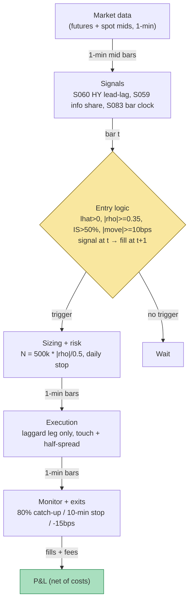

## Stage 136/200 — T036: Cross-Asset Lead-Lag (Hayashi–Yoshida)

*Batch TB4 · Strategy 36/100 · Signals S060, S059, S083 · Provenance [D/SR]*

### T1. One-line verdict

| | |
|---|---|
| **Style** | Intraday cross-asset lead-lag trading (futures lead, spot follows) |
| **Edge source** | The leader's (futures) move predicts the laggard's (spot) catch-up over the next few minutes — measured on asynchronously sampled prices with the Hayashi–Yoshida estimator, confirmed by futures–spot information share |
| **Typical holding period** | Minutes (`example`: 10-minute time stop; flat by the close — no overnight basis risk) |
| **Capacity hint** | Low — the catch-up window is minutes wide and a few basis points deep; two-sided costs of ~6 bp per round trip consume most of it |
| **Build-or-buy in one line** | Build the lead-lag estimator on bought futures + equity prints (Tier 1/2); the venue confirmation and the bar clock are yours — no vendor sells your lag |

### T2. Full mechanics

**Jargon, defined once.** *Lead-lag* = the empirical fact that one asset's price moves first and a related asset's follows after a short delay. *Hayashi–Yoshida (HY)* = a covariance estimator for *asynchronously sampled* prices (assets that print at different times) — it multiplies only returns whose time intervals *overlap*, so no artificial synchronization grid is needed. *Overlap indicator* = 1 when two assets' observation intervals intersect, 0 otherwise. *Information share* (Hasbrouck 1995) = each venue's fraction of the variance of innovations to the common efficient price — the test that futures really are the price-discovery venue before you trade the lag. *Imbalance bars* = bars that close when signed order flow accumulates past a threshold (a fixed-*information* clock, not a fixed-time clock). *Midquote* = (bid + ask)/2 — returns measured on mids avoid bid–ask bounce contamination.

**Universe & session.** One leader–laggard pair: an ES-like index future (leader) and its SPY-like spot ETF (laggard). Session: RTH (regular trading hours) 09:45–15:45 ET (`example`); flat by 15:45 — the regression is an intraday phenomenon and overnight basis risk is not this strategy's business. Exclusions: macro announcement windows (lead-lag inverts on news), roll week, and any 30-minute window where the estimated lead-lag correlation |ρ̂(ℓ̂)| falls below 0.35 (`example` — the S060 entry gate).

**Entry rule.** All quantities use the MASTER.md signal definitions. At minute-bar *t* (causal — signal at *t*, earliest fill *t+1*):

1. **HY lead-lag (S060):** compute the HY lead-lag correlation ρ̂(ℓ) over integer lags ±5 minutes on 1-minute midquote returns; ℓ̂ = argmax |ρ̂(ℓ)|. Require ℓ̂ > 0 (futures lead) and |ρ̂(ℓ̂)| ≥ 0.35 (`example`).
2. **Venue confirmation (S059):** require the futures market's trailing 20-day information share above 50% (`example`) — if spot is discovering price today, the premise is inverted and there is no trade.
3. **Trigger:** the leader's 3-minute move `|Σ r_f|` ≥ 10 bps (`example` cost filter c — the expected catch-up must clear the 6 bp round trip).
4. **Bar clock (S083):** the leader's move window is measured on *imbalance-bar* closes in the live design (fixed-information clock — you do not trade half-formed flow); the synthetic example below uses 1-minute bars as the clock and says so explicitly.

Trade the laggard at *t+1* in the leader's direction: long spot if the leader moved up, short spot if down. $500k notional per trade (`example`).

**Exit rule** — first of three fires (`example` parameters):

1. **Catch-up complete:** the laggard has moved ≥ 80% of the leader's triggering move in the trade's direction — take it; the predicted portion is consumed.
2. **Time stop:** 10 minutes after the fill — the lead-lag half-life is minutes, not hours; stale positions are just noise exposure.
3. **Stop-loss:** −15 bps against entry on the laggard — the catch-up failed and the "lead" was microstructure noise.

**Position sizing.** Fixed $500k notional per trade (`example`), scaled by |ρ̂(ℓ̂)|: `N = $500k × min(1, |ρ̂(ℓ̂)| / 0.5)` — stronger measured lead, fuller size (`example`). Max 3 concurrent laggard trades (`example`); daily loss stop −$3,000 (`example`, then dark — the lead-lag is either working today or it isn't).

**Risk limits.** Max gross $1.5mm (`example`); per-trade heat 15 bps of notional; kill-switch: futures or spot feed stale > 30 seconds (`example`), HY estimation window contaminated by a halt, or the information-share check flipping mid-session — flatten immediately. Never hold into the close; never carry the basis overnight.

**Cost model** (applied in T4): 6 bp round-trip on notional ($300 per $500k trade — 3 bp half-spread each way, `example`); no commission line item (inside the 6 bp); no borrow (intraday spot shorts in a liquid ETF are GC (general collateral) — stated as assumption, flagged if HTB (hard to borrow)).

**Order/execution sketch.** Laggard leg only (the leader is the signal, not the position): marketable limit at the touch at *t+1*. Participation cap: child ≤ 10% of visible touch depth (`example`). Queue-position honesty: fills at the touch plus half-spread; any claim of passive fills is `simulated only — requires MBO/ITCH`. The futures leg is *never* traded in this design — one leg, one fill, no leg risk.

### T3. Signals it consumes

| Signal | Role | Combination logic |
|---|---|---|
| S060 HY cross-asset lead-lag | **Primary trigger** (direction + timing) | ℓ̂ > 0, \|ρ̂(ℓ̂)\| ≥ 0.35 (`example`); trade laggard in the leader's 3-min move direction |
| S059 futures–spot lead-lag | **Confirmation filter** | futures information share > 50% (`example`) on a 20-day trail — trade the lag only when futures lead price discovery |
| S083 imbalance/tick/volume/dollar bars | **Bar clock** | leader's move window measured on imbalance-bar closes (fixed-information clock); 1-min bars in the synthetic example, stated explicitly |

```
# T036 combination logic (<=25 lines; every threshold `example`)
on each 1-min bar t (midquotes, causal; fills at t+1):
    rhos = HY_leadlag_corr(futures, spot, lags=-5..5min)  # S060
    lhat = argmax(abs(rhos)); rho = rhos[lhat]
    ish  = futures_information_share(20d)                 # S059
    move = sum(leader_returns[t-2:t+1])                   # 3-min, S083 clock
    if flat and lhat > 0 and abs(rho) >= 0.35 \
       and ish > 0.50 and abs(move) >= 0.0010:
        N = 500_000 * min(1, abs(rho)/0.5)
        trade laggard at t+1, direction = sign(move)
    if long/short:
        exit at t+1 if laggard_move >= 0.8*move \
            or age > 10 min or pnl <= -15 bps
    flat by 15:45 ET; daily loss stop -$3,000
```

### T4. Worked example — numbers + P&L (SYNTHETIC)

**All numbers synthetic** (random seed 136 = stage number, `batches/TB4/plot_T036.py` — re-runnable). 60-minute synthetic session; leader = index future, laggard = spot ETF, both rebased to 100. The script's HY grid scan found **ℓ̂ = +3 minutes, ρ̂ = 0.96** — futures lead spot by 3 minutes in this toy tape (a far cleaner lead than any real tape; the optimism paragraph says so). $500k notional per trade; 6 bp RT = $300/trade. Exits are the 10-minute time stop (`example`); 1-minute bars stand in for the S083 imbalance-bar clock.

| # | Dir | Entry min | Leader 3-min move | In | Out | Gross $ | Cost $ | Net $ | Exit reason |
|---|---|---|---|---|---|---|---|---|---|
| 1 | Long | 11 | +10.5 bps | 100.1476 | 100.1912 | +217.28 | −300.00 | **−82.72** | 10-min time stop |
| 2 | Short | 23 | −23.8 bps | 100.1698 | 100.3409 | −854.25 | −300.00 | **−1,154.25** | time stop — whipsaw |
| 3 | Long | 35 | +12.8 bps | 100.3101 | 100.4026 | +460.86 | −300.00 | **+160.86** | time stop |

Line-by-line walk. **Trade 1:** leader up 10.5 bps over minutes 9–11 → long $500k spot at minute 12's print 100.1476; the catch-up (+4.3 bps) undershoots the trigger; exit at minute 21 at 100.1912. Gross = (100.1912 − 100.1476)/100.1476 × $500k = **+$217.28**; minus $300 costs → **net −$82.72**. **Trade 2:** leader down 23.8 bps → short at 100.1698; spot *rallies* 17.1 bps against the short (the leader's move was noise, not information); gross **−$854.25**, net **−$1,154.25**. **Trade 3:** leader up 12.8 bps → long at 100.3101, exit 100.4026 (+9.2 bps catch-up); gross **+$460.86**, net **+$160.86**.

Totals: gross **−$176.11**, costs −$900.00, **net −$1,076.11** over 3 trades. The chart `images/T036_example.png` plots the leader/laggard paths with entry/exit markers (top) and the step-wise cumulative net P&L with per-trade annotations (bottom) — the same numbers.

**Where the example is optimistic.** (1) ρ̂ = 0.96 with a crisp 3-minute lead is a laboratory artifact — real HY lead-lag correlations on minute bars are an order of magnitude noisier and the estimated ℓ̂ wobbles, which is exactly why the S060 chapter's ρ_min gate exists. (2) The example *still* loses money net of costs despite the perfect lead: the lesson is that a 10 bp trigger against 6 bp costs leaves almost no room for the catch-up to undershoot, and trade 2 shows the failure mode — the leader's move was noise, the laggard never followed. (3) Fills assumed at the *t+1* print with no wire latency; on a home-Mac SIP (Securities Information Processor) feed the laggard's print arrives after the catch-up has started, which this arithmetic ignores. (4) One leader–laggard pair, one session, no news windows — the live design's information-share check would have vetoed portions of most real days.

### T5. Data & infra — what must run

**Pipeline inventory.** Continuous RTH: futures + spot midquote prints with exchange timestamps into synchronized 1-minute bars (or imbalance bars in the live design); HY grid scan every 5 minutes (`example`) on a trailing 1-session window; information-share estimate nightly. Pre-open: venue-status check (both feeds live, timestamps sane); post-close: lead-lag diagnostics (ℓ̂ stability, ρ̂ distribution) and the day's P&L-vs-signal attribution.

**M5 Max feasibility: feasible.** Per `notes/cost-model.md` §2: the HY scan is a two-pointer O(n+m) sweep per lag (S060) — ~11 lags × tens of thousands of prints, milliseconds in numpy; the information-share VAR (vector autoregression) is a nightly OLS (ordinary least squares). RAM: minutes of two series — trivial, far under the 77 GB budget. Engineering time: Tier M (`cost-model.md` §5) — **20–60 h** ≈ $3,000–9,000 loaded-cost estimate at $150/hr; the timestamp-alignment and bar-clock correctness are the bulk of the work, not the estimator. Bottleneck: feed timestamp quality (exchange vs SIP), not compute — garbage timestamps manufacture fake leads.

**Feed-outage safe mode.** Either leg stale > 30 seconds (`example`): **flatten immediately, freeze new entries** — a one-sided print makes the "laggard" look like it is lagging when it is merely frozen, which is the most expensive false signal in this book. Re-arm only after both feeds show clean sequence numbers for 60 seconds (`example`) and the HY scan is recomputed from the post-outage window (never splice across the gap). If only SIP remains (direct feeds down): T036 is **off** — minute-bar lead-lag on SIP timestamps is `simulated only — requires MBO/ITCH`-class honesty; label it as such or don't run it.

### T6. Buy vs build

| Option | What you get | Indicative price | Gains | Loses |
|---|---|---|---|---|
| Tier 0: delayed quotes (both legs) | free prints | ~$0 — *indicative — verify before budgeting* | $0 prototype | delay destroys a minutes-wide edge — research only |
| Tier 1: Polygon Stocks Advanced + broker futures | real-time SIP + futures prints | ~$30–200/mo — *indicative — verify before budgeting* | live bars for the scan | SIP timestamps; the lead you measure may be the feed's, not the market's |
| Tier 2: Databento (equities + futures) | exchange-timestamped prints | ~$200/mo + usage — *indicative — verify before budgeting* | honest asynchrony — the HY estimator's actual input | the surprise bill is always licensing, even for paper |
| Retail platform (QuantConnect-style) | paper host + data | ~$60–300/mo tiers — *indicative — verify before budgeting* | fast paper ledger | bar-clock and timestamp subtleties are DIY |
| Co-located/professional | direct feeds, microsecond stamps | institutional $$$$ — *indicative — verify before budgeting* | the real lead-lag game | not a ≤$1M-paper-account conversation |

**Verdict: buy the feed, build the estimator.** The HY scan, the information-share check, and the bar clock are a few hundred lines on data you already hold for S059/S060; no vendor sells your lag grid or your ρ gate. **Buy** Tier 1 minimum for anything beyond research — delayed data cannot implement a minutes-wide edge — and Tier 2 the moment you want the timestamps to be honest. **Never buy** a "lead-lag signal" product: if you can't audit its t→t+1 causality, it's a story, not a signal. Crossover: stay on Tier 1 SIP while you validate that the measured lead survives the information-share confirmation; the day it doesn't, the strategy is off regardless of feed tier.

### T7. Success-ratio evidence

The literature documents the *phenomenon* robustly and the *after-cost P&L* barely at all.

| Source | Market & period | Metric | Before/after cost | Caveat |
|---|---|---|---|---|
| Chan (1992), *Review of Financial Studies* (verified) | S&P 500 futures vs cash | futures lead cash by several minutes; cash rarely leads | before cost (prediction) | the classic lead-lag documentation — direction, not tradability |
| Hasbrouck (1995), *Journal of Finance* (verified) | one security, many markets | information-share attribution of price discovery across venues | n/a (attribution) | supports the S059 confirmation step, not a return claim |
| This chapter's T4 | synthetic | net −$1,076 on 3 trades | after modeled costs | **synthetic — not evidence**; included because a losing toy day is the honest shape of a costs-vs-catch-up sleeve |

**Capacity.** The catch-up is a few basis points over minutes on one of the world's most watched pairs — the capacity of the *honest* version (ρ-gated, info-share-confirmed, cost-filtered) is a handful of trades a day at $500k–$2mm notional before your own laggard-leg fills start eating the move. **Crowding** is structural here: every index-arb desk, ETF market-maker, and statistical-arbitrage book leans on the same futures→spot transmission, which is why the measured lead keeps compressing toward the latency floor. **Decay:** no cited source in this chapter establishes how far the documented minutes-scale lead (Chan 1992's 1980s–90s sample) has compressed on modern infrastructure — the "minutes→seconds-and-below" claim is unverified. Likewise, the suggestion that what remains at minute-bar resolution is a *volatility* lead rather than a *price* lead has no cited source; both claims are hypotheses, moved to Unverified leads.

**Honest bottom line.** For a ≤$1M paper operation, T036 is a research strategy with an expensive lesson attached: the phenomenon is real, the documented predictability is real, and the after-cost P&L at retail latency is usually negative — exactly what the T4's −$1,076 day shows. Its institutional home is inside an ETF market-making or index-arb desk where the laggard leg is filled passively as inventory, not taken aggressively at the touch. Run it on paper to learn lead-lag measurement; do not expect it to pay for its data.

### T8. Failure modes

1. **Noise, not information.** Most leader moves are microstructure noise; the laggard correctly ignores them and you pay 6 bp to learn that. Mitigation: the ρ̂ ≥ 0.35 gate and the 10 bp trigger are structural; size by |ρ̂|, never flat.
2. **Inverted price discovery.** On news, spot (or the ETF's own flow) leads and futures follow — the strategy then fades the leader. Mitigation: the S059 information-share check; no trade when futures' share < 50%.
3. **Latency illusion on SIP.** Your laggard print arrives after the catch-up; the backtest fills at a price that no longer exists. Mitigation: add measured wire latency to the cost model; label SIP work `simulated only — requires MBO/ITCH` for anything faster than minutes.
4. **Timestamp garbage.** Bad clock sync manufactures fake leads and fake lags symmetrically. Mitigation: exchange timestamps only; clock-skew monitor vs NTP (Network Time Protocol); kill-switch on skew > 50 ms (`example`).
5. **Whipsaw clustering.** Failed catch-ups cluster (trade 2's −$1,154 day) because the same noise regime produces repeated triggers. Mitigation: daily loss stop −$3,000 (`example`) then dark; max 3 concurrent trades.
6. **Bar-clock mismatch.** Measuring the leader's move on clock bars while the market trades on information flow means entering on half-formed moves. Mitigation: the S083 imbalance-bar clock in the live design; the 1-minute substitution is labeled wherever it appears.
7. **Overnight/session gaps.** The regression is intraday; the open's gap is a different phenomenon. Mitigation: flat by 15:45 ET, no exceptions; the first 15 minutes are excluded from estimation.

### T9. Visuals




### T10. Sources

1. Hayashi, T. & Yoshida, N. (2005). "On covariance estimation of non-synchronously observed diffusion processes." *Bernoulli* 11(3): 359–379 — https://doi.org/10.3150/bj/1116340299 (the HY estimator — the verified [D] source for S060's overlap-based covariance).
2. Chan, K. (1992). "A further analysis of the lead-lag relationship between the cash market and stock index futures market." *Review of Financial Studies* 5(1): 123–152 — http://ideas.repec.org/a/oup/rfinst/v5y1992i1p123-52.html (the classic futures-lead documentation).
3. Hasbrouck, J. (1995). "One Security, Many Markets: Determining the Contributions to Price Discovery." *Journal of Finance* 50(4): 1175–1199 — https://www.jstor.org/stable/2329487 (information share — the verified source for the S059 venue-confirmation step).

**Source log.** Grok answered Q-TB4-1..3 (2026-09-10); all claims independently verified or labeled unverified.

**Unverified leads** (chatbot-only — never in Sources):
- Grok Q-TB4-1 (B): Kalman/imbalance-bar worked-example arithmetic (the truncated day-7 cell, per-trade P&L without intermediate steps) — captured as rendered; not reused.
- Grok Q-TB4-3: "Baskaran (SSRN 2026)" Kalman-vs-static walk-forward numbers — dated after the current date; citation plausibility unverified; not used.
- Grok Q-TB4-2: retail/platform and data-vendor pricing bands — `indicative — verify before budgeting`.
- No chatbot profitability claim for the futures→spot lead-lag sleeve was captured; the chapter therefore makes none — the T4's negative net day stands as the honest illustration.
- The "minutes→seconds-and-below" compression claim and the "volatility lead rather than price lead" suggestion (moved out of the T7 Decay paragraph): no cited source in this chapter establishes either; held here as hypotheses pending verification.
