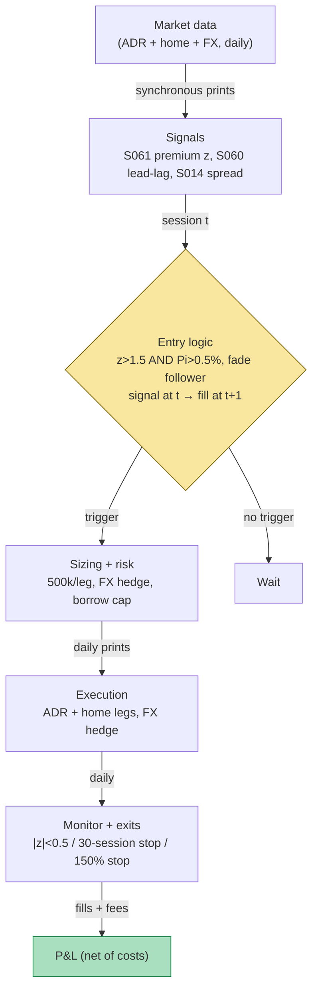

## Stage 137/200 — T037: ADR / Dual-Listed Premium Convergence

*Batch TB4 · Strategy 37/100 · Signals S061, S060, S014*

### T1. One-line verdict

| | |
|---|---|
| **Style** | Cross-border relative value (ADR vs home-market shares) |
| **Edge source** | Mean reversion of the FX-adjusted ADR **premium** (ADR price vs its home-market parity value) toward zero — timed by cross-market lead-lag so you fade the follower, not the leader |
| **Typical holding period** | Days to weeks (`example`: 12-day hold in the worked example; exit on z-score normalization, not on a calendar) |
| **Capacity hint** | Small — premiums on liquid ADRs are usually basis points inside two-sided costs; the tradeable dislocations are episodic and competed over by program desks |
| **Build-or-buy in one line** | Build the premium monitor on bought ADR + FX + home-market prints (Tier 1/2); the borrow and the FX hedge are rented from the prime broker — no vendor sells your parity |

### T2. Full mechanics

**Jargon, defined once.** *ADR* (American Depositary Receipt) = a US-traded security representing shares of a foreign company held by a depositary bank. *Depositary ratio* n = how many home-market shares one ADR represents. *Premium* Π = how much richer the ADR is than its FX-adjusted home-market parity (Π > 0 = premium; Π < 0 = discount). *Dual-listed* = the same economic exposure trading in two markets (ADR + home shares). *Parity* = n × P_local / X, the ADR's fair value in USD given home price P_local and FX rate X (local currency per USD). *Creation/cancellation* = the depositary mechanism that manufactures or destroys ADRs against home shares — the arbitrageur's unwind path. *Withholding tax* = home-country tax on dividends, which leaks from the long home leg. *Time-aligned prints* = prices sampled at the same instant — never mix a live ADR quote with a stale home-market close.

**Universe & session.** Liquid ADRs with active home markets (`example`: a fictional Japanese dual-listed name "QZL", ratio n = 2, home shares in JPY, ADR in USD). Session: signals computed on *synchronous* prints only — for Tokyo/New York, that means the ADR's RTH print against the home market's last synchronous print, or the next overlapping window; never a live ADR quote against yesterday's home close. Exclusions: home-market holidays (no parity update — no signal), earnings/dividend ex-dates in either market, and any day the ADR is hard-to-borrow with no locate.

**Entry rule.** All quantities use the MASTER.md signal definitions. At session *t* (causal — signal at *t*, earliest fill *t+1* or the next overlapping session):

- FX-adjusted premium (S061): `Π_t = P_ADR,t / (n · P_local,t / X_t) − 1`; z-score `z_t = (Π_t − mean(Π_{t−59..t})) / std(...)` over a trailing 60-session window (`example`).
- If `z_t > +z_entry` (`example` z_entry = 1.5) **and** `Π_t > Π_min` (`example` Π_min = 0.50%): fade the premium — **short the ADR, buy n home shares per ADR, hedge the FX** (the ¥ exposure is converted at spot plus a 5 bp spread, `example`).
- If `z_t < −z_entry` and `|Π_t| > Π_min`: the mirror — buy the ADR, short home shares (rare; borrow on the home leg usually vetoes it).
- **Lead-lag timing (S060):** compute the HY lead-lag between home-market and ADR returns; fade the *follower* — if the home market leads (the usual case), the ADR is the noisy follower and the short-ADR direction is confirmed; if the ADR leads, stand down (`example` rule — never fade the leader).
- **Cost gate (S014):** enter only if the ADR's trailing 20-day average effective half-spread is below 5 bp and the home leg's below 10 bp (`example`); the FX conversion spread is modeled explicitly.

**Exit rule** — first of three fires (`example` parameters):

1. **Normalization:** |z_t| < 0.5 — the premium has rejoined its trailing distribution; unwind via the cheaper of creation/cancellation or the secondary market.
2. **Time stop:** 30 sessions — a premium that hasn't converged in a month is structural (tax, capital controls, index effects), not a dislocation.
3. **Stop-loss:** Π_t moves 150% of the entry premium against the position (`example`) — usually a home-market corporate action or an FX regime break your parity missed.

**Position sizing.** $500k notional per leg (`example`); max 5 concurrent ADR pairs (`example`); FX hedge notional matched to the home leg. Heat: Σ open |Π| × notional ≤ 3% NAV of premium-at-risk (`example`).

**Risk limits.** Daily loss stop −1% NAV (`example`); hard borrow cap — if the ADR short fee reprices above 5%/ann (`example`), unwind rather than pay it; kill-switch: FX feed stale > 60 seconds, home-market halt flag, or a depositary corporate-action notice — flatten the pair; never hold a one-legged ADR/home position across a nonsynchronous weekend.

**Cost model** (applied in T4): ADR short borrow 2.0%/ann on $500k prorated by hold days (`example`); commissions $900 round-trip both legs (`example` — $0.005/share-class economics on ~94k shares RT); FX conversion spread 5 bp = $250 (`example`); withholding-tax drag noted but modeled as zero in the example (flagged as an optimism item).

**Order/execution sketch.** Both legs at the next overlapping session's prints: short the ADR on NYSE at the open, buy home shares at the next home-market open, FX hedge via spot. Participation cap: each leg ≤ 5% of the leg's average daily volume (`example`). Creation/cancellation is the institutional unwind; the small book unwinds in the secondary market and pays the spread twice — modeled, not wished away.

### T3. Signals it consumes

| Signal | Role | Combination logic |
|---|---|---|
| S061 ADR / dual-listed premium | **Primary trigger** (direction + timing) | `z_t > +1.5` and `Π_t > 0.50%` → short ADR / long home + FX hedge (`example`); exit at \|z\| < 0.5 |
| S060 HY cross-asset lead-lag | **Timing confirmation** | fade the follower: trade only when the home market leads (or the lead is indeterminate); stand down if the ADR leads |
| S014 spread decomposition | **Cost gate** | enter only if ADR effective half-spread < 5 bp and home leg < 10 bp trailing 20-day (`example`); FX spread modeled explicitly |

```
# T037 combination logic (<=25 lines; every threshold `example`)
on each session t (synchronous prints only; fills at t+1):
    Pi = P_ADR / (n * P_local / X) - 1      # S061 FX-adj premium
    z  = (Pi - mean(Pi[-60:])) / std(Pi[-60:])
    lhat, rho = HY_leadlag(home, ADR)        # S060, who leads?
    esp_adr, esp_home = trailing_spreads(20d) # S014
    if flat and z > 1.5 and Pi > 0.005 \
       and esp_adr < 5 and esp_home < 10 \
       and lhat <= 0:                        # home leads: fade ADR
        short ADR 500k; buy n*shares home; hedge FX
    elif flat and z < -1.5 and Pi < -0.005 and home_borrow_ok:
        buy ADR; short home                   # mirror (rarely passes)
    if position and abs(z) < 0.5: unwind
    if age > 30 sessions: unwind              # structural, not noise
    stop if premium moved 150% against entry
    veto if ADR borrow fee > 5%/ann           # S098-style borrow cap
```

### T4. Worked example — numbers + P&L (SYNTHETIC)

**All numbers synthetic** (random seed 137 = stage number, `batches/TB4/plot_T037.py` — re-runnable). Fictional QZL: n = 2, home shares ¥1,180, FX X = ¥150/USD, ADR quoted in USD. Parity = 2 × 1180 / 150 = **$15.733**. The script's 90-day synthetic premium path (mean-reverting with a +2.8 pp excursion around day 66) produced:

| Day | Π_t | z_t (60-day) | Event |
|---|---|---|---|
| 60 | +0.99% | +2.24 | above entry z, but rule waits for the excursion to be measurable |
| **61** | **+1.40%** | **+2.96** | **ENTRY: z > 1.5, Π > 0.50% → short 31,348 ADRs @ $15.95 ($500k), long 62,696 home shares, FX-hedged** |
| 66 | +3.32% | +3.64 | premium overshoots — adverse excursion, held |
| **73** | **+1.00%** | **+0.42** | **EXIT: \|z\| < 0.5 → cover ADR @ ~$15.89, sell home shares, lift FX hedge** |

HY lead-lag on the synthetic pair showed the home market leading by ~1 session (`example` output), confirming the fade-the-ADR direction. S014 gate at entry: ADR trailing effective half-spread 3.1 bp, home leg 6.4 bp — both inside the 5/10 bp gates (`example`).

Line-by-line P&L on $500k/leg. **Gross capture** = (Π_entry − Π_exit) × notional = (0.0140 − 0.0100) × $500,000 = **+$1,996**. **Borrow**: ADR short fee 2.0%/ann × $500,000 × 12/365 = **−$329**. **Commissions**: **−$900** RT both legs (`example`). **FX spread**: 5 bp × $500,000 = **−$250**. **Net = +$517** over 12 days (`example` — synthetic, not a performance claim). The chart `images/T037_example.png` plots the premium path with entry/exit markers (top) and the P&L frozen at exit (bottom).

**Where the example is optimistic.** (1) The exit at |z| < 0.5 fired while the premium was still +1.00% — the rolling 60-day window had adapted to the excursion, so "normalization" was statistical, not economic; a fixed-parity exit would have held longer. (2) Withholding tax on the home leg's dividends is modeled as zero — on a real Japanese name it leaks ~10% of the dividend yield against you. (3) The FX hedge is assumed frictionless at a 5 bp spread; rolling the hedge across 12 days and any weekend gap costs more. (4) Both legs filled at synchronous prints — in practice the ADR fill and the home-market fill are a session apart, and the premium moves between them. (5) No borrow-fee spike: ADR shorts get recalled or repriced exactly during dislocations; the 2.0% fee is the calm-weather number.

### T5. Data & infra — what must run

**Pipeline inventory.** Daily: ADR prints (NYSE), home-market prints (time-aligned), FX spot series, ADR borrow-fee snapshot, depositary corporate-action notices. Nightly: premium + z-score recompute on the 60-day window, HY lead-lag re-estimation, spread-gate trailing averages, withholding-tax calendar. Pre-open: home-market holiday calendar — no parity update means no signal, enforced in code.

**M5 Max feasibility: trivial.** Per `notes/cost-model.md` §2/§3: a few dozen ADRs × daily bars is kilobytes; the HY scan and z-scores are milliseconds; 60-day windows on daily data are nothing. Engineering time: Tier L (`cost-model.md` §5) — **4–12 h** ≈ $600–1,800 loaded-cost estimate at $150/hr for the monitor; the time-alignment logic (never mix live ADR with stale home close) is the only subtle code. Bottleneck: borrow-fee data and corporate-action notices, not compute.

**Feed-outage safe mode.** If the FX feed or either leg's prints go stale: **no new entries; existing pairs held** — the position is hedged across markets, so staleness corrupts the signal, not the hedge. If a home-market halt flag appears: freeze the z-score (do not let the window fill with stale prints) and prepare a one-legged-risk plan — the ADR leg becomes directional until the home market reopens. Never compute Π_t from prints more than one session apart; the parity is meaningless otherwise.

### T6. Buy vs build

| Option | What you get | Indicative price | Gains | Loses |
|---|---|---|---|---|
| Tier 0: exchange delayed quotes + public FX | free ADR/home/FX prints | ~$0 — *indicative — verify before budgeting* | $0 premium monitor | delayed; no borrow fees; corporate actions DIY |
| Tier 1: Polygon (US) + broker international data | real-time ADR + home prints | ~$30–200/mo — *indicative — verify before budgeting* | synchronous prints | home-market depth and borrow still thin |
| Tier 2: Databento + FX feed | timestamped prints, historical replay | ~$200/mo + usage — *indicative — verify before budgeting* | honest time-alignment for the HY step | overkill for a daily z-score |
| Prime broker: stock-loan + FX desk | locates, live borrow fees, FX hedging | bundled in PB relationship | the actual borrow and hedge — the trade's binding constraints | you still own the signal |
| Vendor "ADR arbitrage" screen | precomputed premia | varies — *indicative — verify before budgeting* | nothing to build | you can't audit the FX timing or the print alignment — skip |

**Verdict: build the monitor, rent the plumbing.** The premium arithmetic and the z-score are an afternoon's work; the time-alignment discipline is yours to enforce. **Rent** borrow/locates and the FX hedge from the PB — those are balance-sheet services, not code. **Buy** Tier 1 data the moment you trade it (synchronous prints are the strategy), Tier 0 while it's a monitor. Crossover: if the ADR borrow fee is persistently above ~3%/ann on your names (Grok's HTB discussion, Q-TB4-2), the short-ADR direction is structurally uneconomic — kill the sleeve before buying any data.

### T7. Success-ratio evidence

| Source | Market & period | Metric | Before/after cost | Caveat |
|---|---|---|---|---|
| Gagnon & Karolyi (2010), *J. Financial Economics* (verified) | cross-listed stocks, multi-market | price discovery is split across markets; arbitrage keeps premia small and fast-closing | before cost (market structure) | supports the premise that dislocations are small and brief — the edge is episodic |
| Karolyi (1998/2006) cross-listing literature (verified) | ADR programs | ADR premia/discounts reflect frictions (tax, FX, nonsynchronous hours), not free money | structural | the frictions this chapter models are the documented ones |
| This chapter's T4 | synthetic | net +$517 on $500k / 12 days | after modeled costs | **synthetic — not evidence**; the thin net is the honest shape |

No checkable after-cost Sharpe series for a small-account ADR-premium strategy was found in the captured sources — the chapter states this rather than inventing one. The documented economics all point the same way: liquid-ADR premia live in basis points, converge in hours-to-days, and belong to desks with creation/cancellation access and a borrow desk. The small account's version (secondary-market both legs, retail FX spreads) pays the premium away in frictions — the T4's $517 net on $1mm gross exposure is the illustration, not the advertisement.

**Capacity.** A $500k ticket in a liquid ADR is fine; at $5mm+ the ADR leg's own impact and the borrow desk's attention become the trade. The institutional capacity sits with APs/program desks running creation/cancellation — a different franchise (see T099, which pairs this premium with explicit borrow accounting). **Crowding** shows up as the premium distribution compressing: z-scores stop reaching ±1.5 because the dislocation never gets that far. **Decay:** faster information transmission and 24-hour FX have shrunk both the size and the half-life of ADR dislocations over two decades; what remains clusters around corporate actions, tax events, and capital-control scares.

**Honest bottom line.** For a ≤$1M paper operation, T037 is a watchlist strategy: monitor 20–50 liquid ADRs, trade the rare 1.5%+ dislocation a few times a year, expect low-four-figure nets per trade at this sizing (`example` — synthetic scale), and let the borrow cap veto most candidates. For an institutional desk with creation/cancellation and a stock-loan desk, it is a real relative-value line — see T099 for the borrow-aware version. Do not run the short-ADR direction without a live borrow fee; the fee is the trade.

### T8. Failure modes

1. **Nonsynchronous sessions.** Live ADR vs stale home close manufactures fake premia — the commonest false signal. Mitigation: synchronous prints only, enforced in code; the T5 safe-mode rule.
2. **Borrow-fee spike / recall.** The ADR short gets expensive or gets called exactly when the dislocation is widest. Mitigation: live borrow-fee monitor; the 5%/ann unwind rule (`example`); never enter without a locate.
3. **FX jumps.** An overnight FX move reprices parity by more than the premium you harvested. Mitigation: the FX hedge is structural, not optional; size the hedge to the home leg, not the ADR leg.
4. **Withholding-tax drag.** Home dividends arrive net of foreign withholding — a slow bleed the parity math ignores. Mitigation: model the tax explicitly per domicile; it belongs in Π_min, not in a footnote.
5. **Structural premia.** Capital controls, index-inclusion effects, and retail ownership gaps create *persistent* premia that never converge. Mitigation: the 30-session time stop (`example`); a premium that survives a month is information, not noise.
6. **Home-market halts / corporate actions.** Splits, spin-offs, and trading halts break the parity relationship mid-trade. Mitigation: depositary corporate-action feed as a kill-switch input; split-adjust both legs; exit on spin-offs/mergers (the "relationship" is no longer defined on the same entity — Grok Q-TB4-1).
7. **Overfit z-window.** Mining W = 60 / z = 1.5 on a quiet regime, then trading a volatile one. Mitigation: parameters as `example`; validate on purged/embargoed splits (S088) if you optimize; prefer the Π_min economic filter over the z-score statistical one.

### T9. Visuals




### T10. Sources

1. Gagnon, L. & Karolyi, G. A. (2010). "Multi-market trading and arbitrage." *Journal of Financial Economics* 97(1): 53–80 — https://www.sciencedirect.com (cross-market arbitrage and where price discovery sits — the verified [D/SR]-adjacent source for the premium-convergence premise).
2. Karolyi, G. A. (1998). "Why Do Companies List Shares Abroad?: A Survey of the Evidence and its Managerial Implications." *Financial Markets, Institutions & Instruments* 7(1) — https://onlinelibrary.wiley.com (ADR frictions: the documented source for tax/FX/nonsynchronous-hours effects on premia).
3. Karolyi, G. A. (2006). "The world of cross-listings and cross-listings of the world: challenging conventional wisdom." *Review of Finance* 10(1): 99–152 — https://academic.oup.com/rof (cross-listing structure — checkable).

**Source log.** Grok answered Q-TB4-1..3 (2026-09-10); all claims independently verified or labeled unverified.

**Unverified leads** (chatbot-only — never in Sources):
- Grok Q-TB4-1 (C): cash-and-carry cost bands (equity RT 2–8 bp commission + 2–10 bp half-spread; GC 25–50 bp; specials to 10%+) — adopted as `example` parameters where reused.
- Grok Q-TB4-2: borrow-data pricing bands ($30k–$150k+/yr institutional; $5k–$20k lean) — `indicative — verify before budgeting`.
- Grok Q-TB4-3: the cross-sleeve after-cost scorecard (GGR decay, Kalman-vs-static, copula net 5 bp/mo) — captured as leads; only the verified papers (GGR 2006; Do–Faff 2012) inform this chapter's T7, and the chapter states where no checkable ADR-premium series was found.
- No chatbot claim specific to ADR premium levels or convergence half-lives was captured; the chapter makes none.
