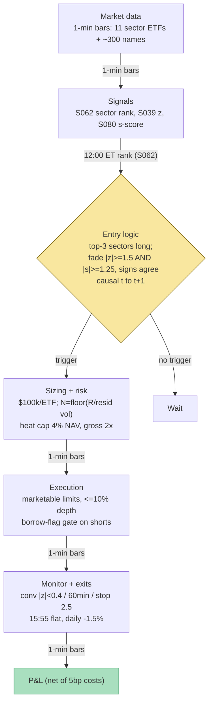

## Stage 138/200 — T038: Sector Momentum + Idiosyncratic Fade

*Batch TB4 · Strategy 38/100 · Signals S062, S039, S080*

### T1. One-line verdict

| | |
|---|---|
| **Style** | Intraday cross-sectional long/short: trend overlay on sectors plus mean-reversion on idiosyncratic stock residuals |
| **Edge source** | Two different, documented effects stacked so they don't cancel: intraday sector continuation (S062 — morning-winning sectors keep drifting into the close) and short-horizon reversal of stock-specific (idiosyncratic) residuals (S039/S080 — the part of a stock's move that neither the market nor its sector explains snaps back) |
| **Typical holding period** | Momentum sleeve: ~4 hours (12:00 → 15:55 ET, flat before the close); fade sleeve: 15 minutes–2 hours per residual |
| **Capacity hint** | Sector-ETF sleeve: high (you trade 3 liquid ETFs); residual-fade sleeve: tens of millions of $ before the fade names' spreads eat you — capacity is the fade sleeve, not the momentum sleeve |
| **Build-or-buy in one line** | Build the ranker and the residual engine on cheap intraday bars; buy nothing except the bar feed — the IP is in the causality hygiene (S088), not the data |

### T2. Full mechanics

**Jargon first.** A *sector ETF* is an exchange-traded fund tracking one industry group (e.g. XLK = technology, XLE = energy). *Sector (industry) momentum* is the tendency for the best-performing industries to keep outperforming over the next period. *Idiosyncratic* means stock-specific: the part of a return not explained by the market or sector. A *residual* is the leftover after a model is fitted (r = model + residual). *Beta (β)* measures a stock's sensitivity to the market (β = 1 moves one-for-one). A *z-score* is (value − mean)/standard deviation — how many standard deviations an observation sits from average. An *eigenportfolio* is a portfolio whose weights come from a *principal component analysis (PCA)* of returns — it is one "statistical factor" distilled from the data. *Heat* is the portfolio's total open risk. *Dollar-neutral* means long $ equal short $. *RTH* = regular trading hours (09:30–16:00 ET).

**Universe & session.** Sleeve A: 11 US sector ETFs (XLK, XLF, XLE, …), RTH only, 20-day median spread ≤ 4 bps (*example*). Sleeve B: ~300 S&P-500-class names, price ≥ $10, 20-day ADV ≥ $10M, borrowable, spread ≤ 10 bps (*example*); exclude earnings-day names, halts, corporate actions. Session 09:30–16:00 ET; everything flat by 15:55 ET — no overnight carry.

**Entry rule.** *Sleeve A — sector momentum (S062, intraday adaptation).* At t_r = 12:00 ET (*example*), rank sector ETFs by open→t_r return; **long the top 3 in equal dollar weight** (*example*), holding from the first bar after t_r to 15:55 ET. The documented literature form (S062) is monthly — rank 20 industries by 6-month return, long top 3 / short bottom 3; the intraday adaptation is the paper-trade version: long-only ETF legs, no short-borrow needed. *Causal timing:* ranking uses returns through t_r only; earliest fill the bar after t_r.

*Sleeve B — idiosyncratic fade (S039 + S080 confirmation).* Per stock i at bar t: r(i,t) = α(i) + β_m(i)·r_mkt(t) + β_s(i)·r_sec(t) + u(i,t); cumulate U(i,t,L) = Σ û over L = 30 min (*example*), z(i,t) = U/(σ̂·√L) (S039, sector-augmented variant 2); independently compute the PCA eigenportfolio s-score s(i,t) (S080). **Enter only when both agree**: |z| ≥ 1.5 (*example*) AND sign(s) = sign(U) with |s| ≥ 1.25 (*example*) — long negative-residual names, short positive ones. The two-model confirmation exists because factor-model miss is the documented killer of residual books (S039's sector term and S080's statistical factors catch different misses).
*Causal timing:* β̂ on data ≤ t−1; signals at bar t use bars ≤ t; earliest fill t+1; total-return bars only.

**Exit rule.** Sleeve A: time stop 15:55 ET flat — no signal exit; momentum sleeves are notorious for giving back the drift in the last 5 minutes. Sleeve B (first wins): (1) signal convergence — |z| < 0.4 (*example*); (2) time stop — 60 min (*example*); (3) stop-loss — |z| ≥ 2.5 (*example*) or the two models disagree after entry (one model's z crosses 0 while the other's is still stretched); (4) session end 15:55 flat.

**Position sizing.** Sleeve A: total sleeve notional $300k (*example*) → $100k per ETF on a $1M paper book. Sleeve B: per-residual risk R = $200 (*example*): N_i = ⌊R / (σ̂_u,i · √H̄)⌋ with H̄ = 60-min residual move; cap $25k per name and 40 open residual names (*example*). Portfolio heat: Σ open |z_i|·$risk ≤ 4% of NAV (*example*, Grok's shared heat convention for residual books); gross book ≤ 2× NAV; net sleeve-A bias acknowledged (momentum sleeve is long-only — the book is *not* dollar-neutral overall, by design).

**Risk limits** (*example* unless noted). Daily loss stop −1.5% of NAV; per-sleeve stop −1.0%; kill switch: halt new fades after 3 consecutive stop-outs (the residual model is broken that day); halt the momentum sleeve on intraday-reversal regime days (a documented momentum-failure regime — see T7); feed outage ⇒ safe mode (T5).

**Cost model.** 5 bp one-way on notional per equity leg turn (*example*, the TB4 shared convention from Q-TB4-1; labeled lead), 5 bp one-way on ETF legs; half-spread in fill prices; no financing (intraday, flat by close), no borrow on longs; short-residual names need a borrow flag — skip non-borrowable names rather than pay a special. Applied explicitly in T4.

**Order/execution sketch.** Sleeve A at 12:00: marketable limits on 3 ETF legs, participation ≤ 10% of visible depth (*example*), all-or-nothing intent. Sleeve B: limit orders at the touch, participation ≤ 10%; a leg unfilled in 2 min (*example*) ⇒ cancel — never chase a converged residual. Queue-position honesty: on SIP/L1 fills this is `simulated only — requires MBO/ITCH`; the 5 bp cost carries the realism, not a queue model. Backtests: signal at t ⇒ fill at t+1, purged/embargoed validation (S088) on parameter choices.

### T3. Signals it consumes

| Signal | Role | Weight / logic |
|---|---|---|
| S062 — Sector momentum | **Primary trigger (sleeve A)** | Long top-3 sector ETFs by open→12:00 ET return (*example* thresholds: top k=3 of 11, t_r=12:00) |
| S039 — Idiosyncratic residual reversal | **Primary trigger (sleeve B)** | Enter only if \|z(i,t)\| ≥ 1.5 with L=30 min, sector-augmented model (*examples*) |
| S080 — PCA eigenportfolio residual | **Confirmation filter (sleeve B)** | Enter only if sign(s)=sign(U) and \|s\| ≥ 1.25 (*example*); disagreement = veto |

```pseudocode
# T038 combination logic — causal: data <= t, fills at t+1
# --- Sleeve A: sector momentum (once per day) ---
if bar_time == t_r:  # 12:00 ET (example)
    rank = sort(sector_etfs, key=open_to_tr(t), desc=True)
    longs = top_k(rank, 3)                                # S062 intraday adaptation (example)
    submit longs, equal dollar, flatten at 15:55
# --- Sleeve B: idiosyncratic fade (every bar t, 12:00-15:30) ---
for i in universe:
    U, z = s039_residual(i, t, L=30min)                   # market + sector model
    s    = s080_sscore(i, t)                              # PCA eigenportfolio s-score
    if position[i] is None and sign(z) == sign(s) \
       and abs(z) >= 1.5 and abs(s) >= 1.25 \             # example thresholds
       and borrowable(i) and not earnings_day(i):
        N = floor(R / (resid_vol(i) * sqrt(60min)))       # R = $200 (example)
        enter long if z < 0 else short, at bar t+1
    elif position[i] is not None:
        if abs(z) < 0.4 or held >= 60min or abs(z) >= 2.5 or sign(z) != sign(s):
            exit at next bar                              # convergence / time / stop
```

### T4. Worked example — numbers + P&L (SYNTHETIC)

All prices synthetic, **seed 138** (`rng = np.random.default_rng(138)`; regenerable via `python3 batches/TB4/plot_T038.py`). The chart in T9 plots these exact trades. Costs: 5 bp one-way on notional per leg turn (*example*).

**Trade T1 — sector-momentum sleeve (winner).** 12:00 ET ranking: XLK +1.4%, XLE +1.1%, XLU +0.9% (top 3, *example*); the book's XLK leg: long **800 XLK @ 100.00**, exit 15:55 @ **100.28**.

| Line | Calc | $ |
|---|---|---|
| Gross | 800 × (100.28 − 100.00) | +224.00 |
| Costs 5 bp: open 80,000 × 0.0005 + close 80,224 × 0.0005 | | −80.11 |
| **Net T1** | | **+143.89** |

**Trade T2 — idiosyncratic fade (winner).** AAA: z = −1.6 (≥ 1.5 ✓), s = −1.5 (sign agrees ✓): long **500 AAA @ 50.00** → exit @ **50.18** as z decays to −0.2 (+90.00). BBB: z = +1.9: short **300 BBB @ 80.00** → cover @ **79.90** (+30.00). Gross +120.00; costs (25,000+25,090+24,000+23,970)×0.0005 = −49.03; **net +70.97**. Cumulative: +214.86.

**Trade T3 — idiosyncratic fade (stop).** CCC: z = −1.7, s = −1.5 (agree ✓): long **400 CCC @ 60.00**; DDD: z = +1.8: short **250 DDD @ 90.00**. The residuals *widen* (|z| hits 2.8): stop at |z| ≥ 2.5 — sell CCC @ **59.88** (−48.00), cover DDD @ **90.14** (−35.00). Gross −83.00; costs (24,000+23,952+22,500+22,535)×0.0005 = −46.49; **net −129.49**. Cumulative session: +143.89 + 70.97 − 129.49 = **+85.36**.

**Where the example is optimistic.** The z-scores are hand-anchored to converge on cue; a real S039/S080 estimator has error on every bar — β̂ wobbles, σ̂ is noisy, and the two models agree less often than the toy implies, so real trade frequency is far lower. Fills are at the touch with no partial fills and no borrow cost on the shorts (the example requires the borrow flag but prices shorts at 0 fee — a live short book pays GC 25–50 bp annual minimum). The 5 bp cost is below what illiquid fade names actually cost (10–30 bps effective spreads are common exactly where residuals stretch furthest). The sector leg is long-only XLK on a day XLK kept drifting — the day selection is handed to the example for free. Treat the +$85.36 as *arithmetic illustration of the cost drag*, not a backtest: no real performance claim is made.

### T5. Data & infra — what must run

**Pipeline inventory.** Nightly: refresh 252-day panel, refit PCA eigenvectors, re-estimate betas, rebuild residual-vol series and the borrow/earnings exclusion list. Pre-open: verify corporate-action adjustments and sector-ETF constituents. Intraday (12:00–15:55 ET): 1-min bars for 11 ETFs + ~300 names; ranking job at 12:00; residual/z/s-score recompute each bar close (numpy vectorized — milliseconds); heat and daily-loss monitors continuous. Post-close: persist bars, signal snapshots, decisions; parameters frozen (refit monthly at most).

**M5 Max feasibility: feasible (Tier M).** Per cost-model §2, 311 names × 1-min bars is trivial (~121k bars/day); the nightly 300-name PCA refit runs in seconds (§2/§3 — the 2,000-name screen runs minutes). RAM: hot working set < 2 GB (§3); 60-day 1-min archive ~200 MB (§4). Engineering: 40–100 h Tier M+ (§5) ≈ $6,000–15,000 loaded-cost estimate — the work is the two-sleeve FSM and the causality-proof backtest, not the math. Bottleneck: corporate-action/borrow data hygiene, not compute. Breaks at: 3,000-name universes or tick-level residual recomputation (neither is required here).

**Feed-outage safe mode.** Bar feed gap > 2 min (*example*): no new sleeve-B entries (z-scores on stale bars are poison); existing fades run to time stop or flatten. Sector-ETF quote hole: skip the momentum sleeve that day. Borrow feed stale: hard veto on new shorts. Restart = flat + re-derive from the on-disk ledger, never resume blind.

### T6. Buy vs build

| Option | What you get | Indicative price | Gains | Loses |
|---|---|---|---|---|
| Tier-0: Stooq/Alpaca IEX daily + Google/Yahoo intraday | Daily bars, coarse intraday | ~$0, *indicative — verify before budgeting* | Learn the ranker logic | No clean 1-min history; no corporate-action hygiene |
| Tier-1: Polygon Stocks Advanced / Alpaca SIP | Real-time SIP 1-min bars + corporate actions | ~$30–200/mo, *indicative — verify before budgeting* | The honest minimal stack | No borrow data; no long PCA-ready history bundled |
| Tier-2: Databento Standard | Exchange-timestamped bars/trades | ~$200/mo + usage, *indicative — verify before budgeting* | Replay-grade causality testing | Overkill for a 1-min strategy; iNAV-style licensed fields not needed here |
| Retail platform: QuantConnect paper | Minute bars + paper broker | ~$60–300/mo tiers, *indicative — verify before budgeting* | Fast paper harness with margin accounting | Purged-CV backtesting is DIY; residual models need custom code anyway |
| Build in-house (Python + polars/numpy) | Ranker, S039/S080 engines, two-sleeve FSM, ledger | 40–100 h ≈ $6,000–15,000 eng (loaded-cost estimate) | Your causality, your thresholds, your IP | You own the corp-action and borrow-data plumbing |

**Verdict: buy the Tier-1 bar feed, build the logic.** The data needs are deliberately boring (1-min bars + splits/divs + a borrow flag); nothing here justifies Tier-2 spend. **Build if** you want the two-model confirmation and your own heat accounting — no vendor sells "S039-vs-S080 agreement" as a product. **Buy more data if** the fade sleeve scales past ~300 names (borrow history and point-in-time sector maps become binding, and the borrow feed becomes the expensive line per Q-TB4-2). Crossover: the day the short book starts paying specials regularly, rent institutional securities-finance data or shrink to GC names — the example's 0-fee shorts are the first fiction to die in production.

### T7. Success-ratio evidence

| Source | Market / period | Metric | Before/after cost | Caveat |
|---|---|---|---|---|
| Moskowitz & Grinblatt (1999) | US industries, 1963–1995 | 12-month industry momentum profitable; explains much of individual-stock momentum | Before modern costs; formation is monthly | Industry momentum is the documented sleeve-A effect; intraday adaptation is [SR] |
| Avellaneda & Lee (2010) | US equities, 1997–2007 | PCA residual reversal, s-score entries — documented positive after-cost results in the original sample | After costs per the paper's cost model | *Threshold/Sharpe specifics via the TB4 research lead — unverified chatbot claim*; sample ends 2007 |
| Khandani & Lo (2007) | US, August 2007 | Crowded residual-reversion books de-levered together — the quant unwind | Empirical event | The failure regime that defines this strategy's risk |
| Da, Gurun & Warachka (2014) | US equities | Continuous-information momentum contaminates reversal; sector-neutralization matters | Empirical, academic | The reason sleeve B is sector-neutral: raw reversal fades momentum, not noise |
| Grok TB4 research lead (Q-TB4-3 §6) | 1997–2016 replications | PCA residual after-cost Sharpe declining (1.4 → 0.9 in-paper; ~0.6 in 2013–16 student replications, ~50% of gross eaten by 5 bp costs) | After costs claimed | *Unverified chatbot claim* — directionally consistent with decay literature, magnitudes not independently checked |

Capacity: the sector-momentum sleeve scales into ETF liquidity (hundreds of millions); the fade sleeve is the binding constraint — liquid US mid/large names, and the two-model confirmation *shrinks* the trade set (fewer, better trades). Documented decay: classic monthly industry momentum has rotated violently in regime flips (Mar 2009, Nov 2020, 2022 factor flip per the research lead); residual-reversal capacity is policed by 2007-style crowded de-leveraging.

**Honest bottom line.** For a ≤$1M paper operation: sleeve A is a clean, cheap, learnable trend sleeve — paper-trade it to learn ranking hygiene and session timing. Sleeve B is the real education and the real risk: the documented edge is a *residual* edge in single-digit bps per trade, and the two-model confirmation that makes it safer also makes it trade rarely. An institutional desk runs this at 10–100× the name count with a borrow desk and a risk model (Barra-class, $150k+/yr); the paper book's honest role is to learn *which half of the edge is estimation error* before sizing it. Do not annualize the +$85.36 synthetic session.

### T8. Failure modes & pitfalls

1. **Momentum/reversal sign collision** — sleeve A longs winners while sleeve B shorts positive residuals *inside* those sectors. Mitigation: sleeve B is sector-neutralized, so the fade book can't fight the overlay on the same names; monitor sleeve P&L separately, kill a sleeve, never the combination.
2. **Factor-model miss** — too few PCs leaves factor in the "residual" (you fade beta); too many fits noise as factors (Grok's lead: 75%-variance cutoffs lose money). Mitigation: two-model agreement gate; residual-vs-SPY correlation > 0.3 (*example*) ⇒ refit.
3. **Intraday momentum reversal regimes** — morning winners collapse on macro shocks/rotations. Mitigation: regime veto (skip sleeve A if yesterday's ranking anti-persisted); hard 15:55 flatten regardless.
4. **Borrow specials on short residuals** — the cheapest-to-fade names are hardest to borrow. Mitigation: borrow-flag gate pre-entry; model GC 25–50 bp carry in the cost bound.
5. **β̂ staleness through regime breaks** — 120-day betas during a factor rotation are garbage. Mitigation: 5-day beta refresh (*example*, S039 default); halt fades if cross-sectional residual dispersion explodes.
6. **2007-style crowded de-lever** — every residual book dumps the same longs. Mitigation: heat cap (Σ|z|·$risk ≤ 4% NAV), daily loss stop −1.5%; the stop *is* the strategy in this regime — no averaging down.
7. **Lookahead in ranking/residual windows** — ranking on bars past t_r, or β̂ fit on the formation window. Mitigation: causality unit tests (signal-at-t ⇒ fill-at-t+1 asserted on every backtest bar), purged/embargoed validation (S088).
8. **Cost-model optimism on fade names** — the widest residuals live in the widest-spread names. Mitigation: 5 bp is the *floor*; gate entries on trailing effective spread and require the edge to clear 2× the spread (*example* safety margin).

### T9. Visuals




### T10. Sources

- Moskowitz, T. J. & Grinblatt, M. (1999). "Do Industries Explain Momentum?" *Journal of Finance* 54(4), 1249–1290 — industry momentum: the documented sleeve-A effect; the 20-industry, top/bottom-3 formation S062's literature form follows.
- Avellaneda, M. & Lee, J.-H. (2010). "Statistical Arbitrage in the U.S. Equities Market." *Quantitative Finance* 10(7), 761–782. doi:10.1080/14697680903192405 — PCA eigenportfolios, OU residuals, s-score trading (S080's documented core); the strategy's residual engine.
- Khandani, A. E. & Lo, A. W. (2007). "What Happened to the Quants in August 2007?" *Journal of Investment Management* 5(4), 5–54 — crowded residual-reversion de-leveraging; the failure regime that sets this book's heat caps.
- Da, Z., Gurun, U. G. & Warachka, M. (2014). "Frog in the Pan: Continuous Information and Momentum." *Review of Financial Studies* 27(7), 2171–2218 — momentum contamination of reversal; the reason sleeve B is sector-neutralized.
- Jegadeesh, N. (1990). "Evidence of Predictable Behavior of Security Returns." *Journal of Finance* 45(3), 881–898 — short-horizon reversal: the documented ancestor of the idiosyncratic fade.

**Unverified leads** (chatbot-provided, not independently checkable — do not treat as evidence):
- *Unverified chatbot claim* (Grok, 2026-09-10, Q-TB4-1 (D)): Avellaneda–Lee entry/exit thresholds open |s| > 1.25 / close |s| < 0.50, half-life ≤ 30 days, 5 bp one-way cost convention, and the 3-asset worked arithmetic — used as *illustrative* mechanics; thresholds marked `example` throughout.
- *Unverified chatbot claim* (Grok, 2026-09-10, Q-TB4-3 §6): PCA residual after-cost Sharpe 1.44 (1997–2007) → ~0.9 later, ~0.6 in 2013–16 student replications; sector-ETF residual Sharpe 1.1 → 1.51 with volume timing; Aug-2007 unwind discussion — magnitudes not independently verified.
- *Unverified chatbot claim* (Grok, 2026-09-10, Q-TB4-2): 128GB M5 Max nightly pair-screen timings (20–60 min), borrow-data pricing bands ($30k–$150k/yr Markit-class) — *indicative — verify before budgeting*.
- Sector-momentum rotation failures (Mar 2009, Nov 2020, 2022 factor flip) — from the research lead, not independently dated here.

Source log: Grok answered Q-TB4-1..3 (2026-09-10); all claims independently verified or labeled unverified.
