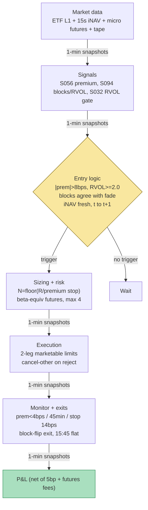

## Stage 139/200 — T039: ETF Creation/Redemption Flow Trader

*Batch TB4 · Strategy 39/100 · Signals S056, S094, S032*

### T1. One-line verdict

| | |
|---|---|
| **Style** | Intraday relative-value: statistical ETF–basket dislocation fade, confirmed by institutional flow footprints |
| **Edge source** | Transient ETF premium/discount (S056) traded as a non-AP statistical proxy — but only when signed block volume (S094) and relative volume (S032) confirm the dislocation is a liquidity event the Authorized Participants will close, not a stale quote or an informed move |
| **Typical holding period** | 15–60 minutes; domestic ETF dislocations decay in minutes per the literature |
| **Capacity hint** | Near-zero for a non-AP book on liquid ETFs — you are explicitly harvesting the APs' leftovers; dislocations big enough for you are rare by construction |
| **Build-or-buy in one line** | Build the dislocation monitor + flow-confirmation stack on a Tier-1 feed; do not buy anything that promises "ETF arb" to a non-AP — the primary-market loop (T009's AP variant) is not for sale to you |

### T2. Full mechanics

**Jargon first.** An *ETF* trades like a stock but holds a basket. *iNAV* (15-second cadence) is the issuer's live estimate of the basket's worth. The *premium/discount* is (ETF price − iNAV)/iNAV — negative = the ETF is cheap vs its basket. *Authorized Participants (APs)* may *create* shares (deliver basket → receive shares) or *redeem* them in *creation units* (typically 25,000–100,000 shares — *unverified chatbot claim*, Q-TB4-3 §5). A *block trade* is a single large print (≥ 10,000 shares, *example* — S094's default), usually institutional. *RVOL* is today's volume in a time-of-day bin divided by its trailing average. *BlockImb* = (buy-block vol − sell-block vol)/total block vol, in [−1, +1], trades signed by the Lee–Ready (1991) quote/tick test. *Basis* = futures − cash. *RTH* = regular trading hours.

**Universe & session.** US equity ETFs with licensed 15-second iNAV, 20-day ADV ≥ $20M, median spread ≤ 4 bps (*example*), and a liquid futures proxy (index ETFs via MES/MXF-class micros). Exclude: international ETFs with closed home markets (stale-iNAV mirage — Engle & Sarkar 2006), ex-div and rebalance days, first/last 15 minutes. Session 09:45–15:45 ET, flat 15:45 (*example*). This is the *statistical proxy* variant of S056 (non-AP: short the rich leg, buy the cheap leg, exit on convergence) — the true creation/redemption loop is **not executable** without an AP agreement; see T009 for the lead-lag-confirmed sibling (S056+S059+S014 — this chapter swaps in flow confirmation S094+S032).

**Entry rule.** At each 1-min snapshot *t*: premium_t (S056), 15-min RVOL vs the same-window 20-day mean (S032), and 15-min BlockImb (S094). **Enter** (signal at *t*, fills at *t+1*) when all four hold:

- |premium_t| > 8 bps — the all-in cost bound c (*example*, S056's default);
- RVOL_t ≥ 2.0 (*example*) — the dislocation rides institutional-size flow, not a quote flicker;
- sign(BlockImb_t) agrees with the *fade*: discount (buying cheap ETF) needs BlockImb ≥ +0.3 (*example*); premium (shorting rich ETF) needs BlockImb ≤ −0.3 (*example*). Blocks leaning *against* the fade = veto (informed flow, or a stale iNAV);
- iNAV fresh within 60 s (*example*) — a stale iNAV manufactures fake discounts.

Discount (premium < −c): long ETF, short the futures proxy in beta-equivalent notional. Premium (premium > +c): mirror. *Why blocks matter:* APs close dislocations by trading the basket against the ETF; heavy signed block flow in the convergence direction is the footprint of that closing flow arriving — it turns "the premium exists" into "the premium is being removed."

**Exit rule** (first wins): (1) convergence — |premium| < 4 bps = c/2 (*example*); (2) time stop — 45 min (*example*); (3) stop-loss — |premium| ≥ 14 bps, the dislocation is widening (*example*); (4) flow reversal — BlockImb flips sign against the position for 2 consecutive snapshots (*example*: the informed flow changed its mind); (5) 15:45 flat.

**Position sizing.** Risk on the *premium*: stop distance (14 − 8) bps × P_ETF ≈ $0.07–0.08/share on a $120 ETF (*example*). N_ETF = ⌊R / stop-distance⌋, R = $300 (*example*) → ~1,000 shares at $120. Futures proxy: beta-equivalent notional ($120k ETF ⇒ 4 micro contracts at $5/pt × 6,000 = $30k each). Max 4 concurrent dislocations, gross ≤ 2× equity on a $1M paper book (*example*).

**Risk limits** (*example*). Daily loss stop −1.5%; per-trade stop −$500; iNAV stale > 60 s ⇒ no new entries; futures halt ⇒ flatten both legs (never hold the proxy naked); borrow-flag gate on short-ETF mirrors.

**Cost model.** 5 bp one-way on notional per equity leg turn (*example*, TB4 shared convention from Q-TB4-1); micro futures $0.75/contract round-trip (*indicative — verify before budgeting*); half-spread in fill prices; no financing (intraday), no AP create/redeem fee (non-AP). Applied explicitly in T4.

**Order/execution sketch.** Simultaneous marketable limits on ETF + futures at the *t+1* snapshot; ETF participation ≤ 10% of visible depth (*example*); one leg rejects ⇒ cancel the other within 1 s (*example*) — an unhedged premium bet is not this strategy. Latency honesty: on SIP/L1 this is `simulated only — requires MBO/ITCH`; the 8-bps entry bound, not queue modeling, keeps the example honest. Backtest causality: signal at *t* ⇒ fill at *t+1*, purged/embargoed validation (S088) on every threshold.

### T3. Signals it consumes

| Signal | Role | Weight / logic |
|---|---|---|
| S056 — ETF vs basket / iNAV premium | **Primary trigger** | Enter only if \|premium_t\| > 8 bps (*example*); exit at < 4 bps |
| S094 — RVOL + signed block pressure | **Confirmation filter** | Enter only if sign(BlockImb) agrees with fade direction and \|BlockImb\| ≥ 0.3 (*example*); flip = exit |
| S032 — RVOL breakout confirmation | **Flow-size gate (veto)** | Enter only if 15-min RVOL ≥ 2.0 (*example*); thin-volume dislocations are vetoed |

```pseudocode
# T039 combination logic — runs on each 1-min snapshot t (causal: data <= t)
premium_t = (P_ETF[t] - iNAV[t]) / iNAV[t]                     # S056
rvol_t    = V_15min[t] / mean(V_15min[t-1d..t-20d])            # S032 (>= 2.0, example)
blocks    = lee_ready_sign(trades[t-15min..t], min_size=10k)   # S094
imb_t     = (buy_blk - sell_blk) / total_blk                   # in [-1,1]
fade_dir  = +1 if premium_t < 0 else -1                        # buy cheap / short rich
if position is None and iNAV_fresh(t, 60s):
    if abs(premium_t) > 8bps and rvol_t >= 2.0 \               # examples
       and sign(imb_t) == fade_dir and abs(imb_t) >= 0.3:
        N_ETF = floor(R / ((14bps - 8bps) * P_ETF[t]))         # R=$300 (example)
        N_FUT = beta_equiv_notional(N_ETF, P_ETF[t])           # micro futures
        submit_both_legs(MarketableLimits, at="snapshot t+1")
else:
    if abs(premium_t) < 4bps or abs(premium_t) >= 14bps \      # examples
       or sign(imb_t) == -fade_dir*2snaps or held >= 45min or clock >= "15:45":
        flatten both legs at next snapshot
```

### T4. Worked example — numbers + P&L (SYNTHETIC)

All prices synthetic, **seed 139** (`rng = np.random.default_rng(139)`; regenerable via `python3 batches/TB4/plot_T039.py`). Synthetic ETF "SYNETF", synthetic iNAV prints; hedge leg "MXF" micro index future, $5/pt (*real contract spec class*). The chart in T9 plots these exact trades.

**Trade T1 — discount fade, blocks confirm (winner).** Premium −10.2 bps (iNAV ≈ 120.563, ETF mid 120.44; < −8 ✓), 15-min RVOL 2.6 (≥ 2.0 ✓), BlockImb +0.55 (buy blocks agree ✓). Fill at *t+1*: long **1,000 SYNETF @ 120.44**, short **4 MXF @ 6,000.00**. Exit ~35 min later at premium −3.1 bps (< −4 ✓): sell 1,000 @ **120.72** (+280.00), cover 4 MXF @ **6,001.20** (−24.00).

| Line | Calc | $ |
|---|---|---|
| ETF leg | 1,000 × (120.72 − 120.44) | +280.00 |
| Futures hedge leg | 4 × 5 × (6,000.00 − 6,001.20) | −24.00 |
| Gross | | +256.00 |
| Costs: equity 5 bp (120,440 + 120,720) × 0.0005 | | −120.58 |
| Costs: futures 4 × 0.75 (*indicative*) | | −3.00 |
| **Net T1** | | **+132.42** |

**Trade T2 — premium fade, blocks confirm (winner).** Premium +9.1 bps, RVOL 2.2, BlockImb −0.48 (sell blocks agree ✓): short **800 SYNETF @ 121.10**, long **3 MXF @ 6,010.00**. Exit at +2.8 bps: cover @ **120.86** (+192.00), sell futures @ **6,011.50** (+22.50). Gross +214.50; costs (96,880+96,688)×0.0005 = −96.78, futures −2.25; **net +115.47**. Cumulative: +247.89.

**Trade T3 — discount fade, stop (loser).** Premium −9.4 bps, RVOL 2.4, BlockImb +0.41: long **900 @ 119.80**, short **4 MXF @ 5,990.00**. The discount *widens* — APs step back: stop at −14.2 bps (≥ 14): sell @ **119.52** (−252.00), cover @ **5,991.60** (−32.00). Gross −284.00; costs −110.69; **net −394.69**. Cumulative session: +132.42 + 115.47 − 394.69 = **−146.81**.

**Where the example is optimistic.** The losing trade is the honest one: T3 shows how this book dies — the dislocation widens past the stop while the futures hedge *also* loses. Remaining optimisms: Lee–Ready mis-signs midquote prints ~15–25% of the time on SIP data, so the confirmation filter is noisier than shown; the iNAV is assumed assemblable (a real 15-second print is indicative, and the basket may not trade at those prints — S056's S10 warning); fills at the touch with no partial fills; the futures proxy assumed basis-neutral; financing/borrow on the short-ETF mirror stubbed. The session's −$146.81 on ~$330k notional is the point: after-cost, the non-AP proxy needs roughly a 2:1 win ratio to tread water — the example is arithmetic, not a backtest, and makes no performance claim.

### T5. Data & infra — what must run

**Pipeline inventory.** Pre-open: iNAV license check, 20-day time-of-day volume baselines, borrow flags for short-mirror names. Intraday (09:45–15:45 ET): 15-second iNAV poller with staleness watchdog (no fresh print in 60 s ⇒ no new entries); ETF L1; micro-futures stream; 1-min snapshotter stamping premium_t, RVOL_t, BlockImb_t; Lee–Ready signer on the consolidated tape (quote test with 5-s lag, tick test for midquote prints). Post-close: persist snapshots + decisions; rebuild volume baselines and block-size distributions overnight. Storage: snapshots tiny; L1 for traded names ~2–8 GB/symbol-day (cost-model §4) — record only traded names.

**M5 Max feasibility: feasible (Tier M).** Per cost-model §2 this is snapshot arithmetic: a few thousand 1-min evaluations/day; the Lee–Ready signing over 15-min windows runs in milliseconds on polars. RAM < 1 GB hot (§3). Engineering: 40–100 h Tier M+ (§5) ≈ $6,000–15,000 loaded-cost estimate — the work is the two-leg FSM, the iNAV-clock alignment, and the causality-proof backtest. Bottleneck: licensing the 15-second iNAV and aligning its clock with the futures feed, not compute. Breaks at: multi-ETF basket-assembly simulation (capital, not compute).

**Feed-outage safe mode.** iNAV stale > 60 s → no new entries; existing positions run to convergence/stop on last-known premium. ETF quote hole → flatten ETF leg and futures hedge together. Futures halt/limit → flatten everything (an unhedged premium bet is not the strategy). Clock skew > 50 ms → halt all. Restart = flat + re-derive from the on-disk ledger.

### T6. Buy vs build

| Option | What you get | Indicative price | Gains | Loses |
|---|---|---|---|---|
| Tier-0: exchange delayed quotes + public holdings | End-of-day NAV, basket recipe | ~$0, *indicative — verify before budgeting* | Learn premium/discount accounting | No 15-s iNAV, no intraday blocks — no signal |
| Tier-1: Polygon Stocks Advanced / Alpaca SIP | Real-time SIP quotes/trades (blocks signable) | ~$30–200/mo, *indicative — verify before budgeting* | Block flow + RVOL honestly measurable | No licensed iNAV; no futures |
| Tier-2: Databento (equities + CME futures) | Exchange-timestamped L1 + futures | ~$200/mo + usage, *indicative — verify before budgeting* | Both legs + replay; Lee–Ready signing on clean timestamps | iNAV still licensed separately |
| Index-data vendor (index publisher feed) | 15-second iNAV/IIV | Licensed, typically $$/mo institutional, *indicative — verify before budgeting* | The actual S056 input | The surprise bill; redistribution terms |
| Retail platform: QuantConnect paper | Minute bars + paper broker | ~$60–300/mo tiers, *indicative — verify before budgeting* | Fast paper harness | No iNAV, no block-level tape |
| Build in-house (Python + polars) | Monitor, Lee–Ready signer, two-leg FSM, ledger | 40–100 h ≈ $6,000–15,000 eng (loaded-cost estimate) | Your cost bound, your confirmation logic | You own timestamp alignment |

**Verdict: buy the data, build the logic — and know what you're buying.** Without licensed 15-second iNAV there is no S056; without a clean tape there is no S094. **Build if** you want the flow-confirmation variant (nobody sells "fade only when blocks agree" as a product). **Do not buy** any vendor "ETF arbitrage" screen aimed at non-APs — per the research lead (Q-TB4-3 §5), the primary-market loop belongs to APs and wholesale market-makers; a non-AP screen sells you the right to compete with that flow on its own print. Crossover: the day you can sign an AP agreement and fund creation units, this statistical proxy becomes obsolete; until then the proxy — and its honest near-zero capacity — is the whole game.

### T7. Success-ratio evidence

| Source | Market / period | Metric | Before/after cost | Caveat |
|---|---|---|---|---|
| Engle & Sarkar (2006) | 21 domestic + 16 intl ETFs, 2000 | Domestic: mean premium < 5 bps, std ~15 bps, deviations transient (minutes) | Measured vs spreads, not net P&L | Minute-bar era; market structure has changed |
| Petajisto (2017) | US ETFs | ~100 bps avg deviation for identical-portfolio ETFs | Gross of costs | Identical-portfolio pairs, not single-ETF vs iNAV |
| Jain, Jain & Jiang (2021) | US ETFs | More algorithmic trading ⇒ smaller, less persistent deviations | Empirical, after the market's own costs | The competition you're trading against — the decay paper |
| Lettau & Madhavan (2018) | Survey | Creation/redemption architecture and AP incentives | n/a | Framework: why the AP captures the persistent part |
| Grok TB4 lead (Q-TB4-3 §5) | Mechanism summary | APs cross both spreads and flatten in the primary market overnight; non-AP secondary proxy "edge after costs ≈ 0 on liquid US equity ETFs most days"; creation units 25k–100k shares | Practitioner summary | *Unverified chatbot claim* |

Capacity: on liquid US equity ETFs the non-AP proxy's honest capacity is near zero — the AP loop manufactures shares and removes the mispricing; dislocations that pay (March-2020 bond ETFs, holiday-stranded international funds, thin thematic ETFs) are AP-only or carry gap risk that isn't "arb." Documented decay: Jain et al. (2021) — algorithmic competition keeps shrinking deviations. Failure regimes: AP step-back in stress (deviations widen past the stop when liquidity is thinnest), stale-iNAV mirages, futures-proxy basis blowouts.

**Honest bottom line.** For a ≤$1M paper operation: superb *education*, poor *income* — the −$146.81 session is the honest advertisement. The documented edge is single-digit bps per dislocation, the holding time is minutes, and the other side of your proxy trade is a professional AP desk with the actual creation loop. Paper-trade it to learn premium accounting, two-leg execution, block-flow reading, and cost-bound discipline. An institutional desk monetizes this with AP status, creation-unit balance sheet, and co-located simultaneity — none of which a paper book has.

### T8. Failure modes & pitfalls

1. **Stale-iNAV mirage** — the "discount" is an iNAV that hasn't caught up. Mitigation: 60-second freshness watchdog + the block-confirmation filter; never trade the print alone.
2. **International/overnight baskets** — underlying markets closed while the ETF trades (Engle & Sarkar's large-persistent-premium set is exactly this trap). Mitigation: universe excludes them.
3. **Block mis-signing** — Lee–Ready misclassifies midquote prints ~15–25% of the time on SIP data. Mitigation: require |BlockImb| ≥ 0.3 (*example*) over a 15-min window (aggregation dilutes mis-signing); the RVOL ≥ 2.0 gate as a second opinion.
4. **AP step-back in stress** — dislocations widen past the stop when liquidity is thinnest (the T3 trade). Mitigation: hard stop, no averaging down, flatten-everything on futures halt.
5. **Proxy basis risk** — the micro future tracks its index, not the ETF's basket. Mitigation: restrict to index ETFs where the proxy is tight; for sector ETFs build the subset basket or don't trade (basis risk disclosed in sizing).
6. **Two-leg asynchrony** — ETF fills, futures gap on a macro headline. Mitigation: simultaneous marketable limits, cancel-other ≤ 1 s, ≤ 10% participation.
7. **Cost-bound optimism** — 5 bp equity + $0.75 futures is the floor; effective spreads on the ETF leg are worse in stress. Mitigation: require the premium to clear c plus a 2-bps safety margin (*example*) before entry.
8. **Lookahead in RVOL baselines** — a baseline that includes today's volume, or a same-day average with future bars. Mitigation: trailing 20-day *same-window* means, refit overnight only (S032's documented leakage bug, guarded in the harness).

### T9. Visuals




### T10. Sources

- Engle, R. F. & Sarkar, D. (2006). "Premiums–Discounts and Exchange Traded Funds." *Journal of Derivatives*, Summer 2006 — domestic dislocations small/transient; the empirical anchor of T7.
- Petajisto, A. (2017). "Inefficiencies in the Pricing of Exchange-Traded Funds." *Financial Analysts Journal* 73(1), 24–54 — ~100 bps deviations on identical-portfolio ETFs; the "why APs get paid" result.
- Jain, A., Jain, C. & Jiang, C. X. (2021). "Active Trading in ETFs: The Role of High-Frequency Algorithmic Trading." *Financial Analysts Journal* 77(2), 66–82 — algorithmic competition shrinks deviations; the decay evidence.
- Lettau, M. & Madhavan, A. (2018). "Exchange-Traded Funds 101 for Economists." *Journal of Economic Perspectives* 32(1), 135–154. doi:10.1257/jep.32.1.135 — creation/redemption architecture behind the S056 bound.
- Lee, C. M. C. & Ready, M. J. (1991). "Inferring Trade Direction from Intraday Data." *Journal of Finance* 46(2), 733–746 — the quote/tick signing rule S094's BlockImb rests on.
- Hasbrouck, J. (1995). "One Security, Many Markets." *Journal of Finance* 50(4), 1175–1199 — information share; why the futures leg is the hedge, not the signal.

**Unverified leads** (chatbot-provided, not independently checkable — do not treat as evidence):
- *Unverified chatbot claim* (Grok, 2026-09-10, Q-TB4-3 §5): AP capture mechanics ("cross both spreads, flatten in the primary market overnight"), creation units "typically 25k–100k shares (SPY historically 50k)", non-AP proxy "edge after costs ≈ 0 on liquid US equity ETFs most days," March-2020 bond-ETF dislocation note.
- *Unverified chatbot claim* (Grok, 2026-09-10, Q-TB4-3 §4): Hazelkorn–Moskowitz–Vasudevan-type basis premium "~5–6% annual" and basis-timing Sharpe "~0.6–0.9 in futures" — attribution not verified; not used as evidence.
- *Unverified chatbot claim* (Grok, 2026-09-10, Q-TB4-1 shared convention): 5 bp one-way equity cost convention, borrow GC 25–50 bp — used as the chapter's *illustrative* cost model, not as a market fact.
- Micro-futures $0.75/contract round-trip — *indicative — verify before budgeting*; no vendor quote obtained.

Source log: Grok answered Q-TB4-1..3 (2026-09-10); all claims independently verified or labeled unverified.
