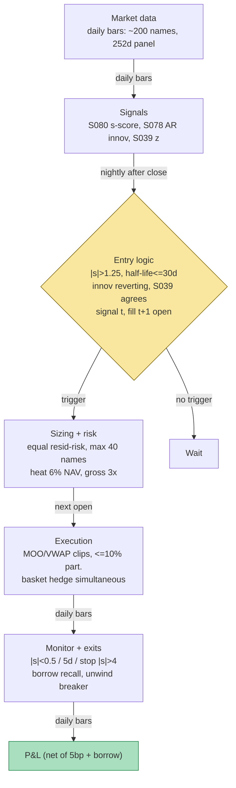

## Stage 140/200 — T040: PCA Eigenportfolio Residual Reversal

*Batch TB4 · Strategy 40/100 · Signals S080, S039, S078 · Provenance [D/SR]*

### T1. One-line verdict

| | |
|---|---|
| **Style** | Daily statistical arbitrage: market-neutral residual mean-reversion on statistical-factor hedges |
| **Edge source** | PCA eigenportfolio residuals (S080) — the stock-specific leftover after stripping the market's own statistical factors — mean-revert as Ornstein–Uhlenbeck processes; entries are timed by AR(1) innovations (S078) and confirmed by a second, fundamental residual model (S039) to survive factor-model miss |
| **Typical holding period** | 1–5 days (half-life-gated); exits on s-score convergence, not the calendar |
| **Capacity hint** | Liquid US mid/large-cap book, low hundreds of $mm before impact at 5 bp (basis points) costs — the documented binding risk is crowding (Aug 2007), not per-trade size |
| **Build-or-buy in one line** | Build the eigenportfolio engine on daily bars (the IP (intellectual property) is the causality hygiene and the heat discipline); buy borrow history only if you want an honest HTB (hard-to-borrow) backtest — otherwise rent it from your prime at go-live |

### T2. Full mechanics

**Jargon first.** *PCA* finds the directions of greatest co-movement in a return panel: *eigenvectors* are the directions, *eigenvalues* the variance along each. An *eigenportfolio* is a portfolio weighted by one eigenvector — one "statistical factor" distilled from the data (unlike named factors such as "value"). A *residual* is what remains after the factors are stripped: R = Σ β·F + residual. The *s-score* standardizes the residual by its mean-reversion speed: s = (X − μ)/(σ/√(2κ)). An *Ornstein–Uhlenbeck (OU) process* is the textbook mean-reverting random walk: dX = −κ(X−μ)dt + σdW, with *half-life* ln2/κ. An *AR(1) innovation* is today's surprise vs a one-lag autoregression's forecast: ε̂_t = r_t − f̂_t. *Dollar-neutral* = long $ equal short $. *Heat* = total open risk.

**Universe & session.** ~200 liquid US large/mid caps: price ≥ $10, 60-day ADV (average daily dollar volume) ≥ $10M, borrowable (GC (general collateral) preferred), no earnings within ±2 days (*example* filters). Daily bars, close-to-close; signals computed after the close, entries at the next open (causal t → t+1). No intraday trading — this is the overnight statistical book, held 1–5 days.

**Entry rule.** Nightly estimation (S080, Avellaneda–Lee 2010 form):
1. Rolling 252-day correlation matrix of standardized returns; eigendecompose; keep m = 5 factors (*example*; ~50–55% variance — *example*).
2. Eigenportfolio weights Q_ki = v_ki/σ_i; factor returns F_kt = Σ_i Q_ki r_it.
3. Per stock: 60-day OLS (ordinary least squares) R_it = α_i + Σ_k β_ik F_kt + X_it → residual X_it (*example* window).
4. Fit OU to X_it; require half-life ln2/κ ≤ 30 days (*example*) and OU-fit R² ≥ 0.5 (*example*, S080's default).
5. s-score s_it = (X_it − μ_i)/(σ_i/√(2κ_i)).

**Enter** (signal at close *t*, fills at next open *t+1*) when: |s_it| > 1.25 (*example*, the Avellaneda–Lee entry threshold via the TB4 research lead); **timing (S078)**: AR(1) on the residual over 60 bars, innovation z_t = ε̂_t/σ̂_ε, require sign(ε̂_t) = −sign(s_it) (*example*) — the latest bar is already reverting, so you join a convergence in progress rather than front-run a widening residual; **confirmation (S039)**: the market-plus-sector residual z agrees in sign with s_it, |z| ≥ 1.0 (*example*) — two independent residual models (statistical vs fundamental) must point the same way. Long the residual when s < −1.25, short when s > +1.25; the hedge leg is the eigenportfolio basket (short β_ik units of each factor portfolio).

**Exit rule** (first wins): (1) convergence — |s| < 0.5 (*example*); (2) time stop — 5 sessions (*example*); (3) stop-loss — |s| > 4 (*example*) or half-life re-estimate doubles (the OU broke); (4) model disagreement — S039's z crosses 0 while |s| is still stretched (*example*).

**Position sizing.** Equal residual-risk per name: N_i = R_target/σ_resid,i, R_target = $1,000 (*example*) → ~$100k legs; max 40 open residuals (*example*); heat cap Σ open |s_i|·$risk ≤ 6% of NAV (net asset value) (*example*, Grok's shared residual-book convention); gross ≤ 3× NAV; net factor exposure ≈ 0 by construction.

**Risk limits** (*example* unless noted). Daily loss stop −2% of NAV; per-residual stop is the |s| > 4 rule; crowded-unwind circuit breaker: 5-day book P&L < −3% on a flat market ⇒ halve all targets (the Khandani–Lo 2007 signature); borrow-recall ⇒ immediate cover, no substitution.

**Cost model.** 5 bp one-way on notional per leg turn (*example*, TB4 shared convention from Q-TB4-1); stock-loan on short residuals at GC 25–50 bp annualized on notional (specials vetoed pre-entry); dividends: short pays on ex-date, modeled as cash flow; no financing on the hedge basket (dollar-neutral by construction). Applied explicitly in T4.

**Order/execution sketch.** Next-open market-on-open or first-15-min VWAP (volume-weighted average price) clips (*example*), participation ≤ 10% of opening volume; stock and eigenportfolio-basket legs submitted simultaneously (basket as a program trade or the prime's pair algo); basket leg incomplete ⇒ stock leg cancelled — a naked residual is a factor bet, not this strategy. Backtest: signal at close *t* ⇒ fill at next open, purged/embargoed (S088) walk-forward on every parameter.

### T3. Signals it consumes

| Signal | Role | Weight / logic |
|---|---|---|
| S080 — PCA eigenportfolio residual | **Primary trigger** | Enter only if \|s\| > 1.25, half-life ≤ 30d, OU R² ≥ 0.5 (*examples*) |
| S078 — AR/ARMA (autoregressive/autoregressive–moving-average) innovation | **Timing gate** | Enter only if sign(AR(1) innovation) = −sign(s) — join a reverting residual (*example*) |
| S039 — Idiosyncratic residual reversal | **Confirmation filter** | Enter only if S039's market+sector z agrees in sign, \|z\| ≥ 1.0 (*example*); disagreement = veto |

```pseudocode
# T040 combination logic — nightly after close; fills at next open (t -> t+1)
factors, Q = pca_eigenportfolios(returns_252d, m=5)        # S080 (examples)
for i in universe:
    X, s, halflife, r2 = ou_residual(i, factors, W=60d)   # S080 s-score
    innov = ar1_innovation(X, W=60)                        # S078
    z39   = s039_residual_z(i, close_t)                    # market+sector model
    if position[i] is None and abs(s) > 1.25 \             # example
       and halflife <= 30 and r2 >= 0.5 \                  # examples
       and sign(innov) == -sign(s) \                       # S078 timing (example)
       and sign(z39) == sign(s) and abs(z39) >= 1.0:       # S039 confirm (example)
        enter (long if s < 0 else short) vs eigenportfolio basket, next open
    elif position[i] is not None:
        if abs(s) < 0.5 or held >= 5d or abs(s) > 4 \      # examples
           or sign(z39) != sign(s):
            exit at next open
```

### T4. Worked example — numbers + P&L (SYNTHETIC)

All prices synthetic, **seed 140** (`rng = np.random.default_rng(140)`; regenerable via `python3 batches/TB4/plot_T040.py`). Costs: 5 bp one-way on notional per leg turn (*example*); borrow fee stubbed at 0 in the arithmetic and flagged below. The chart in T9 plots these exact s-score paths and trades.

Setup: one statistical factor (the first PC ≈ the market), 60-day window; betas 0.90–1.10 (*example*).

**Trade T1 — long residual, converges (winner).** AAA: β = 1.10, ε = −0.042, OU σ = 0.028 ⇒ s = −1.52 (< −1.25 ✓); AR(1) innovation positive (reverting ✓); S039 z = −1.3 (agrees ✓). Long **2,222 AAA @ 45.00**, short **2,000 BBB @ 50.00** (eigenportfolio hedge). Exit at s = −0.31 (< −0.5 ✓): sell AAA @ **45.55** (+1,222.10), cover BBB @ **49.90** (+200.00).

| Line | Calc | $ |
|---|---|---|
| Stock leg | 2,222 × (45.55 − 45.00) | +1,222.10 |
| Hedge-basket leg | 2,000 × (50.00 − 49.90) | +200.00 |
| Gross | | +1,422.10 |
| Costs 5 bp: (99,990 + 101,221 + 100,000 + 99,800) × 0.0005 | | −200.50 |
| **Net T1** | | **+1,221.60** |

**Trade T2 — short residual, converges (winner).** CCC: s = +1.61 (> +1.25 ✓), innovation negative ✓, S039 z = +1.2 ✓. Short **2,000 CCC @ 50.00**, long **2,000 BBB @ 50.00**. Exit at s = +0.28: cover @ **49.72** (+560.00), sell hedge @ **50.06** (+120.00). Gross +680.00; costs −199.78; **net +480.22**. Cumulative: +1,701.82.

**Trade T3 — long residual, widens (stop).** DDD: s = −1.44, innovation positive ✓, S039 z = −1.1 ✓. Long **2,500 DDD @ 40.00**, short **2,500 EEE @ 40.00**. The residual *keeps widening* — an unmodeled factor day: stop at s = −4.20 (≥ 4): sell @ **39.78** (−550.00), cover @ **40.06** (−150.00). Gross −700.00; costs −199.80; **net −899.80**. Session total: +1,221.60 + 480.22 − 899.80 = **+802.02**.

**Where the example is optimistic.** The OU parameters (κ, σ, μ) are handed to the example exactly; real 60-day estimates give noisy half-lives, and the R² ≥ 0.5 gate rejects far more names than the toy suggests — real trade frequency is a fraction of three clean s-scores. The hedge basket is assumed to track the eigenportfolio perfectly (any subset proxy leaks factor exposure — the example's hedge P&L is suspiciously clean). Borrow is priced at 0: a live short book pays GC 25–50 bp minimum and gets recalled on exactly the crowded names (the T3 widener is the kind that goes special). Fills are at clean opens with no partial fills or impact; 5 bp is the floor, and fast-half-life books pay multiples of it in turnover. The +$802.02 on ~$400k notional is arithmetic illustration of the cost drag and the stop working — not a backtest, and no performance claim is made.

### T5. Data & infra — what must run

**Pipeline inventory.** Nightly: refresh 252-day total-return panel (split/div-adjusted — the highest-defect step), refit PCA eigenvectors, re-estimate betas and OU parameters, recompute s-scores, AR(1) innovations, S039 z's, borrow/earnings exclusions. Pre-open: verify no corporate action broke the eigenvectors (spin-off ⇒ refit that name out). Intraday: nothing — this is a close-to-open book; only the heat/daily-loss monitor and the crowded-unwind circuit breaker run. Post-close: persist eigenvectors, residuals, s-scores, decisions; walk-forward purged/embargoed re-validation monthly.

**M5 Max feasibility: feasible (Tier M).** Per cost-model §2/§3: 200 names × 252 days eigendecomposition is seconds; 200 × 60-day OLS + OU fits nightly is a rounding error (the TB4 lead's own table puts the full 2,000-name screen at 20–60 min — 200 names is ~1–5 min). RAM: panel + eigenvectors < 1 GB (§3); 10-year daily archive trivial (§4). Engineering: 40–100 h Tier M+ (§5) ≈ $6,000–15,000 loaded-cost estimate — the work is the corporate-action hygiene, the causality-proof backtest (t→t+1 asserted), and the heat/circuit-breaker accounting, not the linear algebra. Bottleneck: borrow data and adjustment quality, not compute. Breaks at: intraday eigenportfolios on 2,000 names (not this strategy).

**Feed-outage safe mode.** EOD (end-of-day) feed missing ⇒ no new s-scores, no new entries; existing residuals run to convergence/stop/time-stop on last-known estimates. Borrow feed stale ⇒ hard veto on new shorts (never assume GC). Eigenvector refit failure ⇒ freeze the book flat rather than trade on yesterday's factors through a spin-off. Restart = flat + re-derive from the on-disk ledger.

### T6. Buy vs build

| Option | What you get | Indicative price | Gains | Loses |
|---|---|---|---|---|
| Tier-0: Stooq/SEC EDGAR + FINRA short interest | Daily bars, borrow snapshots | ~$0, *indicative — verify before budgeting* | Learn the eigenportfolio mechanics | No survivorship-free history; corp-action hygiene is DIY |
| Tier-1: Norgate/Sharadar-class EOD + total return | Survivorship-free adjusted daily bars | ~$2k–15k/yr, *indicative — verify before budgeting* | The cheap *correct* formation dataset (per Q-TB4-2) | No institutional borrow history |
| Tier-2: Databento EOD + corporate actions | Adjusted bars + action maps | ~$200/mo + usage, *indicative — verify before budgeting* | Clean adjustments for the PCA panel | Still no borrow history |
| Markit / S&P Securities Finance-class | Indicative fee, utilization, inventory, 15-yr history | ~$30k–150k+/yr, *indicative — verify before budgeting* | The honest HTB backtest | The six-figure line item; relationship-priced |
| Barra/Axioma risk model | Factor residual risk | ~$150k–600k+/yr entry, *indicative — verify before budgeting* | Institutional-grade residual risk | Absurd for a 40-name residual book |
| Build in-house (Python + numpy/polars) | PCA engine, OU fitter, S039/S078 gates, heat FSM (finite-state machine), ledger | 40–100 h ≈ $6,000–15,000 eng (loaded-cost estimate) | Your factors, your causality, your stops | You own the adjustment pipeline — the #1 defect source |

**Verdict: buy Tier-1 adjusted EOD, build the engine, rent borrow at go-live.** The TB4 lead's verdict (Q-TB4-2) stands: build the formation, the OU/s-score engine, the cost and heat accounting on the Mac; rent locates and live borrow from the prime. **Build if** you want the S078-timing + S039-confirmation variant — no vendor sells your confirmation logic. **Buy institutional borrow history only if** you need a historically honest short-side backtest; if you will only short names your prime already shows a live GC fee on, skip it — that single feed can exceed every other line combined. Crossover: past ~40 simultaneous residuals, or regular specials, the borrow dataset becomes mandatory and a Barra-class risk model stops being absurd.

### T7. Success-ratio evidence

| Source | Market / period | Metric | Before/after cost | Caveat |
|---|---|---|---|---|
| Avellaneda & Lee (2010) | US equities, 1997–2007 | PCA residual reversal, s-score entries; positive after the paper's cost model | After costs (paper's model) | Sample ends 2007; threshold/Sharpe magnitudes via the TB4 lead — *unverified chatbot claim* |
| Khandani & Lo (2007) | US, August 2007 | Crowded long/short residual books lost together in the quant unwind | Empirical event | The failure regime, not a performance claim — it defines the circuit breaker |
| Engle & Granger (1987) | Theory | Cointegration/error-correction: the econometric foundation residual-reversion rests on | n/a | Foundation, not a trading result |

Capacity: the liquid US mid/large residual book supports low hundreds of $mm before 5-bp impact binds (per the lead); the binding constraint is crowding — Aug 2007, Q1 2018 vol, Mar 2020 — when "idiosyncratic" turns out to be an unmodeled common factor and every book de-levers the same names. Documented decay: in-paper Sharpe 1.44 → 0.9 already inside the original sample; post-2007 replications lower; factor-model miss (too few PCs ⇒ fading beta; too many ⇒ trading noise, both losing after costs per the lead) is the documented parameter trap.

**Honest bottom line.** For a ≤$1M paper operation: the most *learnable* stat-arb in the book — daily bars, closable math, honest costs — and paper-trading it teaches eigenportfolio construction, OU estimation, and heat discipline that transfer everywhere. But the documented after-cost edge is a *residual* edge in single-digit bps per trade that has decayed since the original sample, and the confirmation gates that make it safer make it trade rarely. An institutional desk runs this at 10–100× the name count with a borrow desk, a risk model, and balance sheet for the unwind weeks; the paper book's honest role is to learn the estimation-error half of the edge before sizing it. Do not annualize the +$802.02 synthetic session.

### T8. Failure modes & pitfalls

1. **Factor-model miss** — too few PCs leaves factor in the "residual" (you fade beta); too many fits noise as factors and you pay costs to trade randomness. Mitigation: variance-explained targeting (~50–55%, *example*), the S039 agreement gate, residual-vs-SPY correlation > 0.3 ⇒ refit (*example*).
2. **Crowded de-lever (Aug 2007 signature)** — every residual book holds the same names; the unwind is the stop-loss. Mitigation: heat cap 6% NAV, daily loss stop −2%, the circuit breaker (halve targets at −3%/5d on a flat market); no averaging down, ever.
3. **β̂/eigenvector staleness through regime breaks** — 60-day/252-day estimates through a factor rotation produce garbage residuals. Mitigation: half-life re-estimate doubling ⇒ auto-exit; halt new entries if residual dispersion explodes.
4. **Borrow specials and recalls** — the stretchiest shorts are hardest to borrow. Mitigation: borrow-flag gate pre-entry, GC-only at first, recall ⇒ immediate cover; model GC 25–50 bp carry in the cost bound.
5. **Corporate actions breaking the eigenvectors** — a spin-off/merger changes what a "name" is mid-estimation. Mitigation: split-adjust both legs, force-exit on spin/merger (Grok's shared pairs convention).
6. **AR(1) timing whipsaw** — the innovation gate can delay entry past the convergence or fire on bounce noise (S078's trade-price bounce trap). Mitigation: run the AR on adjusted closes, require the innovation sign on the *close*, accept missed trades as the filter's price.
7. **Lookahead in estimation windows** — PCA/beta fit on data including the trade window. Mitigation: estimation ends at t−1, fills at t+1, causality asserted in the harness; purged/embargoed walk-forward (S088).
8. **Cost-model optimism on fast half-lives** — short-half-life residuals need high turnover; 5 bp is the floor and turnover multiplies it. Mitigation: half-life ≥ 2 days (*example* floor); size by residual-risk so turnover, not notional, is the budgeted quantity.

### T9. Visuals




### T10. Sources

- Avellaneda, M. & Lee, J.-H. (2010). "Statistical Arbitrage in the U.S. Equities Market." *Quantitative Finance* 10(7), 761–782. doi:10.1080/14697680903124632 — PCA eigenportfolios, OU residuals, s-score trading: the documented core of this strategy and of S080.
- Khandani, A. E. & Lo, A. W. (2007). "What Happened to the Quants in August 2007?" *Journal of Investment Management* 5(4), 5–54 — https://web.mit.edu/Alo/www/Papers/august07.html — the crowded-unwind event that sets this book's heat caps and circuit breaker.
- Engle, R. F. & Granger, C. W. J. (1987). "Co-Integration and Error Correction: Representation, Estimation, and Testing." *Econometrica* 55(2), 251–276. doi:10.2307/1913236 — the econometric foundation of residual mean-reversion.
- Tsay, R. S. (2005). *Analysis of Financial Time Series*. Wiley, 2nd ed. — AR/ARMA estimation and innovation diagnostics behind the S078 timing gate (textbook, checkable).

**Unverified leads** (chatbot-provided, not independently checkable — do not treat as evidence):
- *Unverified chatbot claim* (Grok, 2026-09-10, Q-TB4-1 (D)): Avellaneda–Lee entry/exit thresholds (|s| > 1.25 open, < 0.50/< 0.75 close), minimum half-life ~8.4 days / ≤ 30 days, K = 15 PCs or ~50–55% variance, 5 bp cost convention, and the 3-asset worked arithmetic (incl. the underived −$100 "B bleed") — used as *illustrative* mechanics; thresholds marked `example` throughout.
- *Unverified chatbot claim* (Grok, 2026-09-10, Q-TB4-3 §6): PCA residual after-cost Sharpe 1.44 → 1.1 → ~0.6 replication figures; sector-ETF residual 1.1 → 1.51; ALBL (Avellaneda+Black–Litterman) net Sharpe 0.84 → 1.23 — magnitudes not independently verified.
- *Unverified chatbot claim* (Grok, 2026-09-10, Q-TB4-3 §2): "Baskaran (SSRN 2026)" walk-forward Kalman results (dated after 2026-09-10 — citation plausibility not verified; do not cite as evidence).
- *Unverified chatbot claim* (Grok, 2026-09-10, Q-TB4-2): M5 Max screen timings and borrow-data pricing bands — *indicative — verify before budgeting*.

Source log: Grok answered Q-TB4-1..3 (2026-09-10); all claims independently verified or labeled unverified.
