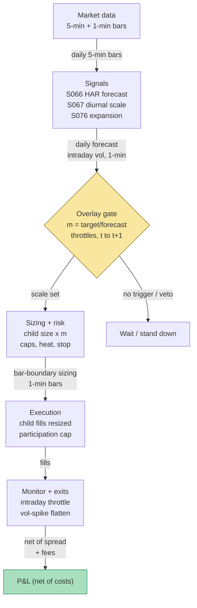

## Stage 141/200 — T041: HAR Vol-Timing Overlay

*Batch TB5 · Strategy 41/100 · Signals S066, S067, S076*

*Provenance: [D/SR] — documented signals (S066/S067/S076) combined through strategy rules reconstructed for this chapter; the combination itself is synthetic, not a documented strategy.*

### T1. One-line verdict

| | |
|---|---|
| **Style** | Intraday volatility-timing **overlay** — a position-size scaler applied on top of an existing intraday book, not a standalone alpha |
| **Edge source** | Volatility **persistence** (tomorrow's volatility is partly predictable from recent volatility, S066) combined with the absence of a proportional risk–return tradeoff intraday: scaling risk down when forecasted volatility is high and up when it is low raises the book's risk-adjusted return |
| **Typical holding period** | Inherits the child book's horizon; the overlay multiplier is re-estimated **daily** (HAR) and throttled **intraday** (minutes) |
| **Capacity hint** | Scales with the underlying strategies — the overlay itself adds no new market footprint, only resizes existing flow |
| **Build-or-buy in one line** | Build the scaler (an afternoon on top of the S066 code); buy the 5-minute bars, not the model |

### T2. Full mechanics

**Jargon first.** *Realized variance* (RV) is the sum of squared intraday returns — how much the price actually moved. *Realized volatility* is its square root. *HAR* (heterogeneous autoregressive, S066) forecasts tomorrow's RV from today's, this week's, and this month's RV. *Volatility targeting* sizes positions so expected portfolio volatility stays near a fixed target: size ∝ target vol / forecasted vol. An *overlay* is a rule layer that multiplies another strategy's sizes without replacing them — here, a factor *m*. *Diurnal deseasonalization* (S067) divides each intraday return by its time-of-day scale so the open/close U-shape doesn't pollute the measurement. A *volatility breakout* (S076) is a bar whose range explodes past its recent average, or the release of a Bollinger-bandwidth squeeze.

**Universe & session.** Any intraday book on liquid US equities or ETFs (the worked example uses a fictitious liquid ETF "SYNX" — all prices synthetic). RTH (regular trading hours, 9:30–16:00 ET) only. The overlay applies to every child strategy in the book; it never originates entries. Exclusions are inherited from the child book (halts, earnings days, low-ADV names stay excluded).

**Entry rule.** The overlay does not enter — it gates and scales child entries. A child signal fires at bar *t*; the overlay multiplier *m_t* scales the child size; the earliest fill is bar *t+1*'s open. The overlay can **veto** a child entry: if S076 fires a volatility-expansion bar while the book is at its heat cap, the child entry is skipped for *H* minutes (*example:* H = 95).

**Sizing — the multiplier.** Each close *t*, compute the HAR forecast σ̂_{t+1} (annualized, S066 formula in T3). The baseline multiplier is

*m_t* = clamp(σ_target / σ̂_{t+1}, *m_min*, *m_max*)

with *example* parameters σ_target = 16% annualized, *m_min* = 0.25, *m_max* = 1.50. Every threshold and parameter here is `example — not an institutional standard`. If the forecast is 24%, *m* = 16/24 = 0.67: every child position is cut by a third. If the forecast is 10%, *m* = 1.50 (capped): positions grow by half. The clamp is the risk control — the overlay can shrink aggressively but may only lever modestly.

**Intraday throttle (S067 + S076).** Two adjustments, both effective the *next* bar (causal, bar *b* → effective *b+1*):

1. *Deseasonalized-vol throttle.* Each 1-minute bar, deseasonalize returns (r̃ = r / s_b, S067) and compute trailing-30-minute realized σ. If it exceeds 1.5× the HAR-implied intraday rate (*example*), latch *m* × 0.75 (*example*) **once** — the throttle engages a single time and releases only when trailing-30-minute σ falls back below 1.2× the HAR-implied rate (*example* hysteresis). It does not multiply by 0.75 again on every qualifying bar.
2. *Expansion throttle.* If S076 fires (range ratio > 1.75, *example*, on a squeeze-armed tape), multiply *m* by 0.50 (*example*) for the next 95 minutes (*example* — the 11:15–12:50 window in the T4 example).

**Exit rule.** Exits are the child book's (time stops, signal flips, stop-losses). The overlay adds one portfolio-level exit: if deseasonalized realized vol exceeds 2.5× the HAR-implied rate (*example*), halve all positions immediately at the next bar — the "vol-spike flatten." It is a risk exit, not a profit exit, and it is deliberately crude.

**Position sizing / risk limits.** The overlay never increases a child size above the child book's own per-name cap. Portfolio heat (sum of |position| / equity) keeps its own cap (*example:* 3×), enforced after multiplication, so a high-*m* day cannot breach it. Daily loss stop: −2% of book (*example*) — the overlay goes to *m* = 0 for the rest of the session. Kill switch: if the HAR input is stale (>1 session) or the intraday bar feed drops, *m* freezes and no new entries are accepted until recovery (see T5 safe mode).

**Cost model.** The overlay's own cost is the *extra turnover* from multiplier changes: every time *m* steps intraday, the book must trade the difference. Model each rebalance at half-spread $0.005/share plus $0.0035/share commission per side (*example*). Rule of thumb: the multiplier should not move more often than the child book's average hold justifies — a hyperactive throttle trades the book to death.

**Execution sketch.** Multipliers apply at bar boundaries on 1-minute bars. Rebalance orders are marketable limits, capped at ≤10% of trailing 1-minute visible volume (*example*). Queue-position claims on SIP data are `simulated only — requires MBO/ITCH`; fills are modeled at the bar open plus half-spread, never at mid.

**Causality.** HAR forecast uses RV through close *t* → multiplier applies to day *t+1*. Intraday estimates use bars ≤ *b* → effective at *b+1*. The overlay never uses same-bar information.

### T3. Signals it consumes

| Signal | Role | Weight / logic |
|---|---|---|
| S066 — HAR realized-vol forecast | **Primary sizing input** | *m* = clamp(σ_target / σ̂_HAR, 0.25, 1.50) (*example*); forecast RV_{t+1} = β_0 + β_d·RV_t + β_w·RV̄_t^{(5)} + β_m·RV̄_t^{(22)}, OLS on ≥250 days |
| S067 — Diurnal deseasonalization | **Normalization layer** | r̃ = r / s_b (per-bin scale, mean 1) before every intraday vol computation; never a trigger by itself |
| S076 — Vol breakout / squeeze | **Throttle / veto regime input** | Expansion bar (range ratio > 1.75, *example*) → *m* × 0.50 for 95 minutes (*example*); squeeze-armed required |

```pseudocode
# T041 combination logic — daily forecast at close t; intraday throttle per bar
har = HAR_forecast(RV_5min_daily)                  # S066: RV_{t+1}=b0+bd*RV+bw*RV5+bm*RV22
m   = clamp(SIGMA_TARGET / sqrt(har), 0.25, 1.50)  # example: 16% target, 0.25/1.50 clamps
armed = (bandwidth_percentile <= 10)                # S076 squeeze-armed flag
for bar in session:                                # 1-min bars
    r_d = r_bar / s_bin[bar]                       # S067 deseasonalize the clock out
    sig30 = sqrt(sum(r_d[-30:]**2))                 # trailing-30-min realized vol
    if not desez_latched and sig30 > 1.5 * har_implied_intraday:  # example band: latch ONCE
        m = m * 0.75; desez_latched = True
    elif desez_latched and sig30 < 1.2 * har_implied_intraday:  # example hysteresis: release
        m = m / 0.75; desez_latched = False
    if range_ratio(bar) > 1.75 and armed:          # S076 expansion, example k
        m, throttle_until = m * 0.50, bar + 95    # 95-minute example window (11:15-12:50 in T4)
    for sig in child_book:                         # child strategy logic
        if sig.fires(bar):                         # causal: signal at t -> fill at t+1
            submit(child_size(sig) * m, next_open)  # overlay scales, never overrides veto
```

### T4. Worked example — numbers + P&L (SYNTHETIC)

All numbers synthetic — fictitious ETF "SYNX" near $200.00. Script `batches/TB5/plot_T041.py`, **seed 141**; the chart in T9 plots these exact trades. Cost schedule (*example*): half-spread $0.005/share/side, commission $0.0035/share/side.

Setup: prior close HAR forecast σ̂ = 24% (synthetic). σ_target = 16% (*example*) → baseline *m* = 16/24 = **0.67**. Base child size: $100,000 notional per signal.

**Trade T1 — baseline multiplier.** 10:05: child long signal; notional = 100,000 × 0.67 = $67,000 → **335 shares @ $200.00**. Exit 10:41 @ **$200.62**.

| Line | Calc | $ |
|---|---|---|
| Gross | 335 × (200.62 − 200.00) | +207.70 |
| Spread | 2 × 335 × 0.005 | −3.35 |
| Fees | 2 × 335 × 0.0035 | −2.35 |
| **Net T1** | 207.70 − 3.35 − 2.345 | **+202.01** |

**Trade T2 — S076 throttle.** 11:15: S076 fires (range ratio 3.4 > 1.75, *example*; deseasonalized 5-min vol 2.1× the HAR-implied rate) → *m* = 0.67 × 0.50 = **0.335** for 6 bars. 11:20: child short signal; notional = 100,000 × 0.335 = $33,500 → **167 shares @ $200.30**. Exit 11:52 @ **$199.85**.

| Line | Calc | $ |
|---|---|---|
| Gross | 167 × (200.30 − 199.85) | +75.15 |
| Spread | 2 × 167 × 0.005 | −1.67 |
| Fees | 2 × 167 × 0.0035 | −1.17 |
| **Net T2** | | **+72.31** |

**Trade T3 — loser at baseline.** 13:05: throttle released, *m* back to 0.67. **335 shares @ $199.90**; exit 13:40 @ **$199.72**.

| Line | Calc | $ |
|---|---|---|
| Gross | 335 × (199.72 − 199.90) | −60.30 |
| Spread + fees | 3.35 + 2.35 | −5.70 |
| **Net T3** | | **−66.00** |

**Trade T4 — intraday deseasonalized throttle.** 14:30: trailing-30-min deseasonalized σ runs 1.6× the HAR-implied rate (> 1.5× band, *example*) → *m* = 0.67 × 0.75 = **0.50**. 14:50: child long; **250 shares @ $200.10**; exit 15:30 @ **$200.44**.

| Line | Calc | $ |
|---|---|---|
| Gross | 250 × (200.44 − 200.10) | +85.00 |
| Spread + fees | 2.50 + 1.75 | −4.25 |
| **Net T4** | | **+80.75** |

Cumulative net: +202.01 + 72.31 − 66.00 + 80.75 = **+$289.07** on ~$218k of gross notional traded.

**Where the example is optimistic.** The child signals are assumed to exist and be profitable — the overlay takes no credit for their edge. Fills happen exactly at stated prices: no partial fills, no slippage beyond the half-spread, no latency between the S076 bar close and the throttle (in reality the 11:15 bar's information is tradable at 11:16 at the earliest). The HAR forecast (24%) is taken as given — a real forecast has estimation error, inherited one-for-one. The deseasonalized throttle assumes the S067 scales are correct and current. And the day is suspiciously tradeable: four clean signals, no halts, no child-book vetoes.

### T5. Data & infra — what must run

**Pipeline inventory.** Pre-open: rebuild daily RV from 5-min bars (78/day/symbol), check HAR coefficient staleness (refit weekly on rolling 1,000 days, S066), publish σ̂_{t+1} and baseline *m*. Intraday (1-min): deseasonalize bars, maintain trailing-30-min realized σ, evaluate the two throttles, publish *m* for the next bar. Post-close: persist bars + multiplier path; rebuild the 20-day S067 window; log throttle events. Storage: 1-min bars for 500 symbols ≈ 50 MB/day (per notes/cost-model.md §4) → ~1 GB per 20 trading days; monthly growth ≈ 1–1.5 GB.

**M5 Max feasibility: feasible (Tier M+).** Per notes/cost-model.md §2: the daily HAR job is seconds of numpy; the intraday loop is rolling sums at ~10–50M rows/sec in polars — milliseconds per bar. RAM: the working set is tens of MB against the 77 GB budget (§3). Engineering: Tier M for the vol pipeline (20–60 h ≈ $3,000–9,000 loaded-cost estimate, §5) + the overlay harness → Tier M+ band, 40–100 h ≈ **$6,000–15,000** loaded-cost estimate. Bottleneck: data licensing and the child book's execution quality, not compute.

**Feed-outage safe mode.** 5-min/HAR input stale (>1 session): freeze *m* at its last daily value and flag it STALE — no new sizing regime, child entries continue at the frozen multiplier. 1-min intraday feed drops: throttles disarm (they cannot be computed), *m* reverts to min(1.0, last daily *m*) — the conservative choice — and a timer starts: if the feed is down > 15 minutes (*example*), no new child entries until recovery, existing positions follow child exits. Both down: *m* = 0 for new entries; the book manages only exits. Every transition is logged; the overlay never silently resumes.

### T6. Buy vs build

| Option | What you get | Indicative price | Gains | Loses |
|---|---|---|---|---|
| Tier-0 free (Stooq, Alpaca IEX) | Daily bars | ~$0, *indicative — verify before budgeting* | Free | Too coarse — no intraday throttle, no honest 5-min RV |
| Tier-1 retail (Polygon Stocks Advanced, Alpaca SIP) | 1-min/real-time SIP bars, corp actions | ~$30–200/mo, *indicative — verify before budgeting* | Everything this overlay needs | SIP-vs-direct latency nuance (irrelevant at bar horizons) |
| Tier-2 professional (Databento Standard) | L1/L2 + bars, clean symbology | ~$200/mo + usage, *indicative — verify before budgeting* | Honest timestamps for the throttle | Overkill for the overlay alone |
| Retail platform (QuantConnect/Composer-style) | Backtest + paper infra | subscription varies, *indicative — verify before budgeting* | Fast prototyping | You don't control the multiplier plumbing |
| Build in-house (Python + polars) | HAR fit, deseasonalization, throttle engine | 40–100 h ≈ $6,000–15,000 eng (loaded-cost estimate) | Your forecast, your thresholds, auditable | You own the estimation-error monitoring |

**Verdict: build the scaler, buy the bars.** No vendor sells *your* σ_target, *your* throttle bands, or *your* kill-switch wiring. **Buy** Tier-1 1-min bars (~$30–200/mo, indicative) the moment the book is real; **build** everything downstream (~100 hours — outsourcing the risk dial is how books discover a miscalibrated throttle after the fact).

### T7. Success-ratio evidence

| Source | Market / period | Metric | Before/after cost | Caveat |
|---|---|---|---|---|
| Moreira & Muir (2017), *J. Finance* | US equity factors + carry, long samples | Vol-managed portfolios: "large alphas, increase Sharpe ratios, and produce large utility gains" | After-cost framing | Daily/monthly factor portfolios — not intraday sizing |
| Barroso & Santa-Clara (2015), *JFE* | US momentum, 1927–2011 | Managing momentum's time-varying risk "virtually eliminates crashes and nearly doubles the Sharpe ratio" | Before-cost headline | Momentum-specific; the crash-avoidance is the overlay's mechanism |
| Fleming, Kirby & Ostdiek (2001), *J. Finance*; (2003), *JFE* | Stocks/bonds, daily | Vol-timing beats static same-target portfolios; "robust to estimation risk and transaction costs" | After-cost | Daily horizon; GARCH/RV forecasts, not HAR |
| Corsi (2009), *JFEC* | S&P 500 futures, Treasuries, FX | HAR beats GARCH-family models on out-of-sample loss | Before cost (forecast loss) | Forecast accuracy, not traded P&L — S066's standing warning |

Capacity and decay: volatility timing is a *risk-management* premium, not an arbitrage — it works because forecasted vol is persistent and expected returns don't scale with it. Crowding is mild and stabilizing (everyone targeting vol dampens the spikes being avoided). The documented failure is estimation: regime breaks (2008, 2020) made backward-looking forecasts confidently wrong for weeks.

**Honest bottom line.** For a ≤$1M paper operation: this is the cheapest risk improvement in the TB5 batch — one forecast, a few dozen lines, and the book's Sharpe ratio gets the documented vol-timing benefit *if* the child book has any edge to begin with. The overlay manufactures no alpha; it cannot save a negative-edge book. The honest gap: the cited evidence is daily/monthly; intraday HAR-scaled sizing has thinner documented after-cost evidence — treat the intraday throttles as risk control, not as proven alpha.

### T8. Failure modes & pitfalls

1. **Forecast breakdown in regime change** — HAR betas estimated on the old regime; the multiplier is confidently wrong for weeks. *Mitigation:* rolling estimation + forecast-error alert; the vol-spike flatten as backstop.
2. **Jump contamination of the forecast input** — one flash-crash day dominates the monthly RV mean and the multiplier collapses for a month. *Mitigation:* HAR-J variant (bipower-based, S064) for the forecast input.
3. **Multiplier whipsaw** — the intraday throttle flips *m* repeatedly in chop; rebalance costs eat the book. *Mitigation:* hysteresis bands (throttle on at 1.5×, release at 1.2× — *example*); count throttle trades in the cost model.
4. **Stale diurnal scale (S067)** — the U-shape drifts; deseasonalization mis-measures and the throttle fires at the wrong times. *Mitigation:* rolling 20-day window (*example*); monitor open/close residual seasonality.
5. **Expansion throttle arrives late** — S076 fires *after* the expansion bar; the book takes the bar at full size. *Mitigation:* the throttle is for the *next* bars (follow-through), not the bar that fired.
6. **Overlay applied to illiquid names** — spread dominates and multiplier rebalancing is pure cost. *Mitigation:* apply only where the child edge > 3× round-trip cost; per-name ADV filter.
7. **Kill-switch staleness** — the freeze logic has a bug and *m* never resets. *Mitigation:* heartbeat on the multiplier publisher; independent watchdog flattens on silence.
8. **Correlated de-risking** — the overlay scales *everything* down in a vol event, concentrating the book when diversification is needed. *Mitigation:* heat cap enforced post-multiplication; the flatten is proportional, not a liquidation.

### T9. Visuals


The chart plots the T4 tape exactly: baseline *m* = 0.67 (green bands), the 11:15–12:50 S076 throttle at *m* = 0.335 (red band), the 14:30–15:30 intraday throttle at *m* = 0.50 (amber band). Entries are green triangles, exits red; each trade is annotated with its net P&L (+$202.01, +$72.31, −$66.00, +$80.75). Watermark reads "SYNTHETIC EXAMPLE" exactly; corner caption reads "synthetic data — not market data".



### T10. Sources

- Corsi, F. (2009). "A Simple Approximate Long-Memory Model of Realized Volatility." *Journal of Financial Econometrics* 7(2), 174–196. http://ideas.repec.org/a/oup/jfinec/v7y2009i2p174-196.html — the HAR forecast inside the multiplier; HAR beats GARCH-family models on out-of-sample loss.
- Moreira, A. & Muir, T. (2017). "Volatility-Managed Portfolios." *Journal of Finance* 72(4). https://doi.org/10.1111/jofi.12513 (DOI verified 2026-09-10 — resolves to the matching Wiley abstract) — vol timing raises Sharpe ratios and alphas across factors.
- Barroso, P. & Santa-Clara, P. (2015). "Momentum Has Its Moments." *Journal of Financial Economics* 116(1), 111–120. https://doi.org/10.1016/j.jfineco.2014.11.010 (verified 2026-09-10 via EconPapers/RePEc) — risk-managed momentum virtually eliminates crashes and nearly doubles the Sharpe ratio.
- Fleming, J., Kirby, C. & Ostdiek, B. (2001). "The Economic Value of Volatility Timing." *Journal of Finance* 56(1), 329–352. https://www.jstor.org/stable/2328882 (verified 2026-09-10) — vol-timing beats static same-target portfolios, robust to estimation risk and transaction costs. Follow-up with realized volatility: (2003), *JFE* 67(3), 473–509.

**Unverified leads** (chatbot-provided, not independently checkable — do not treat as evidence):
- *Unverified chatbot claim* (Grok, 2026-09-10, Q-TB5-1): illustrative VRP/HAR thresholds (e.g. VRP entry ≥ +3 vol points) — not used; the HAR mechanics here are verified against Corsi (2009)/S066.
- *Unverified chatbot claim* (Grok, 2026-09-10, Q-TB5-2): vendor stack pricing — used only where marked *indicative — verify before budgeting*.
- Grok's Q-TB5-3 performance figures (PUT Sharpe/DD, pinning, UOA drift) concern sibling strategies, not this overlay — not used.

Source log: Grok answered Q-TB5-1..3 (2026-09-10); all claims independently verified or labeled unverified.
