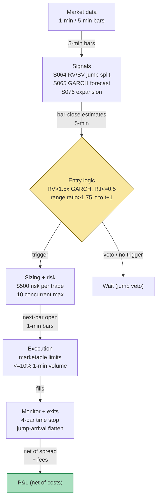

## Stage 142/200 — T042: Jump-Robust Vol Spike Trader

*Batch TB5 · Strategy 42/100 · Signals S064, S065, S076*

*Provenance: [D/SR] — documented signals (S064/S065/S076) combined through strategy rules reconstructed for this chapter; the combination itself is synthetic, not a documented strategy.*

### T1. One-line verdict

| | |
|---|---|
| **Style** | Intraday event-driven volatility trader — directional, short-horizon, jump-filtered |
| **Edge source** | Continuous-volatility expansions persist intraday (volatility clustering), while price jumps are news-driven, gap-like, and untradable after the fact — trade the former, veto the latter |
| **Typical holding period** | Minutes to ~1 hour (12-bar/60-min estimation window on 5-min bars; 4-bar time stop, *example*) |
| **Capacity hint** | Small — single-name intraday entries on expansion bars; the edge is in selection, not size |
| **Build-or-buy in one line** | Build — the jump filter (S064) and the GARCH comparator (S065) are your calibration; no vendor sells your veto threshold |

### T2. Full mechanics

**Jargon first.** *Realized variance* (RV) is the sum of squared intraday returns — it measures total variation including jumps. *Bipower variation* (BV) is a scaled sum of products of *adjacent* absolute returns — it measures only the continuous part, because one jump contaminates at most two adjacent products (S064). The *jump component* is J = max(RV − BV, 0); the *relative jump share* RJ = J/RV is the fraction of variance from jumps. The *Lee–Mykland test* (S064) flags individual bars as jumps against a local-volatility Gumbel critical value. *GARCH(1,1)* (S065) — σ² = ω + αε² + βσ² — is the strategy's "normal vol" benchmark. *Range expansion* (S076) is a bar whose high–low range is a large multiple of its recent average. *Deseasonalization* (S067) divides out the intraday U-shape before any vol computation.

**Universe & session.** 50–200 liquid US equities/ETFs (the worked example uses fictitious "SYNX"). RTH only; exclude the first 15 minutes (*example* — the open is its own regime), earnings days, and halted names. Every threshold below is `example — not an institutional standard`.

**Entry rule.** Evaluated at each 5-minute bar close *i* (returns deseasonalized via S067 first):

1. Compute 60-minute (12-bar) RV and BV (S064 formulas in T3).
2. J = max(RV − BV, 0); RJ = J/RV. **Veto** if RJ > 0.50 (*example*) — the "spike" is jump-driven (news), not a tradable continuous-vol expansion.
3. Compare against the GARCH one-bar-ahead forecast σ̂ (S065, deseasonalized): enter only if RV_60 > 1.50 × σ̂²_60 (*example*) — realized vol must exceed the forecast by a margin, i.e. this is a *surprise*, not the forecast itself.
4. Confirm with S076: the latest bar's range ratio > 1.75 (*example*).
5. Direction: sign of the expansion bar's close minus open (trade *with* the expansion — the second leg is the thesis).

Fill at bar *i+1*'s open. The strategy never trades the expansion bar itself — by the time the bar closes, its move is history.

**Exit rule.** First wins: (1) time stop — exit at the open 4 bars after entry (*example*; the edge, if any, is the immediate follow-through); (2) stop-loss at 1.0× ATR(14) adverse (*example*; ATR = average true range, the trailing mean bar range); (3) jump-arrival flatten — if a mid-trade bar pushes the trailing RJ above 0.50 (*example*), exit at the next open (the thesis broke: this is now a news move); (4) signal flip — a new expansion bar in the opposite direction closes the old position and may open a new one.

**Position sizing.** Vol-targeted per trade: shares = RISK_BUDGET / (σ̂_30 × price), RISK_BUDGET = $500/trade (*example*). Max 2 concurrent positions per name (*example*), max 10 book-wide (*example*) — vol spikes correlate across names on macro news.

**Risk limits.** Daily loss stop −1.5% of book (*example*); max gross 2× equity (*example*); kill switch on bar-feed staleness > 5 minutes (*example*). No entries when the GARCH refit is older than 5 sessions (*example*).

**Cost model.** Half-spread $0.005/share/side + $0.0035/share/side commission (*example*), plus 1 bp slippage on notional for entries (*example* — you are chasing an expansion bar; the open print is optimistic). Applied line-by-line in T4.

**Execution sketch.** Marketable limit orders at the next bar's open; participation ≤10% of trailing 1-minute visible volume (*example*). Queue-position claims on SIP data: `simulated only — requires MBO/ITCH`.

**Causality.** All estimates use bars ≤ *i*; positions fill at *i+1* or later. The Lee–Mykland flag for bar *i* uses the local window ending at *i−1* — no lookahead.

### T3. Signals it consumes

| Signal | Role | Weight / logic |
|---|---|---|
| S064 — Jump-robust RV (RV / bipower / Lee–Mykland) | **Primary trigger** | RV_60 = Σr² over 12 bars; BV_60 = (π/2)Σ\|r_{i−1}r_i\| — summands are raw \|r_{i−1}r_i\|, π/2 applies only to the aggregate; J = max(RV−BV,0); RJ = J/RV; veto if RJ > 0.50 (*example*) |
| S065 — GARCH(1,1) intraday vol | **Forecast comparator / sizer** | σ² = ω + αε² + βσ² (α+β<1); enter only if RV_60 > 1.50×σ̂²_60 (*example*); σ̂_60 sizes the trade |
| S076 — Vol breakout / squeeze | **Expansion confirmation** | Range ratio > 1.75 (*example*); direction = sign of expansion bar; time-stop exits |

```pseudocode
# T042 combination logic — every 5-min bar i (causal: estimates at i, fill at i+1 open)
r   = deseasonalized 5-min returns, last 12 bars     # S067: r_tilde = r / s_b
RV  = sum(r^2); BV = (pi/2)*sum(|r_j-1|*|r_j|)       # S064: |r_j-1|*|r_j| summands are RAW; pi/2 on the aggregate only
J   = max(RV - BV, 0); RJ = J / RV                  # jump share
sig = GARCH_forecast(i)                             # S065 one-bar-ahead, deseasonalized
if RJ > 0.50: veto("jump: news move, untradable")    # example threshold
elif RV > 1.50 * sig^2 * 12 and range_ratio(i) > 1.75:  # example: surprise + expansion
    direction = sign(close_i - open_i)
    shares = 500 / (sqrt(sig^2 * 12) * price)       # example: $500 risk budget
    enter(direction, shares, next_open)
monitor: exit at i+4 open (time stop, example)
         stop-loss 1.0x ATR14 (example)
         flatten if trailing RJ > 0.50              # jump arrived mid-trade
```

### T4. Worked example — numbers + P&L (SYNTHETIC)

All numbers synthetic — fictitious "SYNX", fixed tapes. Script `batches/TB5/plot_T042.py`, **seed 142**; the chart in T9 plots these exact numbers. Cost schedule (*example*): half-spread $0.005/share/side, commission $0.0035/share/side, 1 bp slippage on entry notional.

**Window A — clean continuous vol spike (trade taken).** Twelve fixed 5-min returns (×10⁻⁴): 5.0, −4.0, 7.0, −6.0, 10.0, −14.0, 16.0, −9.0, 11.0, −13.0, 8.0, −7.0. Step-by-step:

1. RV summands r² (×10⁻⁶): 0.25, 0.16, 0.49, 0.36, 1.00, 1.96, 2.56, 0.81, 1.21, 1.69, 0.64, 0.49 → **RV_60 = 1.160×10⁻⁵** (script value).
2. BV summands \|r_{i−1}r_i\| (×10⁻⁶, raw — the π/2 factor applies to the aggregate, not the summands): 0.20, 0.28, 0.42, 0.60, 1.40, 2.24, 1.44, 0.99, 1.43, 1.04, 0.56 → **BV_60 = (π/2) × 10.60×10⁻⁶ = 1.663×10⁻⁵** (script value; exceeds RV in this finite sample — the truncation rule then applies).
3. J = max(RV − BV, 0) = **0**; **RJ = 0.0%** ≤ 50% (*example* veto) → no jump. Pass.4. GARCH benchmark (*example*): per-5-min-bar σ̂² = 0.60×10⁻⁶ (≈7.7 bp/bar — a calm-morning forecast); 60-min benchmark = 7.20×10⁻⁶. Ratio = 1.160/0.720 = **1.61×** ≥ 1.50 (*example*) → surprise confirmed. (The honest calibration: the entry needs realized vol to exceed a *calm* forecast — a spike against an already-elevated forecast is not a surprise.)

5. S076 confirmation (*example* inputs): expansion bar 7 printed H = 200.32, L = 199.98 → range 0.34 vs 10-bar average range 0.12 → ratio **2.83** > 1.75 (*example*). Bar 7 closed at 200.28, up from 199.96 → direction **LONG**.
6. Entry: 200 shares (*example*) at bar-8 open = **$200.28**. (Vol-targeted: σ̂_60 = √(7.20×10⁻⁶) = 0.268%/60-min; with a $500 risk budget ≈ 930 shares — the example uses 200 to keep the illustration small.)
7. Exit: 4-bar time stop → bar-12 open = **$200.22**.

| Line | Calc | $ |
|---|---|---|
| Gross | 200 × (200.22 − 200.28) | −12.00 |
| Spread | 2 × 200 × 0.005 | −2.00 |
| Fees | 2 × 200 × 0.0035 | −1.40 |
| Entry slippage | 1 bp × $40,056 entry notional | −4.01 |
| **Net** | | **−19.41** |

The trade loses — the expansion's follow-through fizzled. That is the honest modal outcome; the strategy's economics live in the *selection* (vetoing jumps), not in any single trade.

**Window B — jump day (vetoed, no trade).** Twelve fixed returns (×10⁻⁴): 3.0, −2.0, 4.0, −3.0, 5.0, −4.0, **90.0**, −6.0, 4.0, −5.0, 3.0, −4.0 — a +90 bp jump at bar 7.

1. RV summands (×10⁻⁶): 0.09, 0.04, 0.16, 0.09, 0.25, 0.16, **81.00**, 0.36, 0.16, 0.25, 0.09, 0.16 → **RV = 8.281×10⁻⁵**.
2. BV summands: the jump appears in only two adjacent products (3.60, 5.40) → **BV = 1.621×10⁻⁵**.
3. J = 8.281 − 1.621 = **6.660×10⁻⁵**; **RJ = 80.4%** > 50% (*example*) → **VETO**. No trade.
4. The Lee–Mykland per-bar check agrees (illustrative): |r_7| = 90×10⁻⁴ against a local σ̂ ≈ 3.5×10⁻⁴ gives L ≈ 26 vs a ~4.6 critical value at α = 1% (*example*) — flagged as a jump.
5. A naive RV-only rule would have fired hard here (RV is 20.7× the calm GARCH benchmark) — straight into a news gap that reverses or gaps beyond any stop. The veto is the strategy.

**Where the example is optimistic.** Window A assumes the GARCH benchmark is known and calm — in production the benchmark adapts upward during the spike, shrinking the 1.61× surprise toward the gate. The jump veto is assumed to classify in real time; the Lee–Mykland test needs its K-bar local window (K = 240 per the literature — far longer than the 12-bar trading window), so intraday jump classification is strictly weaker than the textbook test. Fills are at exact bar opens with no partial fills; slippage is modeled only on the entry (1 bp), not the exit. The tapes are hand-picked: one clean spike, one obvious jump — real data serves ambiguous mixtures where RJ hovers near the 0.50 threshold and the veto flickers.

### T5. Data & infra — what must run

**Pipeline inventory.** Pre-open: resample 1-min → 5-min bars, compute the S067 diurnal scale (rolling 20-day, *example*), refit GARCH(1,1) per symbol (weekly, 20–60 days of 5-min bars, *example* — S065), publish the per-bar σ̂ path and the RJ veto state. Intraday (5-min): deseasonalize, update trailing-12-bar RV/BV/RJ, evaluate entry gates, manage open positions against the time stop and jump-arrival flatten. Post-close: persist bars + signal path; log every veto with its RJ (the veto log is the strategy's research asset). Storage: 1-min bars for 200 symbols ≈ 20 MB/day (per notes/cost-model.md §4) → ~0.5 GB per 20 trading days.

**M5 Max feasibility: feasible (Tier M+).** Per notes/cost-model.md §2: the per-bar math is a handful of rolling sums — microseconds per symbol in numpy; the GARCH refit is seconds per symbol weekly. The S064/S065 chapters rate their signals Tier M (20–60 h ≈ $3,000–9,000 loaded-cost estimate, §5); the strategy harness (veto state machine, execution, monitoring) pushes this to Tier M+, 40–100 h ≈ **$6,000–15,000** loaded-cost estimate. RAM: working set is megabytes (§3). Bottleneck: not compute — it is the *research* cost of calibrating the veto threshold and the GARCH benchmark per symbol. Breaks at: nothing on this box at 200 symbols; at 500+ symbols with per-symbol GARCH refits, batch the refits overnight.

**Feed-outage safe mode.** Bar feed stale > 5 minutes (*example*): no new entries. GARCH refit fails: freeze the last benchmark and widen the entry gate to 2.0× (*example*). RJ inconclusive: default to **veto** — fail-safe is "don't trade." Open positions during an outage follow the time stop on the last known bar count; the jump-arrival flatten is suspended and the stop-loss tightened to 0.7× ATR (*example*).

### T6. Buy vs build

| Option | What you get | Indicative price | Gains | Loses |
|---|---|---|---|---|
| Tier-0 free (Stooq, Alpaca IEX) | Daily/15-min bars | ~$0, *indicative — verify before budgeting* | Free prototyping of the RV/BV arithmetic | No true 5-min tape; jump tests need intraday bars |
| Tier-1 retail (Polygon Stocks Advanced, Alpaca SIP) | 1-min/real-time SIP bars | ~$30–200/mo, *indicative — verify before budgeting* | Everything this strategy needs | SIP timestamps fine at 5-min horizons |
| Tier-2 professional (Databento Standard) | L1 bars + trades, clean symbology | ~$200/mo + usage, *indicative — verify before budgeting* | Honest bar timestamps; trade-level Lee–Mykland variants | Overkill for a 5-min bar strategy |
| QuantConnect / retail algo platform | Backtest + paper + data bundled | subscription varies, *indicative — verify before budgeting* | Fastest path to a paper test | Jump-filter plumbing is yours anyway |
| Build in-house (Python + polars) | Full signal + veto + execution | 40–100 h ≈ $6,000–15,000 eng (loaded-cost estimate) | Your veto threshold, your benchmark, auditable | You own the calibration |

**Verdict: build on Tier-1 bars.** The jump veto is the strategy's only defensible component, and the veto threshold is a calibration choice no vendor can make for you — buy the bars (~$30–200/mo, indicative), build the filter. A platform only buys you paper-trading infrastructure; the signal work remains yours either way.

### T7. Success-ratio evidence

| Source | Market / period | Metric | Before/after cost | Caveat |
|---|---|---|---|---|
| Barndorff-Nielsen & Shephard (2004), *JFEC* | Theory + simulations | BV consistent for integrated variance; RV − BV isolates the jump component | n/a (theory) | Measurement machinery, not a trading result |
| Lee & Mykland (2008), *RFS* | Theory + US equities | Nonparametric per-interval jump test with known asymptotic distribution | n/a | Detection, not profitability; needs long local windows |
| Andersen, Bollerslev & Diebold (2007), *Rev. Econ. Stat.* | US equities/FX | Separating the jump component (HAR-CJ) improves volatility *forecasts* vs HAR-RV | Before cost (forecast loss) | Forecast improvement, not a traded P&L |
| S076 evidence (Fang et al. 2014; EdgeTools ~20M tests) | Indexes, futures | Expansion/squeeze predicts future *volatility*, not *direction* | Before cost | The directional leg of T042 has ~zero documented edge standalone |

Capacity and decay: the veto is a filter, not an alpha — it cannot decay the way a predictive signal does, but its value decays if jumps become *tradable* (e.g. scheduled-event jumps with listed options). The expansion-entry leg inherits S076's documented record: roughly a coin flip on direction, weak-to-zero standalone edge in modern data.

**Honest bottom line.** For a ≤$1M paper operation: this is a research-grade construction, not a documented strategy. The components are real econometrics (BNS, Lee–Mykland, ABD), but no checkable source demonstrates an *after-cost traded* Sharpe for jump-filtered vol-spike entries — the literature proves you can *measure* jumps and *forecast* vol better, not that you can *trade* the difference profitably at 5-minute horizons. Paper-trade it as a veto overlay on an existing book (lower evidence burden: avoiding bad trades) before trading it standalone.

### T8. Failure modes & pitfalls

1. **Jump misclassification** — Lee–Mykland false negatives let news jumps through; false positives veto the best continuous spikes. *Mitigation:* the RJ-share veto (a second, independent test) plus the conservative default (inconclusive → veto).
2. **Microstructure noise inflates RV** — bid–ask bounce on 5-min bars looks like continuous vol. *Mitigation:* deseasonalize (S067); use 10–15 min bars on less liquid names.
3. **Expansion-bar slippage** — entering at the next open after a range-expansion bar means buying the top of the move. *Mitigation:* the 1 bp entry-slippage line in the cost model; the GARCH-surprise gate keeps not every expansion bar trading.
4. **GARCH benchmark lag** — the forecast adapts to the spike and the 1.50× gate stops firing mid-event. *Mitigation:* freeze the benchmark at the pre-spike value for the event window (*example*); log gate failures.
5. **Stale diurnal scale** — S067 drift mis-measures the spike. *Mitigation:* rolling 20-day window (*example*); monitor residual open/close seasonality.
6. **Correlated spikes** — macro news fires the entry on all names at once; the book-level cap binds and fills degrade. *Mitigation:* book-level concurrent cap; de-duplicate by market beta; no new entries ±5 min around scheduled releases (*example*).
7. **Time-stop arbitrariness** — 4 bars is a guess; the follow-through horizon varies. *Mitigation:* parameterize the stop by the expansion bar's range (*example*); sensitivity-check, don't optimize.
8. **Threshold overfitting** — 0.50 / 1.50 / 1.75 are three free parameters on 5-min data. *Mitigation:* fix from the literature first, one-at-a-time sensitivity, embargoed out-of-sample (S088).

### T9. Visuals


Top panel: the Window-A 5-min close tape with the expansion bar shaded, the long entry (green triangle, bar-8 open $200.28) and the time-stop exit (red triangle, bar-12 open $200.22), annotated "net −$19.41". Bottom panel: per-interval RV vs raw BV summands (×10⁻⁶; π/2 applies to the BV aggregate, not the summands) — Window A: RV = 1.160×10⁻⁵, BV = 1.663×10⁻⁵, J = 0, RJ = 0.0% → TRADE; Window B: RV = 8.281×10⁻⁵, BV = 1.621×10⁻⁵, J = 6.660×10⁻⁵, RJ = 80.4% → VETO. Watermark reads "SYNTHETIC EXAMPLE" exactly; corner caption reads "synthetic data — not market data".



### T10. Sources

- Barndorff-Nielsen, O. E. & Shephard, N. (2004). "Power and Bipower Variation with Stochastic Volatility and Jumps." *Journal of Financial Econometrics* 2(1), 1–37. https://public.econ.duke.edu/~get/browse/courses/883/Spr16/COURSE-MATERIALS/Z_Papers/BNSJFEC2004.pdf (carried from S064's verified source list) — BV consistent for integrated variance; RV − BV isolates jumps.
- Lee, S. S. & Mykland, P. A. (2008). "Jumps in Financial Markets: A New Nonparametric Test and Jump Dynamics." *Review of Financial Studies* 21(6), 2535–2563. http://ideas.repec.org/a/oup/rfinst/v21y2008i6p2535-2563.html (carried from S064's verified source list) — the per-interval jump test with Gumbel critical values.
- Andersen, T. G., Bollerslev, T. & Diebold, F. X. (2007). "Roughing It Up: Including Jump Components in the Measurement, Modeling, and Forecasting of Return Volatility." *Review of Economics and Statistics*. https://www.sas.upenn.edu/~fdiebold/papers/paper56/abd_081605.pdf (carried from S064's verified source list) — separating jumps improves volatility forecasts.
- Corsi, F. (2009). "A Simple Approximate Long-Memory Model of Realized Volatility." *Journal of Financial Econometrics* 7(2), 174–196. http://ideas.repec.org/a/oup/jfinec/v7y2009i2p174-196.html — the HAR family the GARCH benchmark is compared against.

**Unverified leads** (chatbot-provided, not independently checkable — do not treat as evidence):
- Grok's Q-TB5-1–Q-TB5-3 answers contain no jump-robust vol-spike mechanics — the entry/veto combination logic is operator-constructed from S064/S065/S076 and marked as such.
- *Unverified chatbot claim* (Grok, 2026-09-10, Q-TB5-2): "GEX that updates every minute on 'live OI' is marketing" — not used here (options-free strategy), listed for batch completeness.
- *Unverified chatbot claim* (Grok, 2026-09-10, Q-TB5-3): the retail-options spread table, attributed to Barardehi–Bogousslavsky–Muravyev (2025) — not independently verified, not used in this chapter's cost model.

Source log: Grok answered Q-TB5-1..3 (2026-09-10); all claims independently verified or labeled unverified.
