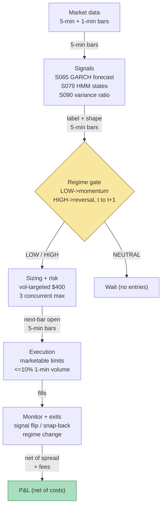

## Stage 143/200 — T043: GARCH Regime Filter

*Batch TB5 · Strategy 43/100 · Signals S065, S079, S090*

### T1. One-line verdict

| | |
|---|---|
| **Style** | Intraday regime-switching strategy — the book trades momentum in low-vol regimes and reversal in high-vol regimes, with a neutral zone where it does nothing |
| **Edge source** | Volatility regimes change the *shape* of intraday returns: low-vol states sustain trends (persistence pays momentum), high-vol states snap back (anti-persistence pays reversal) — GARCH says which state, the HMM confirms it, variance ratios confirm the shape |
| **Typical holding period** | 10 minutes to 2 hours (momentum: up to 2 hours, *example*; reversal: minutes to ~30 min, *example*) |
| **Capacity hint** | Small — the regime label applies to the index/ETF tape, and trades are single-name intraday; crowding in "regime momentum" would erase the trigger moves |
| **Build-or-buy in one line** | Build the GARCH + regime logic (the S065 code plus a filter); buy nothing except the 5-minute bars |

### T2. Full mechanics

**Jargon first.** *GARCH(1,1)* (S065) models today's variance as a mix of yesterday's variance and yesterday's squared shock: σ²_t = ω + αε²_{t−1} + βσ²_{t−1}. A *volatility regime* is a persistent market state (calm vs turbulent); the bet is that the *tradeable pattern* differs by regime. *HMM* (S079) infers the current hidden state from the recent return distribution via the forward algorithm. *Variance ratio* (VR, S090) compares k-period return variance to k × 1-period variance — VR(k) > 1 means *persistence* (trends; H > 0.5), VR(k) < 1 means *anti-persistence* (mean reversion; H < 0.5). *Deseasonalization* (S067) divides intraday returns by their time-of-day scale. *Hysteresis* means the on/off thresholds differ — entering a regime is harder than leaving it — stopping label flicker.

**Universe & session.** Liquid US ETFs and their top constituents (the worked example uses fictitious "SYNX"). RTH only; the regime label is estimated on the ETF/market tape and applied to single-name trades. Exclude earnings days and the first 15 minutes (*example*). Every threshold below is `example — not an institutional standard`.

**The regime label.** At each 5-minute bar close *t* (all inputs causal, through *t*):

1. **GARCH forecast (S065).** Fit GARCH(1,1) on deseasonalized (S067) 5-minute returns; compute the one-bar-ahead forecast σ̂_t (in basis points per 5-min bar). Compare to the trailing 20-day median (*example*):
   - LOW-vol: σ̂_t < 0.90 × median (*example*)
   - HIGH-vol: σ̂_t > 1.10 × median (*example*)
   - Between: NEUTRAL — no new entries, existing positions managed to exit.
2. **HMM confirmation (S079).** Run the 2-state HMM forward algorithm on the same deseasonalized returns; require agreement with GARCH: calm-state probability > 0.5 (*example*) for LOW, volatile-state probability > 0.5 (*example*) for HIGH. Disagreement → NEUTRAL — the HMM is the independent witness against GARCH drift.
3. **Persistence confirmation (S090).** Compute VR(4) on the last 2 hours (*example*) of 1-min returns: momentum requires VR(4) > 1.05 (*example*, Ĥ ≈ 0.56 at VR = 1.18); reversal requires VR(4) < 0.95 (*example*, Ĥ ≈ 0.43 at VR = 0.83). Wrong shape → NEUTRAL — the tape must currently *behave* the way the regime predicts.
4. **Hysteresis.** Once in LOW, exit only if σ̂_t > 0.95 × median (*example*); once in HIGH, exit only if σ̂_t < 1.05 × median (*example*). Regime changes are announced at the bar close and tradable at the next bar's open.

**Entry rule.** Fills at bar *t+1*'s open or later; the signal is computed at *t*.

- **LOW-vol → momentum book.** Enter with the trailing-20-bar (*example*) 5-min return if |return| > 0.25% (*example*).
- **HIGH-vol → reversal book.** After a 5-bar (*example*) move of |return| > 0.50% (*example*), enter *against* the move.
- **NEUTRAL → no new entries.** Roughly half the trading day (*example* estimate) is NEUTRAL — the strategy sits out.

**Exit rule.** Momentum: exit on signal flip, trailing stop at 1.5× the entry-bar range (*example*), or regime change — first wins. Reversal: exit at the first 5-min bar closing back through entry (*example*), stop-loss 0.50% adverse (*example*), or regime change — first wins. Reversal holds are deliberately short.

**Position sizing.** Vol-targeted: shares = RISK_BUDGET / (σ̂_t × price), RISK_BUDGET = $400/trade (*example*). The example below uses fixed 300/200-share sizes for illustration. Max 3 concurrent positions (*example*); max gross 1.5× equity (*example*).

**Risk limits.** Daily loss stop −1.5% (*example*); if the GARCH refit is older than 5 sessions (*example*), force NEUTRAL — an uncalibrated regime filter is a random label generator. Kill switch on HMM divergence → NEUTRAL until refit.

**Cost model.** Half-spread $0.005/share/side + $0.0035/share/side commission (*example*). Regime strategies trade in bursts when the label holds for hours — model burst turnover explicitly; the neutral zone is what keeps the cost line survivable.

**Execution sketch.** Bar-close signals, next-open marketable limits, participation ≤10% of trailing 1-min volume (*example*). Queue-position claims on SIP data: `simulated only — requires MBO/ITCH`.

**Causality.** GARCH forecast at *t* uses returns through *t*; HMM forward pass uses observations through *t* (online inference, S079); VR(4) uses returns through *t*; entries fill at *t+1* or later.

### T3. Signals it consumes

| Signal | Role | Weight / logic |
|---|---|---|
| S065 — GARCH(1,1) intraday vol | **Regime label (primary)** | σ² = ω + αε² + βσ² (α+β<1), deseasonalized input; LOW < 0.90×median, HIGH > 1.10×median (*example*) |
| S079 — HMM regime inference | **Independent confirmation** | 2-state HMM, forward algorithm on observations ≤ *t*; must agree with GARCH or → NEUTRAL |
| S090 — Variance ratio / Hurst | **Shape confirmation** | VR(4) = Var(r(4))/(4·Var(r)); momentum needs VR(4) > 1.05, reversal needs VR(4) < 0.95 (*example*); Ĥ = ½[1 + ln VR/ln 4] |

```pseudocode
# T043 combination logic — regime label at bar t, entries tradable t+1
sig   = GARCH_forecast(t)                            # S065, deseasonalized input
med   = trailing_median(sig, 20 days)                # example window
hmm_p = HMM_forward(r_5min)[volatile]                # S079, observations through t only
vr4   = variance_ratio(r_1min, k=4)                   # S090 persistence read
if sig < 0.90*med and vr4 > 1.05 and hmm_p < 0.5:     # example: LOW-vol regime
    book = "momentum"
elif sig > 1.10*med and vr4 < 0.95 and hmm_p > 0.5:   # example: HIGH-vol regime
    book = "reversal"
else: book = "flat"                                  # neutral zone: no entries
if book == "momentum" and abs(ret_20bar) > 0.25%:     # example trigger
    enter(sign(ret_20bar), vol_target_size, next_open)
if book == "reversal" and abs(ret_5bar) > 0.50%:      # example trigger
    enter(-sign(ret_5bar), vol_target_size, next_open)
exits: momentum -> signal flip or regime change
       reversal  -> snap-back completion or regime change
```

### T4. Worked example — numbers + P&L (SYNTHETIC)

All numbers synthetic — fictitious "SYNX"; the GARCH path is generated, the trades are fixed. Script `batches/TB5/plot_T043.py`, **seed 143**; the chart in T9 plots these exact trades. Cost schedule (*example*): half-spread $0.005/share/side, commission $0.0035/share/side.

Setup: trailing 20-day GARCH median = **19.5 bp per 5-min bar** (synthetic). Thresholds (*example*): LOW-vol < 0.90 × 19.5 = **17.55 bp**; HIGH-vol > 1.10 × 19.5 = **21.45 bp**; between = NEUTRAL.

**Trade T1 — LOW-vol momentum.** 10:00: GARCH forecast reads **14.2 bp** < 17.55 → LOW candidate. HMM calm-state probability **0.82** (*example*, > 0.5) → agrees. VR(4) = **1.18** > 1.05 (*example*) → persistence confirmed (Ĥ ≈ 0.56). Book = momentum. 10:05: trailing-20-bar return = +0.31% (> 0.25%, *example*) → **long 300 shares @ $200.00**. Exit 11:10 on signal flip @ **$200.58**.

| Line | Calc | $ |
|---|---|---|
| Gross | 300 × (200.58 − 200.00) | +174.00 |
| Spread | 2 × 300 × 0.005 | −3.00 |
| Fees | 2 × 300 × 0.0035 | −2.10 |
| **Net T1** | | **+168.90** |

**Trade T2 — HIGH-vol reversal.** 13:35: GARCH forecast reads **26.0 bp** > 21.45 → HIGH candidate. HMM volatile-state probability **0.78** (*example*, > 0.5) → agrees. VR(4) = **0.83** < 0.95 (*example*) → anti-persistence confirmed (Ĥ ≈ 0.43). Book = reversal. 13:40: trailing-5-bar move = −0.62% (|·| > 0.50%, *example*) → **long 200 shares @ $199.10** (against the down-move). Exit 14:05 on snap-back through entry @ **$199.62**.

| Line | Calc | $ |
|---|---|---|
| Gross | 200 × (199.62 − 199.10) | +104.00 |
| Spread | 2 × 200 × 0.005 | −2.00 |
| Fees | 2 × 200 × 0.0035 | −1.40 |
| **Net T2** | | **+100.60** |

Cumulative net: +168.90 + 100.60 = **+$269.50**. The midday 11:30–13:00 stretch (forecast between 17.55 and 21.45 bp) was NEUTRAL — no entries, no costs, no P&L.

**Where the example is optimistic.** Both trades are hand-picked winners with the regime label, the HMM, and the variance ratio all agreeing — real days serve disagreement, and the honest strategy then sits in NEUTRAL earning nothing while the data stack accrues cost. The GARCH path is generated, not estimated — real forecasts have estimation error that blurs the 0.90/1.10 bands, and the crisp crossings (14.2, 26.0) paper over threshold-flicker. The HMM probabilities (0.82, 0.78) are asserted, not computed — a real forward pass on ambiguous data returns 0.55/0.45 mush. Fills are at exact stated prices with no partial fills. The momentum entry assumes the +0.31% move is a *trend* and not the top of one — the strategy cannot know which, and the example never shows the losing case.

### T5. Data & infra — what must run

**Pipeline inventory.** Pre-open: resample to 5-min, update the S067 diurnal scale (rolling 20-day, *example*), refresh GARCH(1,1) per symbol (weekly, 20–60 days of 5-min bars, *example*), refit the HMM monthly (*example*), publish the trailing median and regime thresholds. Intraday (5-min): deseasonalize, compute σ̂_t, run the HMM forward pass (observations through *t*), compute VR(4) on trailing 1-min returns, publish the regime label for *t+1*. Post-close: persist bars, labels, trigger log; rebuild medians. Storage: 1-min bars for the ETF tape + 200 names ≈ 20 MB/day (per notes/cost-model.md §4) → ~0.5 GB per 20 trading days.

**M5 Max feasibility: feasible (Tier M+).** Per notes/cost-model.md §2: the per-bar GARCH recursion is microseconds; the HMM forward pass over 2 states × 78 bars is milliseconds; VR(4) is a rolling variance — the whole 5-min loop is single-digit milliseconds per symbol. S065 is Tier M (20–60 h ≈ $3,000–9,000 loaded-cost estimate, §5); the HMM + VR + regime state machine + execution → Tier M+, 40–100 h ≈ **$6,000–15,000** loaded-cost estimate. RAM: working set megabytes (§3). Bottleneck: calibration research — not compute.

**Feed-outage safe mode.** 5-min feed stale > 5 minutes (*example*): label freezes; no new entries; existing positions follow child exits. GARCH input stale > 1 session: force NEUTRAL. HMM forward pass fails: fall back to GARCH-only label with widened bands (0.85/1.15, *example*). Both down: NEUTRAL, manage exits only. Resume requires a full recomputation, never a stale label.

### T6. Buy vs build

| Option | What you get | Indicative price | Gains | Loses |
|---|---|---|---|---|
| Tier-0 free (Stooq, Alpaca IEX) | Daily bars | ~$0, *indicative — verify before budgeting* | Free | No 5-min tape — regime labels need intraday bars |
| Tier-1 retail (Polygon Stocks Advanced, Alpaca SIP) | 1-min/real-time SIP bars | ~$30–200/mo, *indicative — verify before budgeting* | Everything this strategy needs | Nothing material at 5-min horizons |
| Tier-2 professional (Databento Standard) | L1 bars + trades | ~$200/mo + usage, *indicative — verify before budgeting* | Honest timestamps; tick-level HMM variants | Overkill for 5-min labels |
| QuantConnect / retail algo platform | Data + backtest + paper bundled | subscription varies, *indicative — verify before budgeting* | Fastest paper test | Regime plumbing is yours regardless |
| Build in-house (Python + polars) | GARCH + HMM + VR + execution | 40–100 h ≈ $6,000–15,000 eng (loaded-cost estimate) | Your bands, your state machine, auditable | You own the calibration |

**Verdict: build on Tier-1 bars.** The regime bands (0.90/1.10), the HMM state count, and the VR windows encode *your* risk tolerance — no vendor sells them. **Buy** the 1-min bars (~$30–200/mo, indicative); **build** the filter. A managed platform only if you have zero engineering — and a black-box label you can't recompute is a liability, not an asset.

### T7. Success-ratio evidence

| Source | Market / period | Metric | Before/after cost | Caveat |
|---|---|---|---|---|
| Jegadeesh & Titman (1993), *J. Finance* | US equities, 1965–1989 | 3–12 month momentum: significant positive abnormal returns | Before cost | Monthly horizon, not intraday; the low-vol→momentum leg borrows this at a different frequency |
| Lehmann (1990), *QJE* | US equities, weekly | Short-term (1-week) reversal profits persist after "plausible transaction costs" | After-cost (author's cost model) | Weekly, not intraday; the high-vol leg is its intraday cousin |
| Barroso & Santa-Clara (2015), *JFE* | US momentum, 1927–2011 | Risk-managed (vol-scaled) momentum nearly doubles Sharpe, eliminates crashes | Before-cost headline | The regime idea's closest documented relative |
| Guidolin & Timmermann (2007), *J. Econometrics* | UK equities | Four-state regime model captures nonlinear return dynamics | Before cost (model fit) | Regime *measurement*, not a traded strategy |
| Ang & Timmermann (2011), NBER | Survey | Regime-switching models improve return forecasts | Before cost | Survey of models, not a strategy P&L |

Capacity and decay: the momentum leg decays with crowding (the low-vol trend is the most crowded intraday pattern in existence); the reversal leg decays as liquidity provision gets faster. The NEUTRAL zone is the capacity defense — it refuses to trade when the label is weak, which is most of the day.

**Honest bottom line.** For a ≤$1M paper operation: a coherent research construction with genuine academic relatives (momentum, weekly reversal, regime-switching models) but **no checkable source demonstrates an after-cost traded P&L for a GARCH→momentum / GARCH→reversal intraday switcher**. The evidence chain is: momentum works at monthly horizons (JT 1993), reversal works at weekly horizons after costs (Lehmann 1990), vol states change momentum's risk (Barroso–Santa-Clara 2015) — the chapter stitches these across frequencies, and the stitching is the unverified part. Paper-trade it for six months against an always-momentum benchmark and demand the switcher wins after costs. An institutional desk would run the regime label as a *risk* input (T041) rather than as the entry trigger.

### T8. Failure modes & pitfalls

1. **Regime-label flicker** — the GARCH forecast oscillates around the 0.90/1.10 bands; the book flips momentum↔flat↔reversal and trades itself to death. *Mitigation:* hysteresis (0.95/1.05 exit bands, *example*); the HMM confirmation already halves the flicker.
2. **Witness disagreement** — GARCH says LOW, HMM says volatile; the strategy sits in NEUTRAL while the tape trends without it. *Mitigation:* disagreement is information — log it, don't override it; review the disagreement tape weekly.
3. **Wrong-shape trades** — the label is right but VR(4) is stale and the tape's persistence already broke. *Mitigation:* evaluate the VR gate at the same bar as the trigger, not once per regime.
4. **GARCH estimation lag** — after a true regime change, the forecast takes days to cross the band; the strategy trades the old regime's book. *Mitigation:* the HMM (faster-moving) can force NEUTRAL even when GARCH still says LOW.
5. **Momentum entry at the top** — the +0.25% trigger fires on exhaustion, not inception. *Mitigation:* require VR(4) to be *rising*, not just above 1.05 (*example*); time-stop the momentum leg.
6. **Reversal into a real breakdown** — the −0.50% move is the start of a crash; fading it is catching a knife. *Mitigation:* the HMM volatile-state confirmation plus the tight 0.50% stop (*example*); never add to a losing reversal.
7. **Stale diurnal scale** — S067 drift mis-measures σ̂_t at the open/close; the label misfires twice a day. *Mitigation:* rolling 20-day window (*example*); monitor residual seasonality.
8. **Parameter overfitting** — many free parameters on intraday data. *Mitigation:* fix bands from the literature first, one-at-a-time sensitivity, embargoed out-of-sample (S088).

### T9. Visuals


Top panel: the synthetic GARCH forecast path (bp per 5-min bar, seed 143) with the LOW band (< 17.55 bp, green), HIGH band (> 21.45 bp, red), and NEUTRAL zone; the 10:00 momentum entry (14.2 bp) and 13:35 reversal entry (26.0 bp) are marked. Bottom panel: the two trades (long 300 @ $200.00 → $200.58, net +$168.90; long 200 @ $199.10 → $199.62, net +$100.60) and the cumulative net +$269.50 step line. Watermark reads "SYNTHETIC EXAMPLE" exactly; corner caption reads "synthetic data — not market data".



### T10. Sources

- Engle, R. F. (1982). "Autoregressive Conditional Heteroskedasticity with Estimates of the Variance of United Kingdom Inflation." *Econometrica* 50(4), 987–1007; Bollerslev, T. (1986). "Generalized Autoregressive Conditional Heteroskedasticity." *Journal of Econometrics* 31(3), 307–327. (Journal references per S065 — specific URLs not spot-checked 2026-09-10; verify before citing in print.) — the GARCH(1,1) recursion σ²_t = ω + αε²_{t−1} + βσ²_{t−1} behind the regime label.
- Ang, A. & Timmermann, A. (2011). "Regime Changes and Financial Markets." NBER Working Paper 17182. https://www.nber.org/papers/w17182 (carried from S079's verified source list) — regime-switching models and their forecasting record.
- Jegadeesh, N. & Titman, S. (1993). "Returns to Buying Winners and Selling Losers." *Journal of Finance* 48(1), 65–91. https://www.jstor.org/stable/2328882 (verified 2026-09-10 — JSTOR record matches title/authors) — momentum's documented abnormal returns (the low-vol leg's ancestor).
- Lehmann, B. N. (1990). "Fads, Martingales, and Market Efficiency." *Quarterly Journal of Economics* 105(1), 1–28. https://doi.org/10.2307/2937816 (verified 2026-09-10 via EconPapers — matches authors, journal, pages) — short-term reversal profits persist after plausible transaction costs (the high-vol leg's ancestor).
- Barroso, P. & Santa-Clara, P. (2015). "Momentum Has Its Moments." *Journal of Financial Economics* 116(1), 111–120. https://doi.org/10.1016/j.jfineco.2014.11.010 (DOI verified 2026-09-10 via EconPapers/RePEc) — volatility state changes the momentum trade: risk-managed momentum nearly doubles Sharpe and eliminates crashes.

**Unverified leads** (chatbot-provided, not independently checkable — do not treat as evidence):
- *Unverified chatbot claim* (Grok, 2026-09-10, Q-TB5 answers): brief mentions of HMM/GARCH tooling in the strategy context — no performance figures or thresholds from Grok were used in this chapter; the bands, triggers, and HMM readings are operator-chosen `example` values.
- The 0.90/1.10 GARCH bands, 20-day median window, 2-state HMM, VR(4) windows, and all trigger levels are operator constructions, not literature values — flagged as `example` throughout; they require out-of-sample validation (S088) before any capital use.

Source log: Grok answered Q-TB5-1..3 (2026-09-10); all claims independently verified or labeled unverified.
