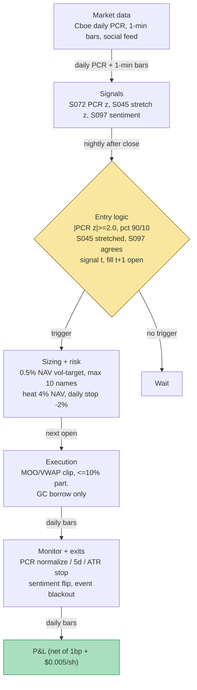

## Stage 148/200 — T048: Put/Call Ratio Contrarian

*Batch TB5 · Strategy 48/100 · Signals S072, S097, S045*

### T1. One-line verdict

| | |
|---|---|
| **Style** | Daily contrarian swing on options-order sentiment extremes: buys panic, sells euphoria |
| **Edge source** | Normalized put/call ratio (S072) flags sentiment extremes; the fade is timed by stretched intraday moves (S045) and contextualized by social/news sentiment (S097) — betting that extreme one-sided options demand mean-reverts over 1–5 sessions |
| **Typical holding period** | 1–5 sessions (*example* time stop); exits on PCR normalization, not a calendar date |
| **Capacity hint** | Liquid large-cap US equities and index ETFs; single-name equity leg is ordinary stock flow — capacity in the low hundreds of $mm of gross before the fade itself moves mid-cap closes, but the documented edge is thin and the institutional version already trades it |
| **Build-or-buy in one line** | Build the PCR normalization engine yourself on free Cboe daily data (the IP is the normalization and the veto gates, not the raw ratio); buy nothing except the bar data you already have |

### T2. Full mechanics

**Jargon first.** The *put/call ratio (PCR)* is put option volume (or open interest — contracts outstanding) divided by call volume over a session: PCR > 1 means more puts traded. *Contrarian* = trading against the crowd: buying panic, selling euphoria. *Fade* = take the opposite side of an extreme. A *z-score* is (value − typical value)/dispersion. *MAD* = median absolute deviation, an outlier-resistant dispersion measure. *Percentile rank* = the fraction of history the current reading exceeds. The *equity-only PCR* (single stocks) differs structurally from the *index PCR* (SPX/SPY): index PCR > 1 is normal (the institutional put-hedge bid); equity PCR < 1 is normal (retail call speculation) — never compare the two against one absolute threshold (see S072). *Open interest (OI)* = contracts outstanding at the close. *Delta* = an option's sensitivity to a $1 move in the underlying. *NAV* = net asset value. *Heat* = total open risk. *RTH* = regular trading hours (9:30–16:00 ET).

**Universe & session.** ~100–300 liquid US large-caps (price ≥ $20, 60-day ADV ≥ $5M *example*) plus SPY/QQQ/IWM-class ETFs for the index-PCR variant. Signals computed after the close; entries at the next open — strictly causal, t → t+1. Exclusions: earnings ±2 days (*example*), FOMC/CPI days for index fades (*example*), halts, borrow above GC+200 bp (*example*) for shorts.

**Entry rule.** Compute at the close of day *t* (MASTER.md S072 formulas): volume PCR = puts traded / calls traded; optionally the delta-weighted form so deep-OTM lottery tickets do not dominate; robust z = (PCR − trailing-60-day median) / (1.4826 × MAD) (*example* windows); plus the percentile rank in the trailing 1-year distribution (*example*).

**Enter at the next open** when ALL hold (*example* thresholds): (1) **PCR extreme (S072):** |z| ≥ 2.0 AND percentile ≥ 90th (put panic) or ≤ 10th (call euphoria); (2) **stretched move (S045):** session stretched-move |z| ≥ 2.0 in the same direction as the panic — an extreme PCR without a stretched move is positioning, not a fade setup; (3) **sentiment agreement (S097):** sentiment z signed with the crowd tilt — bearish (negative) at put panic, bullish (positive) at call euphoria — with volume-z elevated. Direction: PCR z ≥ +2 → **buy**; PCR z ≤ −2 → **sell/short**. Equity-only PCR for single names, index PCR for ETFs; never mix the series.

**Exit rule** (first wins): (1) normalization — PCR z back inside ±0.5 (*example*); (2) time stop — 5 sessions (*example*); (3) stop-loss — 1.5× the 20-day ATR (*example*) or −1.2% of NAV (*example*); (4) sentiment flip — S097 z reverses sign with volume (the crowd was right).

**Position sizing.** Vol-targeted: size_i = (0.5% of NAV, *example* risk budget) / (20-day realized daily vol × entry price); max 10 concurrent names (*example*); per-name notional ≤ 5% of ADV (*example*). Portfolio heat: Σ open risk ≤ 4% of NAV (*example*); gross ≤ 2× NAV; index-ETF legs may carry 2× single-name size (*example*).

**Risk limits** (*examples*). Daily loss stop −2% of NAV ⇒ flat all fades, re-arm next session. Event blackout: no new entries 2 days before FOMC/CPI/NFP. Kill-switch: two consecutive −2% days ⇒ book flat, strategy paused pending review.

**Cost model.** Stock leg: $0.005/share commission-equivalent + 1 bp slippage on notional each way (*example* retail-ish, from the TB5 shared fee schedule). No borrow assumed — short leg restricted to GC names; specials vetoed pre-entry. Options are never traded in this strategy (the ratio is read, not bought) — applied explicitly in T4.

**Order/execution sketch.** Next-open MOO or first-15-min VWAP clip (*example*), participation ≤ 10% of the opening bin (*example*); fill assumed at the printed open in T4 (flagged optimistic). Backtest honesty: signal on day *t*'s final PCR ⇒ fill at day *t+1*'s open; never fill on *t*'s close.

### T3. Signals it consumes

| Signal | Role | Weight / logic |
|---|---|---|
| S072 — Put/call ratio | **Primary trigger** | Enter only if \|PCR z\| ≥ 2.0 AND percentile ≥ 90th / ≤ 10th (*examples*) |
| S045 — Stretched-move z-score | **Timing gate** | Enter only if session stretched-move \|z\| ≥ 2.0 (*example*) in the same direction as the crowd tilt |
| S097 — Social/media sentiment | **Context filter** | Enter only if sentiment composite z agrees in sign with the crowd tilt and volume-z is elevated (*example*) |

```pseudocode
# T048 combination logic — nightly after close; fills at next open (t -> t+1)
for i in universe:
    z72, pct72 = pcr_zscore_and_percentile(i, close_t)   # S072, L=60d, 1yr pct (examples)
    z45 = stretched_move_z(i, close_t)                  # S045 (example entry 2.0)
    z97, vol97 = social_sentiment(i, close_t)            # S097 composite
    panic  = (z72 >= 2.0 and pct72 >= 90) and (z45 <= -2.0) and (z97 <= -1.5)  # examples
    euphor = (z72 <= -2.0 and pct72 <= 10) and (z45 >= 2.0) and (z97 >= 1.5)   # examples
    if position[i] is None and (panic or euphor):
        enter (long if panic else short), size = 0.5% NAV / (rv20 * price), next open
    elif position[i] is not None:
        if abs(z72) < 0.5 or held >= 5d or adverse_move > 1.5*ATR:  # examples
            exit at next open
```

### T4. Worked example — numbers + P&L (SYNTHETIC)

All prices synthetic, **seed 148** (`rng = np.random.default_rng(148)`; regenerable via `python3 batches/TB5/plot_T048.py`). Costs: $0.005/share + 1 bp each way (*example*). T9 plots this exact path and both trades. Fictional large-cap "XLQ", 500 shares per trade. Tape (day: close, PCR z, S045 z, S097 z) — 0: 100.00, +0.4, −0.5, +0.1 · 1: 99.44, +1.1, −1.2, +0.9 · **2: 97.10, +2.6, −2.4, −2.4** ← put-panic · 3: 98.40, +0.7, −0.6, +0.5 · 4: 102.17, −0.3, +0.4, −0.2 · 5: 101.07, −0.9, +1.1, −0.8 · 6: 99.42, −1.4, +1.6, −1.2 · **7: 101.60, −2.3, +2.1, +2.1** ← call-euphoria · 8: 100.20, +0.2, +0.3, 0.0 · 9: 101.85, +0.1, −0.2, +0.3.

**Trade T1 — long fade of put panic (winner).** Signal day 2: PCR z = +2.6 (96th percentile, *example*) with stretched-down (S045 z = −2.4) and bearish social volume (S097 z = −2.4) → long **500 @ 98.40** (day-3 open, *example*). Day-4 normalization signal (PCR z = −0.3) → **sell @ 101.07** (day-5 open, *example* fill).

| Line | Calc | $ |
|---|---|---|
| Stock leg | 500 × (101.07 − 98.40) | +1,335.00 |
| Costs: 500 × $0.005 × 2 + 1 bp × 2 (example) | | −15.00 |
| **Net T1** | | **+1,320.00** |

**Trade T2 — short fade of call euphoria (loser).** Signal day 7: PCR z = −2.3 (6th percentile, *example*) with stretched-up (S045 z = +2.1) and bullish social surge (S097 z = +2.1) → short **500 @ 100.20** (day-8 open, *example*). The euphoria *continues*: day-8 PCR z = +0.2 signals normalization → exit at the day-9 open, **cover @ 101.85** (*example* fill).

| Line | Calc | $ |
|---|---|---|
| Stock leg | 500 × (100.20 − 101.85) | −825.00 |
| Costs (example) | | −15.00 |
| **Net T2** | | **−840.00** |

**Session total: +1,320.00 − 840.00 = +480.00.**

**Where the example is optimistic.** The PCR z-scores arrive pre-normalized and synchronous with the close — real PCR needs the full day's OPRA tape and the trailing median/MAD recomputed on as-of data, and the day-2/day-7 extremes are engineered: real |z| ≥ 2.0 + percentile-90 + stretched-move + sentiment-agreement conjunctions are rare (a handful per name per year, *example*). Fills are at clean opens with zero slippage beyond the modeled 1 bp — on a real panic day the open gaps through your limit. The T1 exit assumes the z-score is computable before the open — it is not (it needs the full day's tape), so exits are one day late in practice. T2's loss is small only because the synthetic continuation is mild; real euphoria continuations run the short through the stop. The +$480.00 is arithmetic illustration of the cost drag and the veto working — not a backtest, and no performance claim is made.

### T5. Data & infra — what must run

**Pipeline inventory.** Nightly: pull Cboe daily PCR (equity-only and index-only) or compute from OPRA volume; recompute 60-day median/MAD and 1-year percentile ranks on as-of data; update the 1-min bar store (S045) and the social feed (S097); emit next-open orders. Pre-open: earnings/dividend exclusion check, borrow still GC for shorts. Intraday: only the daily-loss monitor and kill-switch — this is a close-to-open book. Post-close: persist series, z-scores, decisions, fills.

**M5 Max feasibility: trivial-to-feasible (Tier L).** Per cost-model §2/§3: the daily PCR refresh over 300 names is milliseconds in polars; 300 symbols × 60 days of 1-min bars is ~7M rows, tens of MB (§3: 500 symbols × 60 days ≈ 12 MB — trivial). Engineering: 4–12 h Tier L for the normalizer + 40–100 h Tier M+ for the full harness with S045/S097 gates ≈ $600–1,800 + $6,000–15,000 loaded-cost estimate. Bottleneck: PCR data hygiene (splits in OI, the 0DTE regime shift in the distribution), not compute.

**Feed-outage safe mode.** PCR feed missing ⇒ no new entries (the primary trigger is absent); existing fades run to normalization/time-stop/stop on last-known z-scores. 1-min bar feed stale ⇒ the S045 timing gate cannot be computed ⇒ veto new entries (a fade without the stretched-move confirmation is a different, weaker strategy). Social feed down ⇒ the S097 context gate fails closed: new entries vetoed rather than assumed. Restart = flat + re-derive from the on-disk ledger; never synthesize a missing PCR z from a stale median.

### T6. Buy vs build

| Option | What you get | Indicative price | Gains | Loses |
|---|---|---|---|---|
| Tier-0: Cboe daily market statistics + Stooq/Alpaca bars | Daily PCR by product, daily/1-min bars | ~$0, *indicative — verify before budgeting* | The entire primary signal is free and official | No intraday PCR; normalization is DIY |
| Tier-1: Polygon Stocks Advanced / Alpaca SIP | Real-time SIP 1-min bars, corporate actions | ~$30–200/mo, *indicative — verify before budgeting* | Clean bars for the S045 gate | No PCR analytics |
| Tier-2: Databento Standard | OPRA volume for custom PCR splits, intraday | ~$200/mo + usage, *indicative — verify before budgeting* | Build your own intraday 0DTE-aware PCR | Overkill for a daily fade |
| Retail platform: QuantConnect/Composer-style | Backtest harness, some options data | ~$0–100/mo, *indicative — verify before budgeting* | Fast prototyping | PCR normalization + as-of series still DIY |
| Professional: ORATS / SpotGamma-class | Precomputed sentiment/PCR analytics | ~$100–599/mo, *indicative — verify before budgeting* | Skips the normalization work | Black-box gates; not your conventions |

**Verdict: buy nothing; build on Tier-0/1.** The PCR series is free from Cboe; the edge (if any) lives in the normalization and the S045/S097 veto gates — no vendor sells your conjunction. **Build if** you want the daily close-to-open fade with custom gates. **Buy analytics only if** you want to skip the 4–12 h build and accept someone else's extreme-definition. Crossover: intraday 0DTE-aware PCR needs OPRA volume (Tier-2) — buy the feed, still build the gates.

### T7. Success-ratio evidence

| Source | Market / period | Metric | Before/after cost | Caveat |
|---|---|---|---|---|
| Pan & Poteshman (2006), RFS | US options, 1990–2001 (proprietary Cboe open-buy data) | Low put/call open-buy names beat high by **>40 bp next day**, **>1% over the next week** | Before costs; academic long-short | The edge was in *non-public* open-buy classification — public volume PCR is the degraded cousin |
| Webb, Simon & Wiggins (2001), J. Futures Markets | S&P futures | Contrary sentiment indicators (PCR-family) predict futures returns | Before costs | Old sample, pre-0DTE regime |
| Cao, Li, Zhan & Zhou (2022), JFQA | US equities, "Betting Against the Crowd" | Option-trading-based contrarian sorts earn a market risk premium | Before costs (academic sorts) | SSRN working version cited in S072; not an implementable fade |
| Duck.ai research lead (Q-SB8-3) | Practitioner/lit summary | PCR-contrarian efficacy "statistically meaningful but generally modest, heterogeneous, strongest over short horizons" | Unstated | *Unverified chatbot claim* — direction matches the literature, magnitude unchecked |
| Pan & Poteshman decay note (via TB5 lead) | Post-2001 | Predictability fades after ~a week; public-UOA work finds profitability declined after 2020 (faster same-day reaction) | After-cost implication | The fade's 1–5-day window is exactly where decay is documented |

Capacity: the equity leg is plain stock — a ≤$1M paper book moves nothing in large caps; the constraint is *frequency*: real quadruple-gated setups are rare, so the strategy either trades rarely or the gates get loosened until the edge is arbitraged away. Documented decay: option-volume predictability has attenuated as same-day reaction sped up (post-2020 per the TB5 lead); 0DTE flow structurally shifted the PCR distribution (S072), so fixed thresholds trained pre-2023 are regime-stale.

**Honest bottom line.** For a ≤$1M paper operation: the cheapest options-informed strategy in the book to *learn* — free data, daily cadence, closable math — and the right vehicle for learning sentiment normalization and conjunction-gate design. But the documented after-cost edge of public PCR is thin, heterogeneous, and short-horizon; the paper operation's honest expectation is a small, infrequent edge that mostly teaches discipline. An institutional desk runs this with signed open-buy data and intraday PCR — the public-data paper book is playing the degraded cousin of that game. Do not annualize the +$480.00 synthetic session.

### T8. Failure modes & pitfalls

1. **PCR regime shift (0DTE structural break)** — 0DTE flow dominates index volume; a median/MAD calibrated on 2015–2022 mislabels normal 2026 flow as extreme. Mitigation: rolling 60-day normalization (*example*), annual re-validation of percentile bands, separate 0DTE-inclusive vs ex-0DTE series.
2. **Index vs equity PCR mix-up** — index PCR > 1 is structurally normal (put-hedge bid); fading it as "panic" is fading a standing bid. Mitigation: hard split — equity-only series for single names, index series for ETFs.
3. **Euphoria continuation** — fading call euphoria means shorting into momentum; squeezes and gamma ramps run through stops. Mitigation: the S045 gate (move already stretched), hard ATR stop (*example*), borrow-special veto pre-entry.
4. **Panic that is information** — put panic before an earnings miss is informed flow, not sentiment. Mitigation: earnings ±2-day exclusion (*example*); fresh fundamental news ⇒ veto (the S093 stale-vs-novel logic).
5. **Sentiment-manipulation pollution** — coordinated social spikes can confirm a fake panic. Mitigation: the S097 concentration diagnostic (flag campaign-dominated buckets); require options + price confirmation, never social alone.
6. **Lookahead in the normalization** — recomputing medians on revised OI/volume backfills unavailable data. Mitigation: as-of (point-in-time, unrevised) vintages only; stamp every z-score with its vintage.
7. **Rare-signal overfitting** — a handful of gated signals per name per year means threshold tuning is fitting noise. Mitigation: fix thresholds a priori (*examples*), validate on the pooled cross-section, report per-name counts honestly.
8. **Cost-model optimism on the short leg** — the stretchiest shorts go special exactly when the signal fires. Mitigation: live borrow-fee check pre-entry, specials vetoed, model a GC 25–50 bp carry floor.

### T9. Visuals


Caption: watermarked "SYNTHETIC EXAMPLE" with corner note "synthetic data — not market data". Plots the exact 10 closes from T4 (seed 148): T1's long entry/exit, T2's short entry/exit, per-trade net P&L (+1,320.00 / −840.00), cumulative net (+480.00) in the lower panel.



### T10. Sources

- Pan, J. & Poteshman, A. M. (2006). "The Information in Option Volume for Future Stock Prices." *Review of Financial Studies* 19(3), 871–908. https://ideas.repec.org/a/oup/rfinst/v19y2006i3p871-908.html — put/call open-buy volume predicts next-day and next-week stock returns; the documented core behind fading (or following) options-crowd extremes.
- Webb, R. I., Simon, D. P. & Wiggins, R. A. III (2001). "S&P futures returns and contrary sentiment indicators." *Journal of Futures Markets* 21(5), 447–462. https://ideas.repec.org/a/wly/jfutmk/v21y2001i5p447-462.html — contrary sentiment indicators (the PCR family) carry predictive content for S&P futures returns.
- Cao, J., Li, G., Zhan, X. & Zhou, G. (2022). "Betting Against the Crowd: Option Trading and Market Risk Premium." *Journal of Financial and Quantitative Analysis*. https://papers.ssrn.com/sol3/papers.cfm?abstract_id=4301015 — option-trading-based contrarian sorts and the market risk premium; the academic analogue of this strategy.
- Cboe — U.S. Options Daily Market Statistics (daily put/call ratios by product). https://www.cboe.com/us/options/market_statistics/daily/ — the free primary feed for the S072 leg.

**Unverified leads** (chatbot-provided, not independently checkable — do not treat as evidence):
- *Unverified chatbot claim* (Grok, 2026-09-10, Q-TB5-1/2/3): OPRA fee stack ($1.25 non-pro / $31.50 pro display / ~$2,000 non-display per category per month, *indicative — verify before budgeting*); vendor price bands (ThetaData $80–$160/mo, Unusual Whales API ~$625+/mo commercial, SpotGamma $99–$299/mo, ORATS $299–$599/mo — *indicative — verify before budgeting*); M5 Max Greeks throughput (60k contracts in ~20–80 ms) and snapshot storage (~1.2–2.0 GB/day at 1-min).
- *Unverified chatbot claim* (Duck.ai research lead, 2026-09-10, Q-SB8-3 #5): put/call-contrarian efficacy "statistically meaningful but generally modest, heterogeneous, strongest over short horizons" — directionally consistent with the cited literature, magnitude not verified.
- *Unverified chatbot claim* (Grok, 2026-09-10, Q-TB5-3): "JPM 2026" filtered-UOA profitability-decline-after-2020 note — no full citation captured; not used as evidence.

Source log: Grok Q-TB5-1..3 (2026-09-10); all claims verified or labeled unverified.
