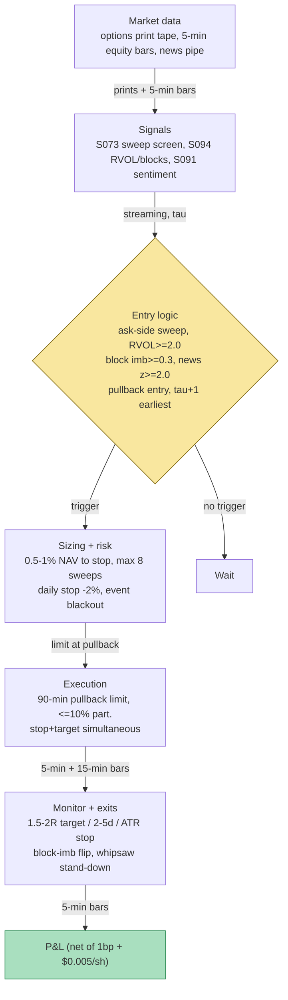

## Stage 149/200 — T049: Unusual Options Activity Follower

*Batch TB5 · Strategy 49/100 · Signals S073, S094, S091*

*Provenance: [D/SR] — documented signals (S073/S094/S091) combined through strategy rules reconstructed for this chapter; the combination itself is synthetic, not a documented strategy.*

### T1. One-line verdict

| | |
|---|---|
| **Style** | Intraday-to-multiday directional momentum: follows signed institutional options flow into the underlying equity |
| **Edge source** | Unusual options activity (S073) — urgent, opening-biased, ask-side sweep flow; confirmed by equity RVOL and signed block pressure (S094) and fresh news sentiment (S091) before the drift completes |
| **Typical holding period** | Intraday to 2–5 sessions (*example* time stop); flow alpha decays fast — the clock starts at the sweep |
| **Capacity hint** | Single-name large/mid caps; the equity leg is plain stock (capacity in the low hundreds of $mm), but the *option* leg it shadows cannot be cloned at size — and public sweep data is the degraded cousin of proprietary open-buy data |
| **Build-or-buy in one line** | Buy the sweep tape (Unusual Whales/Cheddar-class, *indicative — verify before budgeting*) for 90 days before writing a classifier; build only the S094/S091 confirmation gates and execution timing |

### T2. Full mechanics

**Jargon first.** *Unusual options activity (UOA)* = option volume far above its own baseline. A *sweep* = one order executed across multiple exchanges within ~a second — urgency. A *block* = a single large print, more often a hedge. *Opening* = a trade opening a new position (vs *closing*); only opening flow expresses a fresh view. *Ask-side* = printed at the ask (buyer paid up). *Vol/OI* = today's volume / prior open interest — above ~1.5–3× suggests fresh opening. *Delta* = the option's sensitivity to a $1 stock move. *RVOL* = this bar's volume vs the same time-of-day bin's average. *Lee–Ready (1991)* = quote test + tick test for signing trades. *Signed block pressure* = (buy block vol − sell block vol) / total block vol. *ATR* = average true range. *R* = initial risk (stop distance). *Flow alpha* = the predictable return component attributed to the options flow.

**Universe & session.** ~200–500 liquid US single names with listed options (price ≥ $10, option ADV ≥ 1,000 contracts *example*); **single names only** — index flow (SPX/SPY) is overwhelmingly hedging (per the TB5 lead). RTH; the sweep must print 9:45–15:00 ET (*example* — late-day sweeps cannot be confirmed before the close).

**Entry rule.** All *example* thresholds; sweep at time τ scored on the print tape (S073): (1) **Sweep screen (S073):** multi-exchange prints, same contract, ~100–300 ms; premium ≥ **$250k** single-name; filled at the **ask** for calls; volume vs trailing-20-day median ≥ 3×; **vol/OI ≥ 3**; DTE 7–45; delta 0.25–0.45; same-side repeat within 30 min raises conviction. (2) **Equity confirmation (S094):** sweep-bar 5-min RVOL ≥ 2.0 and signed block imbalance ≥ +0.3 in the sweep's direction. (3) **News confirmation (S091):** news-sentiment bucket z ≥ +2.0 with novelty ≥ 70 in the sweep's direction within 30 min.

**Entry:** do NOT chase the swept option (you pay the sweep's own impact). Buy the **underlying stock** on a 0.2–0.5% pullback (*example*) within 30–90 minutes (*example*), only if the tape has not reversed. Fills at τ+1 at the earliest — the sweep is known at τ, the *interpretation* needs the confirmation bars.

**Exit rule** (first wins): (1) target 1.5–2.0R (*example*); (2) time stop 2–5 sessions (*example*) — flow alpha decays; (3) stop-loss 1.0–1.5× ATR(14) (*example*) or −1.2% (*example*); (4) S094 reversal — block imbalance flips sign for two consecutive 15-min bins (*example*); (5) blackout — earnings tomorrow ⇒ skip entry entirely.

**Position sizing.** Risk 0.5–1.0% of NAV to the stop (*example*): shares = risk_budget / (entry − stop). This is an equity trade shadowing option flow, not an options position. Max 8 concurrent sweeps (*example*); max one sweep per name per day.

**Risk limits** (*examples*). Daily loss stop −2% of NAV ⇒ no new sweeps. Event blackout: no entries into scheduled earnings/FDA/binary events. Same-day reversal circuit: two consecutive sweeps reversing within the hour (whipsaw tape) ⇒ stand down for the session.

**Cost model.** Stock leg: $0.005/share + 1 bp on notional each way (*example* retail-ish). The *option* is never bought — cloning it would pay ~1–3% of premium in effective spread plus the sweep's own impact (per the TB5 spread table) — modeled as a veto. Pullback-entry slippage: fill assumed 1 bp worse than the printed dip (*example*; flagged optimistic in T4).

**Order/execution sketch.** After confirmation, stage a limit buy at the pullback level (0.2–0.5% below the sweep-bar high, *example*); unfilled after 90 minutes (*example*) ⇒ cancel — chasing is the documented failure. Participation ≤ 10% of the bin's volume (*example*). Stop entered simultaneously as stop-market; target as limit. Backtest: sweep at τ ⇒ earliest fill τ+1 bar; vol/OI uses *prior-day* OI (intraday OI is a vendor estimate).

### T3. Signals it consumes

| Signal | Role | Weight / logic |
|---|---|---|
| S073 — Unusual options activity | **Primary trigger** | Multi-exchange, ask-side, premium ≥ $250k, vol/OI ≥ 3, DTE 7–45, delta 0.25–0.45 (*examples*) |
| S094 — RVOL & signed block pressure | **Confirmation** | Sweep-bar RVOL ≥ 2.0 and block imbalance ≥ +0.3 same-signed (*examples*); flip = exit |
| S091 — News sentiment | **Context** | Sentiment z ≥ 2.0 (*example*) with novelty ≥ 70 (*example*) same-signed within 30 min |

```pseudocode
# T049 combination logic — streaming intraday; fills at tau+1 at earliest
on options_print(p):                                    # OPRA/trade tape
    if is_sweep(p) and p.premium >= 250_000 \           # S073 (examples)
       and p.side == "ask" and p.vol_oi >= 3 \
       and 7 <= p.dte <= 45 and 0.25 <= abs(p.delta) <= 0.45:
        rvol = rvol_5min(underlying, bar_of(p.time))    # S094
        bimb = block_imbalance(underlying, 15min)       # S094 Lee-Ready
        z91, nov = news_sentiment(underlying, 30min)    # S091
        if rvol >= 2.0 and bimb >= 0.3 and z91 >= 2.0 and nov >= 70:  # examples
            stage limit buy at pullback 0.2-0.5% below sweep-bar high, 90-min expiry
on fill: stop = entry - 1.25*ATR14; target = entry + 1.75*(entry-stop)  # examples
on (block_imb flips sign 2 bins) or held >= 5d or target/stop hit: exit
```

### T4. Worked example — numbers + P&L (SYNTHETIC)

All prices synthetic, **seed 149** (`rng = np.random.default_rng(149)`; regenerable via `python3 batches/TB5/plot_T049.py`).

**The sweep.** Day 1, bar 7 (~10:17 ET): **2,400 of the 21-DTE 87.5 calls** swept across 5 exchanges **at the ask $1.85** — premium **$444k** (≥ $250k ✓), prior-day OI 410 → vol/OI = **5.9** (≥ 3 ✓), delta ≈ **0.32** (0.25–0.45 ✓), DTE 21 (7–45 ✓). S073 flags it.

**The confirmations.** Same bar: 5-min RVOL = **3.2×** (≥ 2.0 ✓); signed block imbalance = **+0.55** (≥ +0.3 ✓); news-sentiment bucket z = **+2.1** (≥ 2.0 ✓) with novelty **88** (≥ 70 ✓) — a fresh bullish story.

**The trade.** Wait for the pullback: bar 8 (~10:41 ET) dips to **83.85**; block imbalance still same-signed → **long 800 @ 83.85**. Stop **82.90** (*example*, ~1.25× ATR(14)); target **86.20** (*example*, 1.75R); time stop 2–5 sessions (*example*). Day 2: the drift continues; **sell 800 @ 85.68** (target not quite reached — exited on the day-2 close per the time/decay rule).

| Line | Calc | $ |
|---|---|---|
| Stock leg | 800 × (85.68 − 83.85) | +1,464.00 |
| Costs: 800 × $0.005 × 2 + 1 bp × 2 (example) | | −21.56 |
| **Net** | | **+1,442.44** |
| Risk to stop | 800 × (83.85 − 82.90) | 760.00 |
| Realized | 1,442.44 / 760.00 | **1.90R** |

**Where the example is optimistic.** The sweep is pre-labeled "call sweep at the ask" — real classification infers side from the quote rule (S007), and multi-leg delta-neutral packages print as "calls bought" while expressing no directional view; the TB5 lead flags side/open-vs-close as the #1 and #2 scanner killers. Vol/OI = 5.9 uses clean prior-day OI; on roll/expiry days OI is polluted and the ratio lies. The 83.85 pullback fill assumes patient limits in a tape that often never pulls back. Same-day gap-up holds most of the documented drift (per the TB5 lead); the day-2 exit at 85.68 harvests a thinner second-day drift. The +$1,442.44 is arithmetic illustration — not a backtest.

### T5. Data & infra — what must run

**Pipeline inventory.** Continuous intraday: consume the options print tape (prints only — quotes are secondary), classify sweeps (multi-exchange, ~100–300 ms, *example*), sign vs NBBO, vol/OI vs prior-day OI, delta-filter; equity 5-min bars for RVOL and Lee–Ready block signing; the news pipe for S091 buckets. Pre-open: prior-day OI (OCC/vendor), screen parameters, earnings blackout list. Post-close: persist every flagged sweep with confirmations and outcome.

**M5 Max feasibility: feasible (Tier H classifier, Tier M tape).** Per cost-model §2/§3: UOA consumes **trades only** (tens of k to low hundreds of k prints/day for 500 names) — a streaming join, 1–2 cores; delta from vendor or one-time per-contract compute. RAM: trade ring buffer 1–3 GB (§3); 60 days of 5-min bars trivial. Engineering: cost-model Tier H for the sweep classifier (60–200 h, $9,000–30,000 loaded-cost estimate), Tier M+ for the full harness (40–100 h, $6,000–15,000); the hours hide in side-classification accuracy and replay reconciliation. **UOA dies on delayed data** (per the TB5 lead). Breaks at: the full OPRA quote firehose (several TB/day — do not subscribe CMBP-1 ALL).

**Feed-outage safe mode.** Options tape delayed or down ⇒ **dead for the session** — no sweeps, no entries; existing positions run to stop/target/time-stop. There is no "stale sweep" mode: a 15-minute-delayed print is history, not a signal. Equity bars stale ⇒ the S094 confirmation cannot be computed ⇒ veto new entries. News pipe down ⇒ S091 fails closed (veto). Restart = flat + re-derive; never backfill a missed sweep from a delayed tape and trade it as live.

### T6. Buy vs build

| Option | What you get | Indicative price | Gains | Loses |
|---|---|---|---|---|
| Tier-0/1: Cboe 15-min delayed + Alpaca SIP bars | Delayed prints, real-time equity bars | ~$0–200/mo, *indicative — verify before budgeting* | Cheap research | **UOA dies on delayed data** — research only |
| Tier-2: ThetaData Pro (trades + chain snapshots) | Live-ish trade tape for sweep classification | ~$160/mo, *indicative — verify before budgeting* | The self-build raw input (per TB5 lead) | You build the classifier — Tier H (60–200 h, $9,000–30,000 loaded-cost estimate) |
| Buy analytics: Unusual Whales / Cheddar UI | Pre-classified sweeps, their vol/OI, side | ~$50–299/mo UI; API ~$625+/mo commercial, *indicative — verify before budgeting* | Day-1 labels better than yours | Cannot change the sweep definition; API is the expensive part |
| Buy analytics: ORATS live surface | Chains + IV, not a sweep tape | ~$299–599/mo, *indicative — verify before budgeting* | Surfaces cooked | Wrong tool for sweep-following |
| Professional: Databento OPRA | Full tape, sub-second | ~$199/mo + OPRA license (personal $1.25; commercial non-display ~$2,000/mo), *indicative — verify before budgeting* | Serious tape | The $2k non-display line is the landmine |

**Verdict: buy the tape UI first, build the gates, buy the API only if the UI proves edge.** Per the TB5 lead: buy Unusual Whales or Cheddar for 90 days and measure your S094/S091 confirmation lift against *their* labels before writing a classifier — your day-1 classifier will be worse. **Build if** the confirmation gates are your edge — vendors do not sell your conjunction. **Buy the API** only when you automate. Crossover: if this runs unattended for a firm, budget the ~$2,000/mo (*indicative — verify before budgeting*) non-display OPRA classification first — that line can exceed every other cost combined.

### T7. Success-ratio evidence

| Source | Market / period | Metric | Before/after cost | Caveat |
|---|---|---|---|---|
| Pan & Poteshman (2006), RFS | US options, 1990–2001 (proprietary Cboe open-buy data) | Buyer-initiated open-buy put/call sorts: low put/call names beat high by **>40 bp next day**, **>1% over the next week** | Before costs | **Gold-standard data you do not have** — public sweep scanners approximate the open-buy classification with the quote rule + vol/OI (per TB5 lead) |
| Johnson & So (2012), JFE | US, option-to-stock volume ratio | O/S ratio predicts future stock returns | Before costs | A ratio signal, not a sweep trigger; the implementable version needs the same signed-flow data |
| Cremers & Weinbaum (2010), JFQA | US, 1996–2005 | Long expensive calls / short expensive puts: **~50 bp/week** long-short | Before costs; paper | Pre-cost; predictability **decreasing over the sample period** — decay is in the paper |
| Easley, O'Hara & Srinivas (1998), JF | US options | Informed traders trade in options; option volume contains stock-price information | n/a (mechanism) | Why sweeps *could* be informed — not a trading result |

Capacity: the equity leg scales to the low hundreds of $mm in large caps; the binding constraint is *signal quality*, not size — public sweeps are crowded, same-day reaction has sped up, and roughly half of naive "call sweep" flags are hedges, rolls, or multi-leg packages. Documented decay: predictability decreasing within the Cremers–Weinbaum sample; post-2020 the remaining drift is mostly same-day (per the TB5 lead) — an overnight follower is structurally late.

**Honest bottom line.** For a ≤$1M paper operation: the most *fun* TB5 strategy to paper-trade and the best teacher of tape discipline — sweep classification, side inference, confirmation gating, waiting for the pullback. But the documented after-cost edge of public sweep-following is a degraded, crowded cousin of the Pan–Poteshman open-buy result: expect most flagged sweeps to be noise. An institutional desk runs this with proprietary signed open/close data and microsecond tape — the retail paper book rents the same idea at a data disadvantage. Do not annualize the +$1,442.44 synthetic trade.

### T8. Failure modes & pitfalls

1. **Side misclassification** — sweep-at-ask ≠ new long: multi-leg and dealer hedges print as "calls bought." Mitigation: the S094 confirmation and the vol/OI opening-bias test; never trade the option leg unconfirmed.
2. **Open vs close ambiguity** — vol > OI is a noisy proxy; a "sweep" can be a closing roll. Mitigation: next-day OI change as the post-hoc label; kill the scanner if its confirmed-open rate falls below *example* < 55%.
3. **Index/single-name mix-up** — SPX/SPY flow is hedges; the papers find drift in single-name OTM calls. Mitigation: single names only; index flow vetoed.
4. **Hedged flow** — the "informed buyer" is often a dealer hedging a facilitation; the drift is the hedge, already done. Mitigation: the S091 catalyst requirement; same-side repeats (*example*: within 30 min) raise conviction.
5. **Chasing the sweep** — the pullback never comes; the follower buys the top of the same-day gap. Mitigation: limit-only entries with 90-minute expiry (*example*); missed trades are the documented cost of discipline.
6. **Latency on SIP** — by the time a SIP-fed scanner flags the sweep, the colocated tape has moved the stock. Mitigation: this strategy honestly needs direct/CTA-pace data — label SIP backtests `simulated only — requires direct feeds` where due.
7. **Earnings/event buying** — the sweep is someone else's event bet. Mitigation: hard blackout — earnings/FDA/binary within the holding window ⇒ skip.
8. **Crowding the same print** — every retail scanner flags the same $444k sweep; the follow becomes exit liquidity. Mitigation: the S094/S091 gates as differentiator, small size, the time stop.

### T9. Visuals


Caption: watermarked "SYNTHETIC EXAMPLE" with corner note "synthetic data — not market data". Plots the exact synthetic QBT path from T4 (seed 149): the 2,400-contract call sweep at bar 7, the 800-share pullback entry at 83.85, stop 82.90 / target 86.20, the day-2 exit at 85.68, and the single-trade net P&L bar (+1,442.44, 1.90R).



### T10. Sources

- Pan, J. & Poteshman, A. M. (2006). "The Information in Option Volume for Future Stock Prices." *Review of Financial Studies* 19(3), 871–908. https://ideas.repec.org/a/oup/rfinst/v19y2006i3p871-908.html — open-buy put/call volume predicts next-day (>40 bp) and next-week (>1%) stock returns; the gold-standard result the public-data follower approximates.
- Johnson, T. L. & So, E. C. (2012). "The Option to Stock Volume Ratio and Future Returns." *Journal of Financial Economics* 106(2), 262–286. https://doi.org/10.1016/j.jfineco.2012.05.008 — the option-to-stock volume ratio predicts future stock returns.
- Cremers, M. & Weinbaum, D. (2010). "Deviations from Put-Call Parity and Stock Return Predictability." *Journal of Financial and Quantitative Analysis* 45(2), 335–367. https://ideas.repec.org/a/cup/jfinqa/v45y2010i02p335-367_00.html — relatively expensive calls outperform relatively expensive puts by ~50 bp/week (pre-cost); predictability decreasing over the sample — the decay warning, verified 2026-09-10 (JFQA, not JFE).
- Easley, D., O'Hara, M. & Srinivas, P. S. (1998). "Option Volume and Stock Prices: Evidence on Where Informed Traders Trade." *Journal of Finance* 53(2), 431–465. https://afajof.org/issue/volume-53-issue-2/ — informed traders use options; the mechanism behind treating urgent options flow as potentially informed.

**Unverified leads** (chatbot-provided, not independently checkable — do not treat as evidence):
- *Unverified chatbot claim* (Grok, 2026-09-10, Q-TB5-3): "Journal of Portfolio Management (2026)" filtered-UOA note — no full citation captured; used only as a decay caution.
- *Unverified chatbot claim* (Grok, 2026-09-10, Q-TB5-1/2): sweep-screen thresholds (premium ≥ $250k/≥ $500k, DTE 7–45, delta 0.25–0.45, vol/OI ≥ 3, sweep window 100–300 ms); entry/exit rules (0.2–0.5% pullback, 30–90 min, 1.0–1.5× ATR stop, 1.5–2.0R target, 2–5 session time stop); fee schedule ($0.65/contract, $0.005/share + 1 bp); "budget half or less of the paper's 40 bp" heuristic — all marked `example` in the chapter.
- *Unverified chatbot claim* (Grok, 2026-09-10, Q-TB5-2): vendor pricing (ThetaData Pro $160/mo, Unusual Whales $50–299 UI / ~$625+ API, ORATS $299–599/mo, Databento OPRA ~$199/mo + OPRA license tiers, non-display ~$2,000/mo) — *indicative — verify before budgeting*; M5 Max engineering bands (classifier — superseded by cost-model Tier H, 60–200 h / $9,000–30,000 loaded-cost estimate; full v1 120–190 h).
- *Unverified chatbot claim* (Grok, 2026-09-10, Q-TB5-3): OptionMetrics 2013–2023 (via a 2026 JPM piece) — large prints in general not predictive; filtered UOA (esp. OTM short-dated calls) significant; profitability declined after 2020 — removed from the T7 evidence table; listed here only.

Source log: Grok Q-TB5-1..3 (2026-09-10); all claims verified or labeled unverified.
