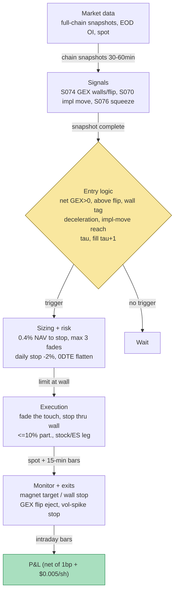

## Stage 150/200 — T050: GEX Pin / Dealer-Positioning Fade

*Batch TB5 · Strategy 50/100 · Signals S074, S070, S076*

### T1. One-line verdict

| | |
|---|---|
| **Style** | Intraday structural mean-reversion: fades spot into dealer gamma walls, rides pinning into expiries |
| **Edge source** | Dealer gamma exposure (S074) — dealers net long gamma must buy dips and sell rips to stay hedged, compressing price toward high-GEX strikes; the fade harvests that hedging flow, with the straddle-implied move (S070) sizing the wall's reach and vol-breakout logic (S076) defining the stop |
| **Typical holding period** | Intraday (minutes to hours); time-stopped into the last 20 minutes on 0DTE gamma (*example*) |
| **Capacity hint** | Index futures/ETFs (ES/SPY-class) and liquid single names; the equity leg is plain stock/futures flow — capacity in the hundreds of $mm — but the documented edge is tens of basis points on expiration days, crowded at the close |
| **Build-or-buy in one line** | Buy the wall map (SpotGamma-class, *indicative — verify before budgeting*) for one month to calibrate; build the fade engine yourself only if your sign convention survives a two-week disagreement test against price |

### T2. Full mechanics

**Jargon first.** *Gamma (Γ)* = how fast an option's delta changes when the underlying moves. *Gamma exposure (GEX)* = the market's total gamma, per strike as Γ × open interest × multiplier × spot² × 0.01 — dollars of dealer P&L per 1% spot move (the charting-tool convention; see S074). *Dealer* = the market maker on the other side of customer option trades. *Dealer GEX* = the gamma on dealer books — typically modeled as **minus** customer GEX under the assumption customers are net long options (**an assumption, not a fact** — it breaks when customers are net short, e.g. overwriting). *Call wall* = the strike with maximum dealer call gamma (resistance); *put wall* = maximum put gamma (support). *Flip / zero-gamma* = the spot level where net dealer GEX changes sign. *Pinning* = prices clustering at strikes on expiration (Ni–Pearson–Poteshman 2005). *Positive-GEX regime* = dealers buy dips/sell rips (fade-friendly); *negative-GEX regime* = dealers chase (do NOT fade). *Charm* = how delta decays with time. *Straddle-implied move* = (ATM call + ATM put)/spot. *Vol breakout* = range expansion beyond k× its trailing mean (S076). *0DTE* = options expiring the same day. *DDOI* = a proprietary dealer-side OI model.

**Universe & session.** SPY/QQQ/IWM-class ETFs and ES futures for the index variant; ~50–100 liquid optionable single names for the equity variant (option ADV ≥ 5,000 contracts *example*). RTH only; **no new fades in the last 20 minutes on 0DTE gamma** (*example*). Exclusions: FOMC/CPI/NFP days (*example*), earnings days for single names (*example*), DTE ≤ 5 into scheduled binaries (*example*, shared TB5 convention).

**Entry rule.** Morning GEX snapshot (EOD OI × live Γ; intraday "live OI" is a vendor estimate, per the TB5 lead), refreshed every 30–60 minutes (*example*):
1. **Regime (S074, primary):** net dealer GEX > 0 (*example* gate) AND spot above the flip. Negative GEX ⇒ no fades.
2. **Wall tag:** spot tags the call wall from below (or the put wall from above) AND 15-min momentum decelerates — *example*: last 15-min return < 30% of the prior.
3. **Implied-move context (S070):** the wall must be within the session's remaining straddle-implied move — *example*: distance-to-wall < implied move in dollars.
4. **Squeeze state (S076):** Bollinger bandwidth percentile ≤ 10 (*example*) — pre-expansion only; if the range has *already* expanded (R_t/R̄ > 1.75, *example*), the wall may already be broken.

**Enter** at the tag bar's close (τ → fill at τ+1 at the earliest): short into the call wall; long into the put wall. Target: the max-GEX strike (the pin magnet) or the range mid (*example*).

**Exit rule** (first wins): (1) target — magnet strike tagged; (2) stop — **through the wall by 0.4–0.6%** (*example*); (3) time stop — flatten into the last 20 min on 0DTE (*example*); (4) regime flip — net GEX recomputes negative ⇒ exit immediately.

**Position sizing.** Size by the dollar gamma being faded or by 0.5–1.0× ATR (*example*): risk **0.4% of NAV to the stop** (*example*). Max 3 concurrent wall fades (*example*); index fades may carry 2× single-name size (*example*).

**Risk limits** (*examples*). Daily loss stop −2% of NAV. Vol-spike stop (shared TB5 convention): close if VIX 1-day jump > +25% or 15-min realized vol > 2.5× HAR forecast. Name concentration: max 25% of gamma-fade risk in one underlier. Overnight: flat.

**Cost model.** The GEX surface is *computed*, not traded — the traded leg is stock/ES: $0.005/share + 1 bp each way (*example*); ES alternative $1.25/side + 0.25 tick slippage (*example*). Chain-data cost (the real cost) sits in T6, not in the per-trade P&L. Applied explicitly in T4.

**Order/execution sketch.** Limit order at the wall tag (fade the touch); stop-market through the wall +0.4–0.6% (*example*); participation ≤ 10% of the bin's volume (*example*). Backtest: GEX snapshot stamped complete ⇒ earliest fill next bar; OI vintage is always the last *as-of* EOD — never "final" revised OI stamped 16:00 (lookahead, per S074).

### T3. Signals it consumes

| Signal | Role | Weight / logic |
|---|---|---|
| S074 — Gamma exposure & dealer positioning | **Primary** | Net dealer GEX > 0, spot above flip, wall tag with decelerating momentum (*examples*) |
| S070 — Straddle-implied move | **Reach gate** | Distance-to-wall < remaining-session implied move (*example*); sizes the stop's plausibility |
| S076 — Vol breakout / squeeze | **Regime & exits** | Pre-expansion only (bandwidth pct ≤ 10, *example*); expansion through the wall = the stop; flip = immediate exit |

```pseudocode
# T050 — intraday on 30-60min GEX snapshots; fills at tau+1
on gex_snapshot:  # EOD OI x live Gamma (examples)
    net_gex, walls, flip, magnet = compute_gex(chain)   # S074
    regime_ok = (net_gex > 0) and (spot > flip)
    imp_move = (call_atm + put_atm) / spot              # S070
    squeezed = bollinger_bw_percentile(spot) <= 10      # S076 (example)
    if not regime_ok or not squeezed: stand_down(); continue
    if tags_call_wall(spot) and momentum_decelerating(15min):
        if (wall - spot) < imp_move * spot:
            short underlying; stop = wall * 1.005; target = magnet
    if tags_put_wall(spot) and momentum_decelerating(15min):
        if (spot - wall) < imp_move * spot:
            long underlying; stop = wall * 0.995; target = magnet
    on (stop hit) or (net_gex <= 0) or (last 20min and is_0dte): flatten
```

### T4. Worked example — numbers + P&L (SYNTHETIC)

All prices synthetic, **seed 150** (`rng = np.random.default_rng(150)`; regenerable via `python3 batches/TB5/plot_T050.py`). Costs: $0.005/share + 1 bp each way (*example*); T9 plots this wall map and trade on a synthetic SPY-like underlier.

**The wall map (synthetic dealer GEX, $mm per 1% spot move):** 565: **−420** (put wall); 570: +180; 575: **+910** (max GEX / magnet); 580: **+640** (call wall); 585: +210. Net dealer GEX **+1.8bn** (positive ⇒ fade regime, *example* gate); flip **568**; spot **575.20** (above flip ✓).

**The context.** 0DTE ATM straddle: call $2.90 + put $2.85 on spot 575.20 ⇒ implied move **1.00% ≈ $5.75** (S070, *example*). The 11:40 tag (579.80) sits **$0.20** from the 580 wall — within the implied range ⇒ fade in play. Bandwidth percentile 8 (≤ 10 ✓).

**The trade.** 11:40: spot **579.80** tags the 580 call wall from below, momentum decelerated (*example* 30% rule). **Short 200 @ 579.75** (1 bp slip). Stop **583.20** (+0.6%). Target **575.40** (magnet). Grind 579.8 → 575.6 over 4 hours. **Cover 200 @ 575.65.**

| Line | Calc | $ |
|---|---|---|
| Stock leg (short) | 200 × (579.75 − 575.65) | +820.00 |
| Costs (200 × $0.005 × 2 + 1 bp × 2, *example*) | | −25.11 |
| **Net** | | **+794.89** |
| Stop risk | 200 × (583.20 − 579.75) | 690.00 |
| Realized | 794.89 / 690.00 | **1.15R** |

Stop-loss case (*example*): spot rips to 583.40 through the wall ⇒ ≈ 200 × 3.45 + costs ≈ **−$715** — the regime filter is the whole trade.

**Where the example is optimistic.** The wall map is handed over clean and static — real GEX depends on the sign convention, and the S074 chapter's own honesty note applies: "customers net long, dealers net short" fails for overwriting-heavy names, and mixing vendor conventions silently flips every wall. The map is frozen for 4 hours; real Γ decays into expiry and the magnet migrates. The grind is engineered to cooperate — no whipsaw through 580 that stops the fade and then pins anyway. The 1 bp + $0.005 cost assumes liquid-ETF spreads; single-name wall fades pay wider. The +$794.89 is arithmetic illustration — not a backtest.

### T5. Data & infra — what must run

**Pipeline inventory.** Morning + every 30–60 min (*example*): pull the full-chain snapshot (all strikes near spot × front expiries — *a 50-delta strip is not a wall map*, per the TB5 lead), compute per-contract Γ from per-contract IV (vectorized BSM), multiply by as-of EOD OI × 100 × S² × 0.01, aggregate by strike, derive walls/flip/magnet/net sign. Continuous: spot vs wall monitor, deceleration check, ATM implied move. Pre-open: verify OI vintage is as-of, corporate actions handled. Post-close: persist snapshots, maps, decisions, fills.

**M5 Max feasibility: feasible (Tier H analytics, Tier M data).** Per the TB5 lead and cost-model §2/§3: the DTE-capped book (~60k contracts) reprices in **~20–80 ms** vectorized (*example* band; stay in NumPy/polars, never scipy per contract); GEX aggregation is a group-by. **Full-chain OI is mandatory** but not real-time: EOD OCC OI × live Γ is the serious construction; 15-min delayed quotes are fine for 30–90-min fades. RAM: live chain + Greeks 0.5–2 GB (§3); 1-min snapshots of 60k contracts ≈ 1.2–2.0 GB/day (per the lead) — keep ~20 sessions hot, ship the rest to cheap disk. Engineering: GEX + walls + flip + pin map 10–15 h; full v1 120–190 h ≈ $18,000–28,500 loaded-cost estimate (§5 Tier H). **Do not buy full OPRA for this Mac** (per the lead). Breaks at: all-name 1-second NBBO materialized in RAM (cap DTE ≤ 60, *example*).

**Feed-outage safe mode.** Chain snapshot stale ⇒ freeze the wall map at the last complete snapshot and **widen the stop**; no new fades on a map older than 2 snapshots (*example*). OI vintage missing ⇒ no new maps (a GEX map without OI is a fantasy). Spot feed down ⇒ flatten everything. Restart = flat + re-derive; never trade yesterday's walls through an overnight gap.

### T6. Buy vs build

| Option | What you get | Indicative price | Gains | Loses |
|---|---|---|---|---|
| Tier-0/1: Cboe delayed chains + OCC EOD OI (often bundled) | Delayed quotes, official EOD OI | ~$0–80/mo, *indicative — verify before budgeting* | Enough for daily walls + slow fades | No intraday Γ refresh |
| Tier-2: ThetaData Standard/Pro | Chain snapshots + vendor Greeks + OI fields | ~$80–160/mo + OPRA entitlement, *indicative — verify before budgeting* | Best self-build raw input (per TB5 lead) | You own the sign convention |
| Buy analytics: SpotGamma mid/Alpha | Precomputed walls, flip, magnet | ~$99–299/mo, *indicative — verify before budgeting* | Skips 40 h of arguing with OI | Cannot change the dealer-sign assumption |
| Buy analytics: ORATS live surface | Chains + IV surfaces | ~$299–599/mo, *indicative — verify before budgeting* | Surfaces cooked | Still not a wall map |
| Professional: Databento OPRA + full chain | Real-time everything | ~$199/mo + OPRA license (personal $1.25; commercial non-display ~$2,000/mo), *indicative — verify before budgeting* | Serious tape | Drowns the Mac; $2k non-display line is the landmine |

**Verdict: buy the map for one month, build the fade engine, keep the vendor as truth tape.** Per the TB5 lead: if your edge is watching GEX walls like SpotGamma, just buy SpotGamma — reimplementing dealer-sign GEX to match them is 40 hours of arguing with OI. **Build if** the fade *rules* are your edge (deceleration trigger, implied-move reach gate, S076 exits, flip-eject). **Buy the feed** (ThetaData) only if the vendor's map disagrees with price for two weeks. Crossover: firm / non-display / multi-user ⇒ budget $2k–$5k/mo data first; the custom GEX build only wins if the book is large enough to care about the sign convention.

### T7. Success-ratio evidence

| Source | Market / period | Metric | Before/after cost | Caveat |
|---|---|---|---|---|
| Ni, Pearson & Poteshman (2005), JFE | US optionable stocks, 1996–2002 | Prices **cluster at strikes on expiration**: returns altered by **≥ 16.5 bp**; aggregate cap shift ~$9bn per expiration | Before costs | Tens of bp — after stock spread + borrow a small, expiration-Friday edge (per TB5 lead) |
| Golez & Jackwerth (2012), JFE | S&P 500 futures, serial expirations | Futures **pulled toward ATM** on serial expirations; pushed away into SPX expirations; notional shift **≥ $115m per expiration day** | Before costs | Pre-2010 regime; drivers are MM delta decay (charm) + customer exercise |
| SqueezeMetrics (2016, rev. 2017), practitioner | US options | GEX methodology: aggregate Γ × OI; DDOI dealer-direction model | n/a (construction) | Not a peer-reviewed efficacy study — the construction this strategy implements |
| Barbon, Beckmeyer, Buraschi & Moerke (working paper) | US, leveraged ETFs + option imbalances | Option market imbalances drive **end-of-day price dynamics** | Working paper | The hedging-flow mechanism intraday; not a wall-fade trading result |
| TB5 lead (Grok Q-TB5-3): Elms (SSRN 2026) | SPY/ES, 2016–2025, 1-min, 2,294 days | **No pinning** post-weekly/0DTE; highest-ATM-OI days ~16% wider ranges — **amplification** | After-cost implication | *Unverified chatbot claim* — no full citation captured; if true, the 2005–2012 pin literature is not a 2026 0DTE playbook |

Capacity: the equity/futures leg scales to hundreds of $mm; the binding constraints are *edge size* (tens of bp on expiration days) and *crowding at the close*. Documented regime risk: the 0DTE regime may have inverted the classic pin into amplification under negative dealer gamma (Elms lead, unverified) — the positive-GEX gate is the entire defense, and it rests on the fragile dealer-sign assumption.

**Honest bottom line.** For a ≤$1M paper operation: the best *structural* teacher in TB5 — building the wall map forces you to learn options symbology, IV/Greeks plumbing, OI vintages, and the dealer-sign assumption from the inside. As a traded edge, expect a small, expiration-concentrated fade. An institutional desk runs this with full-chain OI history, a calibrated dealer-direction model, and futures execution. Do not annualize the +$794.89.

### T8. Failure modes & pitfalls

1. **Dealer-sign assumption wrong** — customers net *sell* calls (overwriting) and net *buy* puts (protection); "dealer GEX = −customer GEX" then mislabels every wall. Mitigation: publish ≥2 sign conventions (per S074), run the two-week disagreement test vs price.
2. **Negative-GEX fade** — fading in negative dealer gamma means fading *amplification*; the wall breaks and the move accelerates through the stop. Mitigation: the net-GEX > 0 gate is absolute.
3. **0DTE regime inversion** — the post-weekly/0DTE sample may show amplification where the 2005 literature showed pinning (Elms lead). Mitigation: separate 0DTE and monthly books; the 0DTE variant gets the last-20-min flatten and half size (*example*).
4. **Charm migration** — Γ decays into expiry; the 10:00 magnet is not the 15:00 magnet. Mitigation: recompute the map every 30–60 min (*example*); target the *current* magnet.
5. **OI vintage lookahead** — "final" revised OI stamped 16:00 was not available at decision time. Mitigation: as-of vintages only; stamp every map with its vintage.
6. **Stop-through-the-wall whipsaw** — spot pokes 0.5% through the wall, stops the fade, then pins anyway. Mitigation: accept it as the documented loss mode; size by the 0.4% risk (*example*) so it is budgeted, not a surprise.
7. **Single-name event walls** — a wall built on pre-earnings OI evaporates when the event reprices vol. Mitigation: earnings-day exclusion (*example*); flatten single-name fades into scheduled binaries.
8. **Vendor-convention mixing** — combining your Γ with a vendor's OI, or two vendors' GEX, silently changes every wall. Mitigation: one pipeline, one convention, documented; never blend.

### T9. Visuals


Caption: watermarked "SYNTHETIC EXAMPLE" with corner note "synthetic data — not market data". Left: the exact synthetic wall map from T4 (seed 150): put wall 565 (−420), magnet 575 (+910), call wall 580 (+640). Right: the synthetic grind 579.80 → 575.65 — short entry 579.75, stop 583.20, magnet 575, cover 575.65, net +794.89 (1.15R).



### T10. Sources

- Ni, S. X., Pearson, N. D. & Poteshman, A. M. (2005). "Stock Price Clustering on Option Expiration Dates." *Journal of Financial Economics* 77(2), 249–274. https://optionmetrics.com/research/s-xiaoyan-ni-n-d-pearson-and-a-m-poteshman-stock-price-clustering-on-option-expiration-dates/ — expiration-day strike clustering (≥16.5 bp); the documented pinning core.
- Golez, B. & Jackwerth, J. C. (2012). "Pinning in the S&P 500 Futures." *Journal of Financial Economics* 106(3), 566–585. https://doi.org/10.1016/j.jfineco.2012.06.010 — pinning toward ATM on serial expirations (≥$115m notional shift/day); verified 2026-09-10.
- SqueezeMetrics (2016, rev. 2017). "GEX — Gamma Exposure" methodology guide. https://squeezemetrics.com/monitor/static/guide.pdf — the aggregate-GEX construction this strategy implements; attribution honesty per S074.
- Barbon, A., Beckmeyer, H., Buraschi, A. & Moerke, M. "The Role of Leveraged ETFs and Option Market Imbalances on End-of-Day Price Dynamics." Working paper. https://www.alexandria.unisg.ch/server/api/core/bitstreams/5a99db31-0d37-4f86-9502-8cb0f3bff4fe/content — option-market imbalances and end-of-day price dynamics.

**Unverified leads** (chatbot-provided, not independently checkable — do not treat as evidence):
- *Unverified chatbot claim* (Grok, 2026-09-10, Q-TB5-3): Elms (SSRN 2026) — no pinning in SPY/ES 2016–2025, amplification on high-ATM-OI days — no full citation captured; used only as a regime caution, flagged in T7.
- *Unverified chatbot claim* (Grok, 2026-09-10, Q-TB5-1/2): GEX conventions (Γ × OI × S² × 0.01 × 100), wall/fade mechanics (0.4–0.6% stop-through, last-20-min 0DTE flatten, 30% deceleration rule, 0.4% NAV risk), the worked-example arithmetic (200 × 4.10 = $820, stop −$710), and the "EOD OI × live Γ" dictum — mechanics marked `example` in the chapter.
- *Unverified chatbot claim* (Grok, 2026-09-10, Q-TB5-2): vendor pricing (ThetaData $80–160/mo, SpotGamma $99–299/mo, ORATS $299–599/mo, Databento OPRA ~$199/mo + OPRA license tiers, non-display ~$2,000/mo) — *indicative — verify before budgeting*; M5 Max bands (GEX map 10–15 h, full v1 120–190 h) and throughput (60k contracts ~20–80 ms, snapshots ~1.2–2.0 GB/day).

Source log: Grok Q-TB5-1..3 (2026-09-10); all claims verified or labeled unverified.
