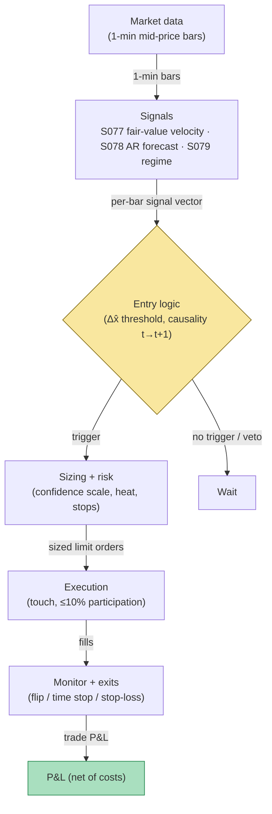

## Stage 151/200 — T051: Kalman Fair-Value Trend

*Batch TB6 · Strategy 51/100 · Signals S077, S078, S079 · Provenance [D/SR]*

### T1. One-line verdict

| | |
|---|---|
| **Style** | Intraday trend-following on a Kalman-filtered fair value, with position size driven by the filter's own confidence |
| **Edge source** | Lag reduction vs moving averages: the local-level Kalman filter extracts the latent (unobserved) fair value from noisy prints faster than an SMA/EMA of comparable smoothness, and its error variance $P_{t\|t}$ tells you how much to bet |
| **Typical holding period** | 30 minutes to a few hours (6-bar time stop on 5-min bars, `example`); exits on fair-value velocity flipping sign |
| **Capacity hint** | Large: trades liquid large-caps on 5-min bars; the bottleneck is per-name $Q/R$ calibration discipline, not market impact |
| **Build-or-buy in one line** | Build — the filter is ~20 lines; no vendor sells your $Q/R$ calibration; buy only Tier-1 1-min bars |

A **Kalman filter** is a recursive estimator for a hidden quantity observed through noise. A **local-level model** is its simplest useful form: the hidden fair value follows a random walk, each observed price equals fair value plus noise. The filter's **Kalman gain** $K_t$ decides how far each new print moves the estimate, and its **error variance** $P_{t|t}$ measures its own uncertainty — a built-in confidence meter. T051 turns the *velocity* of that fair-value estimate ($\Delta\hat{x}_{t|t}$, how fast the fair value itself is moving) into a trend signal, confirmed by an AR(1) forecast (S078) and gated by a regime filter (S079).

### T2. Full mechanics

**Universe & session.** US large-cap equities, regular trading hours (RTH) only: average daily dollar volume (ADV — the mean dollar value traded per day) above $50M and quoted spread at most 3 ticks (`example` cutoffs — a **tick** is the minimum price increment, e.g. 1¢). Excluded: earnings-announcement days, halts, and the first 15 minutes of the session (opening auction noise corrupts the filter's burn-in).

**Entry rule.** All thresholds below are `example`, not institutional standards. Let $y_t$ be the 5-min mid-price close (the **mid-price** is the average of best bid and best ask; using mids instead of last trade prices avoids injecting **bid–ask bounce** — the mechanical up-down flicker between bid and ask — into the state). Run the S077 local-level recursion:

$$\hat{x}_{t|t-1} = \hat{x}_{t-1|t-1},\quad P_{t|t-1} = P_{t-1|t-1} + Q,\quad K_t = \frac{P_{t|t-1}}{P_{t|t-1}+R},$$
$$\hat{x}_{t|t} = \hat{x}_{t|t-1} + K_t\,(y_t - \hat{x}_{t|t-1}),\quad P_{t|t} = (1-K_t)\,P_{t|t-1}.$$

$Q$ is the **process-noise variance** (how much the true fair value moves per bar), $R$ the **observation-noise variance** (how noisy each print is). The entry object is the fair-value velocity $\Delta\hat{x}_{t|t} = \hat{x}_{t|t} - \hat{x}_{t-1|t-1}$:

1. **Trend trigger:** $\Delta\hat{x}_{t|t} > +\theta$ → long; $\Delta\hat{x}_{t|t} < -\theta$ → short, with $\theta = \$0.15$ per 5-min bar on a ~$250 stock (`example`; recalibrate per name, or use the scale-free $z$-velocity $\Delta\hat{x}_{t|t}/\sqrt{P_{t|t}}$ with $\theta_z = 0.5$, `example`).
2. **Forecast confirmation (S078):** the AR(1) one-step forecast $\hat{f}_t = \phi\,r_{t-1}$ must agree in sign with $\Delta\hat{x}_{t|t}$ ($\phi$ re-estimated weekly on a 60-bar window, `example`). This vetoes entries where the fair value is moving but the return autocorrelation says the move is already exhausting.
3. **Regime gate (S079):** the HMM forward-filter posterior for the trending/low-vol state must exceed 0.60 (`example`). In the volatile state, fair-value velocity whipsaws and the strategy stands down.

**Causal timing:** all three quantities are computed at bar $t$'s close using only data $\le t$; the earliest fill is bar $t+1$'s open ($t \to t+1$).

**Exit rule.** First of: (a) **velocity flip** — $\Delta\hat{x}$ crosses zero against the position; (b) **time stop** — 6 bars (`example`); (c) **stop-loss** — adverse excursion beyond 2× the trailing 20-bar mean absolute bar range (`example`).

**Position sizing.** Confidence-scaled: $q_t = \mathrm{round}(q_{\mathrm{base}}\sqrt{P_{\mathrm{ref}}/P_{t|t}}/100)\times 100$, with $q_{\mathrm{base}} = 500$ shares and $P_{\mathrm{ref}} = 0.14$ (`example`). When the filter is uncertain ($P_{t|t}$ high, e.g. right after burn-in), size shrinks automatically. Caps: $250k notional per name, portfolio **heat** (total capital at risk across positions) ≤ 20% of NAV (`example`).

**Risk limits.** Daily loss stop: −2% of NAV → flatten and stand down (`example`). Max gross leverage 1.5× (`example`). **Kill switch:** if the realized innovation variance $(y_t-\hat{x}_{t|t-1})^2$ exceeds 3× its trailing median for 3 consecutive bars, flatten everything — the calibrated $Q/R$ no longer describes the market (`example`).

**Cost model (applied explicitly in T4).** Assumed round-trip cost $0.027$/share = 2¢ effective spread + $0.0035$/share/side exchange+broker fees (`example`). **Slippage** (extra cost from the price moving while your order works) is modeled as $0$ in the toy example — stated as optimistic below. No borrow cost: the universe excludes hard-to-borrow names.

**Order/execution sketch.** Entries as post-only limit orders at the touch (the best bid/ask), participation capped at 10% of trailing 1-min volume (`example`); if unfilled after 2 bars, cancel (the signal has decayed). Exits on velocity flips are marketable limits. **Queue-position honesty:** resting at the touch during a fast move gets **adversely selected** (filled exactly when the price runs through you) — live fills are worse than the toy's next-bar-open fills.

### T3. Signals it consumes

| Signal | Role | Weight / logic |
|---|---|---|
| S077 — Kalman-filtered fair value (local-level trend) [D] | Primary trigger (direction) | Enter long/short on $\Delta\hat{x}_{t|t}$ crossing $\pm\theta$ (`example`) |
| S078 — AR(1)/ARMA return forecast & innovation [D/SR] | Confirmation filter | Enter only if $\mathrm{sign}(\hat{f}_t) = \mathrm{sign}(\Delta\hat{x}_{t|t})$; skips entries where the move looks like a one-bar spike |
| S079 — HMM regime-switching [D] | Regime gate (veto) | Trade only when the trending/low-vol posterior $> 0.60$ (`example`); stand down otherwise |

Combination pseudocode (≤25 lines):

```
each closed 5-min bar t (RTH, liquid large-caps):
    y = mid-price close(t)
    (x_hat, P, dx) = kalman_update(y, Q, R)      # S077 local-level
    f_hat = phi * r[t-1]                          # S078 AR(1) forecast
    pi_trend = hmm_forward_filter(returns)        # S079 posterior
    if pi_trend < 0.60: continue                  # regime veto (example)
    if sign(f_hat) != sign(dx): continue          # forecast disagrees: skip
    if flat and dx > +0.15:  enter LONG  at next open   # example theta
    if flat and dx < -0.15:  enter SHORT at next open
    if long  and (dx < 0 or held >= 6): exit at next open
    if short and (dx > 0 or held >= 6): exit at next open
    q = round(500 * sqrt(0.14 / P) / 100) * 100   # confidence sizing (example)
```

### T4. Worked example — numbers + P&L (SYNTHETIC)

**Setup (all synthetic, seed 151 = `np.random.default_rng(151)`).** 20 bars of 5-min mid-prices for a fictional $250 large-cap, Kalman $Q=0.04$, $R=0.64$ (`example` calibration — slower than S077's, so the fair value is smooth enough to trend-follow), entry $|\Delta\hat{x}| > 0.15$, velocity-flip or 6-bar time-stop exit, fills at next-bar open = previous close (no-gap toy assumption), cost $0.027$/share round-trip. S078/S079 gates are assumed passed for illustration.

| bar | mid $y_t$ | fair value $\hat{x}_{t|t}$ | $P_{t\|t}$ | $\Delta\hat{x}$ | action |
|---|---|---|---|---|---|
| 0–2 | 250.006 / 250.331 / 250.657 | 250.006 / 250.125 / 250.284 | 0.330 / 0.234 / 0.192 | 0 / +0.119 / **+0.160** | **LONG 400 @ 250.6571** (bar 3 open) |
| 3–8 | 251.886 / 252.017 / 253.154 / 253.963 / 253.252 / 252.795 | 250.711 / 251.034 / 251.535 / 252.094 / 252.356 / 252.455 | → 0.144 | all > 0 | hold |
| 9 | 251.524 | 252.247 | 0.143 | −0.207 | exit: time stop (6 bars) @ **252.7948** (bar 9 open) |
| 10–15 | 250.948 / 250.722 / 250.535 / 249.717 / 250.420 / 251.169 | 251.959 / 251.685 / 251.431 / 251.052 / 250.912 / 250.969 | → 0.141 | −0.288 … +0.057 | **SHORT 500 @ 251.5244** (bar 10 open, on bar-9 $\Delta\hat{x}=-0.207$) |
| 16 | 251.461 | 251.077 | 0.141 | +0.109 | exit: velocity flip @ **251.1686** (bar 16 open) |
| 17–19 | 252.038 / 252.663 / 253.745 | 251.289 / 251.593 / 252.068 | 0.141 | +0.212 / +0.303 / +0.475 | **LONG 500 @ 252.0380** (bar 18 open); end-of-window flat @ **253.7449** |

**Line-by-line P&L.** Costs are $0.027$/share round-trip (`example`).

- Trade 1 (long 400): gross = 400 × (252.7948 − 250.6571) = **+$855.08**. Cost = 400 × 0.027 = $10.80. **Net = +$844.28.**
- Trade 2 (short 500): gross = −500 × (251.1686 − 251.5244) = **+$177.90**. Cost = 500 × 0.027 = $13.50. **Net = +$164.38.**
- Trade 3 (long 500): gross = 500 × (253.7449 − 252.0380) = **+$853.44**. Cost = $13.50. **Net = +$839.94.**
- **Total: gross +$1,886.42, costs $37.80, net +$1,848.60.** The chart `images/T051_example.png` plots these exact prices, the fair-value path, entry/exit markers, and this equity curve.

**Where the example is optimistic.** (1) The drift regimes were *designed* to be strong relative to noise — the toy tape trends cleanly; real 5-min bars chop far more, which is exactly when $\Delta\hat{x}$ whipsaws across $\pm\theta$. (2) Fills at next-bar open = previous close assumes zero gap and zero slippage; the velocity-flip exit in particular fills worse live because the flip is detected *after* the adverse move. (3) No partial fills, no queue-position adverse selection, and the confidence sizing barely varies here ($P_{t|t}$ converges in ~5 bars, so sizing is nearly flat — the confidence channel matters most in the first bars of a session, not shown). (4) $\theta=0.15$ was chosen on this same toy tape; selecting it on the evaluation window is **in-sample optimism** — production thresholds need purged walk-forward (S088). (5) The S078/S079 gates were assumed passed; a real run would veto some of these trades.

### T5. Data & infra — what must run

**Pipeline inventory.** Pre-open: pull 1-min mid bars (Tier-1 vendor), run corporate-action adjustment, estimate $Q/R$ per symbol on the trailing 20 sessions (bounce variance for $R$, low-frequency variance minus noise for $Q$), refit $\phi$ and the HMM weekly. Intraday loop: every 5-min bar close — ingest, run the predict/update step (~1 ms per symbol vectorized), evaluate gates, emit orders. Post-close: log innovations vs realized, walk-forward the $Q/R$ and $\theta$ grids with purged/embargoed splits (S088).

**M5 Max feasibility: feasible (Tier M+, ~40–100 h ≈ $6,000–$15,000 loaded-cost estimate at $150/hr, per cost-model §5** — the filter loop is Tier M (20–60 h); the strategy harness, cost model, and risk layer push it to M+). Throughput (cost-model §2): a 500-symbol 5-min Kalman update is ~1–20 ms vectorized in numpy — enormous headroom; bottleneck is calibration design, not compute. RAM (cost-model §3): two floats of state per symbol; even a 500 × 252 estimation panel is ~1 MiB — trivial inside the 77 GB working budget. Storage: 1-min bars for 500 symbols ≈ 50 MB/day (cost-model §4) — archive freely.

**Feed-outage safe mode.** If bars go stale > 5 minutes (`example`): stop opening new positions; do *not* keep updating the filter on repeated last prices (that would collapse $P_{t|t}$ and fake confidence); hold existing positions against their stop-losses, and flatten everything if the outage exceeds 30 minutes (`example`) or if the kill-switch innovation check cannot be evaluated. Never trade on a frozen fair value.

### T6. Buy vs build

| Option | What you get | Indicative price | Gains | Loses |
|---|---|---|---|---|
| Retail platform (QuantConnect LEAN) | Backtest/live harness, minute data | ~$0–$96/mo | Fastest prototype; paper trading built in | You still write the filter, $Q/R$ calibration, and risk layer |
| Tier-1 data + own Python stack (Polygon/Alpaca SIP) | 1-min/real-time bars | ~$30–200/mo | Everything the filter needs; full control of thresholds | You own the engineering |
| Tier-2 professional (Databento) | L1 quotes, imbalance feeds | ~$200/mo + usage | True quote-mid inputs, better $R$ calibration | Overkill for the basic filter |
| "Buy the strategy" (vendor signal) | A Kalman-trend black box | n/a — none serious exists | — | You cannot buy someone else's $Q/R$; the calibration *is* the product |

*All prices indicative — verify before budgeting.*

**Verdict: build.** The filter is twenty lines; the S078/S079 gates are standard library calls (`statsmodels`, `hmmlearn`); no vendor sells a calibrated per-name $Q/R$ because it cannot be transferred across universes. **Buy** Tier-1 bars (~$30–200/mo, indicative) and spend the budget on walk-forward calibration rigor instead of fancier data.

### T7. Success-ratio evidence

| Study / source | Market & period | Metric | Before/after cost | Caveat |
|---|---|---|---|---|
| Benhamou (2016), "Trend Without Hiccups — A Kalman Filter Approach", SSRN | S&P 500 mini-future | Basic KF models ≈ $20k net/1 yr; combined smoothing+extremum model ≈ **$40k net/1 yr**, max drawdown −$7.3k → −$2.6k | Reported "net", cost detail unavailable — treat as before-cost-grade | Parameters "obtained by general optimization… best possible choice" — in-sample optimization; the paper itself flags overfit risk |
| Bel Hadj Ayed et al. (2015), arXiv:1504.03934 | Latent OU trend model | Closed-form likelihood; quantifies damage from **bad calibration** of a misspecified Kalman filter | N/A — methodology | Confirms the chapter's core warning: calibration is the product |
| Bruder, Dao, Richard & Roncalli (2011), SSRN | Multi-asset momentum | Trend-filtering (incl. Kalman-type) methods improve momentum strategy construction | Before/after-cost detail unverified — research lead | Cited via reference list; full text not independently opened |

**Capacity & decay.** No documented capacity ceiling specific to Kalman trend-following on 5-min large-cap bars — the strategy is a smoother, slower cousin of time-series momentum (S025), whose documented capacity is large but whose edge has decayed as trend-following crowded (see the momentum-crash literature in T053's sources). The filter itself does not decay; the *threshold edge* decays as more participants trade the same velocity.

**Honest bottom line.** As a standalone trigger this is a *calibration-dependent smoothing edge*: the filter demonstrably lags less than moving averages *given correct parameters*, and $P_{t|t}$-based sizing is genuinely useful infrastructure. For a ≤$1M paper operation it is one of the cheapest strategies in this document to run honestly (data ~$30–200/mo, engineering ~$6k–$15k loaded estimate). An institutional desk would run the same filter but on tick-level mids with per-symbol adaptive $Q/R$ — the retail version keeps ~80% of the idea at ~5% of the cost. Expect after-cost Sharpe in the 0.3–0.8 range on honest walk-forward — a *portfolio component*, not a standalone business (unverified chatbot claim: treat as a prior to test, not a fact).

### T8. Failure modes

1. **$Q/R$ miscalibration** — the dominant failure; too smooth lags turns, too fast chases bounce. *Mitigation:* calibrate $R$ from bounce, $Q$ from low-frequency variance minus noise; walk-forward the ratio with purged splits (S088).
2. **In-sample threshold optimism** — picking $\theta$ on the evaluation window (as this chapter's toy does). *Mitigation:* select thresholds on purged/embargoed walk-forward only; freeze before live.
3. **Gaussianity violation** — jumps break linear-Gaussian assumptions; the filter smears a jump across bars. *Mitigation:* jump-robust pre-filtering (S064); robustified update or regime switch.
4. **Velocity whipsaw in chop** — $\Delta\hat{x}$ oscillates across $\pm\theta$ in range-bound tapes, generating turnover. *Mitigation:* the S079 regime gate (stand down in the volatile state) plus a confirmation requirement (2 consecutive bars beyond $\theta$, `example`).
5. **Forecast-disagreement veto over-fires** — S078's AR(1) sign check can veto the best trends. *Mitigation:* use it as a veto only against *spike* entries ($|z_{\mathrm{innov}}| > 3$, `example`), not as a hard sign filter.
6. **Stale-quote inputs** — filtering last prints instead of mids injects bounce into the state. *Mitigation:* mid-price or microprice (S004) inputs only.
7. **Latency illusion on SIP** — "zero-lag" claims assume the print is tradeable; SIP aggregation delay still applies. *Mitigation:* label latency-sensitive backtests `simulated only — requires MBO/ITCH`.
8. **Confidence misread** — $P_{t|t}$ is *estimation* uncertainty, not *prediction* uncertainty; price can leave the ±2σ band freely. *Mitigation:* size on $P_{t|t}$, stop-loss on realized P&L, never on the band.

### T9. Visuals


*Chart caption: synthetic data — not market data. Watermark reads "SYNTHETIC EXAMPLE" exactly.*



### T10. Sources

1. Benhamou, E. (2016). "Trend Without Hiccups — A Kalman Filter Approach." SSRN. https://papers.ssrn.com/sol3/papers.cfm?abstract_id=2747102 — 4 KF models on the S&P 500 mini-future; combined smoothing+extremum model roughly doubles reported net profit vs. basic models while cutting max drawdown; parameters optimized in-sample (overfit caveat).
2. Bel Hadj Ayed, A., Loeper, G. & Abergel, F. (2015). "Forecasting trends with asset prices." arXiv:1504.03934. https://arxiv.org/abs/1504.03934 — latent trend as unobservable Ornstein–Uhlenbeck process (an **Ornstein–Uhlenbeck process** is a mean-reverting random walk); closed-form likelihood and the cost of bad calibration in a misspecified filter. arXiv ID verified 2026-09-10.
3. Bruder, B., Dao, T.-L., Richard, J.-C. & Roncalli, T. (2011). "Trend Filtering Methods for Momentum Strategies." SSRN. http://papers.ssrn.com/sol3/papers.cfm?abstract_id=2289097 — trend-filtering methods (including Kalman-type filters) applied to momentum strategy construction; cited via reference list, full text not independently opened.

**Unverified leads** (not confirmed facts — verify before use):
- Kalman, R.E. (1960) original filter paper and Harvey, A.C. (1989) *Forecasting, Structural Time Series Models and the Kalman Filter* — canonical references per the signal report; specific editions/URLs not verified in this pass.
- HF stat-arb reference arXiv 2210.15448 cited in the signal report — not independently opened.
- Grok Q-TB6-1/Q-TB6-2/Q-TB6-3 claims on vol-managed momentum doubling Sharpe (Barroso & Santa-Clara 2015) — named-only, no URL captured; treat as a research lead.

*Source log: Grok answered Q-TB6-1..3 (2026-09-10); all claims independently verified or labeled unverified.*
