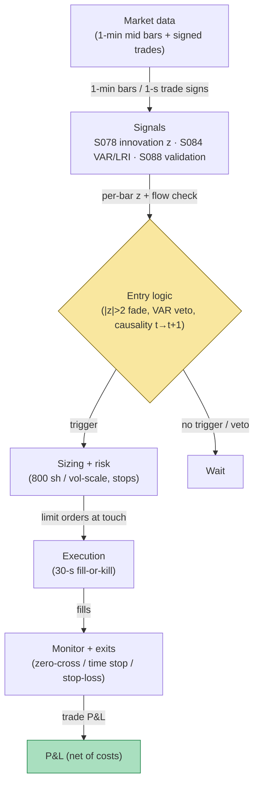

## Stage 152/200 — T052: AR/ARMA Innovation Trader

*Batch TB6 · Strategy 52/100 · Signals S078, S084, S088 · Provenance [D/SR]*

### T1. One-line verdict

| | |
|---|---|
| **Style** | Intraday mean-reversion on forecast **innovations** (surprises), with a trade–quote VAR check that the surprise is liquidity noise rather than informed flow |
| **Edge source** | Short-horizon return predictability is mostly microstructure: bid–ask bounce and temporary impact mean-revert; the VAR filter separates revertable surprises from permanent (informed) repricing |
| **Typical holding period** | 1–10 minutes (exit at innovation zero-cross or 5-bar time stop, `example`) |
| **Capacity hint** | Small-to-medium: 1-min fades on liquid large-caps; edge per trade is a few basis points, so costs dominate below ~$1–2M turnover discipline |
| **Build-or-buy in one line** | Build the AR/innovation layer on retail bars; buy L1/trade-sign data if you want an honest VAR rather than the toy flow proxy |

An **AR(1)** (first-order autoregressive) model says today's return is a fraction $\phi$ of yesterday's plus noise: $r_t = c + \phi\,r_{t-1} + \varepsilon_t$. An **ARMA(p,q)** adds moving-average terms on past noise. The **innovation** $\hat{\varepsilon}_t = r_t - \hat{f}_t$ is the one-step-ahead forecast error — the "surprise". A **trade–quote VAR** (vector autoregression, Hasbrouck 1991) models quote revisions and signed trades jointly, separating each trade's **permanent impact** (information, doesn't revert) from **temporary impact** (liquidity, reverts). T052 fades large innovations — but only when the VAR says the surprise was liquidity, not information.

### T2. Full mechanics

**Universe & session.** US large-cap equities, RTH, 1-min bars; ADV > $100M (`example`); exclude the first 15 minutes, earnings days, and halts. Mid-prices only — never trade prices.

**Entry rule.** All thresholds are `example`, not institutional standards. On 1-min mid-price log returns:

1. **Forecast (S078):** AR(1), $\hat{f}_t = c + \phi\,r_{t-1}$, with $\phi$ re-estimated nightly on a 60-bar rolling window (`example`); innovation $\hat{\varepsilon}_t = r_t - \hat{f}_t$, standardized $z_t = \hat{\varepsilon}_t/\hat{\sigma}_\varepsilon$ with $\hat{\sigma}_\varepsilon = 3.0$ bp (`example`).
2. **Innovation trigger (fade):** $z_t < -2$ → long; $z_t > +2$ → short (`example`; the [SR] innovation rule from S078). This is a bet that the surprise was temporary.
3. **VAR validation (S084):** estimate the Hasbrouck trade–quote VAR $x_t = c + \sum_{\ell=1}^{p} A_\ell x_{t-\ell} + u_t$ on $x_t = (\Delta m_t, q_t)^\top$ (quote revision, signed trade) at 1-s/1-min sampling over the trailing hour, and compute the **long-run impact** $\mathrm{LRI} = e_m^\top (I - \sum A_\ell)^{-1} e_q$ — the permanent price impact of one unexpected trade. Enter only if the current bar's move is **flow-opposed**: $\mathrm{sign}(q\text{-flow}_t) \ne \mathrm{sign}(r_t)$ (toy proxy), i.e. the price moved *against* the signed flow, consistent with liquidity rather than information. Production form: skip if the bar's $|\mathrm{LRI}|$ exceeds its 70th percentile of the trailing 30 days (`example`) — informed flow is repricing permanently, don't fade it.
4. **Cost gate:** enter only if the expected reversion exceeds the round-trip cost: $|\hat{\varepsilon}_t| \times \text{price} > c_{\mathrm{thr}} = \$0.027$/share (`example`, from S078's forecast-direction cost threshold).

**Causal timing:** the innovation at bar $t$ uses only data $\le t$; the earliest fill is bar $t+1$'s open ($t \to t+1$).

**Exit rule.** First of: (a) **zero-cross** — $z$ crosses 0 against the position (the surprise has unwound); (b) **time stop** — 5 bars (`example`); (c) **stop-loss** — adverse move beyond $3\hat{\sigma}_\varepsilon$ (`example`).

**Position sizing.** Fixed 800 shares per trade (`example`), or vol-scaled $q = \mathrm{risk\$}/(\hat{\sigma}_\varepsilon \times \mathrm{price})$ with $\mathrm{risk\$} = \$600$ per trade (`example`). Caps: $200k notional per name, ≤ 10 concurrent positions (`example`).

**Risk limits.** Daily loss stop −1.5% NAV (`example`). Max gross 1.0× — this is a small-edge, high-turnover book; leverage would amplify the cost bleed. **Kill switch:** if the AR(1) $\hat{\phi}$ flips sign intraday or the innovation variance doubles vs trailing (`example`), the microstructure regime has changed — flatten and stand down.

**Cost model (applied explicitly in T4).** Round-trip $0.027$/share = 2¢ effective spread + $0.0035$/share/side fees (`example`). Market impact modeled as $\psi\,\sigma\sqrt{q/V}$ with $\psi = 0.5$ (`example`) — set to zero in the toy and disclosed as optimistic.

**Order/execution sketch.** Fade entries as limit orders at the touch; the innovation is freshest in the first seconds after the bar closes, so use a 30-second fill-or-kill discipline (`example`) then cancel — a fade that can't get filled at the touch is already stale. Exits on zero-cross are marketable limits. **Queue-position honesty:** fading at the touch means providing liquidity exactly when someone informed may be taking it — the toy's fills ignore this adverse selection.

### T3. Signals it consumes

| Signal | Role | Weight / logic |
|---|---|---|
| S078 — AR(1)/ARMA forecast & innovation [D/SR] | Primary trigger (direction + timing) | Fade: long if $z_t < -2$, short if $z_t > +2$ (`example`); exit at $z$ zero-cross |
| S084 — Hasbrouck trade–quote VAR [D] | Informed-flow veto (validation) | Enter only if the move is flow-opposed (toy) / bar LRI ≤ 70th pct of 30-day (`example` production) |
| S088 — Purged / embargoed CV [D] | Offline validator | $\phi$, $z$-entry, and the LRI percentile are selected on purged/embargoed walk-forward, never on the evaluation window |

Combination pseudocode (≤25 lines):

```
each closed 1-min bar t (RTH, liquid large-caps):
    r = log(mid[t]/mid[t-1])                        # mid-prices only
    f_hat = c + phi * r[t-1]                        # S078 AR(1)
    z = (r[t] - f_hat) / sigma_eps                 # innovation z-score
    if abs(z) <= 2.0: continue                      # example entry
    side = LONG if z < 0 else SHORT                 # fade the surprise
    if sign(signed_flow[t]) == sign(r[t]): continue # S084: informed, veto
    if abs(r[t]-f_hat)*price <= 0.027: continue     # S078 cost gate (example)
    enter side at next open, q = 800 shares         # example size
    exit at next open when z crosses 0 or held >= 5 # zero-cross / time stop
    stop: adverse move > 3*sigma_eps -> flatten     # example stop
```

### T4. Worked example — numbers + P&L (SYNTHETIC)

**Setup (all synthetic, seed 152 = `np.random.default_rng(152)`).** 12 bars of 1-min mid-prices for a fictional $250 large-cap: seed-driven background noise plus three designed events. AR(1) with $\phi = 0.15$, $c = 0$, $\hat{\sigma}_\varepsilon = 3.0$ bp (`example`); entry $|z| > 2$; VAR gate = flow-sign opposition (toy proxy for the S084 LRI check); fills at next-bar open = previous close (no-gap toy); cost $0.027$/share round-trip; 800 shares per trade.

| bar | $r_t$ (bp) | innov. (bp) | $z_t$ | flow | gate |
|---|---|---|---|---|---|
| 0–2 | −0.97 / −0.05 / −0.78 | — / +0.10 / −0.78 | 0 / +0.03 / −0.26 | buy / buy / sell | no fire |
| 3 | **−9.00** | −8.88 | **−2.96** | buy (opposed) | **LONG 800 @ 249.7301** (bar 4 open) |
| 4 | −0.63 | +0.72 | +0.24 | buy | exit: zero-cross @ **249.7143** (bar 5 open) |
| 5–6 | +0.41 / **+6.50** | +0.51 / +6.44 | +0.17 / **+2.15** | buy / buy (confirmed) | **VETOED** — flow confirms the move (informed) |
| 7–8 | −2.73 / **+7.80** | −3.70 / +8.21 | −1.23 / **+2.74** | buy / sell (opposed) | **SHORT 800 @ 250.0137** (bar 9 open) |
| 9 | +0.51 | −0.66 | −0.22 | buy | exit: zero-cross @ **250.0264** (bar 10 open) |
| 10–11 | +0.34 / +0.16 | +0.26 / +0.11 | +0.09 / +0.04 | sell / sell | no fire |

**Line-by-line P&L.**

- Trade A (long 800): gross = 800 × (249.7143 − 249.7301) = **−$12.57**. Cost = 800 × 0.027 = $21.60. **Net = −$34.17.**
- Trade B (short 800): gross = −800 × (250.0264 − 250.0137) = **−$10.22**. Cost = $21.60. **Net = −$31.82.**
- **Total: gross −$22.79, costs $43.20, net −$65.99 (≈ −$66.00).** The chart `images/T052_example.png` plots the innovation $z$ series with entry/veto/exit marks and this equity path.

**The vetoed trade (counterfactual, for honesty):** fading the bar-6 informed jump would have been short @ 249.8870, exiting at bar 8 open @ 249.8188 on $z$ sign flip: gross +$54.57, net **+$32.97** after costs. The gate skipped a winner *this time* — vetoes cost opportunity; their value is statistical, not per-trade.

**Where the example is optimistic.** (1) Both fades fired on correctly-signed, flow-opposed innovations — and still lost money: the surprises reversed only ~0.7 bp the next bar, far below the 2.7¢/share cost. This is the chapter's central lesson, not a bug: at these magnitudes the strategy needs the **cost gate** $c_{\mathrm{thr}}$ from S078's forecast-direction rule, which the toy's pure-innovation rule omits. (2) The flow-sign proxy is a cartoon of the S084 VAR — a real LRI estimate needs signed trade data and careful sampling, and estimation noise eats the filter's value. (3) Fills at next-bar open ignore the adverse selection of providing liquidity into a spike; real fade fills are worse. (4) The three events were placed by design; the $|z|>2$ threshold was not tuned out-of-sample. (5) Impact $\psi\sigma\sqrt{q/V}$ was set to zero.

### T5. Data & infra — what must run

**Pipeline inventory.** Pre-open: 1-min mid bars (Tier-1), corporate-action adjustment, nightly AR(1)/ARMA refit per symbol on 60-bar windows with AIC/BIC order checks (`example`), hourly VAR re-estimation on signed trade+quote data (needs L1/trade-sign feed — Tier 2). Intraday loop: every 1-min close — compute innovation $z$, evaluate flow gate, emit/cancel orders within seconds (the fade decays fast). Post-close: purged/embargoed walk-forward of $\phi$, $z$-entry, and the LRI percentile (S088); monitor realized innovation variance for regime breaks.

**M5 Max feasibility: feasible (Tier M+, ~40–100 h ≈ $6,000–$15,000 loaded-cost estimate at $150/hr, per cost-model §5** — the AR layer is Tier M; the VAR estimation, signed-trade plumbing, and execution discipline push it to M+). Throughput (cost-model §2): AR(1) on 500 symbols × 390 bars is ~195k trivial updates; the VAR refit (OLS on ~3,600 1-s observations × 500 names, hourly) is minutes in polars — fine. Bottleneck: signed-trade data licensing and the low-latency order path, not compute. RAM (cost-model §3): 1-min bars for 500 symbols ≈ 50 MB/day; VAR panels per symbol are small — fits easily. What breaks first at 500 symbols: the VAR's data appetite (L1/trade signs for 500 names) and the engineering of the per-minute decision loop.

**Feed-outage safe mode.** If 1-min bars stall: cancel all resting fade orders immediately (a fade without fresh innovations is a blind limit order), flatten open fades at market after 5 stale minutes (`example`) — mean-reversion positions held through a data hole become directional bets. Do not re-enter until the AR and VAR estimates have 60 fresh bars.

### T6. Buy vs build

| Option | What you get | Indicative price | Gains | Loses |
|---|---|---|---|---|
| Tier-0/1 retail (Alpaca/Polygon bars) | 1-min bars, no trade signs | ~$0–200/mo | Enough for the AR/innovation layer and the toy flow proxy | No honest VAR — signed trade data missing |
| Tier-2 professional (Databento MBP-1) | L1 quotes + trades, honest signs | ~$200/mo + usage | Real Hasbrouck VAR, real LRI gate | Usage costs scale with universe |
| Retail platform (QuantConnect) | Backtest harness, minute data | ~$0–$96/mo | Fast prototype of the innovation rule | No signed-flow data; execution realism limited |
| Institutional (full TAQ/TotalView) | Production tick + depth | $$$$ institutional | Production-grade VAR | Absurd for a ≤$1M paper op |

*All prices indicative — verify before budgeting.*

**Verdict: build the innovation layer, buy the data tier you can justify.** The AR(1) fade is an afternoon's work on Tier-0/1 bars; the VAR gate is where the money goes — **buy** Databento-class L1 (~$200/mo + usage, indicative) if you want the filter to be real rather than the toy's sign proxy. Crossover: if you cannot afford signed trade data, run the innovation rule with a wider $z$-entry (±2.5–3, `example`) and a strict cost gate instead of pretending the VAR exists.

### T7. Success-ratio evidence

| Study / source | Market & period | Metric | Before/after cost | Caveat |
|---|---|---|---|---|
| Hasbrouck (1991), *Journal of Finance* | NYSE stocks | Trades carry significant information; quote revisions respond to trade innovations with measurable permanent impact (the LRI machinery this strategy's gate is built on) | N/A — microstructure estimation, not a P&L backtest | Establishes the *filter*, not the fade's profitability |
| Roll (1984), *Journal of Finance* | Efficient-market model | Under a constant spread $s$, trade-price changes have $\mathrm{Cov}(\Delta p_t,\Delta p_{t-1}) = -s^2/4$ — the AR(1) coefficient on *trade* prices is mechanically negative | N/A — theory | The reason this strategy must run on mids: most naive "AR profits" on trade prices are bounce artifacts, not edge |
| Bouchaud, Gefen, Potters & Wyart (2004), *Quantitative Finance* | Paris Bourse | Price response to trades is concave and largely permanent; fluctuations and response tied through a fluctuation-response relation | N/A — empirical microstructure | Warns the fade: a sizable share of every "surprise" is permanent impact — exactly what the VAR gate must filter |

**Capacity & decay.** Short-horizon AR predictability on mid-prices is one of the most crowded micro-edges in equities; documented decay is continuous rather than dated — as more participants fade the same innovations, the reversion horizon compresses toward the spread. The VAR-informed variant (fade only liquidity surprises) decays slower but needs the data hardly anyone at retail scale licenses.

**Honest bottom line.** As a standalone trigger the AR(1) fade is a *cost-dominated micro-edge*: the toy's −$66.00 on two textbook setups is representative — gross edges of a few basis points vs 2.7¢/share costs means the strategy lives or dies on the cost gate and the VAR filter, not the AR fit. For a ≤$1M paper operation this is a research strategy, not a P&L strategy: build it to learn the microstructure plumbing, size it tiny, and expect after-cost Sharpe near zero until the VAR gate is honest. An institutional desk runs the same fade with maker rebates, better queue position, and full trade-sign data — structural advantages a retail build cannot replicate. (Unverified chatbot claim: none used for performance — Grok's Q-TB6-3 numbers on LOB models were about DeepLOB, not this strategy.)

### T8. Failure modes

1. **Bounce confusion** — running the AR on trade prices instead of mids manufactures negative autocorrelation (Roll 1984). *Mitigation:* mid-price inputs only; verify $\hat{\phi}$ collapses when switching from trades to mids.
2. **VAR estimation noise** — the LRI gate is an estimated quantity; a noisy gate vetoes randomly. *Mitigation:* shrink the VAR coefficients, use the 70th-percentile rule on long trailing windows, and monitor the gate's hit rate out-of-sample.
3. **Informed-flow fade (adverse selection)** — fading a surprise that turns out to be information. *Mitigation:* the S084 gate itself, plus the stop-loss at $3\hat{\sigma}_\varepsilon$; never average a fade.
4. **Cost-model optimism** — 2.7¢/share is a calm-market number; spreads widen exactly when innovations are largest. *Mitigation:* make $c_{\mathrm{thr}}$ a function of current spread (enter only if $|\hat{\varepsilon}|\times$price $> k \times$ spread, $k=2$, `example`).
5. **Overfit $\phi$ / $z$-entry** — 60-bar rolling fits chase noise; the toy's threshold was design-chosen. *Mitigation:* purged/embargoed walk-forward (S088) for all parameters; freeze before live.
6. **Regime breaks in $\phi$** — autocorrelation structure changes with volatility regimes. *Mitigation:* the kill switch on innovation-variance doubling; re-estimate $\phi$ on shorter windows in stress.
7. **Latency on SIP** — the fade's edge lives in the first seconds after the bar; SIP aggregation delay eats it. *Mitigation:* label SIP backtests `simulated only — requires MBO/ITCH`; co-locate or accept the decay.
8. **Veto opportunity cost** — as the toy showed, the gate skips winners too. *Mitigation:* track vetoed-trade counterfactuals; if vetoes cost more than they save over a quarter, widen the LRI percentile.

### T9. Visuals


*Chart caption: synthetic data — not market data. Watermark reads "SYNTHETIC EXAMPLE" exactly.*



### T10. Sources

1. Hasbrouck, J. (1991). "Measuring the Information Content of Stock Trades." *Journal of Finance*, 46(1), 179–207. http://ideas.repec.org/a/bla/jfinan/v46y1991i1p179-207.html — the trade–quote VAR: quote revisions respond to trade innovations; permanent vs temporary impact decomposition that this strategy's validation gate is built on.
2. Roll, R. (1984). "A Simple Implicit Measure of the Effective Bid-Ask Spread in an Efficient Market." *Journal of Finance*, 39(4), 1127–1139. https://authors.library.caltech.edu/records/afwsc-6bb61 — under a constant spread, trade-price changes are mechanically negatively autocorrelated ($\mathrm{Cov} = -s^2/4$): the reason the AR layer must run on mid-prices.
3. Bouchaud, J.-P., Gefen, Y., Potters, M. & Wyart, M. (2004). "Fluctuations and response in financial markets: the subtle nature of 'random' price changes." *Quantitative Finance*, 4(2), 176–190. http://ideas.repec.org/p/arx/papers/cond-mat-0307332.html — concave, largely permanent price response to trades; warns that much of every "surprise" is information, not noise.

**Unverified leads** (not confirmed facts — verify before use):
- Box, G.E.P. & Jenkins, G.M. (1970). *Time Series Analysis: Forecasting and Control* — canonical AR/ARMA reference per the signal report; edition/URL not verified in this pass.
- Tsay, R.S. (2005). *Analysis of Financial Time Series* — canonical intraday time-series reference per the signal report; URL not verified in this pass.
- Grok Q-TB6-1's worked confusion-matrix walk for DeepLOB (F1 83.4% FI-2010 claim) — relevant to batch TB6 but not to this strategy's evidence; treat as a research lead.

*Source log: Grok answered Q-TB6-1..3 (2026-09-10); all claims independently verified or labeled unverified.*
